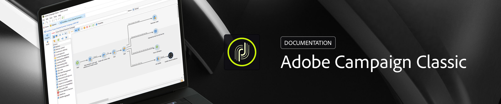

# Campaign Classic v7 ドキュメント {#campaign-classic-documentation}

<!-- -->

## 新機能

Adobe Campaign Classic v7 製品およびドキュメントの最新の機能強化の概要を説明します。 機能、改善点、修正の包括的なリストについては、詳細な[リリースノート](rn/using/latest-release.md)を参照してください。

>[!BEGINTABS]

>[!TAB 2026年6月リリースが公開されました。]

Campaign Classic v7.4.3 - 2026年6月ビルドには、前回のリリースに加え、セキュリティアップデートが含まれています。

>[!TAB Adobe IMS への移行]

セキュリティと認証プロセスを強化するために、Adobe Campaign では、エンドユーザーの認証モードをログインおよびパスワードによるネイティブ認証から Adobe Identity Management System（IMS）に移行することを強くお勧めしています。

>[!TAB プッシュチャネルの変更]

Android Firebase Cloud Messaging（FCM）サービスに対するいくつかの重要な変更は、2024 年にリリースする予定であり、Adobe Campaign の実装に影響を与える場合があります。 この変更をサポートするには、Android プッシュメッセージの購読サービス設定を更新する必要がある場合があります。 今すぐ確認し、実行できます。

{target="_blank"}

>[!ENDTABS]

## 基本を学ぶ

<table style="table-layout:fixed">
  <tr style="border: 0;">
    <td>
    </a>
    
<strong>Adobe Campaign を起動</strong> Campaign クライアントコンソールを起動し、Campaign アプリケーションサーバーに接続する方法を説明します。

    </td>
    <td>
    
    
<strong>プロファイルの追加と管理</strong> Adobe Campaign v7 データベースで簡単にプロファイル管理を調べます。 手動またはインポートによるプロファイルの追加、顧客データの絞り込み、キャンペーンのカスタマイズを簡単に行うことができます。

    </td>
    <td>
    
    
<strong>ワークフローを使用した自動化</strong> ワークフローを活用して、セグメント化、キャンペーンの実行、ファイル処理、人間の関与などのプロセスをデザインする方法について説明します。
    
</td>
    <td>
    
    
<strong>配信の作成</strong> メール、SMS、プッシュ通知など、様々なチャネルでメッセージを送信する方法について説明します。

    </td>
  </tr>
  <tr style="border: 0;">
    <td align="center"></td>
    <td align="center"></td>
    <td align="center"></td>
    <td align="center"></td>
    </tr>
</table>

## ドキュメントの参照

<table style="table-layout:auto">
  <tr style="border: 0;">
    <td>
      
     
      <strong>基本を学ぶ</strong> <a href="platform/using/adobe-campaign-workspace.md">ユーザーインターフェイス</a> - <a href="platform/using/launching-adobe-campaign.md">Campaign への接続</a> - <a href="platform/using/get-started-data-import-export.md">データのインポートとエクスポート</a> - <a href="platform/using/access-management.md">権限</a>
    </td>
    <td>
      
     
      <strong>顧客のエクスペリエンス</strong> <a href="workflow/using/about-workflows.md">ワークフローを使用した自動化</a> - <a href="https://experienceleague.adobe.com/docs/campaign/automation/campaign-orchestration/set-up-campaigns.html?lang=ja" target="_blank">マーケティングキャンペーン</a> - <a href="interaction/using/interaction-and-offer-management.md">インタラクションとオファーの管理</a> - <a href="delivery/using/about-personalization.md">パーソナライゼーション</a> - <a href="reporting/using/about-adobe-campaign-reporting-tools.md">レポート</a>
    </td>
    <td>
      
     
      <strong>メッセージの送信</strong> <a href="delivery/using/communication-channels.md">通信チャネル</a> - <a href="delivery/using/steps-about-delivery-creation-steps.md#sending-a-proof">配達確認の送信</a> - <a href="delivery/using/get-started-a-b-testing.md">A/B テスト</a> - <a href="https://experienceleague.adobe.com/ja/docs/campaign/campaign-v8/analytics/tracking/tracking" target="_blank">メッセージトラッキング</a> - <a href="delivery/using/about-deliverability.md">配信品質</a> - <a href="message-center/using/about-transactional-messaging.md">トランザクションメッセージ</a>
    </td>
  </tr>
  <tr style="border: 0;">
    <td>
      
       
      <strong>プロファイルとオーディエンス</strong>  <a href="platform/using/creating-and-managing-lists.md">リストの作成</a> - <a href="delivery/using/about-services-and-subscriptions.md">サービスと購読</a> - <a href="platform/using/privacy-management.md">プライバシーと同意</a>
    </td>
    <td>
      
       
      <strong>アーキテクチャと設定</strong> <a href="production/using/general-architecture.md">アーキテクチャの原則</a> - <a href="production/using/build-upgrade.md">ビルドアップグレードの実行</a> - <a href="production/using/configuration.md">キャンペーンの設定</a> - <a href="installation/using/external-accounts.md">外部システムへの接続</a>
    </td>
    <td>
      
       
      <strong>開発者リソース</strong> <a href="configuration/using/about-data-model.md">データモデルの説明</a> - <a href="configuration/using/about-schema-reference.md">スキーマの構造</a> - <a href="configuration/using/editing-forms.md">スキーマの構造</a> - <a href="configuration/using/about-web-services.md">API</a> - <a href="https://experienceleague.adobe.com/developer/campaign-api/api/index.html?lang=ja">JSAPI 参照ドキュメント</a> - <a href="configuration/using/about-custom-recipient-table.md">カスタム受信者テーブル</a>
    </td>
  </tr>
</table>

## その他のリソース

[エラーメッセージのリスト](https://experienceleague.adobe.com/developer/campaign-errors/error_codes.html?lang=ja) - [Adobe Campaign 製品説明](https://helpx.adobe.com/jp/legal/product-descriptions/adobe-campaign-managed-cloud-services.html){target="_blank"} - [互換性マトリックス](rn/using/compatibility-matrix.md) - [チュートリアル](https://experienceleague.adobe.com/docs/campaign-classic-learn/tutorials/overview.html?lang=ja){target="_blank"} - [Campaign コントロールパネル](https://experienceleague.adobe.com/docs/control-panel/using/discover-control-panel/key-features.html?lang=ja){target="_blank"} - [メールトラッキングピクセルと CNIL ガイダンス](https://experienceleague.adobe.com/ja/docs/campaign/campaign-v8/new/cnil-pixel-tracking){target="_blank"}
