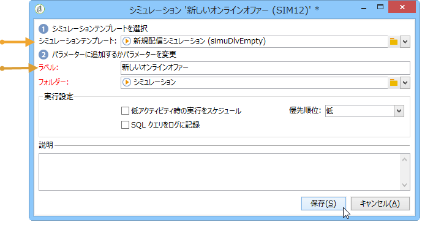
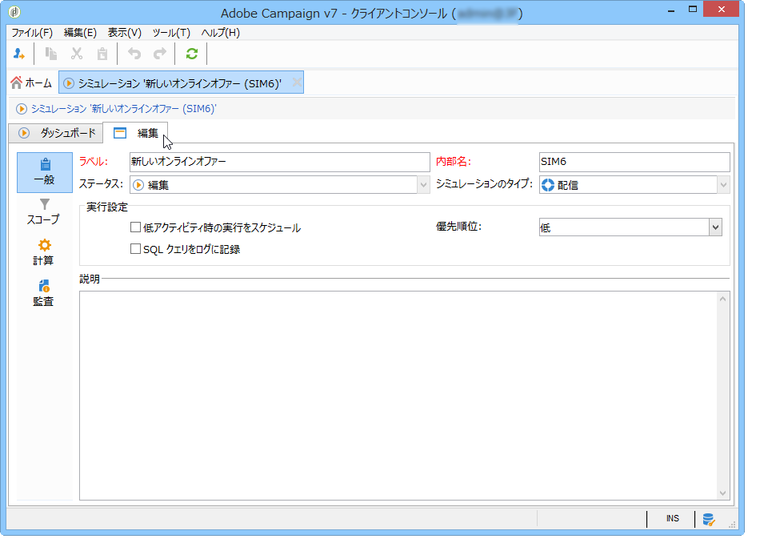
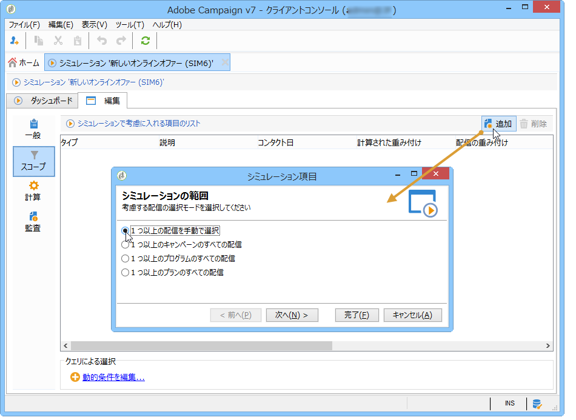
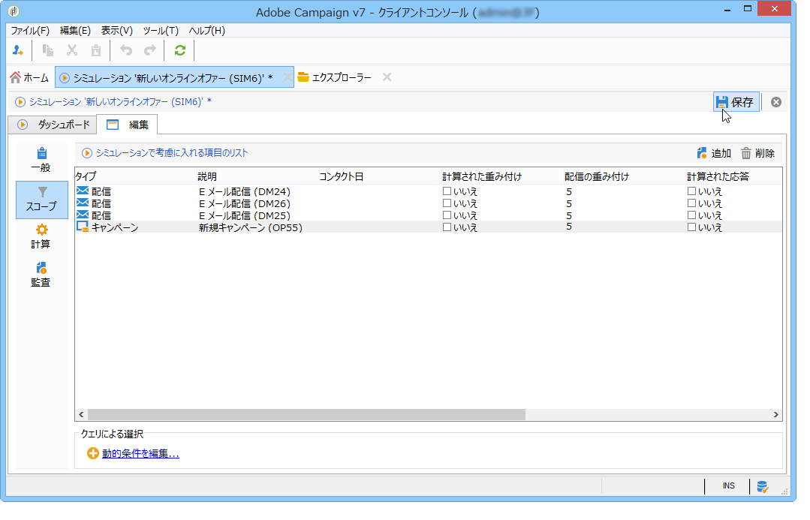
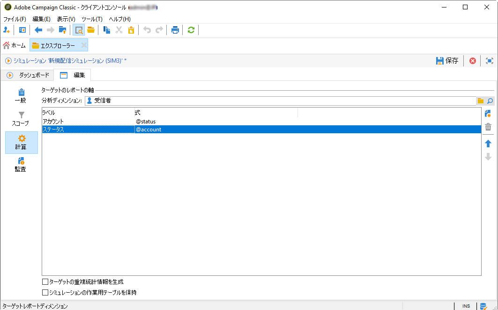
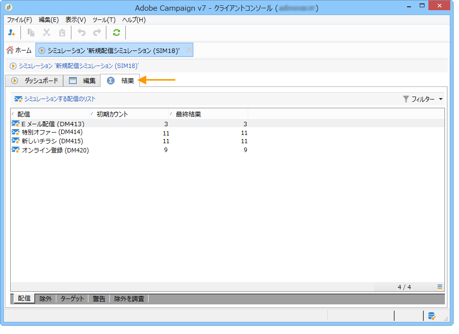
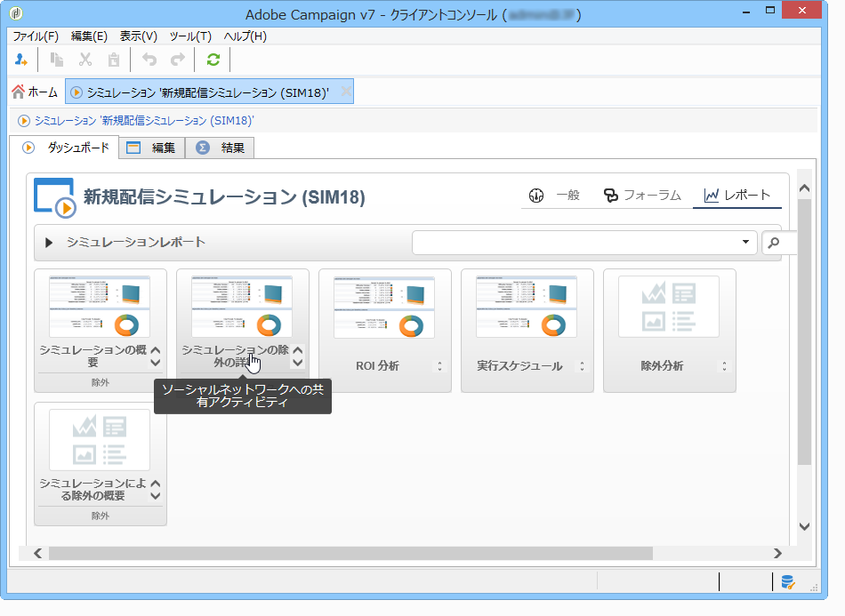
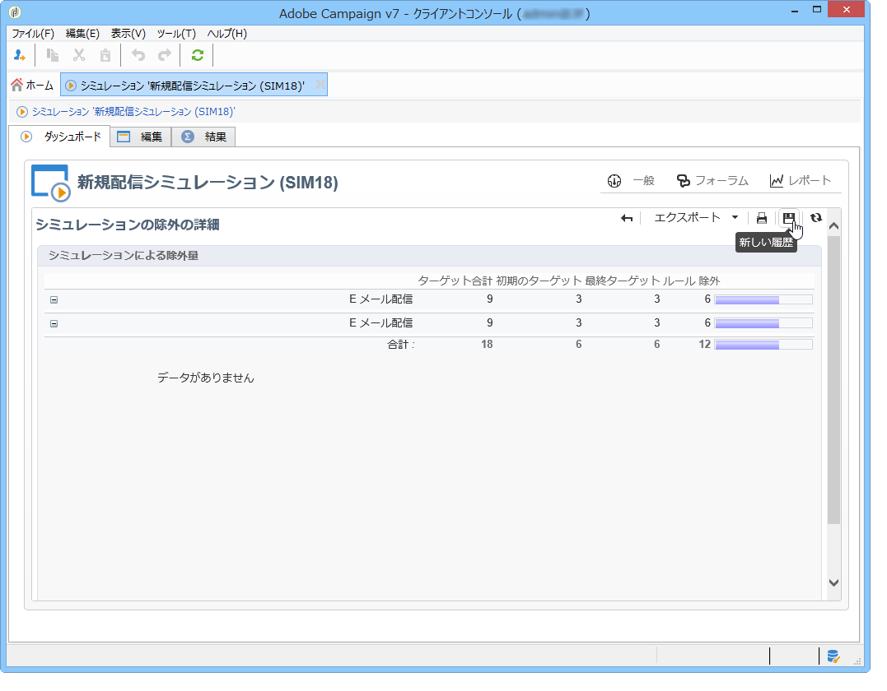
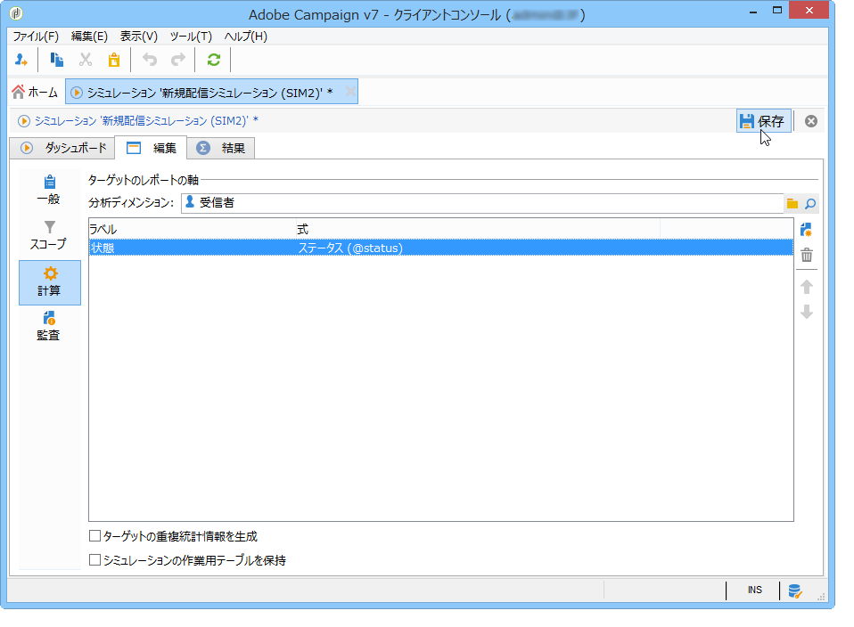
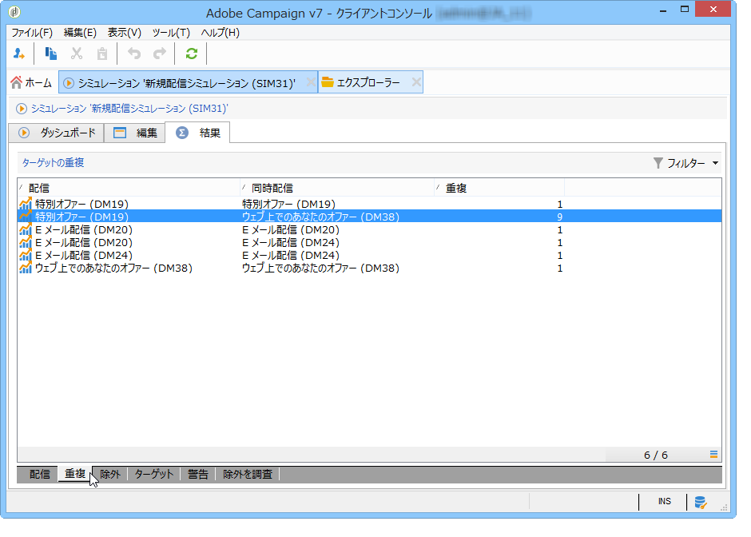

# キャンペーンシミュレーション{#campaign-simulations}

## シミュレーションについて {#about-simulations}

キャンペーンの最適化では、シミュレーションを活用して、キャンペーンプランの効率性をテストできます。このテストにより、発生する売上やタイポロジルールに基づくターゲットのボリュームなど、キャンペーンの成功の可能性を評価できます。

シミュレーションを実行すれば、配信の影響を監視し、比較することができます。

>[!NOTE]
>
>暫定カレンダーで予約されていない限り、テストモードの配信が互いに影響を与えることはありません（分散型マーケティングのキャンペーンを評価する場合など）。\
>したがって、頻度ルールと処理能力ルールが適用されるのは、「**[!UICONTROL ターゲットの推定とメッセージのパーソナライゼーション]**」モードの配信のみになります。「**[!UICONTROL 暫定ターゲットの推定と承認]**」および「**[!UICONTROL ターゲットの評価]**」モードの配信は、考慮されません。\
>配信モードは、配信プロパティの「**[!UICONTROL タイポロジ]**」サブタブで選択します。

## シミュレーションの設定 {#setting-up-a-simulation}

### シミュレーションの作成 {#creating-a-simulation}

シミュレーションを作成するには、次の手順に従います。

1. 「**[!UICONTROL キャンペーン]**」タブを開き、「**[!UICONTROL 作成]**」セクション内の「**[!UICONTROL その他]**」リンクをクリックして、「**[!UICONTROL シミュレーション]**」オプションを選択します。

   

1. テンプレートおよびシミュレーションの名前を入力します。「**[!UICONTROL 保存]**」をクリックして、シミュレーションを作成します。

   

1. 「**[!UICONTROL 編集]**」タブをクリックして、シミュレーションを設定します。

   

1. 「**[!UICONTROL スコープ]**」タブで、このシミュレーションで考慮する配信を指定します。「**[!UICONTROL 追加]**」ボタンをクリックし、考慮する配信の選択モードを指定します。

   

   配信は、1 つずつ選択するか、キャンペーン、プログラムまたはプラン別に並べ替えることができます。

   >[!NOTE]
   >
   >プラン、プログラムまたはキャンペーンの配信を選択する場合は、シミュレーションの開始時に、考慮する配信のリストを自動的に更新することが可能です。リストの自動更新を設定するには、「**[!UICONTROL シミュレーションが開始されるたびに、配信の選択を更新]**」オプションをオンにしてください。
   >  
   >このオプションがオンになっていない場合、シミュレーション作成の時点でプラン、プログラムまたはキャンペーンに含まれていない配信は考慮されなくなります。後で追加された配信はすべて無視されます。

   

1. シミュレーションのスコープに含める項目を選択します。複数の項目を選択する場合は、Shift キーや Ctrl キーを使用できます。

   

   「**[!UICONTROL 完了]**」をクリックして、選択を承認します。

   選択した配信とプラン、プログラムまたはキャンペーンに属する配信を手動で組み合わせることもできます。

   

   必要であれば、「**[!UICONTROL 動的条件を編集...]**」リンクをクリックして、動的条件を使用することができます。.

   「**[!UICONTROL 保存]**」をクリックして、設定を承認します。

   >[!NOTE]
   >
   >シミュレーションの計算では、ターゲットが既に計算されている配信のみが考慮されます（ステータス：**ターゲット準備完了**&#x200B;または&#x200B;**配信準備完了**）。

1. 「**[!UICONTROL 計算]**」タブで、例えば受信者スキーマなど分析ディメンションを選択します。

   

1. その後、式を追加できます。

   

### 実行設定 {#execution-settings}

シミュレーションの「**[!UICONTROL 一般]**」タブでは、実行設定を入力できます。

* 「**[!UICONTROL 低アクティビティ時の実行をスケジュール]**」オプションを使用すると、指定された優先順位に基づいてシミュレーションの開始を延期し、忙しくない時間帯に実行できます。シミュレーションはデータベースのリソースを大量に消費するので、緊急度の低いシミュレーションは夜間などの時間帯に実行するようスケジュールを調整する必要があります。
* 「**[!UICONTROL 優先順位]**」では、シミュレーションの開始を遅らせるかどうか判断する際に基準となるレベルを指定できます。
* 「**[!UICONTROL SQL クエリをログに記録]**」を実行します。SQL ログは、エラーの発生したシミュレーションを診断する際に使用できます。また、シミュレーションに時間がかかる原因も調べることができます。シミュレーションの終了後、「**[!UICONTROL 監査]**」タブにある「**[!UICONTROL SQL ログ]**」サブタブで、記録されたメッセージを表示できます。

## シミュレーションの実行 {#executing-a-simulation}

### シミュレーションの開始 {#starting-a-simulation}

スコープを定義したら、シミュレーションを実行できます。

シミュレーションのダッシュボードを開き、「**[!UICONTROL シミュレーションを開始]**」をクリックしてください。

実行が完了したら、シミュレーションを開き、「**[!UICONTROL 結果]**」タブをクリックして、配信ごとに計算されたターゲットを表示できます。

1. 「**[!UICONTROL 配信]**」サブタブには、シミュレーションで考慮されたすべての配信の一覧が表示されます。この一覧には、2 つのカウントが含まれます。

   * **[!UICONTROL 初期カウント]**&#x200B;は、配信の推定の段階で計算されたターゲットです。
   * **[!UICONTROL 最終結果]**&#x200B;は、シミュレーション後にカウントされた受信者数です。

      2 つのカウントの数値の差は、シミュレーションの前に設定された様々なルールやフィルターの適用結果を反映しています。

      この計算の詳細を確認するには、「**[!UICONTROL 除外]**」サブタブを編集します。

1. 「**[!UICONTROL 除外]**」サブタブでは、除外の分類を表示できます。

   

1. 「**[!UICONTROL 警告]**」サブタブでは、シミュレーション中に生成されたすべてのアラートメッセージがグループごとに表示されます。アラートメッセージは、処理能力を超える場合（ターゲット受信者の数が処理能力を上回る場合など）に送信できます。
1. 「**[!UICONTROL 除外を調査]**」サブタブでは、結果の分析テーブルを作成できます。テーブルを作成する場合は、横軸と縦軸の変数を指定する必要があります。

   分析テーブルの作成例について詳しくは、[結果の参照](#exploring-results)の最後の部分を参照してください。

### 結果の表示 {#viewing-results}

#### 監査 {#audit}

「**[!UICONTROL 監査]**」タブでは、シミュレーションの実行を監視できます。「**[!UICONTROL SQL ログ]**」サブタブには、エキスパートユーザーに役立つ情報が含まれます。SQL 形式で実行ログの一覧を表示できます。それらのログを表示するには、シミュレーションを実行する前に「**[!UICONTROL 一般]**」タブで「**[!UICONTROL SQL クエリをログに記録]**」オプションが選択されている必要があります。

#### 結果を調べる {#exploring-results}

「**[!UICONTROL 除外を調査]**」サブタブでは、シミュレーションによって生成されたデータを分析できます。

記述的分析について詳しくは、[この節](../../reporting/using/about-adobe-campaign-reporting-tools.md)を参照してください。

## シミュレーションの結果 {#results-of-a-simulation}

「**[!UICONTROL ログ]**」タブや「**[!UICONTROL 結果]**」タブの指標は、シミュレーションの結果の概要を示します。さらに詳しく結果を分析するには、「**[!UICONTROL レポート]**」タブを開きます。

### レポート {#reports}

シミュレーションの結果を分析するには、除外と原因を示すレポートを編集します。

デフォルトでは、次のレポートが提供されます。

* **[!UICONTROL シミュレーションの除外の詳細]**：このレポートは、考慮されたすべての配信の除外の理由について詳細なグラフを表示します。
* **[!UICONTROL シミュレーションの概要]**：このレポートは、様々な配信でシミュレーションから除外されたターゲットを表示します。
* **[!UICONTROL シミュレーションによる除外の概要]**：このレポートは、シミュレーションによって発生した除外のグラフに加えて、適用されたタイポロジルールやルールあたりの除外率のグラフを表示します。

>[!NOTE]
>
>新しいレポートを作成し、デフォルトのレポートに追加することができます。詳しくは、[この節](../../reporting/using/about-adobe-campaign-reporting-tools.md)を参照してください。

レポートにアクセスするには、ダッシュボードから対象のシミュレーションの「**[!UICONTROL レポート]**」リンクをクリックします。

また、シミュレーションのダッシュボードからアクセスできる「**[!UICONTROL レポート]**」リンクを使用して、レポートを編集することもできます。

### シミュレーションの比較 {#comparing-simulations-}

シミュレーションを実行するたびに、前のシミュレーションの結果は新しいシミュレーションの結果に置換されるので、複数のシミュレーションの結果を表示して比較することはできません。

シミュレーションの結果を比較するには、レポートを使用する必要があります。Adobe Campaign では、レポート履歴を保存して、後で参照することができます。履歴は、シミュレーションのライフサイクルを通して保存されます。

**例：**

1. タイポロジ **A** が適用されている配信のシミュレーションを作成します。
1. 「**[!UICONTROL レポート]**」タブで、「**[!UICONTROL シミュレーションの除外の詳細]**」など、使用できるレポートを 1 つ選択し、編集します。
1. レポート上部の右にあるセクションで、アイコンをクリックして、新しい履歴を作成します。

   

1. シミュレーションを閉じ、タイポロジ **A** の設定を変更します。
1. 再度シミュレーションを実行し、今回の結果とレポート履歴に保存されている先回の結果を比較します。

   

   レポート履歴は必要に応じて、いくつでも保存することができます。

### レポートの軸 {#reporting-axes}

「**[!UICONTROL 計算]**」タブでは、ターゲットのレポートの軸を定義できます。レポートの軸は、結果の分析で使用されます（[結果の参照](#exploring-results)を参照）。

>[!NOTE]
>
>レポートの軸は、シミュレーションごとに個別に定義するのではなく、シミュレーションテンプレートで定義することをお勧めします。\
>シミュレーションテンプレートは、Adobe Campaign ツリーの&#x200B;**[!UICONTROL リソース／テンプレート／シミュレーションテンプレート]**&#x200B;ノードに保存されます。

**例：**

次の例では、受信者のステータス（「顧客」、「見込み客」または「なし」）に基づくレポート軸を追加します。

1. レポート軸を定義するには、「**[!UICONTROL 分析ディメンション]**」フィールドで、処理する情報が格納されているテーブルを選択します。この情報は必須です。
1. 受信者テーブルの「ステータス」フィールドを選択します。

   

1. 次のオプションを使用できます。

   * 「**[!UICONTROL ターゲットの重複統計情報を生成]**」を指定すると、シミュレーションレポートですべての重複統計情報を復元できます。重複とは、ターゲット受信者が 1 回のシミュレーションで 2 つ以上の配信に含まれていることを指します。

      >[!IMPORTANT]
      >
      >このオプションを選択すると、シミュレーションの実行時間が長くなります。

   * 「**[!UICONTROL シミュレーションのワークテーブルを保持]**」を指定すると、シミュレーションのトレースを保持できます。

      >[!IMPORTANT]
      >
      >これらのテーブルを自動的に保存する場合は、大容量のストレージを確保する必要があります。必ずデータベースの容量を確認してください。

シミュレーションの結果を表示すると、選択した式の情報が「**[!UICONTROL 重複]**」サブタブに表示されます。

配信ターゲットの重複とは、ターゲット受信者がシミュレーションの 2 つ以上の配信に含まれていることを指します。

>[!NOTE]
>
>このサブタブは、「**[!UICONTROL ターゲットの重複統計情報を生成]**」オプションが有効な場合にのみ表示されます。

レポート軸の情報は、「**[!UICONTROL 除外を調査]**」サブタブで作成される除外の分析レポートで処理することができます。詳しくは、[結果の参照](#exploring-results)を参照してください。
