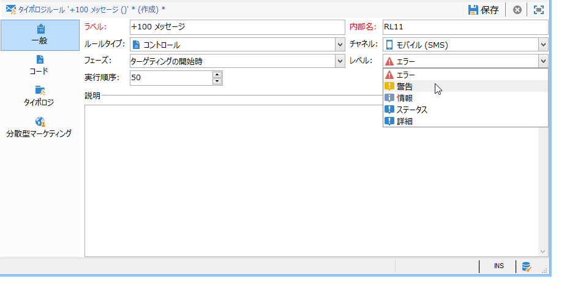
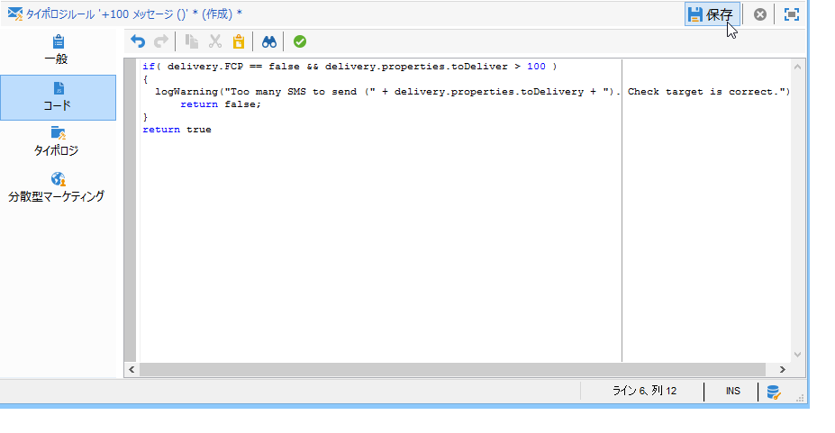
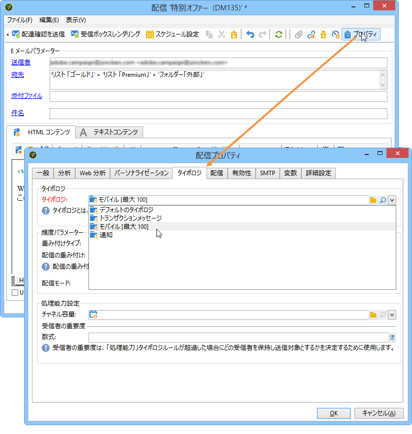
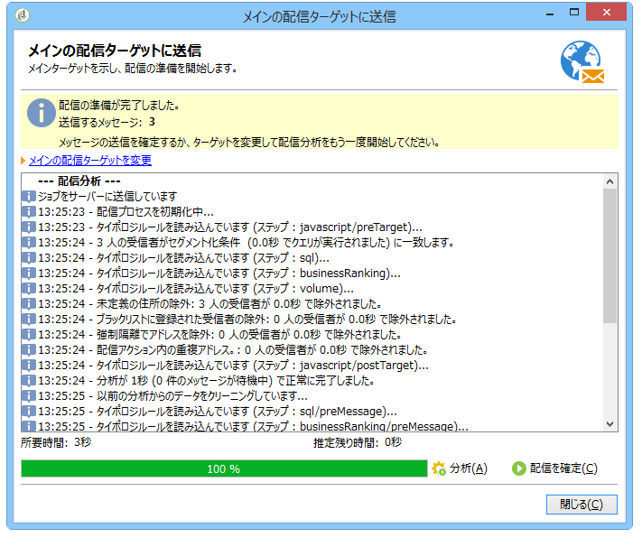
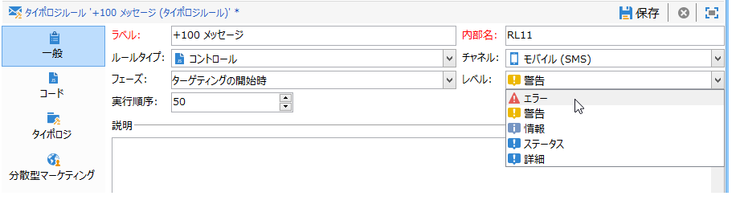
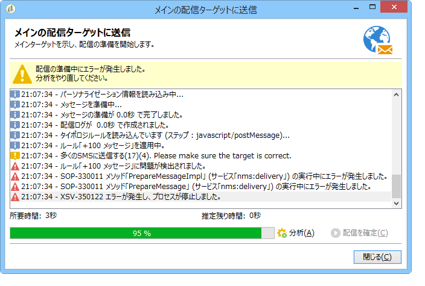

# コントロールルール{#control-rules}

## 分析と判別のコントロールルール {#analysis-and-arbitration-control-rules}

コントロールルールを使用すると、配信を実行する前に、メッセージの有効性と品質（文字の表示、SMS のサイズ、アドレスの形式など）を確認することができます。

デフォルトのルールセットでは、一般的なチェックを実行できます。以下のタイプのチェック（インターフェイスで太字で表示される）が用意されています。

* **[!UICONTROL オブジェクトの検証]**（メール）：送信者のオブジェクトやアドレスをチェックして、メールエージェントで問題を引き起こす可能性のある特殊文字が含まれていないことを確認します。
* **[!UICONTROL URL ラベルの検証]**（メール）：各トラッキング URL にラベルがあることを確認します。
* **[!UICONTROL URL の検証]**（メール）：トラッキング URL をチェックして、アンパサンド（&amp;）が含まれているかどうかを確認します。
* **[!UICONTROL メッセージサイズの検証]**（モバイル）：SMS メッセージのサイズを確認します。
* **[!UICONTROL 有効期間の検証]**（メール）：配信の有効期間をチェックして、すべてのメッセージを送信するのに十分な時間があることを確認します。
* **[!UICONTROL 配達確認のターゲットのサイズを検証]**（すべてのチャネル）：配達確認のターゲット母集団が 100 人を超える場合にエラーメッセージを生成します。
* **[!UICONTROL ウェーブスケジュールの検証]**（メール）：配信が複数のウェーブに分割されている場合、最後のウェーブが有効期間内に開始するよう予定されていることを確認します。
* **[!UICONTROL 講読解除リンクの検証]**（メール）：各コンテンツ（HTML またはテキスト）に購読解除（オプトアウト）用の URL が少なくとも 1 つ含まれていることを確認します。

## コントロールルールの作成 {#creating-a-control-rule}

必要に応じて、新しいコントロールルールを作成することができます。まず、**[!UICONTROL コントロール]**&#x200B;タイポロジルールを作成し、次に「**[!UICONTROL コード]**」タブに SQL 形式でコントロールの数式を入力します。

**例：**

次の例では、SMS オファーが 100 人を超える受信者に送信されないようにするルールを作成します。このルールは、まずキャンペーンタイポロジにリンクされ、その後オファーを送信する SMS 配信にリンクされます。

次の手順に従います。

1. **[!UICONTROL コントロール]**&#x200B;タイポロジルールを作成します。アラートレベルとして、「**[!UICONTROL 警告]**」を選択します。

   

1. 「**[!UICONTROL コード]**」タブで、以下の図のように、しきい値を適用するスクリプトを入力します。

   

   このスクリプトは、配信ターゲットが 100 人を超えると、警告をトリガーします。

   ```
   if( delivery.FCP == false && delivery.properties.toDeliver > 100 ) { logWarning("Significant number of SMS to deliver (" + delivery.properties.toDeliver + "). Please make sure the target is correct.") return false; } return true
   ```

1. ルールをキャンペーンタイポロジにリンクし、該当する SMS 配信でこのタイポロジを参照します。

   

1. 配信の分析時にルールが適用され、状況に応じて警告が生成されます。

   

   ただし、このルールによって、配信が自動的に停止されることはありません。

   アラートレベルをさらに引き上げると、配信は開始されません。

   

   分析の最後に表示される「**[!UICONTROL 配信を確定]**」ボタンがクリックできなくなります。

   
