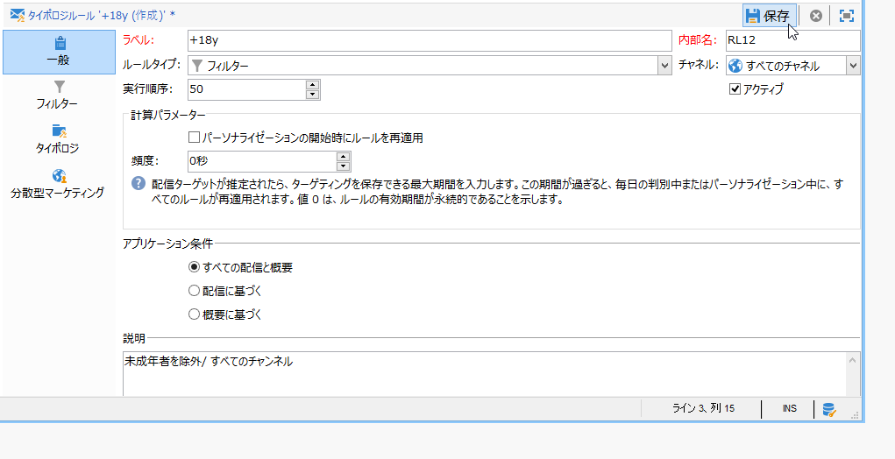
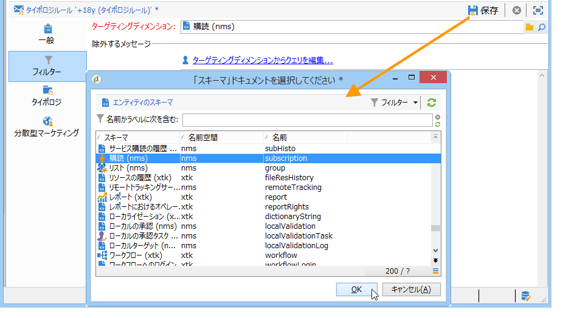
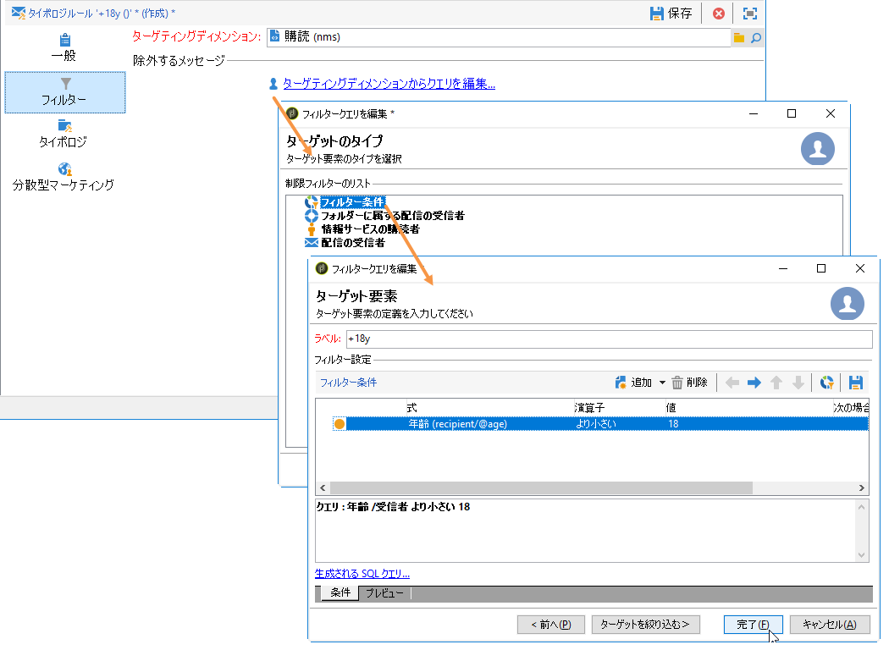
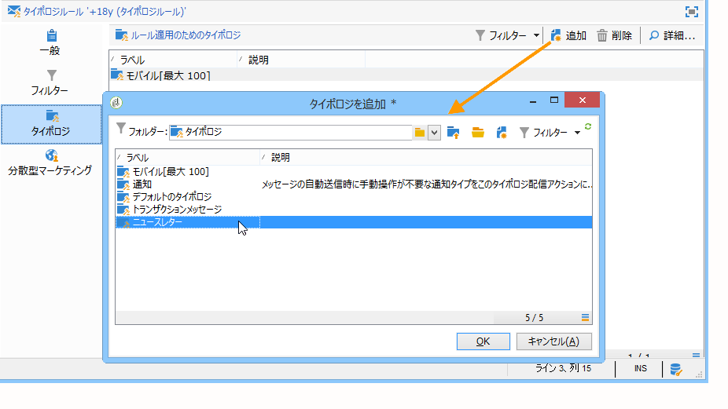
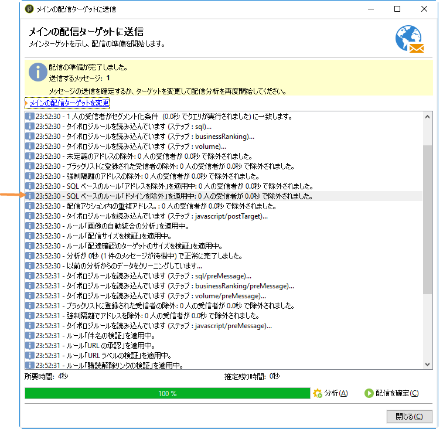
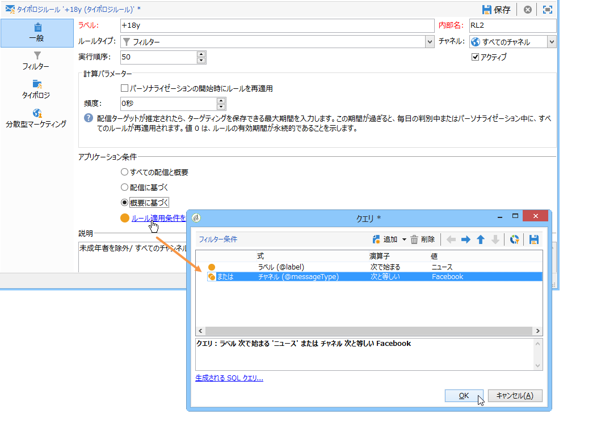
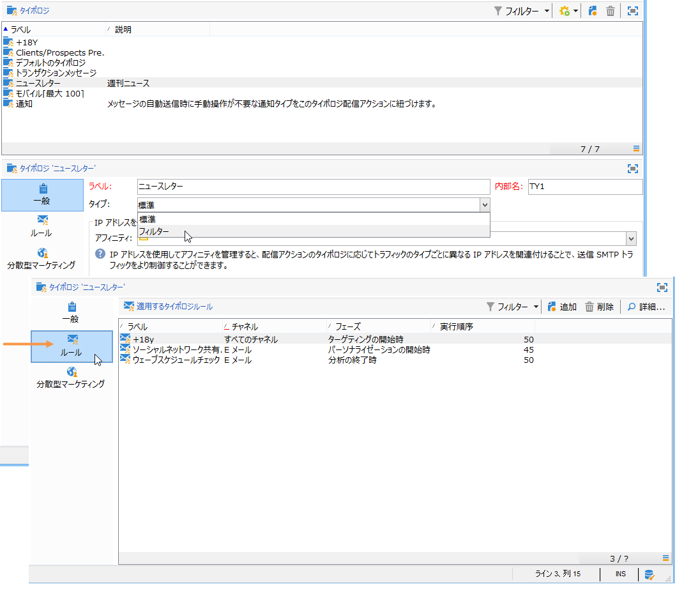
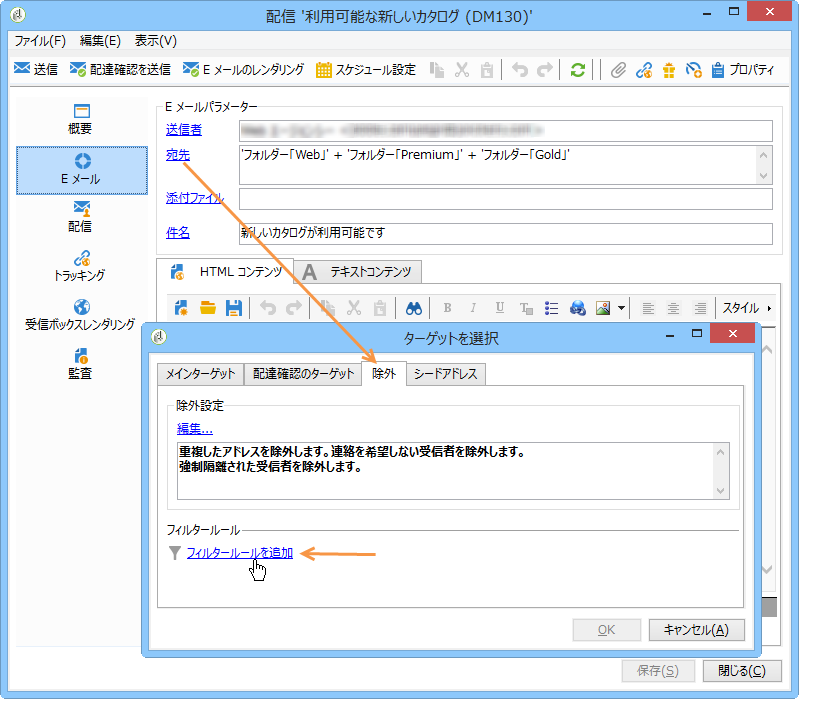
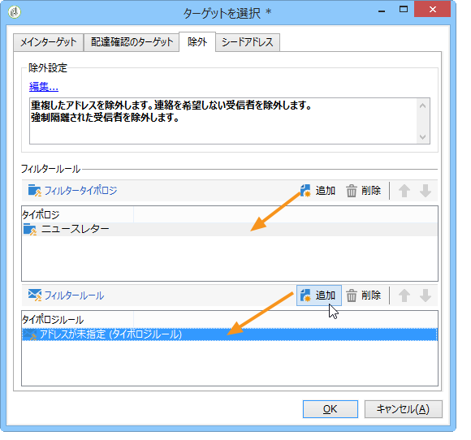

# フィルタリングルール{#filtering-rules}

フィルタールールを使用すると、クエリで指定する条件に従って、除外するメッセージを定義できます。 これらのルールは、ターゲティングディメンションにリンクされます。

フィルタリングルールは、他のタイプのルール（コントロール、プレッシャーなど）とリンクできます。 タイポロジで、または専用の&#x200B;**フィルタリング** タイポロジでグループ化されます。 詳しくは、[フィルタータイポロジの作成と使用](#creating-and-using-a-filtering-typology)を参照してください。

## フィルタールールの作成 {#creating-a-filtering-rule}

例えば、ニュースレターの購読者をフィルタリングして、未成年の受信者にメッセージを送信しないようにすることができます。

このフィルターを定義するには、次の手順に従います。

1. すべてのコミュニケーションチャネルに適用できる&#x200B;**[!UICONTROL フィルター]**&#x200B;タイポロジルールを作成します。

   

1. デフォルトのターゲティングディメンションを変更し、購読（**nms:subscription**）を選択します。

   

1. **[!UICONTROL ターゲティングディメンションからクエリを編集...]** リンクを使用して、フィルターを作成します。

   

1. このルールをキャンペーンタイポロジにリンクし、保存します。

   

配信でこのルールを使用すると、未成年の購読者は自動的に除外されます。 ルールが適用されたことを示すメッセージが表示されます。

## フィルタールールの決定 {#conditioning-a-filtering-rule}

リンクされている配信や配信の概要に基づいて、フィルタールールを適用する範囲を制限することができます。

まず、タイポロジルールの「**[!UICONTROL 一般]**」タブに移動し、以下の図のように、適用条件のタイプを選択して、フィルターを作成します。

これにより、ルールがすべての配信にリンクされている場合でも、ルールが適用されるのは定義されたフィルターの条件に一致する配信のみに制限されます。

>[!NOTE]
>
>タイポロジおよびフィルタールールは、「**[!UICONTROL 配信の概要]**」アクティビティのワークフローで使用できます。 詳しくは、[この節](../../workflow/using/delivery-outline.md)を参照してください。

## フィルタータイポロジの作成と使用 {#creating-and-using-a-filtering-typology}

フィルタールールのみを含む&#x200B;**[!UICONTROL フィルター]**&#x200B;タイポロジを作成できます。

作成したタイポロジは、ターゲットが選択されている場合、配信にリンクできます：配信アシスタントで、「**[!UICONTROL 宛先]**」リンクをクリックし、「**[!UICONTROL 除外]**」タブをクリックします。

次に、配信に適用するフィルタータイポロジを選択します。 「**[!UICONTROL 追加]**」ボタンをクリックして、適用するタイポロジを選択してください。

タイポロジでグループ化せず、このタブから直接フィルタールールをリンクすることもできます。 その場合は、このウィンドウの下部のセクションを使用します。

>[!NOTE]
>
>このウィンドウで選択できるのは、タイポロジとフィルタールールのみです。
>
>フィルターの設定を配信テンプレートで定義すると、そのテンプレートを使用して作成されるすべての新しい配信に、自動的にこの設定が適用されます。
>

## デフォルトの配信除外ルール {#default-deliverability-exclusion-rules}

デフォルトで利用できるフィルタールールには「**[!UICONTROL アドレスを除外]**」（**[!UICONTROL addressExclusions]**）および「**[!UICONTROL ドメインを除外]**」（**[!UICONTROL domainExclusions]**）の 2 つがあります。 電子メールの分析時には、配信性能インスタンスで管理された暗号化グローバル抑止リストに含まれている禁止アドレスや禁止ドメイン名がこれらのルールによって照合され、受信者の電子メールアドレスが該当していないかどうかの確認処理が実行されます。 該当した場合、その受信者宛てにはメッセージが送信されません。

これは、Spamtrap などの悪意あるアクティビティによってブロックリストに登録されることを防ぐためです。 例えば、会社の web フォーム経由で Spamtrap を使用して購読処理が実行されると、Spamtrap 宛てに確認メールが自動送信され、お使いのアドレスが自動的にブロックリスト登録される結果になります。

>[!NOTE]
>
>グローバル抑止リストに含まれているアドレスやドメイン名は非公開です。 除外された受信者の数に関する情報だけが配信分析ログに記録されます。
