# 頻度ルール{#pressure-rules}

## マーケティング疲労について {#about-marketing-fatigue}

営業の頻度管理を実施すると、マーケティング疲労と呼ばれる過度な勧誘がデータベースの母集団に対しておこなわれるのを防ぐことができます。頻度管理では、各受信者宛てのメッセージの最大数を定義できます。また、キャンペーンの判別ルールを適用して、ターゲットとなる母集団に最も適切なキャンペーンメッセージを送信することができます。

**頻度**&#x200B;ルール：例えば、マーケティング疲労を管理するために、母集団に送信する郵便物の数を 2 通までに制限したり、購読者グループの興味に合致するコミュニケーションを選択したり、不満を抱いている顧客に SMS を送信することを避けたりできます。

キャンペーンは、定義されたしきい値とメッセージの重み付けに基づいて判別されます。

* しきい値とは、特定の期間内に特定の受信者に送信することが許される配信の最大数であり、定数または変数を指定することができます。しきい値は、タイポロジルールの設定で定義または計算されます。詳しくは、[メッセージの最大数](#maximum-number-of-messages)を参照してください。
* 配信に重みを付けることで、頻度管理のフレームワーク内で最も優先順位の高い配信を指定できます。最も大きな重みを付けられたメッセージが、最優先されます。[メッセージの重み付け](#message-weight)を参照してください。

判別ルールを適用すれば、予約されているキャンペーンの重みが現在進行中のキャンペーンより大きい場合に、プロファイルに対する過度の勧誘が実施されないよう配信を制御できます。この場合は、特定のプロファイルが配信から除外されます。

判別の基準（メッセージの重み付けとしきい値）は、次の 2 つのタイプの情報に基づいて決定される場合があります。

* 受信者の環境設定：ニュースレターの購読、受信者のステータス（顧客または見込み客）などの叙述情報
* 受信者の行動：購入、リンクの訪問など

送信するメッセージを決定する判別ルールは、分析の段階で適用されます。次の数式が成り立つ場合、考慮する期間において各受信者にメッセージが送信されます。**（送信されたメッセージの数） + （より大きな重みを持つメッセージの数） &lt; しきい値**。

式が成り立たない場合、その受信者は&#x200B;**[!UICONTROL 判別によって除外]**&#x200B;され、メッセージは送信されません。詳しくは、[判別後の除外](#exclusion-after-arbitration)を参照してください。

## 圧力ルールの作成 {#creating-a-pressure-rule}

Adobe Campaign でキャンペーンの判別を設定するには、まずキャンペーンタイポロジを作成し、リンクするタイポロジルール（**頻度**&#x200B;ルール）を定義します。

**[!UICONTROL 頻度]**&#x200B;タイポロジルールを作成および設定するには、次の手順に従います。

1. キャンペーンのタイポロジルールリストで、リスト上部にある&#x200B;**[!UICONTROL 新規]**&#x200B;アイコンをクリックします。

   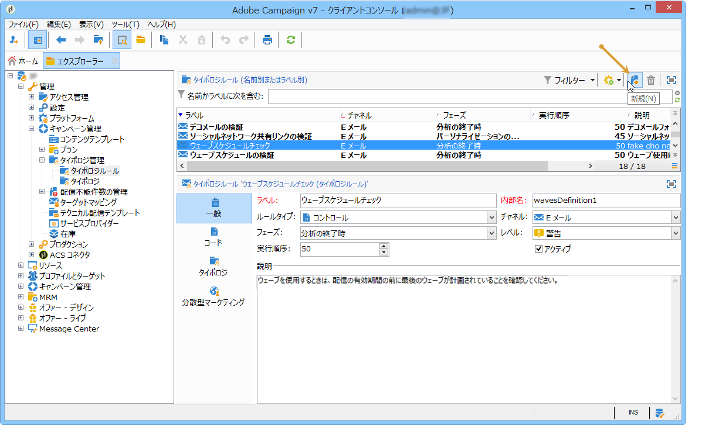

1. 新しいルールの「**[!UICONTROL 一般]**」タブで、ルールタイプの「**頻度**」を選択し、名前と説明を入力します。

   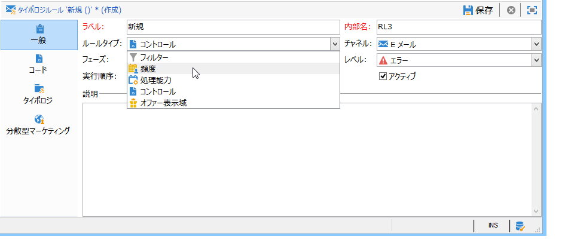

1. 必要に応じて実行順序を変更します。複数のタイポロジルールを&#x200B;**[!UICONTROL タイポロジ]**&#x200B;セットとして適用する場合、下位にあるルールが最初に適用されます。詳しくは、[実行順序](applying-rules.md#execution-order)を参照してください。
1. 次の日次再判別の実行を超えてターゲティングを保存する場合は、「**[!UICONTROL 計算パラメーター]**」セクションで頻度を定義します。詳しくは、[計算頻度の調整](applying-rules.md#adjusting-calculation-frequency)を参照してください。
1. 「**[!UICONTROL 頻度]**」タブをクリックし、タイポロジルールを適用する期間を選択します。

   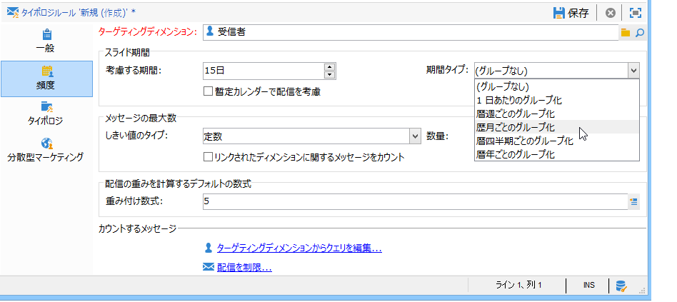

   作成するルールは、連絡日がこの期間内に含まれる配信に適用されます。

   >[!NOTE]
   >
   >スケジュールされた配信は、「**[!UICONTROL 暫定カレンダーで配信を考慮]**」オプションが選択されている場合にのみ考慮されます。詳しくは、[期間の設定](#setting-the-period)を参照してください。
   >

1. メッセージの最大数を計算する方法を定義します。

   しきい値は、指定期間内に受信者に送信できるメッセージの最大数を表します。

   デフォルトでは、定数のしきい値が使用されます。この場合は、ルールで許可されるメッセージの最大数の値を指定してください。

   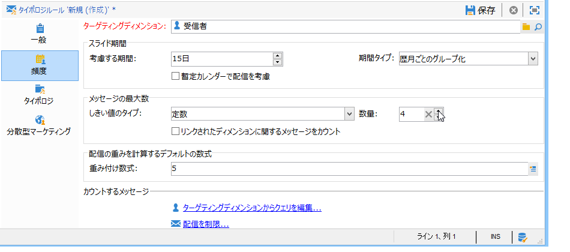

   変数のしきい値を定義する場合は、「**[!UICONTROL しきい値のタイプ]**」フィールドで「**[!UICONTROL 受信者に依存]**」を選択し、右側のアイコンを使用して式エディターを開きます。

   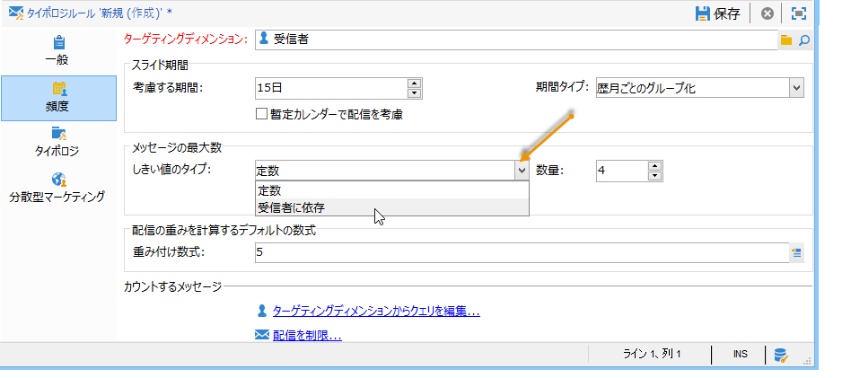

   詳しくは、[メッセージの最大数](#maximum-number-of-messages)を参照してください。

1. 配信の重み付けを計算する方法を指定します。

   すべての配信には重みが付けられます。重みとは優先度を表す値であり、この重みに基づいてキャンペーンの判別が実施されます。
重みは、タイポロジルールまたはプロパティで定義される数式を使用して計算されます。詳しくは、[メッセージの重み付け](#message-weight)を参照してください。

1. デフォルトでは、しきい値の計算にはすべてのメッセージが考慮されます。「**[!UICONTROL カウントするメッセージ]**」セクションにあるクエリ定義を使用すると、タイポロジルールの対象となるメッセージをフィルタリングできます。

   * 「ターゲティングディメンションからクエリを編集」では、対象となる受信者を制限できます。
   * このタブの下部セクションでは、カウントするメッセージをフィルタリングできます。

     以下の例では、**NewContacts** フォルダーに保存されている受信者のみが対象となり、「**Newsletter**」で始まる配信のみが考慮されます。

   

1. 「**[!UICONTROL タイポロジ]**」タブでは、このルールが適用されるキャンペーンタイポロジを表示したり、ルールを 1 つ以上の既存のタイポロジにリンクしたりできます。詳しくは、[タイポロジの適用](about-campaign-typologies.md#applying-typologies)を参照してください。

## しきい値と重みの定義 {#defining-thresholds-and-weights}

### メッセージの最大数 {#maximum-number-of-messages}

すべての頻度ルールには、しきい値が定義されます。しきい値は、指定された期間内に 1 人の受信者に送信できるメッセージの最大数を表します。しきい値に達すると、その後は指定された期間が完了するまで、配信は実施できなくなります。このプロセスにより、メッセージの数がしきい値を超過する場合は、受信者が配信から自動的に除外されるので、過度の勧誘がおこなわれないようにすることができます。

しきい値には定数を指定できます。または、変数を含む数式を定義して、しきい値を算出することもできます。その場合、同じ期間であっても受信者によってしきい値が異なったり、場合によっては、受信者が同一であってもしきい値が異なったりすることがあります。

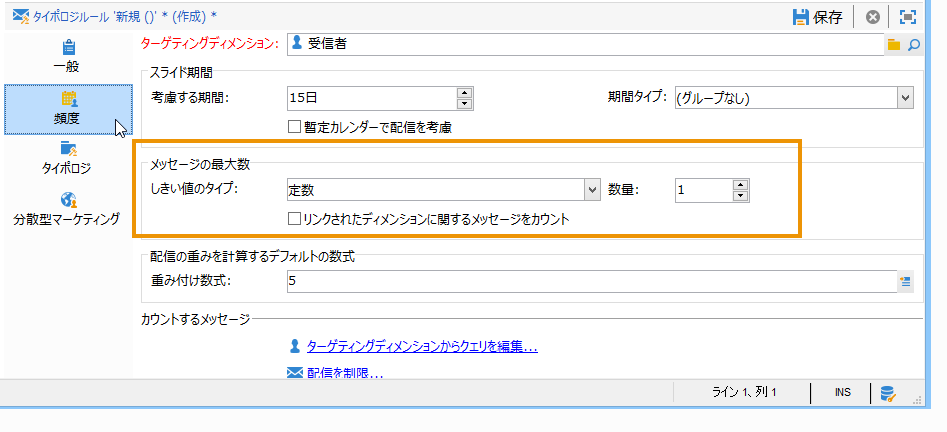

>[!CAUTION]
>
>しきい値として「**0**」を入力すると、指定された期間内はターゲット母集団に配信が一切送信されなくなります。

**例：**

受信者が所属するセグメントによって、許可するメッセージの数を変えることができます。例えば、Web セグメントに属する受信者に、他の受信者より多くのメッセージを送信するように設定できます。「**[!UICONTROL Iif (@origin=&#39;Web&#39;, 5, 3)]**」という数式を指定します。この数式では、Web セグメントの受信者に 5 つのメッセージ、その他のセグメントに 3 つのメッセージを配信できます。設定の手順は以下のとおりです。

しきい値を定義する際には、ターゲティングディメンションにリンクされているディメンションを使用できます。例えば、訪問者テーブルに格納されている受信者プロファイルへのメッセージを含めることができます（訪問者テーブルについて詳しくは、[この節](../../surveys/using/use-case--creating-a-refer-a-friend-form.md)を参照）。または、同一世帯へのメッセージの配信（複数の E メールアドレスが関係する）を週に一度までに制限することもできます。この場合、同一世帯かどうかは、受信者のディメンションにリンクされているディメンションによって判断されます。

これを行うには、「**[!UICONTROL リンクされたディメンションに関するメッセージをカウント]**」オプションをオンにし、訪問者または連絡先のテーブルを選択します。

### メッセージの重み付け {#message-weight}

各配信には、優先度を表す重みが付けられます。
デフォルトでは、配信の重みは 5 に設定されています。頻度ルールでは、配信に適用する重みを定義できます。

重みの値は、定数を指定するか、受信者ごとに数式で算出します。例えば、受信者の興味に基づいて配信の重みを定義することができます。

>[!CAUTION]
>
>タイポロジルールで重みが定義されている場合、「**[!UICONTROL プロパティ]**」タブで、個々の配信に重複して重みが適用される可能性があります。「**[!UICONTROL タイポロジ]**」タブをクリックして、キャンペーンタイポロジを選択し、必要に応じて適用する重みを指定します。\
>ただし、タイポロジルール A で宣言されている重みがタイポロジルール B の計算で使用されることはありません。この重みはルール A を使用する配信でのみ使用されます。

**例：**

次の例では、音楽関係のニュースレターの重みを受信者の傾向のスコアにリンクします。手順は次のとおりです。

1. 受信者の傾向スコアを格納する新しいフィールドを作成します。このフィールド（**@Music** とする）には、アンケートやオンライン調査に対する回答、収集されたトラッキングデータなどが格納されます。
1. このフィールドに基づいてメッセージの重みを計算する、タイポロジルールを作成します。

   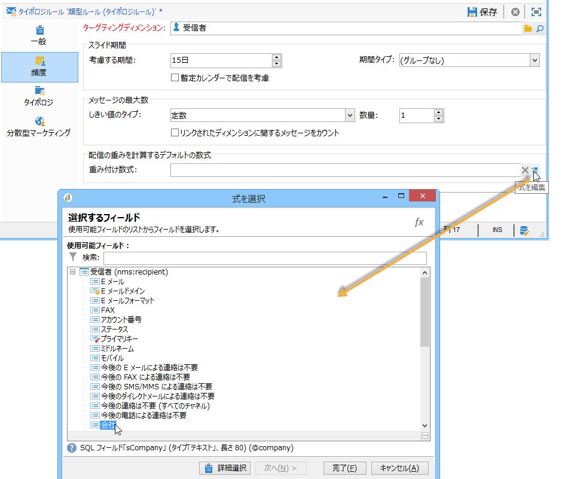

1. 作成したルールを、ニュースレターやスペシャルオファーなど、特定のトピックのメッセージに適用します。これらの配信の重み、つまり優先度は、各受信者の傾向スコアに基づいて決定されます。

## 期間の設定 {#setting-the-period}

頻度ルールは、**n** 日周期で定義されます。

この期間は、ルールの「**[!UICONTROL 頻度]**」タブで設定します。日数を指定し、必要に応じて、適用するグループ化のタイプ（日、週、月、四半期など）を選択します。

グループ化のタイプを選択すると、「**[!UICONTROL 考慮する期間]**」フィールドで指定した期間を 1 日、暦週、暦月または暦年まで延長できます。

例えば、頻度ルールで 1 週間に 2 つのメッセージというしきい値が定義されている場合、「暦月ごとのグループ化」を選択すると、その 1 週間だけでなく、同じ暦月内にメッセージが 3 つ以上配信されないようにすることができます。警告：考慮する期間が 2 ヶ月にまたがっている場合は、その 2 つの暦月内の配信がしきい値の計算の対象となるので、2 ヶ月目の新しい配信はすべて実行できなくなる可能性があります。

デフォルトのしきい値の計算では、送信済みの配信のみが考慮されます。Campaign Classic v7 で対象の期間内に予約されている配信も考慮するには、「**[!UICONTROL 暫定カレンダーで配信を考慮]**」オプションをオンにしてください。オンにすると、対象の期間が 2 倍になり、過去の配信に加えて、今後予定されている配信も考慮されます。

考慮する配信を 2 週間以内に制限するには、次のいずれかを実行します。

1. 「**[!UICONTROL 考慮する期間]**」フィールドに「**15 日**」と入力します。ルールが適用される配信日から過去 2 週の間に送信された配信が計算に含められます。

または

1. 「**考慮する期間**」フィールドに **[!UICONTROL 7d]** と入力し、さらに「**[!UICONTROL 暫定カレンダーで配信を考慮]**」オプションを選択します。オプション：ルールが適用されている配信日から 7 日後までスケジュールされている配信、および配信日から過去 7 日の間に送信された配信が計算に含められます。

期間の開始日は、データベースの設定によって異なります。

例えば、グループなしで 15 日間の頻度ルールを 12 月 11 日の配信に適用すると、11 月 27 日から 12 月 12 日までの配信が計算に含められます。暫定カレンダーで配信を考慮する場合は、11 月 27 日から 12 月 27 日までに予約されているすべての配信が計算に含められます。また、暦月ごとのグループ化を設定すると、11 月と 12 月の配信がすべて、しきい値の計算に含められます（11 月 1 日から 12 月 31 日まで）。

**よくある事例**

現在の暦週および前の週の配信をしきい値の計算に含めたくない場合は、「**[!UICONTROL 考慮する期間]**」で「0」を指定し、「**[!UICONTROL 期間タイプ]**」として「暦週ごとのグループ化」を選択します。

「考慮する期間」に 0 より大きい値（1 など）を指定すると、しきい値の計算では前日の配信も考慮されることがあります。この前日がカレンダー上で前の週に区分される場合、期間タイプとして「暦週ごとのグループ化」を選択していると、前の週の配信はすべてしきい値の計算に含められます。

**例：**

2 週間の周期ごとに勧誘メッセージを 3 つまでに制限する頻度ルールを作成し、暦月ごとのグループ化を選択するとします。

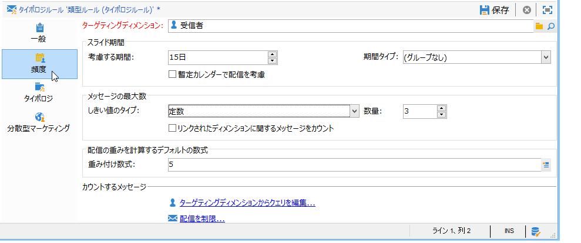

同じ重みが付けられた 6 つのニュースレターがそれぞれ 5 月 30 日、6 月 3 日、6 月 8 日、6 月 12 日、6 月 22 日および 6 月 30 日に予定されています。

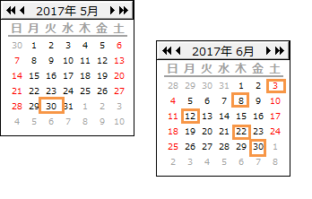

この場合、6 月の 12 日と 30 日に予約されている配信は送信されません。6 月 12 日の配信は 2 週間に 3 つのメッセージというしきい値を超過し、30 日の配信はその暦月内に許可されているしきい値を超過するので、送信されません。

これらの配信の受信者はすべて、分析フェーズで実施される判別によって除外されます。

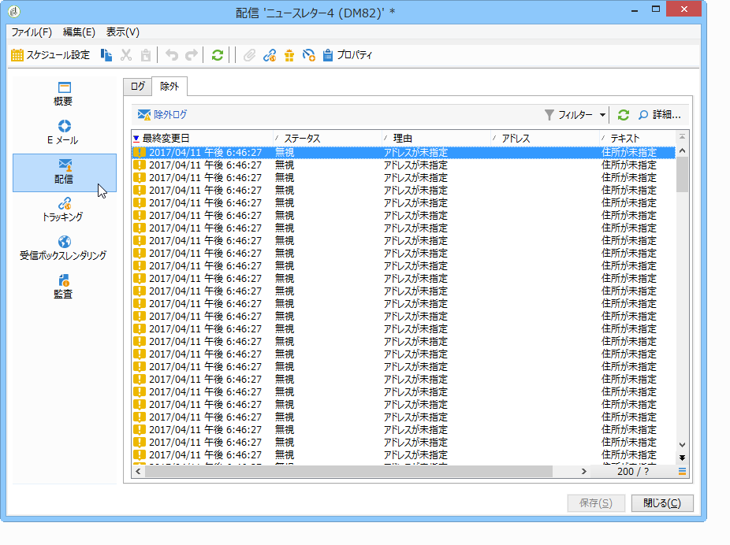

同一のルールで、グループ化を暦四半期ごとに変更すると、さらに **5 番目のニュースレター**&#x200B;も送信されなくなり、その受信者が除外されます。

グループ化を選択しない場合、送信されないのは **4 番目のニュースレター**&#x200B;のみになります。これは、このニュースレターが最初の 3 つのニュースレターと同じ 2 週間以内に予約されているからです。

>[!NOTE]
>
>タイポロジルールの定義を変更するときには、**シミュレーション**&#x200B;を作成することで、変更が配信に与える影響をコントロールし、他の配信にどのように影響するかを監視できます。詳しくは、[キャンペーンのシミュレーション](campaign-simulations.md)を参照してください。

## 判別後の除外 {#exclusion-after-arbitration}

判別は、毎晩&#x200B;**[!UICONTROL 予測]**&#x200B;テクニカルワークフローおよび&#x200B;**[!UICONTROL キャンペーンのジョブ]**&#x200B;ワークフローで再適用されます。

**[!UICONTROL 予測]**&#x200B;ワークフローでは、分析フェーズで適用されるタイポロジルールのために、期間中のデータ（開始日から現在の日付まで）が事前に計算されます。また、判別の除外カウンターも毎晩再計算されます。

このように Adobe Campaign では、考慮する期間内の送信済みのメッセージの数を確認して、送信するメッセージ数がしきい値を超えないよう受信者ごとに制御します。この情報は&#x200B;**指標**&#x200B;であり、すべての計算は配信時に更新されます。

この数値がしきい値を超えると、キャンペーンタイポロジで定義された判別ルールが適用され、重みの小さなキャンペーンから受信者が除外されます。

>[!NOTE]
>
>複数の配信が同じスコアを持つ場合は、最も早い日付に予約されているキャンペーンが優先されます。

## 圧力ルールのユースケース {#use-cases-on-pressure-rules}

### 基準に基づくしきい値の調整 {#adapting-the-threshold-based-on-criterion}

顧客へのメッセージ配信を週に 4 回まで、見込み客への配信を週に 2 回までに制限するタイポロジルールを作成します。

顧客と見込み客を識別するには、「**[!UICONTROL ステータス]**」フィールドを使用します。このフィールドでは、見込み客の場合は「0」、顧客の場合は「1」が指定されます。

ルールを作成するには、次の手順に従います。

1. **頻度**&#x200B;タイプのタイポロジルールを新規作成します。
1. 「**[!UICONTROL 頻度]**」タブに移動します。「**[!UICONTROL メッセージの最大数]**」セクションで、各受信者のしきい値を計算する数式を作成します。「**[!UICONTROL しきい値のタイプ]**」フィールドで「**[!UICONTROL 受信者に依存]**」を選択し、「**[!UICONTROL 数式]**」フィールドの右にある「**[!UICONTROL 式を編集]**」をクリックします。

   「**[!UICONTROL 詳細選択]**」ボタンをクリックして、計算式を定義します。

   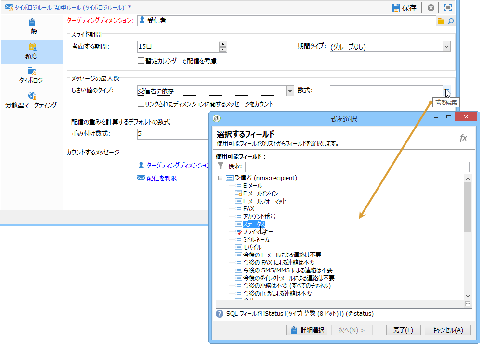

1. 「**[!UICONTROL 式を使用して数式を編集]**」オプションを選択し、「**[!UICONTROL 次へ]**」をクリックします。

   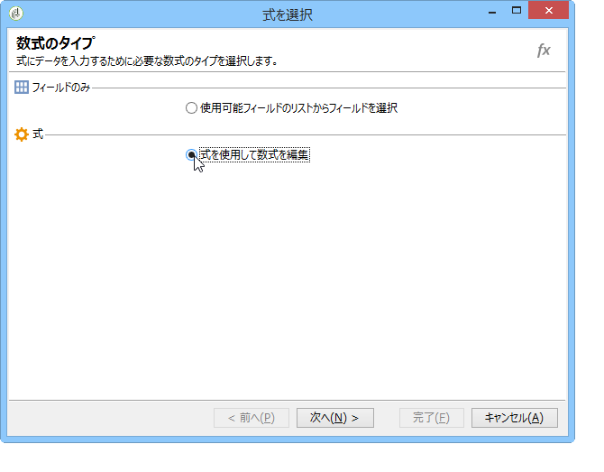

1. 関数のリストで、**その他**&#x200B;ノードにある **[!UICONTROL Iif]** 関数をダブルクリックします。

   次に、「**使用可能フィールド**」セクションで、受信者の「**[!UICONTROL ステータス]**」を選択します。

   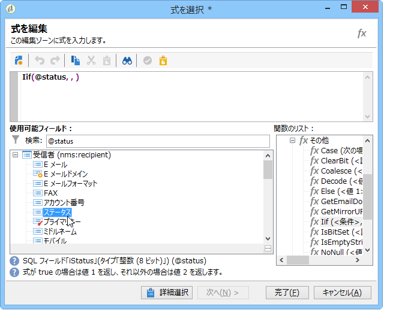

   次の式を入力します。**Iif(@status=0,2,4)**

   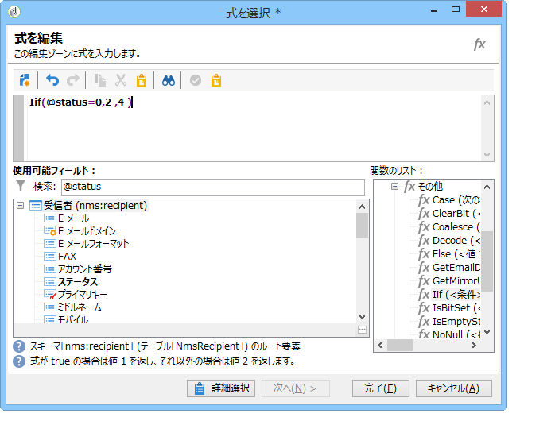

   この数式により、受信者のステータスが 0 の場合は 2、その他のステータスの場合は 4 が割り当てられます。

   「**[!UICONTROL 完了]**」をクリックして、数式を承認します。

1. ルールを適用する期間を指定します。この例では、1 週間あたりのメッセージ数をカウントするよう 7 日間にします。

   

1. ルールを保存して、作成を実行します。

次に、作成したルールをタイポロジとリンクして、配信に適用します。手順は次のとおりです。

1. キャンペーンタイポロジを作成します。
1. 「**[!UICONTROL ルール]**」タブに移動し、「**[!UICONTROL 追加]**」ボタンをクリックして、作成したルールを選択します。

   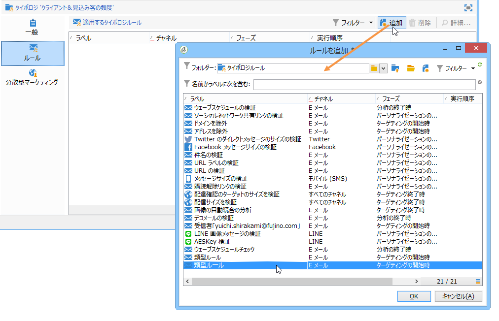

1. タイポロジを保存して、既存のタイポロジのリストに追加します。

配信でこのタイポロジを使用するには、配信プロパティの「**[!UICONTROL タイポロジ]**」タブでこのタイポロジを選択します（以下の図を参照）。

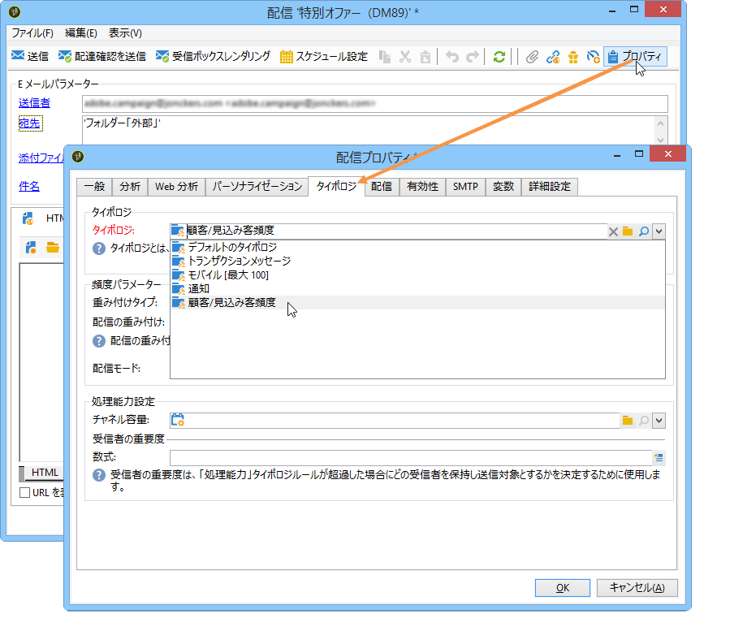

>[!NOTE]
>
>配信テンプレートでタイポロジを定義すると、このテンプレートを使用して作成されるすべての配信に自動的にこのタイポロジを適用できます。

配信の分析時には、既に受信者に送信されたメッセージの数に基づいて、しきい値を超過する受信者が配信から除外されます。この情報を参照するには、次のいずれかを実行します。

* 分析の結果を表示します。

  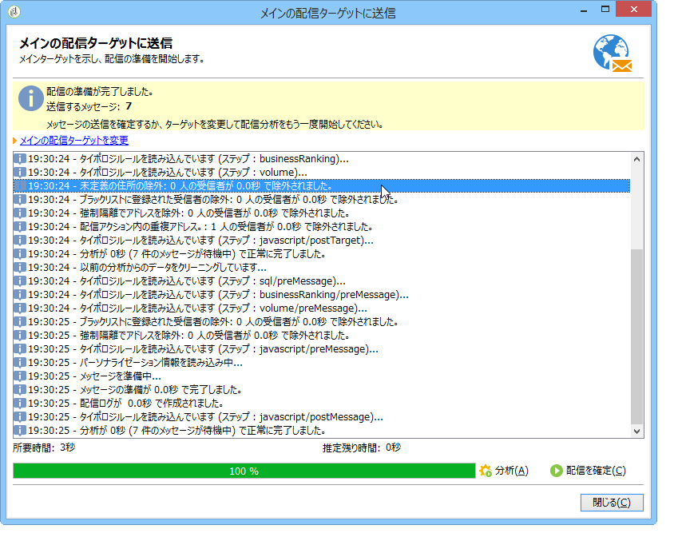

* 配信を編集し、「**[!UICONTROL 配信]**」タブの「**[!UICONTROL 除外]**」サブタブをクリックします。

  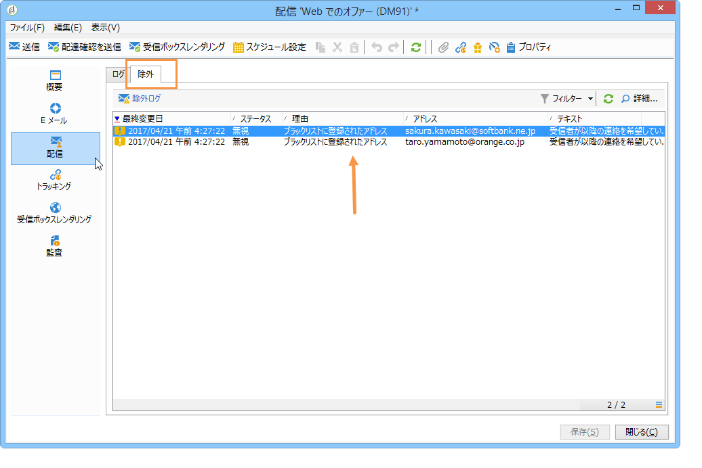

* 「**[!UICONTROL 監査]**」タブをクリックし、「**[!UICONTROL 除外の原因]**」サブタブをクリックして、除外された数と適用されたタイポロジルールを表示します。

  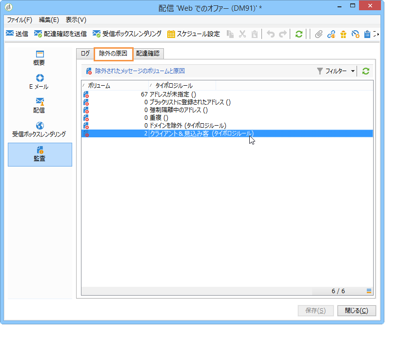

### 行動に基づく配信の重み付けの計算 {#calculating-the-delivery-weight-based-on-behavior}

頻度ルールは、受信者の行動に基づいて定義できます。したがって、受信者ごとに異なる条件に基づいて、配信に重みを付けることが可能です。例えば、インターネットサイトを訪問した、最新のニュースレターで特定のセクションをクリックした、情報サービスの購読を始めた、などの受信者の行動、または調査への回答やオンラインゲームなどに基づいて、メッセージを送信するかどうかを決定できます。

次の例では、配信に 5 の重みを付けます。この重みの値は、受信者の行動に基づく傾向スコアによって決まります。サイトからオーダーしたことのある顧客にはスコア 5、オンラインでオーダーしたことのない顧客にはスコア 4 を割り当てます。

このような設定をおこなうには、数式を使用してメッセージの重みを定義する必要があります。アフィニティスコアと調査の回答に関する情報には、データモデルでアクセスする必要があります。この例では、「**傾向**」フィールドが追加されています。

次の設定手順を実行します。

1. **頻度**&#x200B;タイプのタイポロジルールを新規作成します。
1. 「**[!UICONTROL 頻度]**」タブで編集を実行します。各受信者に基づいてしきい値を計算する数式を作成します。「**[!UICONTROL 重み付け数式]**」フィールドの右にある「**[!UICONTROL 式を編集]**」アイコンをクリックします。

   

1. デフォルトでは、式エディターの上部のセクションには、「**5**」という値が表示されています。この重みの値に各受信者のアフィニティスコアを加算します。カーソルを「5」の右に置き、正符号（**+**）を入力して、「**傾向**」フィールドを選択します。

   

1. 購入経験のある受信者には、他の受信者より大きなスコアを割り当てます。今回は、購入経験のある受信者には、配信の重みにスコア 5 を加算し、その他の受信者には 4 を加算します。

   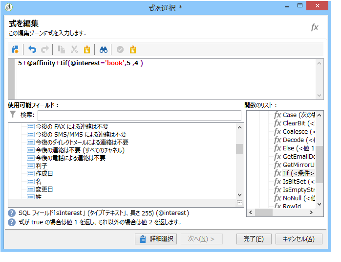

1. 「**[!UICONTROL 完了]**」をクリックして、ルールを保存します。
1. ルールをキャンペーンタイポロジにリンクし、配信でこのタイポロジを参照して承認します。

### 重み付けが最大のメッセージのみの送信 {#sending-only-the-highest-weighted-messages}

各受信者に 2 件以下のメッセージを同一週内で送信する必要があり、1 日あたりのメッセージ数は 2 件を上限とし、より高い重みが付けられたメッセージのみが配信されるようにするとします。

それには、同じ受信者に対して異なる重みを持つ複数の配信をスケジュールし、重みの小さな配信を除外する頻度ルールを適用する必要があります。

最初に、頻度ルールを設定します。

1. 頻度ルールを作成します。詳しくは、[頻度ルールの作成](#creating-a-pressure-rule)を参照してください。
1. 「**[!UICONTROL 一般]**」タブで、「**[!UICONTROL パーソナライゼーションの開始時にルールを再適用]**」オプションを選択します。

   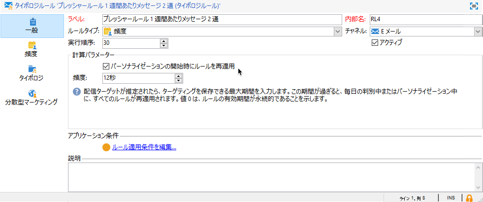

   このオプションは、「**[!UICONTROL 頻度]**」フィールドに定義された値を無視し、パーソナライゼーションフェーズ中にルールを自動的に適用します。詳しくは、[計算頻度の調整](applying-rules.md#adjusting-calculation-frequency)を参照してください。

1. 「**[!UICONTROL 頻度]**」タブで、「**[!UICONTROL 考慮する期間]**」で「**[!UICONTROL 7 日]**」を選択し、「**[!UICONTROL 期間タイプ]**」として「**[!UICONTROL 1 日あたりのグループ化]**」を選択します。
1. 「**[!UICONTROL 暫定カレンダーで配信を考慮]**」オプションを選択してスケジュールされた配信を含めます。

   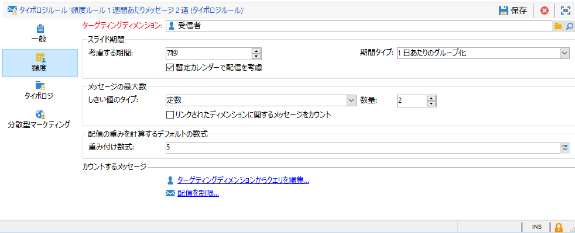

   配信日から過去 7 日の間に送信された配信および配信日から 7 日後までスケジュールされている配信が計算に含められます。詳しくは、[期間の設定](#setting-the-period)を参照してください。

1. 「**[!UICONTROL タイポロジ]**」タブで、ルールをキャンペーンタイポロジにリンクします。
1. 変更を保存します。

次に、頻度ルールを適用するそれぞれの配信のワークフローを作成して設定します。

1. キャンペーンを作成します。詳しくは、[この節](../../campaign/using/setting-up-marketing-campaigns.md#creating-a-campaign)を参照してください。
1. キャンペーンの「**[!UICONTROL ターゲティングとワークフロー]**」タブで、ワークフローに&#x200B;**クエリ**&#x200B;アクティビティを追加します。このアクティビティの使用について詳しくは、[この節](../../workflow/using/query.md)を参照してください。
1. **[!UICONTROL E メール配信]**&#x200B;アクティビティをワークフローに追加して開きます。このアクティビティの使用について詳しくは、[この節](../../workflow/using/delivery.md)を参照してください。
1. **[!UICONTROL 配信プロパティ]**&#x200B;の「**[!UICONTROL 承認]**」タブに移動し、すべての承認を無効にします。

   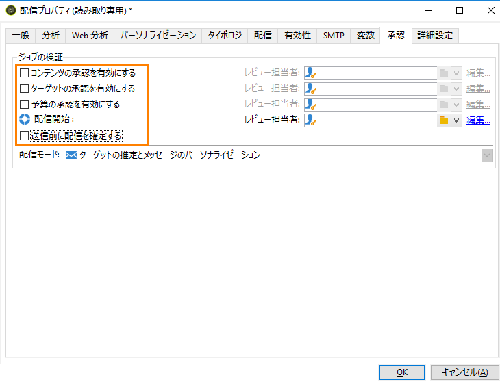

1. **[!UICONTROL 配信プロパティ]**&#x200B;の「**[!UICONTROL タイポロジ]**」タブで、ルールを適用するキャンペーンタイポロジを参照します。配信の重み付けを定義します。

   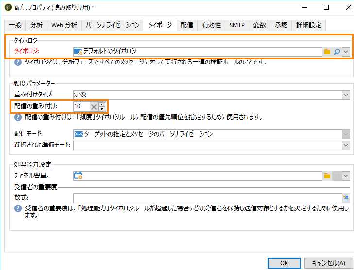

1. 配信内で、「**[!UICONTROL スケジュール設定]**」をクリックし、「**[!UICONTROL 予約配信 (予約された日になると自動実行)]**」を選択します。この例では、「**[!UICONTROL 計算式を使用]**」オプションを選択します。
1. 抽出日を 10 分（現在の日付 + 10 分）に設定します。
1. 連絡日を翌日（現在の日付 + 1 日）に設定します。

   

   頻度ルールの除外を適切に実装するには、連絡日時より前で、かつ夜間の判別が再適用される前の日時に抽出日時を設定します。詳しくは、[判別後の除外](#exclusion-after-arbitration)を参照してください。

1. 「**[!UICONTROL 送信前に配信を確定する]**」オプションの選択を解除し、変更を保存します。
1. 送信するそれぞれの配信について、同様の手順を実行します。それぞれの配信に必要な重み付けを設定してください。
1. 関連するワークフローを実行して、配信を準備して送信します。

夜間の判別が適用されると、同じ受信者に対する重みが小さい配信が除外されます。最も大きな重みを付けられた配信のみが、送信の対象とみなされます。詳しくは、[メッセージの重み付け](#message-weight)を参照してください。

次の表に、週の前半に対象となる受信者に E メールが既に送信されたと仮定した場合にもう 2 つの配信に適用できる設定の例を示します。

<table> 
 <thead> 
  <tr> 
   <th> 配信  </th> 
   <th> 承認  </th> 
   <th> 重み付け  </th> 
   <th> 抽出日時  </th> 
   <th> 連絡日  </th> 
   <th> 配信の開始日時  </th> 
   <th> 判別ワークフローの実行日時  </th> 
   <th> 配信ステータス  </th> 
   <th> 送信された配信（日時）  </th> 
  </tr> 
 </thead> 
 <tbody> 
  <tr> 
   <td> 配信 1  </td> 
   <td> 無効  </td> 
   <td> 5  </td> 
   <td> 午後 3 時  </td> 
   <td> 午前 8 時（翌日）  </td> 
   <td> 午後 2 時  </td> 
   <td> 夜間  </td> 
   <td> 除外済み  </td> 
   <td> 除外済み  </td> 
  </tr> 
  <tr> 
   <td> 配信 2  </td> 
   <td> 無効  </td> 
   <td> 10  </td> 
   <td> 午後 4 時  </td> 
   <td> 午前 9 時（翌日）  </td> 
   <td> 午後 2 時  </td> 
   <td> 夜間  </td> 
   <td> 送信済み  </td> 
   <td> 午前 9 時（翌日）  </td> 
  </tr> 
 </tbody> 
</table>

2 件の配信の抽出日を過ぎた後、両方の配信の連絡日の前に夜間の判別が再度適用されます。これにより、既に送信された配信（配信が処理され、配信ログを通じて記録された受信者）または送信がスケジュールされた配信（配信を受信する資格があり、予測ログを通じて記録された受信者）をすべて見つけることができます。

頻度ルールに定義された期間のすべての送信済みの配信と送信される可能性のある配信が見つかると、これらの配信は、重み付け順（最も大きな重みが付けられた配信が先頭）で並べ替えられます。頻度ルールに設定されたしきい値に達すると（ここでは同じ週内に 2 件を超える E メールは送信されません）、受信者は配信から除外されます。
