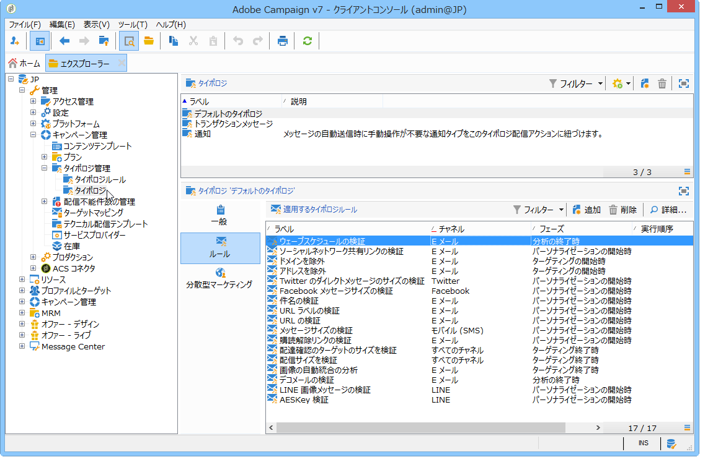

# キャンペーンタイポロジについて{#about-campaign-typologies}

キャンペーンの最適化は、配信状況を制御、フィルターおよび監視する Adobe Campaign のモジュールです。キャンペーン間の競合を回避するために、Adobe Campaign では制限ルールを適用して、様々な組み合わせをテストできます。このテストにより、企業のコミュニケーションポリシーに準拠しつつ、顧客のニーズと期待に応える最適なメッセージを送信できます。

>[!NOTE]
>
>提供されている内容によって、Campaign Optimization は含まれていることも、アドインになっていることもあります。使用許諾契約書を確認してください。

## タイポロジルール {#typology-rules}

Adobe Campaign では、次の 4 種類のタイポロジルールをデザインおよび適用できます。

1. **フィルター**&#x200B;ルール：条件に基づいて、ターゲットの一部を除外します。For more on this, refer to [Filtering rules](../../campaign/using/filtering-rules.md).
1. **頻度**&#x200B;ルール： マーケティング疲労（過剰なマーケティングによる弊害）を抑制します。For more on this, refer to [Pressure rules](../../campaign/using/pressure-rules.md).
1. **処理能力**&#x200B;ルール：最適な処理環境を確保するために、負荷を制限します。For more on this, refer to [Controlling capacity](../../campaign/using/consistency-rules.md#controlling-capacity).
1. **コントロール**&#x200B;ルール：メッセージを送信する前にメッセージの有効性を確認します。For more on this, refer to [Control rules](../../campaign/using/control-rules.md).

作成されたタイポロジルールは、キャンペーンタイポロジでグループ化され、配信で参照されます。[タイポロジの適用](#applying-typologies)を参照してください。

## タイポロジ {#typologies}

キャンペーンタイポロジには、複数の[タイポロジルール](#typology-rules)を含めることができますが、1 つの配信では 1 つのタイポロジしか参照できません。

The **[!UICONTROL Rules]** tab lets you add, delete or view the typology rules to apply.

## タイポロジの適用 {#applying-typologies}

以下に、タイポロジを作成して配信に適用する手順を示します。

1. タイポロジルールを作成する。

   ノードにタイポロジルールがあ **[!UICONTROL Administration > Campaign management > Typology management > Typology rules]** ります。

   Campaignで使用できる様々なルールについて、以下の節で説明します。販売 [圧力ルール](../../campaign/using/pressure-rules.md)、容 [量ルール](../../campaign/using/consistency-rules.md#controlling-capacity)、管理ルール [、](../../campaign/using/control-rules.md)フィルタリングルール

1. タイポロジを作成し、作成したルールをその中で参照する。

   タイポロジには、>ノードを使用し **[!UICONTROL Administration > Campaign Management > Typology management]** てアクセス **[!UICONTROL Typologies]** します。

1. 作成したタイポロジを使用するように配信を設定します。詳しくは、[この節](../../campaign/using/applying-rules.md#applying-a-typology-to-a-delivery)を参照してください。
1. キャンペーンのシミュレーションによって動作をテストして制御する。キャンペーンのシミュレーションについて詳しくは、[この節](../../campaign/using/campaign-simulations.md)を参照してください。

配信の準備では、基準を満たした場合に受信者が除外されます。ログを確認して除外を監視することができます。頻度タイポロジルールの使用例については、[このページ](../../campaign/using/pressure-rules.md#use-cases-on-pressure-rules)を参照してください。

**関連トピック**

* [任意のチャネルの配信に自動ビジネスルールを適用](https://helpx.adobe.com/campaign/kb/simplifying-campaign-management-acc.html#Applyautomaticbusinessrulestodeliveriesonanychannel)