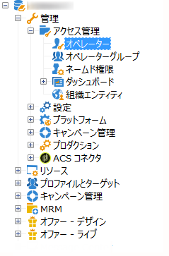
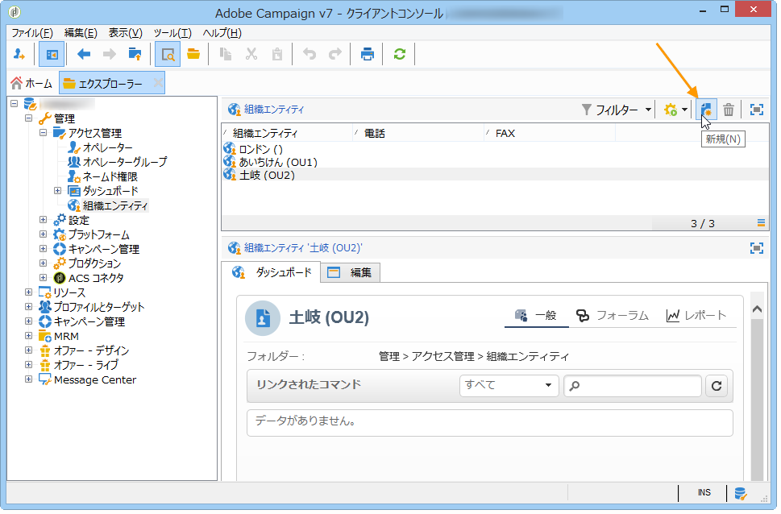

# 分散型マーケティングについて{#about-distributed-marketing}

## はじめに {#introduction}

Adobe Campaign では、セントラルエンティティ（本社、マーケティング部門など）とローカルエンティティ（店舗、地域のエージェントなど）が協調キャンペーンを展開できる、**分散型マーケティング**&#x200B;アプリケーションを活用できます。この連携のベースとなるのは、**[!UICONTROL キャンペーンパッケージのリスト]**&#x200B;と呼ばれる共有ワークスペースです。セントラルエンティティで作成されたキャンペーンのテンプレートやインスタンスは、このワークスペース上でローカルエンティティに提供されます。

セントラルエンティティは、ローカルエンティティに提供するキャンペーンをセットアップし、ローカルキャンペーンまたは協調キャンペーンのいずれかのパッケージを作成します。ローカルエンティティがキャンペーンを使用するには、キャンペーンをオーダーし、承認を受けなければなりません。

>[!CAUTION]
>
>分散型マーケティングモジュールは、**キャンペーン**&#x200B;のオプションとして提供されます。使用許諾契約書を確認してください。

## 用語 {#terminology}

### セントラルエンティティ {#central-entities}

セントラルエンティティは、マーケティングのオペレーターによって構成されます。コミュニケーションを指定し、ローカルエンティティによるマーケティングキャンペーンの展開をサポートする役割を果たします。

分散型マーケティングモジュールでは、セントラルエンティティは次の操作を実行できます。

* ローカルエンティティに提供するマーケティングキャンペーンのパッケージをセットアップします。
* 顧客／見込み客とのコミュニケーション、ターゲティング、コンテンツの選定などに関して、ローカルエンティティの裁量範囲を広げます。
* コストを管理し、コントロールします。
* エージェントのネットワークを管理します。

### ローカルエンティティ {#local-entities}

ローカルエンティティは、エージェント、店舗または特定のローカルオペレーターグループ（国または地域のマネージャー、ブランドマネージャーなど）です。

分散型マーケティングでは、実行コストを最適化しつつ、ローカルエンティティにより大きな裁量を与えることができます。

### ローカライゼーション {#localization}

ローカライゼーションにより、ローカルエンティティはキャンペーンのターゲットやコンテンツに変更を加えることができます。どの程度のローカライゼーションが可能かは、キャンペーンのタイプや実装によって異なります。

### キャンペーンパッケージのリスト {#list-of-campaign-packages}

キャンペーンパッケージのリストには、ローカルエンティティが使用できるキャンペーンが含まれます。

### キャンペーンパッケージ {#campaign-package}

セントラルエンティティが作成し、ローカルエンティティに提供されるテンプレート（またはキャンペーンインスタンス）です。

### ローカルキャンペーン {#local-campaign}

ローカルキャンペーンとは、**[!UICONTROL キャンペーンパッケージ]**&#x200B;のリストで参照されているテンプレートから作成されたインスタンスであり、**実行スケジュール**&#x200B;を指定できます。ローカルキャンペーンの目的は、セントラルエンティティによって設定されたテンプレートを使用して、ローカルのコミュニケーションのニーズを満たすキャンペーンを展開することです。

ローカルエンティティの自立度は実装によって異なります。

[ローカルキャンペーンの作成](../../campaign/using/creating-a-local-campaign.md)を参照してください。

### 協調キャンペーン {#collaborative-campaign}

協調キャンペーンは、ローカルエンティティが使用できるキャンペーンです。ただし、**実行スケジュールはセントラルエンティティによって定義**&#x200B;されます。すべてのローカルエンティティに同じコンテンツが提供されますが、コストは共有です。ローカルエンティティが協調キャンペーンに参加するには、登録が必要です。

* **[!UICONTROL 協調キャンペーン（フォーム）]**：最大 300 までのローカルエンティティが参加するキャンペーンに最適です。ローカルエンティティは、ターゲティングやコンテンツのパーソナライゼーションに関係するあらかじめ定義されたパラメーターを Web フォームに入力できます。Web フォームは、Adobe Campaign のフォームまたは外部のフォーム（エクストラネットのクライアント）のいずれかです。機能管理者は、インテグレーターによって定義されたフォームテンプレートに基づいて、フォームを定義および設定できます。Web へのアクセスが可能であれば、ローカルエンティティはキャンペーンをオーダーできます。
* **[!UICONTROL 協調キャンペーン（キャンペーン）]**：数十のローカルエンティティが参加するキャンペーンに最適です。このタイプのキャンペーンでは、ローカルエンティティごとに子キャンペーンが作成されます。セントラルエンティティが&#x200B;**[!UICONTROL 協調キャンペーン（キャンペーン）]**&#x200B;を承認すると、ローカルエンティティはキャンペーンを変更できるようになります。親キャンペーンと子キャンペーンの実行は、自動的に同期されます。ローカルエンティティがキャンペーンをオーダーし、キャンペーンに参加するには、インスタンスへのアクセス権が必要です。
* **[!UICONTROL 協調キャンペーン（ターゲットの承認）]**：数千のローカルエンティティが参加するキャンペーンに最適です。ローカルエンティティは、セントラルエンティティによってあらかじめ定義された連絡先リストを受け取り、キャンペーンのコンテンツに基づいて、どの連絡先を保持するかを Web フォーム上で指定します。ローカルエンティティは、選択した連絡先リストの中から選ばれます。Web へのアクセスが可能であれば、ローカルエンティティはキャンペーンに参加できます。
* **[!UICONTROL 協調キャンペーン（シンプル）]**：このモードでは、旧バージョンの特定の実行プロセスとの互換性を確保できます。

[協調キャンペーンの作成](../../campaign/using/creating-a-collaborative-campaign.md)を参照してください。

### キャンペーンパッケージのオーダー {#ordering-campaign-packages}

ローカルエンティティがキャンペーンに登録すると、オーダーが作成されます。オーダーには、キャンペーンのローカライゼーションに関連する情報がすべて格納されます。

## ワークスペース {#workspace}

キャンペーンパッケージのリストにアクセスするには、**キャンペーン**&#x200B;ウィンドウにある「**[!UICONTROL キャンペーンパッケージ]**」リンクをクリックします。

ローカルオペレーターには、ローカルエージェントが使用できるキャンペーンが表示されます。

セントラルエージェントには、キャンペーンパッケージのリストに含まれるすべてのパッケージと、リストを編集するためのリンクが表示されます。

## オペレーターとエンティティ {#operators-and-entities}

まず始めに、**[!UICONTROL アクセス管理]**&#x200B;フォルダーで、セントラルエンティティおよびローカルエンティティのオペレーターを指定します。

### オペレーター {#operators}

セントラルオペレーターとローカルオペレーターを作成します。

セントラルオペレーターは、**[!UICONTROL セントラル管理]**&#x200B;オペレーターグループに属しているか、**[!UICONTROL セントラル処理]**&#x200B;のネームド権限を有している必要があります。

ローカルオペレーターは、**[!UICONTROL ローカル管理]**&#x200B;オペレーターグループに属しているか、**[!UICONTROL ローカル処理]**&#x200B;のネームド権限を有している必要があります。また、ローカルオペレーターは、ローカルエンティティに関連付けられている必要があります。

### 組織エンティティ {#organizational-entities}

組織エンティティを作成するには、**[!UICONTROL 管理／アクセス管理／組織エンティティ]**&#x200B;ノードをクリックし、エンティティのリストの上にある「**[!UICONTROL 新規]**」アイコンをクリックします。

各組織エンティティには、識別情報（ラベル、内部名、連絡先情報など）とオーダーの承認プロセスに関係するグループの情報が格納されます。これらの情報は、「**[!UICONTROL 一般]**」タブの「**[!UICONTROL 通知と承認]**」セクションで定義されます。

* パッケージの通知グループを定義します。このグループのオペレーターは、キャンペーンパッケージのリストに新しいパッケージが追加されるか、キャンペーンの提供が開始されるたびに通知を受け取ります。
* オーダーを承認するレビュー担当者のグループを選択します。このグループは、ローカルエンティティによってオーダーされたキャンペーンの承認を担当します。
* 最後に、ローカルキャンペーン（ターゲット、コンテンツ、予算など）を承認するレビュー担当者のグループを選択します。このグループは、テンプレートによってはキャンペーンのオーダー時に追加できます。

>[!NOTE]
>
>承認プロセスについては、[承認プロセス](../../campaign/using/creating-a-local-campaign.md#approval-process)の節で説明しています。

## 実装 {#implementation}

分散型マーケティングのキャンペーンは、セントラルエンティティによって作成およびパブリッシュされます。作成されたキャンペーンは、必要に応じて、ローカルとセントラルの両方のエンティティを使用できます。

実装の手順は、使用するキャンペーンパッケージのタイプとローカルエンティティのデリゲーションレベルによって異なります。

### インテグレーターの手順 {#integrator-side}

1. ローカルエンティティを作成します。
1. ローカルエンティティを管理するオペレーターに受信者をリンクします。

   

1. ローカルエンティティの権限と参照ルールを指定します。
1. キャンペーンのローカライゼーションで使用される次の情報を指定します。

   * ターゲットの定義と最大サイズ
   * コンテンツ定義
   * 実行スケジュール（コンタクト日と抽出日）。**ローカルオペレーターのみ**
   * オーダースキーマの拡張（その他の必要なフィールドすべて）

1. Web フォーム（Adobe または外部）を作成します。Web フォームでは、ローカライゼーションパラメーターの表示、ターゲットと予算の評価に加え、コンテンツのプレビューやオーダーの承認を実行できます。

   **協調キャンペーン（ターゲットの承認）**&#x200B;の場合は、各ローカルエンティティの承認を保存するテーブルを作成します。

### 機能管理者の手順 {#functional-administrator-side}

以下の手順は、各キャンペーンの作成時に実行する必要があります。

1. キャンペーンのローカライゼーションに使用されるフィールドで、フォームを更新します。
1. 適切なキャンペーンテンプレートからインスタンス（協調キャンペーン）を作成するか、キャンペーンテンプレートの複製（ローカルキャンペーン）を作成します。
1. ローカライゼーションフィールドとフォームの参照を指定して、キャンペーンを設定します。
1. キャンペーンをパブリッシュします。

### ローカルオペレーターの手順 {#local-operator-side}

以下の手順は、キャンペーンごとに実行する必要があります。

1. 使用可能なキャンペーンパッケージについて通知を受け取ったら、キャンペーンのロケーション（オプション）を指定します。
1. ターゲットや予算などを評価します。
1. キャンペーンのコンテンツをプレビューします。
1. キャンペーンをオーダーします。

