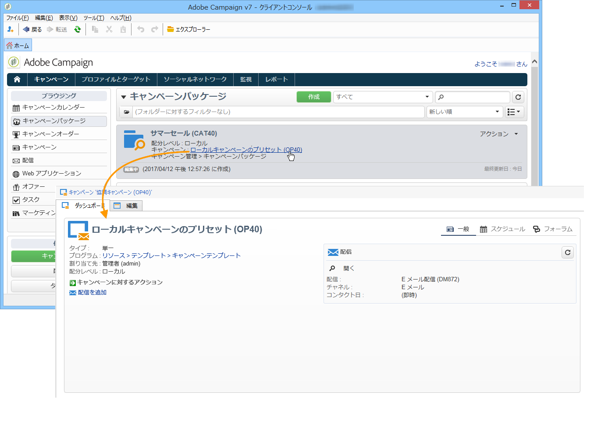

# キャンペーンへのアクセス{#accessing-campaigns}

キャンペーンがオーダーされ、オーダーが承認され、使用可能な日付に達すると、キャンペーンの実行が可能になります。

キャンペーンのタイプと選択したオプションによって、キャンペーンはローカルにまたは一元的に実行できます。

## キャンペーンへのアクセス {#accessing-the-campaign}

オーダーが承認され、使用可能な日付に達すると、キャンペーンがローカルに作成され、使用できるようになります。ローカルオペレーターに、キャンペーンが使用できることが通知されます。

該当するオーダーの詳細に情報が追加され、編集が可能になります。すべての情報が集約されているダッシュボードを使用して、ローカルレベルでキャンペーンを管理できます。

The campaign remains accessible in the Campaign overview, located via the **[!UICONTROL Campaigns]** link on the home page.

## 使用できる設定 {#available-settings}

ローカルエンティティは、キャンペーンのダッシュボードの項目を使用して、キャンペーンのコンテンツをニーズに応じて調整できます。主な作業は、ターゲティングワークフローの調整ですが、場合によって配信コンテンツのパーソナライゼーションも必要となることがあります。

## キャンペーンの実行 {#campaign-execution}

各ローカルエンティティは、キャンペーンワークフローを実行し、キャンペーンのテンプレートで定義されているプロセスに基づいて必要な承認をおこないます。
