# マーケティングキャンペーンへのアクセス{#accessing-marketing-campaigns}

Adobe Campaign では、マーケティングキャンペーンを作成、設定、実行および分析できます。すべてのマーケティングキャンペーンを統合コントロールセンターから管理できます。

## ワークスペースの基本 {#workspace-basics}

### ホームページ {#home-page}

Adobe Campaign に接続すると、ホームページが表示されます。

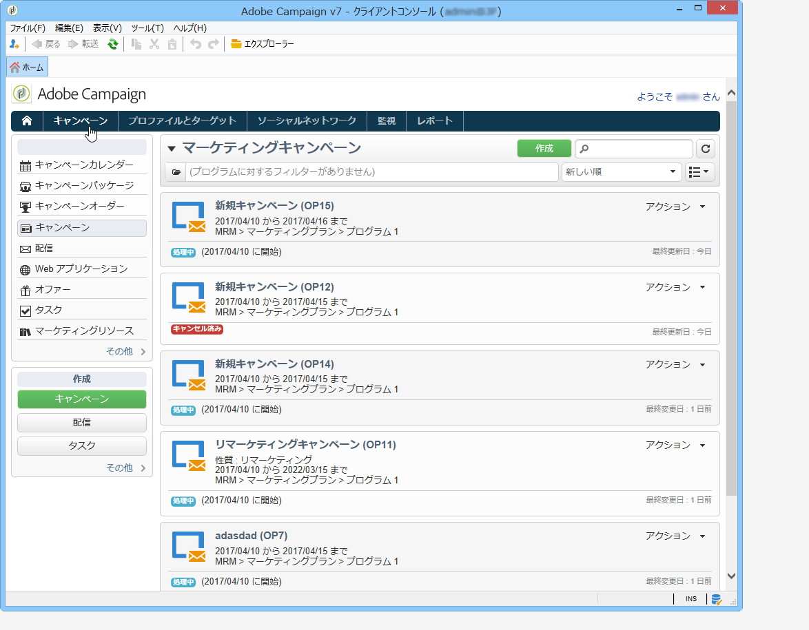

各種ウィンドウにアクセスするには、ナビゲーションバーのリンクをクリックします。

Campaign elements are found in the **[!UICONTROL Campaigns]** universe: here you can see an overview of the marketing programs and campaigns as well as their sub-sets. マーケティングプログラムは複数のキャンペーンで構成され、キャンペーンは配信、タスク、リンクされたリソースなどで構成されます。キャンペーンを使用したマーケティングキャンペーン管理のコンテキストでは、配信、予算、レビュー担当者およびリンクされたドキュメントに関する情報がキャンペーンに含まれます。

The navigation block of the **[!UICONTROL Campaigns]** universe offers various entries, depending on modules installed on the instance. 例えば、以下にアクセスできます。

* **キャンペーンカレンダー**：プラン、マーケティングプログラム、配信およびキャンペーンのカレンダーです。キャンペーンカレ [ンダーを参照](#campaign-calendar)。
* **キャンペーン**：すべてのマーケティングプログラムに含まれるキャンペーンにアクセスします。
* **配信**：キャンペーンにリンクされた配信にアクセスします。
* **Web アプリケーション**：Web アプリケーション（フォーム、調査など）にアクセスします。

>[!NOTE]
>
>Adobe Campaign 全体のエルゴノミクス、権限およびプロファイル管理機能については、[この節](../../platform/using/adobe-campaign-workspace.md)を参照してください。
>
>チャネルおよび配信に関連するすべての機能については、[この節](../../delivery/using/communication-channels.md)で詳しく説明しています。

### キャンペーンカレンダー {#campaign-calendar}

各キャンペーンはプログラムに所属し、プログラムはプランに所属します。Plans, programs and campaigns are accessed via the **[!UICONTROL Campaign calendar]** menu in the **Campaigns** universe.

To edit a plan, program, campaign or delivery, click its name in the calendar and then click **[!UICONTROL Open...]**. すると、次のように新しいタブに表示されます。

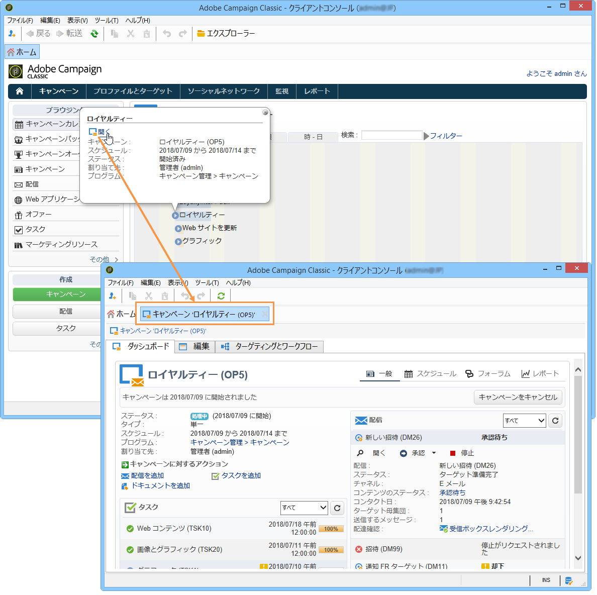

キャンペーンカレンダーに表示する情報をフィルタリングできます。To do this, click the **[!UICONTROL Filter]** link and select the filtering criteria.

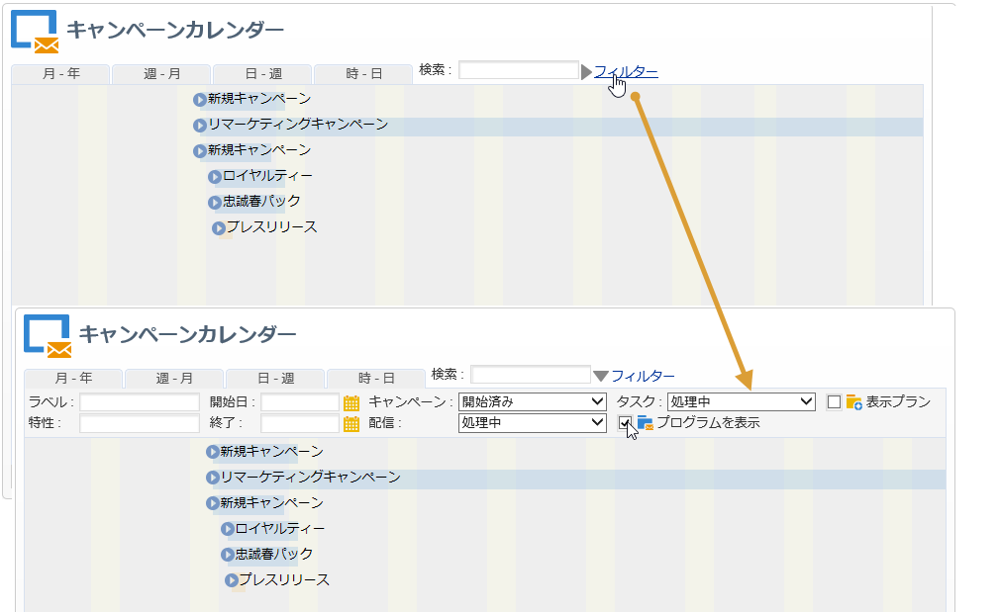

>[!NOTE]
>
>日付に対してフィルターを設定すると、開始日が指定された日付以降または終了日が指定された日付以前のキャンペーンがすべて表示されます。日付は、各フィールドの右側のカレンダーを使用して選択する必要があります。

You can also use the **[!UICONTROL Search]** field to filter the displayed items.

各項目にリンクされたアイコンを使用して、「完了」、「処理中」、「編集中」などのステータスを表示できます。

### マーケティングプログラムの参照 {#browsing-in-a-marketing-program}

キャンペーンでは、様々なマーケティングキャンペーンで構成された一連のプログラムを管理できます。各キャンペーンには、配信および関連するプロセスとリソースが含まれます。

#### プログラムの参照 {#browsing-a-program}

プログラムを編集する際は、後述のタブを使用して、プログラムを参照および設定します。

* 「**スケジュール**」タブには、カレンダーのヘッダーでクリックしたタブに応じて、1 ヶ月、1 週間または 1 日のプログラムのカレンダーが表示されます。

   必要に応じて、このページからキャンペーン、プログラムまたはタスクを作成できます。

   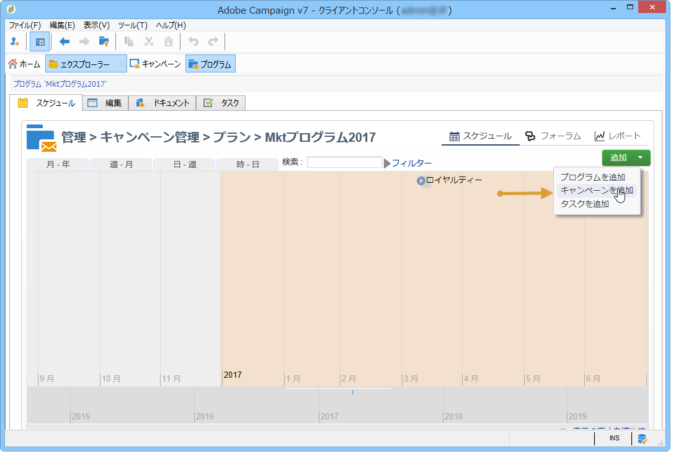

* 「**編集**」タブを使用して、名前、開始日と終了日、予算、リンクされたドキュメントなど、プログラムをパーソナライズできます。

   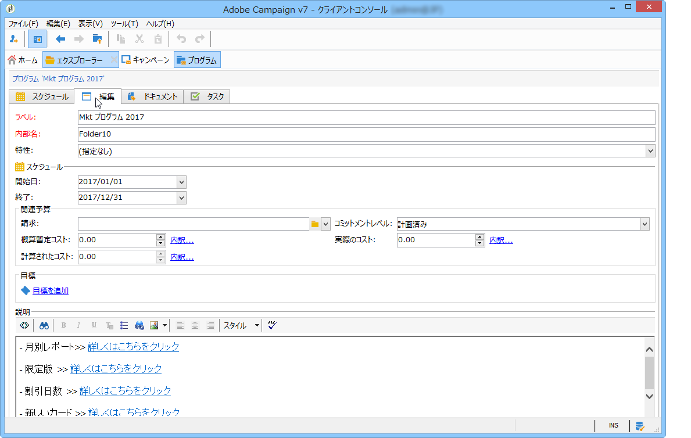

#### キャンペーンの参照 {#browsing-campaigns}

Campaigns can be accessed via the campaign calendar, the **[!UICONTROL Schedule]** tab of the program, or the list of campaigns.

1. Via the campaign calendar, select the campaign you want to display, then click the **[!UICONTROL Open]** link.

   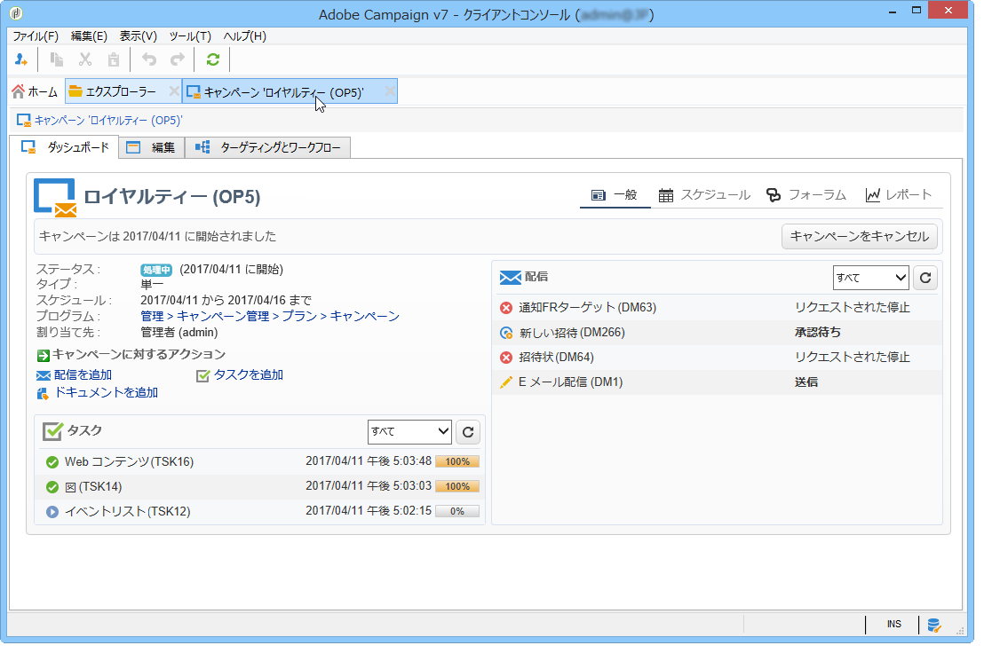

   次のように、キャンペーンは新しいタブで編集されます。

   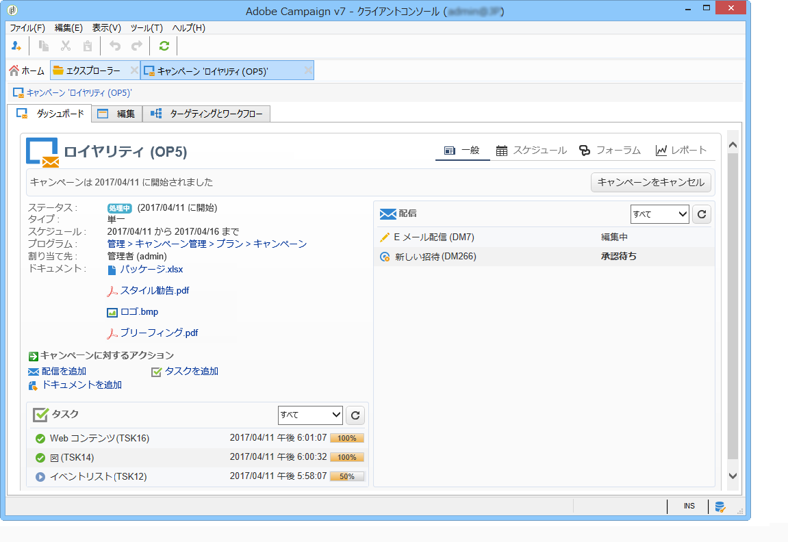

1. Via the **[!UICONTROL Schedule]** tab of the program, the edit mode is the same as via the campaign calendar.
1. Via the **[!UICONTROL Campaigns]** link of the **[!UICONTROL Campaigns]** universe, click the name of the campaign you want to edit.

   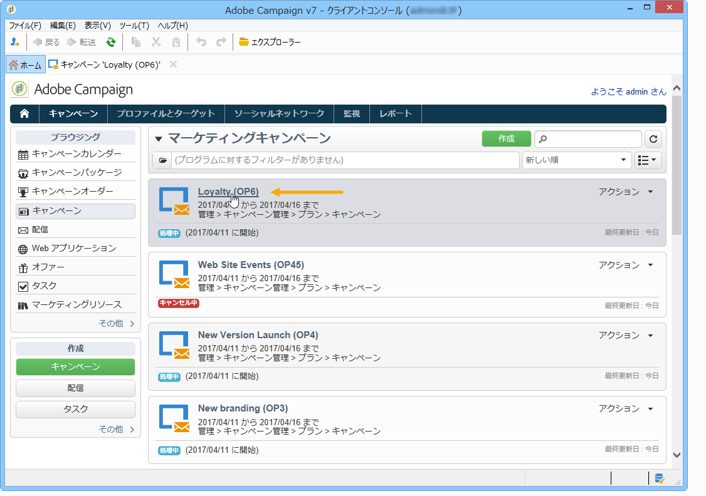

### キャンペーンのコントロール {#controlling-a-campaign}

#### ダッシュボード {#dashboard}

キャンペーンごとに、ジョブ、リソース、配信を単一の画面、すなわちダッシュボードで一元管理します。ダッシュボードを使用すると、他のユーザーと協調してマーケティングアクションを管理できます。

キャンペーンのダッシュボードをコントロールインターフェイスとして使用します。ダッシュボードから、配信、抽出ファイル、通知、予算など、メインのキャンペーン作成および管理ステージに直接アクセスできます。

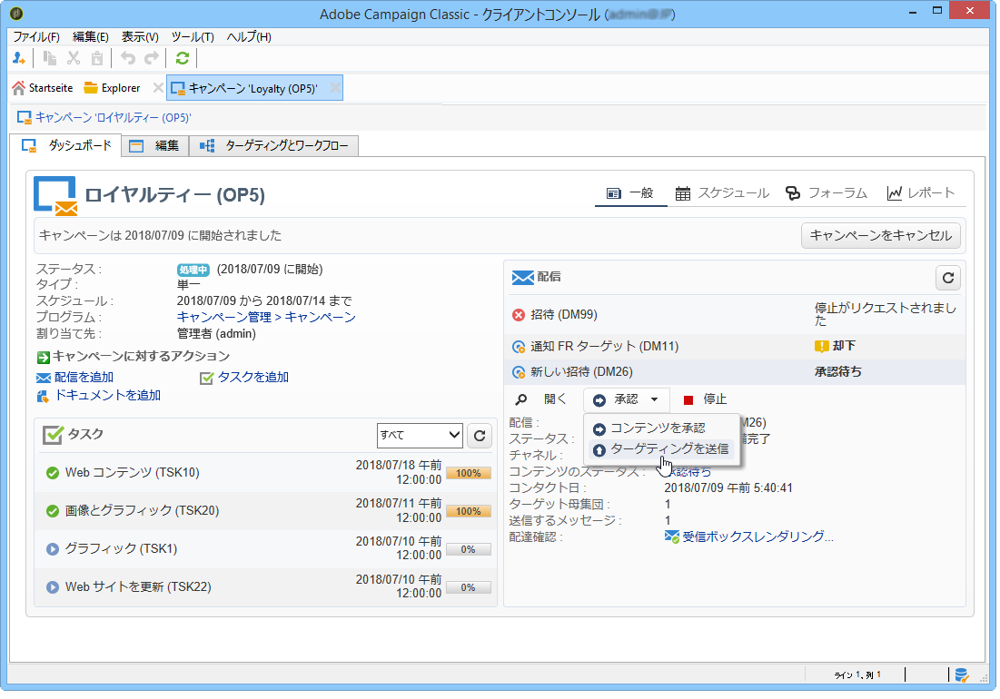

Adobe Campaign では、予算、ターゲット、コンテンツなどを承認する、マーケティングおよびコミュニケーションキャンペーンの様々なステージの作成および承認のための協調プロセスを設定できます。

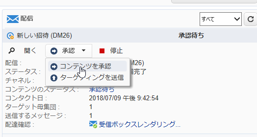

>[!NOTE]
>
>The configuration of campaign templates is presented in [Campaign templates](../../campaign/using/marketing-campaign-templates.md#campaign-templates).

#### スケジュール {#schedule}

キャンペーンは、一連の配信を一元管理します。スケジュールでは、キャンペーンごとのすべてのコンポーネントがグローバルビューで表示されます。このビューにタスクと配信を表示し、容易にアクセスすることができます。

#### フォーラム {#forum}

キャンペーンごとに、オペレーターが専用のフォーラムでメッセージをやり取りできます。

For more on this, refer to [Discussion forums](../../campaign/using/discussion-forums.md).

#### レポート {#reports}

The **[!UICONTROL Reports]** link lets you access the campaign reports.

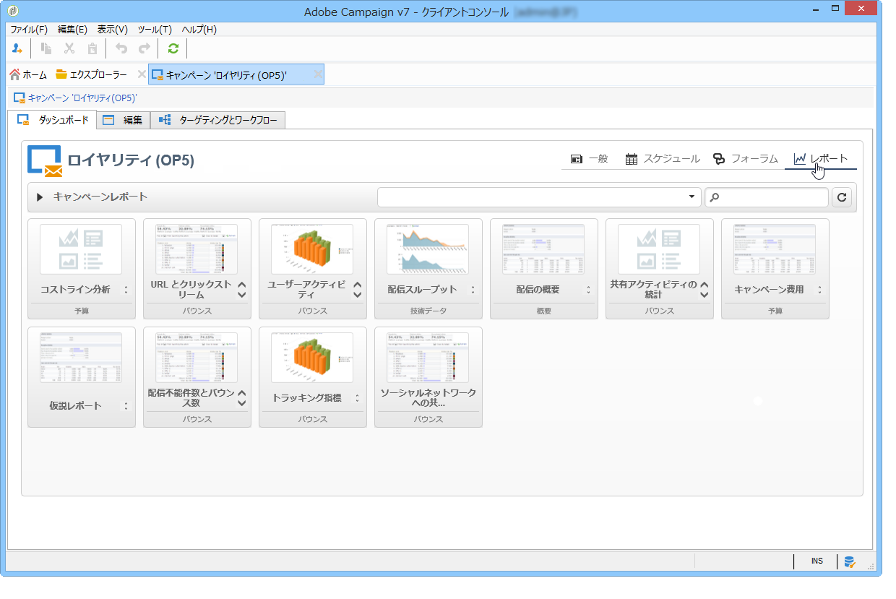

>[!NOTE]
>
>レポートについて詳しくは、[この節](../../reporting/using/about-adobe-campaign-reporting-tools.md)を参照してください。

#### 設定 {#configuration}

キャンペーンは、キャンペーンテンプレートから作成します。一部のオプションが選択され、その他の設定が既に保存されている、再利用可能なテンプレートを設定できます。キャンペーンごとに、次の機能が提供されます。

* ドキュメントとリソースの参照：ドキュメント（概要、レポート、画像など）とキャンペーンを関連付けることができます。あらゆるドキュメントフォーマットをサポートしています。関連ドキュ [メントの管理を参照してくださ](../../campaign/using/marketing-campaign-deliveries.md#managing-associated-documents)い。
* コストの定義：Adobe Campaign では、キャンペーンごとに、コストエントリと、マーケティングキャンペーン作成時に使用できるコスト計算構造を定義できます。例：印刷費用、外部代理店の使用、部屋の貸与等 「原価カ [テゴリの定義」を参照してくださ](../../campaign/using/providers--stocks-and-budgets.md#defining-cost-categories)い。
* 目標の定義：購読者数や取引高など、キャンペーンの定量化可能な目標を定義できます。この情報は、後でキャンペーンレポートに使用されます。
* Managing seed addresses (for more on this, refer to [this section](../../delivery/using/about-seed-addresses.md)) and control groups (refer to [Defining a control group](../../campaign/using/marketing-campaign-deliveries.md#defining-a-control-group)).
* 承認の管理：承認を得る処理や、必要に応じてレビュー担当のオペレーターまたはオペレーターのグループを選択できます。See [Checking and approving deliveries](../../campaign/using/marketing-campaign-approval.md#checking-and-approving-deliveries).

>[!NOTE]
>
>To access the campaign configurations and make changes to them, click the **[!UICONTROL Advanced campaign parameters...]** link in the **[!UICONTROL Edit]** tab. 配信が自動的に値を継承するようにキャンペーンレベルでパラメーターを設定する方法について詳しくは、TechNoteを参 [照してください](https://helpx.adobe.com/campaign/kb/simplifying-campaign-management-acc.html#Setparametersatthecampaignlevelsodeliveriesinheritvaluesautomatically)。

## Web インターフェイスの使用 {#using-the-web-interface-}

インターネットブラウザーから Adobe Campaign のコンソール画面にアクセスして、キャンペーンと配信だけでなく、レポートやデータベース内のプロファイルに関する情報も確認できます。このアクセスでは、レコードは作成できません。オペレーターの権限に応じて、データベース内のデータを確認したり、データに基づいて行動したりできます。例えば、キャンペーンのコンテンツとターゲティングを承認したり、配信を再開または停止することが可能です。

1. Log on as usual via https://`<your instance>:<port>/view/home`.
1. メニューを使用して概要にアクセスします。

   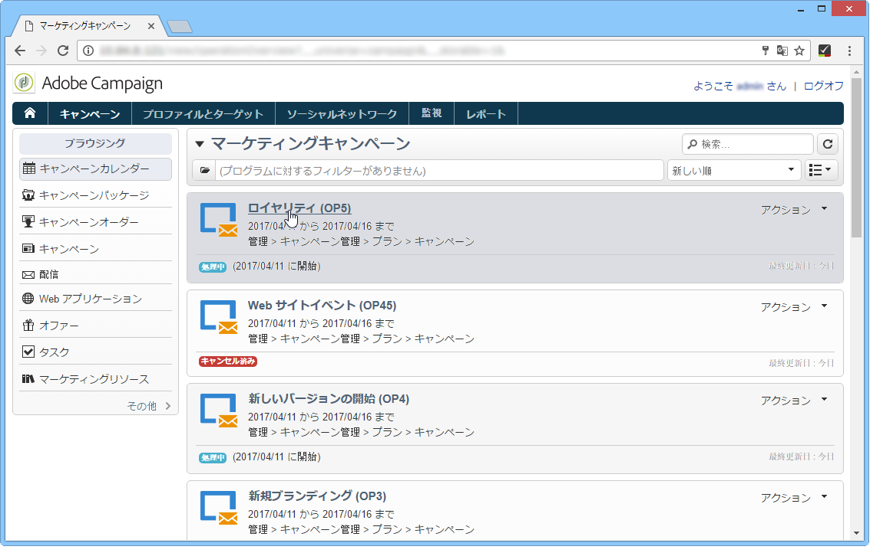

（ターゲットや配信コンテンツなどの）承認は、Web アクセスから実行できます。

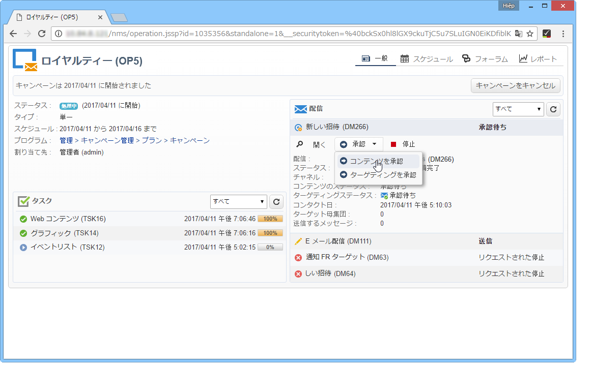

通知メッセージに含まれるリンクを使用することもできます。詳しくは、「配信の確認と承 [認」を参照してください](../../campaign/using/marketing-campaign-approval.md#checking-and-approving-deliveries)。
