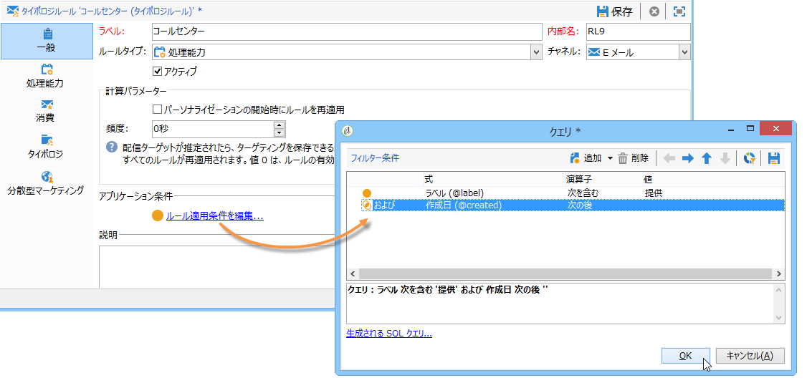
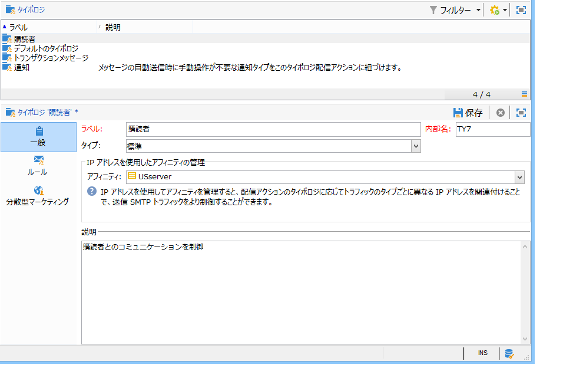
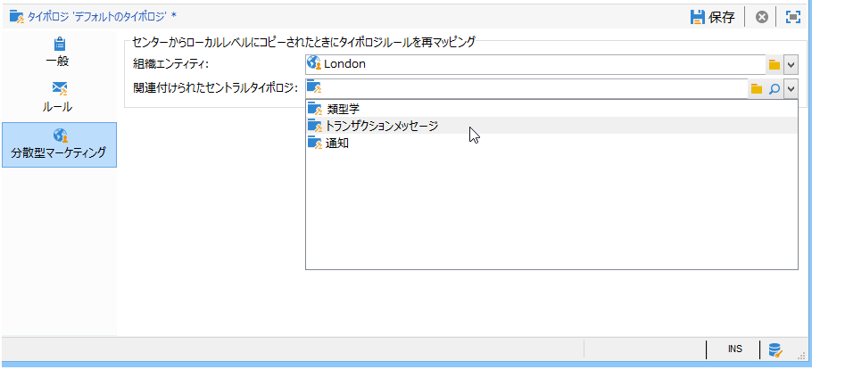

# ルールの適用{#applying-rules}

## 配信へのタイポロジの適用 {#applying-a-typology-to-a-delivery}

作成したタイポロジルールを適用するには、そのルールをタイポロジに関連付けたうえで、配信でこのタイポロジを参照する必要があります。手順は次のとおりです。

1. キャンペーンタイポロジを作成します。

   タイポロジには、>ノードを使用し **[!UICONTROL Administration > Campaign Management > Typology management]** てアクセス **[!UICONTROL Typologies]** します。

1. Go to the **[!UICONTROL Rules]** tab, click the **[!UICONTROL Add]** button and select the rules to apply with this typology.

   

1. タイポロジを保存して、既存のタイポロジのリストに追加します。
1. このルールを適用する配信を開きます。
1. Open the delivery properties and access the **[!UICONTROL Typology]** tab.
1. ドロップダウンリストからタイポロジを選択します。

   

   >[!NOTE]
   >
   >配信テンプレートでタイポロジを定義すると、このテンプレートを使用して作成されるすべての配信に自動的にこのタイポロジを適用できます。

## 適用条件の定義 {#defining-application-conditions}

ルールの適用範囲は、必要に応じて制限できます（ただし、コントロールルールは除く）。

例えば、タイポロジルールを設定して、リンク先の特定の配信だけに適用したり、配信のターゲットに含まれる特定の受信者だけに適用したりすることができます。

ルールの適用条件を定義するには、タブのリンク **[!UICONTROL Edit the rule application conditions...]** をクリックし **[!UICONTROL General]** ます。

次に、クエリエディターを使用して、フィルター条件を定義します。以下の図では、ラベルに「offer」という語が含まれる配信または現在の日付以降に作成された配信のみに、処理能力ルールが適用されます。

>[!NOTE]
>
>フィルタールールでは、配信または配信の概要に基づいて、フィルターの適用条件を指定できます。詳しくは、「フィルタリングルールの条 [件付け」を参照してください](../../campaign/using/filtering-rules.md#conditioning-a-filtering-rule)。

## 計算頻度の調整 {#adjusting-calculation-frequency}

判別はデータベースのクレンジングワークフローの一環として自動的に毎晩実行されますが、値は 1 日以上保存しておくことができます。

実際、計算で使用される値には、毎日変更はされないものもあります。したがって、毎日データを再計算し、データベースの負荷を増やすことは、適切とは言えません。例えば、顧客の傾向スコアと購入情報が週に一度マーケティングデータベースに保存される場合、これらの値に基づくデータを毎日再計算する必要はありません。

To do this, the **[!UICONTROL Frequency]** field of the **[!UICONTROL General]** tab lets you define a maximum period during which targeting is saved. デフォルトの値は **0** です。これは、翌日に判別が再び実行されるときまで、計算値が有効であることを示します。

To save the results beyond this period, enter a value greater than 12 in the **[!UICONTROL Frequency]** field: once this period expires, all rules are re-applied.

このオ **[!UICONTROL Re-apply the rule at the start of personalization]** プションを使用すると、フィールドに指定した期間がまだ有効である場合を含め、パーソナライゼーション段階で自動的にル **[!UICONTROL Frequency]** ールを適用できます。

## ルールの適用フェーズの選択 {#selecting-the-rule-application-phase}

タイポロジルールは、配信のターゲティング、分析およびパーソナライゼーションのフェーズで、特定の順序に従って適用されます。

### 実行順序 {#execution-order}

標準の操作モードでは、ルールは次の順序で適用されます。

1. ターゲティングの開始時に適用されるコントロールルール
1. フィルタールール:

   * デフォルトで適用されるアドレス選定ルール（定義されたアドレス／検証されていないアドレス／ブラックリストに登録されたアドレス／強制隔離されたアドレス／アドレスの質）
   * ユーザーによって定義されたフィルタールール
   * アドレスまたは識別子の重複排除ルール（必要に応じて適用）

1. 頻度ルール
1. 処理能力ルール
1. ターゲティングの終了時に適用されるコントロールルール
1. パーソナライゼーションの開始時に適用されるコントロールルール（ユーザーのルール（フィルター／頻度／処理能力）の有効期限が切れ、再計算が必要な場合は、この段階で適用されます）
1. パーソナライゼーションの終了時に適用されるコントロールルール

>[!NOTE]
>
>キャンペーンインタラクションモジュールを操作する場合、オファーの実施要件ルールはフィルタールールと同じタイミングで適用されるか（オファーが配信の概要に含まれる場合）、パーソナライゼーションのフェーズ、オファーエンジンの呼び出し時に適用されます。

You can adapt the execution sequence of rules which have the same type using the appropriate field in the **[!UICONTROL General]** tab of the rule. When several rules are executed during the same message processing phase, you can configure their execution sequence in the **[!UICONTROL Execution sequence]** field.

例えば、実行順序が 20 番目の頻度ルールは、実行順序が 30 番目の頻度ルールより先に実行されます。

### コントロールルール {#control-rules}

For **[!UICONTROL Control]** rules, you can decide at which point of the delivery life cycle the rule will be applied (before or after targeting, at the start of personalization, at the end of the analysis). Select the value to apply in the drop-down list of the **[!UICONTROL Phase]** field, in the **[!UICONTROL General]** tab of the typology rule.

次のような値を選択できます。

* **[!UICONTROL At the start of targeting]**

   エラーが発生した場合にパーソナライゼーションを実行しないようにするには、この段階でコントロールルールを適用します。

* **[!UICONTROL After targeting]**

   コントロールルールを適用する前にターゲットのボリュームを把握しておきたい場合は、このフェーズを選択します。

   For example, the **[!UICONTROL Check proof size]** control rule applies after each targeting stage: this rule prevents message personalization if there are too many proof recipients.

* **[!UICONTROL At the start of personalization]**

   コントロールルールで、メッセージのパーソナライゼーションの承認を検証する場合は、このフェーズを選択します。メッセージのパーソナライゼーションは、分析フェーズで実行されます。

* **[!UICONTROL At the end of the analysis]**

   メッセージのパーソナライゼーションが完了している必要がある場合は、このフェーズを選択します。

## 任意の追加設定 {#additional-configurations}

### 送信 SMTP トラフィックの制御 {#control-outgoing-smtp-traffic}

As an option, you can use the **[!UICONTROL Managing affinities with IP addresses]** field to link deliveries to the delivery server (MTA) this affinity. この設定により、コンピューターや出力アドレスに配信される E メールの数を制限できます。

>[!NOTE]
>
>Affinity management does not apply for **[!UICONTROL Filtering]** typologies.\
>アフィニティは、Adobe Campaign サーバーのインスタンス設定ファイルで定義されます。詳しくは、[この節](../../installation/using/about-initial-configuration.md)を参照してください。

### キャンペーンの最適化と分散型マーケティング {#campaign-optimization-and-distributed-marketing}

The **[!UICONTROL Distributed Marketing]** tab lets you define the re-mapping of typologies and/or rules which applies when a shared campaign is ordered and/or reserved. 分散型マーケティングでは、ローカルエンティティのタイポロジ／ルール（セントラルエンティティ向けに定義されたタイポロジ／ルールにリンクされる）によって、セントラルエンティティのタイポロジ／ルールが置換されます。再マッピングすると、キャンペーンをオーダーするローカルエンティティに応じて、セントラルエンティティのルールを調整することができます。

>[!NOTE]
>
>In typologies and typology rules, the **[!UICONTROL Distributed Marketing]** tab is added if your license includes this option: please check you license agreement.\
>分散マーケティングの詳細については、「分散マーケティングにつ [いて」を参照してください](../../campaign/using/about-distributed-marketing.md)。

