# シミュレーション{#campaign-simulations}

## シミュレーションについて {#about-simulations}

キャンペーンの最適化では、シミュレーションを活用して、キャンペーンプランの効率性をテストできます。このテストにより、発生する売上やタイポロジルールに基づくターゲットのボリュームなど、キャンペーンの成功の可能性を評価できます。

シミュレーションを実行すれば、配信の影響を監視し、比較することができます。

>[!NOTE]
>
>暫定カレンダーで予約されていない限り、テストモードの配信が互いに影響を与えることはありません（分散型マーケティングのキャンペーンを評価する場合など）。\
>つまり、圧力と容量のルールは、モードでの配信にのみ適用さ **[!UICONTROL Target estimation and message personalization]** れます。 モードとモ **[!UICONTROL Estimation and approval of the provisional target]** ードの配 **[!UICONTROL Target evaluation]** 信は考慮されません。\
>The delivery mode is chosen in the **[!UICONTROL Typology]** sub-tab of the delivery properties.

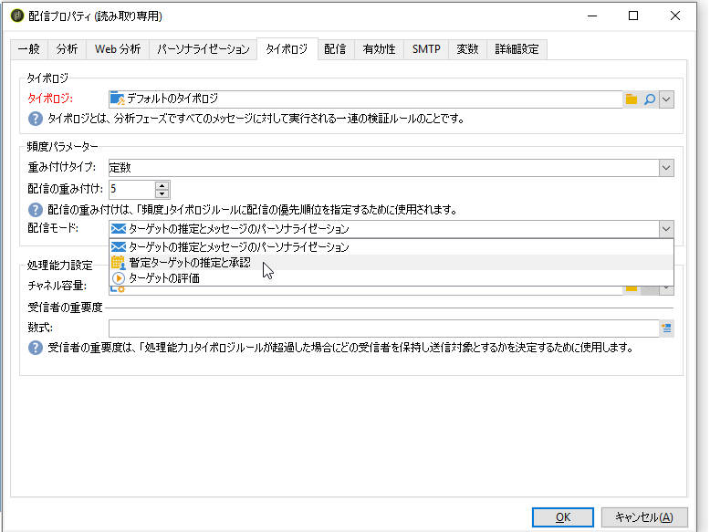

## シミュレーションの設定 {#setting-up-a-simulation}

### シミュレーションの作成 {#creating-a-simulation}

シミュレーションを作成するには、次の手順に従います。

1. Go to the **[!UICONTROL Campaigns]** universe, click the **[!UICONTROL More]** link within the **[!UICONTROL Create]** section and select the **[!UICONTROL Simulation]** option.

   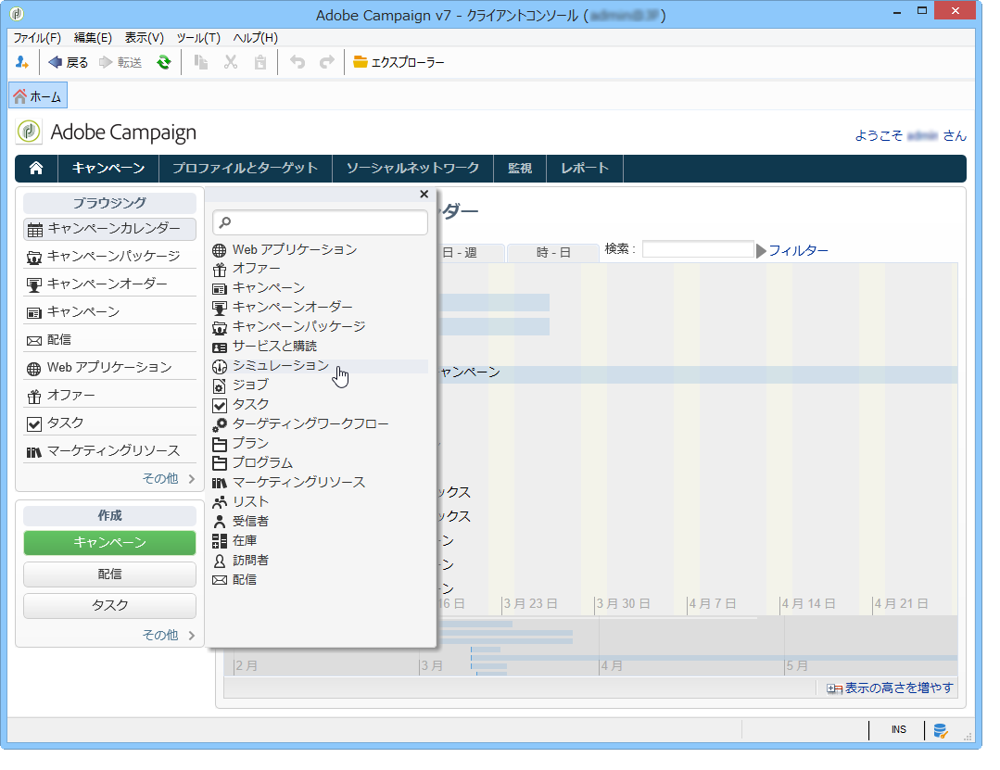

1. テンプレートおよびシミュレーションの名前を入力します。Click **[!UICONTROL Save]** to create the simulation.

   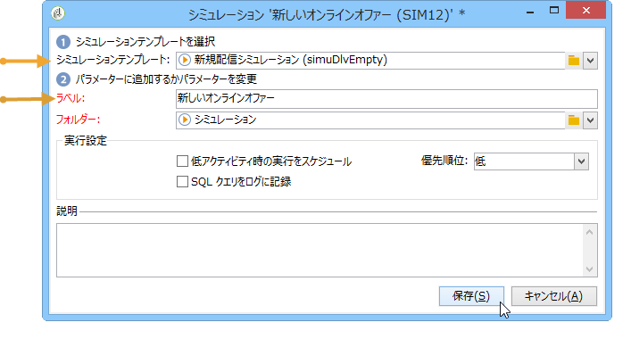

1. Click the **[!UICONTROL Edit]** tab to configure it.

   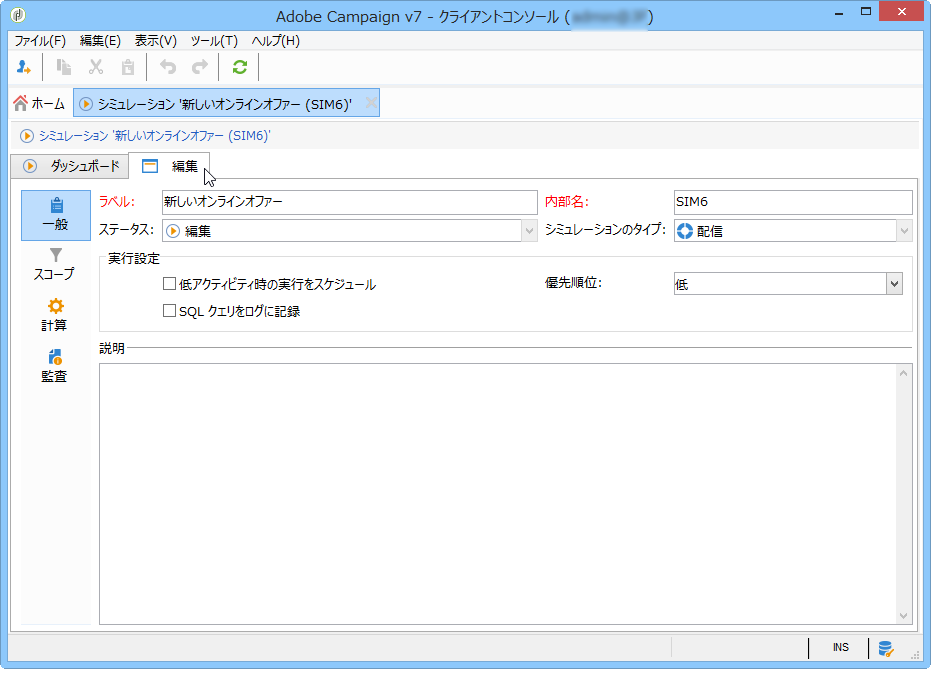

1. In the **[!UICONTROL Scope]** tab, specify the deliveries you want to consider for this simulation. To do this, click the **[!UICONTROL Add]** button and specify the delivery selection mode to take into account.

   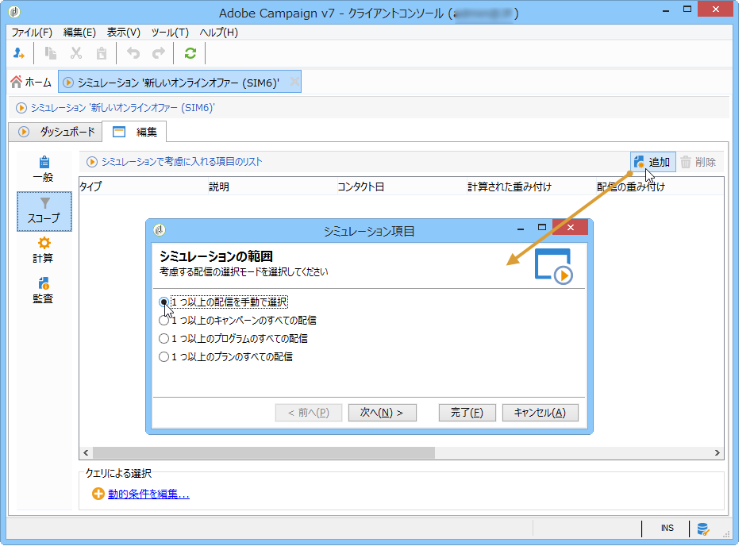

   配信は、1 つずつ選択するか、キャンペーン、プログラムまたはプラン別に並べ替えることができます。

   >[!NOTE]
   >
   >プラン、プログラムまたはキャンペーンの配信を選択する場合は、シミュレーションの開始時に、考慮する配信のリストを自動的に更新することが可能です。これを行うには、オプションをオンに **[!UICONTROL Refresh the selection of deliveries each time the simulation is started]** します。
   >  
   >このオプションがオンになっていない場合、シミュレーション作成の時点でプラン、プログラムまたはキャンペーンに含まれていない配信は考慮されなくなります。後で追加された配信はすべて無視されます。

   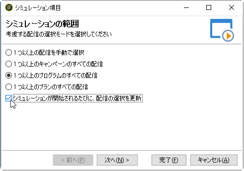

1. シミュレーションのスコープに含める項目を選択します。複数の項目を選択する場合は、Shift キーや Ctrl キーを使用できます。

   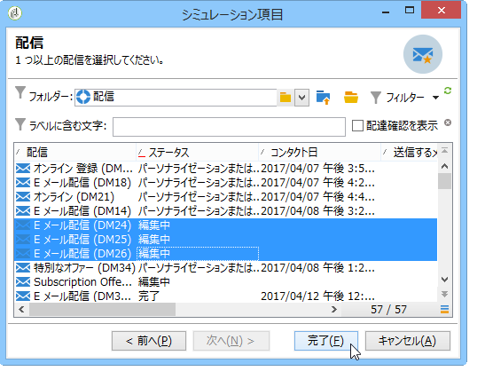

   「**[!UICONTROL Finish]**」をクリックして、選択を承認します。

   選択した配信とプラン、プログラムまたはキャンペーンに属する配信を手動で組み合わせることもできます。

   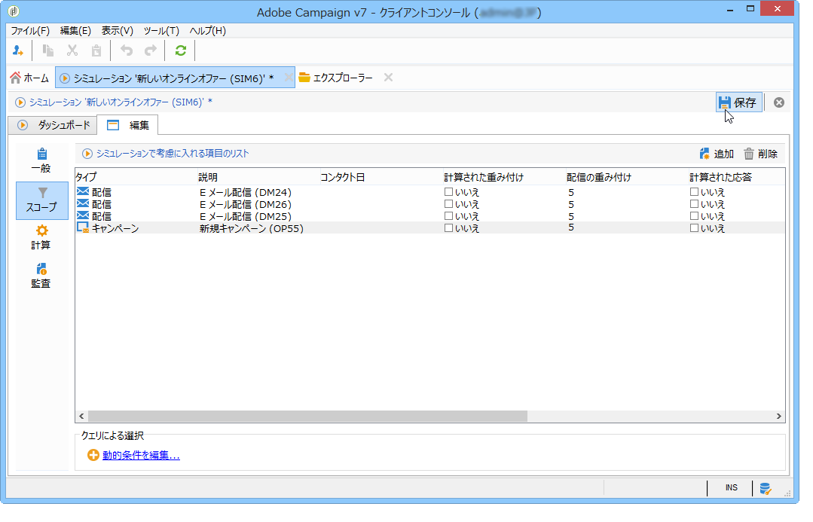

   必要に応じて、リンクを介して動的条件を使用できま **[!UICONTROL Edit the dynamic condition...]** す

   Click **[!UICONTROL Save]** to approve this configuration.

   >[!CAUTION]
   >
   >シミュレーション(ステータス： **Target readyまたは** Ready to deliver ****)。

1. In the **[!UICONTROL Calculations]** tab, select an analysis dimension such as the recipient schema for example.

   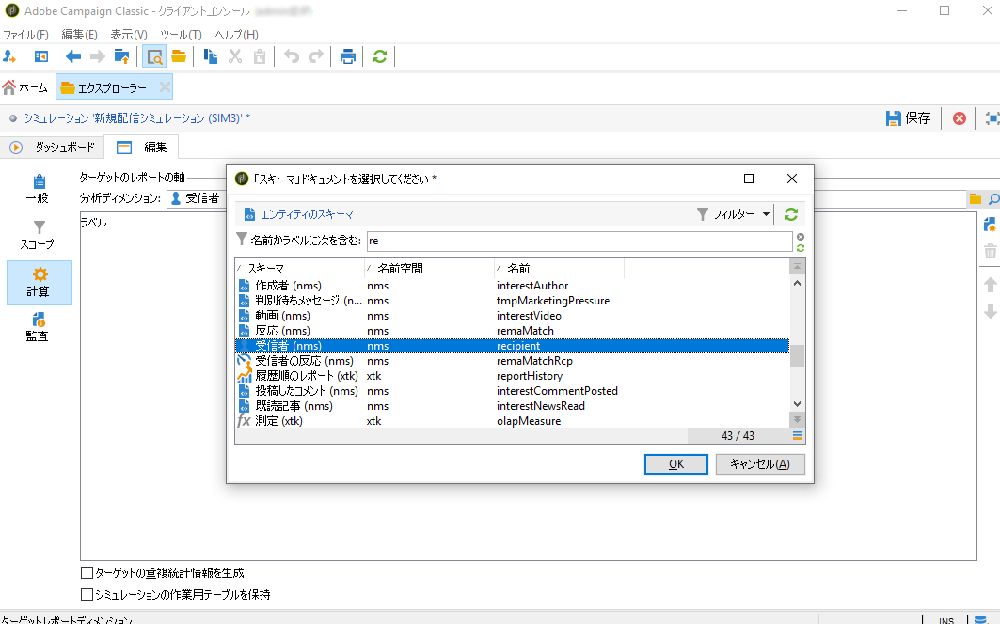

1. その後、式を追加できます。

   

### 実行設定 {#execution-settings}

The **[!UICONTROL General]** tab of the simulation lets you enter execution settings:

* The **[!UICONTROL Schedule execution for down-time]** option defers the simulation launch to a less busy time period, based on the chosen level of priority. シミュレーションはデータベースのリソースを大量に消費するので、緊急度の低いシミュレーションは夜間などの時間帯に実行するようスケジュールを調整する必要があります。
* The **[!UICONTROL Priority]** is the level applied to the simulation to delay its triggering.
* **[!UICONTROL Save SQL queries in the log]**. SQL ログは、エラーの発生したシミュレーションを診断する際に使用できます。また、シミュレーションに時間がかかる原因も調べることができます。These messages will be visible after the simulation in the **[!UICONTROL SQL logs]** sub-tab of the **[!UICONTROL Audit]** tab.

## シミュレーションの実行 {#executing-a-simulation}

### シミュレーションの開始 {#starting-a-simulation}

スコープを定義したら、シミュレーションを実行できます。

To do this, open the simulation dashboard and click **[!UICONTROL Start simulation]**.

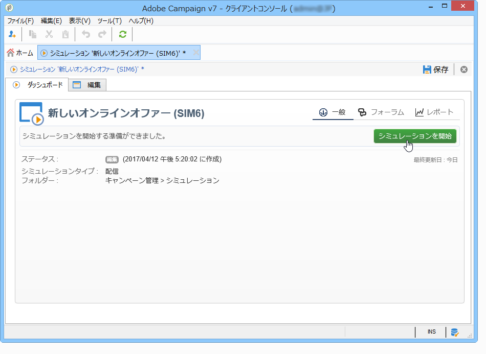

Once execution is complete, open the simulation and click the **[!UICONTROL Results]** tab to view the targets calculated for each delivery.

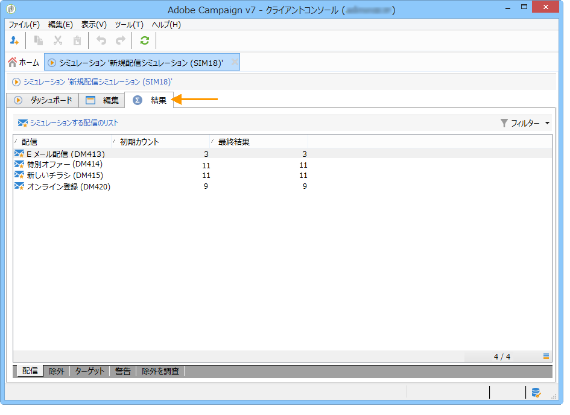

1. The **[!UICONTROL Deliveries]** sub-tab lists all deliveries taken into account by the simulation. この一覧には、2 つのカウントが含まれます。

   * The **[!UICONTROL Initial count]** is the target as it was calculated during its estimation in the delivery.
   * The **[!UICONTROL Final count]** is the number of recipients counted after simulation.

      2 つのカウントの数値の差は、シミュレーションの前に設定された様々なルールやフィルターの適用結果を反映しています。

      To learn more about this calculation, edit the **[!UICONTROL Exclusions]** sub-tab.

1. The **[!UICONTROL Exclusions]** sub-tab lets you view the exclusion break-down.

   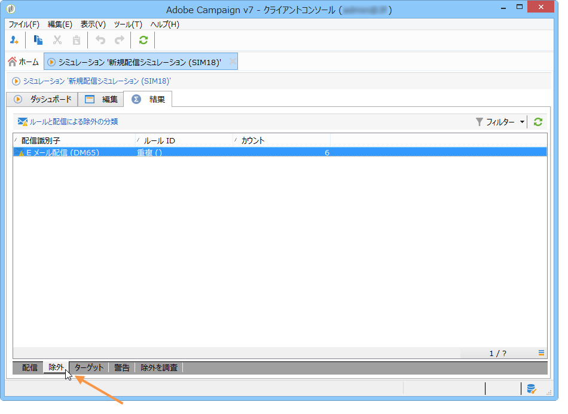

1. The **[!UICONTROL Alerts]** sub-tab groups all alert messages generated during the simulation. アラートメッセージは、処理能力を超える場合（ターゲット受信者の数が処理能力を上回る場合など）に送信できます。
1. サブタ **[!UICONTROL Exploration of the exclusions]** ブを使用して、結果分析テーブルを作成できます。 テーブルを作成する場合は、横軸と縦軸の変数を指定する必要があります。

   For an example of analysis table creation, refer to the end of [Exploring results](#exploring-results).

### 結果の表示 {#viewing-results}

#### 監査 {#audit}

The **[!UICONTROL Audit]** tab lets you monitor simulation execution. The **[!UICONTROL SQL Logs]** sub-tab is useful for expert users. SQL 形式で実行ログの一覧を表示できます。これらのログは、シミュレーションの実行前にタ **[!UICONTROL Save SQL queries in the log]** ブでこのオプションが選択されて **[!UICONTROL General]** いる場合にのみ表示されます。

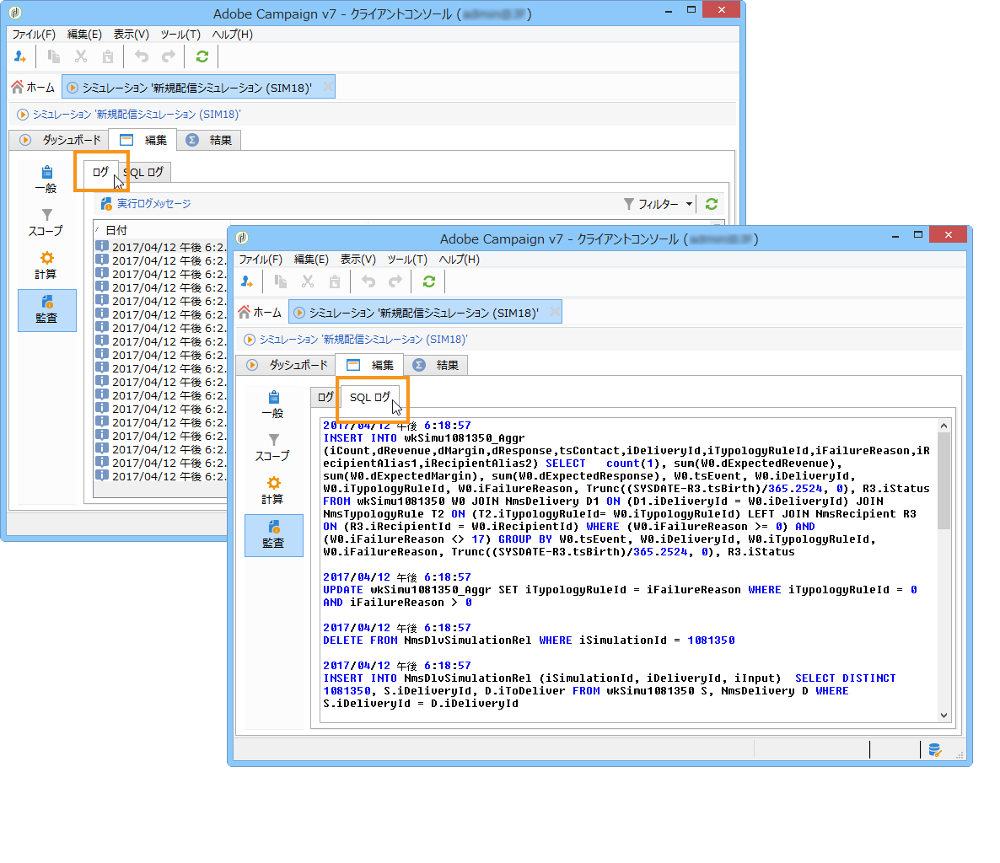

#### 結果の参照 {#exploring-results}

サブタ **[!UICONTROL Exploration of the exclusions]** ブを使用すると、シミュレーションの結果生じるデータを分析できます。

記述的分析について詳しくは、[この節](../../reporting/using/about-adobe-campaign-reporting-tools.md)を参照してください。

## シミュレーションの結果 {#results-of-a-simulation}

The indicators in the **[!UICONTROL Log]** and **[!UICONTROL Results]** tabs provide a first overview of simulation results. For a more detailed view of results, open the **[!UICONTROL Reports]** tab.

### レポート {#reports}

シミュレーションの結果を分析するには、除外と原因を示すレポートを編集します。

デフォルトでは、次のレポートが提供されます。

* **[!UICONTROL Detail of simulation exclusions]** :このレポートは、関連するすべての配信の除外原因の詳細なグラフを提供します。
* **[!UICONTROL Simulation summary]** :このレポートには、様々な配信の間、シミュレーションから除外された訪問者が表示されます。
* **[!UICONTROL Summary of exclusions linked to the simulation]** :このレポートには、シミュレーションによる除外のグラフと、適用されたタイポロジルールおよびルールごとの除外率を示すグラフが表示されます。

>[!NOTE]
>
>新しいレポートを作成し、デフォルトのレポートに追加することができます。詳しくは、[この節](../../reporting/using/about-adobe-campaign-reporting-tools.md)を参照してください。

To access reports, click the **[!UICONTROL Reports]** link of the targeted simulation via its dashboard.

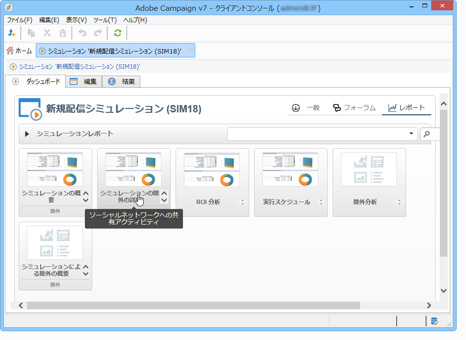

You can also edit reports using the **[!UICONTROL Reports]** link accessible from the simulation dashboard.

### シミュレーションの比較 {#comparing-simulations-}

シミュレーションを実行するたびに、前のシミュレーションの結果は新しいシミュレーションの結果に置換されるので、複数のシミュレーションの結果を表示して比較することはできません。

シミュレーションの結果を比較するには、レポートを使用する必要があります。Adobe Campaign では、レポート履歴を保存して、後で参照することができます。履歴は、シミュレーションのライフサイクルを通して保存されます。

**例：**

1. タイポロジ **A** が適用されている配信のシミュレーションを作成します。
1. タブで、 **[!UICONTROL Reports]** 例えば、使用可能なレポートの1つを編集 **[!UICONTROL Detail of simulation exclusions]** します。
1. レポート上部の右にあるセクションで、アイコンをクリックして、新しい履歴を作成します。

   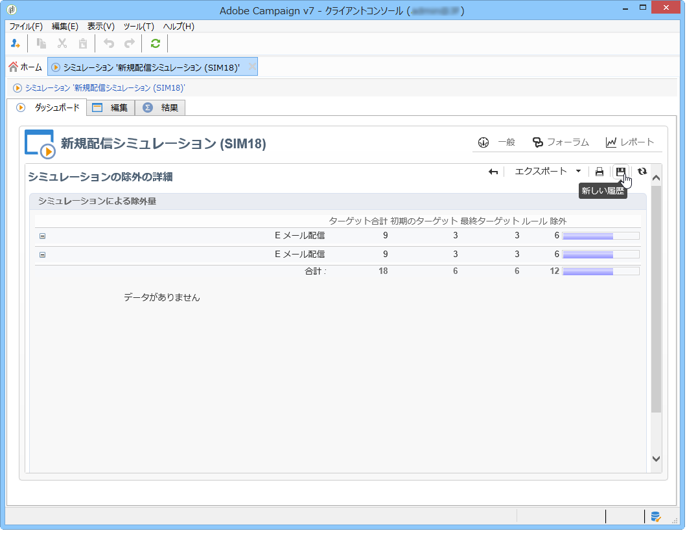

1. シミュレーションを閉じ、タイポロジ **A** の設定を変更します。
1. 再度シミュレーションを実行し、今回の結果とレポート履歴に保存されている先回の結果を比較します。

   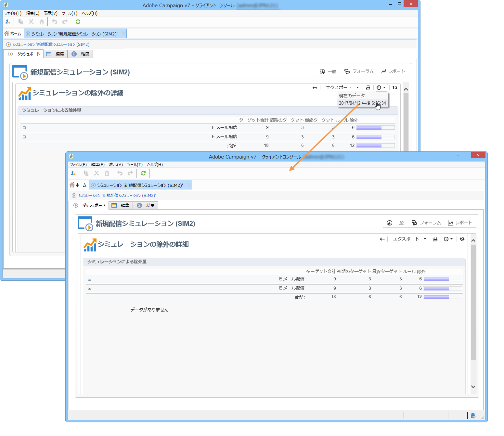

   レポート履歴は必要に応じて、いくつでも保存することができます。

### レポートの軸 {#reporting-axes}

The **[!UICONTROL Calculations]** tab lets you define reporting axes on the target. Theses axes will be used during result analysis (refer to [Exploring results](#exploring-results)).

>[!NOTE]
>
>レポートの軸は、シミュレーションごとに個別に定義するのではなく、シミュレーションテンプレートで定義することをお勧めします。\
>シミュレーションテンプレートは、Adobe Campaign **[!UICONTROL Resources > Templates > Simulation templates]** ツリーのノードに保存されます。

**例：**

次の例では、受信者のステータス（「顧客」、「見込み客」または「なし」）に基づくレポート軸を追加します。

1. To define a reporting axis, select the table which contains the information to be processed in the **[!UICONTROL Analysis dimension]** field. この情報は必須です。
1. 受信者テーブルの「ステータス」フィールドを選択します。

   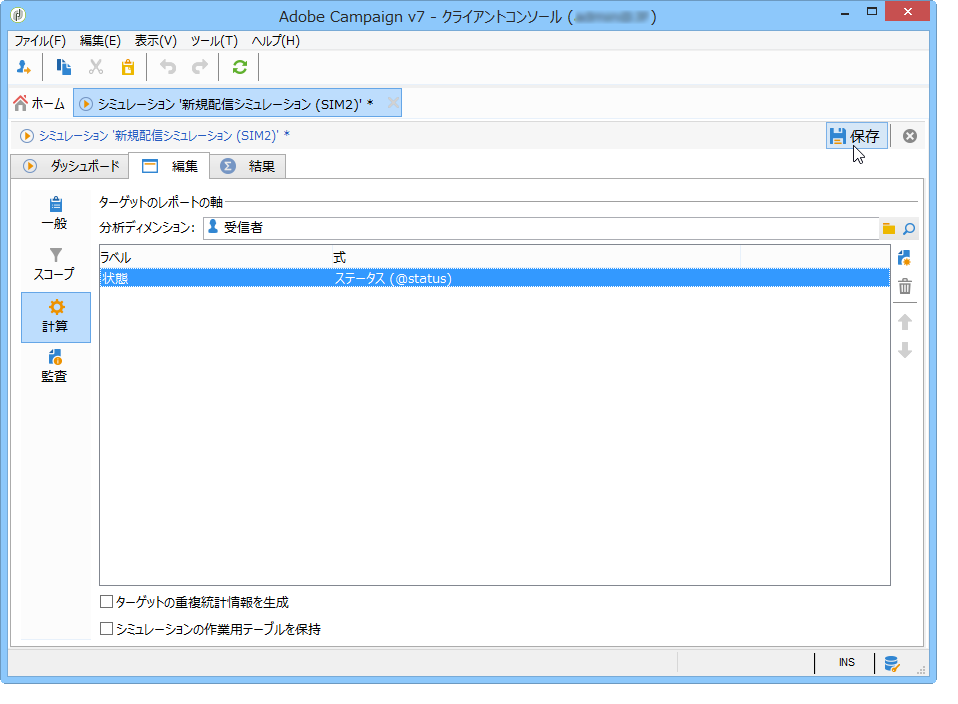

1. 次のオプションを使用できます。

   * **[!UICONTROL Generate target overlap statistics]** シミュレーションレポート内の重複する統計情報をすべて復元できます。 重複とは、ターゲット受信者が 1 回のシミュレーションで 2 つ以上の配信に含まれていることを指します。

      >[!CAUTION]
      >
      >このオプションを選択すると、シミュレーションの実行時間が長くなります。

   * **[!UICONTROL Keep the simulation work table]** シミュレーショントレースを保持できます。

      >[!CAUTION]
      >
      >これらのテーブルを自動的に保存する場合は、大容量のストレージを確保する必要があります。必ずデータベースの容量を確認してください。

When the simulation results are displayed, the information on the selected expression will be displayed in the **[!UICONTROL Overlaps]** sub-tab.

配信ターゲットの重複とは、ターゲット受信者がシミュレーションの 2 つ以上の配信に含まれていることを指します。

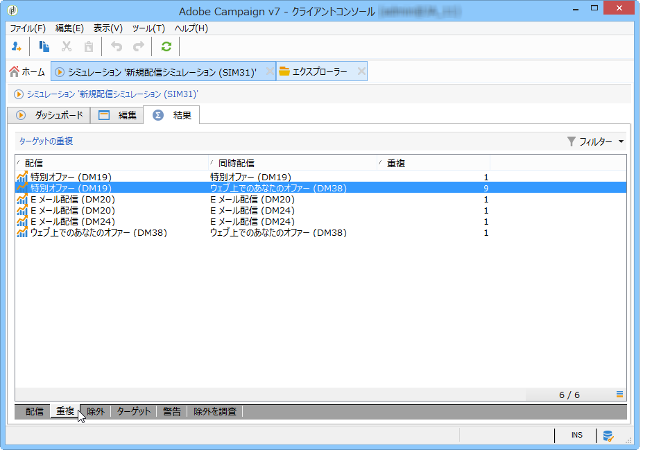

>[!NOTE]
>
>このサブタブは、このオプションが有効になっている場 **[!UICONTROL Generate target recovery statistics]** 合にのみ表示されます。

The information on reporting axes can be processed in exclusion analysis reports created in the **[!UICONTROL Exploring exclusions]** sub-tab. For more on this, refer to [Exploring results](#exploring-results).
