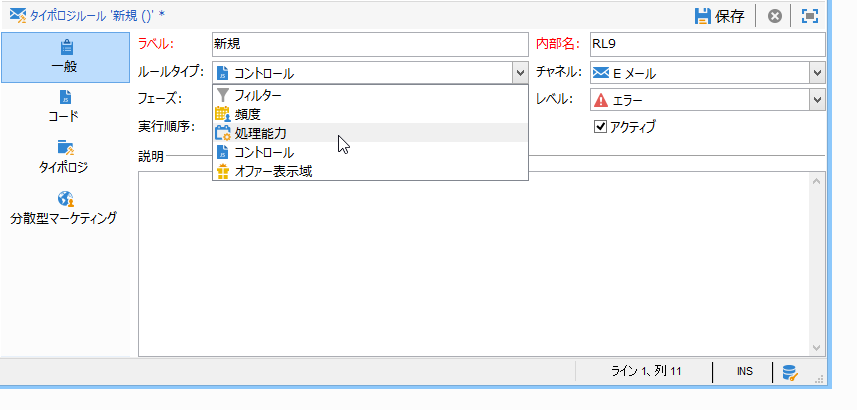
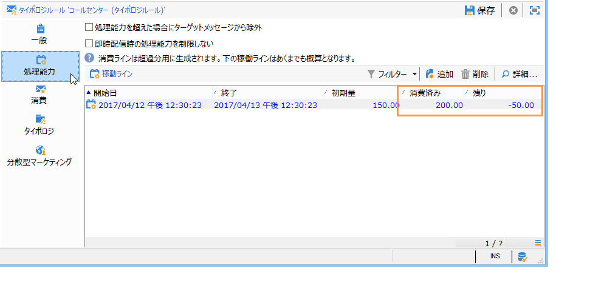
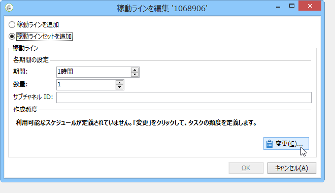
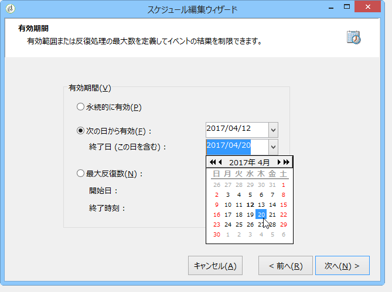
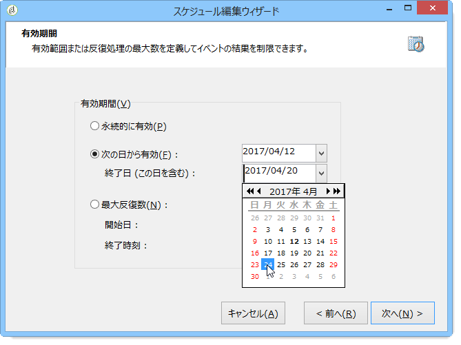
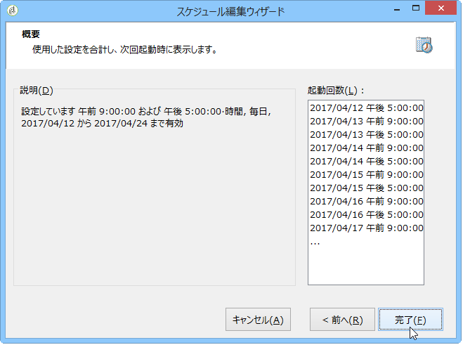
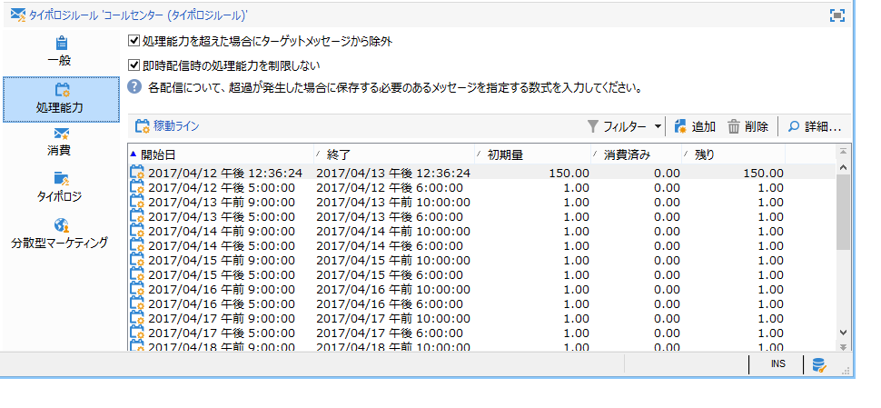
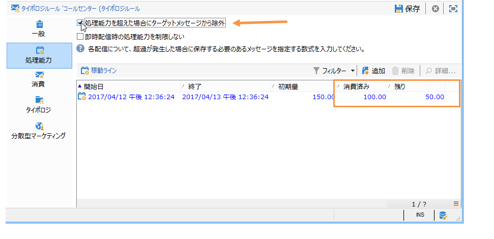
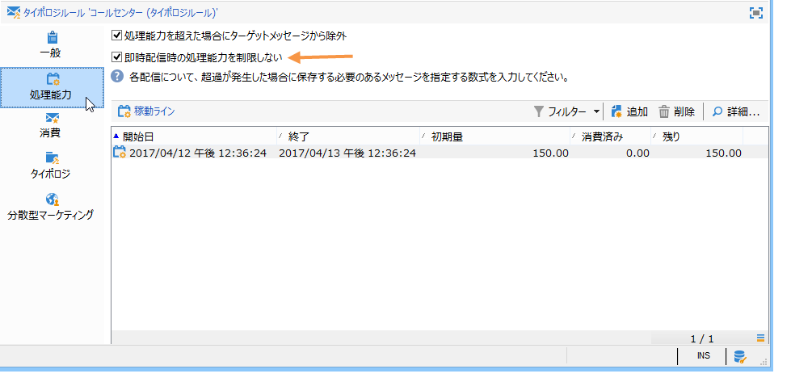
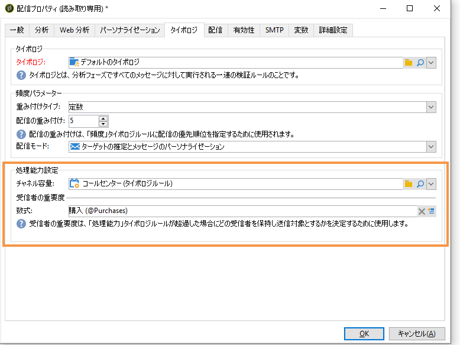

# 一貫性ルール{#consistency-rules}

## 一貫性ルールについて {#about-consistency-rules}

Adobe Campaign では、キャンペーンタイポロジに含まれる一連のルールによって、コミュニケーションの一貫性を実現しています。一貫性ルールの目的は、受信者に送信される配信のボリューム、特性、関連性などをコントロールすることです。

**処理能力**&#x200B;ルール：例えば、メッセージの配信に関わるプラットフォームに過負荷がかかる状況を回避できます。例えば、ダウンロードリンクを含む特別オファーは、サーバーの飽和状態を避けるために、一度に多くの人に送信してはなりません。電話キャンペーンは、コールセンター等の処理能力を超えてはならない。 For more on this, refer to [Controlling capacity](#controlling-capacity).

## 処理能力の制御 {#controlling-capacity}

メッセージを配信する前に、配信や、その配信によって生成される場合がある応答（インバウンドメッセージ）を処理する能力が組織にあること（物理的インフラストラクチャ）、また購読者に連絡するための通話数を処理できること（コールセンターの処理能力）などを確認する必要があります。

To do this, you need to create **[!UICONTROL Capacity]** typology rules.

次の例では、電話によるロイヤリティキャンペーンのタイポロジルールを作成します。ここでは、1 日あたりのメッセージ数を 20 に制限します（コールセンターの 1 日あたりの処理能力）。2 つの配信にルールを適用したら、消費状況をログによって監視できます。

新しい処理能力ルールを作成するには、次の手順に従います。

1. ノードの下で、 **[!UICONTROL Administration > Campaign management > Typology management > Typology rules]** をクリックしま **[!UICONTROL New]**&#x200B;す。
1. Select a **[!UICONTROL Capacity]** rule type.

   

1. In the **[!UICONTROL Capacity]** tab, create the availability lines: in our example, these are time periods during which calls can be made. 期間として 24 時間を選択し、初期数量を 150 にします。これは、コールセンターが 1 日につき 150 通話を処理できることを意味します。

   

   >[!NOTE]
   >
   >稼動ラインは情報提供のためだけに存在します。処理能力の上限に達してメッセージの除外が必要になった場合は、[この節](#exclude-messages-when-capacity-limit-reached)を参照してください。

1. この処理能力ルールを適用するには、このルールをタイポロジに関連付けたうえでそのタイポロジを配信内で参照します。詳しくは、[この節](../../campaign/using/applying-rules.md#applying-a-typology-to-a-delivery)を参照してください。
1. You can monitor consumption from the rule **[!UICONTROL Consumptions]** and **[!UICONTROL Capacity]** tabs.

   When a rule is used in a delivery, the **[!UICONTROL Consumed]** and **[!UICONTROL Remaining]** columns provide information on the load, as shown below:

   

   詳しくは、[この節](#monitoring-consumption)を参照してください。

## 最大負荷の定義 {#defining-the-maximum-load}

最大負荷を定義するには、稼動ラインを定義する必要があります。To do this, two options are available: you can manually create one or more availability lines (refer to [Adding availability lines one by one](#adding-availability-lines-one-by-one)) or create availability ranges. これらの期間の頻度は自動化できます(一連の可 [用性行の追加を参照](#add-a-set-of-availability-lines))。

### 稼動ラインを 1 つずつ追加する {#adding-availability-lines-one-by-one}

可用性ラインを作成するには、ボタンをクリ **[!UICONTROL Add]** ックしてを選択しま **[!UICONTROL Add an availability line]**&#x200B;す。 稼動の期間と負荷を入力します。

処理能力に応じて、必要な数だけラインを追加します。

### 稼動ラインセットの追加 {#add-a-set-of-availability-lines}

一定期間の可用性期間を定義するには、ボタンをクリックし **[!UICONTROL Add]** てオプションを選択 **[!UICONTROL Add a set of availability lines]** します。 各期間の長さと作成する期間の数を指定します。

To automate the frequency of page creation, click the **[!UICONTROL Change]** button and define time period scheduling.

例として、平日の午前 9 時から午後 5 時まで、通話を毎時 10 件に制限する稼動期間をスケジュールに従って自動的に作成してみましょう。それには、次の手順に従います。

1. 頻度のタイプを選択し、有効にする曜日と時間を指定します。

   

1. 有効期間を指定します。

   

1. スケジュールを確認してから、承認します。

   

The **[!UICONTROL Forecasting]** workflow automatically creates all matching lines.

>[!NOTE]
>
>稼動ラインは、ファイルのインポートによって作成することをお勧めします。このタブを使用すると、消費ラインを表示および確認できます。

## 処理能力の上限到達時のメッセージ除外 {#exclude-messages-when-capacity-limit-reached}

稼動ラインの目的は、情報を確認することです。余分なメッセージを除外するには、このオプションをオン **[!UICONTROL Exclude from the target messages in excess of capacity]** にします。 この設定により、処理能力をオーバーすることを回避できます。このオプションをオンにすると、消費済みと残りの数値が初期数量を超えることはなくなります（上の図と比較してください）。

処理できるメッセージの数は、均等に分割され、定義されている期間全体に割り当てられます。この設定は、1 日あたりの最大通話数が制限されるコールセンターに特に最適です。In the case of email deliveries, the **[!UICONTROL Do not limit instantaneous delivery capacity]** option lets you ignore this availability range and send your emails at the same time.

>[!NOTE]
>
>オーバーロードの場合、保存されたメッセージは配信プロパティで定義された式に従って選択されます。

## 消費状況の監視 {#monitoring-consumption}

デフォルトでは、処理能力ルールは、情報の確認のために使用されます。定義された **[!UICONTROL Exclude messages in excess of capacity from the target]** 負荷を超えないようにするには、このオプションを選択します。 この場合、超過したメッセージは、タイポロジルールによって自動的に配信から除外されます。

To monitor consumptions, view the values displayed in the **[!UICONTROL Consumed]** column of the **[!UICONTROL Capacity]** tab in the typology rule.

To view consumption lines, click the **[!UICONTROL Consumptions]** tab in the rule.
