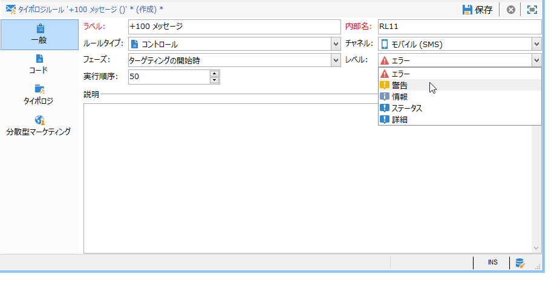
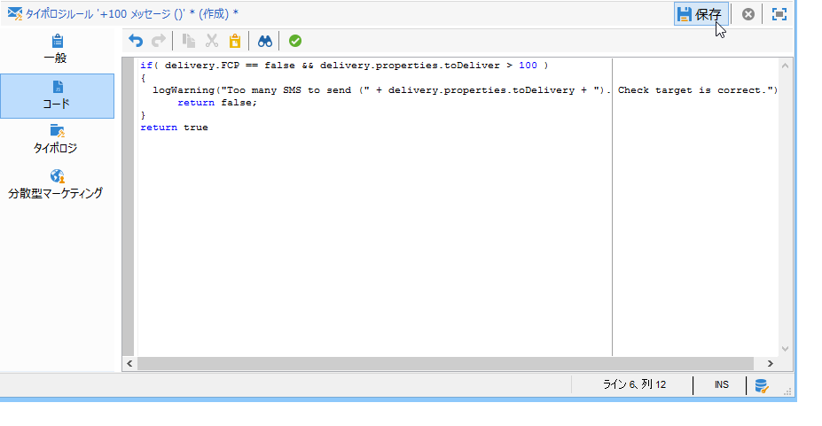
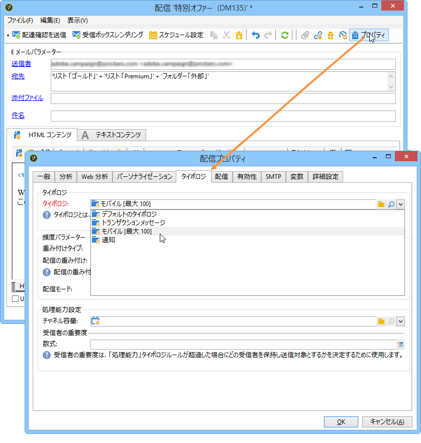
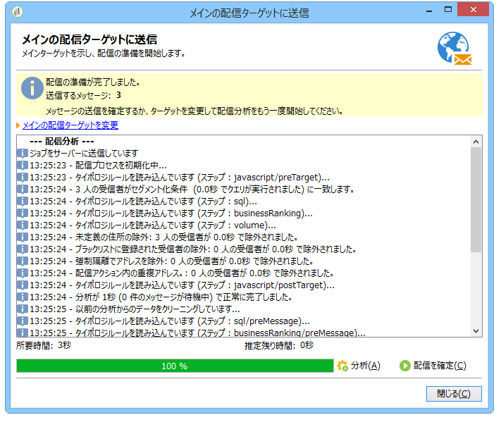
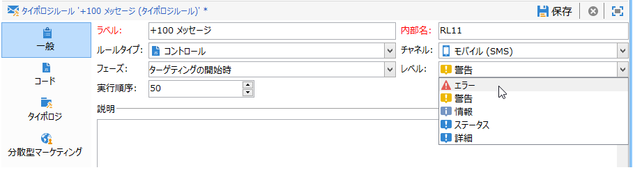
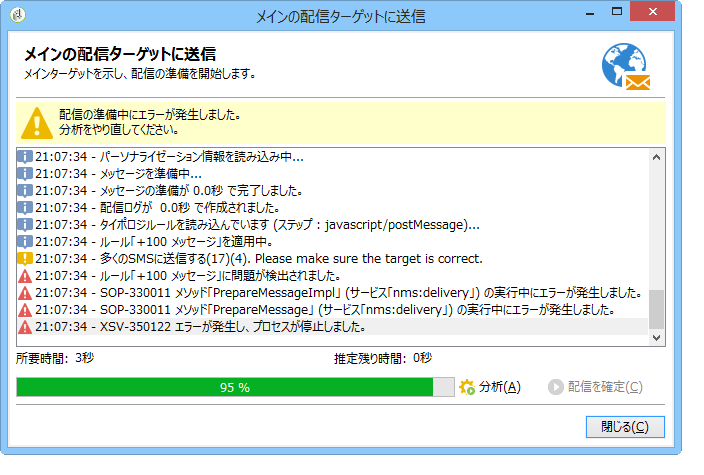

# コントロールルール{#control-rules}

## 分析と判別のコントロールルール {#analysis-and-arbitration-control-rules}

コントロールルールを使用すると、配信を実行する前に、メッセージの有効性と品質（文字の表示、SMS のサイズ、アドレスの形式など）を確認することができます。

デフォルトのルールセットでは、一般的なチェックを実行できます。以下のタイプのチェック（インターフェイスで太字で表示される）が用意されています。

* **[!UICONTROL Object approval]** （電子メール）:送信元のオブジェクトとアドレスに、特定のメールエージェントで問題を引き起こす特殊文字が含まれていないかどうかを確認します。
* **[!UICONTROL URL label approval]** （電子メール）:各追跡URLにラベルが付いているかどうかを確認します。
* **[!UICONTROL URL approval]** （電子メール）:トラッキングURL（「&amp;」文字の存在）をチェックします。
* **[!UICONTROL Message size approval]** （モバイル）:smsメッセージのサイズを確認します。
* **[!UICONTROL Validity period check]** （電子メール）:配信の有効期間が、すべてのメッセージを送信するのに十分な長さであるかどうかを確認します。
* **[!UICONTROL Proof size check]** （すべてのチャネル）:配達確認ターゲットの母集団が100人を超える場合にエラーメッセージを生成します。
* **[!UICONTROL Wave scheduling check]** （電子メール）:配信が複数のウェーブに分類されている場合、配信の最後のウェーブが有効期間の終わり前に開始するようにスケジュールされているかどうかを確認します。
* **[!UICONTROL Unsubscription link approval]** （電子メール）:各コンテンツ（HTMLおよびテキスト）に少なくとも1つの購読解除（オプトアウト）URLが存在するかどうかを確認します。

## コントロールルールの作成 {#creating-a-control-rule}

必要に応じて、新しいコントロールルールを作成することができます。To do this, create a **[!UICONTROL Control]** typology rule and enter the control formula in SQL in the **[!UICONTROL Code]** tab.

**例：**

次の例では、SMS オファーが 100 人を超える受信者に送信されないようにするルールを作成します。このルールは、まずキャンペーンタイポロジにリンクされ、その後オファーを送信する SMS 配信にリンクされます。

次の手順に従います。

1. Create a **[!UICONTROL Control]** typology rule. Select a **[!UICONTROL Warning]** alert level.

   

1. In the **[!UICONTROL Code]** tab, enter the script to apply the desired threshold, as shown below:

   

   このスクリプトは、配信ターゲットが 100 人を超えると、警告を生成します。

   ```
   if( delivery.FCP == false && delivery.properties.toDeliver > 100 ) { logWarning("Significant number of SMS to deliver (" + delivery.properties.toDeliver + "). Please make sure the target is correct.") return false; } return true
   ```

1. ルールをキャンペーンタイポロジにリンクし、該当する SMS 配信でこのタイポロジを参照します。

   

1. 配信の分析時にルールが適用され、状況に応じて警告が生成されます。

   

   ただし、このルールによって、配信が自動的に停止されることはありません。

   アラートレベルをさらに引き上げると、配信は開始されません。

   

   At the end of the analysis, the **[!UICONTROL Confirm delivery]** button will not be available.

   

