# コスト管理{#controlling-costs}

## コスト管理について {#about-cost-control}

Adobe Campaign では、マーケティングリソース管理モジュールを使用して、予約済み、コミット済みおよび請求済みのマーケティングコストを管理し、カテゴリ別に分類できます。

キャンペーンの様々なプロセスにコミットされたコストは、マーケティング部門が事前に定義した予算に請求されます。情報をよりわかりやすく表示し、マーケティング投資をより詳細にレポートするために、金額を複数のカテゴリ別に分類することができます。

予算の管理とトラッキングは、Adobe Campaign ツリーの専用のノードで一元管理できます。このため、すべての予算の割り当て済み、予約済み、コミット済みおよび支出済みの金額を 1 つのビューから監視できます。

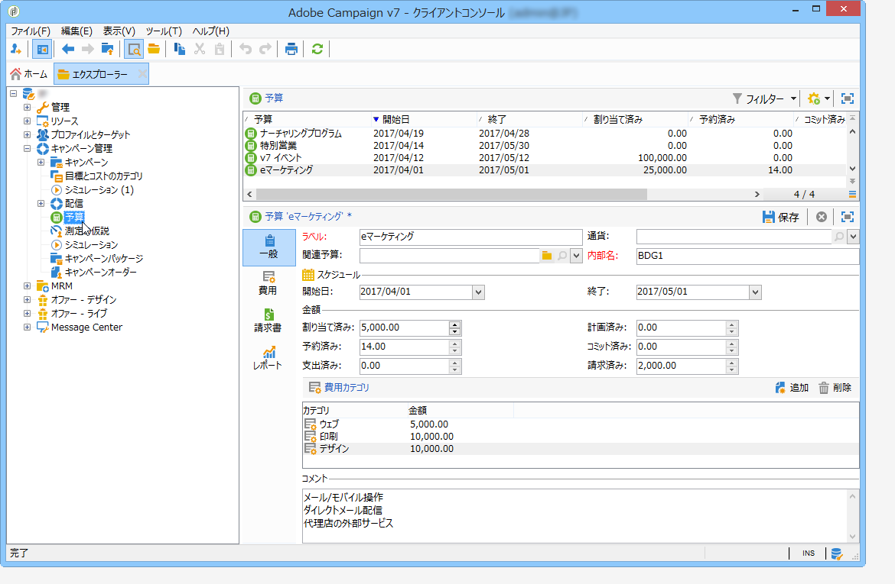

MRM を使用して予算管理を実装するには、次の手順に従います。

1. 予算の定義

   For more on this, refer to [Creating a budget](#creating-a-budget).

1. コスト計算メソッドの定義

   サービスプロバイダーにコスト構造を定義します。See [Creating a service provider and its cost categories](../../campaign/using/providers--stocks-and-budgets.md#creating-a-service-provider-and-its-cost-categories).

1. キャンペーンコストの定義（配信／タスク）

   配信およびタスクにかかるコストは、個別に入力することも、キャンペーンのテンプレートでグローバルに入力することもできます。See [Calculation of costs and stocks](../../campaign/using/marketing-campaign-deliveries.md#calculation-of-costs-and-stocks).

1. 統合

   コストは、タスク、配信およびキャンペーンの進捗状況ステータスに応じて計算され、対応する予算に紐付けられます。

   When the creation of the campaign is sufficiently advanced, the progress status of the campaign budget can be changed to **[!UICONTROL Specified]**. プログラムの計算されたコストには、キャンペーンの計算されたコストが自動的に入力されます。See [Cost commitment, calculation and charging](#cost-commitment--calculation-and-charging).

## 予算の作成 {#creating-a-budget}

予算はノードを介してマップに作成され **[!UICONTROL Campaign management > Budgets]** ます。 The **[!UICONTROL New]** button in the toolbar lets you create a budget.

* 新しい予算の追加

   Click the **[!UICONTROL New]** icon, name and save the budget.

* 初期金額の入力

   該当するフィールドに割り当てる金額を指定します。その他の金額は自動的に入力されます。金額の計 [算を参照してください](#calculating-amounts)。

* 有効期間の定義

   開始日と終了日を指定します。この情報は単なる目安です。

* 費用

   キャンペーンやタスクなどの予算に割り当てられたコストのリンク先費用カテゴリを作成します。経費カテ [ゴリを参照](#expense-categories)。

   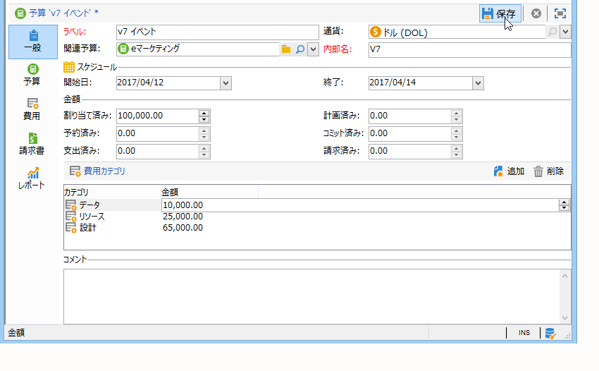

>[!NOTE]
>
>関連予算を選択できます。
>
>詳しくは、「予算の別の予算へ [のリンク」を参照してください](#linking-a-budget-to-another)。

### 金額の計算 {#calculating-amounts}

各予算は初期金額で定義します。キャンペーン、配信、タスクの予約または実行後、この初期金額から関連する様々なキャンペーン、配信、タスクのコストが差し引かれます。金額のステータス（計画済み、予約済み、コミット、支出または請求済み）は、キャンペーン、配信またはタスクで定義したコストタイプとコミットメントレベルに依存します。

>[!NOTE]
>
>The amounts entered for the categories must match the budget envelope defined in the **[!UICONTROL Allocated]** field.

キャンペーンの場合、コミットメントレベルに応じて、将来のアクション用にコストを計画、コミットまたは予約できます。

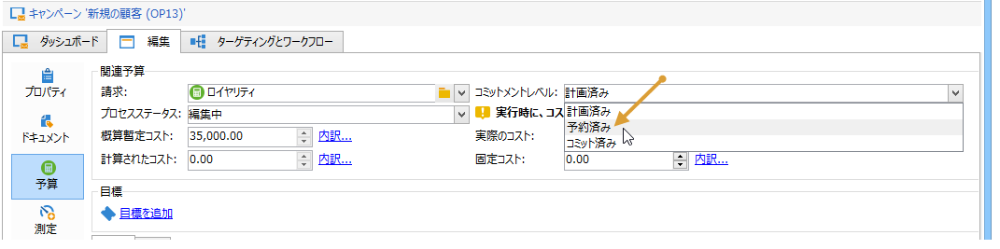

>[!CAUTION]
>
>When a campaign is created, the progress status in **[!UICONTROL Budget]** must be set to **[!UICONTROL Defined]** for the costs to be taken into account on execution. If the status is **[!UICONTROL Being edited]**, the costs will not be consolidated.
>   
>The option **[!UICONTROL Commitment level]** represents a projection of costs into the future before they are charged to the budget. キャンペーン、タスクまたは配信の進捗状況に応じ、コンボボックスを使用して、コミットメントレベル（1. 計画済み、2. 予約済み、3. コミット済み）を割り当てることができます。

例えば、Web キャンペーンの概算暫定コストが 45,000 ユーロだとします。

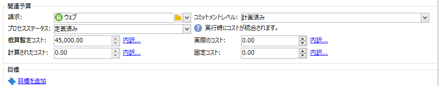

For the campaign, when the budget creation status is set to **[!UICONTROL Defined]**, the real cost of the campaign (or, if none, the computed cost) will be carried over into the budget totals.

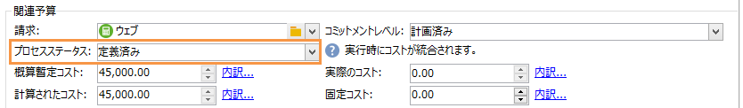

According to the level of commitment of the campaign budget, the amount will be entered in the **[!UICONTROL Planned]**, **[!UICONTROL Reserved]** or **[!UICONTROL Committed]** field.

コミットメントレベルは以下の場所で変更できます。

* in the **campaign** level, in the **[!UICONTROL Budget]** window, found in the **[!UICONTROL Edit]** tab. 予算、コストおよび費用はここで設定します。
* (タスク **レベル** 、ウィンドウ内 **[!UICONTROL Expenses and revenues]** )。

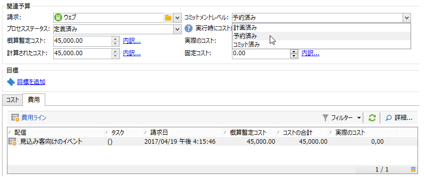

When the budget is **[!UICONTROL Reserved]**, the update is performed automatically for the charged budget.

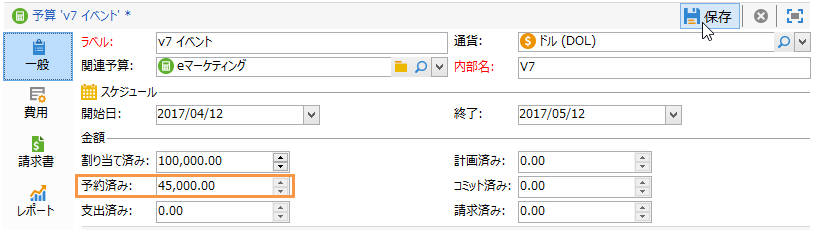

タスクレベルでも手順は同様です。

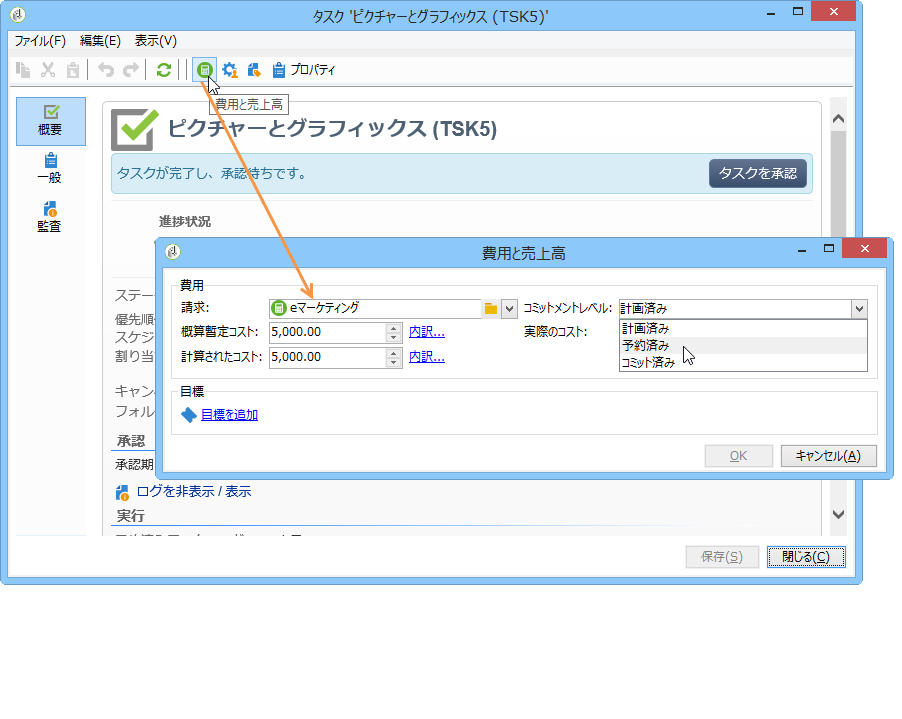

When an expenditure gives rise to an invoice and the invoice is paid, its amount is then entered in the **[!UICONTROL Invoiced]** field.

### 費用カテゴリ {#expense-categories}

データをよりわかりやすく表示し、マーケティング投資を詳細にレポートするために、金額を複数の費用カテゴリに配分することができます。The expense categories are defined during budget creation, via the **[!UICONTROL Budgets]** node of the tree.

To add a category, click the **[!UICONTROL Add]** button in the lower section of the window.

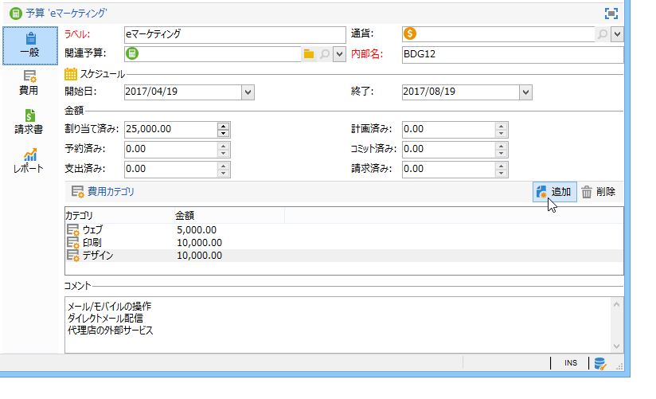

既存のカテゴリを選択することも、フィールドに直接入力して新しいカテゴリを定義することもできます。入力を確認すると表示される確認メッセージで、既存のカテゴリのリストにカテゴリを追加し、必要に応じて「特性」と関連付けることができます。この情報は予算レポートに使用されます。

### 予算のリンク {#linking-a-budget-to-another}

予算をメイン予算にリンクすることができます。To do this, select the main budget in the **[!UICONTROL related budget]** field of the secondary budgets.

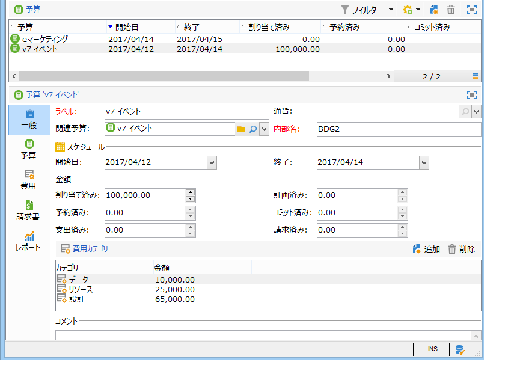

メイン予算にタブが追加され、関連予算のリストが表示されます。

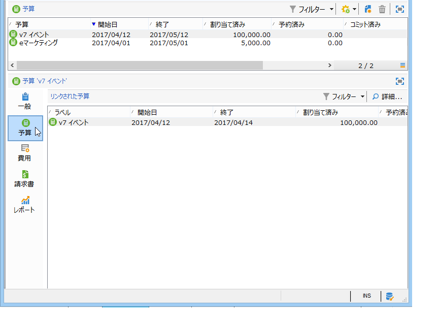

この情報は予算レポートでも使用されます。

## 費用ラインの追加 {#adding-expense-lines}

費用ラインは予算に自動的に追加されます。費用ラインは、配信分析中およびタスクの完了時に作成します。

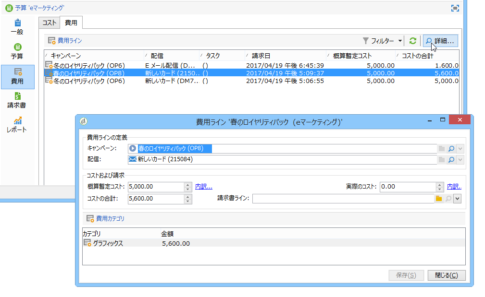

各キャンペーン、配信またはタスクで、請求先の予算の費用ラインに発生したコストがグループ化されます。これらの費用ラインは、関係するサービスプロバイダーのコストラインに応じて作成され、関連するコスト構造を使用して計算されます。

このため、各費用ラインには、以下の情報が含まれます。

* 関連付けられているキャンペーンと配信またはタスク
* コスト構造から計算された金額または概算暫定コスト
* 関係する配信またはタスクの実際のコスト
* 対応する請求書ライン（MRM のみ）
* コストカテゴリにより計算されたコストのリスト（コスト構造が存在する場合）

上の例では、編集する費用ラインに、「**Loyalty Spring Pack**」キャンペーンの「**New cards**」の配信用に計算されたコストが含まれています。When the delivery is edited, the **[!UICONTROL Direct Mail]** tab lets you see how the expense line is calculated.

この配信の場合、関係するサービスプロバイダーに選択したコストカテゴリに基づいてコストが計算されます。

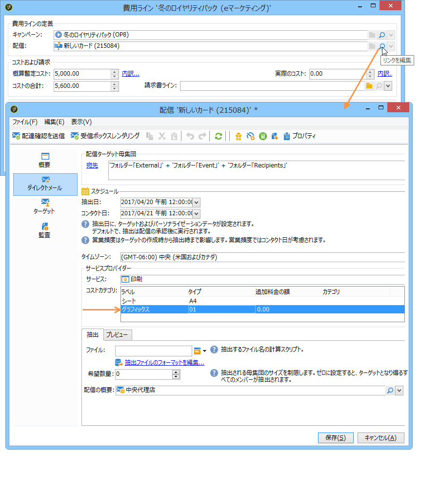

選択したコストカテゴリに応じて、対応するコスト構造が適用され、コストラインが計算されます。この例では、関係するサービスプロバイダーに対し、以下に示すようなコスト構造が適用されます。

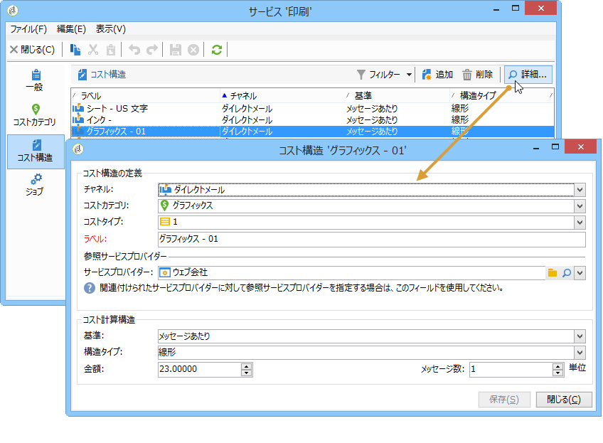

>[!NOTE]
>
>コストカテゴリと構造は、サービスプロバイ [ダとそのコストカテゴリの作成に表示されます](../../campaign/using/providers--stocks-and-budgets.md#creating-a-service-provider-and-its-cost-categories)。

## コストのコミット、計算および請求 {#cost-commitment--calculation-and-charging}

コストは、配信およびタスクにコミットできます。コストが関連付けられているプロセスの進捗状況に応じて、コストのステータスが更新されます。

### コスト計算プロセス {#cost-calculation-process}

コストは以下の 3 つのカテゴリに分類されます。

1. 概算暫定コスト

   概算暫定コストは、キャンペーンのプロセスの概算コストです。編集が完了するまで、入力した金額は統合されません。It must have **[!UICONTROL Specified]** status for the amounts input to be taken into account in the calculations.

   金額は手動で入力します。複数の費用カテゴリに内訳を入力することもできます。To bread down a cost, click the **[!UICONTROL Breakdown...]** link, and then the **[!UICONTROL Add]** button to define a new amount.

   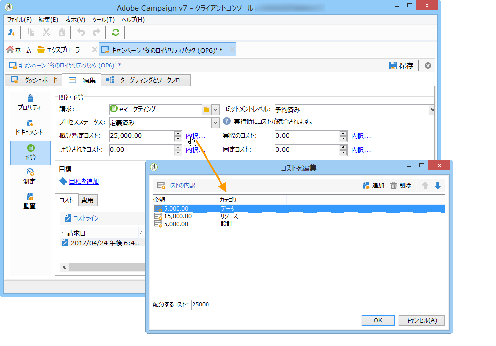

   各コストをカテゴリに関連付けると、後で費用カテゴリ別のコストの内訳を関連予算および予算レポートで確認できます。

1. 計算されたコスト

   計算されたコストは、関係する要素（キャンペーン、配信、タスクなど）およびそのステータス（編集中、処理中、完了）に依存します。いずれの場合も、実際のコストが指定されている場合は、その金額が計算されたコストになります。

   実際のコストが入力されていない場合、以下のルールが適用されます。

   * キャンペーンが処理中の場合、計算されたコストにはキャンペーンの概算暫定コストが使用されます。概算暫定コストが定義されていない場合は、キャンペーンの配信とタスクのすべての暫定コストの合計が使用されます。キャンペーンが完了している場合、キャンペーンの計算されたコストはすべての計算されたコストの合計になります。
   * 配信が未分析の場合は、計算されたコストに概算暫定コストが使用されます。分析が完了している場合、計算されたコストはサービスプロバイダーのコスト構造とターゲット受信者の数を基に計算されたすべてのコストの合計になります。
   * タスクが処理中の場合は、計算されたコストに概算暫定コストが使用されます。タスクが完了している場合、計算されたコストはサービスプロバイダーのコスト構造と終了した日数を基に計算されたすべてのコストの合計になります。
   * マーケティングプランの場合は、プログラムの場合と同様、計算されたコストはキャンペーンの計算されたコストの合計になります。キャンペーンの計算されたコストが指定されていない場合は、概算暫定コストが使用されます。
   >[!NOTE]
   >
   >The **[!UICONTROL Breakdown]** link lets you view the details of the calculation and the last cost calculation date.

1. 実際のコスト

   実際のコストは手動で入力します。必要に応じて、様々な費用カテゴリに内訳を入力できます。

### 計算と請求 {#calculation-and-charging}

コストはコスト構造を使用して計算され、関係するキャンペーン、配信またはタスクで選択した予算に請求されます。

予算の承認を使用してキャンペーンにコミットされた金額のチェックを実行できます。その他の承認を設定する場合は、キャンペーンで追加のチェックポイントスタイルタスクを作成できます。タスク [のタイプを参照](../../campaign/using/creating-and-managing-tasks.md#types-of-task)。

### 例 ：{#example}

以下を使用してキャンペーンを作成するとします。

* サービスプロバイダーのコスト構造を使用したダイレクトメール配信
* 固定コストのタスク
* 日次コストのタスク

#### 手順 1 - 予算の作成 {#step-1---creating-the-budget}

ノードを介して新しい予算を作成 **[!UICONTROL Campaign management > Budgets]** します。

Define a budget of 10,000 Euros in the **[!UICONTROL Allocated]** field of the **[!UICONTROL Amounts]** section. ウィンドウ下部で費用カテゴリを 2 つ追加します。

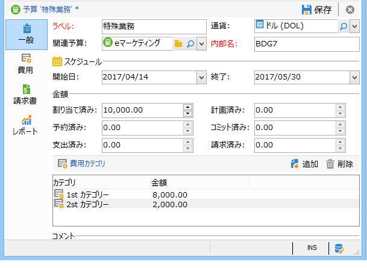

#### 手順 2 - サービスプロバイダーの設定とコスト構造の定義 {#step-2---configuring-the-service-provider-and-defining-the-cost-structures}

Create a service provider and a service template with its cost structure from the **[!UICONTROL Administration > Campaigns]** node.

詳しくは、「サービスプロバイダーとそ [のコストカテゴリの作成」を参照してください](../../campaign/using/providers--stocks-and-budgets.md#creating-a-service-provider-and-its-cost-categories)。

* For direct mail deliveries, create cost categories **[!UICONTROL Envelopes]** (types 114x229 and 162x229), **[!UICONTROL Postage]** and **[!UICONTROL Print]** (types A3 and A4). 以下のコスト構造を作成します。

   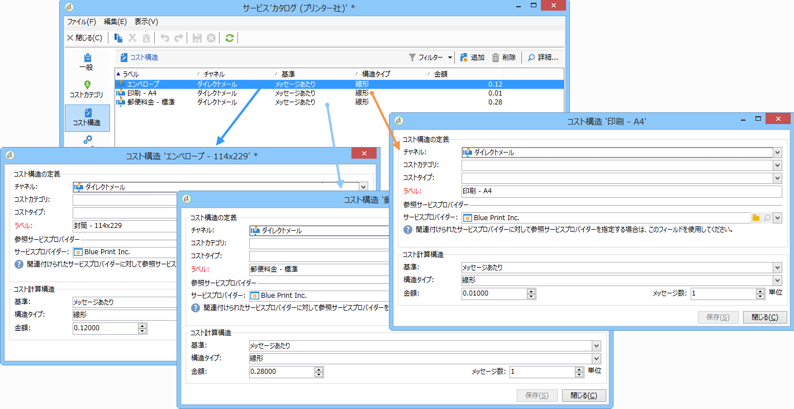

   （コストカテゴリで）固定コストを追加します。（対応するコスト構造で）計算は固定を指定し、金額は各配信に個別に指定するので空白のままにします。

   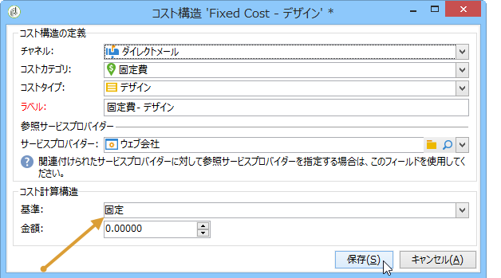

* タスクに以下の 2 つのコストカテゴリを作成します。

   1. **[!UICONTROL Room reservation]** (Small Room and Large Room)、300 Euros **と** 500 Eurosの固定費構造：

      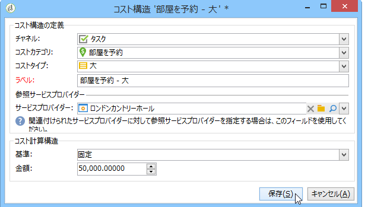

   1. **[!UICONTROL Creation]** (コ&#x200B;**ンテンツテンプレート** ・タイプ **)。日** 額は300ユーロです。

      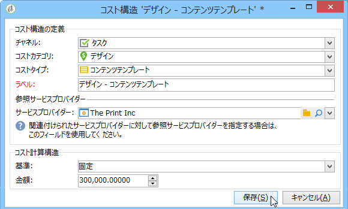

#### 手順 3 - キャンペーンでの予算請求 {#step-3---charging-the-budget-in-the-campaign}

キャンペーンを作成し、手順 1 で作成した予算を選択します。

>[!NOTE]
>
>デフォルトでは、プログラムに予算を選択すると、プログラム内のすべてのキャンペーンに適用されます。

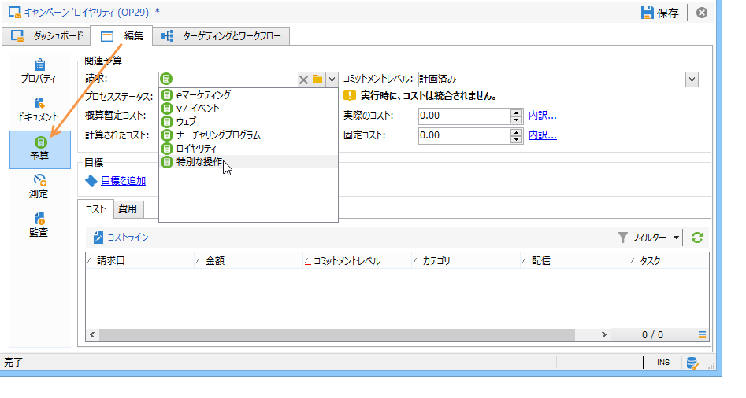

概算暫定コストを指定し、以下のように内訳を指定します。

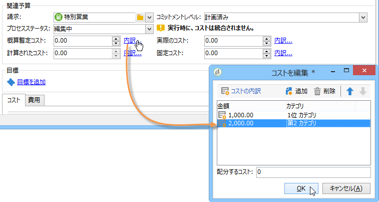

Click **[!UICONTROL Ok]** and then **[!UICONTROL Save]** to confirm this information. 計算されたコストが概算暫定コストで更新されます。

#### 手順 4 - ダイレクトメール配信の作成 {#step-4---creating-the-direct-mail-delivery}

キャンペーンのワークフローを作成し、クエリアクティビティの位置付けを指定してターゲットを選択します（受信者の住所を指定する必要があります）。

ダイレクトメール配信を作成し、手順 2 で作成したサービスプロバイダーを選択します。コストカテゴリが自動的に表示されます。

封筒のコストを上書きし、固定コストを追加します。これらのコストに関連するカテゴリも選択します。

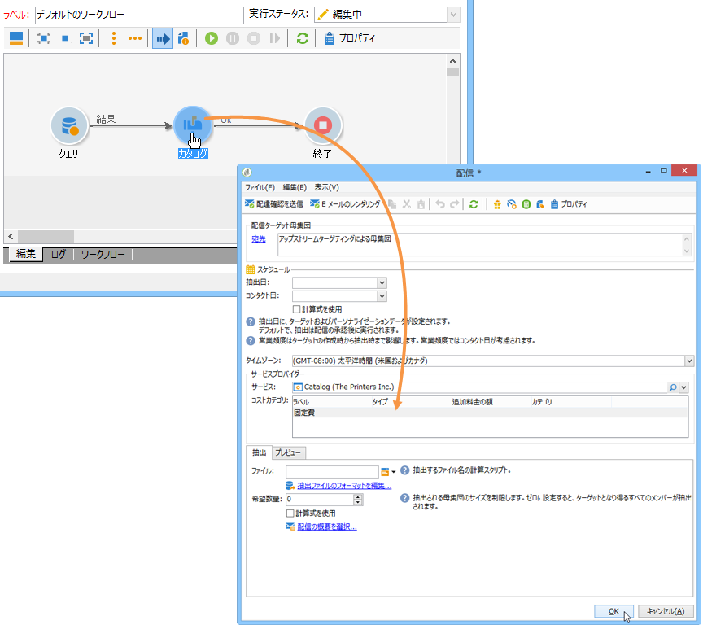

>[!NOTE]
>
>使用されていないコストカテゴリがある場合、費用は生成されません。

作成したワークフローを開始し、分析を開始してコストを計算します。

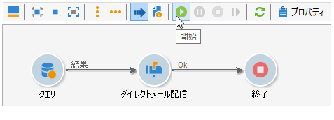

キャンペーンで予算の承認が有効になっている場合は、ダッシュボードから予算を承認します。コストカテゴリの承認を確認できます。

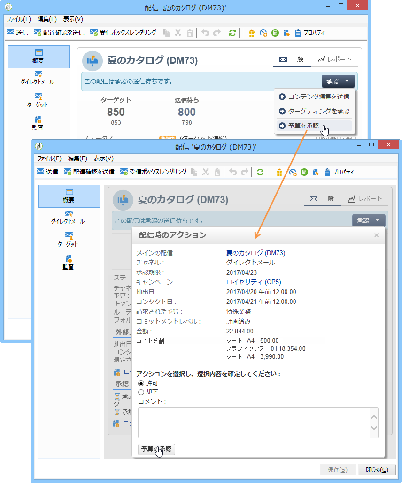

The expense line concerning the delivery is added in the **[!UICONTROL Edit > Budget]** tab of the campaign. 編集して計算の詳細を確認します。

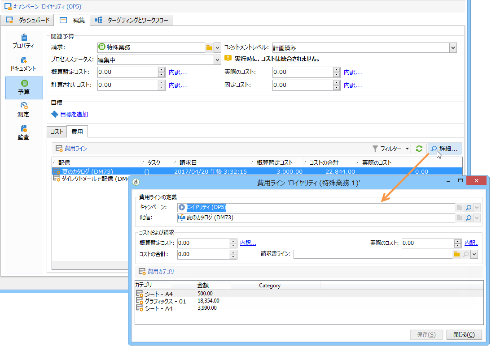

配信の計算されたコストがこの情報で更新されます。

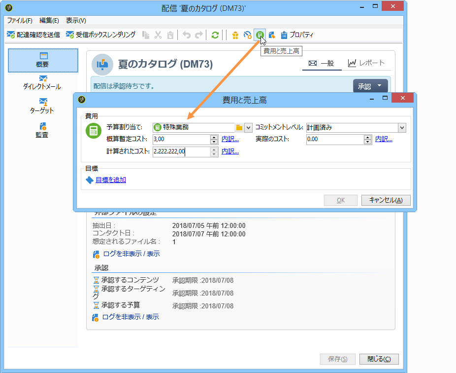

計算されたコストを編集すると、コストの内訳、およびコスト計算のステータスと日付を確認できます。

#### 手順 5 - タスクの作成 {#step-5---creating-tasks}

このキャンペーンには、前述のコスト構造を作成した2つのタスクを追加します(手順2 — サービスプロバイダーの設定とコスト構造の定義を参照 )。 To do this, in the campaign dashboard, click the **[!UICONTROL Add a task]** button. Name the task and click **[!UICONTROL Save]**.

タスクリストにタスクが追加されます。タスクを設定するには、編集する必要があります。

In the **[!UICONTROL Properties]** tab, select the service and the corresponding cost category:

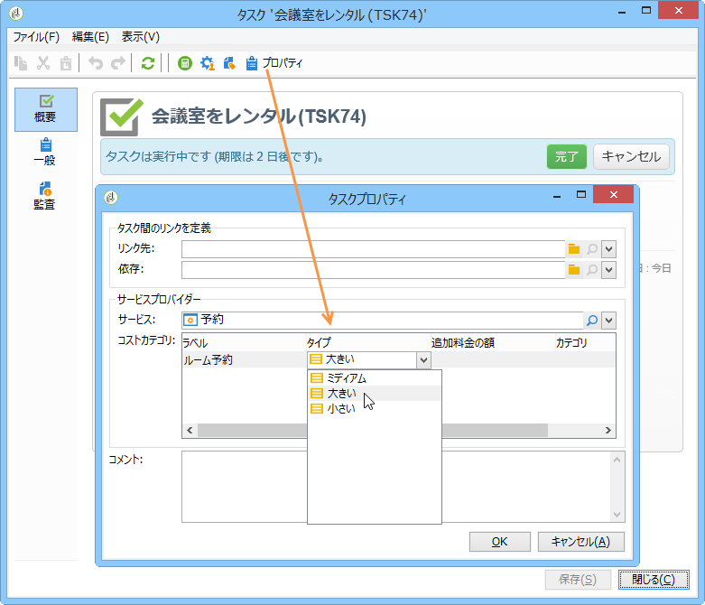

Next, click the **[!UICONTROL Expenses and revenue]** icon of the task and specify the estimated provisional cost.

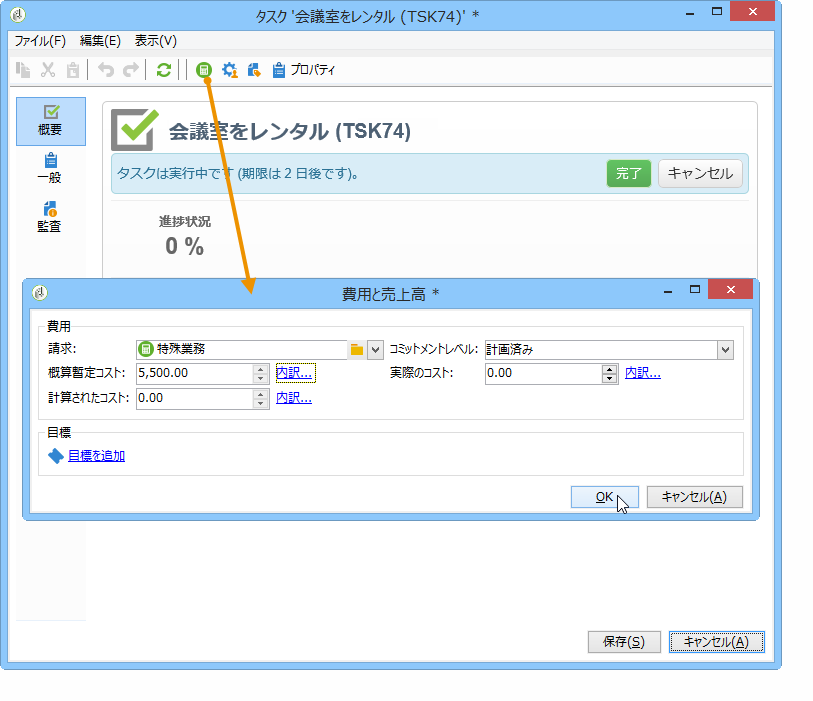

タスクを保存すると、計算されたコストは概算暫定コストに入力した値になります。

When the task is completed (status **[!UICONTROL Finished]** ), the calculated cost is automatically updated with the cost of the Large Room as entered in its cost structure. このコストも、内訳でこのカテゴリに表示されます。

次に、同様の手順で 2 番目のタスクを作成します。スケジュールを 5 日間、コスト構造には上記で作成したコスト構造を指定します。

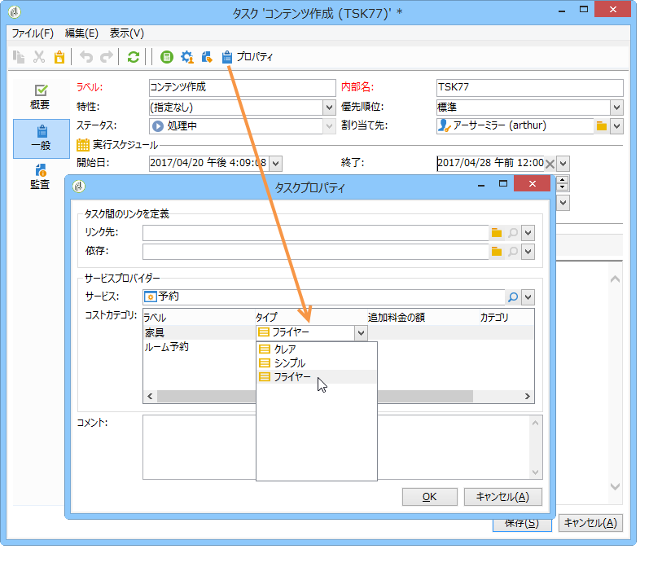

タスクが完了すると、計算されたコストは関連するコスト構造の値になります。この例では、1,500 ユーロになります（300 ユーロ x 5 日）。

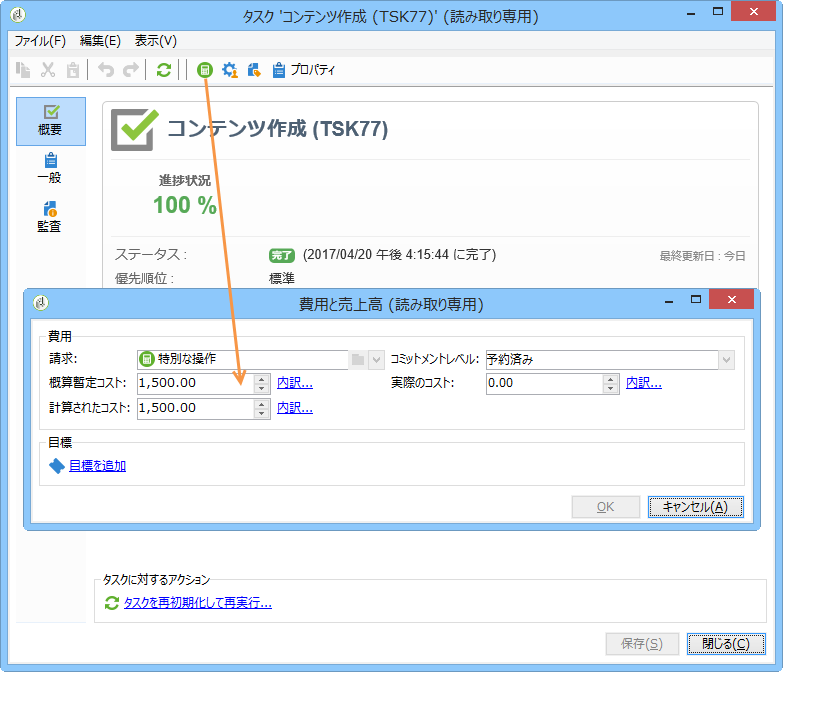

#### 手順 6 - キャンペーン予算のステータスの更新 {#step-6---update-the-campaign-budget-status}

When the campaign is configured, its status can be updated by setting it to **[!UICONTROL Specified]**. キャンペーンの計算されたコストに、キャンペーンの配信とタスクの計算されたコストの合計が表示されます。

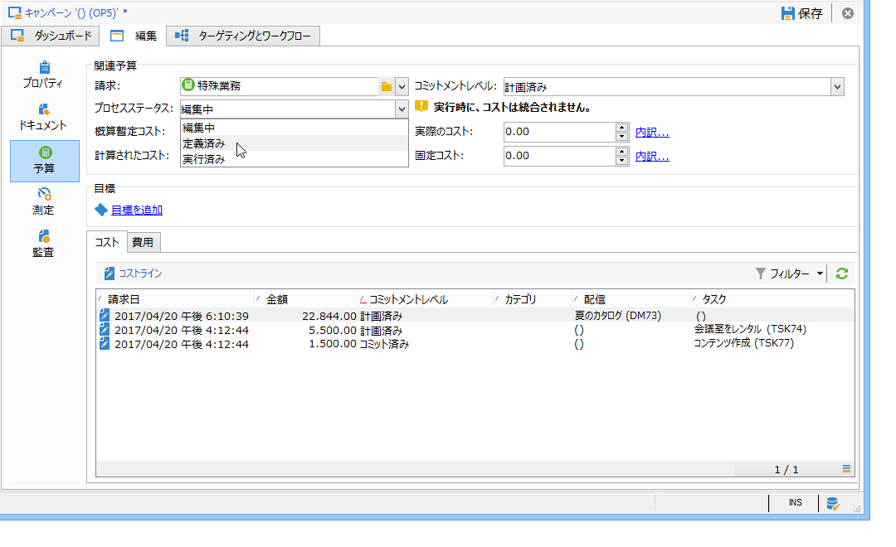

#### 予算の承認 {#budget-approval}

承認が有効になっている場合、キャンペーンダッシュボードに表示される専用のリンクを使用して予算を承認することができます。このリンクは、ターゲティングワークフローが開始され、ダイレクトメール配信の承認が必要になったときに表示されます。

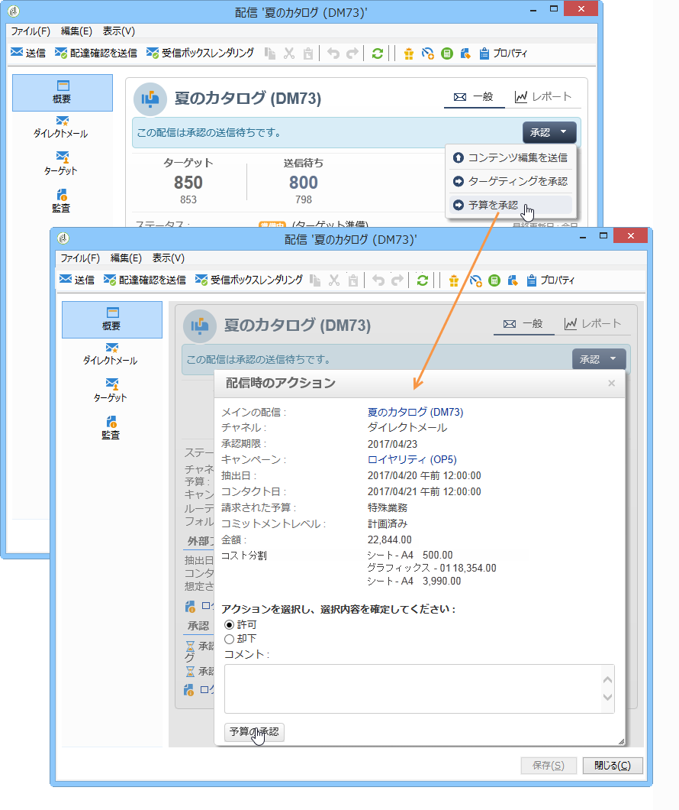

承認または却下するには、このリンクをクリックします。このキャンペーンで通知が有効になっている場合は通知 E メール内のリンクを使用することもできます。

予算が承認され配信が完了すると、専用のテクニカルワークフローによりコストが自動的に更新されます。

## オーダーと請求書 {#orders-and-invoices}

MRM のコンテキストでは、サービスプロバイダーの情報を含むオーダーを保存し、請求書を発行できます。これらのオーダーと請求書のライフサイクル全体は、Adobe Campaign のインターフェイスで管理できます。

### オーダーの作成 {#order-creation}

To save a new order with a service provider, click the **[!UICONTROL MRM > Orders]** node of the tree, and then click the **[!UICONTROL New]** button.

オーダー番号、サービスプロバイダーおよびオーダーの合計金額を指定します。

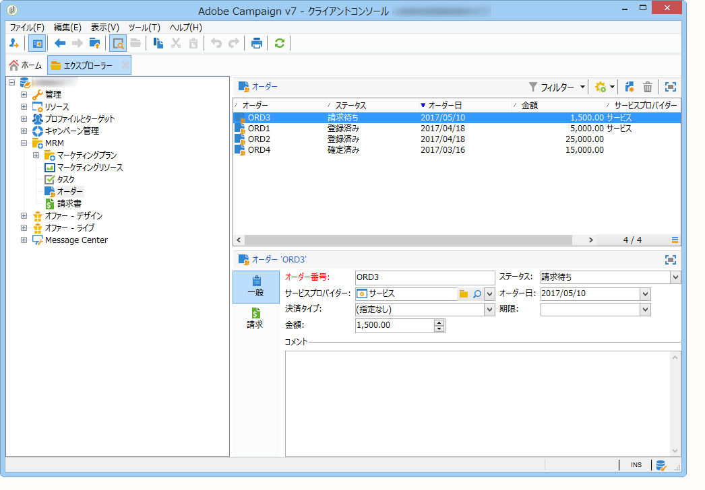

### 請求書の発行とトラッキング {#issuing-and-tracking-invoices}

サービスプロバイダーごとに請求書を保存し、請求書のステータスおよび請求予算を定義できます。

Invoices are created and stored in the **[!UICONTROL MRM > Invoices]** node of the Adobe Campaign tree.

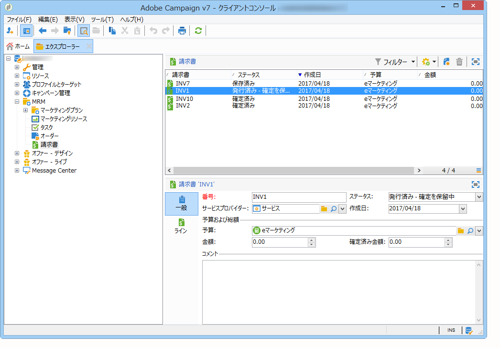

請求書には、請求書ラインがあります。請求書ラインの合計では、金額が自動的に計算されます。These lines are created manually from the **[!UICONTROL Invoice lines]** tab. ラインをオーダーに関連付けると、情報がオーダーにアップロードされます。

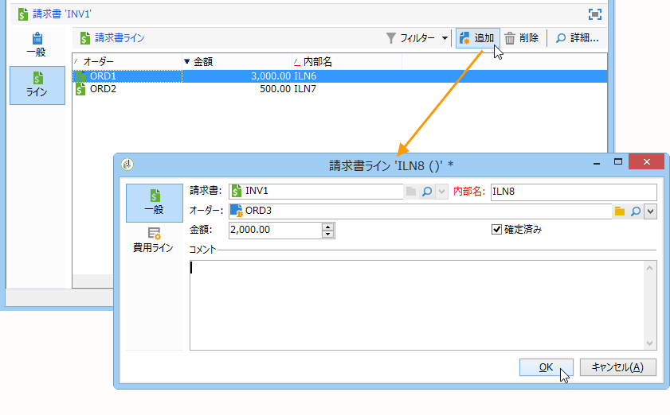

The invoices of each service provider are displayed in the **[!UICONTROL Invoices]** tab of the profile:

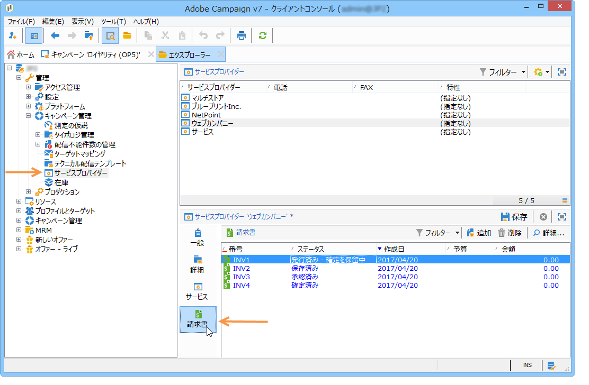

The **[!UICONTROL Details]** tab lets you display the content of the invoice.

Click **[!UICONTROL Add]** to create a new invoice.
