# 協調キャンペーンの作成{#creating-a-collaborative-campaign-intro}

セントラルエンティティは、**分散型マーケティング**&#x200B;のキャンペーンテンプレートから協調キャンペーンを作成します。[このページ](../../campaign/using/about-distributed-marketing.md#collaborative-campaign)を参照してください。

## 協調キャンペーンの作成 {#creating-a-collaborative-campaign}

コラボレーションキャンペーンを設定するには、ノードを **[!UICONTROL Campaign management > Campaigns]** クリックしてからアイコンをクリ **[!UICONTROL New]** ックします。

>[!NOTE]
>
>Apart from **[!UICONTROL collaborative campaigns (by campaign)]**, these campaigns can be configured and executed via a web interface.

協調キャンペーンの設定プロセスは、ローカルキャンペーンのテンプレートの設定プロセスと類似しています。以下の節では、タイプごとに協調キャンペーンの作成について説明します。

### フォーム {#by-form}

コラボレーションキャンペーンを作成するには（フォーム別に）、テンプレート **[!UICONTROL Collaborative campaign (by form)]** を選択する必要があります。

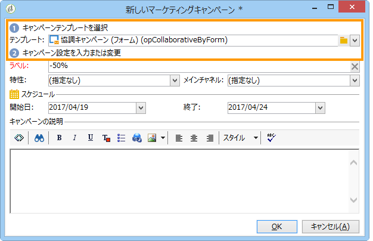

In the **[!UICONTROL Edit]** tab, click the **[!UICONTROL Advanced campaign settings...]** link to access the **Distributed Marketing** tab.

**フォーム** Web インターフェイスを選択します。フォームのインターフェイスでは、キャンペーンのオーダー時にローカルエンティティが使用するパーソナライゼーションフィールドを作成できます。詳しくは、「ロ [ーカルキャンペーンの作成（フォーム別）」を参照してくださ](../../campaign/using/examples.md#creating-a-local-campaign--by-form-)い。

キャンペーンを保存します。You can now use it from the **Campaign packages** view in the **Campaign** universe, by clicking the **[!UICONTROL Create]** button.

The **[!UICONTROL Campaign Package]** view allows you to use local campaign templates (out-of-the-box or duplicated), as well as reference campaigns for collaborative campaigns, with the aim of creating campaigns for your different organizational entities.

### キャンペーン {#by-campaign}

共同キャンペーンを作成するには（キャンペーン別に）、テンプレートを選 **[!UICONTROL Collaborative campaign (by campaign) (opCollaborativeByCampaign)]** 択する必要があります。

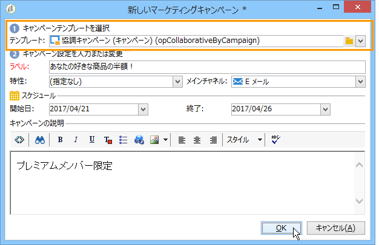

ローカルエンティティは、キャンペーンをオーダーする前に、セントラルエンティティによって事前に定義された条件を満たし、キャンペーンを評価することができます。

**協調キャンペーン（キャンペーン）**&#x200B;のオーダーがセントラルエンティティによって承認されると、ローカルエンティティ用に子キャンペーンが作成されます。キャンペーンが使用可能になると、ローカルエンティティは以下の項目を変更することができます。

* キャンペーンワークフロー
* タイポロジルール
* パーソナライゼーションフィールド

ローカルエンティティは、子キャンペーンを実行します。セントラルエンティティは、親キャンペーンを実行します。

The central entity can view all child campaigns linked with a **Collaborative campaign (by campaign)** from this dashboard (via the **[!UICONTROL List of associated campaigns]** link).

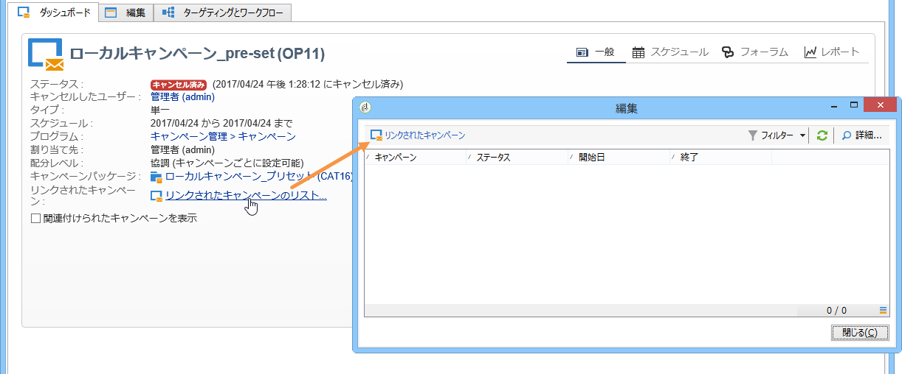

### ターゲットの承認 {#by-target-approval}

共同キャンペーンを作成するには（ターゲットの承認によって）、テンプレートを選 **[!UICONTROL Collaborative campaign (by target approval)]** 択する必要があります。

>[!NOTE]
>
>このモードでは、セントラルエンティティはローカルエンティティを指定する必要はありません。

キャンペーンワークフローに、**ローカルの承認**&#x200B;タイプのアクティビティを組み込む必要があります。次のようなアクティビティパラメーターがあります。

* **[!UICONTROL Action to perform]** : ターゲットの承認通知.
* **[!UICONTROL Distribution context]** : 明示.
* **[!UICONTROL Data distribution]** :ローカルエンティティの配分。

**ローカルエンティティ配分**&#x200B;タイプのデータ配分を作成する必要があります。データ配分テンプレートを使用すると、グループ値のリストから抽出されるレコードの数を制限できます。で、ア **[!UICONTROL Resources > Campaign management > Data distribution]**&#x200B;イコンをク **[!UICONTROL New]** リックして新しいを作成しま **[!UICONTROL Data distribution]**&#x200B;す。 データ配分について詳しくは、[ワークフロー](../../workflow/using/using-the-local-approval-activity.md#step-1--creating-the-data-distribution-template-)ガイドを参照してください。

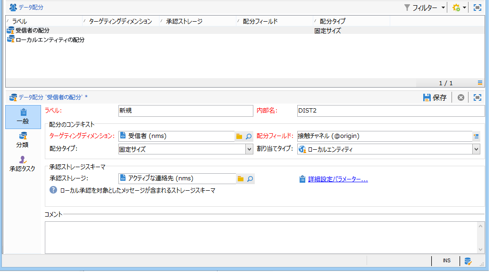

Select the **Targeting dimension** and the **[!UICONTROL Distribution field]**. の場合は、「 **[!UICONTROL Assignment type]** Local entity」を **選択します**。

In the **[!UICONTROL Distribution]** tab, add a field for each local entity and specify the value.

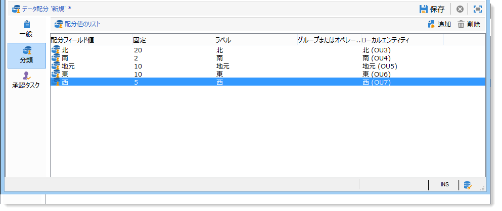

**配信**&#x200B;タイプのアクティビティの後に 2 つ目の&#x200B;**ターゲットの承認**&#x200B;を追加して、レポートを設定できます。

ローカルエンティティに送信されるキャンペーン作成の通知メッセージには、セントラルエンティティのパラメーターによって事前に定義された連絡先リストが含まれています。

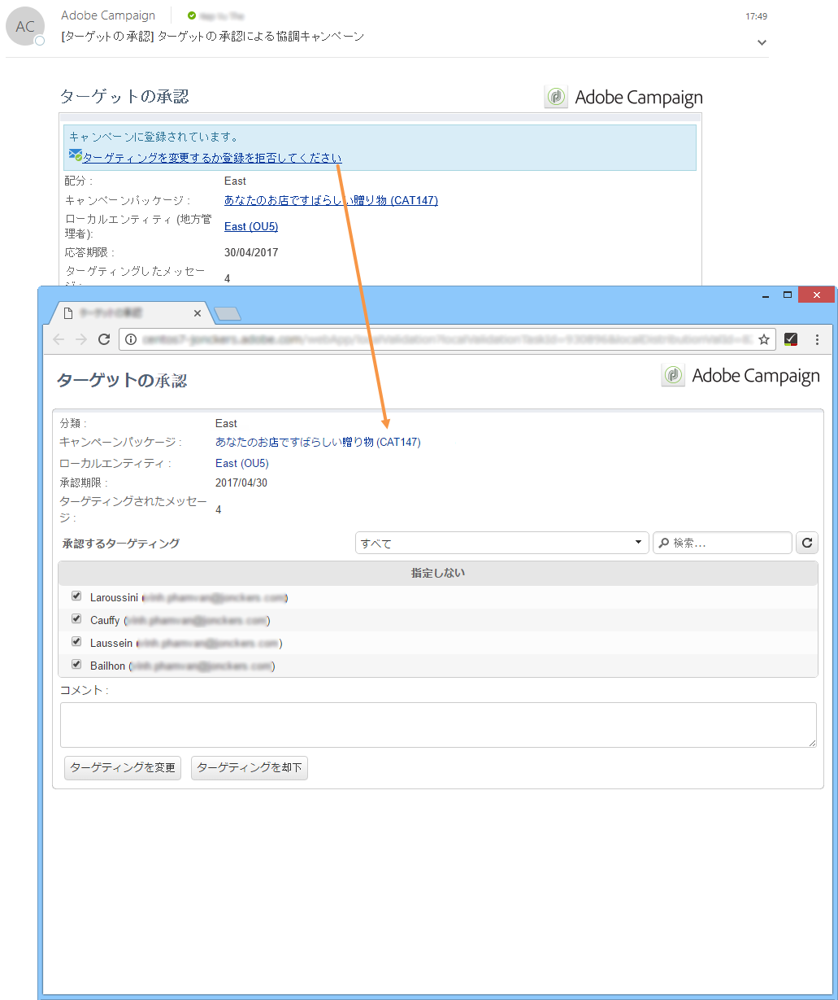

ローカルエンティティは、キャンペーンのコンテンツに基づいて、一部の連絡先を削除できます。

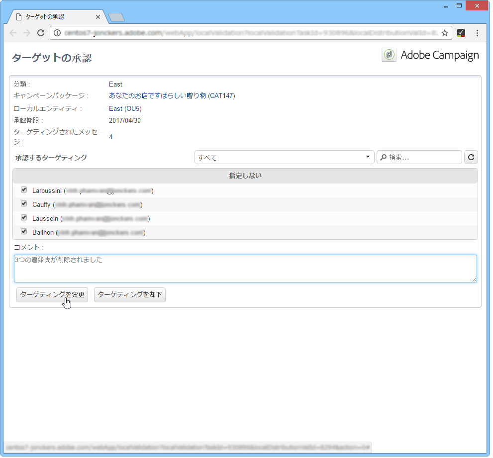

### シンプル {#simple}

To create a simple collaborative campaign, the **[!UICONTROL Collaborative campaign (simple)]** template must be selected.

## 協調キャンペーンパッケージの作成 {#creating-a-collaborative-campaign-package}

ローカルエンティティにキャンペーンを提供するには、セントラルエンティティがキャンペーンパッケージを作成する必要があります。

次の手順に従います。

1. In the **[!UICONTROL Navigation]** section on the **Campaigns** page, click the **[!UICONTROL Campaign packages]** link.
1. ボタンをクリッ **[!UICONTROL Create]** クします。
1. The section at the top of the window lets you select the **[!UICONTROL New collaborative package (mutualizedEmpty)]** template.
1. 参照キャンペーンを選択します。
1. キャンペーンパッケージのラベル、フォルダーおよび実行スケジュールを指定します。

### 日付 {#dates}

キャンペーンは、定義された開始日から終了日までの期間、キャンペーンパッケージのリストに表示されます。

**協調キャンペーン**&#x200B;の場合は、セントラルエンティティが登録とパーソナライゼーションの期限を指定します。

>[!NOTE]
>
>The **[!UICONTROL Personalization deadline]** allows the central entity to choose a deadline by which the local entities must have delivered the documents (spreadsheets, images) to be used to configure the campaign. これは必須オプションではありません。この日付を指定しなくても、キャンペーンの実装に影響はありません。

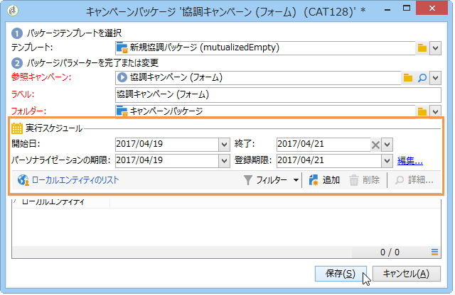

### オーディエンス {#audience}

協調キャンペーンを作成したら、セントラルエンティティはキャンペーンごとに関係するローカルエンティティを指定する必要があります。

>[!CAUTION]
>
>**[!UICONTROL Simple, by form and by campaign collaborative campaign kits]** 関連するローカルエンティティが指定されていない場合は、承認できません。

### 承認モード {#approval-modes}

**協調キャンペーン**&#x200B;では、オーダーの承認モードを指定できます。

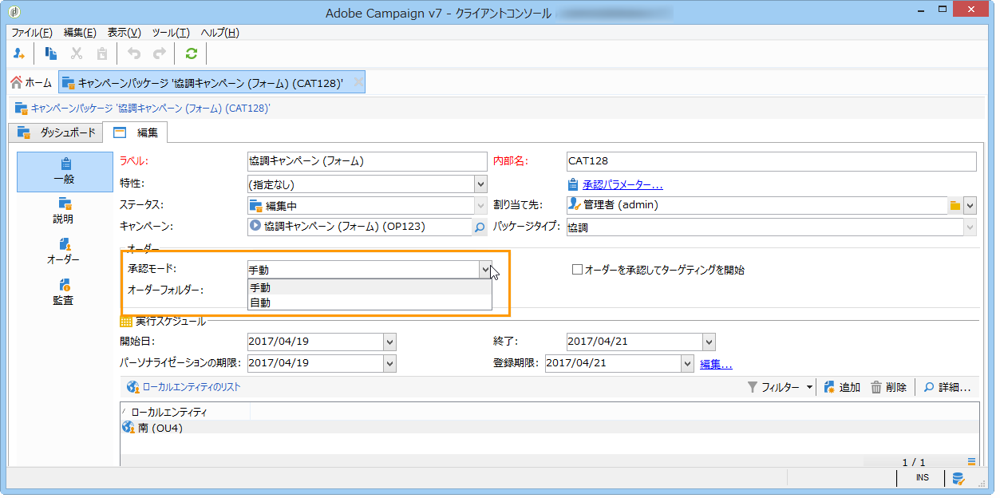

手動モードの場合、ローカルエンティティは参加したいキャンペーンに登録する必要があります。

自動モードの場合、ローカルエンティティはキャンペーンに既に登録されています。ローカルエンティティは、登録をキャンセルしたり、セントラルエンティティの承認なしにパラメーターを変更したりできます。

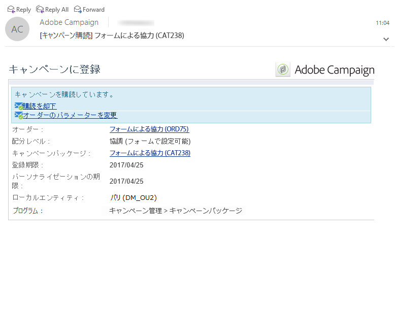

### 通知 {#notifications}

通知の設定方法は、ローカルエンティティの通知の設定方法と同じです。[この節](../../campaign/using/creating-a-local-campaign.md#notifications)を参照してください。

## キャンペーンのオーダー {#ordering-a-campaign}

協調キャンペーンがキャンペーンパッケージのリストに追加されると、セントラルエンティティによって定義されたオーディエンスに属するローカルエンティティに、通知が送信されます（オーディエンスを事前に定義しない&#x200B;**協調キャンペーン（ターゲットの承認）**&#x200B;は除きます）。送信メッセージには、以下の図のように、キャンペーンに登録するためのリンクが含まれています。

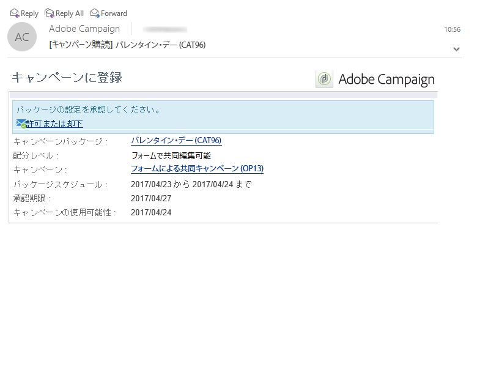

加えて、このメッセージでは、パッケージの作成者であるセントラルオペレーターによって入力された説明とキャンペーンにリンクされているドキュメントを表示することができます。これらの情報はキャンペーンに直接関係するわけではありませんが、参考情報として参照できます。

ローカルオペレーターは Web インターフェイスからログインし、オーダーする協調キャンペーンにパーソナライゼーションの情報を追加できます。

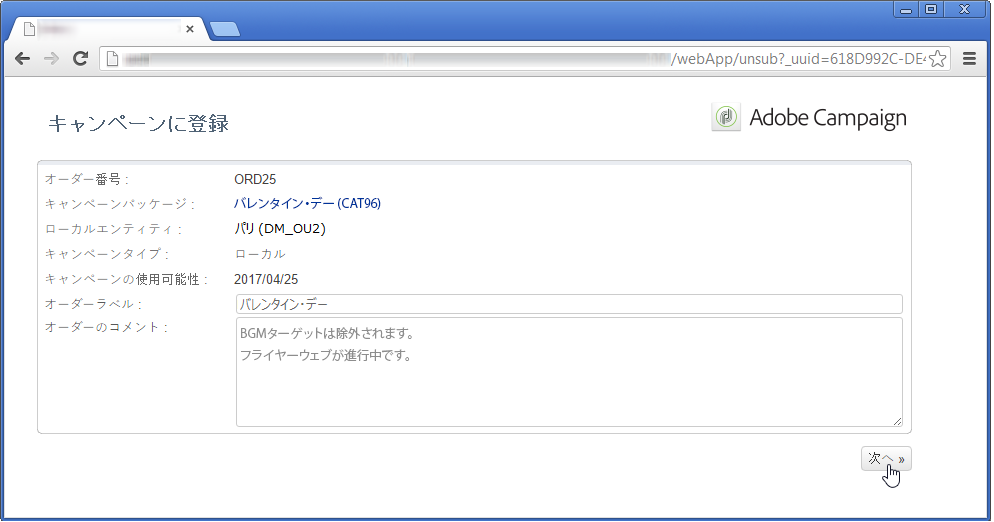

ローカルエンティティが登録を完了すると、セントラルエンティティにはオーダーの承認を依頼する通知が E メールで送信されます。

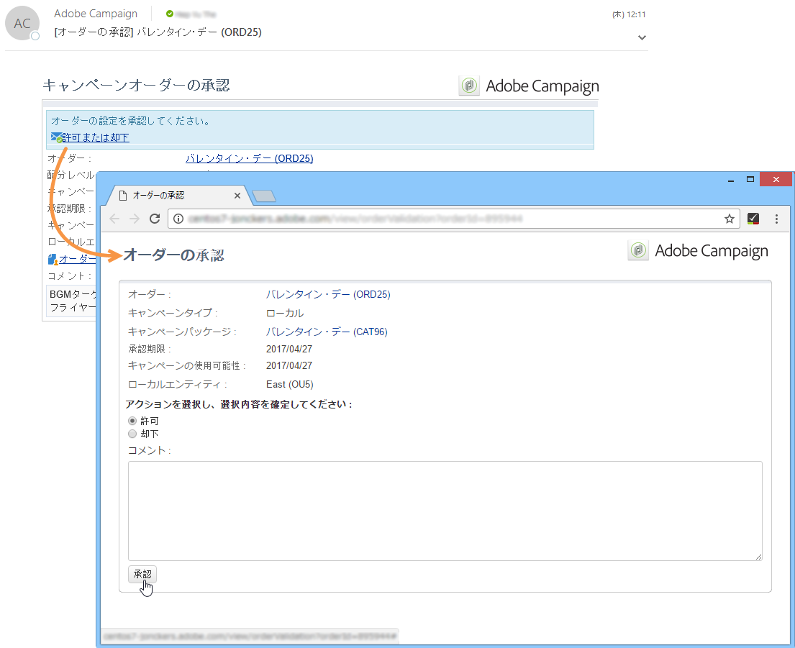

For more on this, refer to the [Approval process](../../campaign/using/creating-a-local-campaign.md#approval-process) section.

## オーダーの承認 {#approving-an-order}

協調キャンペーンパッケージのオーダー承認プロセスは、ローカルキャンペーンの承認プロセスと同じです。[この節](../../campaign/using/creating-a-local-campaign.md#approving-an-order)を参照してください。
