# ローカルキャンペーンの作成{#creating-a-local-campaign}

A local campaign is an instance created from a template referenced in the list of **[!UICONTROL campaign packages]** with a **specific execution schedule**. ローカルキャンペーンの目的は、セントラルエンティティによって設定されたテンプレートを使用して、ローカルのコミュニケーションのニーズを満たすキャンペーンを展開することです。ローカルキャンペーンの実装手順は、大きく以下の段階に分かれます。

**セントラルエンティティ**

1. ローカルキャンペーンのテンプレートを作成します。
1. テンプレートからキャンペーンパッケージを作成します。
1. キャンペーンパッケージをパブリッシュします。
1. オーダーを承認します。

**ローカルエンティティ**

1. キャンペーンをオーダーします。
1. キャンペーンを実施します。

## ローカルキャンペーンのテンプレートの作成 {#creating-a-local-campaign-template}

To create a campaign package, you must first create the **campaign template** via the **[!UICONTROL Resources > Templates]** node.

To create a new local template, duplicate the default **[!UICONTROL Local campaign (opLocal)]** template.

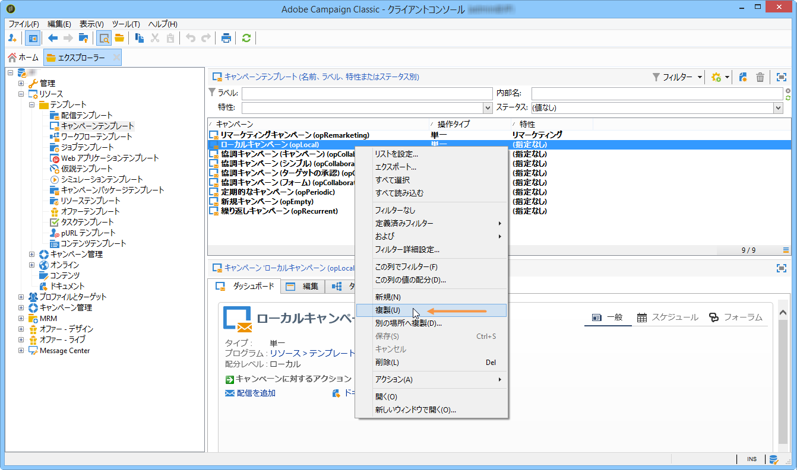

テンプレートに名前を付け、必要なすべてのフィールドに入力します。

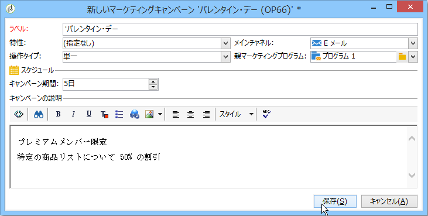

キャンペーンウィンドウで、タブをク **[!UICONTROL Edit]** リックし、リンクをクリック **[!UICONTROL Advanced campaign settings...]** します。

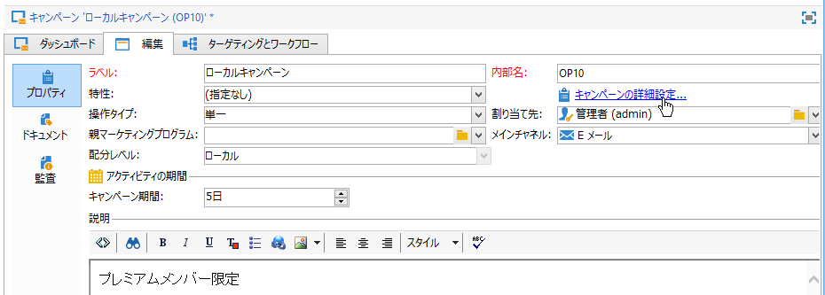

### Web インターフェイス {#web-interface}

「**分散型マーケティング**」タブでは、Web インターフェイスのタイプを選択し、ローカルエンティティがキャンペーンをオーダーする際に入力するデフォルトの値とパラメーターを指定することができます。

Web インターフェイスは、キャンペーンのオーダー時にローカルエンティティが入力するフォームに対応します。

このテンプレートをベースとするキャンペーンに適用される、Web インターフェイスのタイプを選択します。

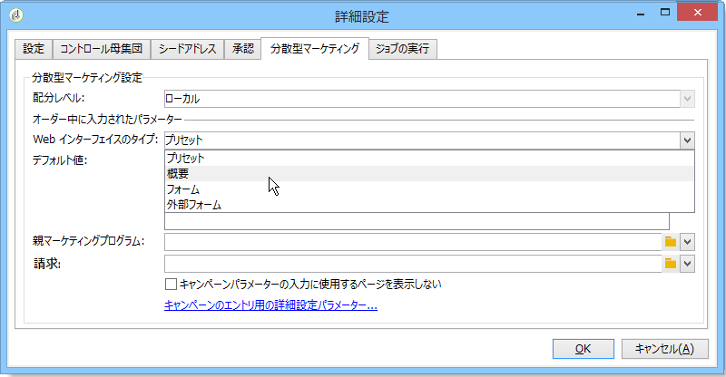

Web インターフェイスには、次の 4 つのタイプがあります。

* **[!UICONTROL By brief]** :ローカルエンティティは、キャンペーンの設定を説明する説明を提供する必要があります。 オーダーが承認されたら、セントラルエンティティがキャンペーン全体を設定および実行します。

   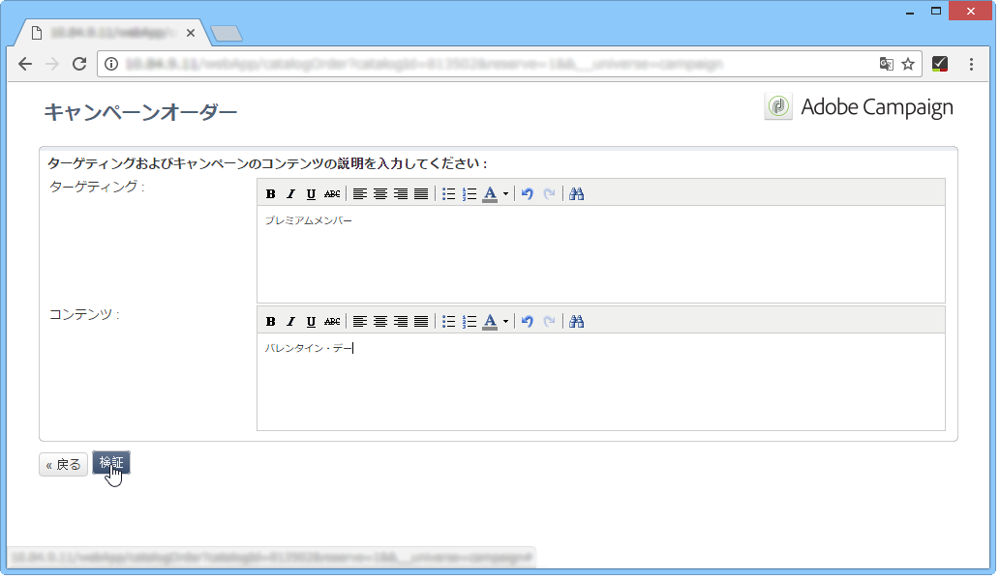

* **[!UICONTROL By form]** :ローカルエンティティはWebフォームにアクセスでき、Webフォームは使用するテンプレートに応じて、コンテンツ、ターゲット、最大サイズ、およびパーソナライゼーションフィールドを使用した作成日と抽出日を編集できます。 この Web フォームからは、ターゲットを評価したり、コンテンツをプレビューしたりすることも可能です。

   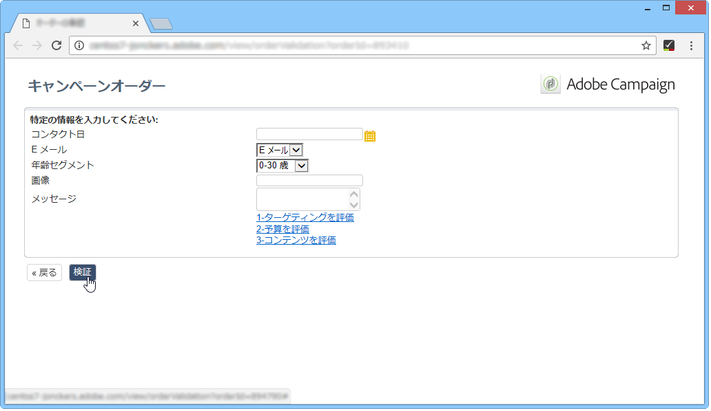

   The form offered is specified in a Web application that must be selected in a drop-down list from the **[!UICONTROL Web Interface]** field in the template&#39;s **[!UICONTROL Advanced campaign settings...]** link. 詳しくは、「ロ [ーカルキャンペーンの作成（フォーム別）」を参照してくださ](../../campaign/using/examples.md#creating-a-local-campaign--by-form-)い。

   >[!NOTE]
   >
   >この例で使用されている Web アプリケーションは、サンプルです。フォームを使用するには、Web アプリケーションを作成する必要があります。[API](../../configuration/using/about-web-services.md) を参照してください。

   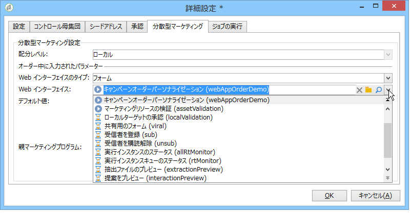

* **[!UICONTROL By external form]** :ローカルエンティティは、エクストラネット（Adobe Campaignではなく）のキャンペーンパラメーターにアクセスできます。 これらのパラメーターは、**ローカルキャンペーン（フォーム）**&#x200B;のパラメーターと同一です。
* **[!UICONTROL Pre-set]** :ローカルエンティティは、ローカライズせずにデフォルトのフォームを使用してキャンペーンを注文します。

   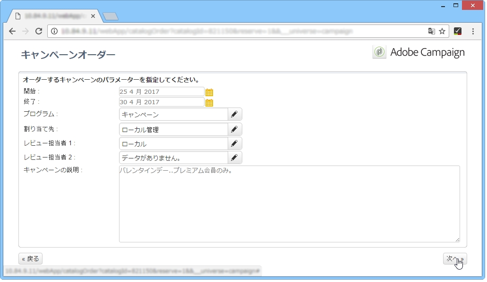

### デフォルト値 {#default-values}

Select the **[!UICONTROL Default values]** to be completed by local entities. 次に例を示します。

* コンタクト日と抽出日
* ターゲットの特性（年齢セグメントなど）

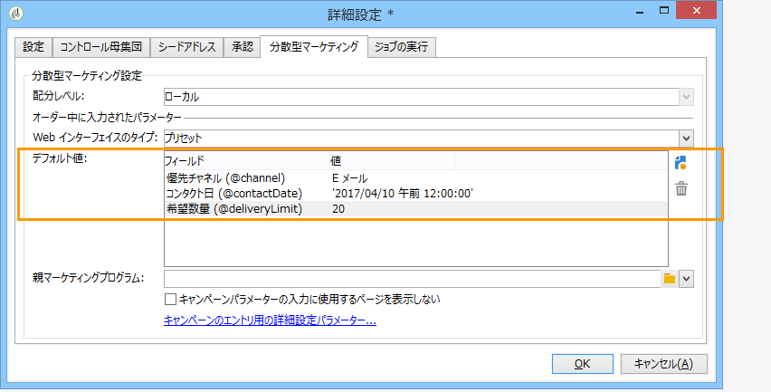

フィールドに **[!UICONTROL Parent marketing program]** 入力し **[!UICONTROL Charge]** ます。

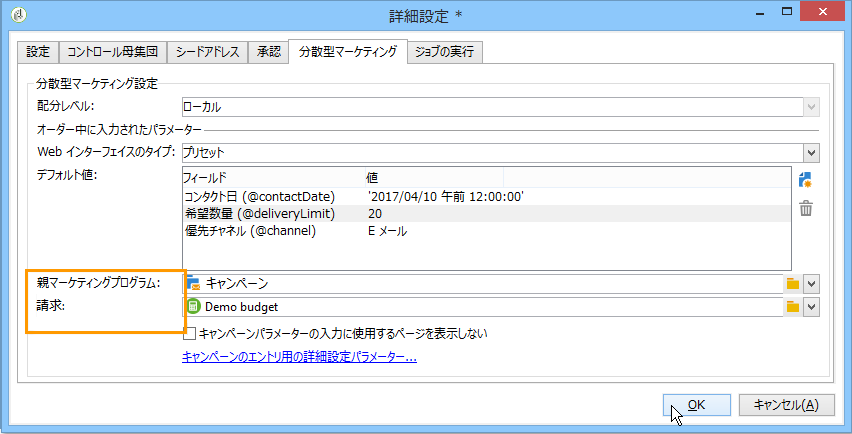

### 承認 {#approvals}

このリンク **[!UICONTROL Advanced parameters for campaign entry]** から、レビュー担当者の最大数を指定できます。

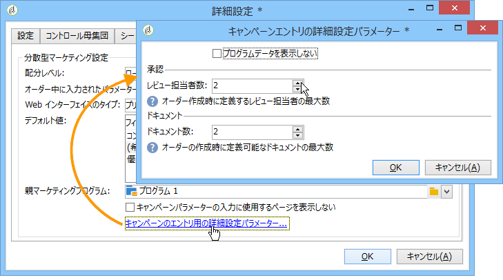

レビュー担当者は、キャンペーンのオーダー時にローカルエンティティによって入力されます。

キャンペーンのレビュー担当者を指名しない場合は、「0」と入力してください。

### ドキュメント {#documents}

オーダーを作成するローカルエンティティオペレーターに対して、ローカルキャンペーンへのドキュメントのリンク（テキストファイル、スプレッドシート、画像、キャンペーンの説明など）を許可できます。このリ **[!UICONTROL Advanced parameters for campaign entry...]** ンクを使用して、ドキュメント数を制限できます。 To do this, simply enter the maximum number allowed in the **[!UICONTROL Number of documents]** field.

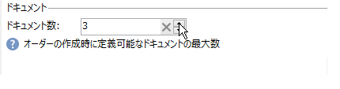

キャンペーンパッケージをオーダーする際、フォームでは、テンプレートの「ドキュメント数」フィールドで指定されている数に応じてドキュメントをリンクできます。

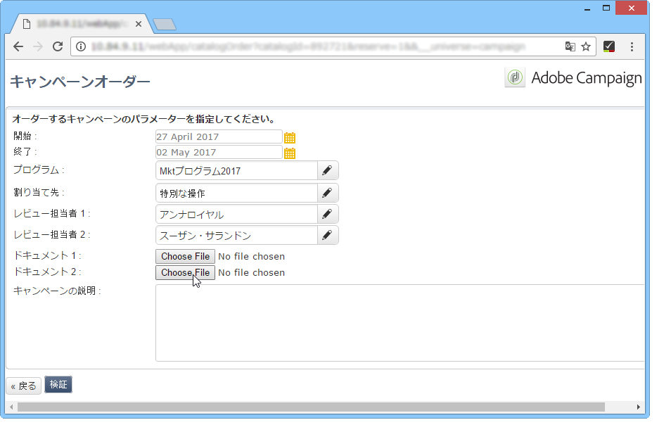

If you do not wish to display a document upload field, enter **[!UICONTROL 0]** in the **[!UICONTROL Number of documents]** field.

>[!NOTE]
>
>を非アク **[!UICONTROL Advanced parameters for campaign entry]** ティブにするには、を確認しま **[!UICONTROL Do not display the page used to enter the campaign parameters]**&#x200B;す。

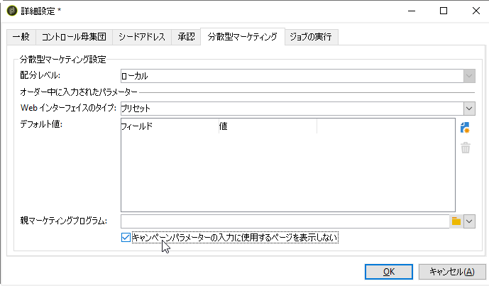

### ワークフロー {#workflow}

タブで、で指 **[!UICONTROL Targeting and workflows]** 定したを収集し、配信を作成するキャンペーン **[!UICONTROL Default values]** ワークフロー **[!UICONTROL Advanced campaign settings...]** を作成します。

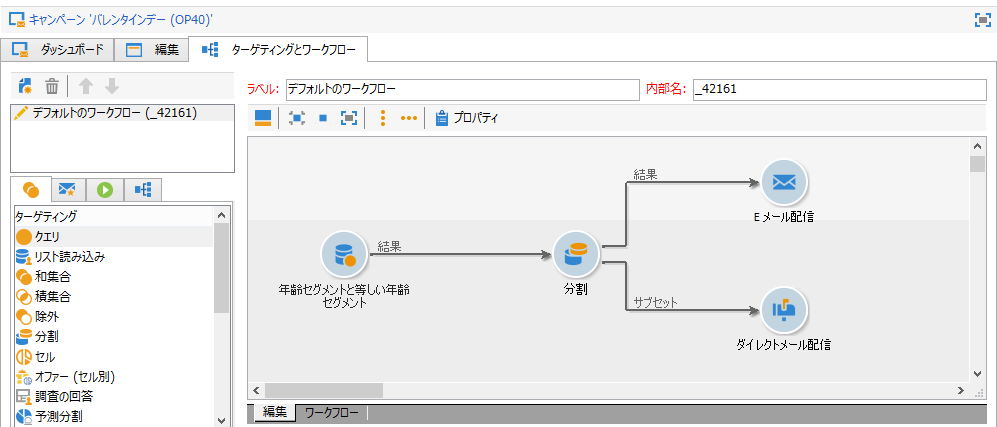

Double click the **[!UICONTROL Query]** activity to configure it according to the specified **[!UICONTROL Default values]**.

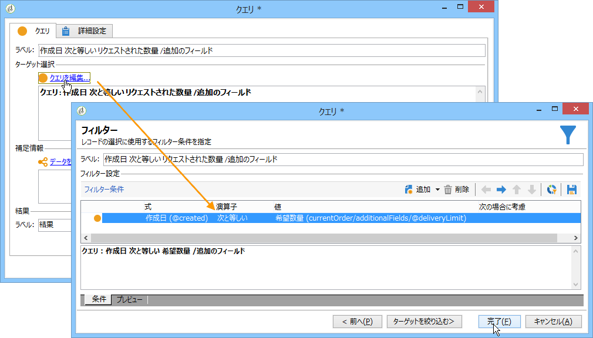

### 配信 {#delivery}

In the **[!UICONTROL Audit]** tab, click the **[!UICONTROL Detail...]** icon to view the **[!UICONTROL Scheduling]** for the selected delivery.

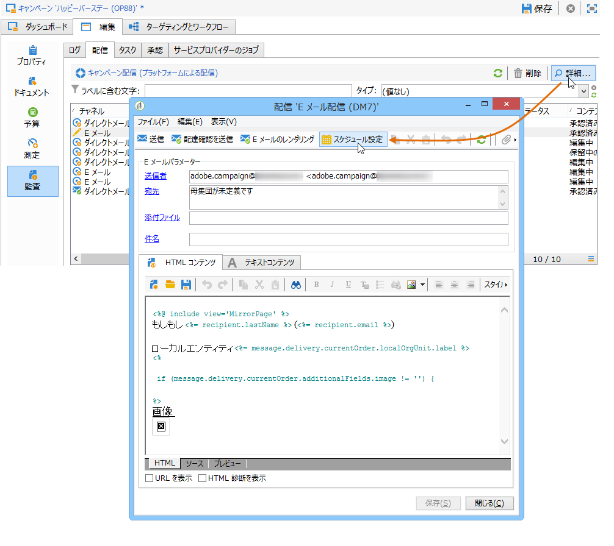

The **[!UICONTROL Scheduling]** icon lets you configure the delivery&#39;s contact and execution date.

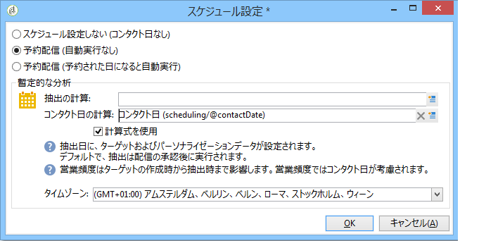

必要に応じて、配信の最大サイズを設定します。

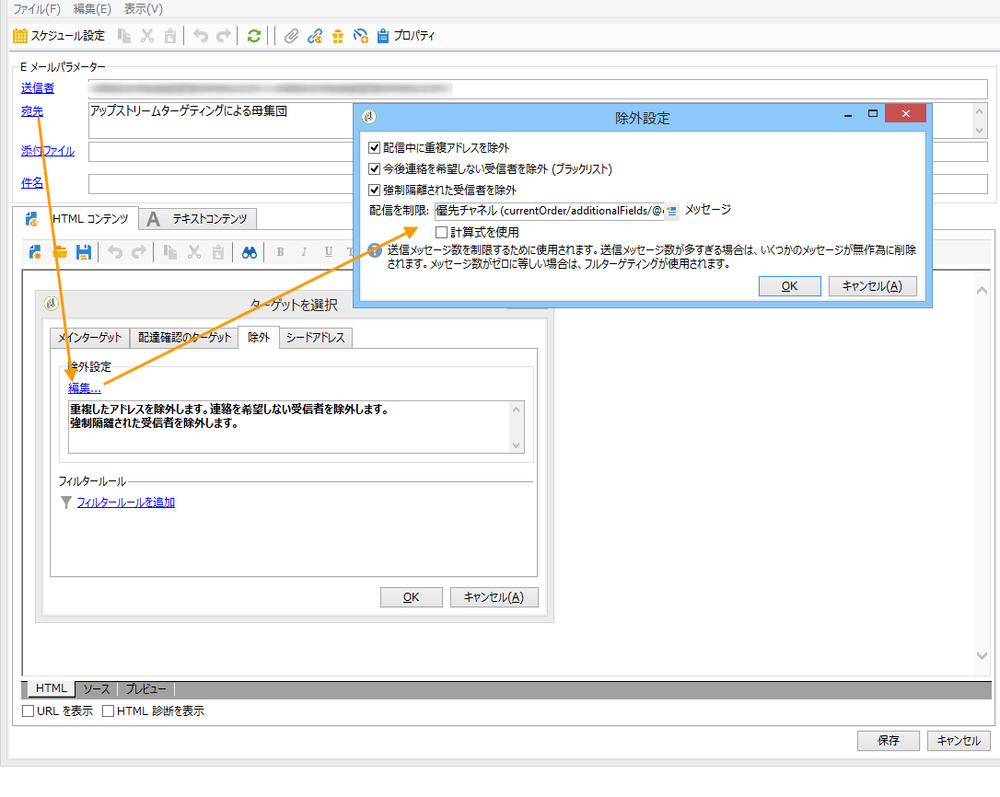

配信の HTML を特定します。例えば、では、こ **[!UICONTROL Delivery > Current order > Additional fields]**&#x200B;のフィールドを **[!UICONTROL Age segment]** 使用して、ターゲットの年齢に応じた配信を検索します。

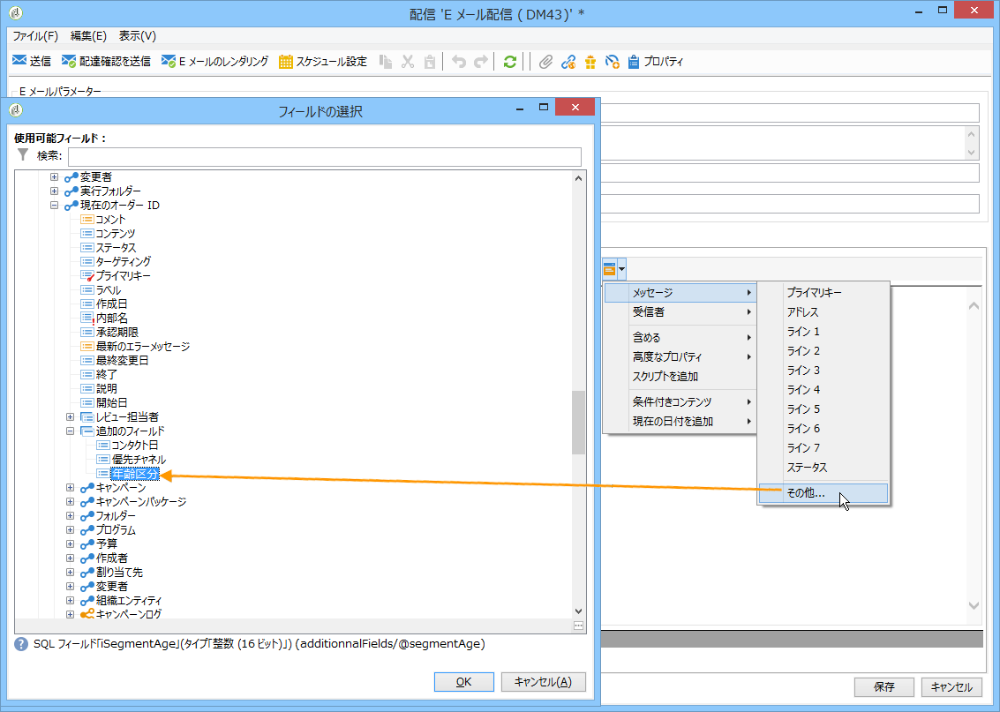

キャンペーンのテンプレートを保存します。You can now use it from the **Campaign packages** view in the **Campaigns** universe, by clicking the **[!UICONTROL Create]** button.

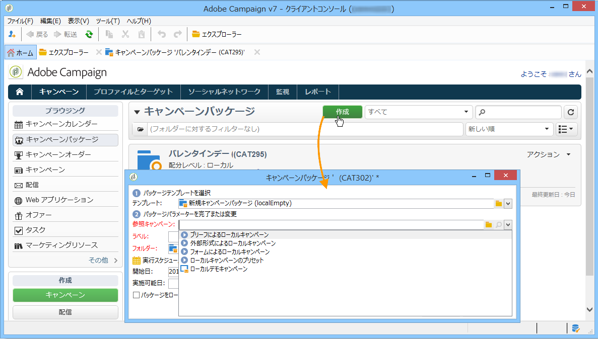

>[!NOTE]
>
>Campaign templates and their general configuration are detailed in [Campaign templates](../../campaign/using/marketing-campaign-templates.md#campaign-templates).

## キャンペーンパッケージの作成 {#creating-the-campaign-package}

ローカルエンティティがキャンペーンのテンプレートを使用するには、テンプレートがリストに追加されている必要があります。そのためには、セントラルエージェントが新しいパッケージを作成する必要があります。

次の手順に従います。

1. In the **[!UICONTROL Navigation]** section on the **Campaigns** page, click the **[!UICONTROL Campaign packages]** link.
1. ボタンをクリッ **[!UICONTROL Create]** クします。

   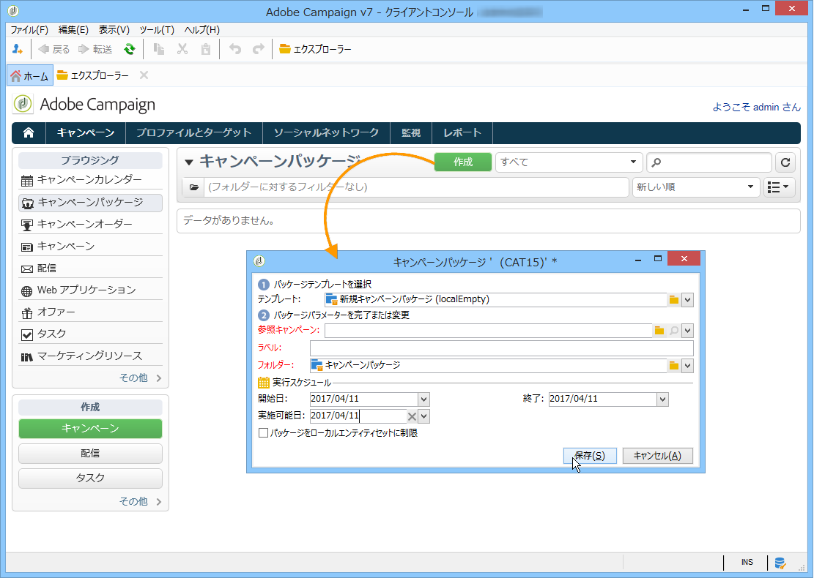

1. ウィンドウ上に表示されるセクションで、[前述の手順](#creating-a-local-campaign-template)で作成したキャンペーンパッケージのテンプレートを選択します。

   デフォルトでは、テンプレート **[!UICONTROL New local campaign package (localEmpty)]** はローカルキャンペーンに使用されます。

1. キャンペーンパッケージのラベル、フォルダーおよび実行スケジュールを指定します。

### 日付 {#dates}

キャンペーンは、定義された開始日から終了日までの期間、キャンペーンパッケージのリストに表示されます。

キャンペーンの使用可能な日付とは、ローカルエンティティがキャンペーンのオーダーを開始できる日付を指します。

>[!CAUTION]
>
>期限までにキャンペーンを予約しなかった場合、ローカルエンティティがそのキャンペーンを使用することはできません。

この情報は、以下の図のように、ローカルエージェントに送信される通知メッセージに記載されます。

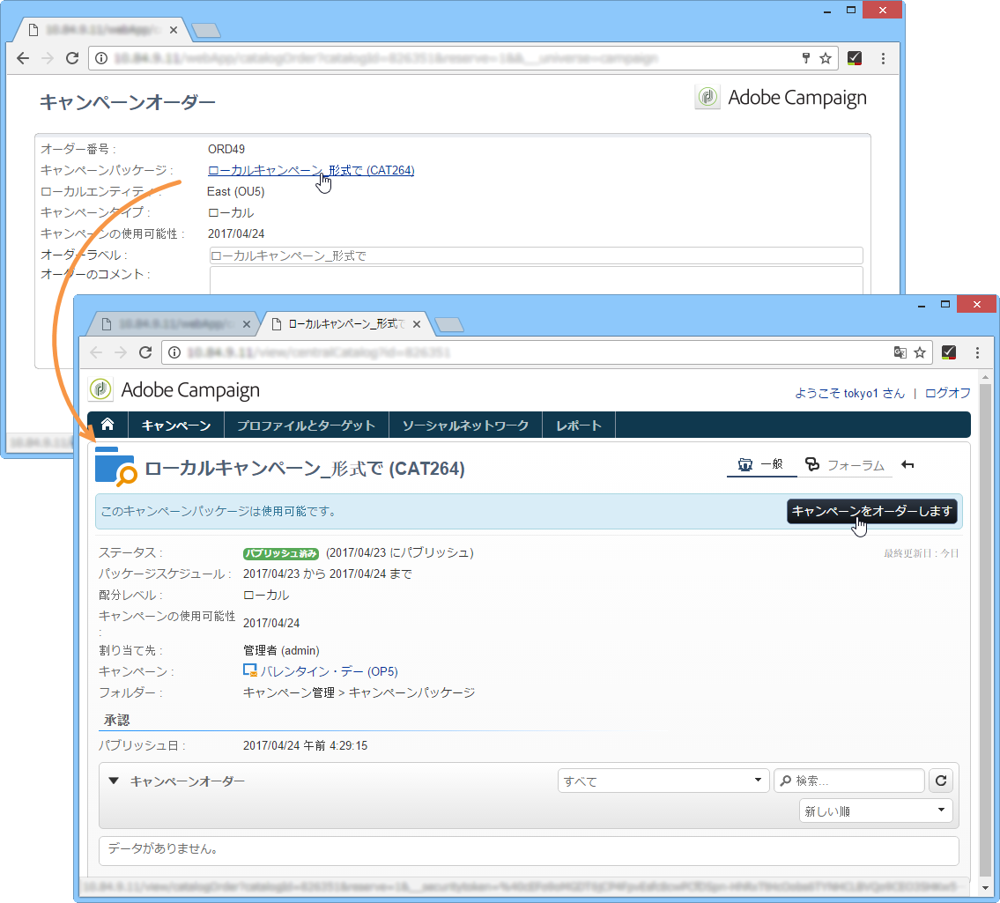

### オーディエンス {#audience}

ローカルキャンペーンの場合、中央エンティティは、を確認することで、関連するローカルエンティティを指定できま **[!UICONTROL Limit the package to a set of local entities]**&#x200B;す。

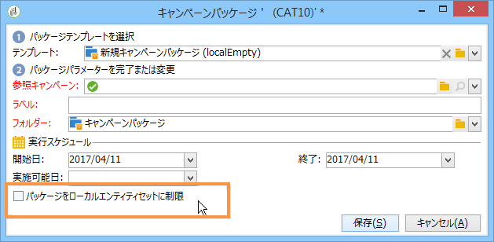

### その他の設定 {#additional-settings}

Once the package is saved, the central entity can edit it from the **[!UICONTROL Edit]** tab.

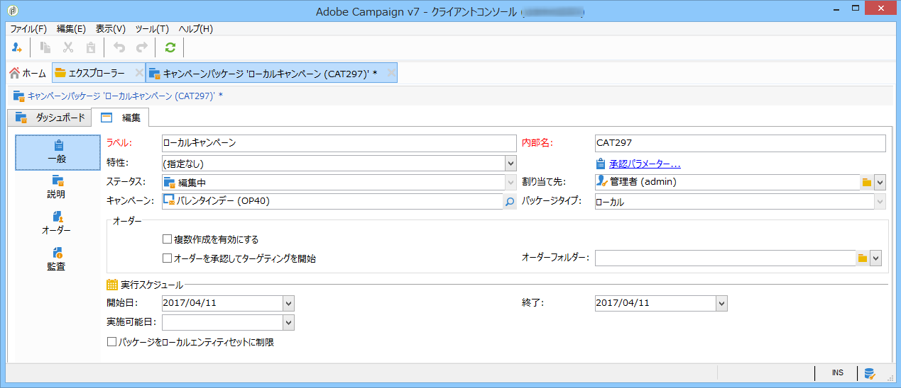

From the **[!UICONTROL General]** tab, the central entity can:

* configure the campaign package reviewer(s) from the **[!UICONTROL Approval parameters...]** link,
* 実行スケジュールを確認します。
* ローカルエンティティを追加または削除します。

>[!NOTE]
>
>デフォルトでは、各エンティティが&#x200B;**ローカルキャンペーン**&#x200B;をオーダーできるのは 1 回のみです。
>   
>Check the **[!UICONTROL Enable multiple creation]** option to allow several local campaigns to be created from the campaign package.

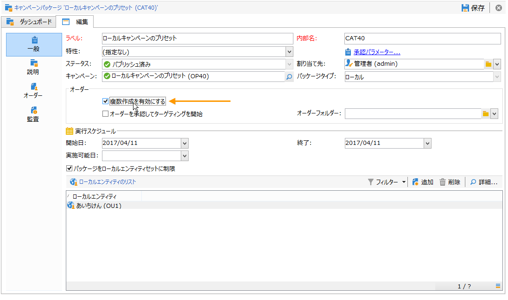

### 通知 {#notifications}

キャンペーンが使用可能になる、または登録の期限が切れると、ローカル通知グループのオペレーターにメッセージが送信されます。For more on this, refer to [Organizational entities](../../campaign/using/about-distributed-marketing.md#organizational-entities).

## キャンペーンのオーダー {#ordering-a-campaign}

キャンペーンパッケージが承認され、実装期間に入ると、ローカルエンティティはパッケージにアクセスすることができます。ローカルエンティティには、新しいキャンペーンパッケージが使用可能な日付になりしだい、そのことを知らせる E メールが送信されます。

>[!NOTE]
>
>キャンペーンパッケージの作成時に特定のローカルエンティティが指定されている場合は、そのローカルエンティティにのみ通知が送信されます。ローカルエンティティが指定されていない場合は、すべてのローカルエンティティに通知が送信されます。

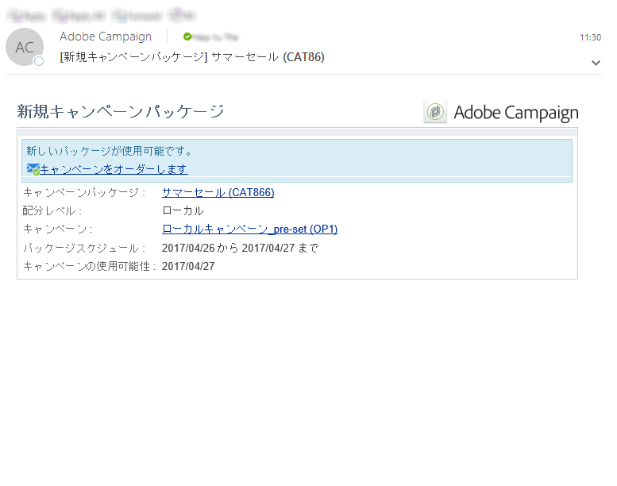

セントラルエンティティによって提供されたキャンペーンを使用するには、ローカルエンティティはキャンペーンをオーダーする必要があります。

キャンペーンをオーダーするには：

1. Click **[!UICONTROL Order campaign]** in the notification message, or the corresponding button in Adobe Campaign.

   ID とパスワードを入力して、キャンペーンをオーダーします。インターフェイスは、Web アプリケーションで定義されている一連のページで構成されます。

   >[!NOTE]
   >
   >Web アプリケーションについて詳しくは、[Web 機能](../../web/using/about-web-applications.md)ガイドを参照してください。

1. Enter the necessary information in the first page (order label and comment) and click **[!UICONTROL Next]**.

   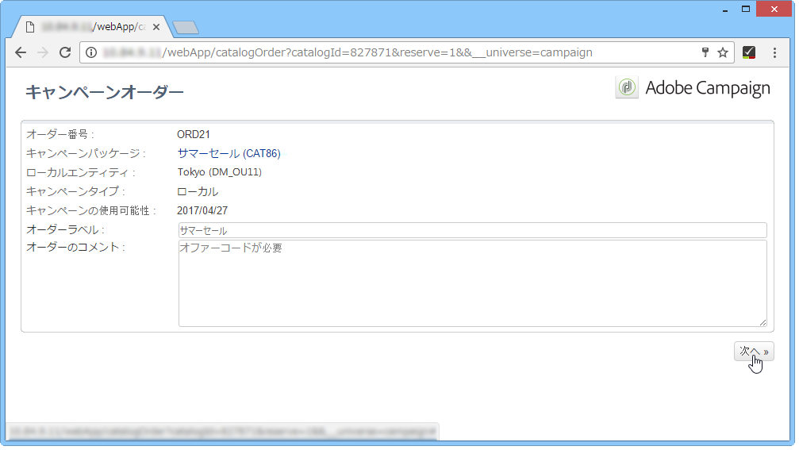

   必要なパラメーターをすべて指定したら、オーダーの承認を受けます。

   ローカルエンティティが所属する組織エンティティのマネージャーに、オーダーの承認を依頼する通知が送信されます。

   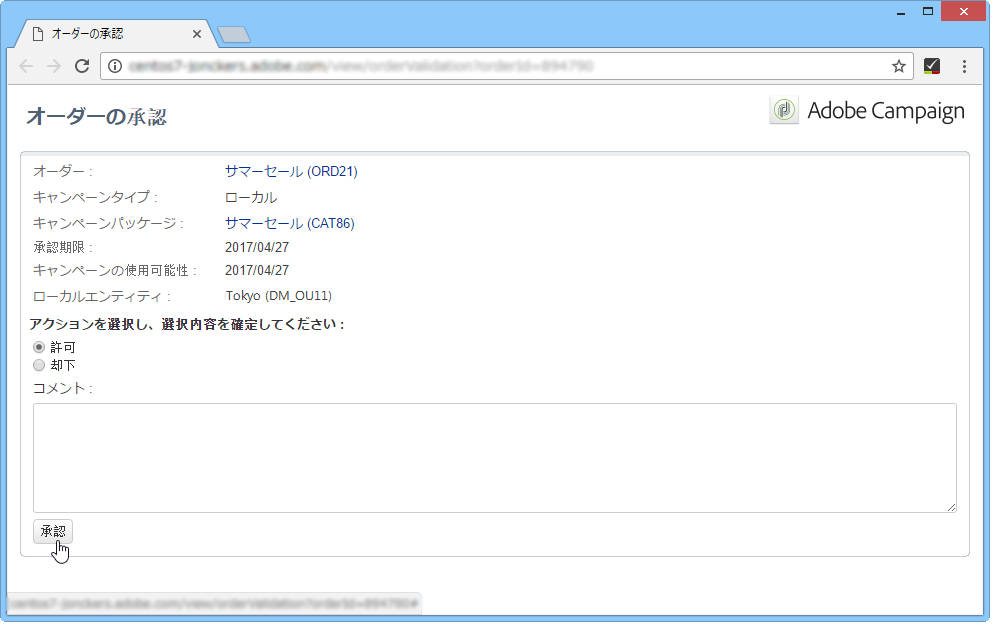

1. 承認の情報が、ローカルエンティティとセントラルエンティティに返されます。ローカルエンティティには、そのローカルエンティティのオーダーのみが表示されますが、セントラルエンティティには全ローカルエンティティのオーダーがすべて表示されます（以下の図を参照）。

   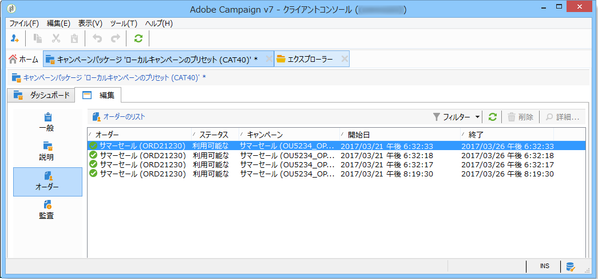

   オペレーターは、オーダーの詳細を表示できます。

   

   The **[!UICONTROL Edit]** tab contains information entered by the local entity when ordering the campaign.

   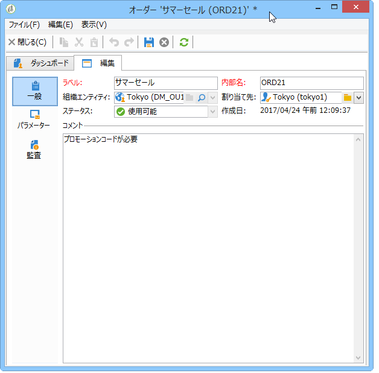

1. オーダーが最終処理されるには、セントラルエンティティの承認が必要です。

   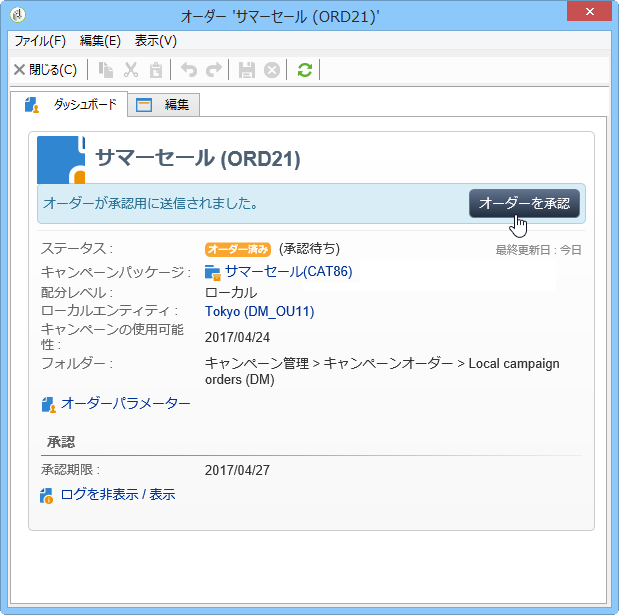

   For more on this, refer to the [Approval process](#approval-process) section.

1. 承認が完了すると、キャンペーンが使用可能になったことがローカルオペレーターに通知されます。キャンペーンの可用性は、**キャンペーン**&#x200B;ウィンドウのキャンペーンパッケージのリストで確認できます。これで、キャンペーンの使用が可能になりました。For more on this, refer to [Accessing campaigns](../../campaign/using/accessing-campaigns.md).

   The **[!UICONTROL Start targeting with order approval]** option lets the local entity run the campaign as soon as the order has been approved.

   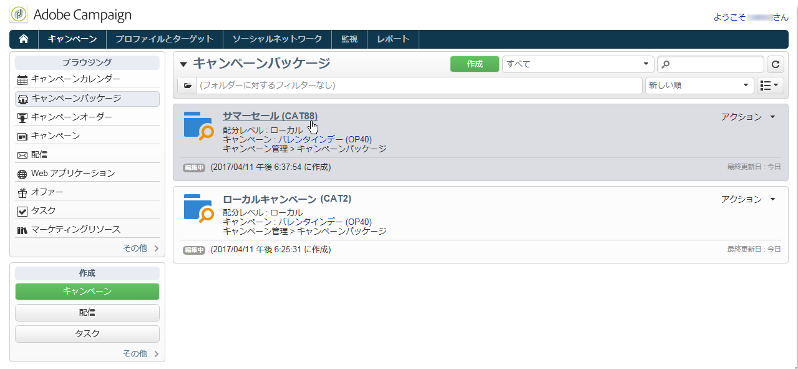

## オーダーの承認 {#approving-an-order}

キャンペーンのオーダーを確定するには、セントラルエンティティがオーダーを承認する必要があります。

The **[!UICONTROL Campaign orders]** overview, accessed via the **Campaigns** universe lets you view the status of campaign orders and approve them.

>[!NOTE]
>
>オーダーがまだ承認されていなければ、ローカルエンティティはオーダーに変更を加えることができます。

### 承認プロセス {#approval-process}

#### E メールによる通知 {#email-notification}

ローカルエンティティがキャンペーンをオーダーすると、レビュー担当者に以下のような E メールが送信されます。

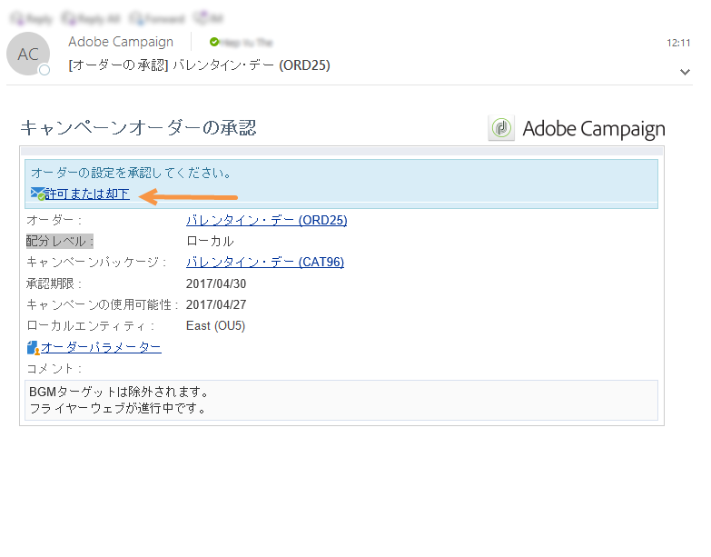

>[!NOTE]
>
>Selecting reviewers is presented in the [Reviewers](#reviewers) section. レビュー担当者は、オーダーを許可または却下できます。

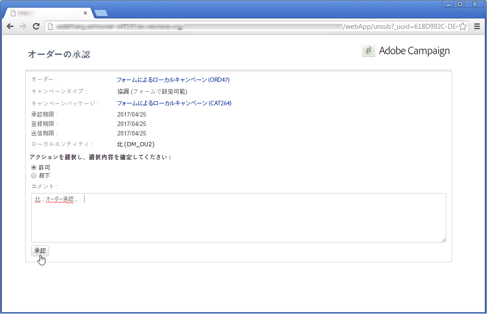

#### Adobe Campaign コンソールを使用する承認 {#approving-via-the-adobe-campaign-console}

オーダーの承認は、キャンペーンのオーダーの概要で、コンソールから実行することもできます。注文を承認するには、注文を選択してをクリックしま **[!UICONTROL Approve the order]**&#x200B;す。

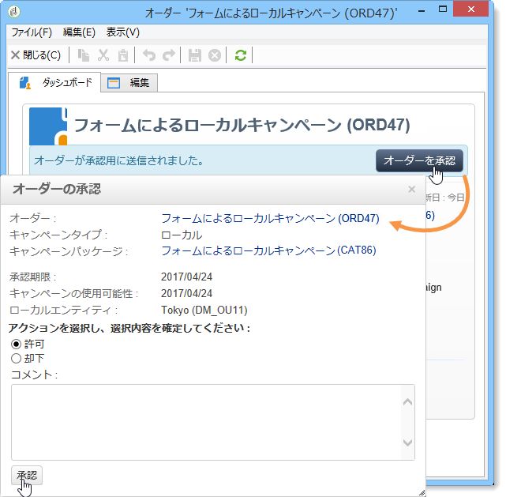

>[!NOTE]
>
>キャンペーンは、キャンペーンを使用可能な日まで編集および再設定が可能です。Local entities can also reject the campaign by clicking the **[!UICONTROL Cancel]** button.

#### キャンペーンの作成 {#creating-a-campaign}

キャンペーンのオーダーが承認されると、ローカルエンティティはキャンペーンを設定および実行できるようになります。

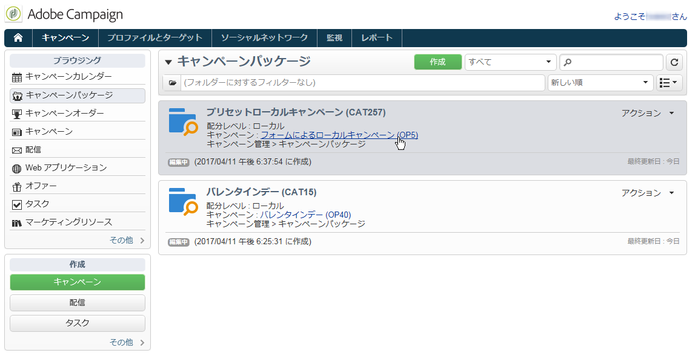

For more on this, refer to [Accessing campaigns](../../campaign/using/accessing-campaigns.md).

### 承認の却下 {#rejecting-an-approval}

承認を担当するオペレーターは、オーダーまたはキャンペーンパッケージを却下できます。

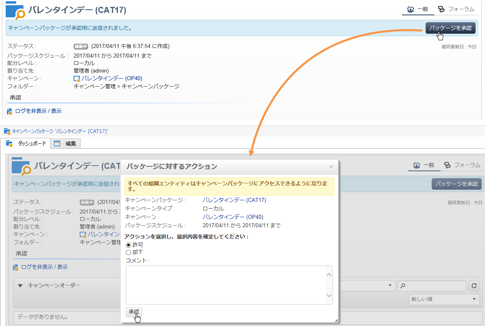

レビュー担当者がオーダーを却下すると、影響を受けるローカルエンティティに自動的に通知が送信されます。通知には、承認を却下したオペレーターのコメントが表示されます。

却下の情報は、キャンペーンパッケージのリストのページやキャンペーンのオーダーのページにも表示されます。Adobe Campaign コンソールにアクセスできるローカルエンティティは、コンソールで却下の情報を確認できます。

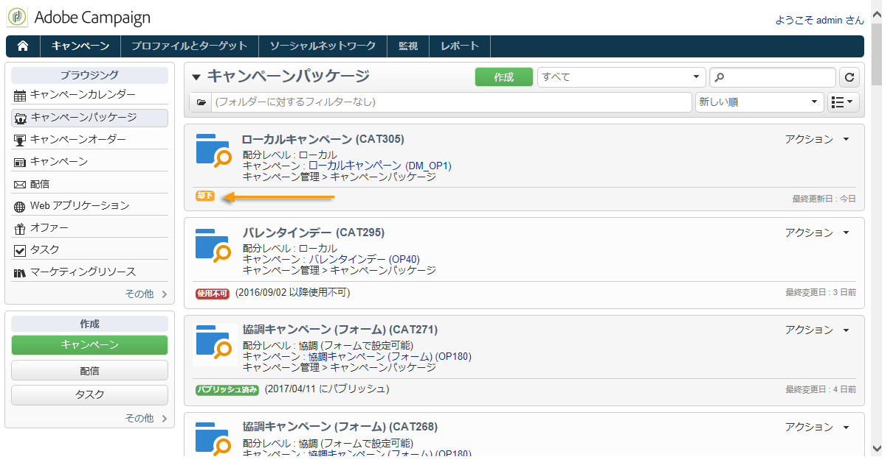

They can view the related comment in the campaign package&#39;s **[!UICONTROL Edit]** tab.

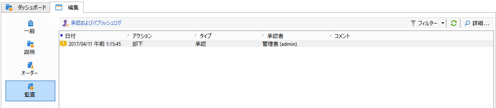

### レビュー担当者 {#reviewers}

承認が必要になると、レビュー担当者に E メールで通知が送信されます。

ローカルエンティティごとに、キャンペーンのオーダーおよびキャンペーンを承認するレビュー担当者が選ばれます。For more information on selecting local reviewers, refer to [Organizational entities](../../campaign/using/about-distributed-marketing.md#organizational-entities).

>[!NOTE]
>
>レビュー担当者は、オーダーの承認を有効にする前に選択する必要があります。

### オーダーのキャンセル {#canceling-an-order}

The central agency can cancel an order using the **[!UICONTROL Delete]** button, located on the order dashboard.

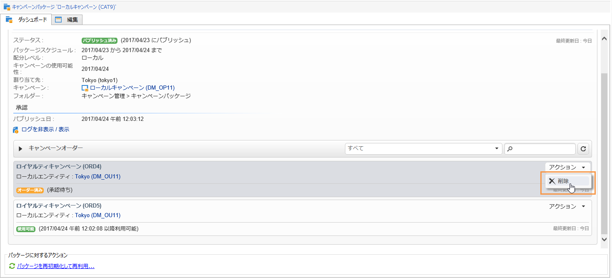

This cancels the campaign in the **[!UICONTROL Campaign orders]** view.
