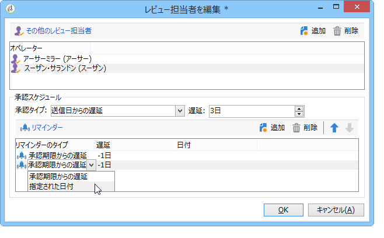

# タスクの作成と管理{#creating-and-managing-tasks}

## タスクについて {#about-tasks}

Adobe Campaign では、タスクを作成し、タスクのライフサイクル全体をアプリケーション内で直接管理できます。プログラムとキャンペーンの実装をタスクに分割し、Adobe Campaign のオペレーターや外部サービスプロバイダーに割り当てることができます。このようにタスクを処理することで、あらゆるプログラム参加者と外部参加者を含むオープンなコラボレーション環境の構築が可能になります。

タスクは、タスクのリストまたはキャンペーンダッシュボードから作成、表示、監視できます。マーケティングプラン、プログラムおよびキャンペーンのスケジュールでタスクを表示、トラッキングすることも可能です。

タスクはキャンペーンに紐付いており、依存関係（関連タスクなど）も設定できます。各タスクにはステータス、優先順位、推定ワークロードおよび関連コストがあります。

すべてのタスクは、**キャンペーン**&#x200B;ウィンドウからアクセスできるリストにグループ化されます。For more on this, refer to [Accessing tasks](#accessing-tasks).

タスクは、タスクが属するプログラムのスケジュールに表示できます。

## タスクへのアクセス {#accessing-tasks}

### タスクの表示 {#displaying-tasks}

The tasks are displayed in the task list accessible via the **[!UICONTROL Campaigns]** universe.

このリストで、関係するオペレーターのすべてのタスクを確認できます。

詳しくは、「タスクの実行ステー [タス」および「タスクの進](#execution-status-of-a-task) 行状況」を参照してください 。

### タスクのフィルター {#filtering-tasks}

When you display this view, it is automatically filtered in order to display only **[!UICONTROL operator tasks]**. ウィンドウ上部にあるフィールドを使用してタスクをフィルターすることもできます。

### タスクの編集 {#editing-tasks}

タスクを編集するには、タスクをクリックします。

## 新規タスクの作成 {#creating-a-new-task}

To create a task, click the **[!UICONTROL Tasks]** link in the Campaigns universe and select **[!UICONTROL Create]**.

タスクの名前を入力し、そのタスクのリンク先キャンペーンを選択します。開始日と終了日も指定する必要があります。この 3 つの情報は必須です。

Click **[!UICONTROL Save]** to create the task.

タスクはキャンペーンのダッシュボードでも作成できます。この場合、タスクはダッシュボードのキャンペーンに自動的にリンクされます。

作成したタスクは、キャンペーンスケジュールとタスクのリストに追加されます。To edit a task, select it from the schedule or click its name in the task overview, and click the **[!UICONTROL Open]** link.

タスクを設定するには、以下を指定する必要があります。

* 管理者と参加者：詳しくは、管理 [者と参加者を参照してください](#manager-and-participants)。
* 作成スケジュール：詳しくは、実行スケジ [ュールを参照してくださ](#execution-schedule)い。
* コストは次のようになります。経費と収 [益を参照](#expenses-and-revenues)。

It is also possible to ad reviewers (refer to [Reviewers](#reviewers)) and referenced documents (refer to [Documents referenced](#documents-referenced)).

Task life cycle is presented in [Life cycle](#life-cycle).

### 管理者と参加者 {#manager-and-participants}

タスクを閉じることができるのは、タスクを担当するオペレーターのみです。

デフォルトでは、Adobe Campaign のオペレーターがタスクを作成すると、自動的にそのオペレーターがタスクの割り当て先になります。To select a different operator, use the **[!UICONTROL Assigned to]** field.

>[!NOTE]
>
>オペレーターの管理については、[この節](../../platform/using/access-management.md)を参照してください。

タスクの実行に関係するオペレーターを指定することはできますが、それらのオペレーターがタスクを閉じることはできません。割り当てられたタスクの承認のみを実行できます。

They are selected using the **[!UICONTROL Resources]** icon in the task toolbar. Click **[!UICONTROL Add]** and select the concerned operators.

「**[!UICONTROL Ok]**」をクリックして使用率を入力します。使用率とは、タスクの実行期間中にオペレーターに割り当てる作業量です。使用率は単なる目安で、パーセント単位で指定します。

例えば、実行スケジュールが 10 日間のタスクの場合、オペレーターの使用率を 50％と指定すると、そのオペレーターは 10 日間、勤務時間の半分をタスクに費やすことになります。

各オペレーターについて、予約済みワークロードと実際のワークロードを入力できます。この期間も、目安に過ぎません。

リマインダーを設定し、タスクの終了日前に関係するすべてのオペレーターにリマインダーを自動的に送信することができます。

You can view the Adobe Campaign operator profile via the **[!UICONTROL Edit link]** icon.

オペレーターダッシュボードでは、オペレーターのワークロード（処理中のその他のタスク）を確認できます。

### レビュー担当者 {#reviewers}

参加者に加え、担当者がタスクを閉じた後にタスクをレビューするオペレーターも定義できます。To do this, click the **[!UICONTROL Enable task approval]** option in the lower left-hand section of the **[!UICONTROL Resources]** window. レビュー担当者には、1 人のオペレーター、オペレーターのグループまたはオペレーターのリストを指定できます。

To specify a list of operators, click the **[!UICONTROL Edit...]** link to the right of the first reviewer and add as many operators as necessary, as shown below:

レビュー担当者設定ウィンドウの下部でタスクのスケジュールを定義できます。デフォルトでは、レビュー担当者がタスクを承認できるのは送信日から 3 日間です。リマインダーを設定し、承認期限の前に関係するオペレーターにリマインダーを自動的に送信することもできます。

タスクの担当者は、他のオペレーターがレビューを担当している場合でも、自分自身にタスクのレビューを割り当てることができます。レビュー担当者が定義されていない場合は、タスクの担当者に通知が送信されます。All other Adobe Campaign operators with **[!UICONTROL Administrator]** rights can also approve the task. とはいえ、これらのオペレーターには通知が送信されません。

### 参照されたドキュメント {#documents-referenced}

It&#39;s possible to add documents and marketing resources to a task (for more on this, refer to [Managing marketing resources](../../campaign/using/managing-marketing-resources.md)). To do so, open the task and click the **[!UICONTROL Documents]** icon in the task toolbar.

Click **[!UICONTROL Add]** and select the document to be added to your task. マーケティングリソースも同様に追加します。

参照ドキュメントは、タスクに関係するオペレーターに送信される通知やタスクダッシュボードに表示されます。

### 実行スケジュール {#execution-schedule}

The validity period of a task is indicated in the **[!UICONTROL Start]** and **[!UICONTROL End]** fields. 予約済みの作業量は、その期間に実行されるワークロードを示します。ワークロードは日数と時間数で指定します。

>[!NOTE]
>
>The life cycle of a task is presented in [Life cycle](#life-cycle).

The **[!UICONTROL Workload performed]** field also expressed in days and hours, lets you manually update the progress of the task with respect to the scheduled workload.

The **[!UICONTROL Progress status]** of the task, expressed as a percentage, is updated automatically based on the tasks carried out by the operators involved. 手動で入力することも可能です。

この情報はタスクダッシュボードに表示されます。

また、「キャンペーン」タブにも表示されます。

If the task execution schedule end date has been reached but the task is not completed, the task will be **[!UICONTROL Late]**. 加えて、オペレーターに警告メッセージが表示されます。

詳しくは、「タスクの進行状況 [」を参照してください](#progress-status-of-a-task)。

### 費用と売上高 {#expenses-and-revenues}

各タスクについて関連費用を定義し、売上高を予測できます。費用と売上高は、計算後、タスクが関連付けられているキャンペーンに統合されます。

To specify this information, click the **[!UICONTROL Expenses and revenue]** icon in the task toolbar.

デフォルトでは、請求される予算はタスクが関連付けられているキャンペーンの予算です。この予算はタスクの詳細に表示されます。

>[!NOTE]
>
>費用と予算の詳細については、「コストの確約、計 [算および課金」を参照してください](../../campaign/using/controlling-costs.md#cost-commitment--calculation-and-charging)。

ウィンドウでは達成目標も定義できます。目標にはタスクの予測売上高を入力します。

### サービスプロバイダー {#service-providers}

外部のサービスプロバイダーをタスクの管理に参加させることもできます。

サービスプロバイダーを追加するには、タスクプロパティを編集し、関係するサービスプロバイダーを選択します。ウィンドウの中央部にサービスプロバイダーに関連するコストカテゴリが自動的にリスト表示されます。

詳しくは、「サービスプロバイダーとそ [のコストカテゴリの作成」を参照してください](../../campaign/using/providers--stocks-and-budgets.md#creating-a-service-provider-and-its-cost-categories)。

タスクの実行に関連するコストカテゴリを選択します。選択するには、コストのタイプを選択し、必要に応じて金額を追加します。

>[!NOTE]
>
>The method for managing budgets and costs is presented in [Controlling costs](../../campaign/using/controlling-costs.md).

サービスプロバイダーを選択すると、タスクダッシュボードに表示されるようになります。

### 遅延タスク {#late-tasks}

A task is late if it has reached its end date without its status changing to **[!UICONTROL Finished]**. デフォルトでは、タスクが遅れた場合に警告を受信するオペレーターはいません。タスクに関係していないオペレーターも含め、すべてのオペレーターに通知が届くよう、E メール通知の配信を設定することができます。

Go to the **[!UICONTROL Resources]** box and add the operator to the **[!UICONTROL Assignation]** field. 複数のオペレーターに通知を送信する場合は、オペレーターのグループを選択します。

### 最初の通知 {#initial-notifications}

開始日に達していないタスクを作成または修正すると、タスクの担当者に開始日を通知する E メールを送信するオプションが表示されます。

もっとも、作成しているタスクの開始日がまだ当分先の場合、通知の送信をスケジュールしてタスクの開始前に通知するほうが良い場合もあります。例えば、タスクの開始日が 1 ヶ月先の場合、開始 1 週間前に担当者に通知することができます。

To schedule a notification, go to the **[!UICONTROL Resources]** box and use the **[!UICONTROL Initial notification]** field.

* キャンペーンのタスクの場合は、特定の日付と時間を選択します。
* For tasks within campaign templates, the notification time is expressed as the time remaining before the task starts (for instance, if you enter 2d in the **[!UICONTROL Initial notification]** field, the email will be sent 2 days before the task start date).

通知をスケジュールした場合も、タスクを保存すると、すぐに通知を送信するオプションが表示されます。その場で送信しても、設定した通知のスケジュールには影響しません。

### プログラムにリンクされたタスク {#task-linked-to-a-program}

プログラム内で直接タスクを作成すると、特定のキャンペーンではなく組織全体に関係するアクションを管理することができます（プログラム内の次期キャンペーンのテーマを検討する会議など）。タスクはプログラムスケジュールに表示されます。

プログラムに直接リンクされるタスクを作成するには、以下を実行します。

1. プログラムスケジュールを開きます。ホームページで、に進みます **[!UICONTROL Campaigns > Browse > Other choices > Programs]**。 ウィンドウの右側に全体的なプログラムスケジュールが開きます。
1. スケジュールで目的のプログラムをクリックすると、プログラムが表示されたウィンドウが開きます。
1. In this window, click **[!UICONTROL Open]**. プログラムスケジュールが開きます。
1. 右側のスケジ **[!UICONTROL Add]** ュールの上にあるボタンをクリックし、をクリックしま **[!UICONTROL Add a task]**&#x200B;す。

### オペレーターの可用性 {#operator-availability}

タスクダッシュボードでオペレーター名の横にアイコンが表示される場合、そのオペレーターはタスクの期間中に別のタスクかイベントで既に作業していることを意味します(Task which the operator is in charge of or involved in: he appears in the **[!UICONTROL Assigned to]** field or in the task **[!UICONTROL Resources]** box).

### ワークフローのタスク {#task-in-a-workflow}

Using a **[!UICONTROL Task]** element in a campaign workflow enables you to define two scenarios depending on whether or not the task is approved.

In the campaign workflows, the **[!UICONTROL Task]** activity is found in the **[!UICONTROL Flow control]** tab.

## タスクのタイプ {#types-of-task}

キャンペーンでタスクを作成すると、特定のタイプのタスクを作成できます。タスクのタイプは選択したテンプレートに応じて定義されます。

以下のタスクを予約できます。

* **[!UICONTROL Control task]**&#x200B;を参照し [てください](#control-tasks)。
* **[!UICONTROL Marketing resource creation task]**、「グループ化 [タスク](#grouping-task)」、
* **[!UICONTROL Grouping task]**、「グループ化 [タスク](#grouping-task)」、
* **[!UICONTROL Notification task]**&#x200B;を使用する場合は、「通知タ [スク](#notification-task)」を参照。

>[!NOTE]
>
>**[!UICONTROL Control task]** およびタ **[!UICONTROL Grouping]** スクは、キャンペーンダッシュボ **ードから** のみ作成できます。\
>これらのタスクは担当オペレーターのタスクマップに表示されます。タスクへのア [クセスを参照してくださ](#accessing-tasks)い。

### コントロールタスク {#control-tasks}

A **[!UICONTROL Control task]** is linked to delivery approval: approval of targeting, content, extraction file, budget or proof.

作成したコントロールタスクはキャンペーンダッシュボードに追加されます。

追加されたタスクは、編集してパラメーターを指定することができます。

### マーケティングリソース作成タスク {#marketing-resource-creation-task}

マーケティングリソース作成タスクは、マーケティングリソースの作成とパブリッシュの管理に使用できます。リソース自体ではなくタスクを使用してリソースを管理している場合は、以下のことができます。

* キャンペーンでのリソース作成プロセスの制御
* スケジュール内でのリソース作成プロセスの表示
* リソース作成プロセスの管理（リマインダー、通知）
* リソース作成に関連するコストの計算と制御
* タスクを使用したリソースの承認とパブリッシュ（関連オプションが有効になっている場合）

#### タスクとタスクにリンクされたリソース間のインタラクション {#interaction-between-the-task-and-its-linked-resource}

以下のように、マーケティングリソースの作成タスクと、タスクにリンクされたリソースとの間にはインタラクションがあります。

* リソース作成スケジュールおよびリンクされたコストは、タスクを使用して管理できます。
* オペレーターは、通常の操作（ダウンロードとアップロード、ロックとロック解除）と同様にリソースで作業できます。これらの操作はタスクに影響しません。
* Resource approval and publication can be carried out via the task: if the **[!UICONTROL Publish the marketing resource]** option is enabled, the resource is approved and published automatically once the task is finished. このオプションが有効になっていない場合、タスクとリソース間のインタラクションはありません。どちらか一方を操作しても、もう一方には影響しません。

   リンクされたタスクを使用して承認サイクル全体を定義できます。Check the **[!UICONTROL Publish the marketing resource]** option only for the last task: all tasks will need to be finished in order for the resource to be published. さらに、子マーケティングリソースタスクを作成すると、子タスクでリソースが自動的に選択されます。

   * **リソースを使用する場合**：リソースを承認用に送信したり承認したりしても、タスクに影響はありません。
   * **タスクを使用**:タスクで **[!UICONTROL Publish the marketing resource]** このオプションをチェックインすると、タスクが完了すると、リソースが自動的に承認され、発行されます（上記を参照）。 このオプションが有効になっていない場合は、タスクとリソースの間のインタラクションはありません。どちらか一方を操作しても、もう一方には影響しません。

#### マーケティングリソース作成タスクの設定 {#configuring-a-marketing-resource-creation-task}

タスクのレビュー担当者と、リソースで定義されたコンテンツのレビュー担当者は必ずしも同一人物ではありません。However, if the **[!UICONTROL Publish the marketing resource]** option is checked (see below), the task reviewer is authorized to approve the resource content, as finishing the task automatically approves the resource (or, if no reviewer is defined, the task manager).

In the **[!UICONTROL Marketing resource]** field, define the resource you want to manage via this task. 次の操作をおこなうことができます。

* Select an existing resource: the drop-down list offers all resources with the status **[!UICONTROL Being edited]**.
* リソースの作成：アイコンをク **[!UICONTROL Select the link]** リックし、アイコンをクリック **[!UICONTROL Create]** します。

The **[!UICONTROL Publish the marketing resource]** option lets you automate resource publishing: once the task is **[!UICONTROL Finished]**, the status of the resource automatically switches to **[!UICONTROL Published]**, even if it was neither submitted for approval or approved, including if the reviewer who completes the task isn&#39;t the content reviewer defined in the resource.

The **[!UICONTROL Publish the resource]** button is made available and the resource publishing reviewer receives a notification email to let him know that it is ready to be published. In the **[!UICONTROL Edit > Tracking]** tab, reviewing and publishing by the task reviewer become visible. リソースの後処理ワークフローが定義されている場合は、この時点で実行されます。

### グループ化タスク {#grouping-task}

The **[!UICONTROL Grouping task]** type task lets you group several tasks and synchronize the management of their progress and their approval.

グループ化タスクに費用やリソースはリンクされません。

グループ化タスクでグループ化されたすべてのタスクは、グループ化タスクのダッシュボードに表示されます。このダッシュボードでは、確認したいタスクのみを表示するようタスクのリストをフィルターできます。

グループ化タスクには、グループ化したタスクを容易に作成できるリンクが用意されています。

To create a grouped task based on a grouping task, go to the campaign dashboard and click the name of the grouping task to display its description, then click **[!UICONTROL Add a task]**.

However, if you have already created a task that you want to link to a grouping task, you can do it via the **[!UICONTROL Linked to]** field of the **[!UICONTROL Properties]** box.

### 通知タスク {#notification-task}

通知タスクでは、（オペレーター、オペレーターのグループ、サービスプロバイダーなどへの）E メール配信をスケジュールできます。リマインダーをスケジュールして、例えば、キャンペーンがもうすぐ終了することをオペレーターに通知したり、オペレーターが準備できるようキャンペーンの開始前にドキュメントを送信したりできます。これにより、キャンペーンやプログラムのコミュニケーションを追跡し、実行されるアクションを詳細に把握できます。

#### ライフサイクル {#life-cycle}

通知タスクに承認は必要ありません。このため、通知タスクのライフサイクルは標準タスクよりも単純です。

通知タスクには以下のステータスがあります。

* **[!UICONTROL Scheduled]** 電子メールが送信されるまで
* **[!UICONTROL In progress]** 電子メールが送信され、終了日に達するまで
* **[!UICONTROL Finished]** 終了日に達したら、

#### 設定 {#configuration}

作成中、タスクに以下の要素を入力する必要があります。

* **[!UICONTROL Assigned to]** :電子メールを受信する演算子または演算子のグループ。 E メールの送信後にタスクの担当者を変更した場合、新しいオペレーターに E メールは送信されません（新しいオペレーターに送信するには、タスクを再初期化して開始日を変更する必要があります）。
* **タスク開始日**：通知 E メールの送信日です。この日付は、タスクのレコードの時点で将来の日付である必要があります。
* **タスクの終了日**:タスクの状態が変更される日 **[!UICONTROL Finished]**&#x200B;付。 デフォルトでは、終了日は開始日と同じ日付ですが、必要に応じてタスクに期間を割り当て、オペレーターの予定作業期間を指定することもできます。
* **[!UICONTROL Description]** :ここに入力したテキストは、通知電子メールの本文に表示されます。

   

タスクや通知 E メールに添付ファイルを追加することもできます。To do this, click the **[!UICONTROL Documents]** icon in the toolbar in the upper right-hand corner.

## ライフサイクル {#life-cycle-1}

### タスク間のリンク {#links-between-tasks}

The **[!UICONTROL Properties]** button in each task enables you to define the links between tasks in a campaign. You can split tasks into subtasks using a grouping task (see [Linked tasks](#linked-tasks)), or define dependencies between the tasks (see [Grouping tasks](#grouping-tasks)).

#### リンク済みタスク {#linked-tasks}

Use the **[!UICONTROL Linked task]** field to associate tasks with a grouping task. タスク [のタイプを参照](#types-of-task)。

以下の例では、ターゲティングの承認が 4 つのサブタスクに分割されます。

各サブタスクは、メインタスクにリンクされた標準タスクです。

#### グループ化タスク {#grouping-tasks}

Use the **[!UICONTROL Grouped to]** field to make the execution of a task depend on the execution of another task.

タスク間の依存関係は、キャンペーンダッシュボード内の矢印で表されます。

グループ化されたタスクの場合、Adobe Campaignは親タスクの終了日を子タスクの開始日として自動的に割り当てます。 例えば、「**招待状の作成**」というタスクが 10 月 15 日午後 3 時半に終了する場合、「**招待 E メールの送信**」という子タスクは 10 月 15 日午後 3 時半に開始します。

Moreover, if you postpone the end of a parent task, some of its child tasks may be affected: these are the child tasks whose status is **[!UICONTROL Scheduled]** and whose start date is earlier than the new end date of the parent task. タスクの期間は変更されません。子タスクの開始日が親タスクの新しい終了日よりも遅い場合は、子タスクに影響はありません。

**例**

10 月 9 日午後 5 時に終了するようスケジュールされた親タスクに、task A と task B の 2 つの子タスクがあるとします。Task A は 10 月 10 日午後 2 時に、task B は 10 月 12 日午前 8 時に開始するようスケジュールされています。

ここで親タスクを延期して、終了日を 10 月 11 日午後 1 時に設定します。すると、task A のみが延期され、開始日が 10 月 11 日午後 1 時になります。

### タスクの実行ステータス {#execution-status-of-a-task}

タスクのステータスはタスクマップに表示されます。タスクの実行ステータスは、オペレーターのアクションに応じて自動的に更新されます。

タスクは次のようになります。 **[!UICONTROL Scheduled]**、、、、、 **[!UICONTROL In progress]**&#x200B;ま **[!UICONTROL Finished]**&#x200B;たは **[!UICONTROL Canceled]**&#x200B;です **[!UICONTROL Pending approval]****[!UICONTROL Rejected]**。

* When a task is created, it is **[!UICONTROL Scheduled]** if its start date is in the future. 開始日になるまでステータスは変わりません。
* Once it has been started, the task is **[!UICONTROL In progress]**. When the person in charge of the task closes it, it changes to **[!UICONTROL Finished]**.
* If a reviewer has been defined, the task will be **[!UICONTROL Pending approval]** once the person in charge of it closes it and until the reviewer approves it. If the reviewer rejects it, the task will be **[!UICONTROL Rejected]**.
* A task can be canceled by the person responsible for it via the dashboard or the **[!UICONTROL Task map]** by clicking the **[!UICONTROL Cancel]** button.
* タスクをスケジュールするには、将来の開始日を入力します。入力後、タスクの実行に関係する Adobe Campaign のオペレーターに最初の通知を送信できます。See [Complete task life cycle](#complete-task-life-cycle).

>[!NOTE]
>
>* タスクのステータスは自動的に更新されます。
>* 有効期間が終了した場合も、タスクは閉じられるまで処理中のタスクのリストに表示されます。この場合、オペレーターにタスクが遅れていることを知らせる警告が届きます。
>

### タスクの処理ステータス {#progress-status-of-a-task}

In addition to its execution status, a task can be associated with a progress status: **[!UICONTROL Late]**, **[!UICONTROL To approve]**, **[!UICONTROL To do today]** or **[!UICONTROL To do this week]**. この情報は、タスクのスケジュールに応じて自動的に入力されます。

タスクのリストは処理ステータスまたは進捗状況ステータス別にフィルターできます。

For more on this, refer to [Accessing tasks](#accessing-tasks).

### タスクのライフサイクル全体 {#complete-task-life-cycle}

以下は、担当者が参加者とレビュー担当者を定義したタスクのライフサイクルの各ステージです。

1. 担当者がタスクを作成し、複数のフィールドを入力します。For more on this, refer to [Creating a new task](#creating-a-new-task).

   タスクを作成、編集して&#x200B;**将来の日付に予約**（タスクの開始日よりも前に予約）する場合、新しいタスクが予約されたことを知らせる通知を参加者およびマネージャーに送信できます。

   

   To send this first notification, click **[!UICONTROL Yes]**. この通知には、コンテンツについての詳細や期限までの残り日数など、次のタスクについての情報が記載されます。

   When a task is created and scheduled for the future, its status is **[!UICONTROL Scheduled]**.

1. タスクの開始日になると、担当者と参加者にタスクが開始したことを知らせる通知が送信されます。Its status changes to **[!UICONTROL In progress]**.
1. 割り当てのセクションを完了すると、参加者は以下のいずれかの方法でタスクを承認できます。

   * 通知 E メールを使用する。
   * タスクダッシュボードのコンソールまたは Web インターフェイスを使用する。

      

1. 参加者がジョブを承認するたびに、タスクの進捗状況ステータスが更新されます。

   

1. レビュー担当者に、オペレーターが割り当てのセクションを完了したことを知らせる通知 E メールが届きます。

   レビュー担当者はタスクダッシュボードで進捗状況を確認できます。

   

1. タスクの担当者がタスクの完了を判断すると、レビュー担当者はタスクの開始時に送信された通知 E メールに記載されたリンク、コンソールまたはインターフェイスを使用してタスクを閉じることができます。

   

   >[!NOTE]
   >
   >タスクの担当者は、承認済みでなくてもいつでもタスクを閉じることができます。進捗状況ステータスは自動的に「100％」になります。

1. The task status changes to **[!UICONTROL To approve]**, and a notification is sent to the reviewer.

   レビュー担当者は、通知 E メール、コンソールまたは Web インターフェイスを使用してタスクを承認します。

   キャンペーンダッシュボードから承認できます。

   

   タスクの承認ボタンを使用することもできます。

   

   >[!NOTE]
   >
   >The task status will only change to **[!UICONTROL To approve]** if you have enabled the **[!UICONTROL Enable task validation]** option in the **[!UICONTROL Resources]** window of the task.\
   >If the reviewer rejects the task, its status changes to **[!UICONTROL Rejected]**, and the task life cycle starts again automatically.

1. The task status changes to **[!UICONTROL Finished]**. 関係者全員に通知が送信されます。

   >[!NOTE]
   >
   >タスクの完了後、タスクの担当者がライフサイクルを再開できるようになります。これを行うには、タスクを開き、ダッシュボードの **[!UICONTROL Reset task to execute it again...]** 下部にあるリンクをクリックします。

