# 仮説の作成{#creating-hypotheses}

キャンペーンのオファーや配信に仮説を作成、リンクする方法はいくつかあります。

* Via the **[!UICONTROL Measurement hypotheses]** folder by creating a new hypothesis based on an existing template and linking it to an existing delivery.
* キャンペーン **[!UICONTROL Edit]** の「>」 **[!UICONTROL Measurement]** タブを使用して、
* Via the **[!UICONTROL Measurement]** option of a delivery created from a campaign.

仮説を計算できるのは、マーケティングキャンペーンが開始され、受信者に配信が届いた後です。仮説がオファーの提案に基づく場合、オファーの提案は少なくとも提示済みでアクティブである必要があります。Offer and delivery hypotheses are created via the **[!UICONTROL Measurement hypotheses]** folder and are based on a hypothesis template. ただし、キャンペーンの開始前に配信またはキャンペーンで直接仮説を参照することもできます。In this case, the hypotheses will be calculated automatically once the marketing campaign is launched, based on execution settings (for more on this, refer to [Hypothesis template execution settings](../../campaign/using/hypothesis-templates.md#hypothesis-template-execution-settings)).

## 配信の仮説をオンザフライで作成する {#creating-a-hypothesis-on-the-fly-on-a-delivery}

既存の配信の仮説を作成するには、以下の手順を実行します。

>[!NOTE]
>
>この操作は保留中の配信にのみ実行できます。

1. Adobe Campaignツリーで、に移動します **[!UICONTROL Campaign management > Measurement hypotheses]**。
1. Click the **[!UICONTROL New]** button or right-click on the list of hypotheses and select **[!UICONTROL New]** in the drop-down list.

   

1. In the hypothesis window, select a previously created template (refer to [Hypothesis templates](../../campaign/using/hypothesis-templates.md)).

   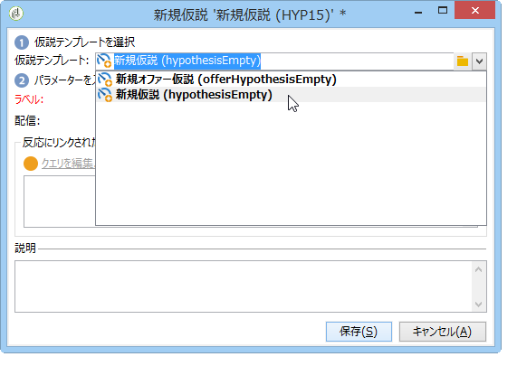

   選択したモデルで定義した仮説のコンテキストがウィンドウに表示されます。

   >[!NOTE]
   >
   >この段階で表示されていなくても、テンプレートで定義した設定はメモリに保存され、処理中の仮説に再度割り当てられます。

   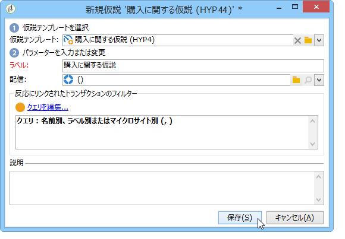

1. 仮説を作成する配信を選択します。

   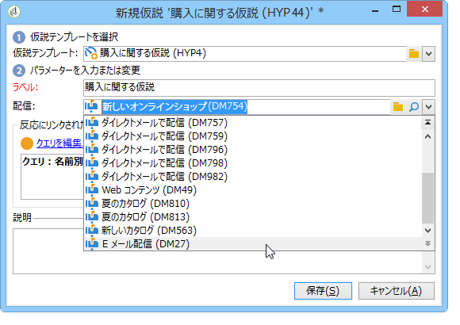

1. You can personalize your hypothesis by editing the **[!UICONTROL General]**, **[!UICONTROL Transactions]** and **[!UICONTROL Scope]** tabs. For more on this, refer to [Creating a hypothesis model](../../campaign/using/hypothesis-templates.md#creating-a-hypothesis-model).
1. Start the hypothesis by clicking **[!UICONTROL Start]**.

   ワークフローが自動的に作成され、測定が実行されます。名前は仮説の設定に基づいて自動的に定義されます。

   >[!CAUTION]
   >
   >You can access this if you have checked the **[!UICONTROL Keep execution workflow]** box.\
   >このオプションは、仮説の実行時にエラーが発生する場合のデバッグ目的でのみ有効にします。自動的に生成されたワークフローは、Adobe Campaignエクスプ **[!UICONTROL Administration]** ローラ **[!UICONTROL Production]** ーの> > > > **[!UICONTROL Objects created automatically]** > **[!UICONTROL Campaign workflows]** のフォルダーに保存されます。
   > 
   >また、自動的に生成されたワークフローは編集しないでください。変更を加えても、その後の計算で考慮されることはありません。
   >
   >このオプションを有効にしている場合は、実行後にワークフローを削除してください。

   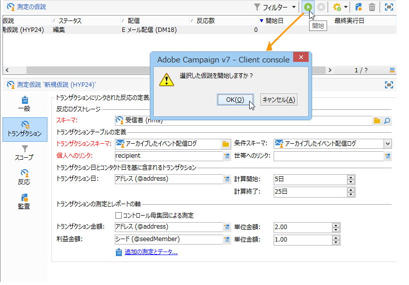

   計算が完了すると、測定指標が自動的に更新されます。

   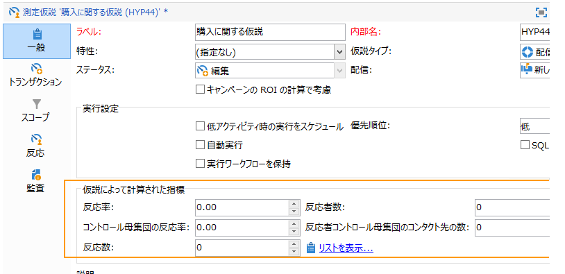

1. 必要に応じ、設定を変更して仮説を再度開始します。

## キャンペーン配信で仮説を参照する {#referencing-a-hypothesis-in-a-campaign-delivery}

キャンペーンの開始前に、マーケティングキャンペーンで仮説を参照できます。この場合、仮説は配信の送信後、仮説テンプレートで定義した実行設定に基づいて自動的に開始されます。配信で仮説を作成するには、次の手順に従います。

1. Depending on your needs, you can create one or more **[!UICONTROL Delivery]** type templates, as described in [Creating a hypothesis model](../../campaign/using/hypothesis-templates.md#creating-a-hypothesis-model)
1. マーケティングキャンペーンとターゲティングワークフローを作成します。
1. In the delivery window, click the **[!UICONTROL Delivery measurement]** icon.
1. 仮説テンプレートを選択します（モデルで定義したクエリが仮説ウィンドウに表示されます）。

   The hypothesis will be calculated automatically once the campaign is finished, based on the dates configured in the model (refer to [Hypothesis template execution settings](../../campaign/using/hypothesis-templates.md#hypothesis-template-execution-settings)).

   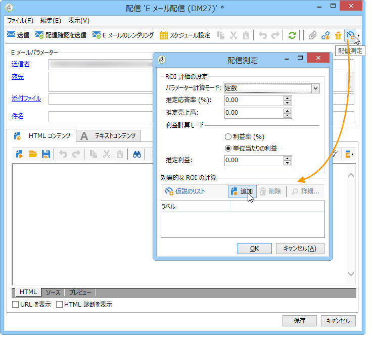

## キャンペーンの配信にデフォルトの仮説を追加する {#adding-a-default-hypothesis-to-deliveries-for-a-campaign}

仮説はキャンペーンレベルで直接参照することができます。この場合、仮説はキャンペーンで作成したすべての配信に自動的にリンクされます。手順は次のとおりです。

1. Go to the **[!UICONTROL Edit]** tab of the campaign.
1. In the measurement section, click the **[!UICONTROL Default hypotheses]** tab.

   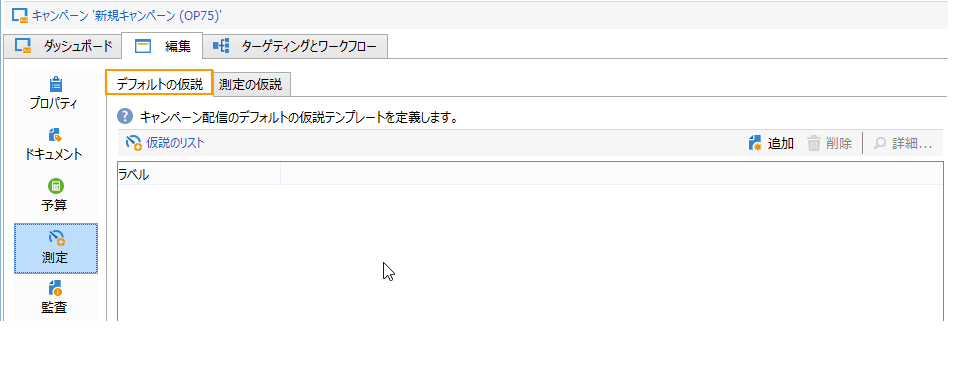

1. Click **[!UICONTROL Add]** and select a hypothesis template.

   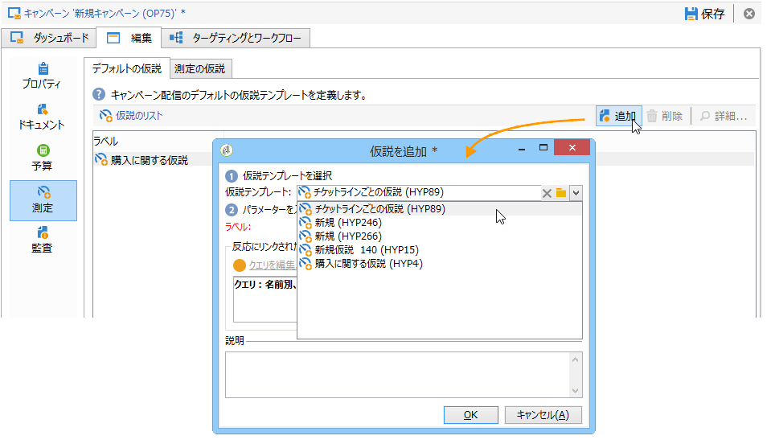

   キャンペーンの新しい配信それぞれで、このテンプレートに基づく仮説がデフォルトで参照されるようになります。

   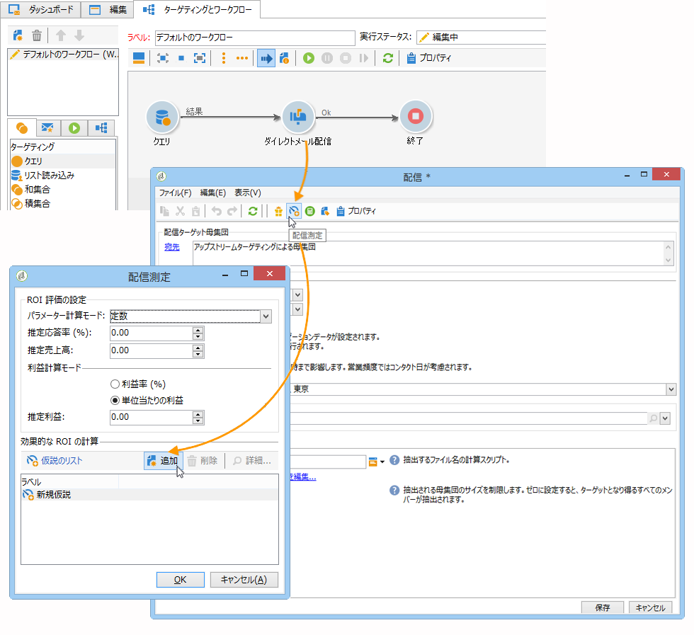

The hypothesis results can be viewed in the **[!UICONTROL General]** and **[!UICONTROL Reactions]** tabs of the hypothesis (refer to [Hypothesis tracking](../../campaign/using/hypothesis-tracking.md))

詳しくは、 [例：配信にリンクされた仮説を作成する](#example--creating-a-hypothesis-linked-to-a-delivery)。

## オファーの仮説の作成 {#creating-a-hypothesis-on-an-offer}

オファーの提案の仮説を作成する方法は、オンザフライ配信の仮説の場合と同様です。仮説を実行できるのは、オファーがアクティブな間です。計算期間は、オファーの提案の日付に基づきます。When the hypothesis lets you link a recipient to a purchase, the status of the offer proposition likely to be accepted can be changed automatically (for more on this, refer to [Transactions](../../campaign/using/hypothesis-templates.md#transactions)).

1. 仮説モデルの作成で説 **[!UICONTROL Offer]** 明されている1つ以上のタ [イプモデルを作成します](../../campaign/using/hypothesis-templates.md#creating-a-hypothesis-model)。
1. ノードに移動し **[!UICONTROL Campaign management > Measurement hypotheses]** ます。
1. Create an **[!UICONTROL Offers]** type hypothesis by selecting the model created previously.

   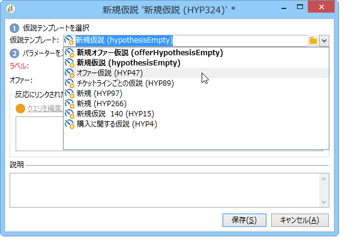

   モデルで作成されたクエリがウィンドウに表示されます。

   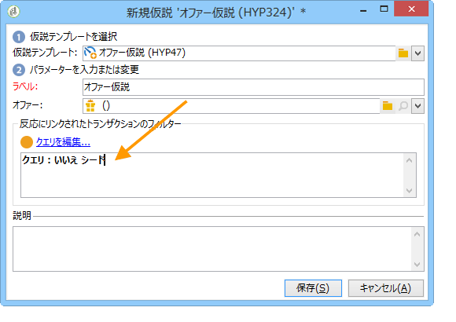

1. 仮説を作成するオファーを選択します。

   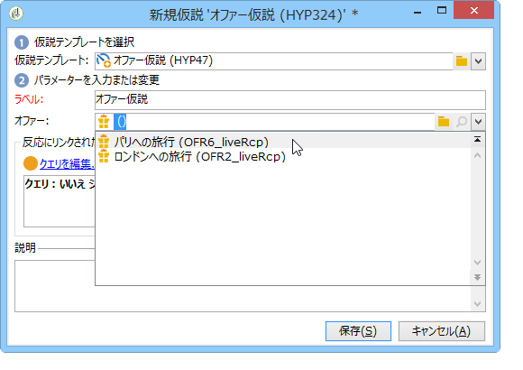

1. 必要に応じてクエリを調整します。
1. Click **[!UICONTROL Start]** to run the hypothesis.
1. 仮説の結果は、そのタブとタブで見るこ **[!UICONTROL General]** とがで **[!UICONTROL Reactions]** きる(仮説 [追跡を参照](../../campaign/using/hypothesis-tracking.md))。

   Hypotheses made on an offer are referenced in the **[!UICONTROL Measurement]** tab.

   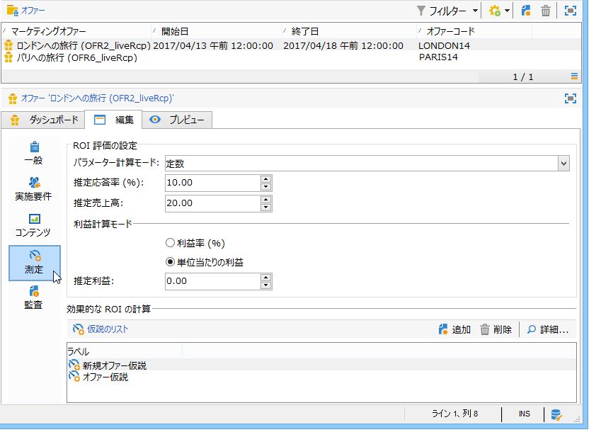

   If the **[!UICONTROL Update offer proposition status]** option was enabled in the hypothesis template, the status of the offer proposition is changed automatically, thereby providing feedback on the impact of the campaign (for more on this, refer to [Transactions](../../campaign/using/hypothesis-templates.md#transactions)).

## 例：配信にリンクした仮説の作成 {#example--creating-a-hypothesis-linked-to-a-delivery}

この例では、配信にリンクした仮説を作成します。この仮説は、前に作成したモデルに基づいていま [す(例：配信での仮説テンプレートの作成](../../campaign/using/hypothesis-templates.md#example--creating-a-hypothesis-template-on-a-delivery))。 モデルから継承されたクエリを編集し、購入テーブルの特定の品についての仮説を作成します。

1. Create a campaign and a delivery (For more on this, refer to [Creating a campaign](../../campaign/using/setting-up-marketing-campaigns.md#creating-a-campaign)).

   この例では、ダイレクトメールタイプの配信を使用します。

1. シードアドレスを設定します。前に作成した仮説テンプレートは、反応の結果にコントロール母集団を考慮に入れるよう設定されています。

   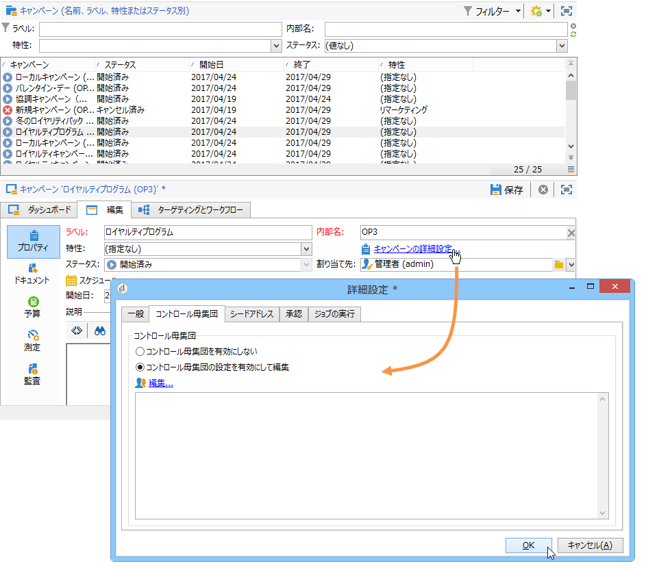

   >[!NOTE]
   >
   >詳細は、「コントロールグループ [の定義」を参照してください](../../campaign/using/marketing-campaign-deliveries.md#defining-a-control-group)。

1. を開き、ア **[!UICONTROL Direct mail delivery]** イコンをクリ **[!UICONTROL Delivery measurement]** ックして、をクリックしま **[!UICONTROL Add]**&#x200B;す。

   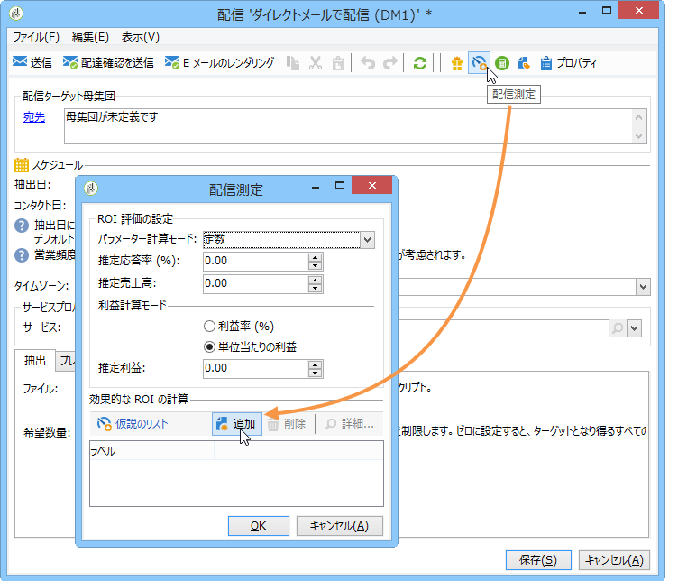

1. ドロップダウンリストから、前に作成した仮説テンプレートを選択します。

   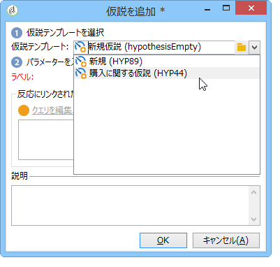

   モデルで作成されたクエリが表示されます。

   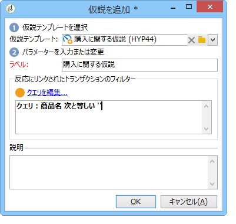

1. Click **[!UICONTROL Edit query...]** and refine the query by entering the product that the hypothesis will concern.

   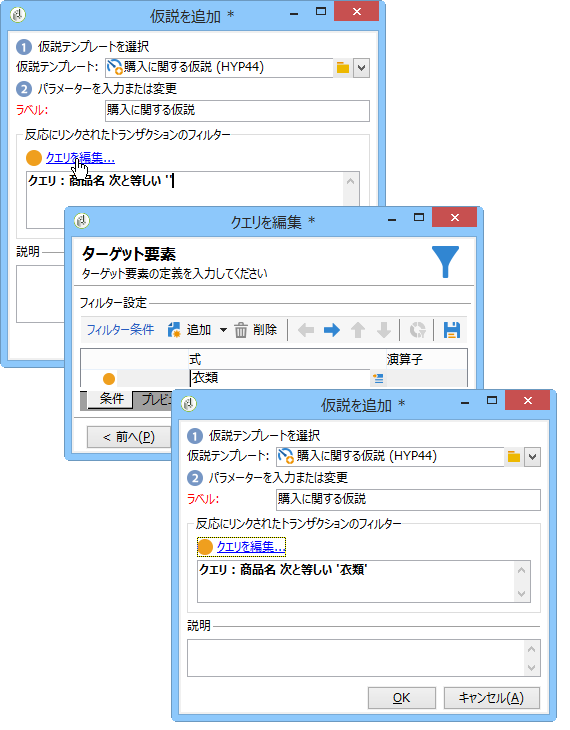

   You can check that the hypothesis is linked to the delivery in the **[!UICONTROL Edit]** > **[!UICONTROL Measurement]** tab of the campaign.

   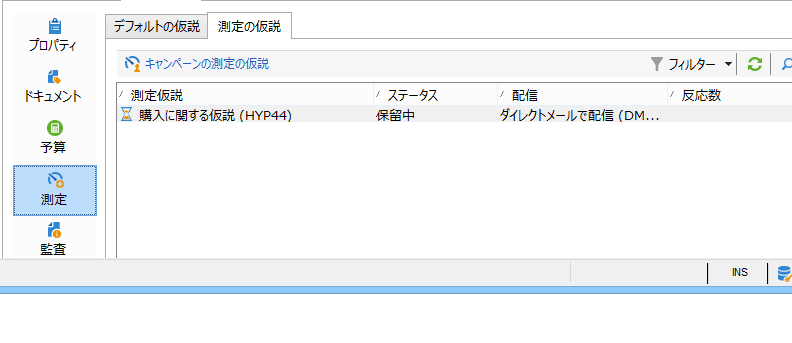

1. Launch your targeting workflow and run the necessary checks until the campaign is finished (for more on this, refer to [Starting a delivery](../../campaign/using/marketing-campaign-deliveries.md#starting-a-delivery)).

   

1. In the Adobe Campaign tree, go to the **[!UICONTROL Campaign management > Measurement hypotheses]** node to check the indicators calculated by the hypothesis.

   

