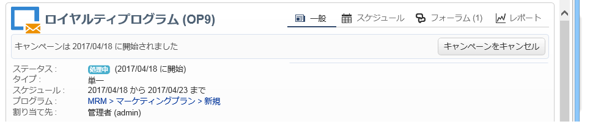
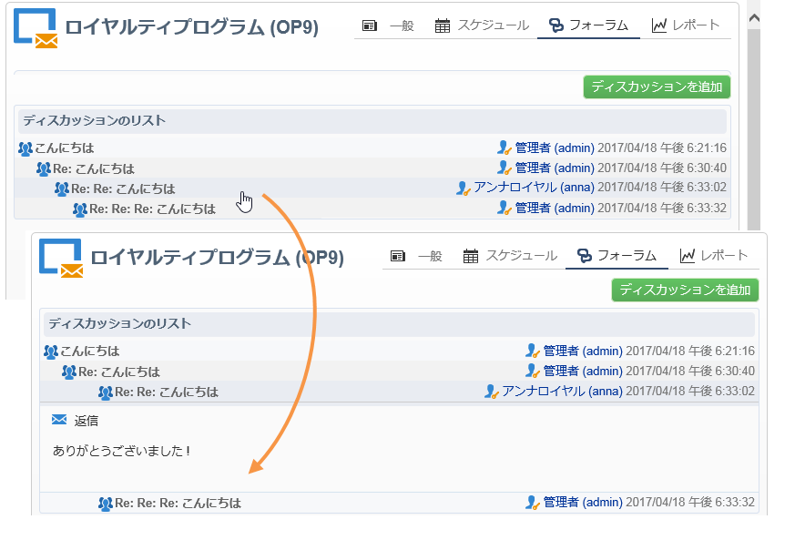
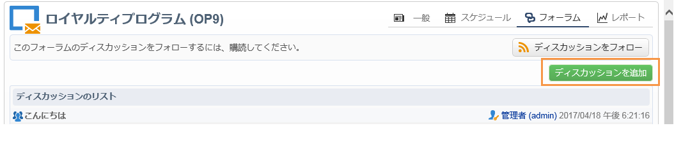
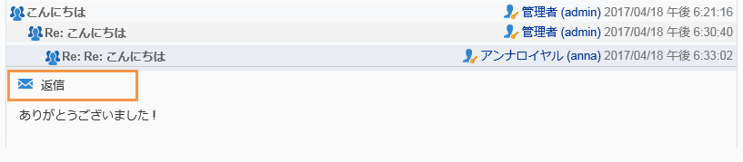
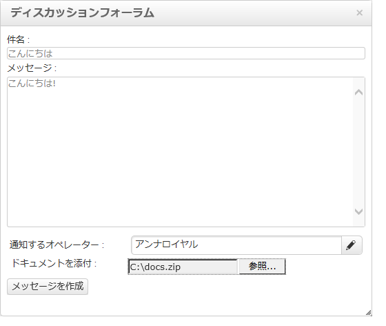
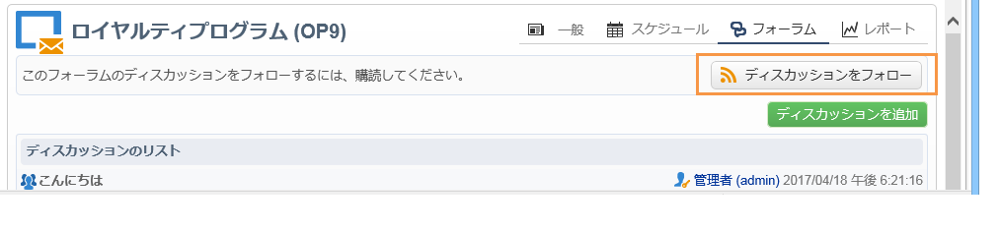
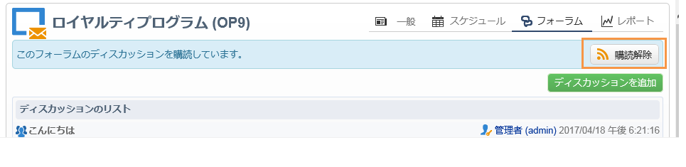
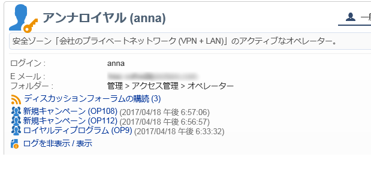
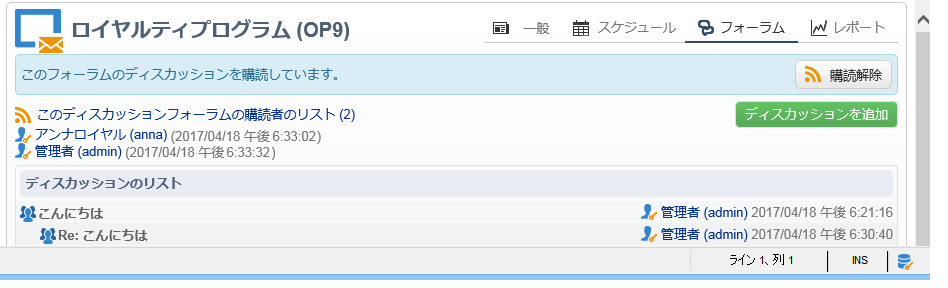

# ディスカッションフォーラム{#discussion-forums}

Adobe Campaign のオペレーターは、ディスカッションフォーラムを使用して情報を共有できます。プラン、プログラム、キャンペーン、リソース、シミュレーション、在庫の各要素には、それぞれ独自のディスカッションフォーラムがあります。各オペレーターにも個人用のフォーラムがあります。個人用フォーラムも含め、すべてのディスカッションは公開されています。

フォーラムに購読登録すると、メッセージが投稿されるたびに通知 E メールを受信できます。

## フォーラムへのアクセス {#accessing-a-forum}

To visit the forum of a campaign, an operator, etc., go to its dashboard and click the **[!UICONTROL Forum]** link in the top right-hand corner. このリンクにはフォーラムのメッセージの総数も表示されます。

## フォーラムの使用 {#using-a-forum}

メッセージとメッセージへの回答は、時間順（新しい順）に表示されます。

メッセージのコンテンツを表示するには、ヘッダーをクリックします。

**新しいディスカッションを開始する**

To start a new discussion, click the **[!UICONTROL Add a discussion]** button in the top right-hand corner. 箱が **[!UICONTROL Discussion forum]** 上がる（下記を参照）。

**既存のディスカッションにメッセージを投稿する**

To post a message to an existing discussion, open the message that you want to answer, then click the **[!UICONTROL Reply]** link in the top left-hand corner. 箱が **[!UICONTROL Discussion forum]** 上がる（下記を参照）。

メッセージに返信すると、元のメッセージの投稿者に通知が届きます。

**メッセージを送信する**

ボックス内 **[!UICONTROL Discussion forum]** で、

1. Enter your text in the **[!UICONTROL Message]** field and a discussion title in the **[!UICONTROL Subject]** field.

   

1. 必要に応じて以下を実行します。

   * If you want someone to take part in the discussion who isn&#39;t subscribed to the forum, use the **[!UICONTROL Operator to notify]** field. このメッセージに関する通知 E メールがオペレーターに送信されます（オペレーターがフォーラムに登録されることはありません）。複数のオペレーターに通知を送信する場合は、オペレーターのグループを選択します。
   * To add an attachment to the message, click **[!UICONTROL Browse]**. 添付ファイルは通知 E メールにも添付されます。添付ファイルは個別に送信することしかできません。複数のファイルを送信するには、zip ファイルにまとめる必要があります。

1. をクリ **[!UICONTROL Create the message]** ックして、フォーラムに投稿します。

>[!NOTE]
>
>一度フォーラムに投稿すると、メッセージの変更や削除はできません。

## オペレーターの個人用フォーラムへの投稿 {#posting-to-the-personal-forum-of-an-operator}

オペレーターのフォーラムへのメッセージの投稿は、例えば、特定のキャンペーンに関係するメッセージを投稿しなくても、Adobe Campaign での会話を把握したい場合に便利です。個人用フォーラムは公開されているので、投稿するメッセージはすべてのオペレーターに表示されます。個人用フォーラムに投稿があるたびに、そのオペレーターにメッセージが届きます。

オペレーターのフォーラムにアクセスするには、以下を実行します。

* If you have the necessary rights to access the **[!UICONTROL Administration > Access management > Operators]** node of the explorer, open the dashboard of the desired operator and click the **[!UICONTROL Forum]** link in the top right-hand corner.
* アクセス権がない場合は、Adobe Campaign でオペレーターの名前を見つけます（そのオペレーターがフォーラムに投稿したメッセージやそのオペレーターに割り当てられたタスクを使用）。名前をクリックすると、そのオペレーターのダッシュボードにアクセスできます。オペレーターのフォルダーのビューを作成するよう管理者に依頼することもできます。

## フォーラムの購読 {#subscribing-to-a-forum}

フォーラムを購読すると、ディスカッションをフォローできます。フォーラムにメッセージが投稿されるたびに、E メール通知が届きます。この E メールには、メッセージの本文と添付ファイルが含まれます。メッセージに回答するには、E メールの本文をクリックし、Adobe Campaign の Web インターフェイスにログインします。フォーラムに購読登録すると、この情報はすべてのオペレーターに表示されます。

* To subscribe to a forum, click the **[!UICONTROL Follow discussions]** button in the top right hand section above the list of messages.

   

   フォーラムに購読登録すると、セクションが青になります。

* To unsubscribe from a forum, click the **[!UICONTROL Unsubscribe]** button.

   

* 個人用ダッシュボードに、購読済みのフォーラムのリストが表示されます。Click the **[!UICONTROL Subscription to discussion forums]** link to display the list, then click the item that interests you to access its forum.

   

   個人用ダッシュボードについて詳しくは、[この節](../../platform/using/access-management.md#operators)を参照してください。

* フォーラムの登録者を確認するには、メッセージのリストの **[!UICONTROL List of subscribers to this discussion forum]** 上にあるリンクをクリックします。

   

## 通知配信の確認 {#checking-notification-delivery}

フォーラムを購読しているにも関わらず、オペレーターに通知が届かない場合は、以下の手順を実行します。

* オペレーターのプロファイルに E メールアドレスが入力されていることを確認します。
* ノードに移動し、 **[!UICONTROL Administration > Production > Technical workflows > Campaign processes]** ワークフローが開始され、エ **[!UICONTROL Jobs in discussion forums]** ラーがないことを確認します。
* 配信ログを表示します。

   * Adobe Campaignのホームページでに移動し、 **[!UICONTROL Campaigns > Navigation > Deliveries]**&#x200B;配信を開き **[!UICONTROL Discussion forum notification]** ます。
   * エクスプローラで、に移動し、 **[!UICONTROL Administration > Production > Objects created automatically > Technical deliveries > Workflow notifications]**&#x200B;をクリックしま **[!UICONTROL Discussion forum notifications]**&#x200B;す。
   ボックス **[!UICONTROL Discussion forum notifications]** 内の配信ログはタブにあり **[!UICONTROL Edit > Delivery]** ます。 また、とのタブも表 **[!UICONTROL Tracking > Log]** 示でき **[!UICONTROL Exclusion causes]** ます。

