# 例{#examples}

## Creating a local campaign (by form) {#creating-a-local-campaign--by-form-}

**フォーム**&#x200B;タイプの Web インターフェイスを使用するには、**Web アプリケーション**&#x200B;が必要です。設定により、Web アプリケーションには、様々なタイプの定義済みのパーソナライゼーション要素を含めることができます。例えば、専用の API を使用して、ターゲット、予算、コンテンツなどを評価するリンクを含めることができます。

>[!NOTE]
>
>詳しくは、API のドキュメントを参照してください。参照できるドキュメントは、契約によって異なります。[API](../../configuration/using/about-web-services.md) を参照してください。
>
>この例で使用する Web アプリケーションは、Adobe Campaign に付属している Web アプリケーションではありません。キャンペーンでフォームを使用するには、専用の Web アプリケーションを構築する必要があります。

When creating the campaign template, click the **[!UICONTROL Zoom]** icon within the **[!UICONTROL Web interface]** option of the **[!UICONTROL Advanced campaign settings...]** link to access details of the Web application.

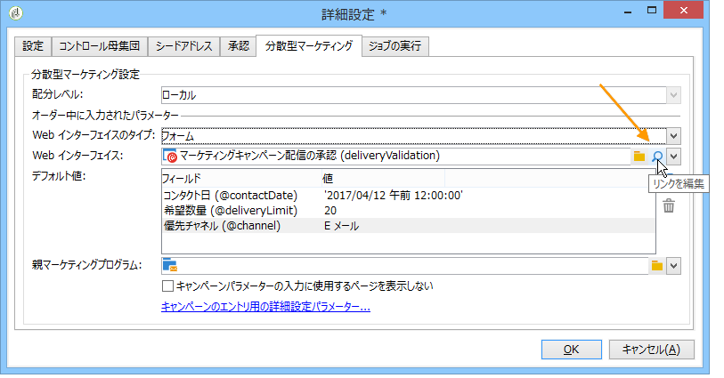

>[!NOTE]
>
>Web アプリケーションのパラメーターは、キャンペーンのテンプレートでのみ使用できます。

In the **[!UICONTROL Edit]** tab, select the **Campaign order** activity and open it to access its content.

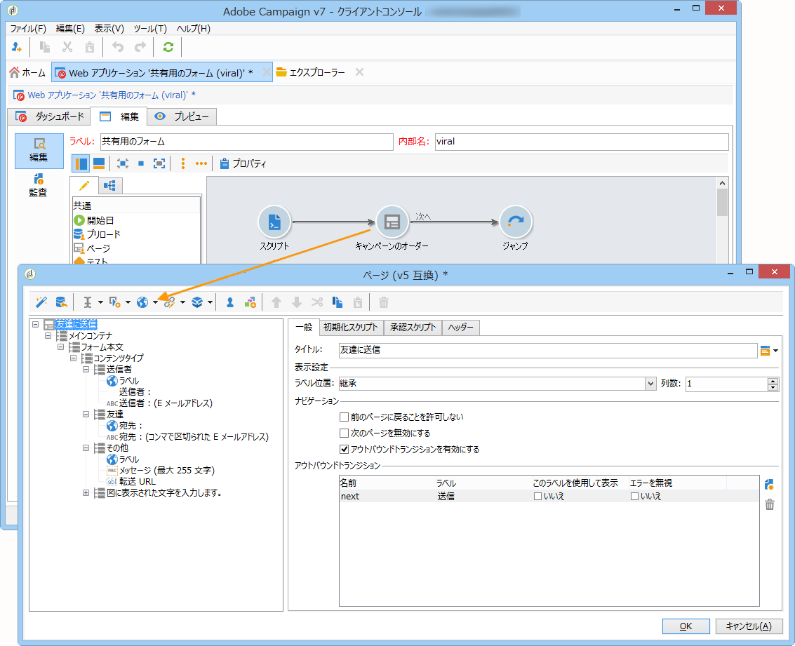

この例では、**キャンペーンのオーダー**&#x200B;アクティビティに以下の内容が含まれています。

* オーダー時にローカルエンティティによって入力されるフィールド

   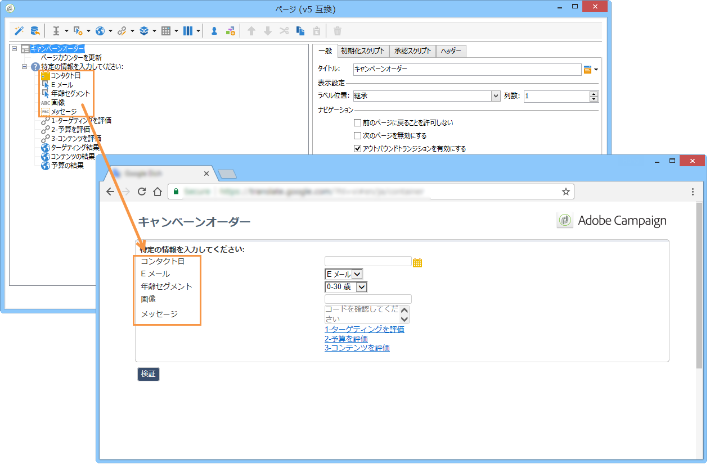

* ローカルエンティティがキャンペーン（ターゲット、予算、コンテンツなど）を評価するためのリンク

   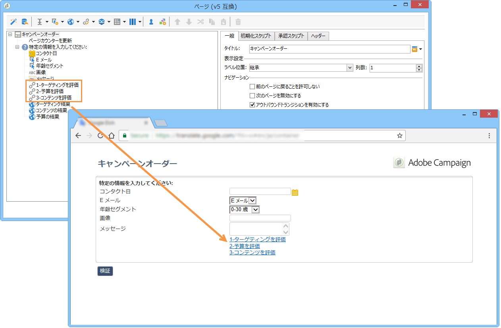

* 評価の結果を計算および表示するスクリプト

   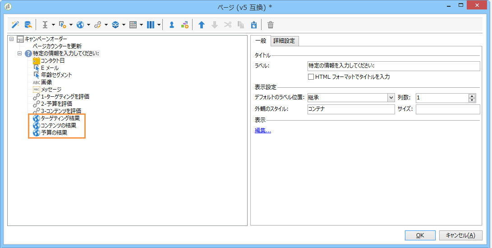

この例では、次の API が使用されています。

* ターゲットの評価：

   ```
   var res = nms.localOrder.EvaluateTarget(ctx.localOrder);
   ```

* 予算の評価：

   ```
   var res = nms.localOrder.EvaluateDeliveryBudget(ctx.@deliveryId, NL.XTK.parseNumber(ctx.@compt));
   ```

* コンテンツの評価：

   ```
   var res = nms.localOrder.EvaluateContent(ctx.localOrder, ctx.@deliveryId, "html", resSeed.@id);
   ```

## Creating a collaborative campaign (by target approval) {#creating-a-collaborative-campaign--by-target-approval-}

### はじめに {#introduction}

あなたは、オンラインストアのほか米国各地にブティックを展開する大手衣料品ブランドのマーケティングマネージャーです。春のスペシャルオファーとして、カタログに記載されているすべての衣料品をお得意様に 50％オフで提供することを計画しています。

このオファーの対象は、国内の店舗の上顧客、つまり今年に入って既に 3 万円以上の買い物をしている顧客です。

このオファーの提供にあたり、分散型マーケティングを活用して、協調キャンペーン（ターゲットの承認）を作成することにします。この協調キャンペーンでは、店舗の上顧客（地域別にグループ化）を選択して、スペシャルオファーを含む E メールを配信します。

この例の前半では、キャンペーンの作成通知を受け取ったローカルエンティティがどのようにキャンペーンを評価し、オーダーできるかについて説明します。

後半では、キャンペーンの作成方法について説明します。

手順は、以下のとおりです。

**ローカルエンティティ**

1. キャンペーンの作成通知を使用して、セントラルエンティティによって選択された連絡先のリストにアクセスします。
1. 連絡先を選択し、参加を承認します。

**セントラルエンティティ**

1. アクティビティを作 **[!UICONTROL Data distribution]** 成します。
1. 協調キャンペーンを作成します。
1. キャンペーンをパブリッシュします。

### ローカルエンティティの手順 {#local-entity-side}

1. キャンペーンの参加者として指定されているローカルエンティティに、E メールの通知が送信されます。

   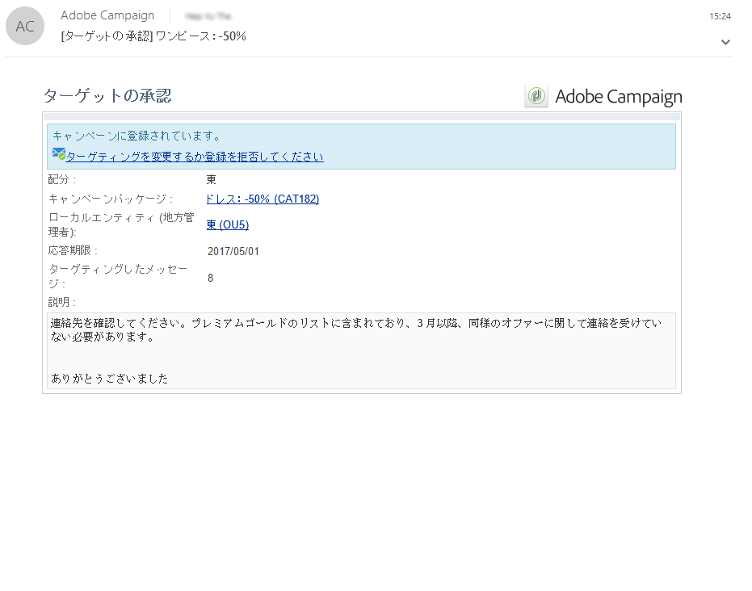

1. By clicking the **[!UICONTROL Access your contact list and approve targeting]** link, the local entity is given access (via Web browser) to the list of clients selected for the campaign.

   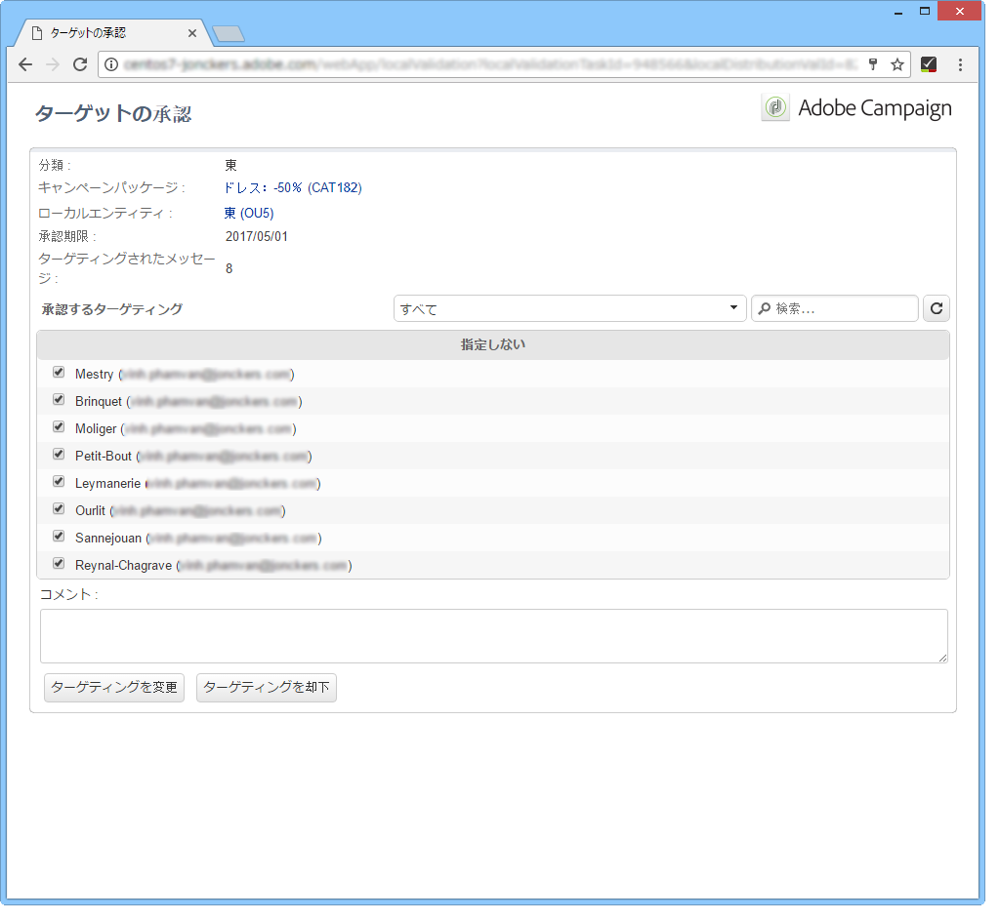

1. ローカルエンティティは、今年の 1 月以降に類似したオファーを既に提供している連絡先のチェックを外して、リストから除きます。

   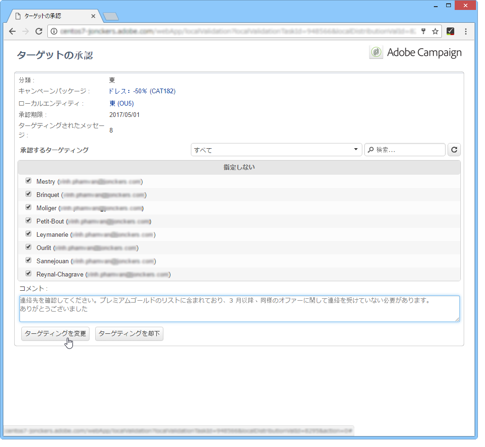

連絡先の確認が終了すると、キャンペーンは自動的に開始されます。

### セントラルエンティティの手順 {#central-entity-side}

#### データ配分アクティビティの作成 {#creating-a-data-distribution-activity}

1. To set up a collaborative campaign (by target approval) you must first create a **[!UICONTROL Data distribution activity]**. ノード内のア **[!UICONTROL New]** イコンをクリック **[!UICONTROL Resources > Campaign management > Data distribution]** します。

   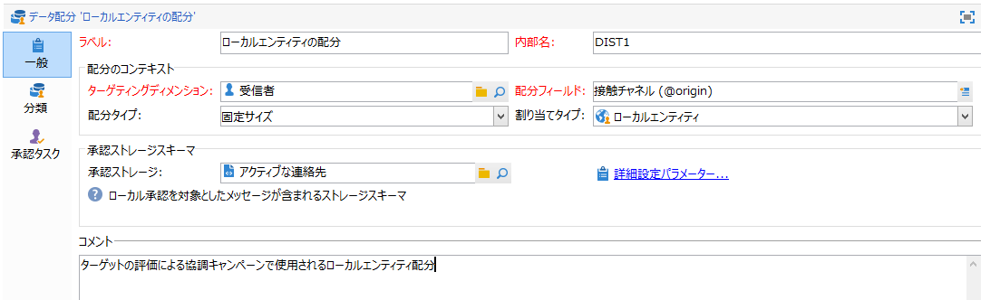

1. In the **[!UICONTROL General]** tab, you must specify:

   * the **[!UICONTROL Targeting dimension]**. **受信者**&#x200B;に対して、**データ配分**&#x200B;が実行されます。
   * the **[!UICONTROL Distribution type]**. 「**固定サイズ**」または「**サイズ（割合）**」を選択できます。
   * the **[!UICONTROL Assignment type]**. 「**ローカルエンティティ**」オプションを選択します。
   * the **[!UICONTROL Distribution type]**. Here, it is the **[!UICONTROL Origin (@origin)]** field present in the Recipient table that lets you identify the relationship between the contact and the local entity.
   * フィー **[!UICONTROL Approval storage]** ルド。 「**受信者のローカル承認**」オプションを選択します。

1. In the **[!UICONTROL Breakdown]** tab, specify:

   * the **[!UICONTROL Distribution field value]**, which corresponds to the local entities involved in the upcoming campaign.
   * the local entity **[!UICONTROL label]**.
   * the **[!UICONTROL Size]** (fixed or as a percentage). **デフォルト値の 0** を指定すると、ローカルエンティティにリンクされているすべての受信者が選択されます。
   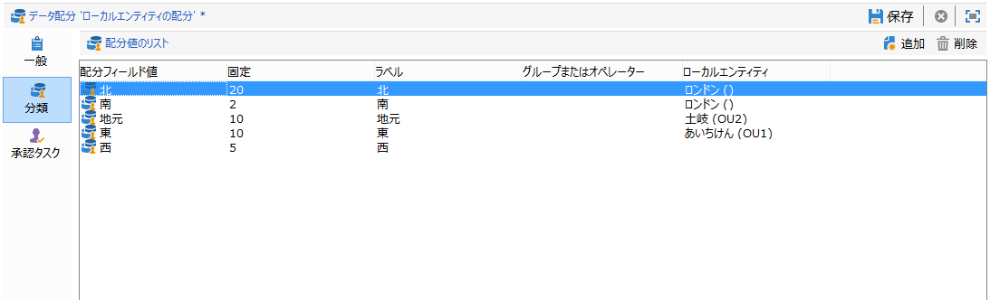

1. 新しいデータ配分を保存します。

#### 協調キャンペーンの作成 {#creating-a-collaborative-campaign}

1. ノードか **[!UICONTROL Campaign management > Campaign]** ら、新しいを作成しま **[!UICONTROL collaborative campaign (by target approval)]**&#x200B;す。
1. タブで、キ **[!UICONTROL Targeting and workflows]** ャンペーンのワークフローを作成します。 これには、アクティビティによ **って定義される** Splitアクティビティ **[!UICONTROL Record count limitation]** が含まれている必要が **[!UICONTROL Data distribution]** あります。

   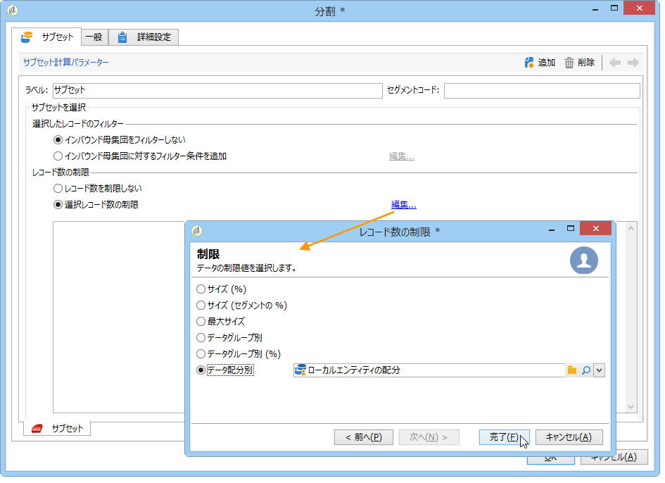

1. Add a **[!UICONTROL Local approval]** action where you can specify:

   * 通知としてローカルエンティティに送信するメッセージの内容
   * 承認のリマインダー
   * 想定されるキャンペーンの処理.
   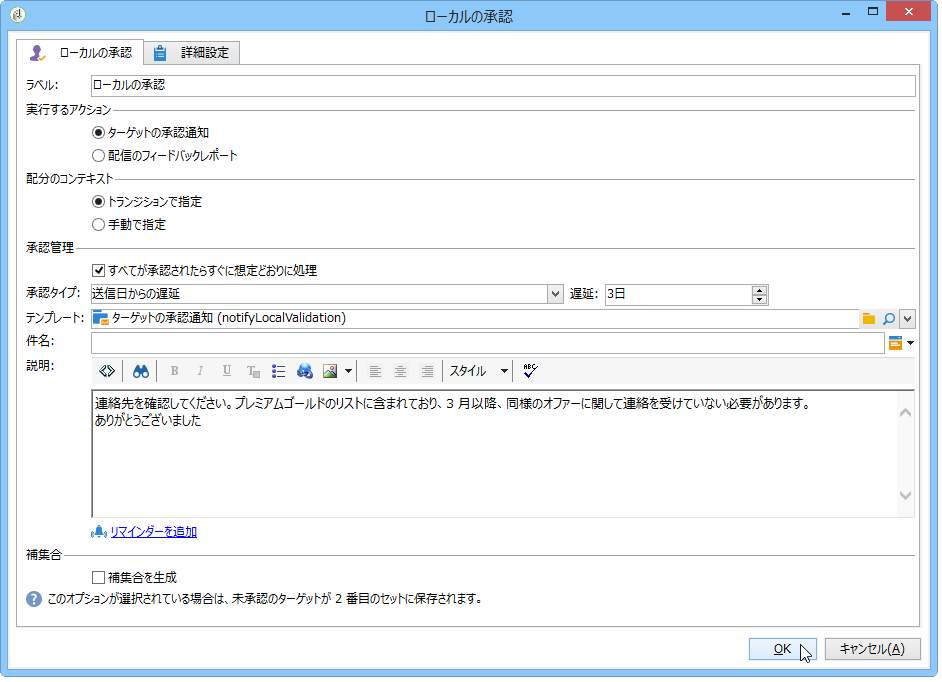

1. レコードを保存します。

#### キャンペーンのパブリッシュ {#publishing-the-campaign}

**キャンペーン**&#x200B;ウィンドウから&#x200B;**キャンペーンパッケージ**&#x200B;を追加します。

1. 選択しま **[!UICONTROL Reference campaign]**&#x200B;す。 In the **[!UICONTROL Edit]** tab of your package, you can select the **[!UICONTROL Approval mode]** to use for your campaign:

   * **手動**&#x200B;モード：ローカルエンティティは、セントラルエンティティの招待を受け入れて、キャンペーンに参加します。ローカルエンティティは必要に応じて、あらかじめ選択されている連絡先を削除できます。キャンペーンへの参加を確定するには、マネージャーの承認が必要です。
   * **自動**&#x200B;モード：ローカルエンティティは、自分で登録を解除しない限り、キャンペーンに参加することが求められます。ローカルエンティティは、承認を受けずに連絡先を削除することができます。
   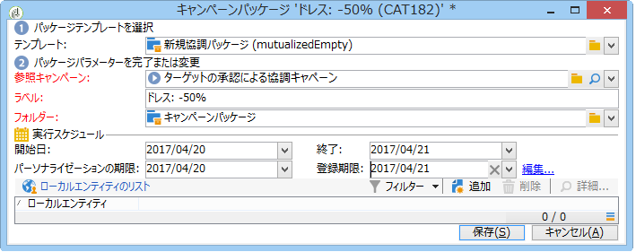

1. In the **[!UICONTROL Description]** tab, you can add a description for your campaign as well as any documents to be sent to the local entities.

   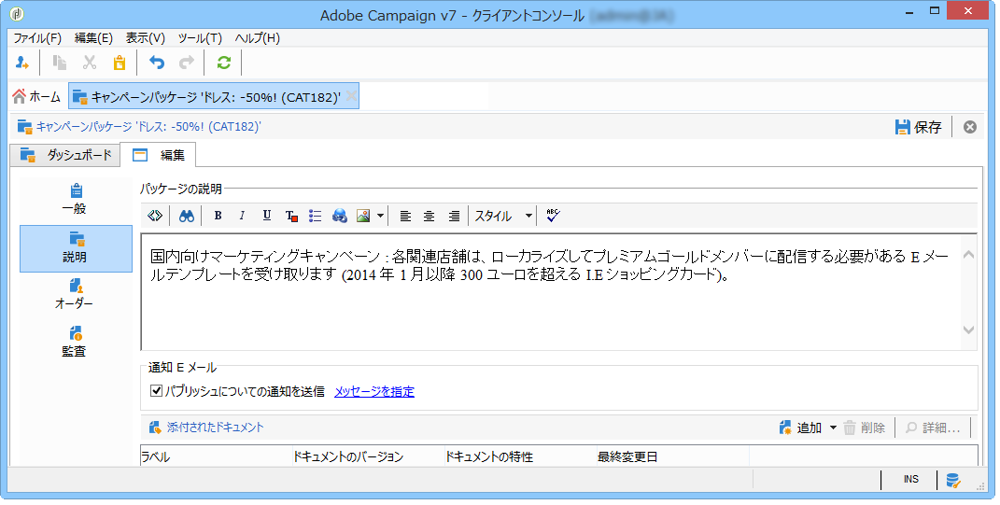

1. キャンペーンパッケージを承認します。ワークフローを開始して、パッケージをパブリッシュし、パッケージのリストですべてのローカルエンティティが使用できるようにします。

   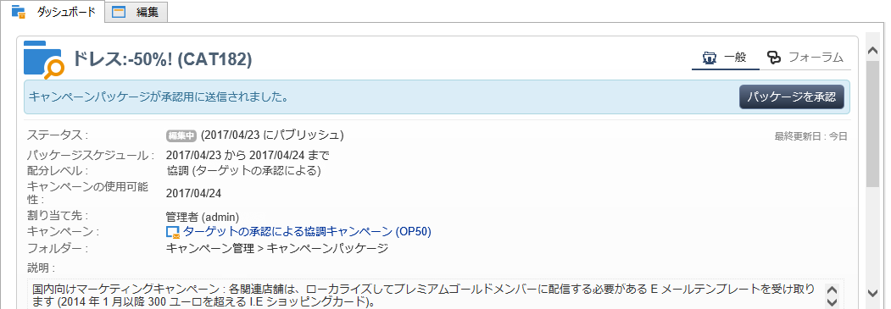

## Creating a collaborative campaign (by form) {#creating-a-collaborative-campaign--by-form-}

### はじめに {#introduction-1}

あなたは、オンラインストアのほか米国各地に店舗を展開する大手化粧品ブランドのマーケティングマネージャーです。冬用の商品在庫を一掃して新しい商品を入荷するために、2 つの顧客グループをターゲットとするスペシャルオファーを計画しています。1 つは 30 代以上のグループで、年齢を意識したスキンケア商品を勧めます。もう 1 つは 30 代以下のグループで、基本的なスキンケア商品を勧めます。

このオファーの提供にあたり、分散型マーケティングを活用して、協調キャンペーン（フォーム）を作成することにします。この協調キャンペーンでは、年齢の範囲に基づいて複数の店舗の顧客を選択します。顧客には、年齢に応じてパーソナライズされたスペシャルオファーを含む E メールが配信されます。

この例の前半では、キャンペーンの作成通知を受け取ったローカルエンティティがどのようにキャンペーンを評価し、オーダーできるかについて説明します。

後半では、キャンペーンの作成方法について説明します。

手順は、以下のとおりです。

**ローカルエンティティ**

1. キャンペーンの作成通知を使用して、オンラインフォームにアクセスします。
1. キャンペーン（ターゲット、コンテンツ、配信のボリューム）をパーソナライズします。
1. これらのフィールドを確認し、必要に応じて変更します。
1. 参加を承認します。
1. ローカルエンティティ（またはセントラルエンティティ）のマネージャーが、設定と参加を承認します。

**セントラルエンティティ**

1. 協調キャンペーンを作成します。
1. ローカルキ **[!UICONTROL Advanced campaign settings...]** ャンペーンの場合と同様にを設定します。
1. ローカルキャンペーンと同様に、キャンペーンワークフローと配信を設定します。
1. Web フォームを更新します。
1. キャンペーンパッケージを作成し、パブリッシュします。

### ローカルエンティティの手順 {#local-entity-side-1}

1. キャンペーンの参加者として選択されているローカルエンティティに、キャンペーンへの参加を通知する E メールが送信されます。

   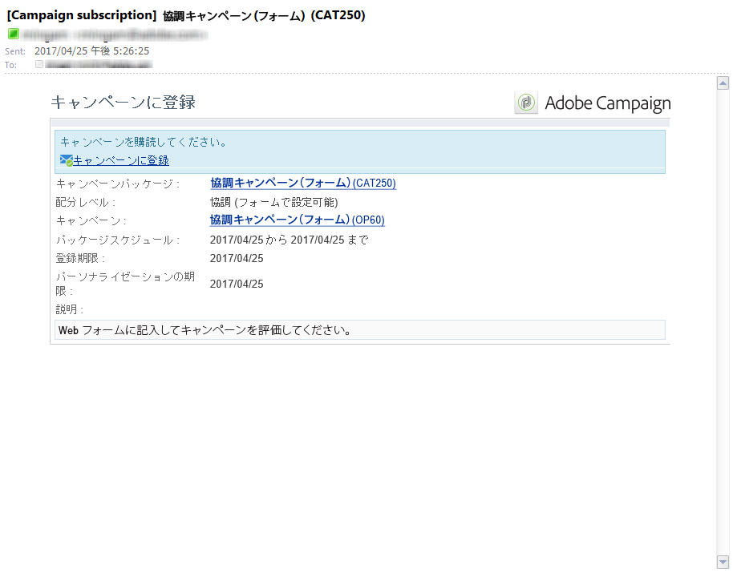

1. ローカルエンティティは、パーソナライゼーションのフォームを完成させ、次の操作を実行します。

   * ターゲットと予算を評価します。
   * 配信コンテンツをプレビューします。
   * 参加を承認します。

      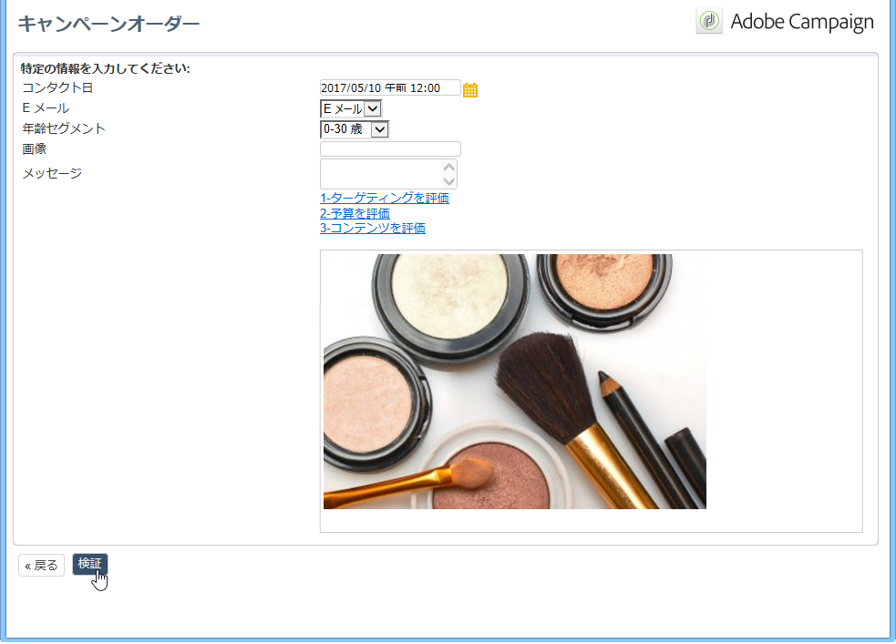

1. オーダーの検証を担当するオペレーターが、参加を承認します。

   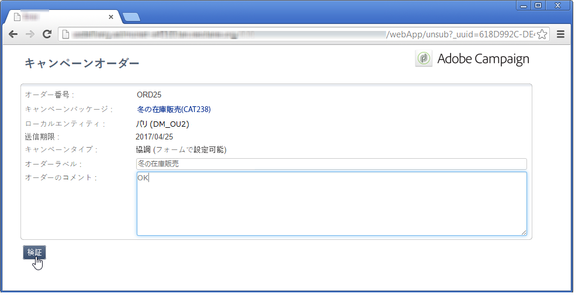

### セントラルエンティティの手順 {#central-entity-side-1}

1. 協調キャンペーン（フォーム）を実装するには、**協調キャンペーン（フォーム）**&#x200B;テンプレートを使用して、キャンペーンを作成する必要があります。

   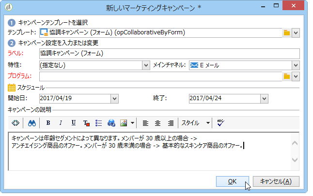

1. In the campaign&#39;s **[!UICONTROL Edit]** tab, click the **[!UICONTROL Advanced campaign settings...]** link to configure it as a local campaign. 詳しくは、「ロ [ーカルキャンペーンの作成（フォーム別）」を参照してくださ](#creating-a-local-campaign--by-form-)い。

   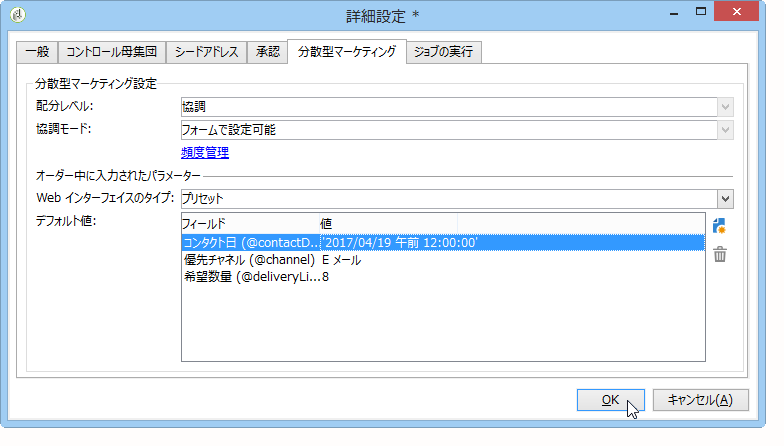

1. キャンペーンワークフローと Web フォームを設定します。詳しくは、「ロ [ーカルキャンペーンの作成（フォーム別）」を参照してくださ](#creating-a-local-campaign--by-form-)い。
1. 実行スケジュールおよび参加するローカルエンティティを指定して、キャンペーンパッケージを作成します。

   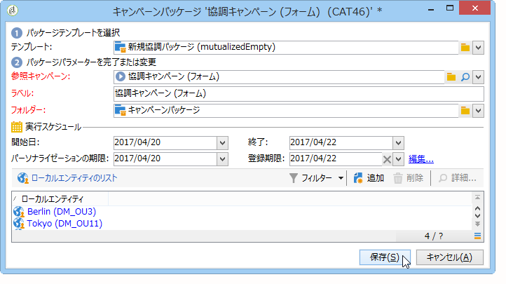

1. Finalize the package configuration by selecting the approval mode in the **[!UICONTROL Edit]** tab.

   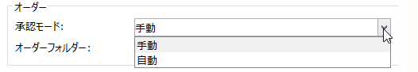

1. From the **[!UICONTROL Description]** tab, you can enter a campaign package description, a notification message to be sent to local entities when the package is published, and attach any informative documents to your campaign package.

   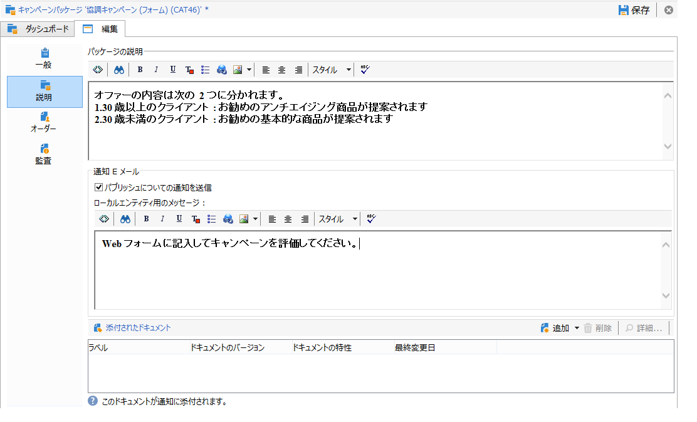

1. パッケージを承認し、パブリッシュします。

   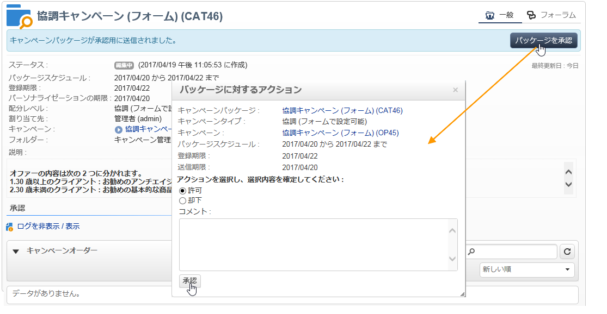

