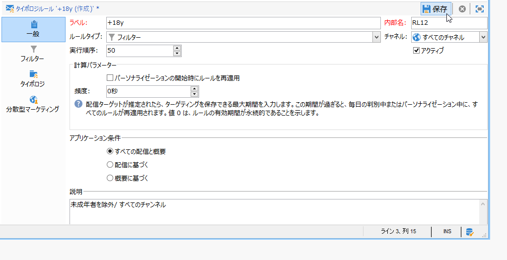
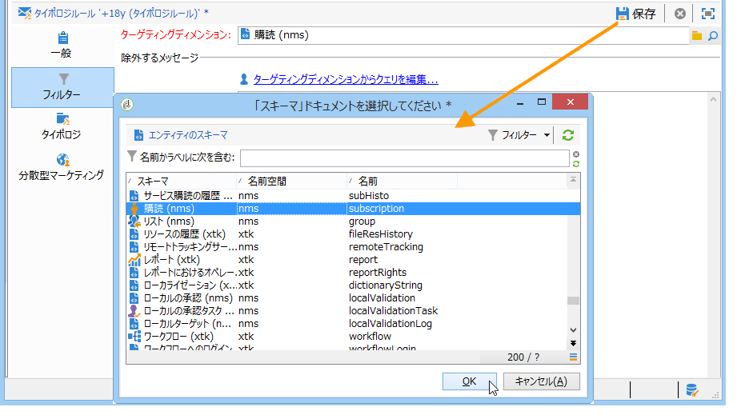
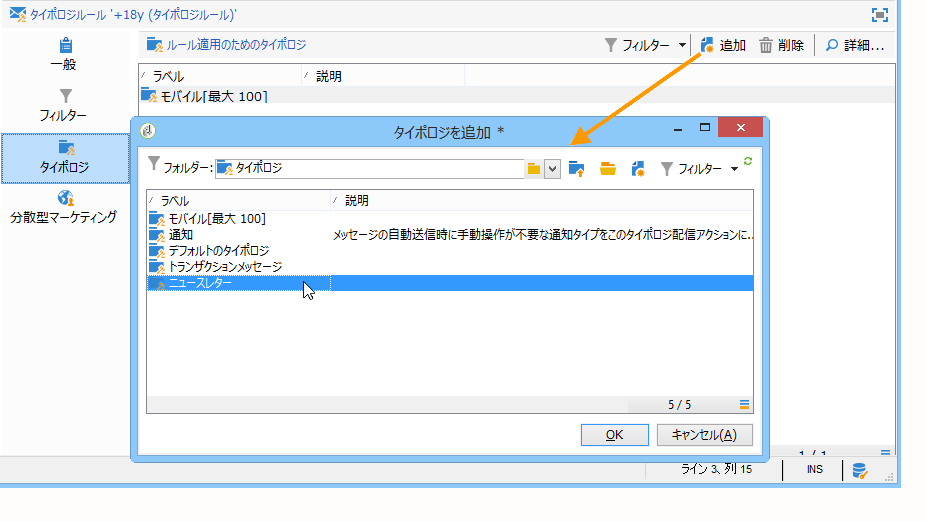
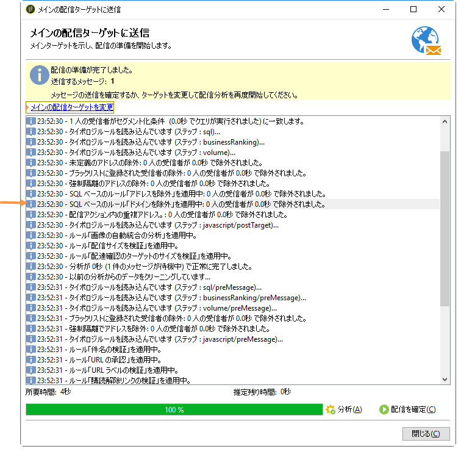
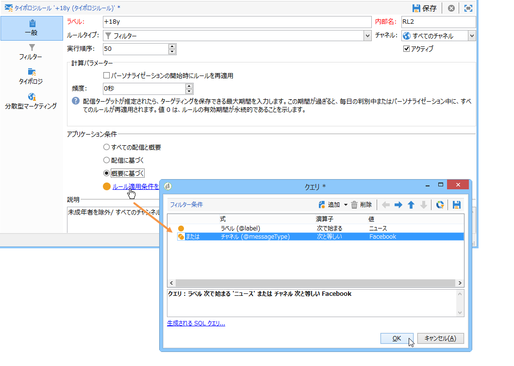
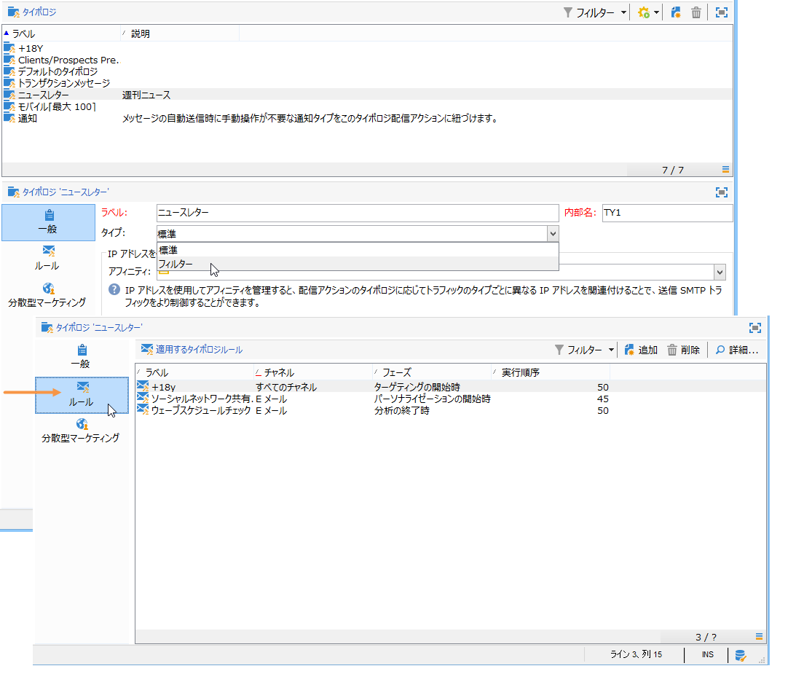
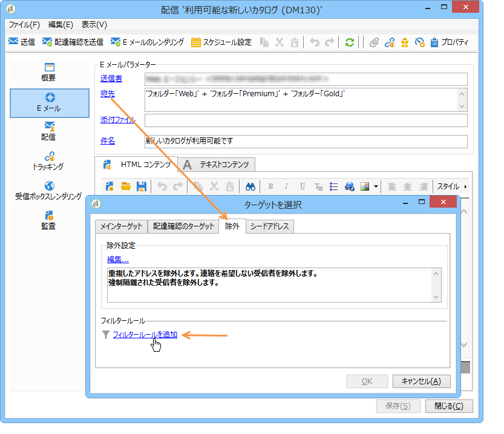
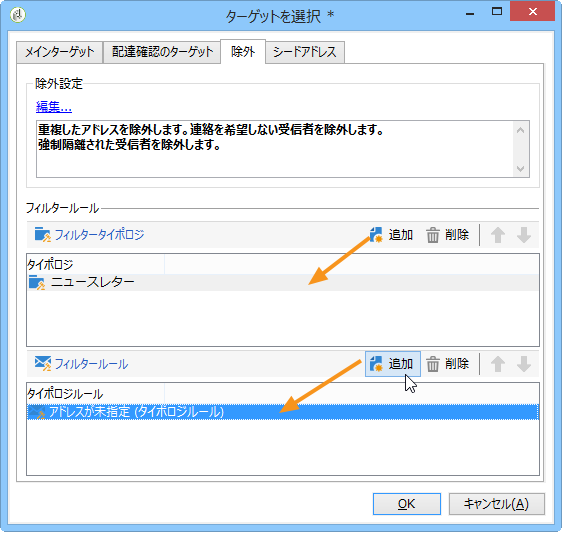

# フィルタールール{#filtering-rules}

フィルタールールを使用すると、クエリで指定する条件に従って、除外するメッセージを定義できます。これらのルールは、ターゲティングディメンションにリンクされます。

フィルタールールは、他のタイプのタイポロジルール（コントロール、頻度など）にリンクできます。または、**フィルター**&#x200B;タイポロジのみで構成されるグループを作成することもできます。詳しくは、「フィルタリングタイポロジ [の作成と使用」を参照してください](#creating-and-using-a-filtering-typology)。

## フィルタールールの作成 {#creating-a-filtering-rule}

例えば、ニュースレターの購読者をフィルタリングして、未成年の受信者にメッセージを送信しないようにすることができます。

このフィルターを定義するには、次の手順に従います。

1. Create a **[!UICONTROL Filtering]** typology rule applicable to all communication channels.

   

1. デフォルトのターゲティングディメンションを変更し、購読（**nms:subscription**）を選択します。

   

1. リンクを使用してフィルターを作 **[!UICONTROL Edit the query from the targeting dimension...]** 成します。

   

1. このルールをキャンペーンタイポロジにリンクし、保存します。

   

配信でこのルールを使用すると、未成年の購読者は自動的に除外されます。ルールが適用されたことを示すメッセージが表示されます。

## フィルタールールの調整 {#conditioning-a-filtering-rule}

リンクされている配信や配信の概要に基づいて、フィルタールールを適用する範囲を制限することができます。

To do this, go to the **[!UICONTROL General]** tab of the typology rule, select the type of restriction to apply and create the filter, as shown below:

これにより、ルールがすべての配信にリンクされている場合でも、ルールが適用されるのは定義されたフィルターの条件に一致する配信のみに制限されます。

>[!NOTE]
>
>Typologies and filtering rules can be used in a workflow, in the **[!UICONTROL Delivery outline]** activity. 詳しくは、[この節](../../workflow/using/delivery-outline.md)を参照してください。

## フィルタータイポロジの作成と使用 {#creating-and-using-a-filtering-typology}

You can create **[!UICONTROL Filtering]** typologies: they only contain filtering rules.

These specific typologies can be linked to a delivery when the target is selected: in the delivery wizard, click the **[!UICONTROL To]** link, then click the **[!UICONTROL Exclusions]** tab.

次に、配信に適用するフィルタータイポロジを選択します。To do this, click the **[!UICONTROL Add]** button and select the typologies to apply.

タイポロジでグループ化せず、このタブから直接フィルタールールをリンクすることもできます。その場合は、このウィンドウの下部のセクションを使用します。

>[!NOTE]
>
>* このウィンドウで選択できるのは、タイポロジとフィルタールールのみです。
>* フィルターの設定を配信テンプレートで定義すると、そのテンプレートを使用して作成されるすべての新しい配信に、自動的にこの設定が適用されます。
>

## デフォルトの配信性能除外ルール {#default-deliverability-exclusion-rules}

Two filtering rules are available by default: **[!UICONTROL Exclude addresses]** ( **[!UICONTROL addressExclusions]** ) and **[!UICONTROL Exclude domains]** ( **[!UICONTROL domainExclusions]** ). 電子メールの分析時には、配信性能インスタンスで管理された暗号化グローバル抑止リストに含まれている禁止アドレスや禁止ドメイン名がこれらのルールによって照合され、受信者の電子メールアドレスが該当していないかどうかの確認処理が実行されます。該当した場合、その受信者宛てにはメッセージが送信されません。

これは、Spamtrap などの悪意あるアクティビティによってブラックリストに登録されることを防ぐためです。例えば、会社の Web フォーム経由で Spamtrap を使用して購読処理が実行されると、Spamtrap 宛てに確認メールが自動送信され、お使いのアドレスが自動的にブラックリスト登録される結果になります。

>[!NOTE]
>
>グローバル抑止リストに含まれているアドレスやドメイン名は非公開です。除外された受信者の数に関する情報だけが配信分析ログに記録されます。

