# 仮説テンプレート{#hypothesis-templates}

## 仮説モデルの作成 {#creating-a-hypothesis-model}

仮説テンプレートを設定すると、配信やオファーの反応測定のコンテキストを定義することができます。仮説テンプレートでは、個人、仮説およびトランザクションテーブル間の関係を定義するテーブルなど、様々な測定テーブルが参照されます。

仮説テンプレートを作成するには、次の手順に従います。

1. Adobe Campaignエクスプローラーで、をクリックしま **[!UICONTROL Resources>Templates>Hypothesis templates]**&#x200B;す。

   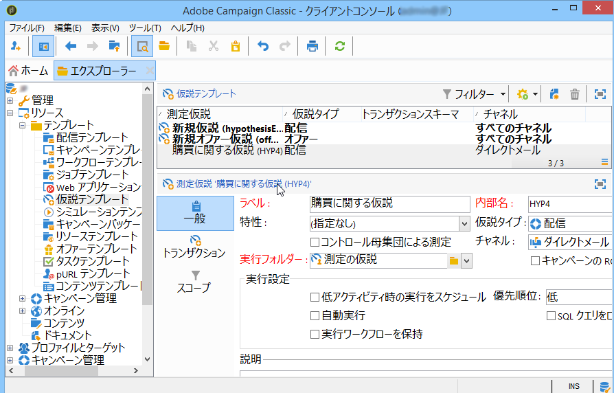

1. Click **[!UICONTROL New]** or right-click in the list of templates and choose **[!UICONTROL New]** in the drop-down list.
1. 仮説ラベルを入力します。
1. Specify whether the template is destined for hypotheses on offers or deliveries via the **[!UICONTROL Hypothesis type]**.
1. For **[!UICONTROL Delivery]** type templates, specify whether measurements should be carried out with or without a control group (for more on this, refer to [Properties of a hypothesis template](#properties-of-a-hypothesis-template)).
1. For **[!UICONTROL Delivery]** type templates, you can choose a specific channel or decide to apply the template to all available channels in Adobe Campaign using the **[!UICONTROL Channel]** drop-down list (for more on this, refer to [Properties of a hypothesis template](#properties-of-a-hypothesis-template)).
1. Select the **[!UICONTROL Execution folder]** in which you wish to create and automatically execute the hypotheses that will be created from this template.
1. 実行設定を選択します(詳しくは、仮説テンプレートの実 [行設定を参照してください](#hypothesis-template-execution-settings))。
1. 仮説計算期間を指定します(詳しくは、仮説テンプレートの実 [行設定を参照してください](#hypothesis-template-execution-settings))。

   >[!CAUTION]
   >
   >この期間は、コンタクト日をもとに決定されます。

1. In the **[!UICONTROL Transactions]** tab, specify the tables and fields required for the hypothesis calculation (for more on this, refer to [Transactions](#transactions)).
1. If your template is configured for **[!UICONTROL Offer]** type hypotheses, you can enable the **[!UICONTROL Update offer proposition status]** option: in this case, select the status of the offer proposition you want to change.
1. Specify the scope of the hypothesis application (for more on this, refer to [Hypothesis perimeter](#hypothesis-perimeter)).
1. If necessary, use a script to complete filtering (for more on this, refer to [Hypothesis perimeter](#hypothesis-perimeter)).

### 仮説テンプレートのプロパティ {#properties-of-a-hypothesis-template}

The template&#39;s **[!UICONTROL General]** tab lets you specify the general template options. 以下のフィールドを使用できます。

* **[!UICONTROL Hypothesis type]**:テンプレートを配信またはオファーの仮説にするかどうかを指定できます。

   配信とオファー両方に適用する仮説を作成することもできます。

   >[!NOTE]
   >
   >テンプレートがオファーに適用される場合、この **[!UICONTROL Update offer proposition status]** オプションはタブで使用で **[!UICONTROL Transactions]** きます。

* **[!UICONTROL Measurement with control group]**:配信またはキャンペーンに対してコントロールグループが定義済みかどうかを示し、測定インジケーターに含めることができます。 コントロール母集団を使用すると、配信を受信しないコントロール母集団と、配信を受信したターゲット母集団とを比較することにより、配信後のキャンペーンの影響を測定できます。

   >[!NOTE]
   >
   >コントロール母集団を考慮するようテンプレートを設定していても、仮説を適用する配信でグループを定義していない場合、結果はターゲット母集団のみに基づいて測定されます。

   制御グループの定義と設定の詳細は、「制御グループの定 [義」を参照してください](../../campaign/using/marketing-campaign-deliveries.md#defining-a-control-group)。

* **[!UICONTROL Channel]**:特定のチャネルを選択するか、ドロップダウンリストから選択して、Adobe Campaignコンソールのすべてのチャネルで仮説テンプレートを使 **[!UICONTROL All channels]** 用できるようにします。 If you configure the template for a specific channel, this lets you automatically filter deliveries per channel when creating the hypothesis (refer to [Creating hypotheses](../../campaign/using/creating-hypotheses.md)).

   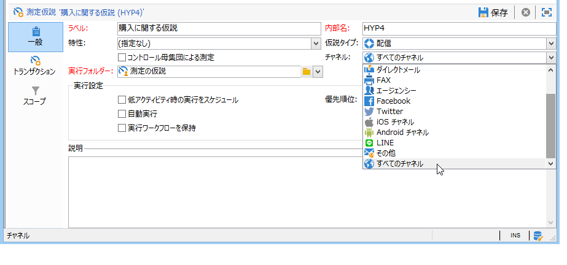

* **[!UICONTROL Execution folder]**:仮説の実行フォルダーを指定できます。
* **[!UICONTROL Taken into account in campaign ROI calculation]**:関連キャンペーンのROI計算に仮説の結果を考慮します。

### 仮説テンプレートの実行設定 {#hypothesis-template-execution-settings}

The template&#39;s **[!UICONTROL General]** tab also lets you specify the hypothesis execution parameters. 以下のオプションを使用できます。

* **[!UICONTROL Schedule execution for a time of low activity]**:仮説の立ち上げをスケジュールして、Adobe Campaignのパフォーマンスを最適化できます。 このオプションをオンにすると、キャンペーンの処理ワークフローにより、仮説の計算がダウンタイム中に実行されます。

   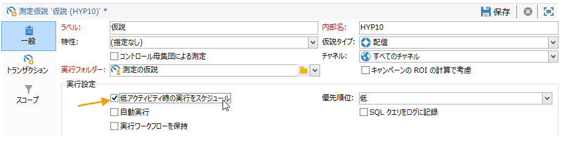

* **[!UICONTROL Priority]**:同時実行がある場合に仮説の計算順序を空けるために仮説に適用されるレベル。

   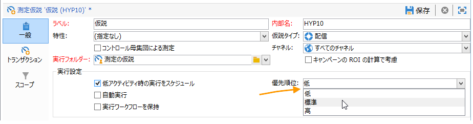

* **[!UICONTROL Automatic execution]**:必要に応じて、仮説の再計算をスケジュールできます（例えば、配信の終了まで定期的に指標を更新する場合）。

   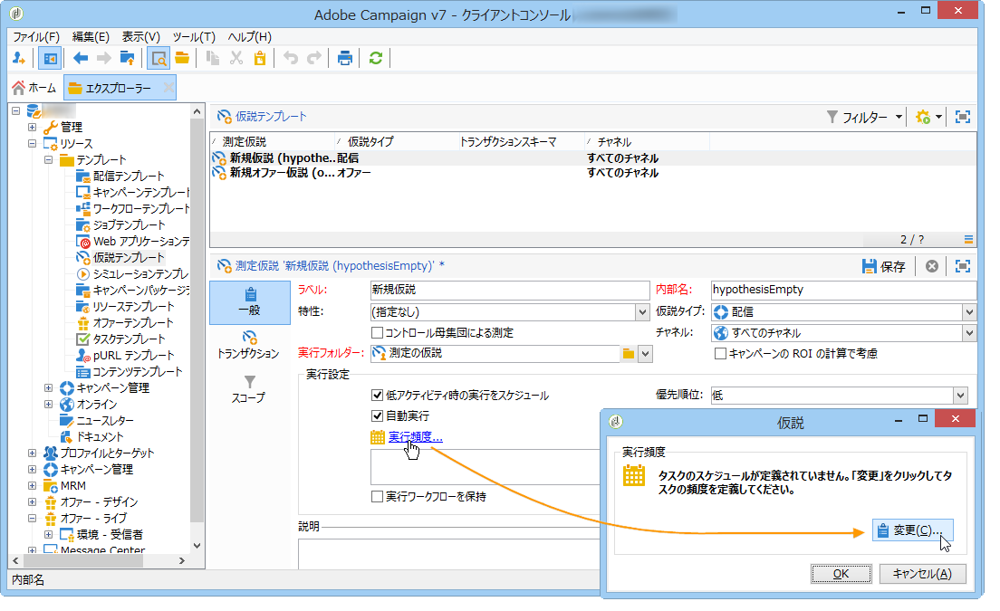

   スケジュールを指定するには、次の手順に従います。

   1. リンクをクリ **[!UICONTROL Frequency of execution...]** ックし、ボタンをクリッ **[!UICONTROL Change...]** クします。

      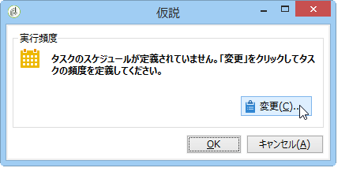

   1. 頻度、関連するイベントおよび有効期間を設定します。

      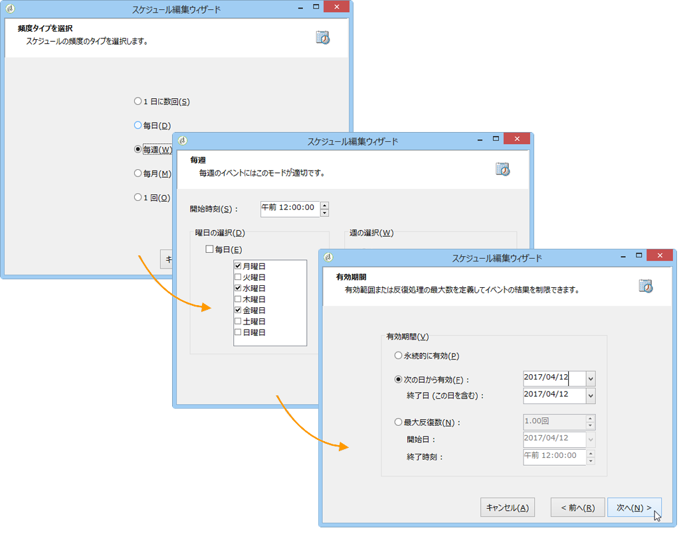

   1. Click **[!UICONTROL Finish]** to save the schedule.

      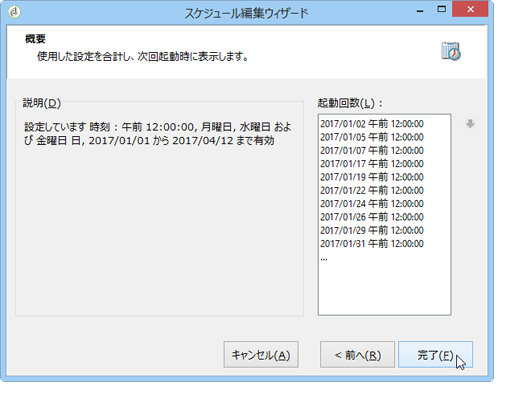

* **[!UICONTROL Log SQL queries in journal]**:この関数は、エキスパートユーザー向けに予約されています。 SQL クエリを表示するために、測定の仮説の監査にタブを追加することができます。これにより、シミュレーションでエラーが発生した場合に誤作動を検知することができます。
* **[!UICONTROL Keep execution workflow]**:仮説計算の開始時に自動的に生成されたワークフローを維持できます。 このオプションがオンになっているテンプレートをもとに作成した仮説では、生成されたワークフローを使用してプロセスを確認することができます。

   >[!CAUTION]
   >
   >このオプションは、仮説の実行時にエラーが発生する場合のデバッグ目的でのみ有効にします。\
   >また、自動的に生成されたワークフローは編集しないでください。変更を加えても、その後の計算で考慮されることはありません。\
   >このオプションを有効にしている場合は、実行後にワークフローを削除してください。

### トランザクション {#transactions}

このタブに含まれる様々なフィールドとテーブルでは、トランザクションに関連する受信者の反応の履歴を保存することができます。反応管理用テーブルについて詳しくは、[設定](../../configuration/using/about-schema-reference.md)ガイドを参照してください。

* **[!UICONTROL Schema (reaction log storage)]**:受信者の反応テーブルを選択します。 Adobe Campaign の組み込みテーブルは、**NmsRemaMatchRcp** です。
* **[!UICONTROL Transaction schema]**:仮説が関与するテーブル（トランザクションテーブルや購入テーブル）を選択します。
* **[!UICONTROL Querying schema]**:仮説をフィルタリングする基準を選択します。
* **[!UICONTROL Link to individuals]**:個人とトランザクションスキーマとして使用するテーブルとの間のリンクを選択します。
* **[!UICONTROL Link to the household]**:仮説に世帯の全メンバーを含める場合は、トランザクションスキーマの世帯へのリンクを選択します。 このフィールドはオプションです。
* **[!UICONTROL Transaction date]**:このフィールドはオプションですが、仮説計算の範囲を定義できるので、お勧めします。
* **[!UICONTROL Measurement period]**:仮説が実行され、購買明細行が回復される開始日と終了日を設定できます。

   仮説を配信にリンクしている場合、ダイレクトメール配信のコンタクト日の数日後か、E メールまたは SMS 配信の配信日後に測定が自動的に開始します。

   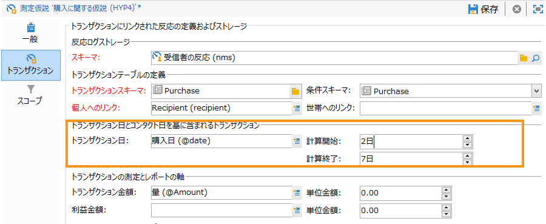

   仮説はオンザフライで開始します。すぐに開始したい場合は、強制的に開始することもできます。それ以外の場合は、仮説作成日に基づいて設定された計算終了日に基づいて自動的にトリガーされます(「 [Creating a fy on the fly on a delivery](../../campaign/using/creating-hypotheses.md#creating-a-hypothesis-on-the-fly-on-a-delivery)」を参照)。

* **[!UICONTROL Transaction/Margin amount]**:これらのフィールドはオプションで、回転率インジケーターを自動的に計算できます(「インジケー [ター](../../campaign/using/hypothesis-tracking.md#indicators)」を参照)。
* **[!UICONTROL Unit amount]**:売上高を計算する金額を設定できます(「指標」を参照 [して](../../campaign/using/hypothesis-tracking.md#indicators))。

   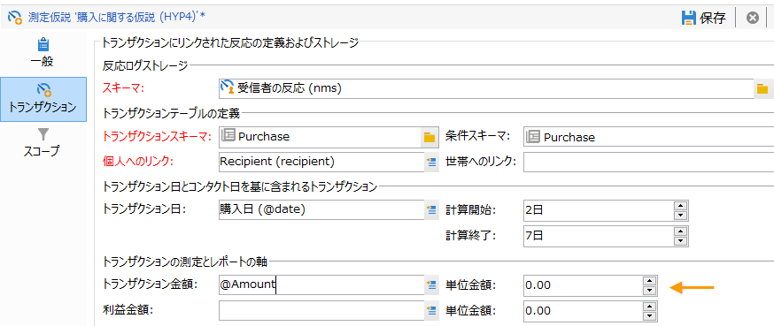

* **[!UICONTROL Additional measures and data]**:別のテーブルのフィールドから追加のレポートメジャーまたは軸を指定できます。
* **[!UICONTROL Update offer proposition status]**:オファーの受信者が仮説で識別された場合に、オファーの提案のステータスを変更できます。

   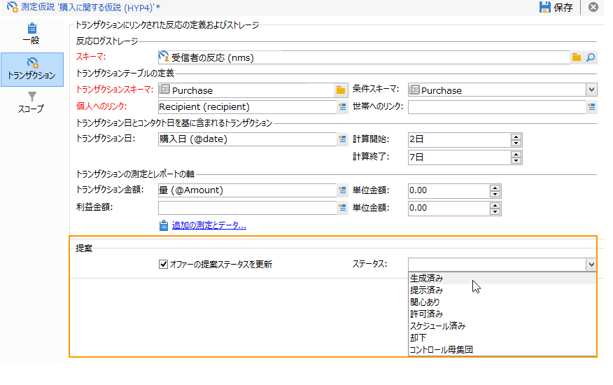

### 仮説ペリメーター {#hypothesis-perimeter}

仮説で使用するトランザクションテーブルとフィールドを定義し終えたら、フィルターを使用してターゲットのトランザクションと配信を指定し、仮説のスコープをより詳細に設定できます。JavaScript スクリプトを使用してトランザクションテーブルで参照する製品を明示的に指定することもできます。

* **トランザクションのフィルタ**:タブで、 **[!UICONTROL Scope]** 仮説に対してフィルターを設定できます。 手順は次のとおりです。

   1. リンクをクリック **[!UICONTROL Edit query]** します。

      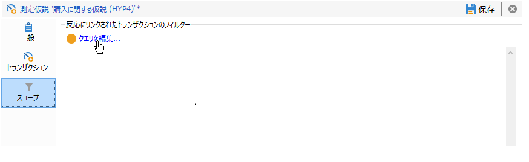

   1. フィルター条件を指定します。

      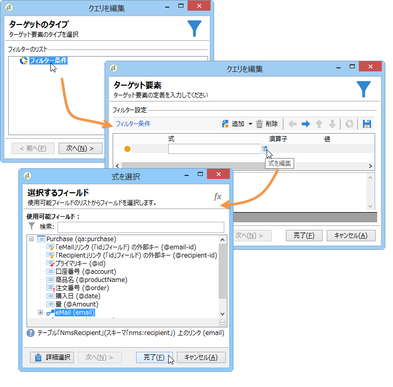

   1. 仮説で使用するトランザクションを選択します。

      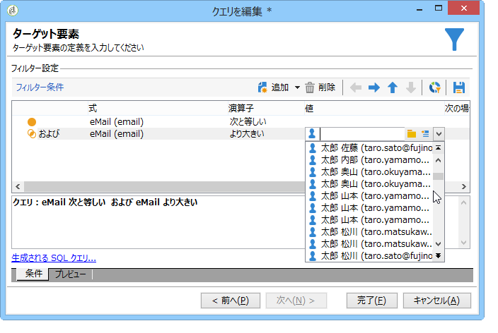

* **受信者に対するフィルタ**:タブ **[!UICONTROL Scope]** で、メッセージ（配信、受信者、電子メールアドレス、サービスなど）にリンクされている任意の情報に仮説を制限できます。

   1. リンクをクリ **[!UICONTROL Add a filter]** ックし、次に **[!UICONTROL Edit query]**。

      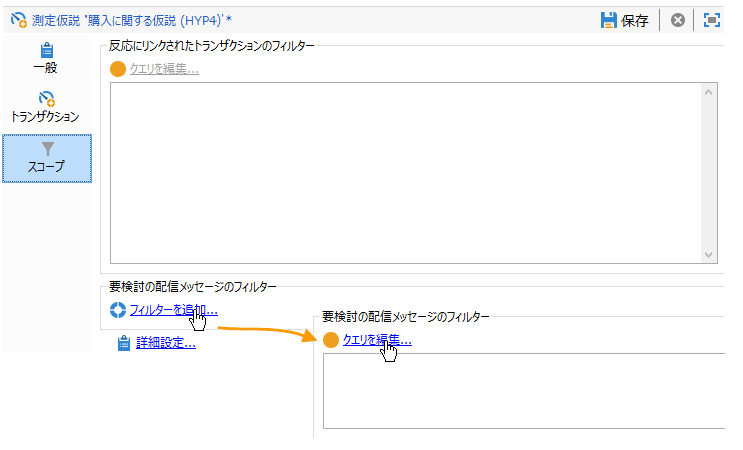

   1. フィルター条件を指定します。

      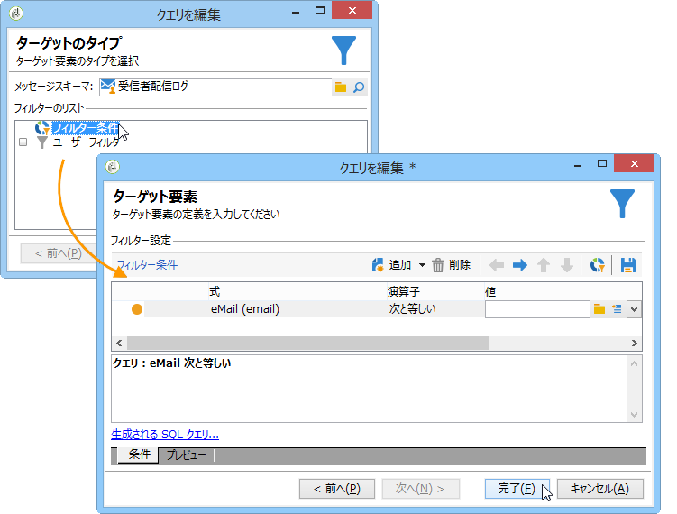

   1. Click **[!UICONTROL Finish]** to save your query.

      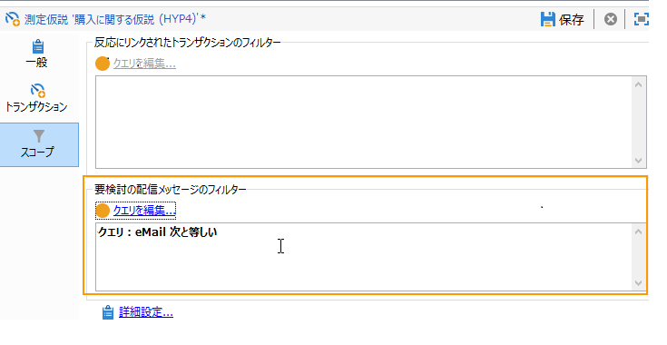

* **スクリプトを使用する場合**：JavaScript スクリプトを使用すると、仮説の実行中に仮説の設定を動的に多重定義できます。

   To do this, click the **[!UICONTROL Advanced settings]** link then enter the desired script.

   >[!NOTE]
   >
   >このオプションはエキスパートユーザー向けです。

   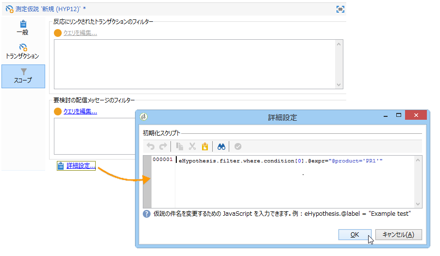

## 例：配信の仮説テンプレートの作成 {#example--creating-a-hypothesis-template-on-a-delivery}

この例では、ダイレクトメールタイプの配信に仮説テンプレートを作成します。仮説が基にするトランザクションテーブル（この例では&#x200B;**購入**）は、記事または製品にリンクされた購入ラインを含みます。モデルを設定し、購入テーブルで記事または製品の仮説を作成します。

1. Adobe Campaignエクスプローラーで、ノードに移動し **[!UICONTROL Resources > Templates > Hypothesis templates]** ます。
1. Click **[!UICONTROL New]** to create a template.

   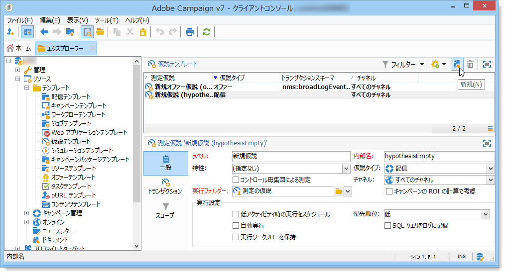

1. テンプレートラベルを変更します。

   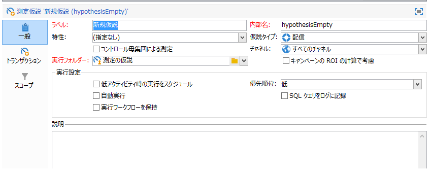

1. Select **[!UICONTROL Deliveries]** as a hypothesis type.
1. 配信にコントロール母集団を含めるためのボックスをオンにします。
1. チャネルを選択 **[!UICONTROL Direct mail]** します。

   >[!NOTE]
   >
   >このテンプレートはダイレクトメール配信用なので、このモデルを使用して作成する仮説をその他の配信タイプにリンクすることはできません。

1. In the **[!UICONTROL Transactions]** tab, select the recipient reactions table.

   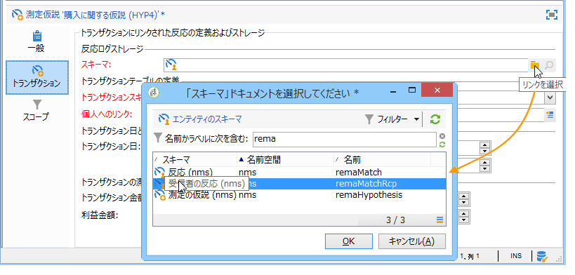

1. In the **[!UICONTROL Transactions schema]** field, choose your purchase table.

   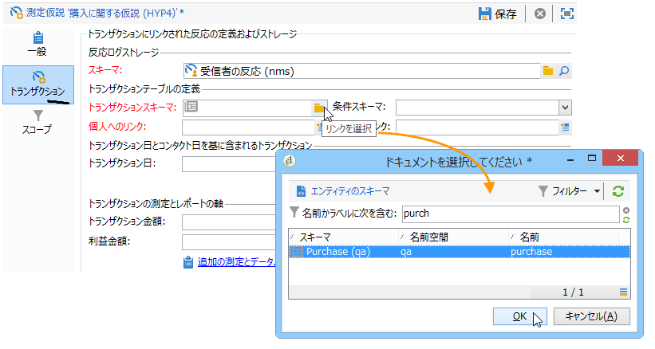

1. フィールドで購入明細行を選択 **[!UICONTROL Querying schema]** します。

   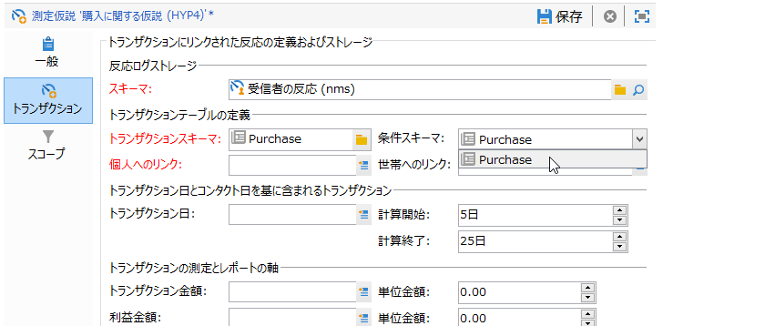

1. 購入テーブルにリンクする受信者を選択します。

   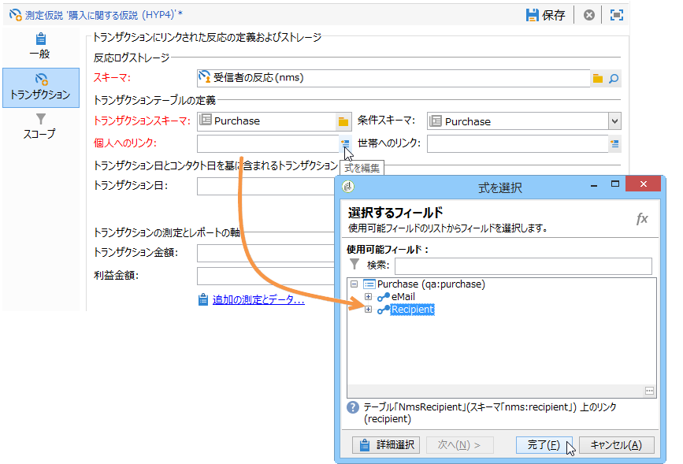

1. 購入日にリンクするフィールドを選択します。

   これにより、仮説の時間枠を定義できます。この手順は必須ではありませんが、実行することをお勧めします。

   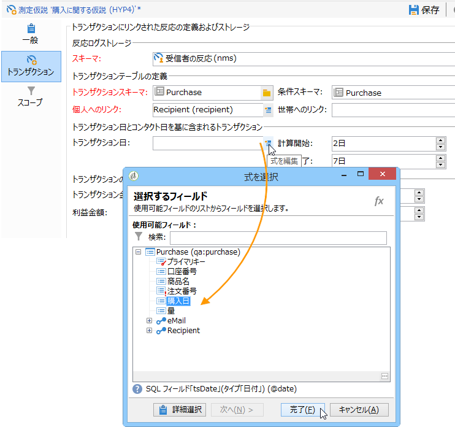

1. 計算期間を 5 日から 25 日に設定します。

   

1. In the **[!UICONTROL Scope]** tab, click **[!UICONTROL Edit query]** to create a filter on hypotheses.

   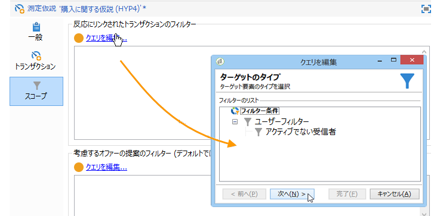

   作成したテンプレートを使用して、購入テーブルで製品または記事の仮説を実行できます。

1. Click **[!UICONTROL Save]** to record your template.

