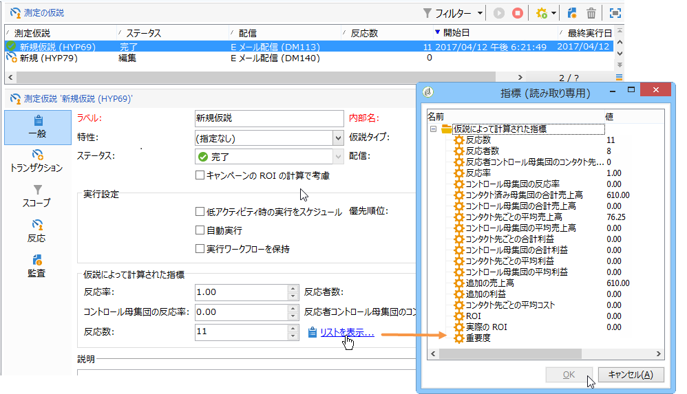
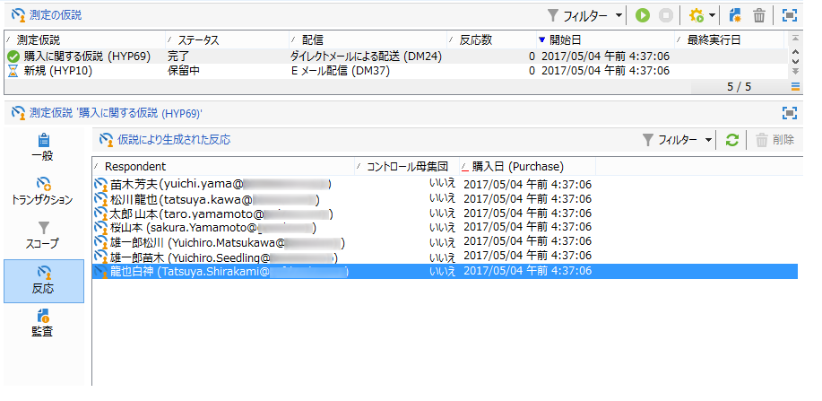
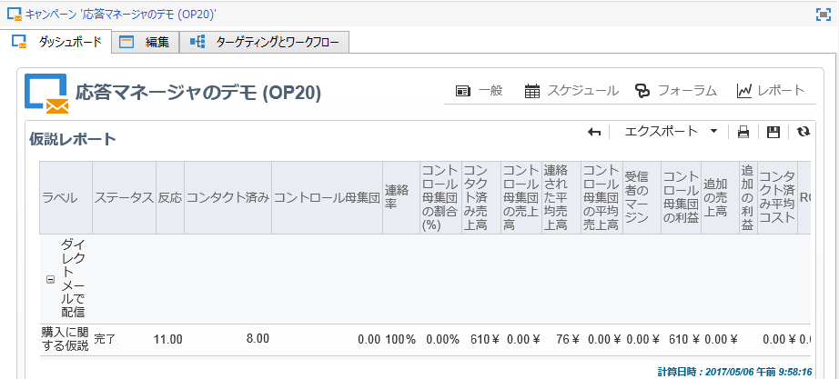
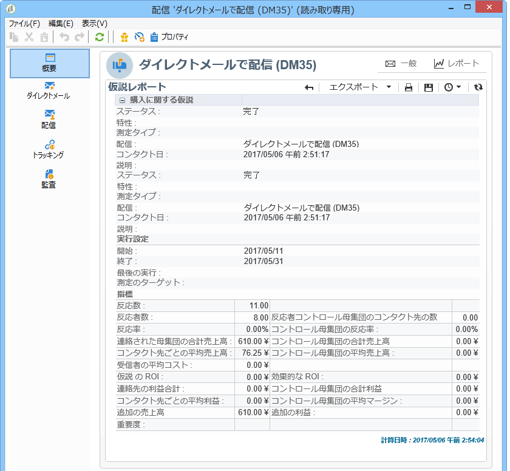

# 仮説のトラッキング{#hypothesis-tracking}

仮説の計算結果は、Adobe Campaign プラットフォームの様々なレベルで確認できます。仮説によって計算された指標およびターゲット母集団の反応は、現在の仮説でもキャンペーンと配信の仮説レポートでも確認できます。

## 仮説の結果 {#hypothesis-results}

### 指標 {#indicators}

仮説が計算されると、いくつかの測定指標が自動的に更新されます。These are available in the **[!UICONTROL General]** tab of the hypothesis.

以下の指標を確認できます。

* **反応者数**：仮説に一致するコンタクト先の数。
* **連絡済み反応率**：反応者数÷配信中のコンタクト先の総数。
* **回答者コントロール母集団のコンタクト先の数**：仮説に一致するコントロール母集団の数。
* **コントロール母集団の反応率**：回答者コントロール母集団のコンタクト先の数÷配信コントロール母集団の総数。
* **反応数**：個人、仮説およびトランザクションテーブル間の関係を含むテーブル内のレコード数。

インジケーターの完全なリストを表示するには、次のリンクをクリック **[!UICONTROL Display the list]** します。

指標により次の情報が提供されます。

* **コンタクト済み母集団の合計売上高**：合計金額÷コンタクト先数。
* **コントロール母集団の合計売上高**：合計金額÷コントロール母集団数。
* **コンタクト先ごとの平均売上高**：合計金額÷コンタクト先。
* **コントロール母集団の平均売上高**：合計金額÷コントロール母集団。
* **コンタクト先あたりの利益合計**：合計利益÷コンタクト先。
* **コントロール母集団の合計利益**：合計利益÷コントロール母集団。
* **コンタクト先ごとの平均利益**：合計利益÷コンタクト先。
* **コントロール母集団の平均利益**：合計利益÷コントロール母集団。
* **追加の売上高**:（連絡先の平均売上高 — 対照群の平均売上高）*連絡先の数
* **追加利益**:（平均連絡利益率 — 対照群の平均利益率）/連絡数
* **コンタクト先あたり平均コスト**：計算済み配信コスト÷コンタクト先数。
* **ROI**：配信の計算されたコスト÷コンタクト先ごとの合計利益
* **効果的な ROI**：計算済み配信コスト÷追加利益。
* **重要度**：キャンペーンの重要度に応じて 0 ～ 3 の値。

### 反応 {#reactions}

You can view recipients&#39; reactions to the hypotheses via the **[!UICONTROL Reactions]** tab.

1. Once hypothesis calculation is complete, go to the **[!UICONTROL Campaign management > Measurement hypotheses]** node of the Adobe Campaign tree.
1. Select the desired hypothesis and click the **[!UICONTROL Reactions]** tab to view the list of recipients likely to purchase something following the marketing campaign.

   

## レポート {#reports}

The **[!UICONTROL Hypothesis report]** lets you view the results of the hypotheses performed on campaigns and deliveries. This report contains the indicators calculated by the hypothesis (for more on this, refer to [Indicators](#indicators)).

* **キャンペーンレベル**:関連するキ **[!UICONTROL Reports]** ャンペーンのリンクをクリックし、を選択しま **[!UICONTROL Hypothesis report]**&#x200B;す。 このレポートには、キャンペーン配信と、各配信に計算された仮説のリストが含まれます。

   

* **配信レベル**:レポートにアクセスするには、該当する配信を開き、タブのを **[!UICONTROL Reports]** クリック **[!UICONTROL Summary]** して、を選択しま **[!UICONTROL Hypothesis report]**&#x200B;す。 同一の配信に複数の仮説が計算された場合は、すべての仮説がレポートに表示されます。

   
