# マーケティングリソースの管理{#managing-marketing-resources}

Adobe Campaign では、キャンペーンライフサイクルに関連するマーケティングリソースを管理およびトラッキングできます。マーケティングリソースとは、パンフレットや視覚資料、または複数のオペレーターが関係するその他の通信媒体です。

Adobe Campaign では、管理するマーケティングリソースそれぞれのステータスと履歴をいつでもトラッキングし、最新のバージョンを確認できます。

## ターゲティングディメンションの追加 {#adding-a-marketing-resource}

マーケティングリソースにはキャンペーンウィンドウからアクセスします。

To add a resource, click the **[!UICONTROL Create]** button.

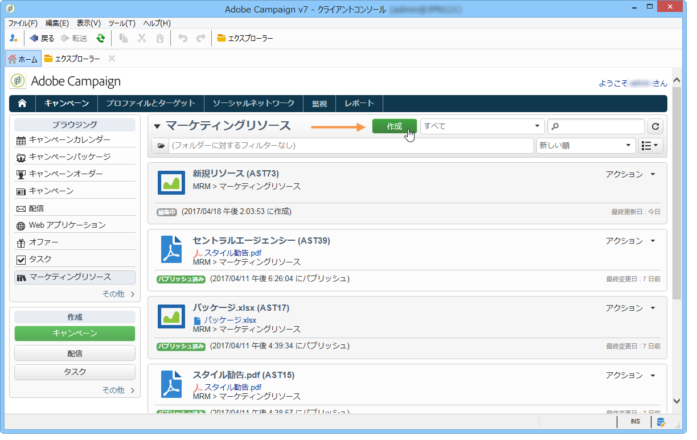

リソースを Adobe Campaign サーバーで利用するには、そのリソースをエディターの中央部にドラッグ&amp;ドロップして追加する必要があります。リンクをクリックすることもで **[!UICONTROL Upload file to server...]** きます。

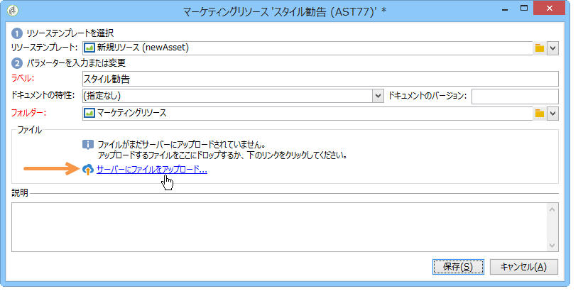

確認メッセージが表示され、アップロードを開始できます。

アップロードが完了すると、使用可能なリソースのリストにリソースが追加され、Adobe Campaign オペレーターがアクセスできるようになります。They can view it (via the **[!UICONTROL Preview]** tab), make a copy to modify it, or update the file on the server (using the **[!UICONTROL Edit]** tab).

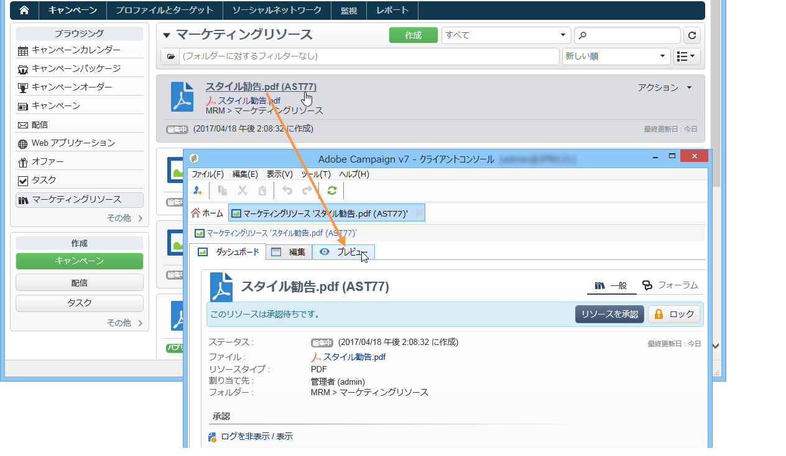

Click the **[!UICONTROL General]** tab to select the operators or groups of operators in charge of monitoring, tracking and approving this resource. Selecting the reviewer is done via the **[!UICONTROL Advanced parameters]** link.

* リソースを割り当てられたオペレーターは、そのリソースのトラッキングを担当します。
* 承認オペレーターはマーケティングリソースの承認を担当します。リソースの検証プロセスが開始すると、これらのオペレーターに通知が送信されます。

   If no reviewer is selected, the resource **[!UICONTROL cannot be]** subject to approval.

* 必要に応じて、校正者を指定することもできます。

リソースに使用可能な日付（目安）を指定できます。Beyond this date, it will appear with **[!UICONTROL Late]** status.

## リソースの共同作業 {#collaborative-work-on-resources}

マーケティングリソースを修正、更新し、必要に応じてこれらの変更を他の Adobe Campaign オペレーターに通知できます。次の操作をおこなうことができます。

* リソースをローカルにダウンロードして修正する
* サーバー上でファイルを更新し、他のオペレーターがアクセスできるようにする
* リソースをロックし、他のオペレーターが修正できないようにする

>[!NOTE]
>
>The **[!UICONTROL History]** tab contains the download and update log for the resource. The **[!UICONTROL Details]** button lets you view the selected version:

### リソースのロックとロック解除 {#locking-unlocking-a-resource}

作成したリソースは、マーケティングリソースダッシュボードに表示され、オペレーターが編集、修正できるようになります。

リソースで作業する場合は、他のオペレーターが同時に同じリソースを修正しないよう、作業を開始する前にリソースをロックすることが推奨されます。ロックすると、リソースは予約済みになり、その他のオペレーターはアクセスできてもサーバー上でパブリッシュや更新ができなくなります。

アクセスすると以下のようなメッセージが表示されます。

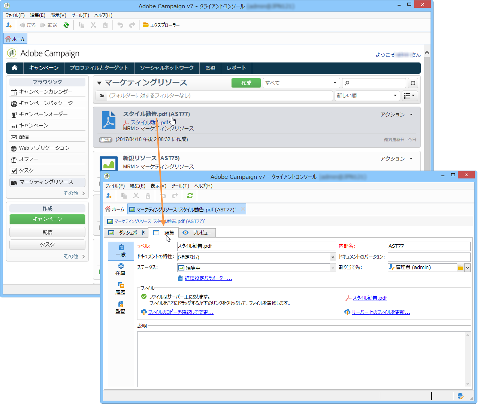

The **[!UICONTROL Tracking]** tab indicates the name of the operator who locked the resource and the planned update date.

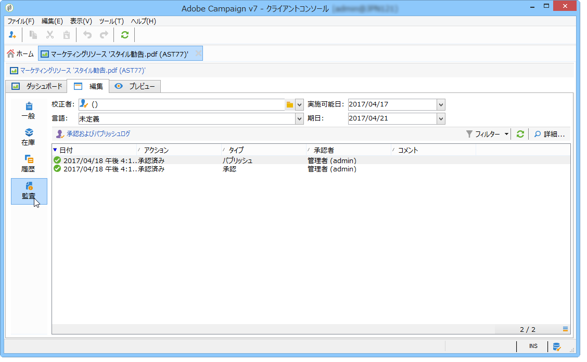

To lock a resource, you must click the resource followed by the **[!UICONTROL Lock]** button in the resource dashboard.

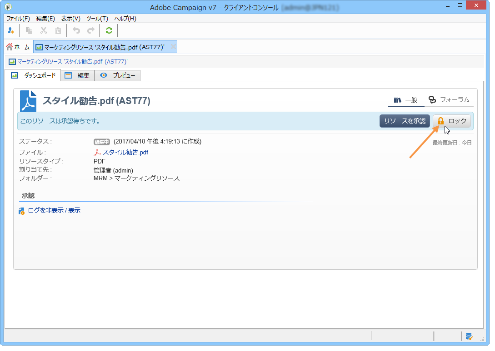

You can indicate the planned return date in the **[!UICONTROL Tracking]** tab of the resource.

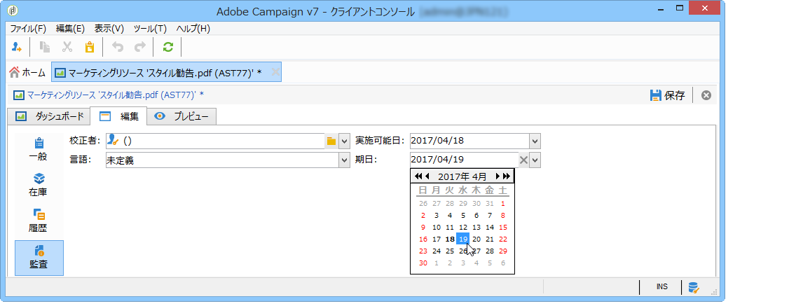

ここで指定する情報が、リソースのロック解除日としてその他の Adobe Campaign オペレーターに表示されます。

リソースを更新すると、リソースは自動的にロックが解除され、再びすべてのオペレーターが使用できるようになります。

必要に応じてダッシュボードから手動でロックを解除することもできます。

>[!NOTE]
>
>リソースをロック解除できるのは、リソースをロックしたオペレーターと、管理者権限を持つオペレーターのみです。

### ディスカッションフォーラム {#discussion-forums}

For each resource, the **[!UICONTROL Forum]** tab lets participants exchange information.

[ディスカッションフォーラムで](../../campaign/using/discussion-forums.md) 、Adobe Campaignでディスカッションフォーラムがどのように機能するかについて説明します。

## マーケティングリソースのライフサイクル {#life-cycle-of-a-marketing-resource}

リソースを作成すると、Adobe Campaign のオペレーターに、リソースのデザイン、校正、承認およびパブリッシュが割り当てられます。キャンペーンには期間を指定することができます。

The **[!UICONTROL Tracking]** tab lets you monitor any actions carried out on the resource: approvals, approval refusals, related comments, or publications.

The **[!UICONTROL History]** tab displays file transfers carried out for this resource.

### 承認プロセス {#approval-process}

The expected availability date is displayed in the resource details, if it was specified in the **[!UICONTROL Tracking]** tab. Once this date is reached, you can execute the approval process using the **[!UICONTROL Submit for approval]** button in the resource dashboard. その後、リソースのステータスがに変わりま **[!UICONTROL Approval in progress]**&#x200B;す。

A resource can be approved via the **[!UICONTROL Approve resource]** button on its dashboard.

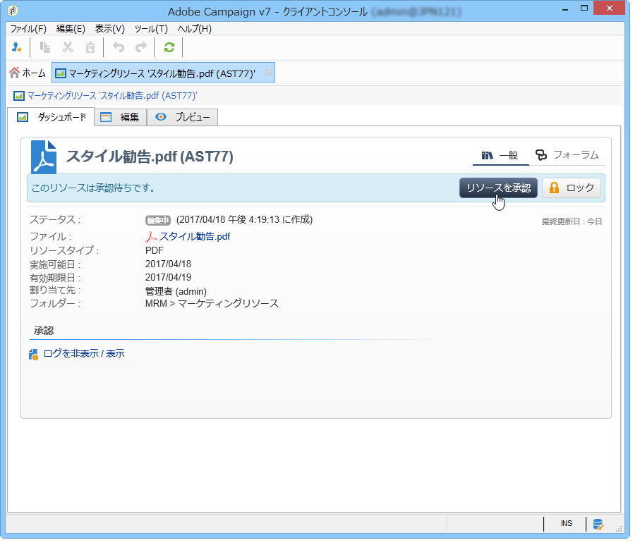

権限のあるオペレーターは、承認または却下できます。This action is possible either: via the email message sent (by clicking the link in the notification message) or via the console (by clicking the **[!UICONTROL Approve]** ) button.

承認ウィンドウが表示され、コメントを入力できます。

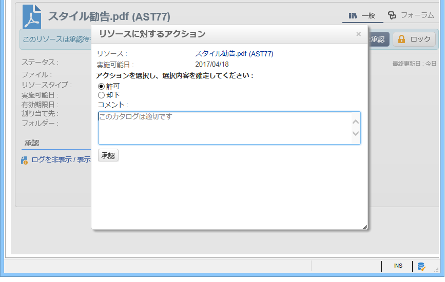

The **[!UICONTROL Tracking]** tab enables all operators to track the various stages of the approval process.

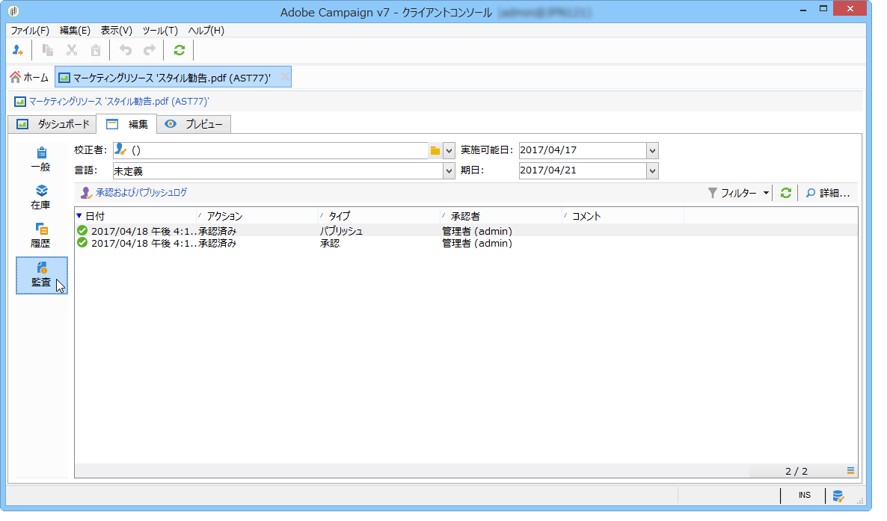

>[!NOTE]
>
>各マーケティングリソースのレビュー担当者に加え、管理者権限を持つオペレーターとリソースマネージャーも、マーケティングリソースを承認できます。

### リソースのパブリッシュ {#publishing-a-resource}

マーケティングリソースを承認したら、パブリッシュする必要があります。パブリッシュプロセスは、企業の要件に応じて実装ごとに異なります。例えば、リソースをエクストラネット上またはその他のサーバー上にパブリッシュできる場合もあれば、特定の情報を外部のサービスプロバイダーに送信できる場合もあります。

To publish a resource, click the **[!UICONTROL Publish]** button in the editing zone of the marketing resource dashboard.

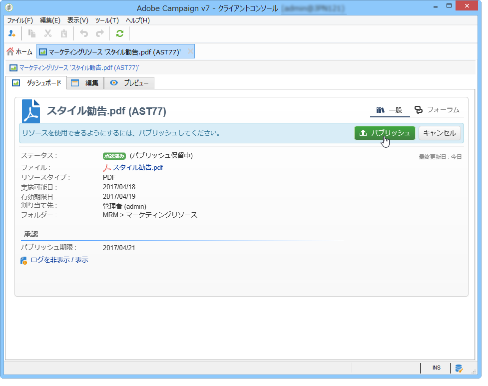

ワークフローを使用して自動的にパブリッシュすることもできます。

リソースのパブリッシュとは、リソースを（その他のタスクなどで）使用可能にすることです。パブリッシュ自体は、リソースの特性により異なります。例えば、チラシの場合、パブリッシュとはファイルを印刷業者に送信することを意味します。Web 媒体の場合は Web サイトに公開することを意味します。

Adobe Campaign でパブリッシュするには、適切なワークフローを作成してリソースにリンクする必要があります。To do this, open the **[!UICONTROL Advanced settings]** box of the resource, then select the desired workflow in the **[!UICONTROL Post-processing]** field.

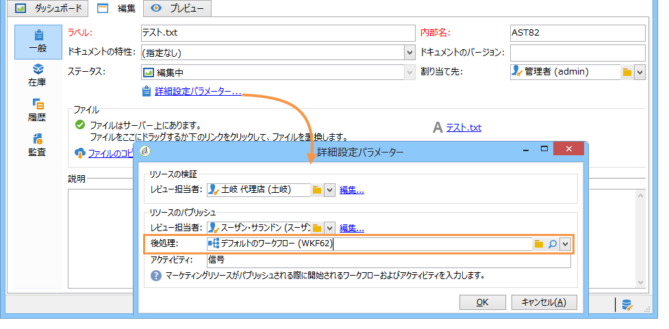

ワークフローは以下の場合に実行されます。

* When the reviewer clicks the **[!UICONTROL Publish resource]** link (or, if no reviewer was defined, the person in charge of the resource).
* If the resource is managed via a marketing resource creation task, it will be executed when the task is set to **[!UICONTROL Finished]**, as long as the **[!UICONTROL Publish the marketing resource]** box is checked in the task (Refer to [Marketing resource creation task](../../campaign/using/creating-and-managing-tasks.md#marketing-resource-creation-task))

If a workflow isn&#39;t started immediately (if the workflow is stopped for instance), the status of the resource changes to **[!UICONTROL Pending publication]**. Once the workflow is started, the status of the resource changes to **[!UICONTROL Published]**. このステータスには、パブリッシュプロセス中のエラーは反映されません。パブリッシュが適切に実行されたかどうかを確認するには、ワークフローのステータスを確認します。

## キャンペーンへのリソースのリンク {#linking-a-resource-to-a-campaign}

### マーケティングリソースの参照 {#referencing-a-marketing-resource}

キャンペーンテンプレートでリソースの関連付け機能を選択した場合、マーケティングリソースをキャンペーンに関連付けることができます。

>[!NOTE]
>
>For details on how to create and configure campaign templates, refer to [Campaign templates](../../campaign/using/marketing-campaign-templates.md#campaign-templates).

Click the **[!UICONTROL Documents > Resources]** tab in the campaign dashboard, then click **[!UICONTROL Add]** to select the resource concerned.

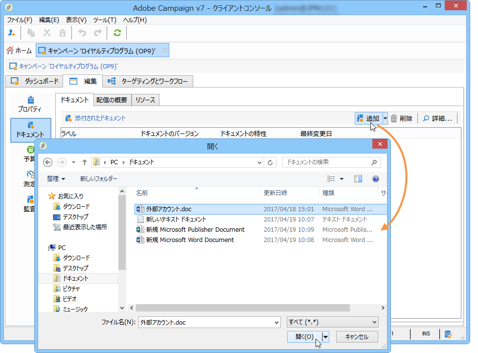

リソースはステータス別、特性別またはタイプ別にフィルターできます。パーソナライズしたフィルターを適用することもできます。

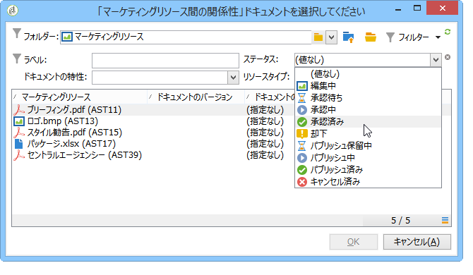

「**[!UICONTROL OK]**」をクリックし、このキャンペーンで参照されているマーケティングリソースのリストにリソースを追加します。

The **[!UICONTROL Details]** button lets you edit and view it.

追加したリソースはダッシュボードに表示されます。リソースはダッシュボードでも編集できます。

### 配信の概要へのマーケティングリソースの追加 {#adding-a-marketing-resource-to-a-delivery-outline}

マーケティングリソースは、配信の概要を使用して配信と関連付けることができます。

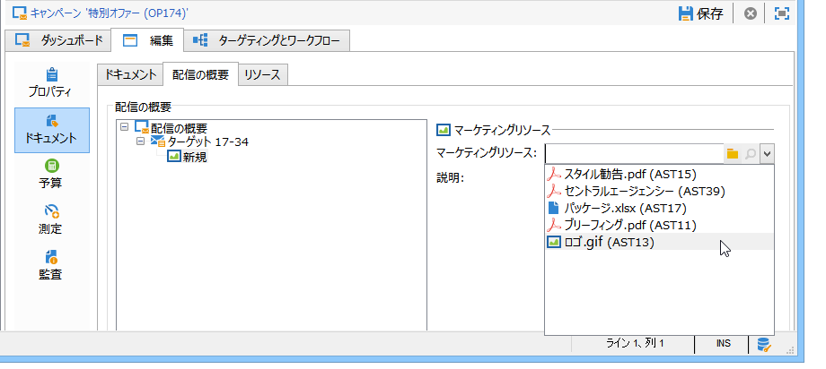

>[!NOTE]
>
>配信の概要の詳細については、「配信の概要を介してリ [ンクされたリソースの関連付けと構造化」を参照してください](../../campaign/using/marketing-campaign-deliveries.md#associating-and-structuring-resources-linked-via-a-delivery-outline)。

## 在庫管理 {#stock-management}

マーケティングリソースを 1 つまたは複数の在庫と関連付けることで、供給を管理し、在庫が不十分な場合にダッシュボードに警告を表示することができます。

>[!NOTE]
>
>For more information on stock management in Adobe Campaign, refer to [Stock management](../../campaign/using/providers--stocks-and-budgets.md#stock-management).

マーケティングリソースを在庫と関連付けるには、在庫マップを編集し、在庫を編集または作成します。在庫品目を追加し、対応するマーケティングリソースを選択します。

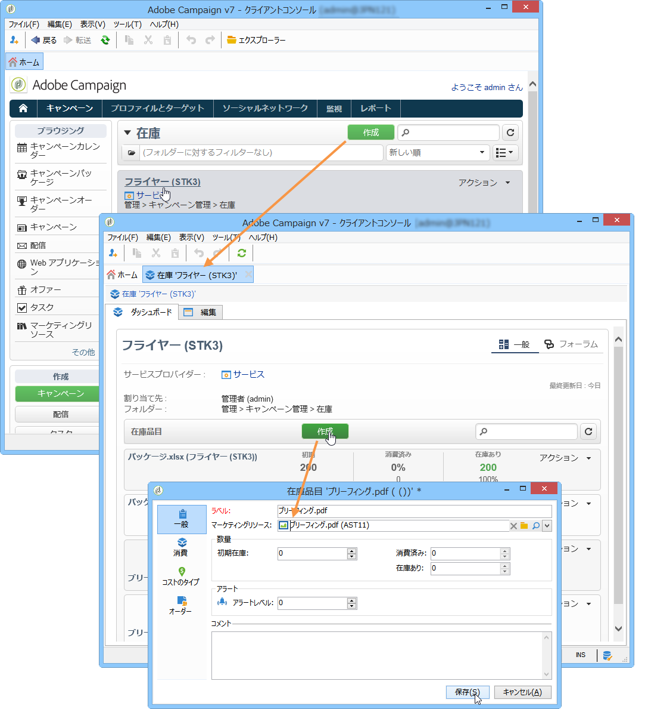

If necessary, you can edit the selected resource via the **[!UICONTROL Edit the link]** icon (magnifying glass) located to the right of the resource once it has been selected.

初期在庫とアラートレベルを指定し、保存します。

在庫はリソースの詳細に表示されます。

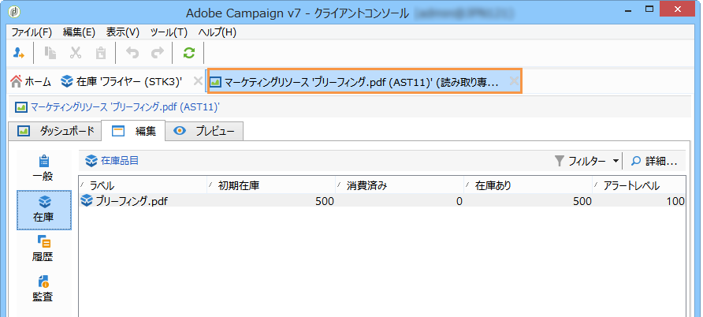

在庫が不十分になると、関係するオペレーターに警告が送信されます。

## 高度な機能 {#advanced-functions}

マーケティングリソースダッシュボードでは、追加、編集、ロックとロック解除、承認およびパブリッシュなど、通常の操作を実行します。その他のタイプのマーケティングリソースを作成して、Adobe Campaign ツリーから高度な機能にアクセスすることもできます。To do this, click **[!UICONTROL Explorer]** in the Adobe Campaign home page.

By default, marketing resources are stored in the **[!UICONTROL MRM > Marketing resources]** node of the tree.

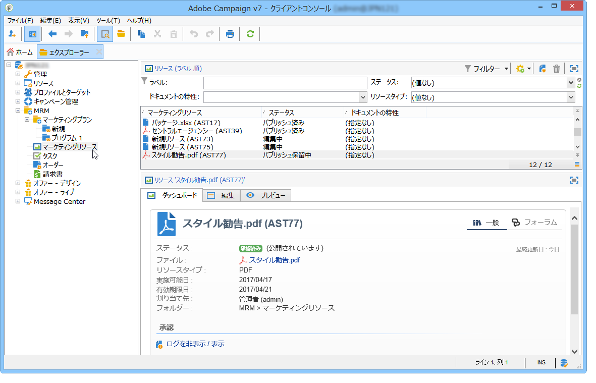

このビューから以下のリソースを追加できます。

* ファイル
* HTML
* テキスト
* URL

