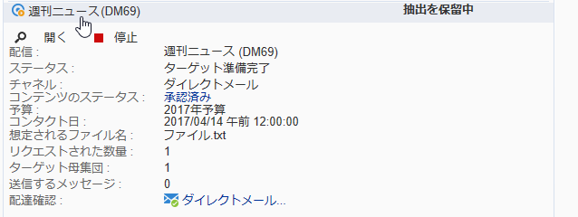

# マーケティングキャンペーンの承認 {#approving-marketing-campaigns}

## 承認プロセス {#approval-process}

キャンペーンの各種プロセス（ターゲット設定、コンテンツ、予算、抽出、校正の送信）の監視と制御を完全かつ確実におこなうために、配信の各段階で承認を要求できます。

>[!NOTE]
>
>承認をおこなうための適切な権限がレビュー担当者に付与されていることを確認する必要があります。また、セキュリティゾーンが正しく定義されていることも確認してください。

承認リクエストを通知するために、レビュー担当者として指定されている Adobe Campaign オペレーターに通知 E メールが送信されます。

承認手順については、[配信の確認と承認](#checking-and-approving-deliveries)で説明しています。

>[!NOTE]
>
>配信のオーナーのみが配信を開始できます。別のオペレーター（またはオペレーターグループ）が配信を開始できるようにするには、レビュー担当者として「**[!UICONTROL 配信開始：]**」フィールドに追加する必要があります。\
>[レビュー担当者の選択](#selecting-reviewers)も参照してください。

### 動作の仕組み {#operating-principle-}

例えば、予算承認のための標準的な E メールは、次のようになります。

レビュー担当のオペレーターは、関連する手順を承認するかどうかを選択できます。

オペレーターが選択を承認すると、ジョブの承認または却下が配信ダッシュボードに転送されます。

この情報は、キャンペーンの承認ログにも表示されます（**[!UICONTROL 編集／監査／「承認」]**&#x200B;タブからアクセス）。

これらの通知は、承認を有効にした各プロセスに影響を与えるオペレーターに送信されます。

承認は、キャンペーンテンプレート、個々の各キャンペーンまたは配信に対して有効にできます。

承認を必要とするすべてのジョブをキャンペーンテンプレート内で選択します（**[!UICONTROL プロパティ]**／**[!UICONTROL キャンペーンの詳細設定...]**／「**[!UICONTROL 承認]**」タブ）。承認を担当するオペレーターも選択します（このオプションが無効でない限り、このオペレーターが通知を受け取ります）。詳しくは、[プロセスの承認](#approving-processes)を参照してください。

これらの設定は、このテンプレートを使用して作成されたキャンペーンごとまたはキャンペーンの配信ごとに個別に上書きできます。「**[!UICONTROL プロパティ]**」ボタンをクリックし、「**[!UICONTROL 承認]**」タブをクリックします。

次の例では、配信コンテンツに承認は必要ありません。

### レビュー担当者の選択 {#selecting-reviewers}

承認のタイプごとに、承認を担当するオペレーターまたはオペレーターグループを配信のドロップダウンリストから選択します。「**[!UICONTROL 編集...]**」リンクを使用して、オペレーターを追加できます。このウィンドウでは承認期日を編集することもできます。

レビュー担当者を指定しない場合は、キャンペーンマネージャーが承認を担当し、通知を受け取ります。キャンペーンマネージャーは、キャンペーンの&#x200B;**[!UICONTROL 編集／「プロパティ」]**&#x200B;タブで指定します。

>[!NOTE]
>
>**[!UICONTROL 管理者]**&#x200B;権限を持つその他すべての Adobe Campaign オペレーターもジョブを承認できますが、通知は受け取りません。\
>デフォルトでは、承認オペレーターが定義されている場合に、キャンペーンマネージャーが承認を実行したり、配信を開始することはできません。この動作を変更し、キャンペーンマネージャーによる配信の承認または開始を許可するには、**NmsCampaign_Activate_OwnerConfirmation** オプションを **1** の値で作成します。

### 承認モード {#approval-modes}

#### ダッシュボードからの承認 {#approval-via-the-dashboard}

コンソールまたは Web インターフェイスからジョブを承認するには、キャンペーンダッシュボード上の適切なリンクをクリックします。配信トラッキングまたは配信ダッシュボードからもジョブを承認できます。

承認する情報を確認し、承認するか却下するかを選択し、必要に応じてコメントを入力します。「**[!UICONTROL OK]**」をクリックして保存します。

>[!NOTE]
>
>別のオペレーターがプロセスを既に承認している場合、承認リンクは表示されません。

#### 通知メッセージからの承認 {#approval-via-notification-messages}

通知メッセージに表示されるリンクをクリックします（[通知](#notifications)を参照）。以下に示すように、ログイン名およびパスワードを入力するように求められます。

「**[!UICONTROL 許可]**」または「**[!UICONTROL 却下]**」を選択し、必要に応じてコメントを入力します。

「**[!UICONTROL ターゲットの承認]**」をクリックします。

>[!NOTE]
>
>処理中に警告が発生した場合は、通知内に警告が表示されます。

#### 承認トラッキング {#approval-tracking}

この情報は数か所に表示されます。

* キャンペーン承認ログでは、**[!UICONTROL 編集／「監査」]**&#x200B;タブの「**[!UICONTROL 承認]**」サブタブに表示されます。

   

* キャンペーン配信ログでは、**[!UICONTROL 編集／「監査」]**&#x200B;タブの「**[!UICONTROL 配信]**」サブタブに表示されます。

   

* 各配信の承認ステータスは、「**[!UICONTROL 概要]**」タブの「**[!UICONTROL ログを非表示／表示]**」オプションをクリックすると表示できます。

   

* この情報には、各配信の&#x200B;**[!UICONTROL 監査／「承認」]**&#x200B;タブからもアクセスできます。

   

>[!NOTE]
>
>オペレーターがジョブを承認または却下すると、その他のレビュー担当オペレーターは承認を実行できなくなります。

#### 自動承認と手動承認 {#automatic-and-manual-approval}

ターゲティングワークフローの作成時に承認が自動になっていると（デフォルトモード）、Adobe Campaign は承認リンクを表示するか、承認が必要になるとすぐに通知を送信します。

承認モード（手動または自動）を選択するには、キャンペーンまたはキャンペーンテンプレートの&#x200B;**[!UICONTROL 編集／「プロパティ」]**&#x200B;タブをクリックし、「**[!UICONTROL キャンペーンの詳細設定...]**」をクリックして、「**[!UICONTROL 承認]**」タブをクリックします。

>[!NOTE]
>
>選択した承認モードは、キャンペーンのすべての配信に適用されます。

ターゲティングワークフローを作成する際に、手動承認を使用して、承認リンクの作成や、通知の自動送信をおこなわないようにすることができます。キャンペーンダッシュボードには、手動で承認プロセスを開始するための「**[!UICONTROL ターゲットを承認用に送信]**」リンクが表示されます。

確認メッセージによって、この配信用に選択されたジョブに対する承認を許可できます。

すると、「承認」ボタンが（この配信の）キャンペーンダッシュボード、配信ダッシュボードおよび配信トラッキングに表示されます。通知が有効な場合、通知も同時に送信されます。

この方法で承認を有効にすれば、レビュー担当者に誤った通知を送信することなく、ターゲティングに取り組むことができます。

### 通知 {#notifications}

通知は、プロセスが承認待ちであることをレビュー担当者に知らせるために送信される、特定の E メールメッセージです。オペレーターがメッセージ内のリンクをクリックすると、認証ページが表示され、ログイン後に情報を確認して、ジョブを承認または却下できます。承認ウィンドウでコメントを入力することもできます。

通知 E メールの内容はパーソナライズできます。[通知コンテンツ](#notification-content)を参照してください。

#### 通知の有効化／無効化 {#enabling-disabling-notification}

デフォルトでは、キャンペーンテンプレート、キャンペーンまたは配信で関連ジョブの承認が有効になっている場合に通知メッセージが送信されます。ただし、コンソールからのみ承認を許可するように、通知を無効にすることができます。

そのためには、キャンペーンまたはキャンペーンテンプレートの承認ウィンドウを編集し（**[!UICONTROL 編集／プロパティ]**／**[!UICONTROL キャンペーンの詳細設定...]**／「**[!UICONTROL 承認]**」タブ）、「**[!UICONTROL 通知の送信を有効にしない]**」を選択します。

#### 通知コンテンツ {#notification-content}

通知コンテンツは、特定のテンプレート「**[!UICONTROL マーケティングキャンペーンの検証の通知]**」で定義されます。このテンプレートは、Adobe Campaign ツリーの&#x200B;**[!UICONTROL 管理／キャンペーン管理／テクニカル配信テンプレート]**&#x200B;フォルダーに保存されています。

## 配信の確認と承認 {#checking-and-approving-deliveries}

Adobe Campaign では、マーケティングキャンペーンのメインステージの承認プロセスを協調モードで設定できます。

ダイレクトメール配信の場合、Adobe Campaign のオペレーターは、抽出ファイルを発送担当に送信する前に確認できます。また、必要に応じてフォーマットを変更し、抽出を再開できます。[抽出ファイルの承認](#approving-an-extraction-file)を参照してください。

キャンペーンごとに、配信ターゲット、コンテンツ（[コンテンツの承認](#approving-content)を参照）およびコストを承認できます。承認を担当する Adobe Campaign オペレーターは、E メールで通知を受け、コンソールから、または Web 接続を介して、承認を許可または却下できます。[プロセスの承認](#approving-processes)を参照してください。

この検証フェーズが完了したら、配信を開始できます。[配信の開始](../../campaign/using/marketing-campaign-deliveries.md#starting-a-delivery)を参照してください。

>[!NOTE]
>
>承認モードとトラッキングについて詳しくは、[承認プロセス](#approval-process)を参照してください。

### プロセスの承認 {#approving-processes}

承認が必要なステージが、（Web インターフェイスのコンソールを介して）キャンペーンダッシュボードに表示されます。配信トラッキングテーブルと配信ダッシュボードにも表示されます。

この時点で、キャンペーンのステータスは「**[!UICONTROL 承認する]**」です。

>[!NOTE]
>
>* 承認を受ける必要があるプロセスを選択するには、キャンペーンテンプレートを変更します。詳しくは、[キャンペーンテンプレート](../../campaign/using/marketing-campaign-templates.md#campaign-templates)を参照してください。
   >
   >
* [承認プロセス](#approval-process)の節も参照してください。

>[!NOTE]
>
>ターゲティングワークフローで、メッセージの準備中に設定の問題に関連するエラーが発生した場合は、ダッシュボードに「**[!UICONTROL メッセージの準備を再開]**」リンクが表示されます。ターゲティングステージを回避しながらメッセージの準備を再開するには、エラーを修正してこのリンクをクリックします。

キャンペーン内の配信ごとに、以下のプロセスを承認できます。

* **ターゲティング、コンテンツ、予算**

   ジョブの承認設定ウィンドウで「**[!UICONTROL ターゲットの承認を有効にする]**」、「**[!UICONTROL コンテンツの承認を有効にする]**」または「**[!UICONTROL 予算承認を有効にする]**」オプションが選択されている場合は、関連する配信のキャンペーンダッシュボードに関連リンクが表示されます。

   >[!NOTE]
   >
   >「予算の承認」は、承認設定ウィンドウでターゲティングの承認が有効な場合にのみ表示されます。予算承認のリンクは、ターゲットが分析済みの場合にのみ表示されます。また、このリンクはターゲットの承認のリンクと共に表示されます。

   承認設定ウィンドウで「**[!UICONTROL コンテンツ編集を割り当てる]**」または「**[!UICONTROL 外部コンテンツの承認]**」オプションが選択されている場合は、ダッシュボードに「**[!UICONTROL 使用可能コンテンツ]**」リンクと「**[!UICONTROL 外部コンテンツの承認]**」リンクが表示されます。

   コンテンツを承認すると、送信済みの配達確認にアクセスできます。

* **抽出の承認（ダイレクトメール配信）**

   承認設定ウィンドウで「**[!UICONTROL 抽出の承認を有効にする]**」が選択されている場合は、抽出ファイルを承認してからでなければ発送担当に通知できません。

   次のように、キャンペーンダッシュボードに「**[!UICONTROL コンテンツを承認]**」リンクが表示されます。

   

   抽出ファイルを承認ボックスからプレビューして、許可または却下できます。

   

   >[!NOTE]
   >
   >抽出ファイルのプレビューでは、データサンプルのみを扱います。出力ファイル全体が読み込まれるわけではありません。

* **関連する配信の承認**

   「**[!UICONTROL 関連する配信ごとに個別の承認を有効にする]**」オプションは、複数のセカンダリ配信に関連付けられている 1 つのメインの配信に使用します。デフォルトでは、このオプションは選択されていないので、メインの配信全体を承認できます。このオプションを選択した場合、各配信を個別に承認する必要があります。

   

#### 承認するプロセスの選択 {#choosing-the-processes-to-be-approved}

承認フェーズは、キャンペーンに関連付けられたテンプレートで定義されます。承認する要素をテンプレートから選択し、その承認をおこなう Adobe Campaign オペレーターを指定する必要があります。詳しくは、[キャンペーンテンプレート](../../campaign/using/marketing-campaign-templates.md#campaign-templates)を参照してください。

>[!NOTE]
>
>キャンペーンまたはキャンペーンテンプレートの承認設定は、このキャンペーンにリンクされる将来の配信すべてに適用されます。設定の変更が以前の配信に適用されることはありません。

この情報は、キャンペーンごとおよび配信ごとに上書きできます。

キャンペーンの場合は、**[!UICONTROL 編集／「プロパティ」]**&#x200B;タブ、「**[!UICONTROL キャンペーンの詳細パラメーター...]**」リンク、「**[!UICONTROL 承認]**」サブタブの順にクリックして承認設定ページにアクセスします。

承認するプロセスを選択／選択解除したり、承認を担当する Adobe Campaign オペレーターを指定したりできます。個人のオペレーター、オペレーターのグループ、オペレーターのリストを指定できます。

オペレーターのリストを選択するには、下図のように、1 人目のレビュー担当者を指定するフィールドの右側の「**[!UICONTROL 編集...]**」リンクをクリックし、必要な人数のオペレーターを追加します。

>[!NOTE]
>
>* レビュー担当者のリストを定義した場合、1 人のレビュー担当者がジョブを許可するとすぐにジョブが承認されます。すると、関連する承認リンクはダッシュボードに表示されなくなります。通知の送信が有効な場合、別のレビュー担当者が通知メッセージ内の承認リンクをクリックすると、別のオペレーターが既にジョブを承認したことが通知されます。
>* レビュー担当者編集ウィンドウの下部セクションで、キャンペーンの承認スケジュールを定義できます。デフォルトでは、レビュー担当者は送信日から 3 日以内にプロセスを承認します。該当するオペレーターに承認期日前に自動的に送信されるように、リマインダーを設定できます。
>* このセクションからリマインダーを追加できます。
>

配信ごとに承認日と自動リマインダーを表示および編集するには、「**[!UICONTROL 監査]**」ボタンをクリックし、「**[!UICONTROL 承認]**」タブをクリックします。

>[!NOTE]
>
>このタブは、コンテンツ承認プロセスが開始されると表示されます。

### コンテンツの承認 {#approving-content}

>[!CAUTION]
>
>コンテンツを承認するには、配達確認サイクルが必須です。配達確認を使用して、情報やパーソナライゼーションデータの表示を承認し、リンクが機能していることを確認できます。配達確認の作成とそのライフサイクルについて詳しくは、[メッセージの送信](../../delivery/using/steps-validating-the-delivery.md#sending-a-proof)の節を参照してください。
>
>以下に詳しく説明するコンテンツ承認機能は、配達確認に追加するようにデザインされています。

コンテンツ承認サイクルを設定できます。設定するには、承認設定ウィンドウで「**[!UICONTROL コンテンツの承認を有効にする]**」オプションを選択します。コンテンツ承認サイクルの主な手順は次のとおりです。

1. 新しい配信を作成した後、キャンペーンマネージャーがキャンペーンダッシュボードの「**[!UICONTROL コンテンツを送信]**」リンクをクリックして、コンテンツ承認サイクルを開始します。

   

   >[!NOTE]
   >
   >承認設定ウィンドウで「**[!UICONTROL 配達確認の送信を有効にする]**」オプション（E メール配信の場合）または「**[!UICONTROL 配達確認の送信と検証を有効にする]**」オプション（ダイレクトメール配信の場合）を選択した場合、配達確認が自動的に送信されます。

1. 通知 E メールがコンテンツの担当者に送信されます。この担当者は、コンテンツを承認するかどうかを選択できます。

   * 通知 E メールから：

      

      >[!NOTE]
      >
      >通知 E メールには、既に送信された配達確認へのリンクが含まれています。このインスタンスに対して「**配信品質**」オプションが有効になっている場合は、各種 Web メール用のメッセージのレンダリングへのリンクが含まれることもあります。

   * コンソールまたは Web インターフェイス、配信トラッキング、配信ダッシュボードまたはキャンペーンダッシュボードから：

      

      >[!NOTE]
      >
      >このキャンペーンダッシュボードで「**[!UICONTROL 受信ボックスレンダリング...]**」リンクをクリックして、送信済みの配達確認のリストを表示できます。配達確認の内容を表示するには、リストの右側にある「**[!UICONTROL 詳細]**」アイコンをクリックします。

      

1. コンテンツが承認されたかどうかを知らせる通知 E メールがキャンペーンの担当者に送信されます。

   >[!NOTE]
   >
   >キャンペーンの担当者は、コンテンツ承認サイクルをいつでも再開できます。再開するには、（配信レベルで）キャンペーンダッシュボードの「**[!UICONTROL コンテンツのステータス]**」行のリンクをクリックし、「**[!UICONTROL 再送信のためコンテンツの承認をリセット]**」をクリックします。

   

#### コンテンツ編集を割り当てる {#assign-content-editing}

このオプションを使用して、Web マスターなどコンテンツ編集の担当者を定義できます。承認設定ウィンドウで「**[!UICONTROL コンテンツ編集を割り当てる]**」オプションを選択した場合、配信の作成からコンテンツ担当者への通知 E メールの配信までの間に以下の承認手順が追加されます。

1. 新しい配信を作成した後、キャンペーン担当者がキャンペーンダッシュボードの「**[!UICONTROL コンテンツ編集を送信]**」リンクをクリックして、コンテンツ編集サイクルを開始します。

   

1. コンテンツ編集担当者が、コンテンツが使用可能になったことを知らせる E メールを受け取ります。

   

1. コンテンツ編集担当者はコンソールにログオンし、シンプルなウィザードで配信を開いて編集し、件名、HTML およびテキストコンテンツを変更し、配達確認を送信できます。

   

   >[!NOTE]
   >
   >承認設定ウィンドウで「**[!UICONTROL 配達確認の送信を有効にする]**」オプション（E メール配信の場合）または「**[!UICONTROL 配達確認の送信と検証を有効にする]**」オプション（ダイレクトメール配信の場合）を選択した場合、配達確認が自動的に送信されます。

1. 配信コンテンツの変更を完了したら、コンテンツ編集担当者はコンテンツを使用可能にすることができます。

   次のどちらかの方法を実行します。

   * Adobe Campaign のコンソールから「**[!UICONTROL 使用可能コンテンツ]**」リンクをクリックします。

      

   * 通知メッセージ内のリンクをクリックして、コンテンツの可用性を承認します。

      

      オペレーターは、コンテンツをキャンペーン担当者に送信する前にコメントを追加できます。

      

      レビュー担当者は、通知メッセージを使用して、コンテンツを承認または却下できます。

      

#### 外部コンテンツの承認 {#external-content-approval}

このオプションを使用して、ブランドコミュニケーションの一貫性、割合などの配信レンダリングの承認を担当する外部オペレーターを定義できます。承認設定ウィンドウで「**[!UICONTROL 外部コンテンツの承認]**」オプションを選択した場合は、コンテンツの承認からキャンペーン担当者への通知の配信までの間に、以下の承認手順が追加されます。

1. コンテンツが承認されたことを知らせ、外部の承認をリクエストする通知 E メールを外部コンテンツマネージャーが受け取ります。
1. 通知 E メールには、送信された配達確認へのリンクが含まれています。このリンクを使用して、配信レンダリングと、配信コンテンツを承認または却下するためのボタンを表示できます。

   >[!NOTE]
   >
   >このリンクは、1 つ以上の配達確認が送信済みの場合にのみ表示されます。そうでない場合、配信レンダリングはコンソールまたは Web インターフェイスからのみ表示できます。

   

### 抽出ファイルの承認 {#approving-an-extraction-file}

オフライン配信の場合は、設定に応じて、発送担当に送信する抽出ファイルが生成されます。抽出ファイルのコンテンツは、使用するエクスポートテンプレートによって異なります。

コンテンツ、ターゲティングおよび予算が承認されると、配信ステータスはキャンペーンの抽出ワークフローが開始されるまで「**[!UICONTROL 抽出を保留中]**」に変わります。

抽出リクエスト日に抽出ファイルが作成されると、配信ステータスは「**[!UICONTROL 承認するファイル]**」に変わります。

抽出されたファイルのコンテンツを（ファイル名をクリックして）確認したり、抽出ファイルを承認したり、必要であればダッシュボードのリンクを使用してフォーマットを変更し、抽出を再開できます。

ファイルが承認されたら、通知 E メールを発送担当に送信できます。詳しくは、[オフライン配信の開始](../../campaign/using/marketing-campaign-deliveries.md#starting-an-offline-delivery)を参照してください。
