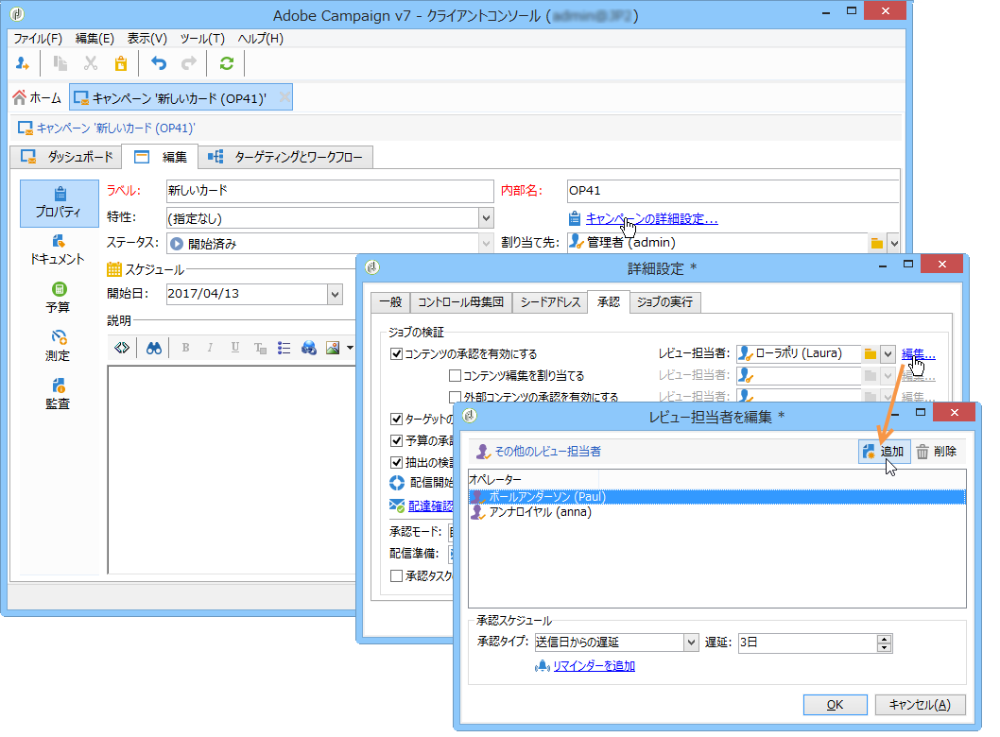

# マーケティングキャンペーンの承認 {#approving-marketing-campaigns}

## 承認プロセス {#approval-process}

キャンペーンの各種プロセス（ターゲット設定、コンテンツ、予算、抽出、校正の送信）の監視と制御を完全かつ確実におこなうために、配信の各段階で承認を要求できます。

>[!NOTE]
>
>レビュー担当者が承認に対して適切な権限を持っていることを確認する必要があります。 また、セキュリティゾーンが正しく定義されていることも確認してください。

承認リクエストを通知するために、レビュー担当者として指定されている Adobe Campaign オペレーターに通知 E メールが送信されます。

承認手順は、「配信の確認と承 [認」に示されます](#checking-and-approving-deliveries)。

>[!NOTE]
>
>配信のオーナーのみが配信を開始できます。In order for another operator (or operator group) to be able to start a delivery, you have to add them as reviewers in the **[!UICONTROL Delivery start:]** field.\
>「レビュー担当者の選 [択」も参照](#selecting-reviewers)。

### 動作の仕組み {#operating-principle-}

例えば、予算承認のための標準的な E メールは、次のようになります。

レビュー担当のオペレーターは、関連する手順を承認するかどうかを選択できます。

オペレーターが選択を承認すると、ジョブの承認または却下が配信ダッシュボードに転送されます。

The information is also available in the approval logs of the campaign (Accessed via the **[!UICONTROL Edit > Tracking > Approvals]** tab):

これらの通知は、承認を有効にした各プロセスに影響を与えるオペレーターに送信されます。

承認は、キャンペーンテンプレート、個々の各キャンペーンまたは配信に対して有効にできます。

承認が必要なジョブは、承認を担当する演算子と同様に、キャンペーンテンプレートですべて選択されます(「> **[!UICONTROL Properties]** > **[!UICONTROL Advanced campaign settings...]****[!UICONTROL Approvals]** 」タブ)（このオプションが有効になっていない場合は、通知を受け取ります）。 For more on this, refer to [Approving processes](#approving-processes).

These settings can be overridden for each campaign created using this template, and individually for each campaign delivery: click the **[!UICONTROL Properties]** button, then the **[!UICONTROL Approvals]** tab.

次の例では、配信コンテンツに承認は必要ありません。

### レビュー担当者の選択 {#selecting-reviewers}

承認のタイプごとに、承認を担当するオペレーターまたはオペレーターグループを配信のドロップダウンリストから選択します。Additional operators can be added using the **[!UICONTROL Edit...]** link. このウィンドウでは承認期日を編集することもできます。

レビュー担当者を指定しない場合は、キャンペーンマネージャーが承認を担当し、通知を受け取ります。The campaign manager is specified in the **[!UICONTROL Edit > Properties]** tab of the campaign:

>[!NOTE]
>
>All other Adobe Campaign operators with **[!UICONTROL Administrator]** rights can also approve jobs, but they will not receive notifications.\
>デフォルトでは、承認オペレーターが定義されている場合に、キャンペーンマネージャーが承認を実行したり、配信を開始することはできません。この動作を変更し、キャンペーンマネージャーによる配信の承認または開始を許可するには、**NmsCampaign_Activate_OwnerConfirmation** オプションを **1** の値で作成します。

### 承認モード {#approval-modes}

#### ダッシュボードからの承認 {#approval-via-the-dashboard}

コンソールまたは Web インターフェイスからジョブを承認するには、キャンペーンダッシュボード上の適切なリンクをクリックします。配信トラッキングまたは配信ダッシュボードからもジョブを承認できます。

承認する情報を確認し、承認するか却下するかを選択し、必要に応じてコメントを入力します。Click **[!UICONTROL Ok]** to save.

>[!NOTE]
>
>別のオペレーターがプロセスを既に承認している場合、承認リンクは表示されません。

#### 通知メッセージからの承認 {#approval-via-notification-messages}

Click the link available in the notification message (see [Notifications](#notifications)). 以下に示すように、ログイン名およびパスワードを入力するように求められます。

Select **[!UICONTROL Accept]** or **[!UICONTROL Reject]** and enter a comment if necessary.

クリック **[!UICONTROL Validate]**.

>[!NOTE]
>
>処理中に警告が発生した場合は、通知内に警告が表示されます。

#### 承認トラッキング {#approval-tracking}

この情報は数か所に表示されます。

* キャンペーン承認ログで、 **[!UICONTROL Approvals]** タブのサブタブを選択し **[!UICONTROL Edit > Tracking]** ます。

   

* キャンペーン配信ログで、 **[!UICONTROL Deliveries]** タブのサブタブを選択し **[!UICONTROL Edit > Tracking]** ます。

   

* The approval status for each delivery can be viewed by clicking the **[!UICONTROL Hide/show log]** option of the **[!UICONTROL Summary]** tab.

   

* This information can also be accessed via the **[!UICONTROL Tracking > Approvals]** tab of each delivery:

   

>[!NOTE]
>
>オペレーターがジョブを承認または却下すると、その他のレビュー担当オペレーターは承認を実行できなくなります。

#### 自動承認と手動承認 {#automatic-and-manual-approval}

ターゲティングワークフローの作成時に承認が自動になっていると（デフォルトモード）、Adobe Campaign は承認リンクを表示するか、承認が必要になるとすぐに通知を送信します。

To choose the approval mode (manual or automatic), click the **[!UICONTROL Edit > Properties]** tab of the campaign or campaign template, then click **[!UICONTROL Advanced campaign settings...]** and finally the **[!UICONTROL Approvals]** tab.

>[!NOTE]
>
>選択した承認モードは、キャンペーンのすべての配信に適用されます。

ターゲティングワークフローを作成する際に、手動承認を使用して、承認リンクの作成や、通知の自動送信をおこなわないようにすることができます。The campaign dashboard then offers a **[!UICONTROL Submit targeting for approval]** link to launch the approval process manually.

確認メッセージを使用して、この配信用に選択したジョブの承認を承認できます。

すると、「承認」ボタンが（この配信の）キャンペーンダッシュボード、配信ダッシュボードおよび配信トラッキングに表示されます。通知が有効な場合、通知も同時に送信されます。

この方法で承認を有効にすれば、レビュー担当者に誤った通知を送信することなく、ターゲティングに取り組むことができます。

### 通知 {#notifications}

通知は、プロセスが承認待ちであることをレビュー担当者に知らせるために送信される、特定の E メールメッセージです。オペレーターがメッセージ内のリンクをクリックすると、認証ページが表示され、ログイン後に情報を確認して、ジョブを承認または却下できます。承認ウィンドウでコメントを入力することもできます。

通知 E メールの内容はパーソナライズできます。詳しくは、通 [知コンテンツを参照してくださ](#notification-content)い。

#### 通知の有効化／無効化 {#enabling-disabling-notification}

デフォルトでは、キャンペーンテンプレート、キャンペーンまたは配信で関連ジョブの承認が有効になっている場合に通知メッセージが送信されます。ただし、コンソールからのみ承認を許可するように、通知を無効にすることができます。

これを行うには、キャンペーンまたはキャンペーンテンプレートの承認ウィンドウを編集し( > **[!UICONTROL Edit > Properties]** > **[!UICONTROL Advanced campaign settings...]** > **[!UICONTROL Approvals]** tab)、を選択しま **[!UICONTROL Do not enable notification sending]**&#x200B;す。

#### 通知コンテンツ {#notification-content}

Notification content is defined in a specific template: **[!UICONTROL Notification of validations for the marketing campaign]**. このテンプレートは、Adobe Campaignツリ **[!UICONTROL Administration > Campaign management > Technical delivery templates]** ーのフォルダーに保存されます。

## 配信の確認と承認 {#checking-and-approving-deliveries}

Adobe Campaignでは、マーケティングキャンペーンの主要なステージの承認プロセスをコラボレーションモードで設定できます。

ダイレクトメール配信の場合、Adobe Campaign のオペレーターは、抽出ファイルを発送担当に送信する前に確認できます。また、必要に応じてフォーマットを変更し、抽出を再開できます。See [Approving an extraction file](#approving-an-extraction-file).

各キャンペーンについて、配信ターゲット、コンテンツ(「コンテンツの承認 」を参照)およびコストを承認できます。 承認を担当する Adobe Campaign オペレーターは、E メールで通知を受け、コンソールから、または Web 接続を介して、承認を許可または却下できます。「プロセ [スの承認](#approving-processes)」を参照。

この検証フェーズが完了したら、配信を開始できます。詳しくは、 [配信の開始を参照してください](../../campaign/using/marketing-campaign-deliveries.md#starting-a-delivery)。

>[!NOTE]
>
>For further information about approval modes and tracking, see [Approval process](#approval-process).

### プロセスの承認 {#approving-processes}

承認が必要なステージは、（Webインターフェイスのコンソールを介して）キャンペーンダッシュボードに表示されます。 配信トラッキングテーブルと配信ダッシュボードにも表示されます。

At this point, the status of the campaign is **[!UICONTROL To validate]**.

>[!NOTE]
>
>* 承認を受ける必要があるプロセスを選択するには、キャンペーンテンプレートを変更します。For more on this, refer to [Campaign templates](../../campaign/using/marketing-campaign-templates.md#campaign-templates).
   >
   >
* Also refer to the section on the [Approval process](#approval-process).

>[!NOTE]
>
>In a targeting workflow, if an error linked to a configuration issue occurs during message preparation, the **[!UICONTROL Restart message preparation]** link is shown on the dashboard. ターゲティングステージを回避しながらメッセージの準備を再開するには、エラーを修正してこのリンクをクリックします。

キャンペーン内の配信ごとに、以下のプロセスを承認できます。

* **ターゲティング、コンテンツ、予算**

   ジョブ承認設 **[!UICONTROL Enable target approval]**&#x200B;定ウィンドウ **[!UICONTROL Enable content approval]** で、 **[!UICONTROL Enable budget approval]** 、またはのオプションを選択すると、該当する配信に関する関連リンクがキャンペーンダッシュボードに表示されます。

   >[!NOTE]
   >
   >「予算の承認」は、承認設定ウィンドウでターゲティングの承認が有効な場合にのみ表示されます。予算承認のリンクは、ターゲットが分析済みの場合にのみ表示されます。また、このリンクはターゲットの承認のリンクと共に表示されます。

   承認設定ウ **[!UICONTROL Assign content editing]** ィンドウ **[!UICONTROL External content approval]** でオプションまたはを選択した場合、ダッシュボードにとリンクが表 **[!UICONTROL Available content]** 示され **[!UICONTROL External content approval]** ます。

   コンテンツを承認すると、送信済みの配達確認にアクセスできます。

* **抽出の承認（ダイレクトメール配信）**

   When **[!UICONTROL Enable extraction approval]** is selected in the approval settings window, the extracted file must be approved before the router can be notified.

   An **[!UICONTROL Approve content]** link is available on the campaign dashboard as shown below:

   

   抽出ファイルを承認ボックスからプレビューして、許可または却下できます。

   

   >[!NOTE]
   >
   >抽出ファイルのプレビューでは、データサンプルのみを扱います。出力ファイル全体が読み込まれるわけではありません。

* **関連する配信の承認**

   このオ **[!UICONTROL Enable individual approval of each associated delivery]** プションは、セカンダリ配信に関連付けられた1つのメイン配信に使用されます。 デフォルトでは、このオプションは選択されていないので、メインの配信全体を承認できます。このオプションを選択した場合、各配信を個別に承認する必要があります。

   

#### 承認するプロセスの選択 {#choosing-the-processes-to-be-approved}

承認フェーズは、キャンペーンに関連付けられたテンプレートを使用して定義されます。 承認する要素をテンプレートから選択し、その承認をおこなう Adobe Campaign オペレーターを指定する必要があります。For more on this, refer to [Campaign templates](../../campaign/using/marketing-campaign-templates.md#campaign-templates).

>[!NOTE]
>
>キャンペーンまたはキャンペーンテンプレートの承認設定は、このキャンペーンにリンクされる将来の配信すべてに適用されます。設定の変更が以前の配信に適用されることはありません。

この情報は、キャンペーンごとおよび配信ごとに上書きできます。

For a campaign, click the **[!UICONTROL Edit > Properties]** tab, then the **[!UICONTROL Advanced campaign settings...]** link, and finally the **[!UICONTROL Approvals]** sub-tab to access the approvals configuration page.

承認するプロセスを選択／選択解除したり、承認を担当する Adobe Campaign オペレーターを指定したりできます。個人のオペレーター、オペレーターのグループ、オペレーターのリストを指定できます。

To select a list of operators, click the **[!UICONTROL Edit...]** link to the right of the field designating the first reviewer and add as many operators as necessary, as shown below:

>[!NOTE]
>
>* レビュー担当者のリストを定義した場合、1 人のレビュー担当者がジョブを許可するとすぐにジョブが承認されます。すると、関連する承認リンクはダッシュボードに表示されなくなります。通知の送信が有効な場合、別のレビュー担当者が通知メッセージ内の承認リンクをクリックすると、別のオペレーターが既にジョブを承認したことが通知されます。
>* レビュー担当者編集ウィンドウの下部セクションで、キャンペーンの承認スケジュールを定義できます。デフォルトでは、レビュー担当者は送信日から 3 日以内にプロセスを承認します。該当するオペレーターに承認期日前に自動的に送信されるように、リマインダーを設定できます。
>* このセクションからリマインダーを追加できます。
>

For each delivery, click the **[!UICONTROL Audit]** button and the **[!UICONTROL Approvals]** tab to view and edit approval dates and automatic reminders.

>[!NOTE]
>
>このタブは、コンテンツ承認プロセスが開始されると表示されます。

### コンテンツの承認 {#approving-content}

>[!CAUTION]
>
>コンテンツを承認するには、配達確認サイクルが必須です。配達確認を使用して、情報やパーソナライゼーションデータの表示を承認し、リンクが機能していることを確認できます。配達確認の作成とそのライフサイクルについて詳しくは、[メッセージの送信](../../delivery/using/steps-validating-the-delivery.md#sending-a-proof)の節を参照してください。
>
>以下に詳しく説明するコンテンツ承認機能は、配達確認に追加するようにデザインされています。

コンテンツの承認サイクルを設定できます。 To do this, select the **[!UICONTROL Enable content approval]** option in the approval settings window. コンテンツ承認サイクルの主な手順は次のとおりです。

1. After creating a new delivery, the campaign manager clicks the **[!UICONTROL Submit content]** link on the campaign dashboard to start the content approval cycle.

   

   >[!NOTE]
   >
   >承認設定ウ **[!UICONTROL Enable the sending of proofs]** ィンドウで（電子メール配信の場合）また **[!UICONTROL Enable the sending and approval of proofs]** は（ダイレクトメール配信の場合）オプションが選択されている場合、プルーフが自動的に送信されます。

1. 通知 E メールがコンテンツの担当者に送信されます。この担当者は、コンテンツを承認するかどうかを選択できます。

   * 通知 E メールから：

      

      >[!NOTE]
      >
      >通知 E メールには、既に送信された配達確認へのリンクが含まれています。このインスタンスに対して「**配信品質**」オプションが有効になっている場合は、各種 Web メール用のメッセージのレンダリングへのリンクが含まれることもあります。

   * コンソールまたは Web インターフェイス、配信トラッキング、配信ダッシュボードまたはキャンペーンダッシュボードから：

      

      >[!NOTE]
      >
      >This campaign dashboard lets you view the list of proofs that have been sent, by clicking the **[!UICONTROL Inbox rendering...]** link. To view their content, click the **[!UICONTROL Detail]** icon to the right of the list.

      

1. キャンペーンの担当者に、コンテンツが承認されたかどうかを知らせる通知電子メールが送信されます。

   >[!NOTE]
   >
   >キャンペーンの担当者は、コンテンツ承認サイクルをいつでも再開できます。これを行うには、キャンペーンダッシュボードの行(配 **[!UICONTROL Content status]** 信レベル)にあるリンクをクリックし、をクリックしま **[!UICONTROL Reset content approval to submit it again]**&#x200B;す。

   

#### コンテンツ編集を割り当てる {#assign-content-editing}

このオプションを使用して、Web マスターなどコンテンツ編集の担当者を定義できます。If the **[!UICONTROL Assign content editing]** option is selected in the approval settings window, several approval steps are added between delivery creation and delivery of the notification email to the person in charge of content:

1. After creating a new delivery, the person responsible for the campaign clicks the **[!UICONTROL Submit content editing]** link in the campaign dashboard to start the content editing cycle.

   

1. コンテンツ編集担当者が、コンテンツが使用可能になったことを知らせる E メールを受け取ります。

   

1. コンテンツ編集担当者はコンソールにログオンし、シンプルなウィザードで配信を開いて編集し、件名、HTML およびテキストコンテンツを変更し、配達確認を送信できます。

   

   >[!NOTE]
   >
   >承認設定ウ **[!UICONTROL Enable the sending of proofs]** ィンドウで（電子メール配信の場合）また **[!UICONTROL Enable the sending and approval of proofs]** は（ダイレクトメール配信の場合）オプションが選択されている場合、プルーフが自動的に送信されます。

1. 配信コンテンツの変更を完了したら、コンテンツ編集担当者はコンテンツを使用可能にすることができます。

   次のどちらかの方法を実行します。

   * click the **[!UICONTROL Available content]** link via the Adobe Campaign console.

      

   * 通知メッセージ内のリンクをクリックして、コンテンツの可用性を承認します。

      

      オペレーターは、コンテンツをキャンペーン担当者に送信する前にコメントを追加できます。

      

      レビュー担当者は、通知メッセージを使用して、コンテンツを承認または却下できます。

      

#### 外部コンテンツの承認 {#external-content-approval}

このオプションを使用すると、ブランド通信の一貫性、料金など、配信レンダリングの承認を担当する外部演算子を定義できます。 承認設定ウ **[!UICONTROL External content approval]** ィンドウでこのオプションを選択すると、コンテンツの承認と、キャンペーンの担当者への通知の配信との間に、いくつかの承認手順が追加されます。

1. コンテンツが承認されたことを知らせ、外部の承認をリクエストする通知 E メールを外部コンテンツマネージャーが受け取ります。
1. 通知 E メールには、送信された配達確認へのリンクが含まれています。このリンクを使用して、配信レンダリングと、配信コンテンツを承認または却下するためのボタンを表示できます。

   >[!NOTE]
   >
   >このリンクは、1 つ以上の配達確認が送信済みの場合にのみ表示されます。そうでない場合、配信レンダリングはコンソールまたは Web インターフェイスからのみ表示できます。

   

### 抽出ファイルの承認 {#approving-an-extraction-file}

オフライン配信の場合は、設定に応じて、発送担当に送信する抽出ファイルが生成されます。抽出ファイルのコンテンツは、使用するエクスポートテンプレートによって異なります。

When the content, targeting and budget have been approved, the delivery changes to **[!UICONTROL Extraction pending]** until the extraction workflow for the campaigns is launched.

On the extraction request date, the extraction file is created and the delivery status changes to **[!UICONTROL File to approve]**.

抽出されたファイルのコンテンツを（ファイル名をクリックして）確認したり、抽出ファイルを承認したり、必要であればダッシュボードのリンクを使用してフォーマットを変更し、抽出を再開できます。

ファイルが承認されたら、通知 E メールを発送担当に送信できます。詳しくは、「オフライン配信の開始 [」を参照してください](../../campaign/using/marketing-campaign-deliveries.md#starting-an-offline-delivery)。
