# 関連付けられたドキュメントの管理 {#managing-associated-documents}

レポート、写真、web ページ、図など、様々なドキュメントをキャンペーンに関連付けることができます。これらのドキュメントは、任意のフォーマット（Microsoft Word、PowerPoint、PNG、JPG、Acrobat PDFなど）で作成できます。

>[!IMPORTANT]
>
>この機能は、小規模なアセットやドキュメント向けのものです。

キャンペーンでは、プロモーションクーポン、特定のブランドや店舗に関連する特別オファーなど、他のアイテムも参照できます。これらの要素をアウトラインに含めると、ダイレクトメール配信に関連付けることができます。 [配信の概要を介してリンクしたリソースの関連付けと構造化](#associating-and-structuring-resources-linked-via-a-delivery-outline)を参照してください。

>[!NOTE]
>
>Campaign のマーケティングリソース管理モジュールを使用している場合は、複数のユーザーが共同作業に利用できるマーケティングリソースのライブラリを管理することもできます。 [詳細情報](../../mrm/using/managing-marketing-resources.md)。

## ドキュメントの追加 {#adding-documents}

ドキュメントは、キャンペーンレベル（コンテキストドキュメント）でもプログラムレベル（一般ドキュメント）でも関連付けることができます。

「**[!UICONTROL ドキュメント]**」タブには次が含まれます。

* コンテンツに必要なすべてのドキュメント（テンプレート、画像など）のリスト 適切な権限を持ったAdobe Campaignのオペレーターがローカルにダウンロードできる，
* 発送担当向けの情報を含むドキュメント（該当する場合）。

ドキュメントは、**[!UICONTROL 編集／「ドキュメント」]**&#x200B;タブからプログラムまたはキャンペーンにリンクされます。

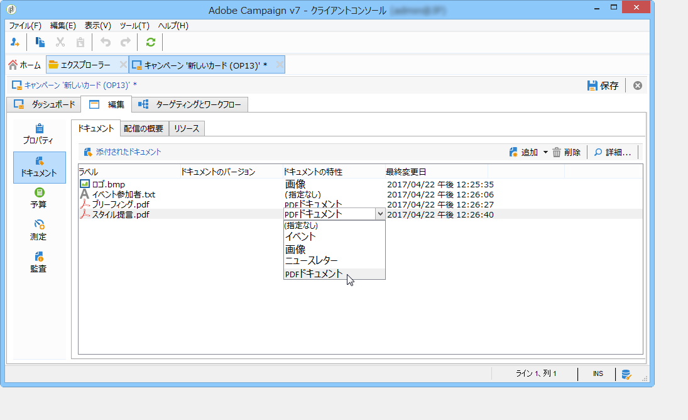

キャンペーンダッシュボードに表示されるリンクからも、ドキュメントをキャンペーンに追加できます。

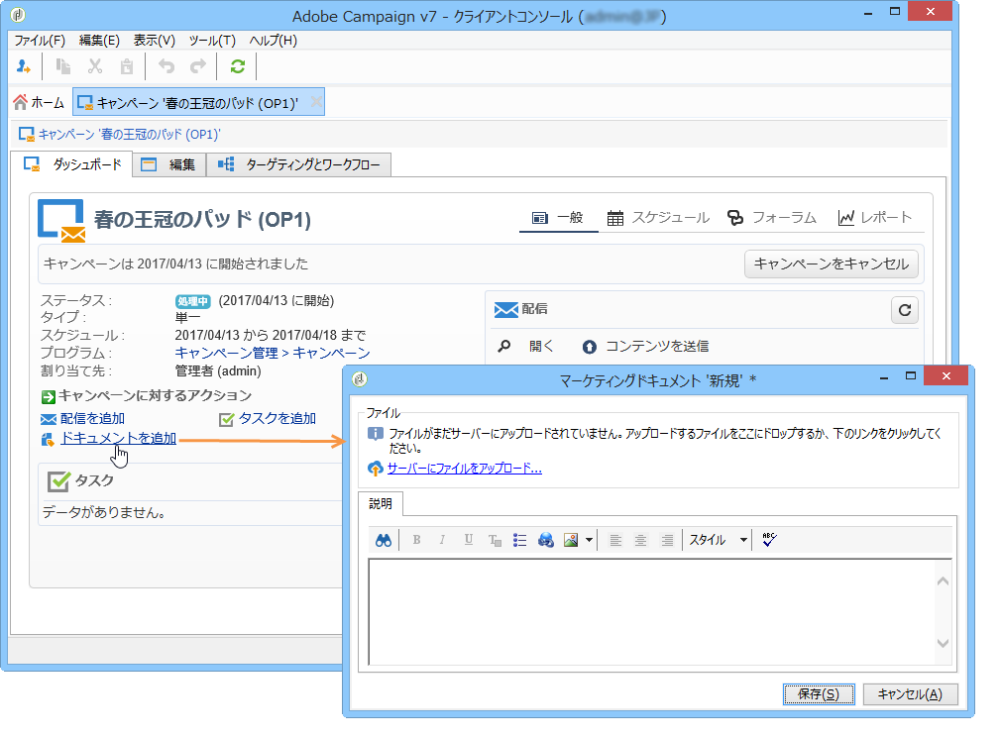

ファイルの内容を表示し、情報を追加するには、「**[!UICONTROL 詳細]**」アイコンをクリックします。

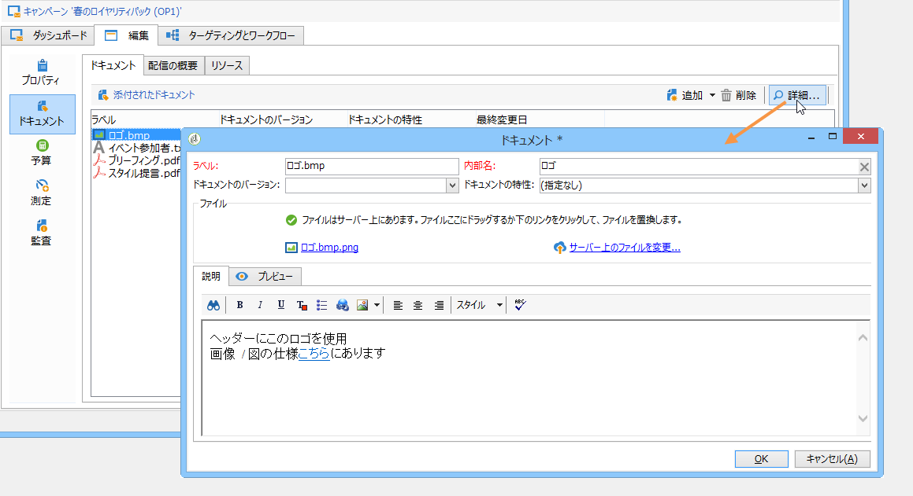

次の例に示すように、キャンペーンに関連付けられたドキュメントは、ダッシュボードの「**[!UICONTROL ドキュメント]**」セクションにまとめられます。

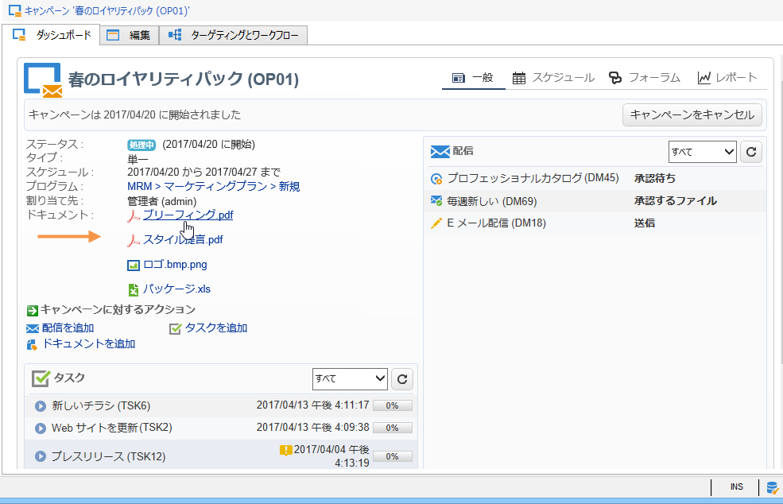

このビューからドキュメントを編集および変更することもできます。

## 配信の概要を介してリンクしたリソースの関連付けと構造化 {#associating-and-structuring-resources-linked-via-a-delivery-outline}

>[!NOTE]
>
>配信の概要は、ダイレクトメールキャンペーンのコンテキストでのみ使用します。

配信の概要は、構造化された要素（ドキュメント、店舗、プロモーションクーポンなど）のセットを表します 会社が作成した、特定のキャンペーン用の。

これらの要素は配信の概要にグループ化され、各配信概要は配信に関連付けられます。配信に添付するために、**サービスプロバイダー**&#x200B;に送信する抽出ファイルで参照されます。 例えば、ある支店と、その支店が使用するマーケティングカタログを参照する配信の概要を作成できます。

キャンペーンでは、配信の概要を使用して、関連する支店、提供するプロモーションオファー、ローカルイベントへの招待など、特定の条件に応じて配信に関連付ける外部要素を構造化できます。

### アウトラインの作成 {#creating-an-outline}

概要を作成するには、関連するキャンペーンの&#x200B;**[!UICONTROL 編集／「ドキュメント」]**&#x200B;タブで「**[!UICONTROL 配信の概要]**」サブタブをクリックします。

>[!NOTE]
>
>このタブが表示されていない場合、このキャンペーンではこの機能を使用できません。 キャンペーンテンプレートの設定を参照してください。
>   
>テンプレートについて詳しくは、[この節](../../campaign/using/marketing-campaign-templates.md#campaign-templates)を参照してください。

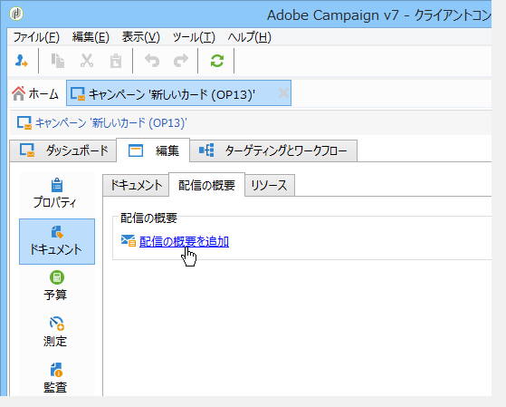

次に、「**[!UICONTROL 配信の概要を追加]**」をクリックし、次の手順でキャンペーンの概要の階層を作成します。

1. ツリーのルートを右クリックし、**[!UICONTROL 新規／配信の概要]**&#x200B;を選択します。
1. 作成した概要を右クリックし、**[!UICONTROL 新規／項目]**&#x200B;または&#x200B;**[!UICONTROL 新規／パーソナライゼーションフィールド]**&#x200B;を選択します。

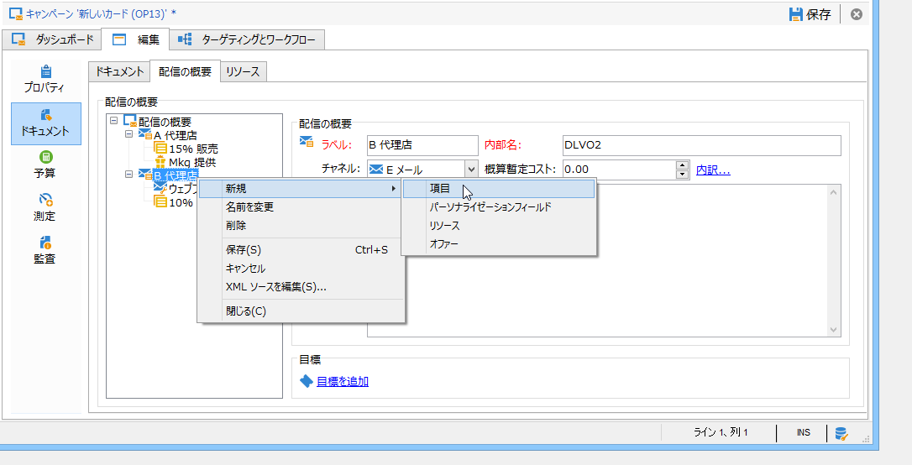

概要には、項目、パーソナライゼーションフィールド、リソースおよびオファーを含めることができます。

* 項目には、ここで参照および記述し、配信に添付する物理的なドキュメントなどを指定できます。
* パーソナライゼーションフィールドを使用して、受信者ではなく配信に関連したパーソナライゼーション要素を作成できます。 これにより、特定のターゲット（ウェルカムオファー、割引など）に対する配信で使用される値を作成できます。 これらはAdobe Campaignで作成され、**[!UICONTROL パーソナライゼーションフィールドの読み込み…]** リンクを介してアウトラインに読み込まれます。

  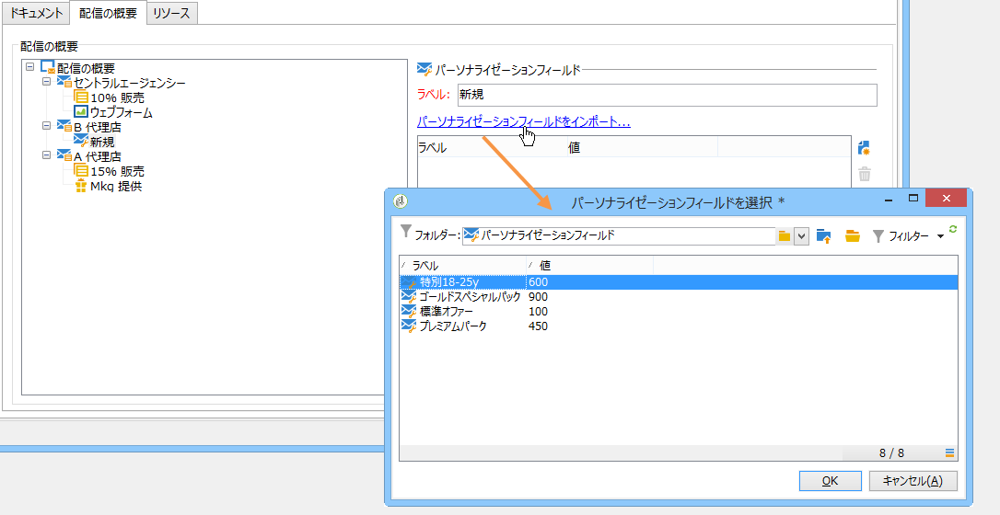

  は、リスト領域の右側の&#x200B;**[!UICONTROL 追加]**&#x200B;アイコンをクリックして、概要内で直接作成することもできます。

  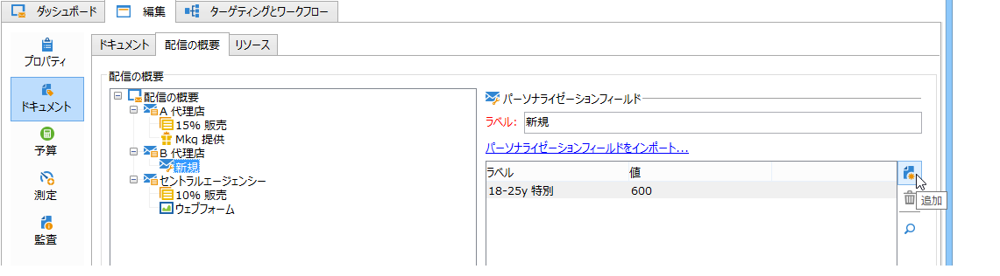

* リソースは、「**[!UICONTROL キャンペーン]**」タブの「**[!UICONTROL リソース]**」リンクを通じてアクセスできるマーケティングリソースダッシュボードで生成したマーケティングリソースです。

  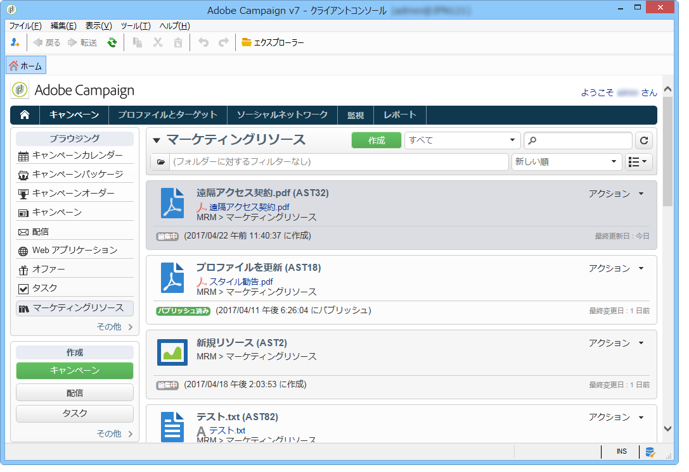

  >[!NOTE]
  >
  >マーケティングリソースについて詳しくは、[この節](../../mrm/using/managing-marketing-resources.md)を参照してください。

### アウトラインの選択 {#selecting-an-outline}

次の例に示すように、配信ごとに、抽出の概要専用のセクションから関連付ける概要を選択できます。

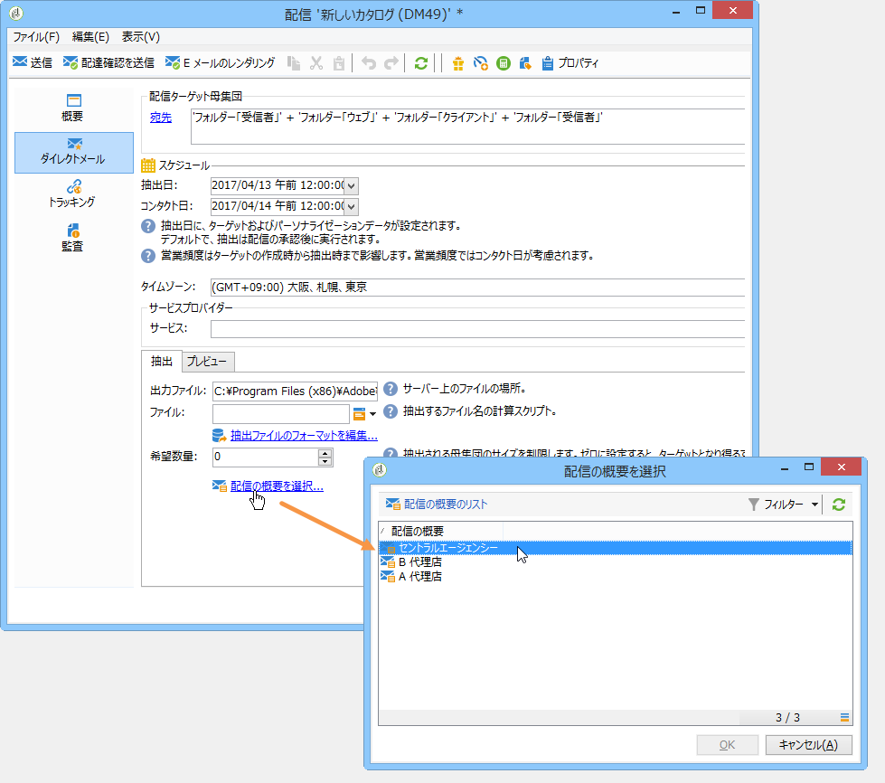

選択された概要が、ウィンドウの下部セクションに表示されます。 この概要は、フィールドの右側のアイコンを使用して編集したり、ドロップダウンリストを使用して変更したりできます。

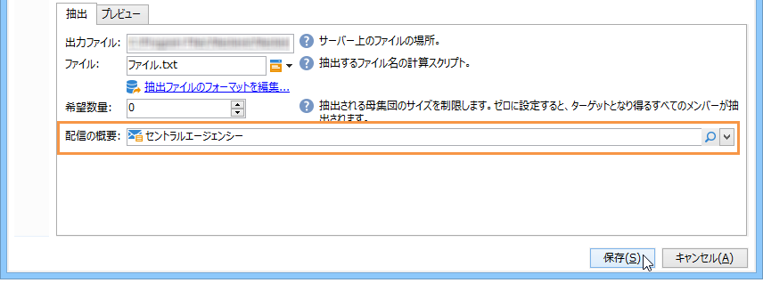

配信の「**[!UICONTROL 概要]**」タブにもこの情報が表示されます。

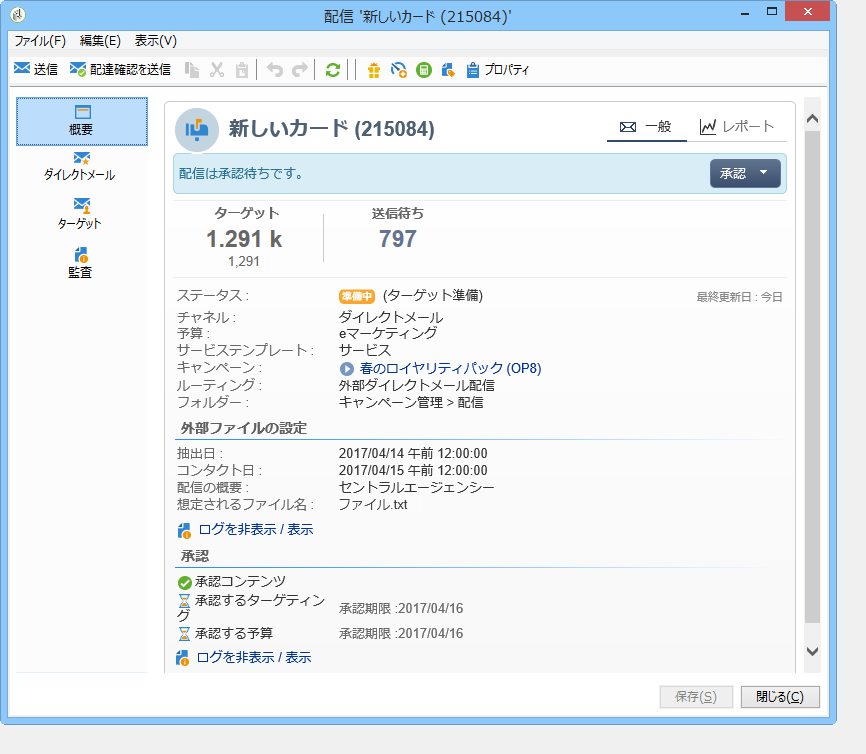

### 抽出結果 {#extraction-result}

抽出してサービスプロバイダーに送信されたファイルでは、アウトラインの名前と、必要に応じてその特性（コスト、説明など）が表示されます。 は、サービスプロバイダーに関連付けられたエクスポートテンプレートの情報に従ってコンテンツに追加されます。

次の例では、配信に関連付けられた概要のラベル、推定コスト、説明が抽出ファイルに追加されます。

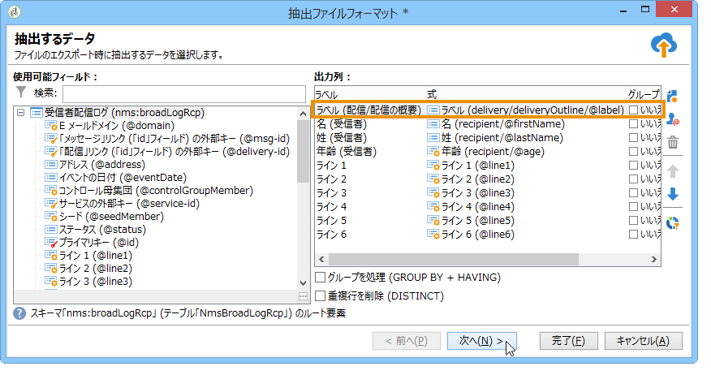

エクスポートモデルは、該当する配信用に選択されたサービスプロバイダーに関連付ける必要があります。 [この節](../../campaign/using/providers-stocks-and-budgets.md#creating-service-providers-and-their-cost-structures)を参照してください。

>[!NOTE]
>
>エクスポートについて詳しくは、[この節](../../platform/using/get-started-data-import-export.md)を参照してください。
