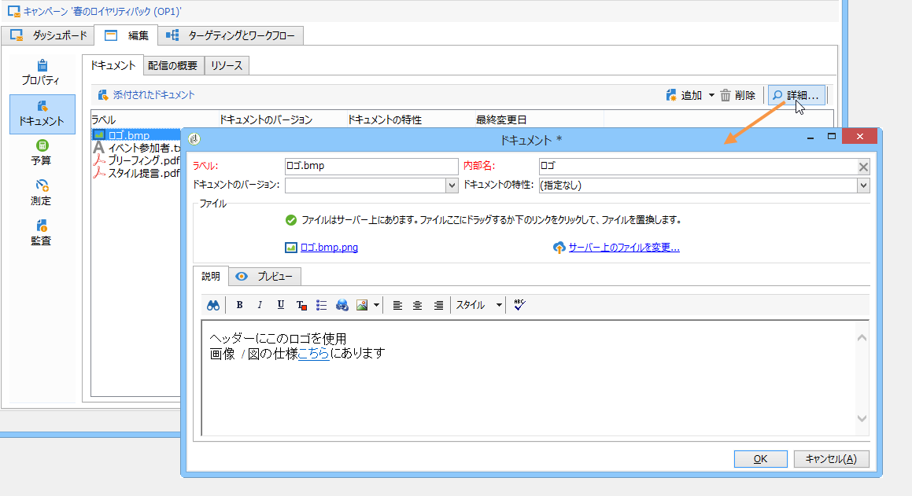
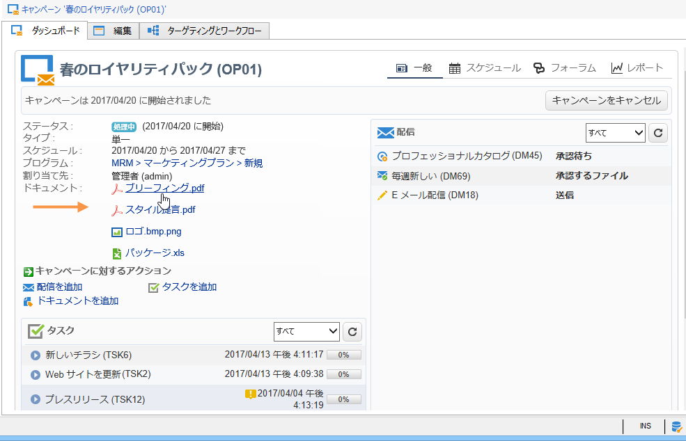
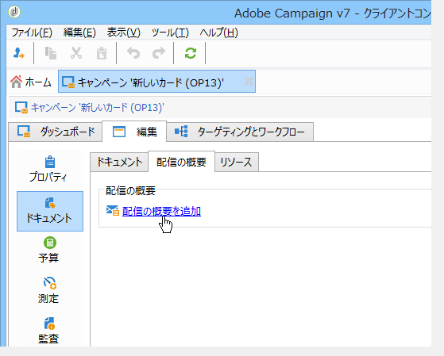
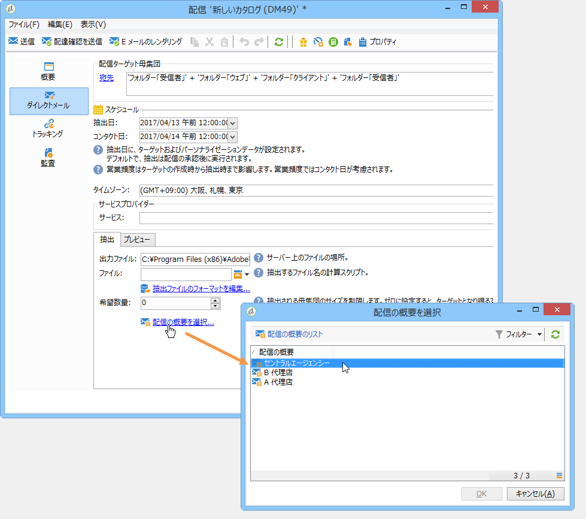
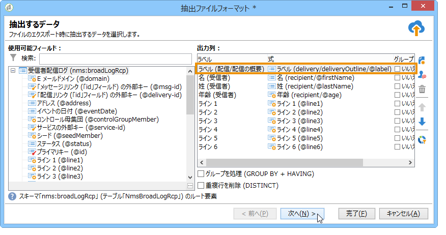

# 関連ドキュメントの管理{#managing-associated-documents}

キャンペーンには、次の様々なドキュメントを関連付けることができます。レポート、写真、Webページ、図など これらのドキュメントは、任意の形式(Microsoft Word、PowerPoint、PNG、JPG、AcrobatPDFなど)で指定できます。

>[!IMPORTANT]
>
>この機能は、小規模なアセットやドキュメント向けに予約されています。

キャンペーンでは、プロモーションクーポン、特定のブランドや店舗に関する特別オファーなど、他の商品も参照できます。 これらの要素をアウトラインに含める場合は、ダイレクトメール配信に関連付けることができます。 「[配信の概要を介してリンクされたリソースの関連付けと構造化](#associating-and-structuring-resources-linked-via-a-delivery-outline)」を参照してください。

>[!NOTE]
>
>キャンペーンマーケティングリソース管理モジュールを使用している場合は、複数のユーザーが共同作業で使用できるマーケティングリソースのライブラリを管理することもできます。 [詳細情報](../../campaign/using/managing-marketing-resources.md)。

## 追加ドキュメント{#adding-documents}

ドキュメントは、キャンペーンレベル（コンテキストドキュメント）でもプログラムレベル（一般ドキュメント）でも関連付けることができます。

「**[!UICONTROL ドキュメント]**」タブには次が含まれます。

* 適切な権限を持つ Adobe Campaign オペレーターがローカルにダウンロードできる、コンテンツに必要なすべてのドキュメント（テンプレート、画像など）のリスト。
* 発送担当向けの情報を含むドキュメント（該当する場合）。

ドキュメントは、**[!UICONTROL 編集／「ドキュメント」]**&#x200B;タブからプログラムまたはキャンペーンにリンクされます。

キャンペーンダッシュボードに表示されるリンクからも、ドキュメントをキャンペーンに追加できます。

ファイルの内容を表示し、情報を追加するには、「**[!UICONTROL 詳細]**」アイコンをクリックします。

次の例に示すように、キャンペーンに関連付けられたドキュメントは、ダッシュボードの「**[!UICONTROL ドキュメント]**」セクションにまとめられます。

このビューからドキュメントを編集および変更することもできます。

## 配信の概要{#associating-and-structuring-resources-linked-via-a-delivery-outline}を介してリソースを関連付け、構築する

>[!NOTE]
>
>配信の概要は、ダイレクトメールキャンペーンのコンテキストでのみ使用します。

「配信の概要」は、構造化された一連の要素(ドキュメント、店舗、プロモーションクーポンなど)を表します。 会社によって作成され、特定のキャンペーンに対して作成されます。

これらの要素は配信の概要にグループ化され、各配信の概要は配信に関連付けられます。配信に添付するために、**サービスプロバイダー**&#x200B;に送信される抽出ファイルで参照されます。 例えば、ある支店と、その支店が使用するマーケティングカタログを参照する配信の概要を作成できます。

キャンペーンでは、配信の概要を使用して、関連する支店、提供するプロモーションオファー、ローカルイベントへの招待など、特定の条件に応じて配信に関連付ける外部要素を構造化できます。

### アウトラインの作成{#creating-an-outline}

概要を作成するには、関連するキャンペーンの&#x200B;**[!UICONTROL 編集／「ドキュメント」]**&#x200B;タブで「**[!UICONTROL 配信の概要]**」サブタブをクリックします。

>[!NOTE]
>
>このタブが表示されていない場合、このキャンペーンではこの機能を使用できません。キャンペーンテンプレートの設定を参照してください。
>   
>テンプレートの詳細については、[この](../../campaign/using/marketing-campaign-templates.md#campaign-templates)を参照してください。

次に、「**[!UICONTROL 配信の概要を追加]**」をクリックし、次の手順でキャンペーンの概要の階層を作成します。

1. ツリーのルートを右クリックし、**[!UICONTROL 新規／配信の概要]**&#x200B;を選択します。
1. 作成した概要を右クリックし、**[!UICONTROL 新規／項目]**&#x200B;または&#x200B;**[!UICONTROL 新規／パーソナライゼーションフィールド]**&#x200B;を選択します。

概要には、項目、パーソナライゼーションフィールド、リソースおよびオファーを含めることができます。

* 項目には、ここで参照および記述し、配信に添付する物理的なドキュメントなどを指定できます。
* パーソナライゼーションフィールドを使用して、受信者ではなく配信に関連したパーソナライゼーション要素を作成できます。これにより、特定のターゲット向けの配信（ウェルカムオファーやディスカウントなど）で使用する値を作成できます。こうした値は Adobe Campaign で作成し、「**[!UICONTROL パーソナライゼーションフィールドをインポート...]**」リンクから概要にインポートします。

   

   パーソナライゼーション要素は、リスト領域の右側の&#x200B;**[!UICONTROL 追加]**&#x200B;アイコンをクリックして、概要内で直接作成することもできます。

   

* リソースは、**[!UICONTROL キャンペーン]**&#x200B;タブの&#x200B;**[!UICONTROL リソース]**&#x200B;リンクを介してアクセスされるマーケティングリソースダッシュボードで生成されるマーケティングリソースです。

   

   >[!NOTE]
   >
   >マーケティングリソースの詳細については、[この](../../campaign/using/managing-marketing-resources.md)を参照してください。

### アウトラインを選択{#selecting-an-outline}

次の例に示すように、配信ごとに、抽出の概要専用のセクションから関連付ける概要を選択できます。

選択された概要が、ウィンドウの下部セクションに表示されます。この概要は、フィールドの右側のアイコンを使用して編集したり、ドロップダウンリストを使用して変更したりできます。

配信の「**[!UICONTROL 概要]**」タブにもこの情報が表示されます。

### 抽出結果 {#extraction-result}

抽出され、サービスプロバイダーに送信されたファイル内では、サービスプロバイダーに関連付けられたエクスポートテンプレートの情報に従って、概要名および必要に応じてその特性（コスト、説明など）がコンテンツに追加されます。

次の例では、配信に関連付けられた概要のラベル、推定コスト、説明が抽出ファイルに追加されます。

エクスポートモデルは、該当する配信用に選択されたサービスプロバイダーに関連付ける必要があります。[この節](../../campaign/using/providers--stocks-and-budgets.md#creating-service-providers-and-their-cost-structures)を参照してください。

>[!NOTE]
>
>エクスポートの詳細については、[この](../../platform/using/get-started-data-import-export.md)セクションを参照してください。
