# マーケティングキャンペーン配信 {#marketing-campaign-deliveries}

配信は、キャンペーンダッシュボード、キャンペーンワークフローまたは配信の概要から直接作成できます。

## 配信の作成 {#creating-deliveries}

To create a delivery linked to a campaign, click the **[!UICONTROL Add a delivery]** link in the campaign dashboard.

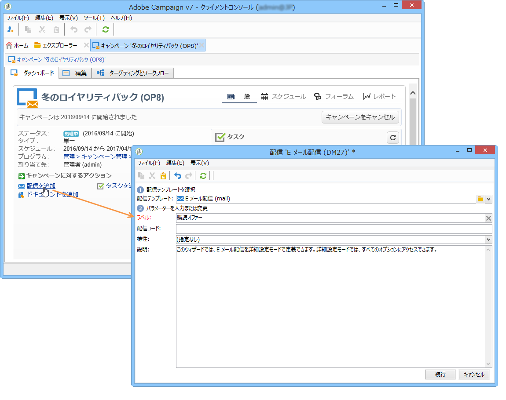

各種の配信（ダイレクトメール、E メール、モバイルチャネル、FAX、電話）に適した設定が提示されます。

>[!NOTE]
>
>配信の作成と設定について詳しくは、[メッセージの送信](../../delivery/using/communication-channels.md)の節を参照してください。

## ターゲット母集団の選択 {#selecting-the-target-population}

配信ごとに、キャンペーンマネージャーが以下のものを定義します。

* メインターゲット。詳しくは、「ワークフローでのメインターゲ [ットの作成」および](#building-the-main-target-in-a-workflow) 「ターゲット母 [集団の選択」を参照してください](#selecting-the-target-population)。
* コントロール母集団。詳しくは、「コントロールグループの [定義」を参照してください](#defining-a-control-group)。
* シードアドレス。詳しくは、[この節](../../delivery/using/about-seed-addresses.md)を参照してください。

この情報の一部は、テンプレートから継承されます。

>[!NOTE]
>
>キャンペーンテンプレートは、キャンペーンテンプ [レートで表示されま](../../campaign/using/marketing-campaign-templates.md#campaign-templates)す。

配信ターゲットを作成するために、データベース内の受信者のフィルタリング条件を定義できます。受信者の選択モードについては、[メッセージの送信](../../delivery/using/steps-defining-the-target-population.md)の節で説明しています。

### 例：受信者のグループへの配信 {#example--delivering-to-a-group-of-recipients}

母集団をリストにインポートし、配信でこのリストをターゲットとして設定できます。

1. To do this, edit the concerned delivery and click the **[!UICONTROL To]** link to change the targeted population.

1. タブで、オ **[!UICONTROL Main target]** プションを選択し、 **[!UICONTROL Defined via the database]** をクリックし **[!UICONTROL Add]** て受信者を選択します。

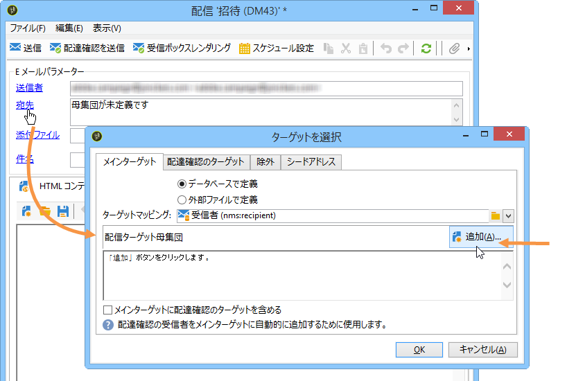

1. を選択 **[!UICONTROL A list of recipients]** し、をク **[!UICONTROL Next]** リックして選択します。

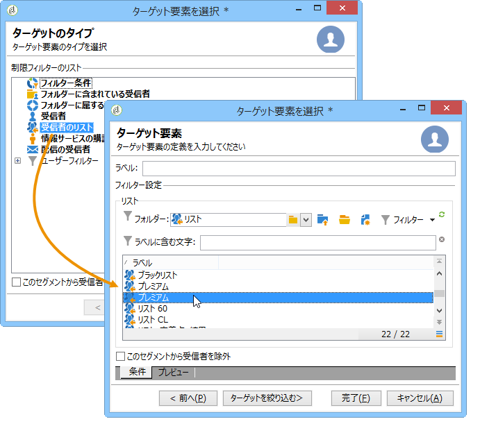

### ワークフローのメインターゲットの作成 {#building-the-main-target-in-a-workflow}

配信のメインターゲットは、ターゲティングワークフローでも定義できます。クエリ、テスト、オペレーター（和集合、重複排除、共有など）を使用して、グラフィカルにターゲットを作成できます。

[ワークフローによる自動化](../../workflow/using/executing-a-workflow.md#architecture)ガイドでは、ワークフローモジュールの仕組みについて、詳しく説明しています。

>[!CAUTION]
>
>同じキャンペーン内に 28 を超えるワークフローを設定することはできません。この上限を超えると、追加のワークフローはインターフェイスに表示されず、エラーが発生する可能性があります。

#### ターゲティングワークフローの作成 {#creating-a-targeting-workflow}

ターゲティングは、ワークフロー内のグラフィカルなシーケンスでフィルタリング条件を組み合わせて作成できます。ターゲットとする母集団およびサブ母集団を要件に合わせて作成できます。To display the workflow editor, click the **[!UICONTROL Targeting and workflows]** tab in the campaign dashboard.

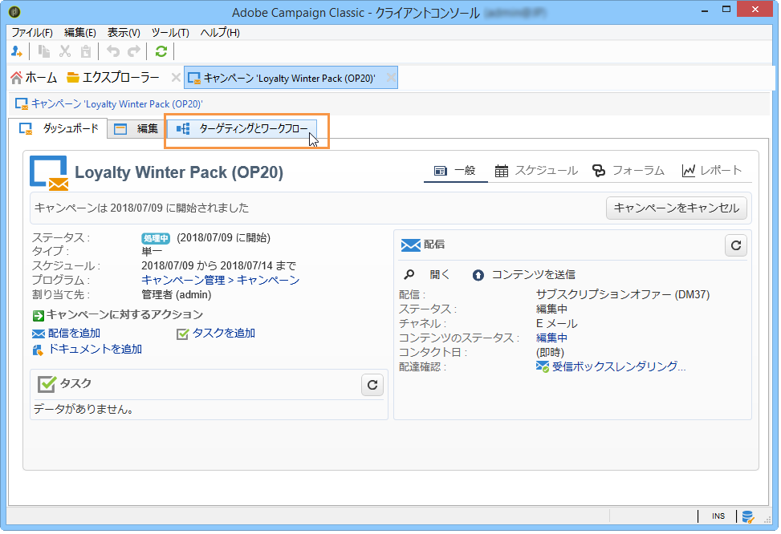

ワークフロー内に 1 つ以上のクエリを配置して、ターゲット母集団を Adobe Campaign データベースから抽出します。クエリを作成する方法について詳しくは、[この節](../../workflow/using/query.md)を参照してください。

クエリを開始し、「和集合」、「積集合」、「共有」、「除外」などのボックスを介して母集団を共有できます。

ワークスペースの左側のリストからオブジェクトを選択し、リンクして、ターゲットを構築します。

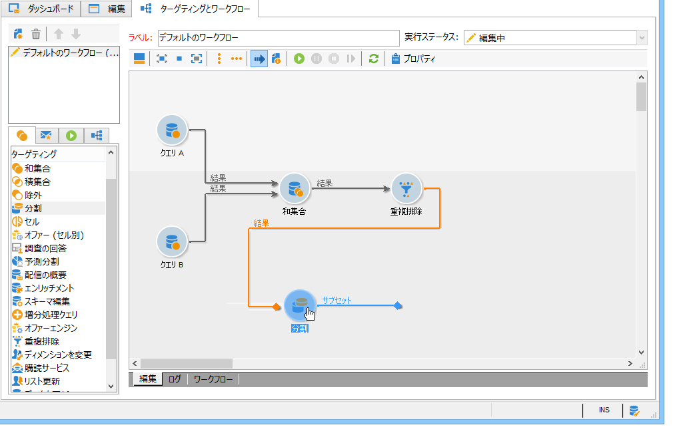

このダイアグラムでは、ターゲットの構築に必要なターゲティングクエリとスケジューリングクエリをダイアグラム内でリンクしています。データベースから抽出された母集団を確認するために、構築の進行中にターゲティングを実行できます。

>[!NOTE]
>
>Examples and procedure for defining queries are presented in [this section](../../workflow/using/query.md).

エディターの左側には、アクティビティを表すグラフィカルなオブジェクトのライブラリがあります。最初のタブにはターゲティングアクティビティが含まれ、2 番目のタブにはフロー制御アクティビティが含まれています。フロー制御アクティビティは、ターゲティングアクティビティの調整に使用する場合があります。

ターゲティングワークフローの実行および書式設定機能には、ダイアグラムエディターのツールバーからアクセスできます。

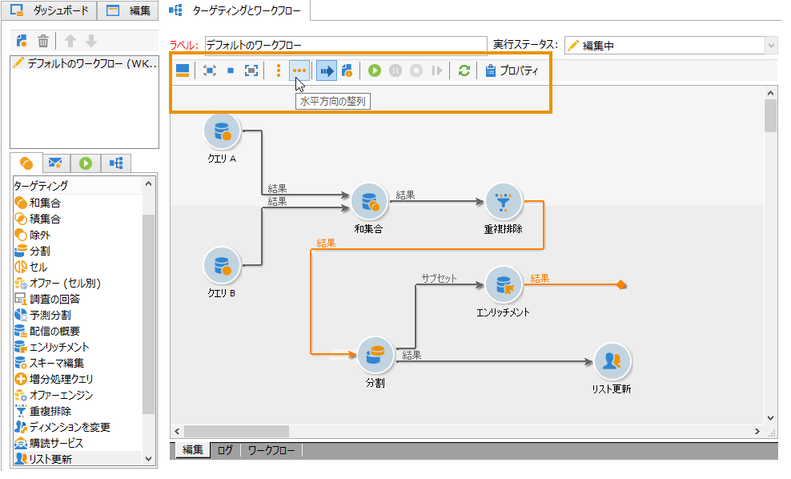

>[!NOTE]
>
>ダイアグラムの作成に使用できるアクティビティと、すべての表示およびレイアウト機能については、[ワークフローによる自動化](../../workflow/using/executing-a-workflow.md#architecture)ガイドで詳しく説明しています。

1 つのキャンペーンに対して複数のターゲティングワークフローを作成できます。ワークフローを追加するには、次の手順に従います。

1. Go to the upper left-hand section of the workflow creation zone, right-click, and select **[!UICONTROL Add]**. You can also use the **[!UICONTROL New]** button located above this zone.

   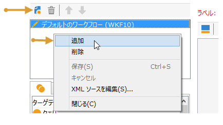

1. Select the **[!UICONTROL New workflow]** template and name this workflow.
1. 「**[!UICONTROL OK]**」をクリックしてワークフローの作成を確定し、このワークフローのダイアグラムを作成します。

#### ワークフローの実行 {#executing-a-workflow}

Targeting workflows can be launched manually via the **[!UICONTROL Start]** button in the toolbar, provided that you have the appropriate rights.

スケジュール（スケジューラー）またはイベント（外部信号、ファイルのインポートなど）に従って自動実行するように、ターゲティングをプログラムすることもできます。

ターゲティングワークフローの実行に関連するアクション（開始、停止、一時停止など）は、**非同期**&#x200B;プロセスです。コマンドは保存され、サーバーがそのコマンドを適用できるようになるとすぐに実行されます。

ツールバーのアイコンを使用して、ターゲティングワークフローの実行に関連するアクションを起こすことができます。

* 開始または再開

   * The **[!UICONTROL Start]** icon lets you launch the targeting workflow. このアイコンをクリックすると、入力トランジションがないすべてのアクティビティが有効化されます（終点へのジャンプを除く）。

      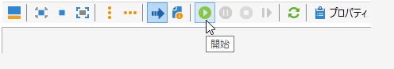

      サーバーでのリクエスト処理状況はステータスに表示されます。

      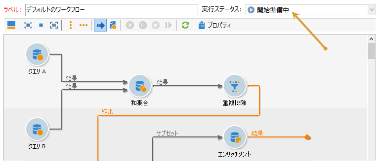

      The process status changes to **[!UICONTROL Started]**.

   * 適切なツールバーアイコンからターゲティングワークフローを再開できます。This command may be useful if the **[!UICONTROL Start]** icon is not available, for example when targeting workflow stopping is in progress. In this case, click the **[!UICONTROL Restart]** icon to anticipate the restart. ステータスが示すように、サーバーがリクエストを処理します。

      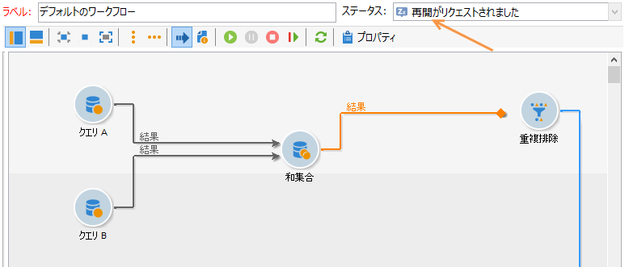

      The process then enters **[!UICONTROL Started]** status.

* 停止または一時停止

   * ツールバーのアイコンを使用して、進行中のターゲティングワークフローを停止または一時停止できます。

      When you click **[!UICONTROL Pause]**, operations in progress **[!UICONTROL are not]** paused, but no other activity is launched until the next restart.

      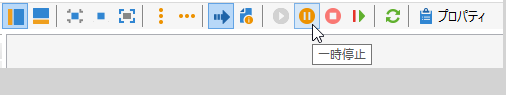

      サーバーでのコマンド処理状況はステータスに表示されます。

      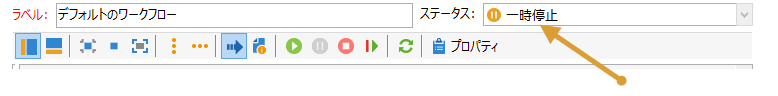

      ターゲティングワークフローの実行が特定のアクティビティに到達したときに、自動的に一時停止することもできます。To do this, right-click the activity from which targeting workflow is to be paused, and select **[!UICONTROL Enable but do not execute]**.

      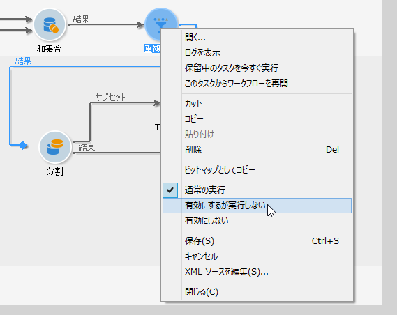

      この設定には特別なアイコンが表示されます。

      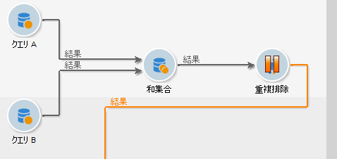

      >[!NOTE]
      >
      >このオプションは、ターゲティングキャンペーンの詳細なデザインおよびテストフェーズで役に立ちます。

      Click **[!UICONTROL Start]** to resume execution.

   * Click the **[!UICONTROL Stop]** icon to stop the execution in progress.

      

      サーバーでのコマンド処理状況はステータスに表示されます。

      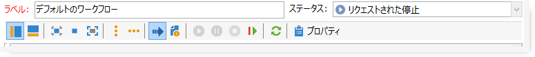
   ターゲティングワークフローの実行が特定のアクティビティに到達したときに、自動的に停止することもできます。To do this, right-click the activity from which targeting workflow will be stopped, and select **[!UICONTROL Do not activate]**.

   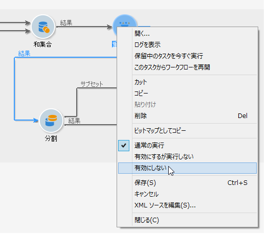

   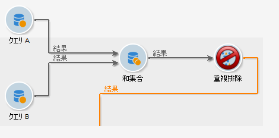

   この設定には特別なアイコンが表示されます。

   >[!NOTE]
   >
   >このオプションは、ターゲティングキャンペーンの詳細なデザインおよびテストフェーズで役に立ちます。

* 条件なしの停止

   エクスプローラーで、すべてのキャンペ **[!UICONTROL Administration > Production > Object created automatically > Campaign workflows]** ーンワークフローにアクセスし、操作するように選択します。

   You can unconditionally stop your workflow by clicking the **[!UICONTROL Actions]** icon and selecting **[!UICONTROL Unconditional]** stop. このアクションにより、キャンペーンワークフローが終了します。

   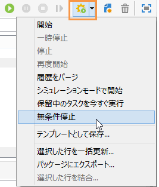

### コントロール母集団の定義 {#defining-a-control-group}

コントロール母集団は、配信を受け取らない母集団です。配信を受け取るターゲット母集団の行動と比較することで、配信後の行動とキャンペーンの影響をトラッキングします。

コントロール母集団は、メインターゲットから抽出できます。特定のグループまたはクエリから取得することもできます。

#### キャンペーンのコントロールグループのアクティブ化 {#activating-the-control-group-for-a-campaign}

制御グループはキャンペーンレベルで定義できます。この場合、制御グループは関連するキャンペーンの各配信に適用されます。

1. 該当するキャンペーンを編集し、タブをクリック **[!UICONTROL Edit]** します。
1. クリック **[!UICONTROL Advanced campaign settings]**.

   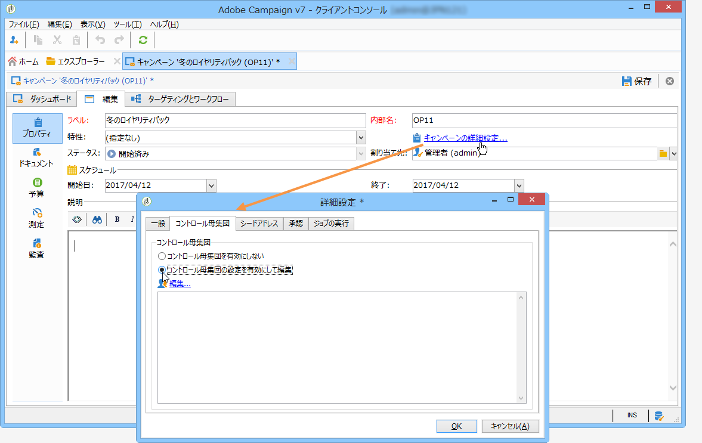

1. オプションを選 **[!UICONTROL Enable and edit control group configuration]** 択します。
1. をクリック **[!UICONTROL Edit...]** して、コントロールグループを構成します。

   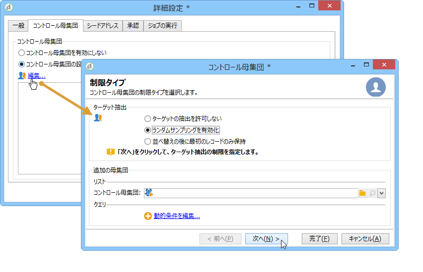

構成手順は、「メインターゲッ [トからの制御グループの抽出](#extracting-the-control-group-from-the-main-target) 」と「母集団の [追加」で説明します](#adding-a-population)。

#### 配信のコントロールグループのアクティブ化 {#activating-the-control-group-for-a-delivery}

管理グループは配信レベルで定義できます。この場合、管理グループは関連するキャンペーンの各配信に適用されます。

デフォルトでは、キャンペーンレベルで定義されたコントロール母集団の設定が、そのキャンペーンの配信ごとに適用されます。ただし、個々の配信にコントロール母集団を適応させることもできます。

>[!NOTE]
>
>キャンペーンのコントロール母集団を定義済みで、このキャンペーンにリンクされている配信用にもコントロール母集団を設定する場合は、配信用に定義されたコントロール母集団のみが適用されます。

1. 該当する配信を編集し、セクション内のリ **[!UICONTROL To]** ンクをクリック **[!UICONTROL Email parameters]** します。

   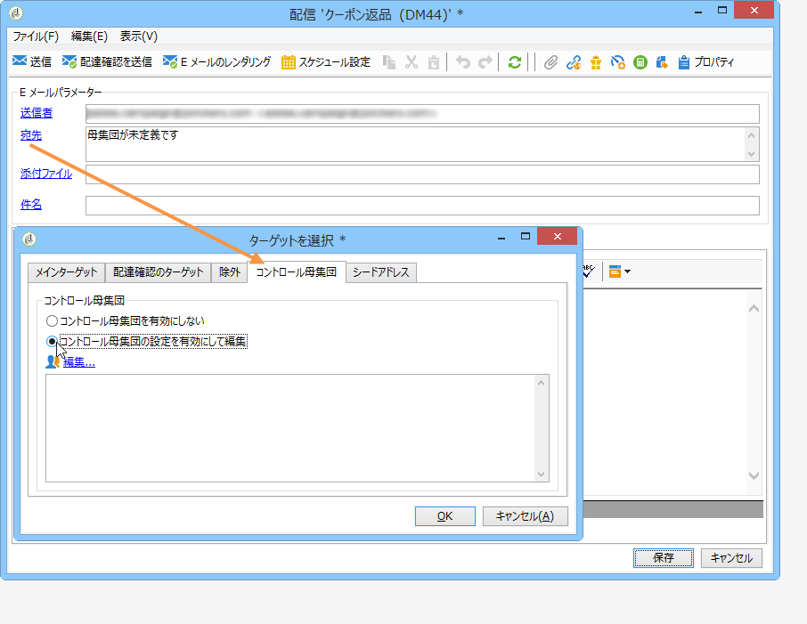

1. タブをクリッ **[!UICONTROL Control group]** クし、を選択しま **[!UICONTROL Enable and edit control group configuration]**&#x200B;す。
1. クリックし **[!UICONTROL Edit...]** てコントロールグループを構成します

構成手順は、「メインターゲッ [トからの制御グループの抽出](#extracting-the-control-group-from-the-main-target) 」と「母集団の [追加」で説明します](#adding-a-population)。

#### メインターゲットからのコントロール母集団の抽出 {#extracting-the-control-group-from-the-main-target}

配信のメインターゲットから受信者を抽出できます。この場合、受信者は、この設定に影響を受ける配信アクションのターゲットから選ばれます。ランダムに抽出することも、受信者の並べ替え結果を使用することもできます。

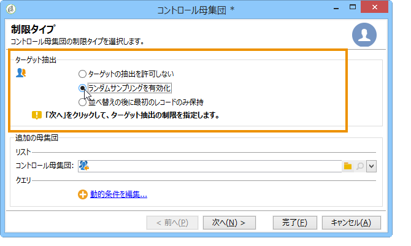

To extract a control group, enable the control group for the campaign or delivery and select one of the following options: **[!UICONTROL Activate random sampling]** or **[!UICONTROL Keep only the first records after sorting]**.

* **[!UICONTROL Activate random sampling]** :このオプションは、ターゲット母集団の受信者にランダムサンプリングを適用します。 しきい値を 100 に設定した場合、コントロール母集団は、ターゲット母集団からランダムに選択された 100 人の受信者で構成されます。ランダムサンプリングはデータベースエンジンに依存します。
* **[!UICONTROL Keep only the first records after sorting]** :このオプションを使用すると、1つ以上の並べ替え順に基づく制限を定義できます。 If you select the **[!UICONTROL Age]** field as a sorting criterion and then define 100 as a threshold, the control group will be made up of the 100 youngest recipients. 例えば、ほとんど購入していない受信者や、頻繁に購入する受信者を含むコントロール母集団を定義して、その行動と、コンタクトされた受信者の行動を比較すると、興味深い結果が得られる可能性があります。

Click **[!UICONTROL Next]** to define the sorting order (if necessary) and select the recipient limitation mode.

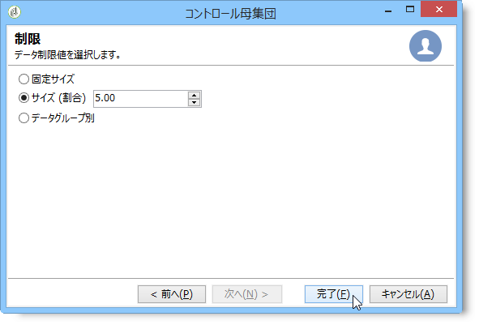

この設定は、ワークフロー内の共有アクティビティと同等で、ターゲットをサブセットに分割できます。コントロール母集団は、このようなサブセットのひとつです。詳しくは、[この節](../../workflow/using/executing-a-workflow.md#architecture)を参照してください。

### 母集団の追加 {#adding-a-population}

コントロール母集団として使用する新しい母集団を定義できます。この母集団は、受信者のグループから作成することも、特定のクエリを使用して作成することもできます。

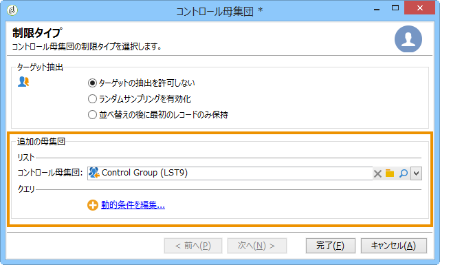

>[!NOTE]
>
>Adobe Campaign クエリエディターについては、[この節](../../workflow/using/query.md)を参照してください。

## 配信の開始 {#starting-a-delivery}

すべての承認が許可されたら、配信をいつでも開始できます。これ以降の配信手順は、配信の種類によって異なります。電子メールまたはモバイルチャネルの配信については、 [オンライン配信の開始](#starting-an-online-delivery)、ダイレクトメール配信については [、オフライン配信の開始を](#starting-an-offline-delivery)参照してください。

### オンライン配信の開始 {#starting-an-online-delivery}

Once all approval requests have been granted, the delivery status changes to **[!UICONTROL Pending confirmation]** and can be started by an operator. 必要に応じて、配信を開始するレビュー担当者として割り当てられている Adobe Campaign オペレーター（またはオペレーターのグループ）に、配信をいつでも開始できることが通知されます。

>[!NOTE]
>
>配信のプロパティで、配信を開始するために特定のオペレーターまたはオペレーターのグループを指定している場合は、配信担当のオペレーターに送信の確認を許可することもできます。許可するには、**1** の値を入力することで、「**NMS_ActivateOwnerConfirmation**」オプションを有効化します。The options are managed from the **[!UICONTROL Administration]** > **[!UICONTROL Platform]** > **[!UICONTROL Options]** node in the Adobe Campaign explorer.
>  
>このオプションを非アクティブ化するには、**0** の値を入力します。すると、送信確認プロセスがデフォルトとして機能します。つまり、配信プロパティで送信用に指定されたオペレーターまたはオペレーターのグループ（または管理者）のみが、送信を確認し、実行できるようになります。

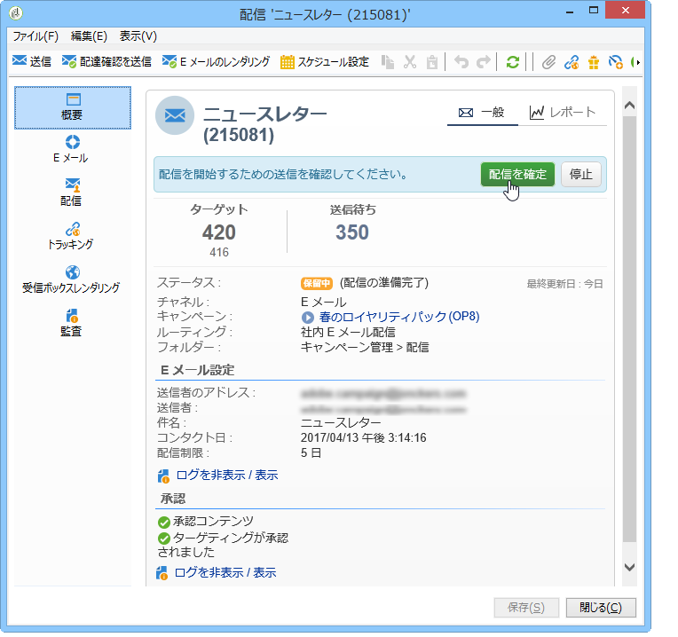

情報はキャンペーンダッシュボードにも表示されます。The **[!UICONTROL Confirm delivery]** link lets you start the delivery.

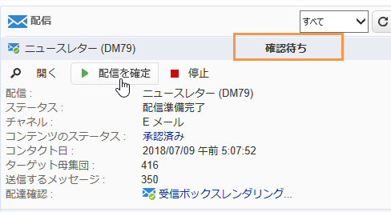

確認メッセージが表示され、このアクションを確実に実行できます。

### オフライン配信の開始 {#starting-an-offline-delivery}

Once all approvals have been granted, the delivery status changes to **[!UICONTROL Pending extraction]**. 抽出ファイルは特別なワークフローから作成されます。デフォルト設定では、このワークフローは、ダイレクトメール配信が抽出保留中の場合に自動的に開始されます。プロセスが進行中の場合、ダッシュボードに表示され、リンクから編集できます。

>[!NOTE]
>
>キャンペーンプロセスに関する技術的なワークフローは、キャンペ [ーンプロセスワークフローのリストに表示されま](../../workflow/using/campaign.md)す。

**手順 1 - ファイルの承認**

抽出ワークフローが正常に実行されたら、抽出ファイルを承認する必要があります（配信設定で抽出ファイルの承認が選択されている場合）。

詳細については、「抽出ファイルの承 [認」を参照してください](../../campaign/using/marketing-campaign-approval.md#approving-an-extraction-file)。

**手順 2 - サービスプロバイダーへのメッセージの承認**

* 抽出ファイルが承認されたら、発送担当への通知 E メールの配達確認を生成できます。この E メールメッセージは、配信テンプレートをベースとして構築されます。このメッセージは承認が必要です。

   >[!NOTE]
   >
   >この手順は、承認ウィンドウで配達確認の送信と検証が有効になっている場合にのみ使用できます。

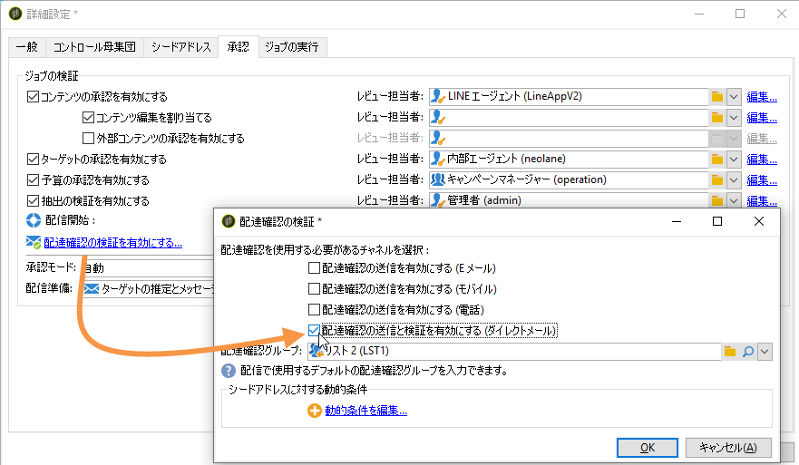

* 校正を作成す **[!UICONTROL Send a proof]** るには、このボタンをクリックします。

   事前に配達確認のターゲットを定義しておく必要があります。

   配達確認を必要な数だけ作成できます。These are accessed via the **[!UICONTROL Direct mail...]** link of the delivery detail.

   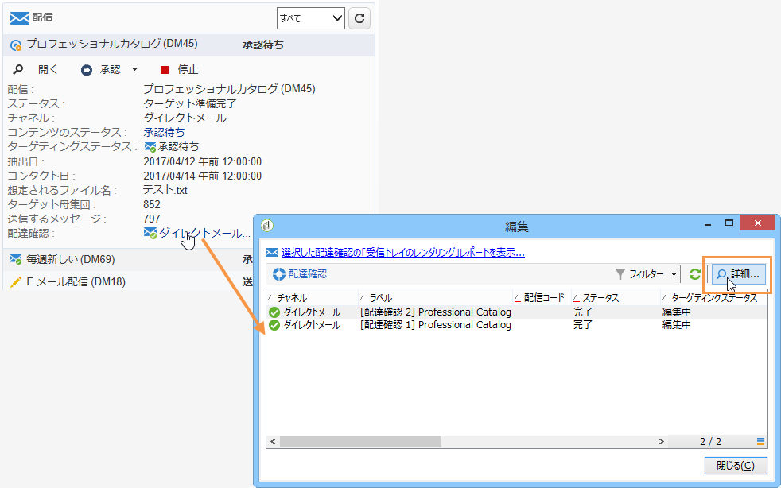

* 配信ステータスがに変わりま **[!UICONTROL To submit]**&#x200B;す。 Click the **[!UICONTROL Submit proofs]** button to start the approval process.

   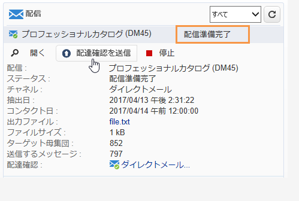

* The delivery status changes to **[!UICONTROL Proof to validate]** and a button lets you accept or reject approval.

   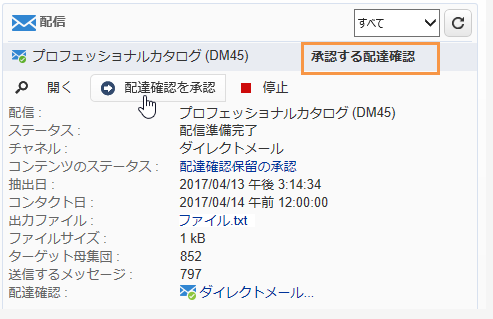

   この承認を許可／却下することも、抽出手順に戻ることもできます。

   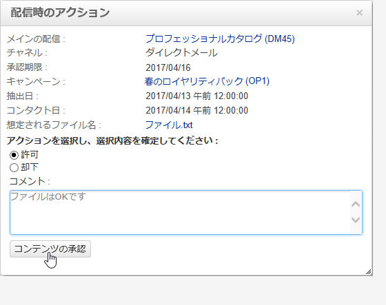

* 抽出ファイルが発送担当に送信され、配信が完了します。

### コストと在庫の計算 {#calculation-of-costs-and-stocks}

ファイルを抽出すると、予算の計算と在庫の計算の 2 つの作業が開始されます。予算エントリが更新されます。

* The **[!UICONTROL Budget]** tab lets you manage the budgets for the campaign. The total of the cost entries is shown in the **[!UICONTROL Calculates cost]** field of the campaign&#39;s main tab and the program it belongs to. この金額は、キャンペーン予算にも反映されます。

   実際のコストは、発送担当が提供する情報から最終的に計算されます。実際に送信されたメッセージのみが請求対象です。

* 在庫はツリーのノ **[!UICONTROL Administration > Campaign management > Stocks]** ードで定義され、コスト構造はノードで定義さ **[!UICONTROL Administration > Campaign management > Service providers]** れます。

   在庫品目は「在庫」セクションに表示されます。初期在庫を定義するには、在庫品目を開きます。配信が実行されるたびに在庫は減少します。アラートレベルと通知を定義できます。

>[!NOTE]
>
>コストの計算と在庫管理の詳細については、「プロバイダー、在庫 [および予算」を参照してくださ](../../campaign/using/providers--stocks-and-budgets.md)い。

## 関連付けられたドキュメントの管理 {#managing-associated-documents}

レポート、写真、Web ページ、ダイアグラムなど、様々なドキュメントをキャンペーンに関連付けることができます。これらのドキュメントには、あらゆるフォーマット（Microsoft Word、PowerPoint、PNG、JPG、Acrobat PDF など）を使用できます。To link documents with a campaign, see [Adding documents](#adding-documents).

>[!CAUTION]
>
>このモードはサイズの小さいドキュメント専用です。

キャンペーン内で、プロモーション用のクーポンや、特定の支店または店舗に関連する特別オファーなど、他の項目を参照できます。これらの要素を概要に含めると、ダイレクトメール配信に関連付けることができます。See [Associating and structuring resources linked via a delivery outline](#associating-and-structuring-resources-linked-via-a-delivery-outline).

>[!NOTE]
>
>MRM を使用している場合は、共同作業している複数の参加者が使用できるマーケティングリソースのライブラリも管理できます。See [Managing marketing resources](../../campaign/using/managing-marketing-resources.md).

### ドキュメントの追加 {#adding-documents}

ドキュメントは、キャンペーンレベル（コンテキストドキュメント）でもプログラムレベル（一般ドキュメント）でも関連付けることができます。

タブには、次 **[!UICONTROL Documents]** の項目が含まれます。

* 適切な権限を持つ Adobe Campaign オペレーターがローカルにダウンロードできる、コンテンツに必要なすべてのドキュメント（テンプレート、画像など）のリスト。
* 発送担当向けの情報を含むドキュメント（該当する場合）。

The documents are linked to the program or the campaign via the **[!UICONTROL Edit > Documents]** tab.

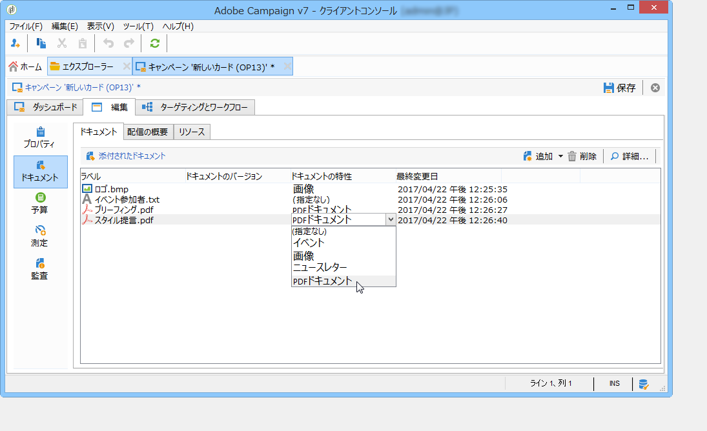

キャンペーンダッシュボードに表示されるリンクからも、ドキュメントをキャンペーンに追加できます。

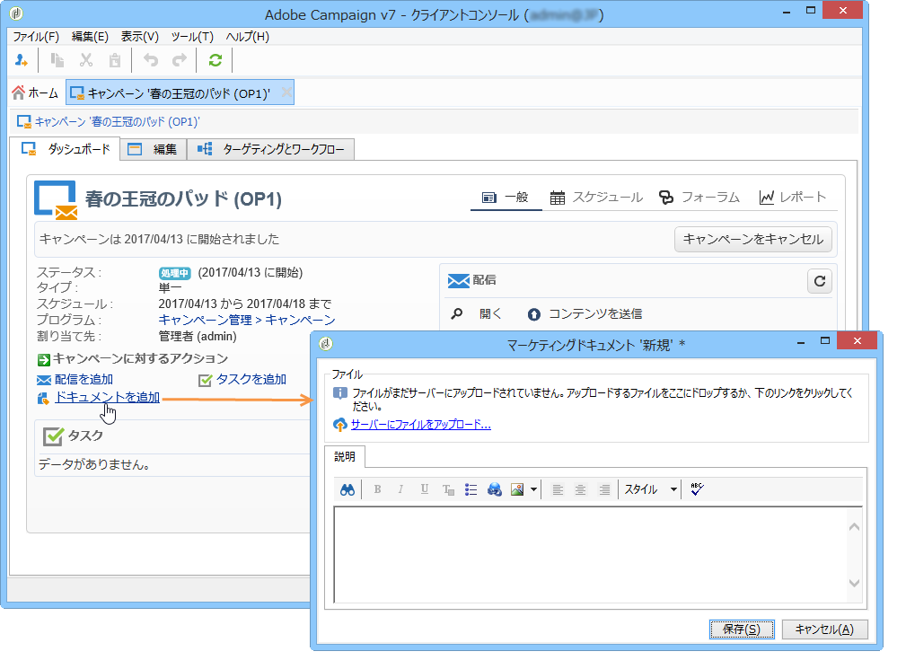

Click the **[!UICONTROL Details]** icon to view the content of a file and to add information:

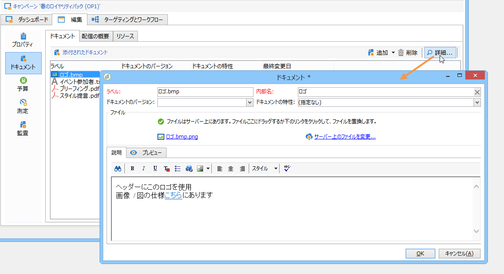

In the dashboard, documents associated with the campaign are grouped in the **[!UICONTROL Document(s)]** section, as in the following example:

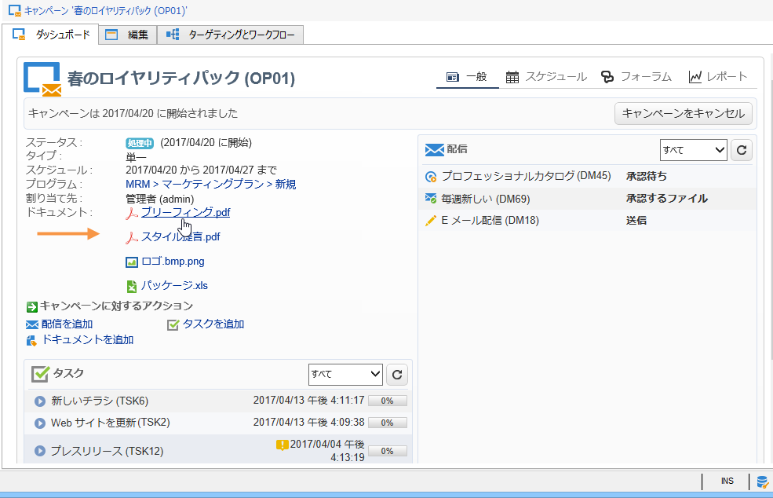

このビューからドキュメントを編集および変更することもできます。

### 配信の概要からのリンク済みリソースの関連付けと構造化 {#associating-and-structuring-resources-linked-via-a-delivery-outline}

>[!NOTE]
>
>配信の概要は、ダイレクトメールキャンペーンのコンテキストでのみ使用されます。

配信の概要は、企業内で特定のキャンペーン用に作成され、構造化された一連の要素（ドキュメント、支店／店舗、プロモーション用クーポンなど）を表します。

これらの要素は配信の概要にまとめられ、特定の配信の概要が配信に関連付けられます。この配信の概要は、配信に添付するために、**サービスプロバイダー**&#x200B;に送信される抽出ファイル内で参照されます。例えば、ある支店と、その支店が使用するマーケティングカタログを参照する配信の概要を作成できます。

キャンペーンでは、配信の概要を使用して、関連する支店、提供するプロモーションオファー、ローカルイベントへの招待など、特定の条件に応じて配信に関連付ける外部要素を構造化できます。

#### 概要の作成 {#creating-an-outline}

To create an outline, click the **[!UICONTROL Delivery outlines]** sub-tab in the **[!UICONTROL Edit > Documents]** tab of the concerned campaign.

>[!NOTE]
>
>このタブが表示されていない場合、このキャンペーンではこの機能を使用できません。キャンペーンテンプレートの設定を参照してください。
>   
>For more on this, refer to [Campaign templates](../../campaign/using/marketing-campaign-templates.md#campaign-templates).

次に、をクリック **[!UICONTROL Add a delivery outline]** して、キャンペーンのアウトラインの階層を作成します。

1. ツリーのルートを右クリックし、を選択します **[!UICONTROL New > Delivery outlines]**。
1. 作成したアウトラインを右クリックし、またはを選択 **[!UICONTROL New > Item]** しま **[!UICONTROL New > Personalization fields]**&#x200B;す。

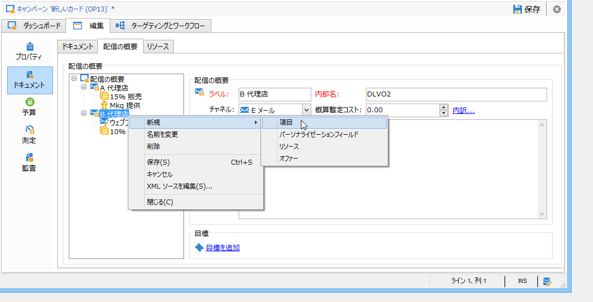

概要には、項目、パーソナライゼーションフィールド、リソースおよびオファーを含めることができます。

* 項目には、ここで参照および記述し、配信に添付する物理的なドキュメントなどを指定できます。
* パーソナライゼーションフィールドを使用して、受信者ではなく配信に関連したパーソナライゼーション要素を作成できます。したがって、特定のターゲット（ウェルカムオファー、割引など）の配信に使用する値を作成できます。これらはAdobe Campaignで作成され、リンクを介してアウトラインにインポートさ **[!UICONTROL Import personalization fields...]** れます。

   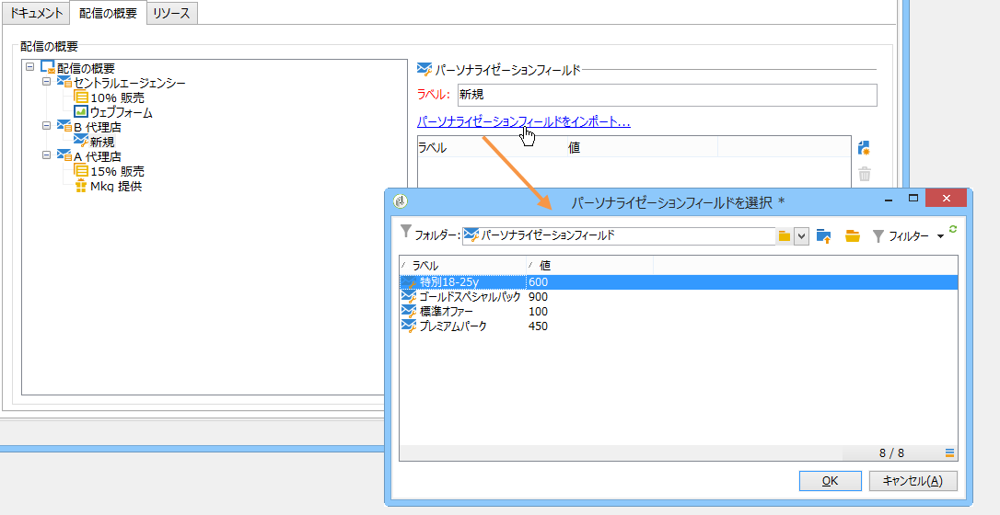

   They can also be created directly in the outline by clicking the **[!UICONTROL Add]** icon to the right of the list zone.

   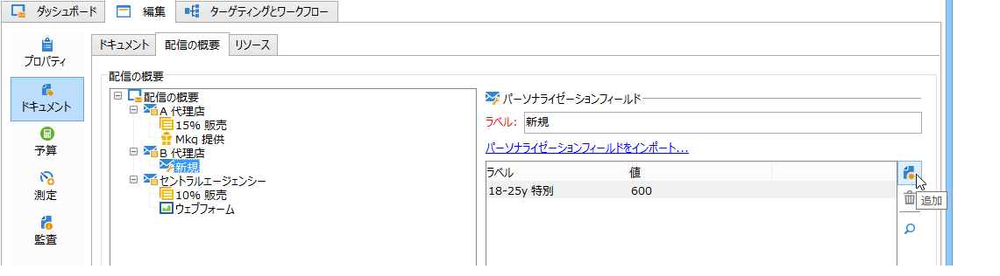

* The resources are marketing resources generated in the marketing resource dashboard accessed via the **[!UICONTROL Resources]** link of the **[!UICONTROL Campaigns]** universe.

   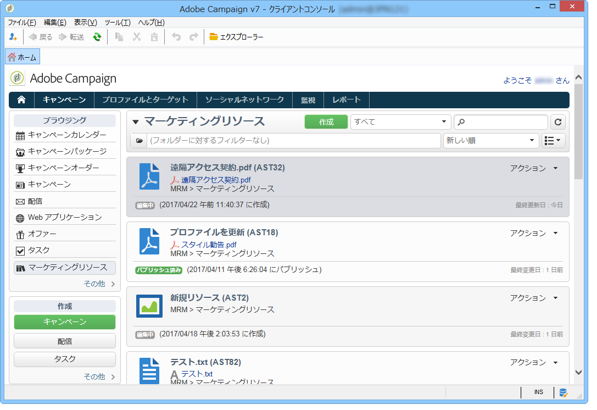

   >[!NOTE]
   >
   >マーケティングリソースについて詳しくは、「マーケティングリソ [ースの管理」を参照してくださ](../../campaign/using/managing-marketing-resources.md)い。

#### 概要の選択 {#selecting-an-outline}

次の例に示すように、配信ごとに、抽出の概要専用のセクションから関連付ける概要を選択できます。

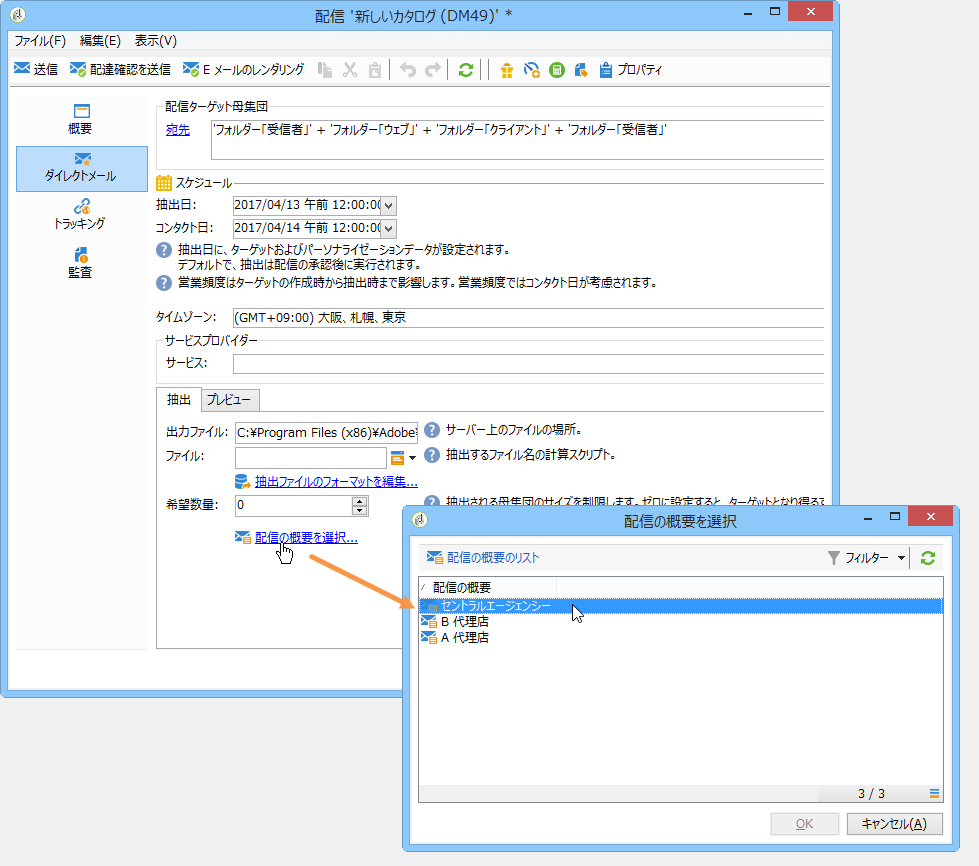

選択された概要が、ウィンドウの下部セクションに表示されます。この概要は、フィールドの右側のアイコンを使用して編集したり、ドロップダウンリストを使用して変更したりできます。

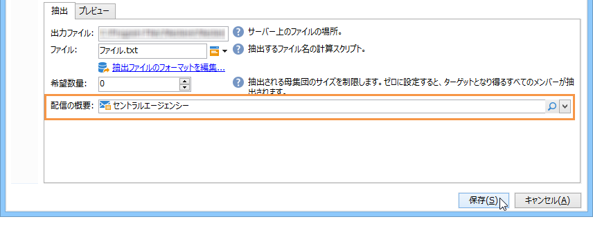

The **[!UICONTROL Summary]** tab of the delivery also displays this information:

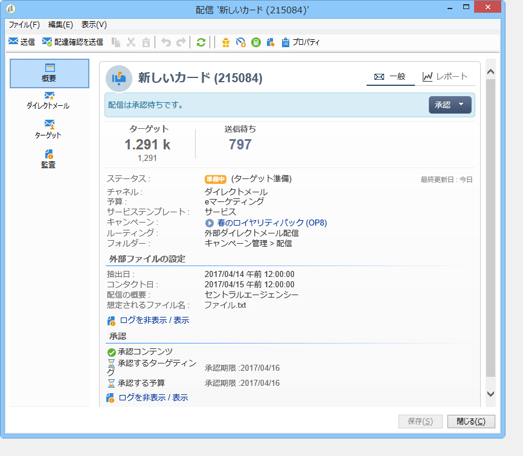

#### 抽出結果 {#extraction-result}

抽出され、サービスプロバイダーに送信されたファイル内では、サービスプロバイダーに関連付けられたエクスポートテンプレートの情報に従って、概要名および必要に応じてその特性（コスト、説明など）がコンテンツに追加されます。

次の例では、配信に関連付けられた概要のラベル、推定コスト、説明が抽出ファイルに追加されます。

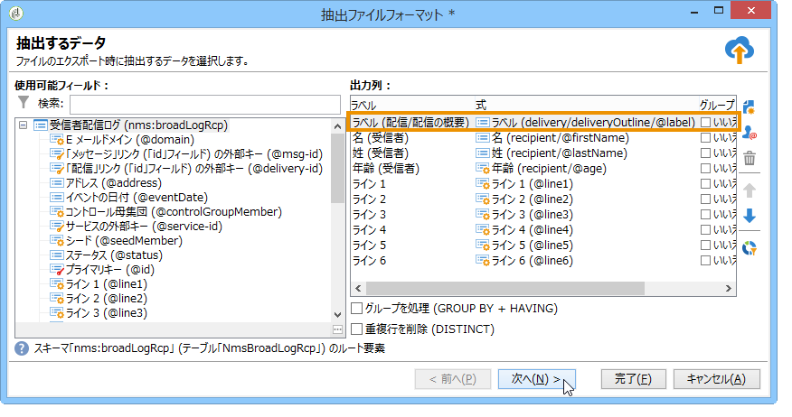

エクスポートモデルは、該当する配信用に選択されたサービスプロバイダーに関連付ける必要があります。See [Creating service providers and their cost structures](../../campaign/using/providers--stocks-and-budgets.md#creating-service-providers-and-their-cost-structures).

>[!NOTE]
>
>詳しくは、[はじめに](../../platform/using/generic-imports-and-exports.md)の節を参照してください。
