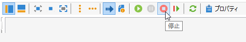

# マーケティングキャンペーン配信 {#marketing-campaign-deliveries}

配信は、キャンペーンダッシュボード、キャンペーンワークフローまたは配信の概要から直接作成できます。

 [ビデオでこの機能を確認する](#create-email-video)

## 配信の作成 {#creating-deliveries}

キャンペーンにリンクされた配信を作成するには、キャンペーンダッシュボードの「**[!UICONTROL 配信を追加]**」リンクをクリックします。

各種の配信（ダイレクトメール、E メール、モバイルチャネル）に適した設定が提示されます。

>[!NOTE]
>
>配信の作成と設定について詳しくは、[メッセージの送信](../../delivery/using/steps-about-delivery-creation-steps.md)の節を参照してください。

## ターゲット母集団の選択 {#selecting-the-target-population}

配信ごとに、キャンペーンマネージャーが以下のものを定義します。

* メインターゲット。詳しくは、[ワークフローのメインターゲットの作成](#building-the-main-target-in-a-workflow)および[ターゲット母集団の選択](#selecting-the-target-population)を参照してください。
* コントロール母集団。詳しくは、[コントロール母集団の定義](#defining-a-control-group)を参照してください。
* シードアドレス。詳しくは、[この節](../../delivery/using/about-seed-addresses.md)を参照してください。

この情報の一部は、テンプレートから継承されます。

>[!NOTE]
>
>キャンペーンテンプレートについて詳しくは、[キャンペーンテンプレート](../../campaign/using/marketing-campaign-templates.md#campaign-templates)で説明しています。

配信ターゲットを作成するために、データベース内の受信者のフィルタリング条件を定義できます。受信者の選択モードについては、[メッセージの送信](../../delivery/using/steps-defining-the-target-population.md)の節で説明しています。

### 例：受信者のグループへの配信 {#example--delivering-to-a-group-of-recipients}

母集団をリストにインポートし、配信でこのリストをターゲットとして設定できます。

1. 設定するには、関連する配信を編集し、「**[!UICONTROL 宛先]**」リンクをクリックして、ターゲット母集団を変更します。

1. 「**[!UICONTROL メインターゲット]**」タブで「**[!UICONTROL データベースで定義]**」オプションを選択し、「**[!UICONTROL 追加]**」をクリックして、受信者を選択します。

1. 「**[!UICONTROL 受信者のリスト]**」を選択し、「**[!UICONTROL 次へ]**」をクリックして、リストを選択します。

### ワークフローのメインターゲットの作成 {#building-the-main-target-in-a-workflow}

配信のメインターゲットは、ターゲティングワークフローでも定義できます。クエリ、テスト、オペレーター（和集合、重複排除、共有など）を使用して、グラフィカルにターゲットを作成できます。

[ワークフローによる自動化](../../workflow/using/architecture.md)ガイドでは、ワークフローモジュールの仕組みについて、詳しく説明しています。

>[!IMPORTANT]
>
>同じキャンペーン内に 28 を超えるワークフローを設定することはできません。この上限を超えると、追加のワークフローはインターフェイスに表示されず、エラーが発生する可能性があります。

### キャンペーンでの E メールの作成方法 {#create-email-video}

このビデオでは、Adobe Campaign Classic でキャンペーンと E メールを作成する方法を説明します。

>[!VIDEO](https://video.tv.adobe.com/v/25604?quality=12)

#### ターゲティングワークフローの作成 {#creating-a-targeting-workflow}

ターゲティングは、ワークフロー内のグラフィカルなシーケンスでフィルタリング条件を組み合わせて作成できます。ターゲットとする母集団およびサブ母集団を要件に合わせて作成できます。ワークフローエディターを表示するには、キャンペーンダッシュボードで「**[!UICONTROL ターゲティングとワークフロー]**」タブをクリックします。

ワークフロー内に 1 つ以上のクエリを配置して、ターゲット母集団を Adobe Campaign データベースから抽出します。クエリを作成する方法について詳しくは、[この節](../../workflow/using/query.md)を参照してください。

クエリを開始し、「和集合」、「積集合」、「共有」、「除外」などのボックスを介して母集団を共有できます。

ワークスペースの左側のリストからオブジェクトを選択し、リンクして、ターゲットを構築します。

このダイアグラムでは、ターゲットの構築に必要なターゲティングクエリとスケジューリングクエリをダイアグラム内でリンクしています。データベースから抽出された母集団を確認するために、構築の進行中にターゲティングを実行できます。

>[!NOTE]
>
>クエリを定義するための例と手順について詳しくは、[この節](../../workflow/using/query.md)で説明しています。

エディターの左側には、アクティビティを表すグラフィカルなオブジェクトのライブラリがあります。最初のタブにはターゲティングアクティビティが含まれ、2 番目のタブにはフロー制御アクティビティが含まれています。フロー制御アクティビティは、ターゲティングアクティビティの調整に使用する場合があります。

ターゲティングワークフローの実行および書式設定機能には、ダイアグラムエディターのツールバーからアクセスできます。

>[!NOTE]
>
>ダイアグラムの作成に使用できるアクティビティと、すべての表示およびレイアウト機能については、[ワークフローによる自動化](../../workflow/using/architecture.md)ガイドで詳しく説明しています。

1 つのキャンペーンに対して複数のターゲティングワークフローを作成できます。ワークフローを追加するには、次の手順に従います。

1. ワークフロー作成領域の左上に移動して右クリックし、「**[!UICONTROL 追加]**」を選択します。この領域の上にある&#x200B;**[!UICONTROL 新規]**&#x200B;ボタンも使用できます。

   

1. **[!UICONTROL 新しいワークフロー]**&#x200B;テンプレートを選択し、このワークフローに名前を付けます。
1. 「**[!UICONTROL OK]**」をクリックしてワークフローの作成を確定し、このワークフローのダイアグラムを作成します。

#### ワークフローの実行 {#executing-a-workflow}

適切な権限がある場合は、ツールバーの&#x200B;**[!UICONTROL 開始]**&#x200B;ボタンから手動でターゲティングワークフローを開始できます。

スケジュール（スケジューラー）またはイベント（外部信号、ファイルのインポートなど）に従って自動実行するように、ターゲティングをプログラムすることもできます。

ターゲティングワークフローの実行に関連するアクション（開始、停止、一時停止など）は、**非同期**&#x200B;プロセスです。コマンドは保存され、サーバーがそのコマンドを適用できるようになるとすぐに実行されます。

ツールバーのアイコンを使用して、ターゲティングワークフローの実行に関連するアクションを起こすことができます。

* 開始または再開

   * **[!UICONTROL 開始]**&#x200B;アイコンを使用して、ターゲティングワークフローを開始できます。このアイコンをクリックすると、入力トランジションがないすべてのアクティビティが有効化されます（終点へのジャンプを除く）。

      

      サーバーでのリクエスト処理状況はステータスに表示されます。

      

      処理ステータスが「**[!UICONTROL 開始済み]**」に変わります。

   * 適切なツールバーアイコンからターゲティングワークフローを再開できます。このコマンドは、例えばターゲティングワークフローの停止が進行中の場合など、**[!UICONTROL 開始]**&#x200B;アイコンが表示されていない場合に役立つことがあります。その場合は、**[!UICONTROL 再開]**&#x200B;アイコンをクリックして、再開を待ちます。ステータスが示すように、サーバーがリクエストを処理します。

      

      プロセスが「**[!UICONTROL 開始済み]**」ステータスになります。

* 停止または一時停止

   * ツールバーのアイコンを使用して、進行中のターゲティングワークフローを停止または一時停止できます。

      **[!UICONTROL 一時停止]**&#x200B;アイコンをクリックすると、進行中の操作は一時停止&#x200B;**[!UICONTROL されません]**&#x200B;が、次に再開されるまで他のアクティビティは開始されなくなります。

      

      サーバーでのコマンド処理状況はステータスに表示されます。

      

      ターゲティングワークフローの実行が特定のアクティビティに到達したときに、自動的に一時停止することもできます。そのように設定するには、ターゲティングワークフローを一時停止するアクティビティを右クリックし、「**[!UICONTROL 有効にするが実行しない]**」を選択します。

      

      この設定には特別なアイコンが表示されます。

      

      >[!NOTE]
      >
      >このオプションは、ターゲティングキャンペーンの詳細なデザインおよびテストフェーズで役に立ちます。

      実行を再開するには、**[!UICONTROL 開始]**&#x200B;アイコンをクリックします。

   * 進行中の実行を停止するには、**[!UICONTROL 停止]**&#x200B;アイコンをクリックします。

      

      サーバーでのコマンド処理状況はステータスに表示されます。

      
   ターゲティングワークフローの実行が特定のアクティビティに到達したときに、自動的に停止することもできます。そのように設定するには、ターゲティングワークフローを停止するアクティビティを右クリックし、「**[!UICONTROL 有効にしない]**」を選択します。

   

   

   この設定には特別なアイコンが表示されます。

   >[!NOTE]
   >
   >このオプションは、ターゲティングキャンペーンの詳細なデザインおよびテストフェーズで役に立ちます。

* 条件なしの停止

   エクスプローラーで、**[!UICONTROL 管理／プロダクション／自動作成されたオブジェクト／キャンペーンワークフロー]**&#x200B;を選択すると、すべてのキャンペーンワークフローにアクセスして操作できます。

   ワークフローを無条件で停止するには、「**[!UICONTROL アクション]**」アイコンをクリックし、「**[!UICONTROL 無条件停止]**」をクリックします。このアクションにより、キャンペーンワークフローが終了します。

   

### コントロール母集団の定義 {#defining-a-control-group}

コントロール母集団は、配信を受け取らない母集団です。配信を受け取るターゲット母集団の行動と比較することで、配信後の行動とキャンペーンの影響をトラッキングします。

コントロール母集団は、メインターゲットから抽出できます。特定のグループまたはクエリから取得することもできます。

#### キャンペーンのコントロール母集団の有効化 {#activating-the-control-group-for-a-campaign}

コントロール母集団は、キャンペーンレベルで定義できます。この場合、該当するキャンペーンの配信ごとにコントロール母集団が適用されます。

1. 該当するキャンペーンを編集し、「**[!UICONTROL 編集]**」タブをクリックします。
1. 「**[!UICONTROL キャンペーンの詳細設定]**」をクリックします。

   

1. 「**[!UICONTROL コントロール母集団の設定を有効にして編集]**」オプションを選択します。
1. 「**[!UICONTROL 編集...]**」をクリックして、コントロール母集団を設定します。

   

設定手順について詳しくは、[メインターゲットからのコントロール母集団の抽出](#extracting-the-control-group-from-the-main-target)および[コントロール母集団の追加](#adding-a-population)で説明しています。

#### 配信のコントロール母集団の有効化 {#activating-the-control-group-for-a-delivery}

コントロール母集団は、配信レベルで定義できます。この場合、該当するキャンペーンの配信ごとにコントロール母集団が適用されます。

デフォルトでは、キャンペーンレベルで定義されたコントロール母集団の設定が、そのキャンペーンの配信ごとに適用されます。ただし、個々の配信にコントロール母集団を適応させることもできます。

>[!NOTE]
>
>キャンペーンのコントロール母集団を定義済みで、このキャンペーンにリンクされている配信用にもコントロール母集団を設定する場合は、配信用に定義されたコントロール母集団のみが適用されます。

1. 該当する配信を編集し、「**[!UICONTROL E メールパラメーター]**」セクションの「**[!UICONTROL 宛先]**」リンクをクリックします。

   

1. 「**[!UICONTROL コントロール母集団]**」タブをクリックし、「**[!UICONTROL コントロール母集団の設定を有効にして編集]**」を選択します。
1. 「**[!UICONTROL 編集...]**」をクリックして、コントロール母集団を設定します。。

設定手順について詳しくは、[メインターゲットからのコントロール母集団の抽出](#extracting-the-control-group-from-the-main-target)および[コントロール母集団の追加](#adding-a-population)で説明しています。

#### メインターゲットからのコントロール母集団の抽出 {#extracting-the-control-group-from-the-main-target}

配信のメインターゲットから受信者を抽出できます。この場合、受信者は、この設定に影響を受ける配信アクションのターゲットから選ばれます。ランダムに抽出することも、受信者の並べ替え結果を使用することもできます。

コントロール母集団を抽出するには、キャンペーンまたは配信のコントロール母集団を有効にして、「**[!UICONTROL ランダムサンプリングを有効化]**」オプションまたは「**[!UICONTROL 並べ替えの後に最初のレコードのみ保持]**」オプションのどちらかを選択します。

* **[!UICONTROL ランダムサンプリングを有効化]**：ターゲット母集団に含まれる受信者にランダムサンプリングを適用します。しきい値を 100 に設定した場合、コントロール母集団は、ターゲット母集団からランダムに選択された 100 人の受信者で構成されます。ランダムサンプリングはデータベースエンジンに依存します。
* **[!UICONTROL 並べ替えの後に最初のレコードのみ保持]**：1 つ以上の並べ替え順に基づいて、制限を定義できます。並べ替えの基準として「**[!UICONTROL 年齢]**」フィールドを選択し、しきい値として 100 を定義した場合、コントロール母集団は最も若い 100 人の受信者で構成されます。例えば、ほとんど購入していない受信者や、頻繁に購入する受信者を含むコントロール母集団を定義して、その行動と、コンタクトされた受信者の行動を比較すると、興味深い結果が得られる可能性があります。

「**[!UICONTROL 次へ]**」をクリックして、並べ替え順を定義し（必要な場合）、受信者の制限モードを選択します。

この設定は、ワークフロー内の共有アクティビティと同等で、ターゲットをサブセットに分割できます。コントロール母集団は、このようなサブセットのひとつです。詳しくは、[この節](../../workflow/using/architecture.md)を参照してください。

### コントロール母集団の追加 {#adding-a-population}

コントロール母集団として使用する新しい母集団を定義できます。この母集団は、受信者のグループから作成することも、特定のクエリを使用して作成することもできます。

>[!NOTE]
>
>Adobe Campaign クエリエディターについては、[この節](../../workflow/using/query.md)を参照してください。

## 配信の開始 {#starting-a-delivery}

すべての承認が許可されたら、配信をいつでも開始できます。これ以降の配信手順は、配信の種類によって異なります。E メールまたはモバイルチャネルの配信については、[オンライン配信の開始](#starting-an-online-delivery)を、ダイレクトメール配信については、[オフライン配信の開始](#starting-an-offline-delivery)を参照してください。

### オンライン配信の開始 {#starting-an-online-delivery}

すべての承認リクエストが許可されたら、配信ステータスが「**[!UICONTROL 確認待ち]**」に変わり、オペレーターによって開始できるようになります。必要に応じて、配信を開始するレビュー担当者として割り当てられている Adobe Campaign オペレーター（またはオペレーターのグループ）に、配信をいつでも開始できることが通知されます。

>[!NOTE]
>
>配信のプロパティで、配信を開始するために特定のオペレーターまたはオペレーターのグループを指定している場合は、配信担当のオペレーターに送信の確認を許可することもできます。許可するには、**1** の値を入力することで、「**NMS_ActivateOwnerConfirmation**」オプションを有効化します。このオプションは、Adobe Campaign エクスプローラーの&#x200B;**[!UICONTROL 管理]**／**[!UICONTROL プラットフォーム]**／**[!UICONTROL オプション]**&#x200B;ノードから管理します。
>  
>このオプションを非アクティブ化するには、**0** の値を入力します。すると、送信確認プロセスがデフォルトとして機能します。つまり、配信プロパティで送信用に指定されたオペレーターまたはオペレーターのグループ（または管理者）のみが、送信を確認し、実行できるようになります。

情報はキャンペーンダッシュボードにも表示されます。「**[!UICONTROL 配信を確定]**」リンクを使用して、配信を開始できます。

確認メッセージが表示され、このアクションを確実に実行できます。

### オフライン配信の開始 {#starting-an-offline-delivery}

すべての承認が許可されたら、配信ステータスが「**[!UICONTROL 抽出を保留中]**」に変わります。抽出ファイルは特別なワークフローから作成されます。デフォルト設定では、このワークフローは、ダイレクトメール配信が抽出保留中の場合に自動的に開始されます。プロセスが進行中の場合、ダッシュボードに表示され、リンクから編集できます。

>[!NOTE]
>
>キャンペーンプロセスに関連するテクニカルワークフローについて詳しくは、[キャンペーンプロセスのワークフローのリスト](../../workflow/using/campaign.md)で説明しています。

**手順 1 - ファイルの承認**

抽出ワークフローが正常に実行されたら、抽出ファイルを承認する必要があります（配信設定で抽出ファイルの承認が選択されている場合）。

詳しくは、[抽出ファイルの承認](../../campaign/using/marketing-campaign-approval.md#approving-an-extraction-file)を参照してください。

**手順 2 - サービスプロバイダーへのメッセージの承認**

* 抽出ファイルが承認されたら、発送担当への通知 E メールの配達確認を生成できます。この E メールメッセージは、配信テンプレートをベースとして構築されます。このメッセージは承認が必要です。

   >[!NOTE]
   >
   >この手順は、承認ウィンドウで配達確認の送信と検証が有効になっている場合にのみ使用できます。

* 「**[!UICONTROL 配達確認を送信]**」ボタンをクリックして、配達確認を作成します。

   事前に配達確認のターゲットを定義しておく必要があります。

   配達確認を必要な数だけ作成できます。この配達確認には、配信の詳細の「**[!UICONTROL ダイレクトメール...]**」リンクからアクセスします。

   

* 配信ステータスが「**[!UICONTROL 送信する]**」に変わります。「**[!UICONTROL 配達確認を送信]**」ボタンをクリックして、承認プロセスを開始します。

   

* 配信ステータスが「**[!UICONTROL 承認する配達確認]**」に変わります。ボタンを使用して承認を許可または却下できます。

   

   この承認を許可／却下することも、抽出手順に戻ることもできます。

   

* 抽出ファイルが発送担当に送信され、配信が完了します。

### コストと在庫の計算 {#calculation-of-costs-and-stocks}

ファイルを抽出すると、予算の計算と在庫の計算の 2 つの作業が開始されます。予算エントリが更新されます。

* 「**[!UICONTROL 予算]**」タブを使用して、キャンペーンの予算を管理できます。コストエントリの合計が、キャンペーンのメインタブおよびキャンペーンが所属するプログラムの「**[!UICONTROL 計算されたコスト]**」フィールドに表示されます。この金額は、キャンペーン予算にも反映されます。

   実際のコストは、発送担当が提供する情報から最終的に計算されます。実際に送信されたメッセージのみが請求対象です。

* 在庫はツリーの&#x200B;**[!UICONTROL 管理／キャンペーン管理／在庫]**&#x200B;ノードで定義され、コスト構造は&#x200B;**[!UICONTROL 管理／キャンペーン管理／サービスプロバイダー]**&#x200B;ノードで定義されます。

   在庫品目は「在庫」セクションに表示されます。初期在庫を定義するには、在庫品目を開きます。配信が実行されるたびに在庫は減少します。アラートレベルと通知を定義できます。

>[!NOTE]
>
>コスト計算と在庫管理について詳しくは、[プロバイダー、在庫、予算](../../campaign/using/providers--stocks-and-budgets.md)を参照してください。

## 関連付けられたドキュメントの管理 {#managing-associated-documents}

レポート、写真、Web ページ、ダイアグラムなど、様々なドキュメントをキャンペーンに関連付けることができます。これらのドキュメントには、あらゆるフォーマット（Microsoft Word、PowerPoint、PNG、JPG、Acrobat PDF など）を使用できます。ドキュメントをキャンペーンにリンクするには、[ドキュメントの追加](#adding-documents)を参照してください。

>[!IMPORTANT]
>
>このモードはサイズの小さいドキュメント専用です。

キャンペーン内で、プロモーション用のクーポンや、特定の支店または店舗に関連する特別オファーなど、他の項目を参照できます。これらの要素を概要に含めると、ダイレクトメール配信に関連付けることができます。[配信の概要からのリンク済みリソースの関連付けと構造化](#associating-and-structuring-resources-linked-via-a-delivery-outline)を参照してください。

>[!NOTE]
>
>MRM を使用している場合は、共同作業している複数の参加者が使用できるマーケティングリソースのライブラリも管理できます。[マーケティングリソースの管理](../../campaign/using/managing-marketing-resources.md)を参照してください。

### ドキュメントの追加 {#adding-documents}

ドキュメントは、キャンペーンレベル（コンテキストドキュメント）でもプログラムレベル（一般ドキュメント）でも関連付けることができます。

「**[!UICONTROL ドキュメント]**」タブには次が含まれます。

* 適切な権限を持つ Adobe Campaign オペレーターがローカルにダウンロードできる、コンテンツに必要なすべてのドキュメント（テンプレート、画像など）のリスト。
* 発送担当向けの情報を含むドキュメント（該当する場合）。

ドキュメントは、**[!UICONTROL 編集／「ドキュメント」]**&#x200B;タブからプログラムまたはキャンペーンにリンクされます。

キャンペーンダッシュボードに表示されるリンクからも、ドキュメントをキャンペーンに追加できます。

ファイルの内容を表示し、情報を追加するには、「**[!UICONTROL 詳細]**」アイコンをクリックします。

次の例に示すように、キャンペーンに関連付けられたドキュメントは、ダッシュボードの「**[!UICONTROL ドキュメント]**」セクションにまとめられます。

このビューからドキュメントを編集および変更することもできます。

### 配信の概要からのリンク済みリソースの関連付けと構造化 {#associating-and-structuring-resources-linked-via-a-delivery-outline}

>[!NOTE]
>
>配信の概要は、ダイレクトメールキャンペーンのコンテキストでのみ使用します。

配信の概要は、企業内で特定のキャンペーン用に作成され、構造化された一連の要素（ドキュメント、支店／店舗、プロモーション用クーポンなど）を表します。

これらの要素は配信の概要にまとめられ、特定の配信の概要が配信に関連付けられます。この配信の概要は、配信に添付するために、**サービスプロバイダー**&#x200B;に送信される抽出ファイル内で参照されます。例えば、ある支店と、その支店が使用するマーケティングカタログを参照する配信の概要を作成できます。

キャンペーンでは、配信の概要を使用して、関連する支店、提供するプロモーションオファー、ローカルイベントへの招待など、特定の条件に応じて配信に関連付ける外部要素を構造化できます。

#### 概要の作成 {#creating-an-outline}

概要を作成するには、関連するキャンペーンの&#x200B;**[!UICONTROL 編集／「ドキュメント」]**&#x200B;タブで「**[!UICONTROL 配信の概要]**」サブタブをクリックします。

>[!NOTE]
>
>このタブが表示されていない場合、このキャンペーンではこの機能を使用できません。キャンペーンテンプレートの設定を参照してください。
>   
>詳しくは、[キャンペーンテンプレート](../../campaign/using/marketing-campaign-templates.md#campaign-templates)を参照してください。

次に、「**[!UICONTROL 配信の概要を追加]**」をクリックし、次の手順でキャンペーンの概要の階層を作成します。

1. ツリーのルートを右クリックし、**[!UICONTROL 新規／配信の概要]**&#x200B;を選択します。
1. 作成した概要を右クリックし、**[!UICONTROL 新規／項目]**&#x200B;または&#x200B;**[!UICONTROL 新規／パーソナライゼーションフィールド]**&#x200B;を選択します。

概要には、項目、パーソナライゼーションフィールド、リソースおよびオファーを含めることができます。

* 項目には、ここで参照および記述し、配信に添付する物理的なドキュメントなどを指定できます。
* パーソナライゼーションフィールドを使用して、受信者ではなく配信に関連したパーソナライゼーション要素を作成できます。これにより、特定のターゲット向けの配信（ウェルカムオファーやディスカウントなど）で使用する値を作成できます。こうした値は Adobe Campaign で作成し、「**[!UICONTROL パーソナライゼーションフィールドをインポート...]**」リンクから概要にインポートします。

   

   パーソナライゼーション要素は、リスト領域の右側の&#x200B;**[!UICONTROL 追加]**&#x200B;アイコンをクリックして、概要内で直接作成することもできます。

   

* リソースは、マーケティングリソースダッシュボード（**[!UICONTROL キャンペーン]**&#x200B;ウィンドウの「**[!UICONTROL マーケティングリソース]**」リンクからアクセス）で生成されるマーケティングリソースです。

   

   >[!NOTE]
   >
   >マーケティングリソースについて詳しくは、[マーケティングリソースの管理](../../campaign/using/managing-marketing-resources.md)を参照してください。

#### 概要の選択 {#selecting-an-outline}

次の例に示すように、配信ごとに、抽出の概要専用のセクションから関連付ける概要を選択できます。

選択された概要が、ウィンドウの下部セクションに表示されます。この概要は、フィールドの右側のアイコンを使用して編集したり、ドロップダウンリストを使用して変更したりできます。

配信の「**[!UICONTROL 概要]**」タブにもこの情報が表示されます。

#### 抽出結果 {#extraction-result}

抽出され、サービスプロバイダーに送信されたファイル内では、サービスプロバイダーに関連付けられたエクスポートテンプレートの情報に従って、概要名および必要に応じてその特性（コスト、説明など）がコンテンツに追加されます。

次の例では、配信に関連付けられた概要のラベル、推定コスト、説明が抽出ファイルに追加されます。

エクスポートモデルは、該当する配信用に選択されたサービスプロバイダーに関連付ける必要があります。[サービスプロバイダーとそのコスト構造の作成](../../campaign/using/providers--stocks-and-budgets.md#creating-service-providers-and-their-cost-structures)を参照してください。

>[!NOTE]
>
>詳しくは、[はじめに](../../platform/using/generic-imports-and-exports.md)の節を参照してください。
