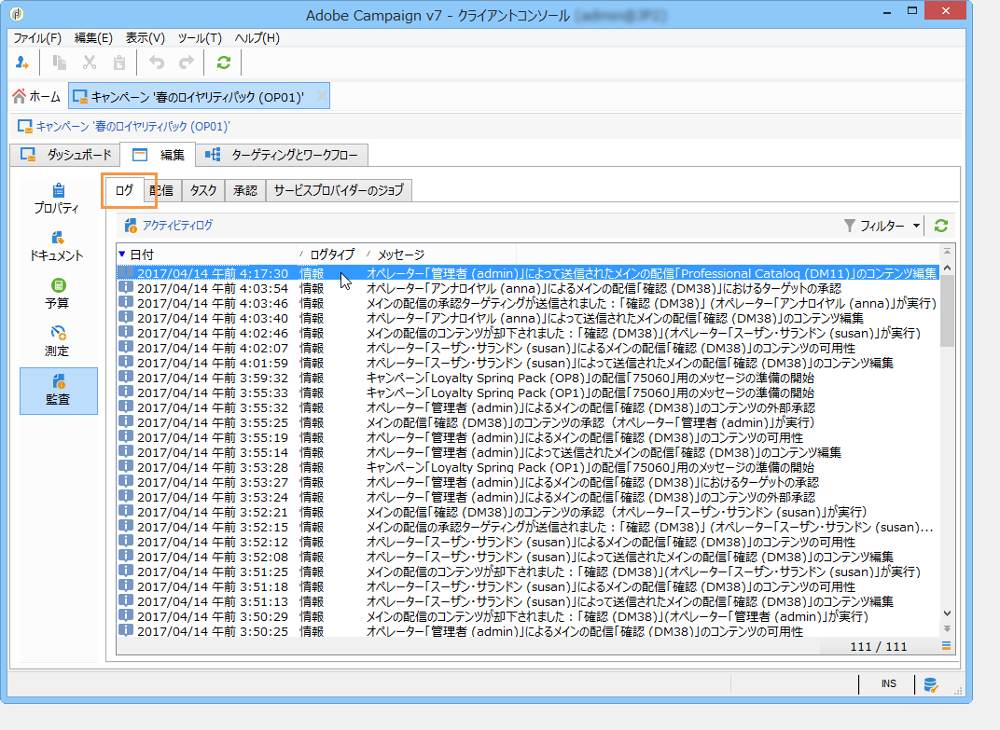
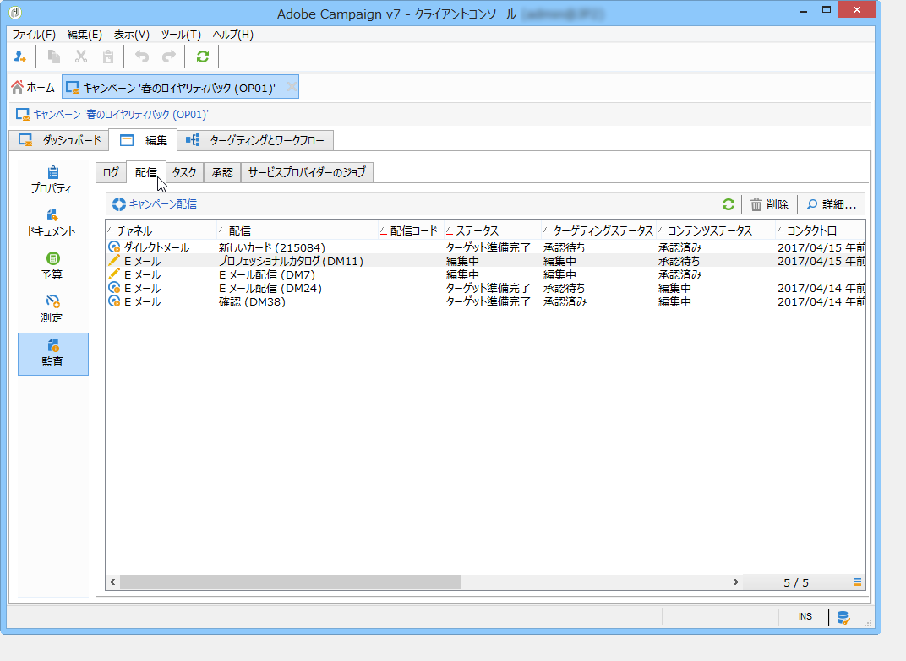
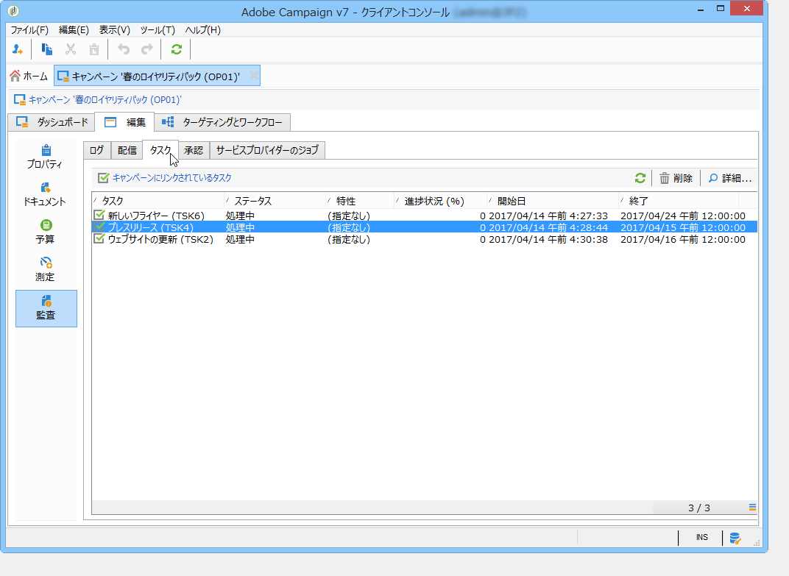
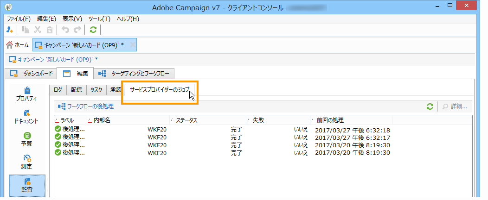
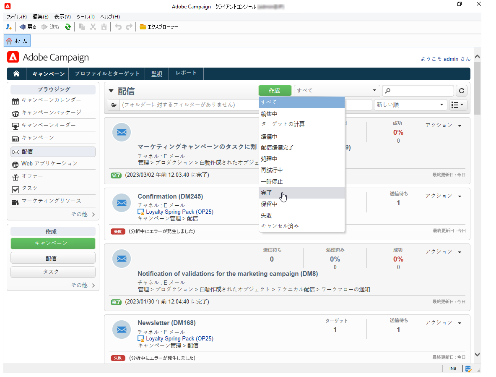

# マーケティングキャンペーンの監視 {#monitoring-marketing-campaigns}

## キャンペーントラッキング {#tracking-a-campaign}

For each campaign, the **[!UICONTROL Tracking]** tab lets you view all jobs and their statuses. このサブタブから次の情報にアクセスできます。

* ワークフローの作成または開始、承認、抽出など、一般的にキャンペーンに関して実行されるジョブがアクティビティログに表示されます。

   

* The **[!UICONTROL Deliveries]** sub-tab contains all the deliveries of the campaign which can be edited from this view. To do so, select the delivery and click the **[!UICONTROL Detail]** icon.

   

* The **[!UICONTROL Tasks]** sub-tab groups all tasks linked to the campaign. このビューを使用して、タスクを編集または削除できます。タスクは MRM アプリケーションで使用できます。詳しくは、タスクの作 [成と管理を参照してください](../../campaign/using/creating-and-managing-tasks.md)。

   

* The workflows created to generate messages for service providers are displayed in the **[!UICONTROL Jobs on service providers]** sub-tab. Click the **[!UICONTROL Detail]** icon to display the selected workflow.

   

## 配信トラッキング {#delivery-tracking}

The list of deliveries is available via the **[!UICONTROL Deliveries]** link of the Campaign node.

配信ごとに、このリストを使用して、ステータス、ターゲットとなる受信者数、リンクされたキャンペーンなどの主要指標にアクセスできます。

配信のステータスを確認するには、配信を編集して、配信ダッシュボードとタブを表示します。

>[!NOTE]
>
>配信の詳細に関連する情報は、[メッセージの送信](../../delivery/using/about-message-tracking.md)の節で説明しています。

## 実行のトラッキング {#execution-tracking}

You can look up the status of deliveries by clicking the **[!UICONTROL Deliveries]**, which is accessible via the Adobe Campaign home page. 「配信トラッ [キング」を参照してくださ](#delivery-tracking)い。

Information concerning the processes executed in a campaign are collected in the **[!UICONTROL Edit > Audit]** tab of the campaign. このタブにキャンペーンの配信のリストを表示できます。詳しくは、キ [ャンペーンの追跡を参照してください](#tracking-a-campaign)。
