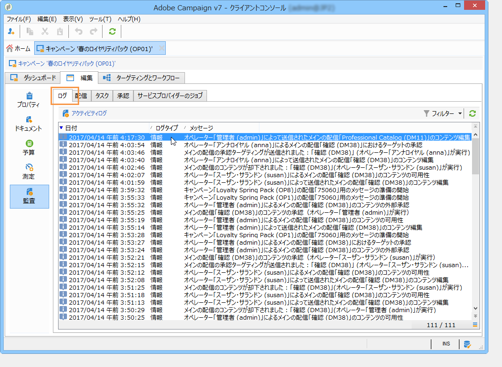
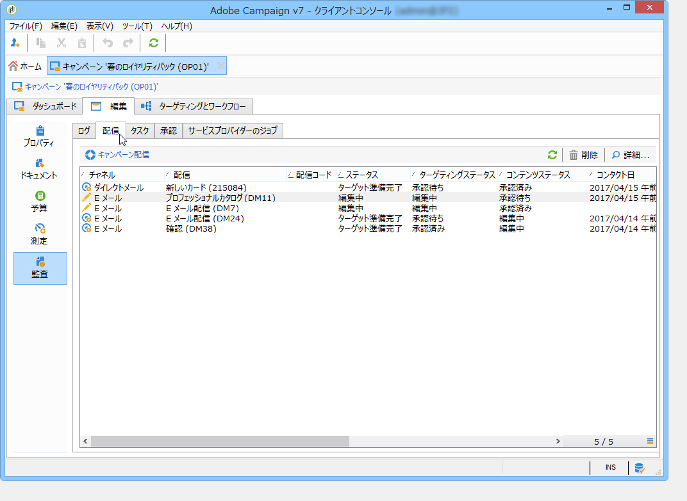
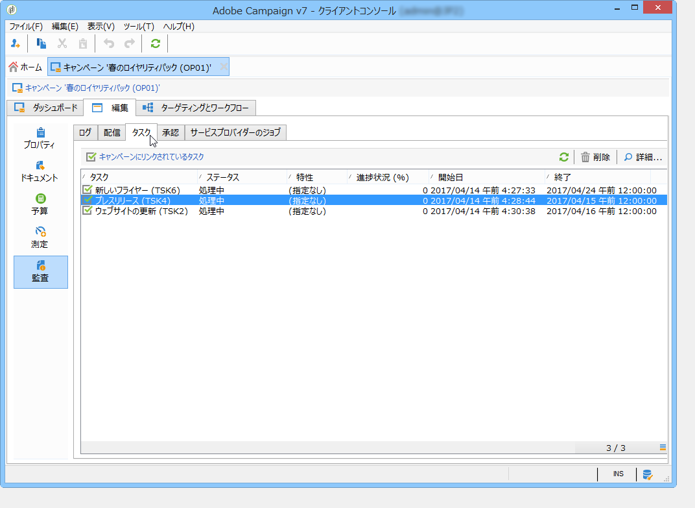
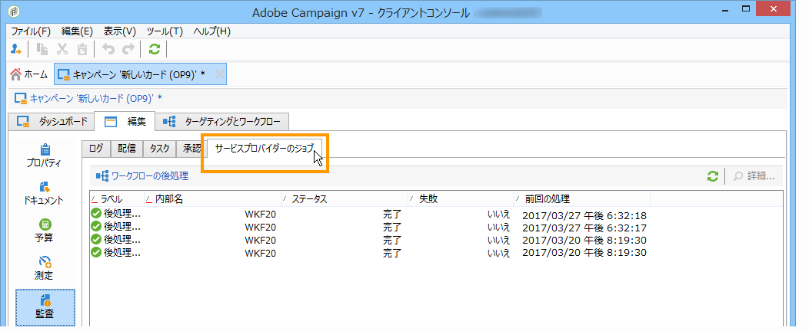
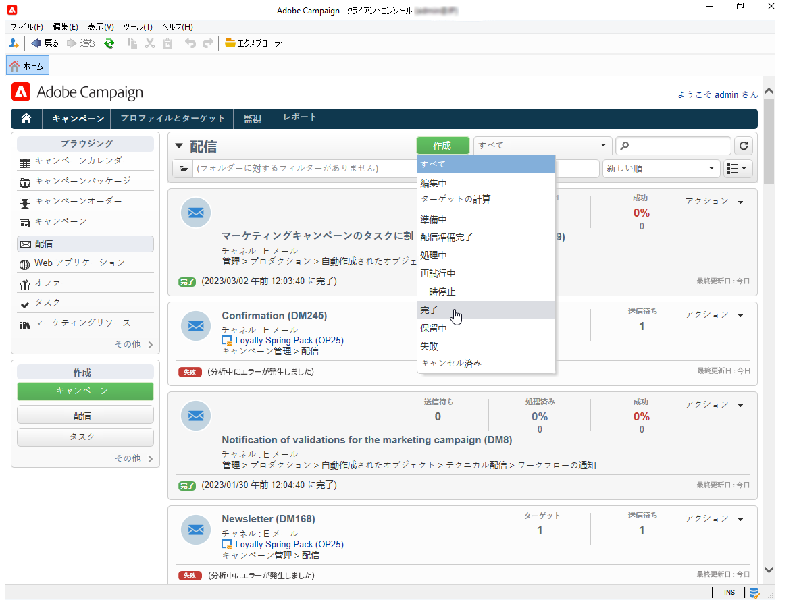

# マーケティングキャンペーンの監視 {#monitoring-marketing-campaigns}

## キャンペーンのトラッキング {#tracking-a-campaign}

キャンペーンごとに、「**[!UICONTROL 監査]**」タブを使用して、すべてのジョブとそのステータスを表示できます。 このサブタブから次の情報にアクセスできます。

* ワークフローの作成または開始、承認、抽出など、一般的にキャンペーンに関して実行されるジョブがアクティビティログに表示されます。

  

* 「**[!UICONTROL 配信]**」サブタブには、このビューから編集できるキャンペーンのすべての配信が表示されます。 編集するには、配信を選択し、「**[!UICONTROL 詳細]**」アイコンをクリックします。

  

* 「**[!UICONTROL タスク]**」サブタブには、キャンペーンにリンクされているすべてのタスクがまとめられます。 このビューを使用して、タスクを編集または削除できます。 タスクは MRM アプリケーションで使用できます。 詳しくは、[この節](../../mrm/using/creating-and-managing-tasks.md)を参照してください。

  

* サービスプロバイダー向けのメッセージを生成するために作成されたワークフローは、「**[!UICONTROL サービスプロバイダーのジョブ]**」サブタブに表示されます。 選択したワークフローを表示するには、「**[!UICONTROL 詳細]**」アイコンをクリックします。

  

## 配信トラッキング {#delivery-tracking}

配信のリストは、キャンペーンノードの「**[!UICONTROL 配信]**」リンクから表示できます。

配信ごとに、このリストを使用して、ステータス、ターゲットとなる受信者数、リンクされたキャンペーンなどの主要指標にアクセスできます。

配信のステータスを確認するには、配信を編集して、配信ダッシュボードとタブを表示します。

>[!NOTE]
>
>配信の詳細については、[この節](../../delivery/using/about-message-tracking.md)を参照してください。

## 実行のトラッキング {#execution-tracking}

Adobe Campaign のホームページから「**[!UICONTROL 配信]**」をクリックして、配信のステータスを調べることができます。 [配信トラッキング](#delivery-tracking)を参照してください。

キャンペーンで実行されるプロセスに関連する情報は、キャンペーンの&#x200B;**[!UICONTROL 編集／「監査」]**&#x200B;タブに収集されます。 このタブにキャンペーンの配信のリストを表示できます。 [詳細情報](#tracking-a-campaign)。
