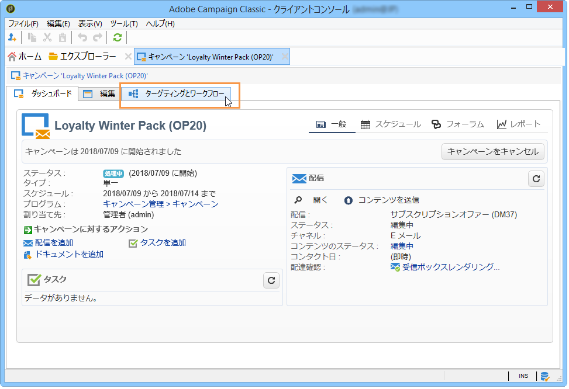
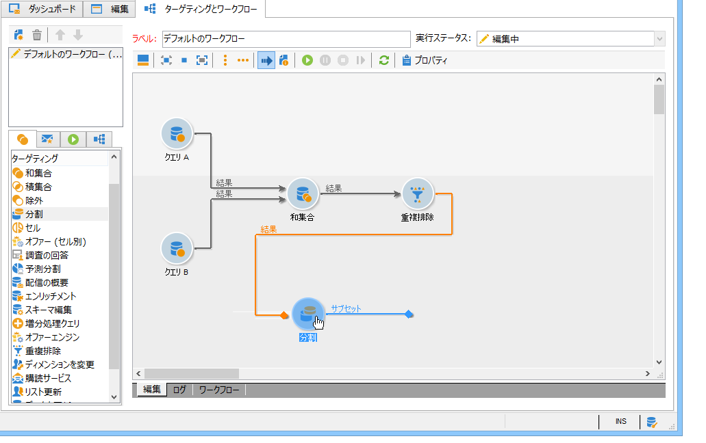
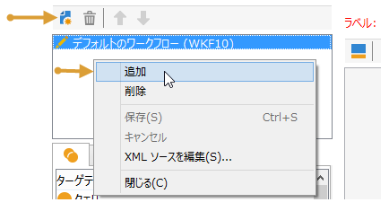
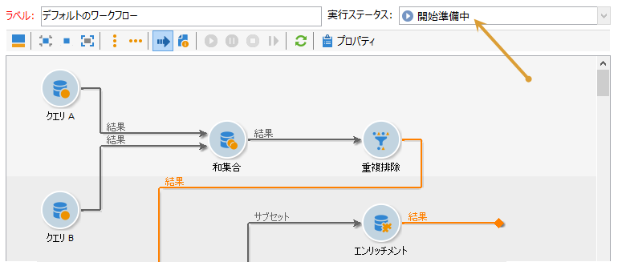
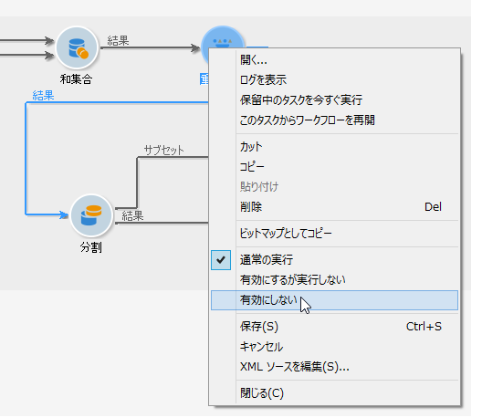
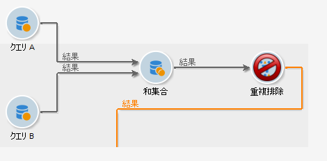
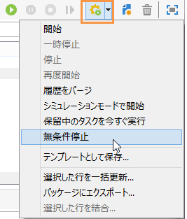
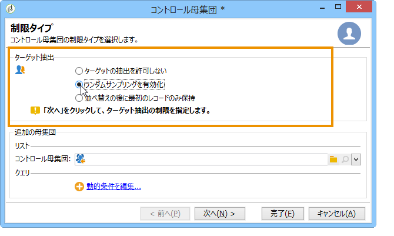
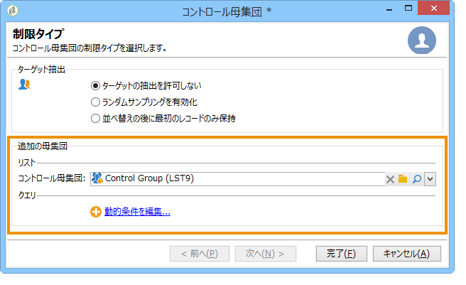

# キャンペーンのオーディエンスを選択{#marketing-campaign-deliveries}

マーケティングキャンペーンでは、各配信に対して次の項目を定義できます。

* オーディエンス - 詳細は、[ワークフローでのオーディエンスの構築](#building-the-main-target-in-a-workflow)と[ターゲット母集団の選択](#selecting-the-target-population)を参照してください。
* コントロール母集団 — 詳細については、[このセクション](#defining-a-control-group)を参照してください。
* シードアドレス - [こちら](../../delivery/using/about-seed-addresses.md)で詳しく説明します。

この情報の一部は、[キャンペーンテンプレート](../../campaign/using/marketing-campaign-templates.md#campaign-templates)から継承できます。

配信ターゲットを作成するために、データベース内の受信者のフィルタリング条件を定義できます。この受信者選択モードは、[こちら](../../delivery/using/steps-defining-the-target-population.md)で説明します。

## グループに送信

母集団をリストにインポートし、配信でこのリストをターゲットとして設定できます。これをおこなうには、以下の手順に従います。

1. 関連する配信を編集し、**[!UICONTROL 宛先]**&#x200B;リンクをクリックして、ターゲット母集団を変更します。

1. 「**[!UICONTROL メインターゲット]**」タブで「**[!UICONTROL データベースで定義]**」オプションを選択し、「**[!UICONTROL 追加]**」をクリックして、受信者を選択します。

1. 「**[!UICONTROL 受信者のリスト]**」を選択し、「**[!UICONTROL 次へ]**」をクリックして、リストを選択します。

## キャンペーンワークフロー{#building-the-main-target-in-a-workflow}でオーディエンスを構築

配信の主なターゲットは、キャンペーンワークフローでも定義できます。次のグラフ環境を使用すると、クエリ、テスト、演算子を使用してターゲットを作成できます。和集合、重複排除 - 重複、共有など

>[!IMPORTANT]
>
>1つのキャンペーンに追加できるワークフローは28個までです。 この上限を超えると、追加のワークフローはインターフェイスに表示されず、エラーが発生する可能性があります。

### ワークフローの作成 {#creating-a-targeting-workflow}

ターゲティングは、ワークフロー内のグラフィカルなシーケンスでフィルタリング条件を組み合わせて作成できます。ターゲットとする母集団およびサブ母集団を要件に合わせて作成できます。ワークフローエディターを表示するには、キャンペーンダッシュボードで「**[!UICONTROL ターゲティングとワークフロー]**」タブをクリックします。

ワークフロー内に 1 つ以上のクエリを配置して、ターゲット母集団を Adobe Campaign データベースから抽出します。クエリを作成する方法について詳しくは、[この節](../../workflow/using/query.md)を参照してください。

クエリを開始し、「和集合」、「積集合」、「共有」、「除外」などのボックスを介して母集団を共有できます。

ワークスペースの左側のリストからオブジェクトを選択し、リンクして、ターゲットを構築します。

このダイアグラムでは、ターゲットの構築に必要なターゲティングクエリとスケジューリングクエリをダイアグラム内でリンクしています。データベースから抽出された母集団を確認するために、構築の進行中にターゲティングを実行できます。

>[!NOTE]
>
>クエリを定義するための例と手順について詳しくは、[この節](../../workflow/using/query.md)で説明しています。

エディターの左側には、アクティビティを表すグラフィカルなオブジェクトのライブラリがあります。最初のタブにはターゲティングアクティビティが含まれ、2 番目のタブにはフロー制御アクティビティが含まれています。フロー制御アクティビティは、ターゲティングアクティビティの調整に使用する場合があります。

ターゲティングワークフローの実行および書式設定機能には、ダイアグラムエディターのツールバーからアクセスできます。

>[!NOTE]
>
>ダイアグラムの作成に使用できるアクティビティと、すべての表示およびレイアウト機能については、[ワークフローによる自動化](../../workflow/using/architecture.md)ガイドで詳しく説明しています。

1 つのキャンペーンに対して複数のターゲティングワークフローを作成できます。ワークフローを追加するには、次の手順に従います。

1. ワークフロー作成領域の左上に移動して右クリックし、「**[!UICONTROL 追加]**」を選択します。この領域の上にある&#x200B;**[!UICONTROL 新規]**&#x200B;ボタンも使用できます。

   

1. **[!UICONTROL 新しいワークフロー]**&#x200B;テンプレートを選択し、このワークフローに名前を付けます。
1. 「**[!UICONTROL OK]**」をクリックしてワークフローの作成を確定し、このワークフローのダイアグラムを作成します。

### ワークフローの実行{#executing-a-workflow}

適切な権限がある場合は、ツールバーの&#x200B;**[!UICONTROL 開始]**&#x200B;ボタンから手動でターゲティングワークフローを開始できます。

スケジュール（スケジューラー）またはイベント（外部信号、ファイルのインポートなど）に従って自動実行するように、ターゲティングをプログラムすることもできます。

ターゲティングワークフローの実行に関連するアクション（開始、停止、一時停止など）は、**非同期**&#x200B;プロセスです。コマンドは保存され、サーバーがそのコマンドを適用できるようになるとすぐに実行されます。

ツールバーのアイコンを使用して、ターゲティングワークフローの実行に関連するアクションを起こすことができます。

* 開始または再開

   * **[!UICONTROL 開始]**&#x200B;アイコンを使用して、ターゲティングワークフローを開始できます。このアイコンをクリックすると、入力トランジションがないすべてのアクティビティが有効化されます（終点へのジャンプを除く）。

      

      サーバーでのリクエスト処理状況はステータスに表示されます。

      

      処理ステータスが「**[!UICONTROL 開始済み]**」に変わります。

   * 適切なツールバーアイコンからターゲティングワークフローを再開できます。このコマンドは、例えばターゲティングワークフローの停止が進行中の場合など、**[!UICONTROL 開始]**&#x200B;アイコンが表示されていない場合に役立つことがあります。その場合は、**[!UICONTROL 再開]**&#x200B;アイコンをクリックして、再開を待ちます。ステータスが示すように、サーバーがリクエストを処理します。

      

      プロセスが「**[!UICONTROL 開始済み]**」ステータスになります。

* 停止または一時停止

   * ツールバーのアイコンを使用して、進行中のターゲティングワークフローを停止または一時停止できます。

      **[!UICONTROL 一時停止]**&#x200B;アイコンをクリックすると、進行中の操作は一時停止&#x200B;**[!UICONTROL されません]**&#x200B;が、次に再開されるまで他のアクティビティは開始されなくなります。

      

      サーバーでのコマンド処理状況はステータスに表示されます。

      

      ターゲティングワークフローの実行が特定のアクティビティに到達したときに、自動的に一時停止することもできます。そのように設定するには、ターゲティングワークフローを一時停止するアクティビティを右クリックし、「**[!UICONTROL 有効にするが実行しない]**」を選択します。

      

      この設定には特別なアイコンが表示されます。

      

      >[!NOTE]
      >
      >このオプションは、ターゲティングキャンペーンの詳細なデザインおよびテストフェーズで役に立ちます。

      実行を再開するには、**[!UICONTROL 開始]**&#x200B;アイコンをクリックします。

   * 進行中の実行を停止するには、**[!UICONTROL 停止]**&#x200B;アイコンをクリックします。

      

      サーバーでのコマンド処理状況はステータスに表示されます。

      
   ターゲティングワークフローの実行が特定のアクティビティに到達したときに、自動的に停止することもできます。そのように設定するには、ターゲティングワークフローを停止するアクティビティを右クリックし、「**[!UICONTROL 有効にしない]**」を選択します。

   

   

   この設定には特別なアイコンが表示されます。

   >[!NOTE]
   >
   >このオプションは、ターゲティングキャンペーンの詳細なデザインおよびテストフェーズで役に立ちます。

* 条件なしの停止

   エクスプローラーで、**[!UICONTROL 管理／プロダクション／自動作成されたオブジェクト／キャンペーンワークフロー]**&#x200B;を選択すると、すべてのキャンペーンワークフローにアクセスして操作できます。

   ワークフローを無条件で停止するには、「**[!UICONTROL アクション]**」アイコンをクリックし、「**[!UICONTROL 無条件停止]**」をクリックします。このアクションにより、キャンペーンワークフローが終了します。

   

## 追加コントロール母集団{#defining-a-control-group}

コントロール母集団は、配信を受け取らない母集団です。配信を受け取るターゲット母集団の行動と比較することで、配信後の行動とキャンペーンの影響をトラッキングします。

コントロール母集団は、メインターゲットから抽出できます。特定のグループまたはクエリから取得することもできます。

### キャンペーン{#activating-the-control-group-for-a-campaign}のコントロール母集団をアクティブにします

コントロール母集団は、キャンペーンレベルで定義できます。この場合、該当するキャンペーンの配信ごとにコントロール母集団が適用されます。

1. 該当するキャンペーンを編集し、「**[!UICONTROL 編集]**」タブをクリックします。
1. 「**[!UICONTROL キャンペーンの詳細設定]**」をクリックします。

   

1. 「**[!UICONTROL コントロール母集団の設定を有効にして編集]**」オプションを選択します。
1. 「**[!UICONTROL 編集...]**」をクリックして、コントロール母集団を設定します。

   

設定手順について詳しくは、[メインターゲットからのコントロール母集団の抽出](#extracting-the-control-group-from-the-main-target)および[コントロール母集団の追加](#adding-a-population)で説明しています。

### 配信{#activating-the-control-group-for-a-delivery}のコントロール母集団をアクティブにします

コントロール母集団は、配信レベルで定義できます。この場合、該当するキャンペーンの配信ごとにコントロール母集団が適用されます。

デフォルトでは、キャンペーンレベルで定義されたコントロール母集団の設定が、そのキャンペーンの配信ごとに適用されます。ただし、個々の配信にコントロール母集団を適応させることもできます。

>[!NOTE]
>
>キャンペーンのコントロール母集団を定義済みで、このキャンペーンにリンクされている配信用にもコントロール母集団を設定する場合は、配信用に定義されたコントロール母集団のみが適用されます。

1. 該当する配信を編集し、「**[!UICONTROL E メールパラメーター]**」セクションの「**[!UICONTROL 宛先]**」リンクをクリックします。

   

1. 「**[!UICONTROL コントロール母集団]**」タブをクリックし、「**[!UICONTROL コントロール母集団の設定を有効にして編集]**」を選択します。
1. 「**[!UICONTROL 編集...]**」をクリックして、コントロール母集団を設定します。。

設定手順について詳しくは、[メインターゲットからのコントロール母集団の抽出](#extracting-the-control-group-from-the-main-target)および[コントロール母集団の追加](#adding-a-population)で説明しています。

### メインターゲット{#extracting-the-control-group-from-the-main-target}からコントロール母集団を抽出します

配信のメインターゲットから受信者を抽出できます。この場合、受信者は、この設定に影響を受ける配信アクションのターゲットから選ばれます。ランダムに抽出することも、受信者の並べ替え結果を使用することもできます。

コントロール母集団を抽出するには、キャンペーンまたは配信のコントロール母集団を有効にして、「**[!UICONTROL ランダムサンプリングを有効化]**」オプションまたは「**[!UICONTROL 並べ替えの後に最初のレコードのみ保持]**」オプションのどちらかを選択します。

* **[!UICONTROL ランダムサンプリングを有効化]**：ターゲット母集団に含まれる受信者にランダムサンプリングを適用します。しきい値を 100 に設定した場合、コントロール母集団は、ターゲット母集団からランダムに選択された 100 人の受信者で構成されます。ランダムサンプリングはデータベースエンジンに依存します。
* **[!UICONTROL 並べ替えの後に最初のレコードのみ保持]**：1 つ以上の並べ替え順に基づいて、制限を定義できます。並べ替えの基準として「**[!UICONTROL 年齢]**」フィールドを選択し、しきい値として 100 を定義した場合、コントロール母集団は最も若い 100 人の受信者で構成されます。例えば、ほとんど購入していない受信者や、頻繁に購入する受信者を含むコントロール母集団を定義して、その行動と、コンタクトされた受信者の行動を比較すると、興味深い結果が得られる可能性があります。

「**[!UICONTROL 次へ]**」をクリックして、並べ替え順を定義し（必要な場合）、受信者の制限モードを選択します。

この設定は、ワークフロー内の共有アクティビティと同等で、ターゲットをサブセットに分割できます。コントロール母集団は、このようなサブセットのひとつです。詳しくは、[この節](../../workflow/using/architecture.md)を参照してください。

### 新しい母集団をコントロール母集団として使用{#adding-a-population}

コントロール母集団として使用する新しい母集団を定義できます。この母集団は、受信者のグループから作成することも、特定のクエリを使用して作成することもできます。

>[!NOTE]
>
>Adobe Campaign クエリエディターについては、[この節](../../workflow/using/query.md)を参照してください。

#### チュートリアルビデオ {#create-email-video}

このビデオでは、Adobe Campaignでキャンペーンと電子メールを作成する方法を説明します。

>[!VIDEO](https://video.tv.adobe.com/v/25604?quality=12)

Campaign に関するその他のハウツービデオは[こちら](https://experienceleague.adobe.com/docs/campaign-classic-learn/tutorials/overview.html?lang=ja)で参照できます。