# マーケティングキャンペーンテンプレート {#campaign-templates}

キャンペーンテンプレートはノード内で集中化さ **[!UICONTROL Resources > Templates > Campaign templates]** れています。 デフォルトのテンプレートは、標準として提供されます。デフォルトのテンプレートで、使用可能なすべてのモジュール（ドキュメント、タスク、シードアドレスなど）を使用して、新しいキャンペーンを作成できますが、提供されるモジュールは、ユーザーの権限と Adobe Campaign プラットフォームの設定によって異なります。

## キャンペーンテンプレートの作成または複製 {#creating-or-duplicating-a-campaign-template}

新しいテンプレートを作成するには、次の手順に従います。

1. Campaign **エクスプローラー**&#x200B;を開きます。
1. **リソース／テンプレート／キャンペーンテンプレート**&#x200B;で、テンプレート一覧の上にあるツールバーの「**新規**」をクリックします。

   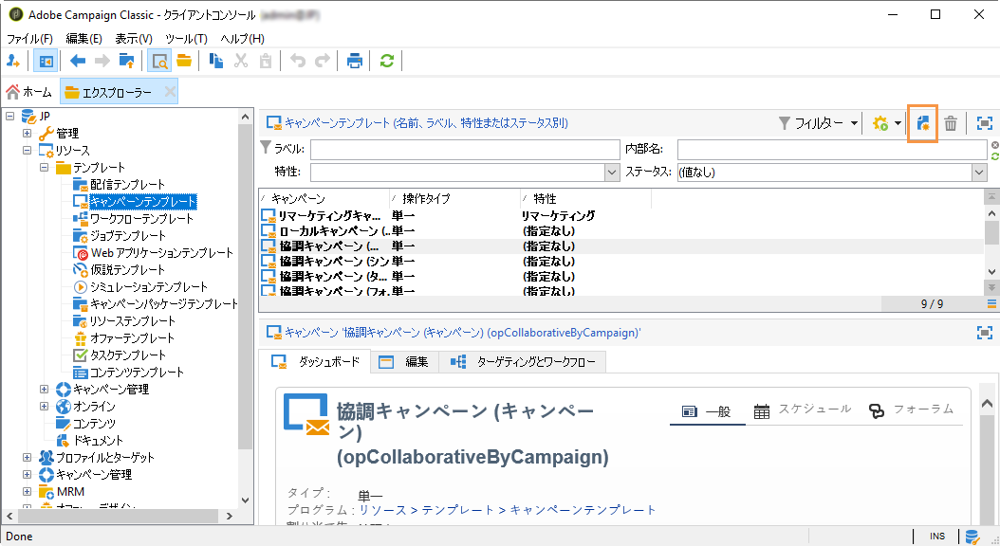

1. 作成するキャンペーンテンプレートのラベルを入力します。
1. 「**保存**」をクリックし、作成したテンプレートをもう一度開きます。
1. 「**編集**」タブで、「**内部名**」やその他の値を必要に応じて入力します。
1. 「**キャンペーンの詳細パラメーター...**」を選択し、キャンペーンテンプレートにワークフローを追加します。

   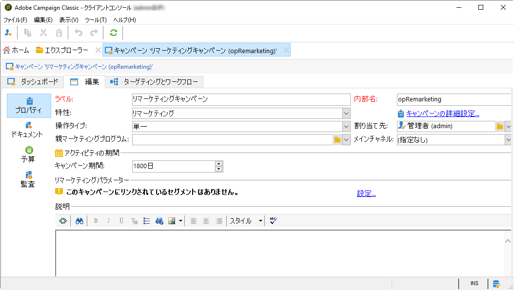

1. 「**ターゲティングとワークフロー**」の値として「**はい**」を選択します。

   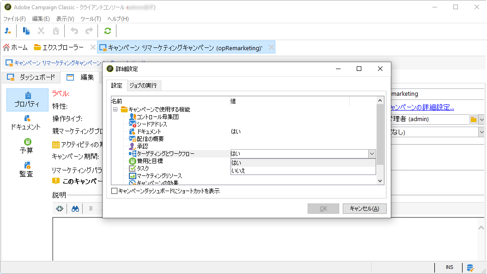

1. 「**ターゲティングとワークフロー**」タブで、「**ワークフローを追加...**」をクリックします。

   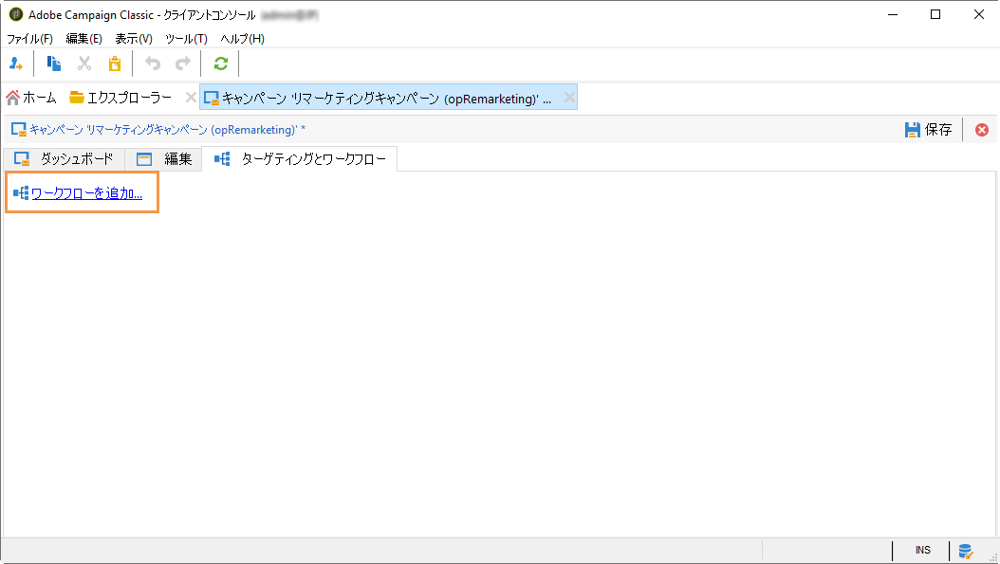

1. 「**ラベル**」フィールドを入力し、「**OK**」をクリックします。
1. 要件に応じた内容のワークフローを作成します。
1. 「**保存**」をクリックします。作成したワークフローが、キャンペーン内で使用できる状態になります。

デフォルトのテンプレートを複製し、設定を再利用および調整して使用することもできます。

The various tabs and sub-tabs of the campaign template allow you to access its settings, described in [General configuration](#general-configuration).

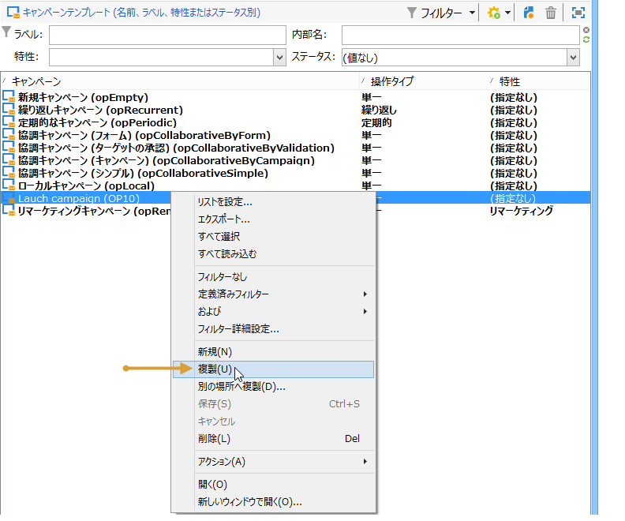

## キャンペーンテンプレートの設定 {#configuring-a-campaign-template}

キャンペーンは、事前定義された一連のパラメーターを共有するモデルに基づいています。

In a default configuration, the campaign templates are centralized in the **[!UICONTROL Resources > Templates > Campaign templates]** node of the Adobe Campaign tree.

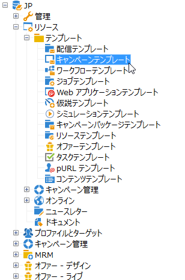

>[!NOTE]
>
>The tree is displayed when you click the **[!UICONTROL Explorer]** icon on the home page.

特定の設定が定義されていないキャンペーンを作成するために、あらかじめ用意されているテンプレートが用意されています。 キャンペーンテンプレートを作成および設定して、そのテンプレートからキャンペーンを作成することもできます。

The creation and configuration of campaign templates are presented in [Campaign templates](#campaign-templates).

キャンペーンの作成について詳しくは、[キャンペーンと E メールの作成](https://docs.campaign.adobe.com/doc/AC/en/Videos/Videos.html)のビデオを参照してください。

## 使用可能モジュールの設定 {#configuration-of-the-available-modules}

### モジュールの選択 {#module-selection}

The **[!UICONTROL Advanced campaign settings...]** link lets you enable and disable jobs for the campaigns based on this template. このテンプレートをベースとして作成されたキャンペーンで有効にしたい機能を選択します。

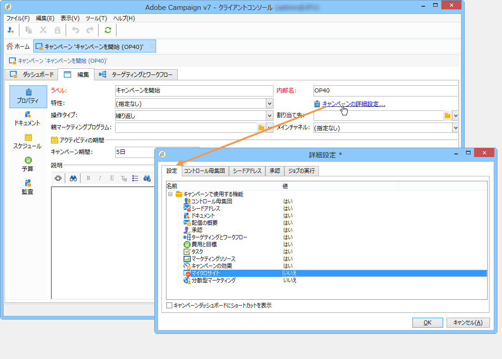

機能が選択されていない場合、プロセスに関連する要素（メニュー、アイコン、オプション、タブ、サブタブなど）は、テンプレートのインターフェイスや、このテンプレートをベースとするキャンペーンに表示されません。通常、キャンペーン詳細の左側のタブは、テンプレートで選択されているプロセスと一致します。For example, if **Expenses and objectives** is not selected, the corresponding **[!UICONTROL Budget]** tab will not be shown in campaigns based on this template.

さらに、設定ウィンドウへのショートカットがキャンペーンダッシュボードに追加されます。機能を有効にすると、キャンペーンダッシュボードから直接リンクでその機能にアクセスできます。

例えば、以下の設定の場合、

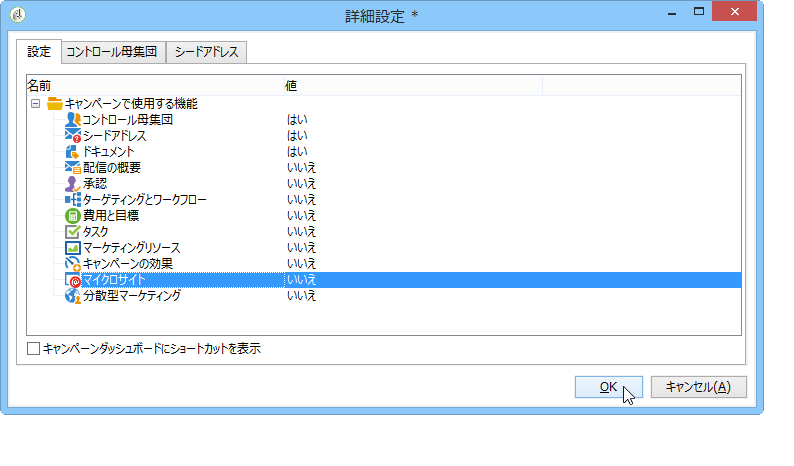

The following links are displayed in the campaign dashboard (the **[!UICONTROL Add a task]** link is missing):

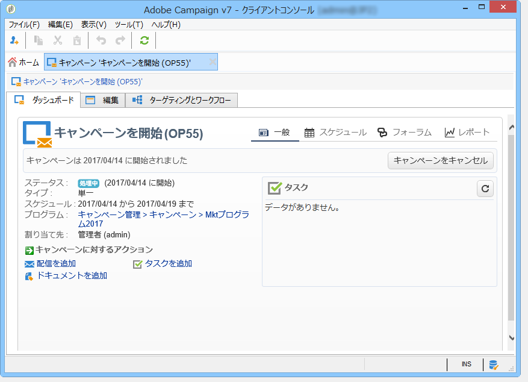

次のタブのみが表示されます。

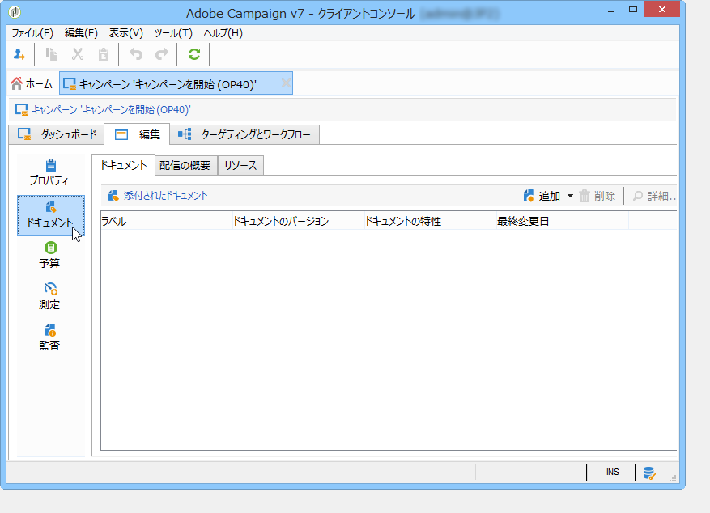

一方、次のタイプの設定の場合、

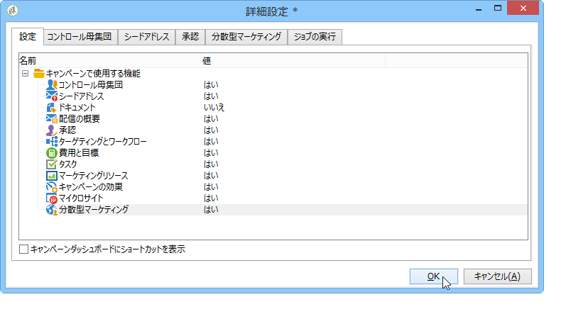

以下のリンクとタブが表示されます。

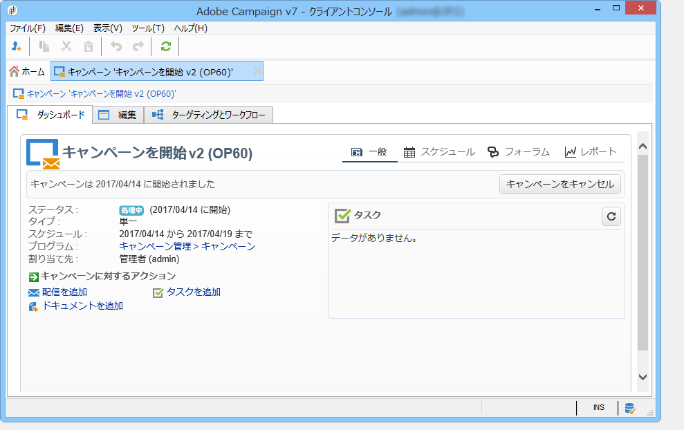

### 有効なモジュールのタイポロジ {#typology-of-enabled-modules}

* **コントロール母集団**

   このモジュールを選択すると、テンプレートおよびこのテンプレートをベースとするキャンペーンの詳細設定にタブが追加されます。テンプレートで、またはキャンペーンごとに個別に、設定を定義できます。

   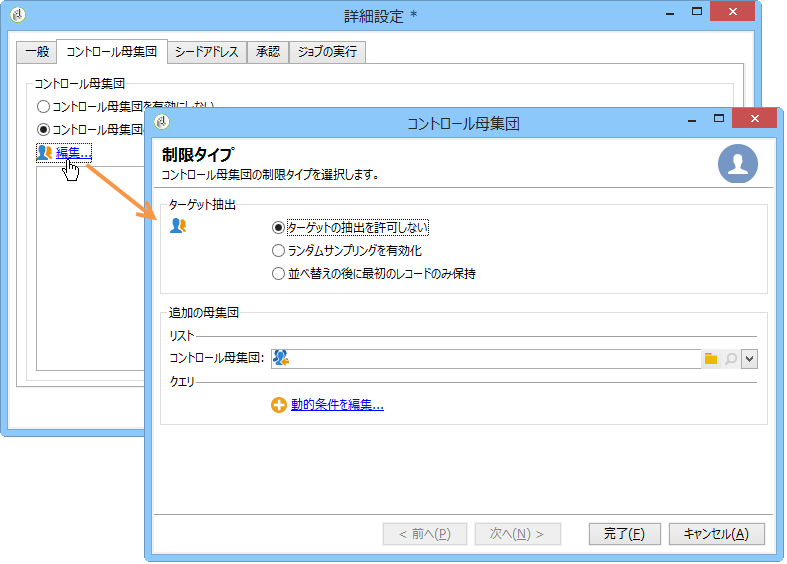

* **シードアドレス**

   このモジュールを選択すると、テンプレートおよびこのテンプレートをベースとするキャンペーンの詳細設定にタブが追加されます。テンプレートで、またはキャンペーンごとに個別に、設定を定義できます。

   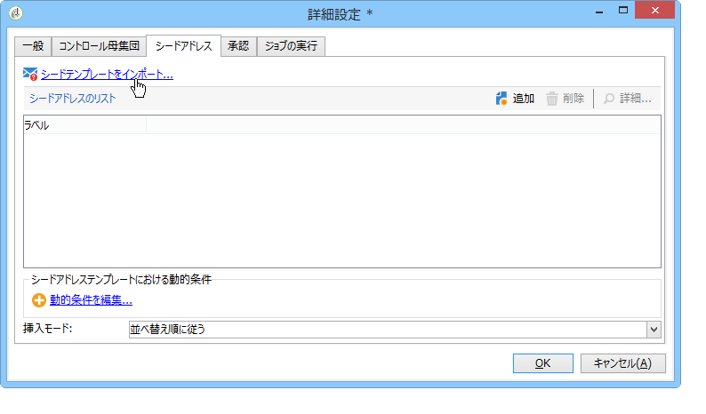

* **ドキュメント**

   When this module is selected, an additional tab is added to the **[!UICONTROL Edition]** tab of the template and the campaigns based on this template. テンプレートで、またはキャンペーンごとに個別に、添付ドキュメントを追加できます。

   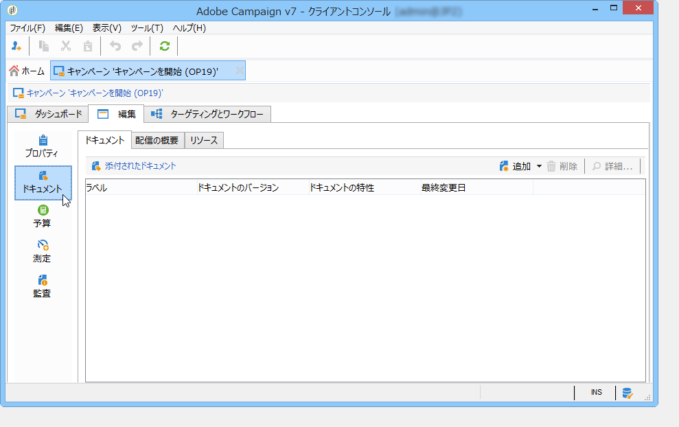

* **概要**

   When this module is selected, a **[!UICONTROL Delivery outlines]** sub-tab is added to the **[!UICONTROL Documents]** tab in order to define delivery outlines for the campaign.

   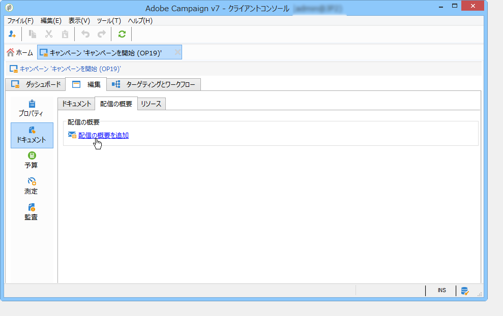

* **ターゲティングとワークフロー**

   When you select the **[!UICONTROL Targeting and workflows]** module, a tab is added to let you create one or more workflows for campaigns based on this template. ワークフローは、このテンプレートをベースとするキャンペーンごとに個別に設定することもできます。

   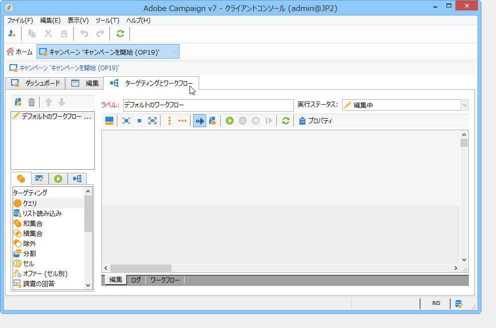

   このモジュールを有効にすると、プロセス実行シーケンスを定義するためのタブがキャンペーンの詳細設定に追加されます。

   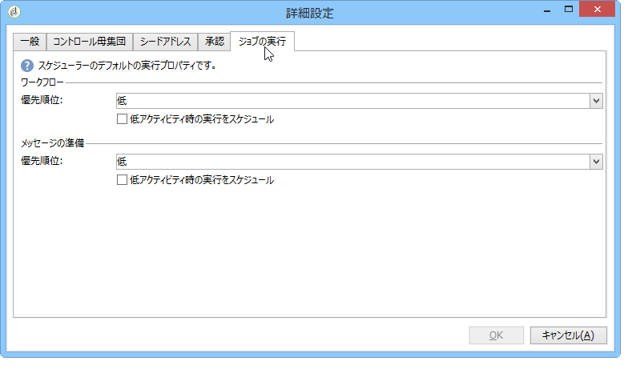

* **承認**

   If you select the **[!UICONTROL Approval]**, you can select the processes to approve as well as the operators in charge of approvals.

   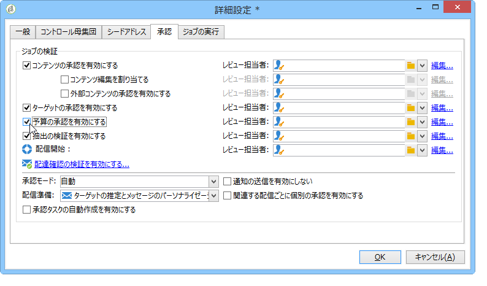

* **費用と目標**

   When this module is selected, a **[!UICONTROL Budget]** tab is added to the details of the template and campaigns based on this template so that the associated budget can be selected.

   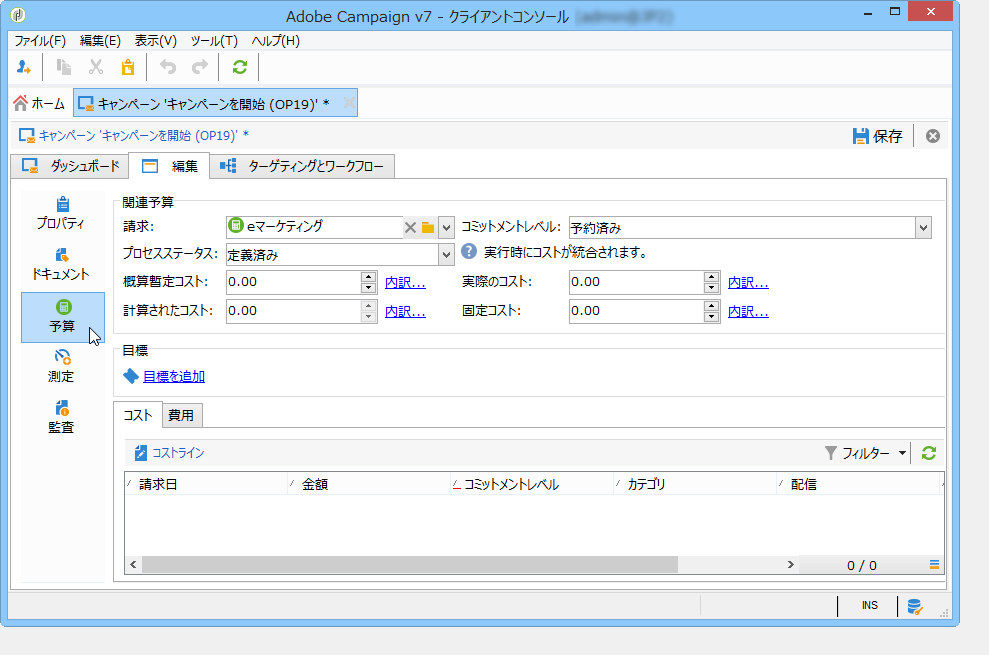

### ジョブの承認 {#approval-of-jobs}

You may choose whether or not to enable process approval via the **[!UICONTROL Approvals]** tab of the templates advanced settings section. メッセージの配信を許可するために、承認が選択されているジョブを承認する必要があります。

レビュー担当オペレーターまたはオペレーターのグループを、有効化された各承認に関連付ける必要があります。

## 一般設定 {#general-configuration}

### テンプレートのプロパティ {#template-properties}

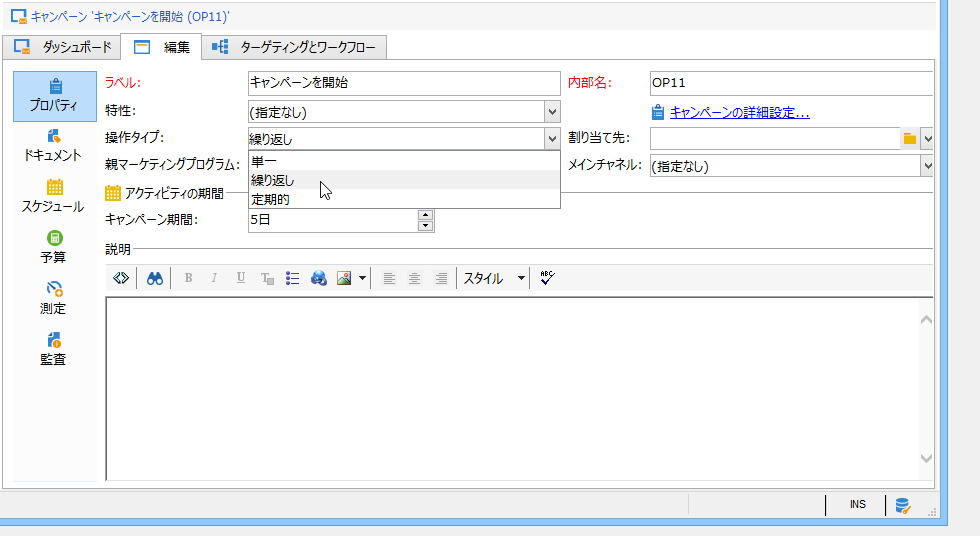

キャンペーンテンプレートを作成するときは、次の情報を入力する必要があります。

* テンプレートの&#x200B;**ラベル**&#x200B;を入力：デフォルトでは、このテンプレートから作成されるすべてのキャンペーンにこのラベルが割り当てられます。
* ドロップダウンリストからキャンペーンの&#x200B;**特性**&#x200B;を選択します。このリストに表示される値は、**[!UICONTROL natureOp]** 列挙に保存されている値です。

   >[!NOTE]
   >
   >列挙について詳しくは、[はじめに](../../platform/using/managing-enumerations.md)の節を参照してください。

* **キャンペーンのタイプ**&#x200B;を選択：単一、繰り返しまたは定期的。デフォルトでは、キャンペーンテンプレートは単一のキャンペーンに適用されます。繰り返しおよび定期的なキャンペーンについては、以下を参照してください。定期的 [なキャンペーン](../../campaign/using/setting-up-marketing-campaigns.md#recurring-and-periodic-campaigns)。
* キャンペーン期間、すなわちキャンペーンが実施される日数を指定します。このテンプレートをベースとしてキャンペーンを作成すると、キャンペーンの開始日と終了日が自動的に設定されます。

   繰り返しキャンペーンの場合は、キャンペーンの開始日と終了日をテンプレートで直接指定する必要があります。

* テンプレートの&#x200B;**親マーケティングプログラム**&#x200B;を指定：このテンプレートをベースとするキャンペーンは、選択したプログラムにリンクされます。

### テンプレート実行パラメーター {#template-execution-parameters}

このリ **[!UICONTROL Advanced campaign settings...]** ンクを使用すると、配信ターゲット（コントロールグループ、シードアドレスなど）を処理するためのテンプレートのアドバンスオプションを設定できます。キャンペーン測定とワークフロー実行の設定に関する情報を提供します。

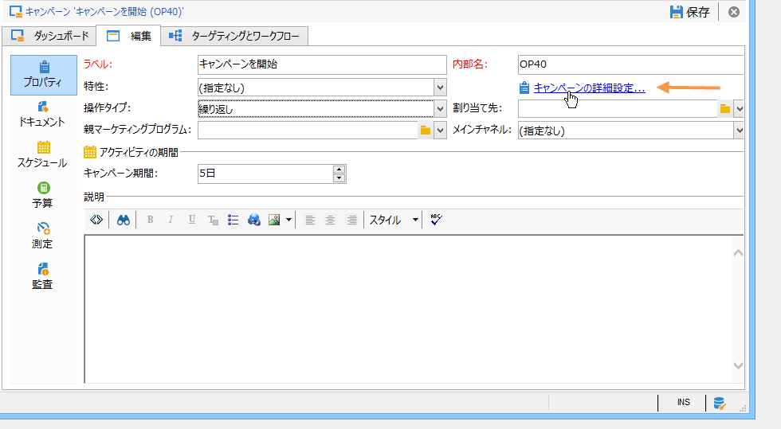

## キャンペーンの逆スケジューリング {#campaign-reverse-scheduling}

例えば、日付があらかじめわかっているイベントを準備するために、キャンペーンの逆スケジュールを作成できます。キャンペーンテンプレートでは、キャンペーンの終了日に基づいてタスクの開始日を計算できるようになりました。

タスク設定ボックスで、領域に移動し、ボッ **[!UICONTROL Implementation schedule]** クスをチェックし **[!UICONTROL The start date is calculated based on the campaign end date]** ます。 （「開始日」とはタスクの開始日です）。Go to the **[!UICONTROL Start]** field and enter an interval: the task will start this long before the campaign end date. 設定されているキャンペーン期間より長い期間を入力した場合、タスクはキャンペーンより前に開始されます。

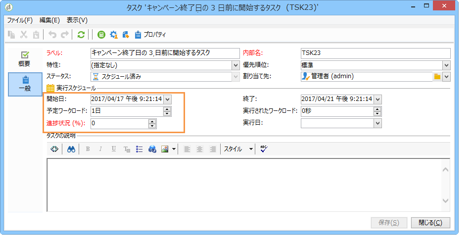

このテンプレートを使用してキャンペーンを作成すると、タスクの開始日が自動的に計算されます。ただし、後でいつでも変更できます。
