# 頻度ルール{#pressure-rules}

## マーケティング疲労について {#about-marketing-fatigue}

営業の頻度管理を実施すると、マーケティング疲労と呼ばれる過度な勧誘がデータベースの母集団に対しておこなわれるのを防ぐことができます。頻度管理では、各受信者宛てのメッセージの最大数を定義できます。また、キャンペーンの判別ルールを適用して、ターゲットとなる母集団に最も適切なキャンペーンメッセージを送信することができます。

**頻度**&#x200B;ルール：例えば、マーケティング疲労を管理するために、母集団に送信する郵便物の数を 2 通までに制限したり、購読者グループの興味に合致するコミュニケーションを選択したり、不満を抱いている顧客に SMS を送信することを避けたりできます。

キャンペーンは、定義されたしきい値とメッセージの重み付けに基づいて判別されます。

* しきい値とは、特定の期間内に特定の受信者に送信することが許される配信の最大数であり、定数または変数を指定することができます。しきい値は、タイポロジルールの設定で定義または計算されます。詳しくは、 [メッセージの最大数を参照](#maximum-number-of-messages)。
* 配信に重みを付けることで、頻度管理のフレームワーク内で最も優先順位の高い配信を指定できます。最も大きな重みを付けられたメッセージが、最優先されます。「メッセージの重 [み」を参照](#message-weight)。

判別ルールを適用すれば、予約されているキャンペーンの重みが現在進行中のキャンペーンより大きい場合に、プロファイルに対する過度の勧誘が実施されないよう配信を制御できます。この場合は、特定のプロファイルが配信から除外されます。

判別の基準（メッセージの重み付けとしきい値）は、次の 2 つのタイプの情報に基づいて決定される場合があります。

* 受信者の環境設定：ニュースレターの購読、受信者のステータス（顧客または見込み客）などの叙述情報
* 受信者の行動：購入、リンクの訪問など

送信するメッセージを決定する判別ルールは、分析の段階で適用されます。次の式が真の場合、各受信者および関連期間に対してメッセージが送信されます。 **（送信されたメッセージの数） + （より大きな重みを持つメッセージの数） &lt;しきい値**。

それ以外の場合は、受信者はになりま **[!UICONTROL Excluded by arbitration]**&#x200B;す。 詳しくは、「調停後の除外」を [参照してください](#exclusion-after-arbitration)。

## 頻度ルールの作成 {#creating-a-pressure-rule}

Adobe Campaign でキャンペーンの判別を設定するには、まずキャンペーンタイポロジを作成し、リンクするタイポロジルール（**頻度**&#x200B;ルール）を定義します。

To create and configure a **[!UICONTROL Pressure]** typology rule, apply the following steps:

1. In the list of campaign typology rules, click the **[!UICONTROL New]** icon above the list.

   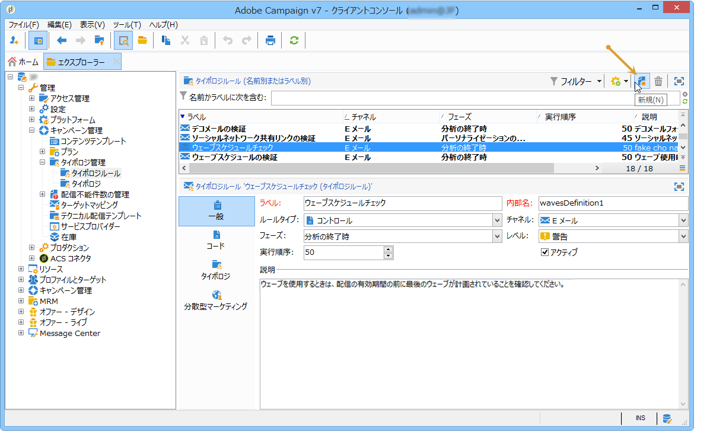

1. In the **[!UICONTROL General]** tab of the new rule, select a **Pressure** type rule and enter a name and description for it.

   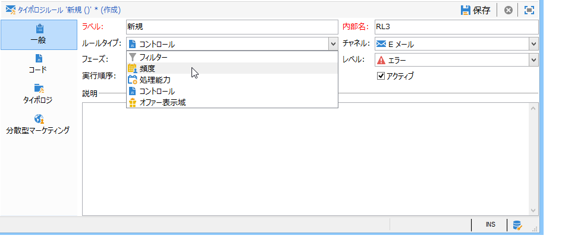

1. 必要に応じて実行順序を変更します。When multiple typology rules are applied as a **[!UICONTROL Typology]** set, the lower ordered rules are applied first. For more on this, refer to [Execution order](../../campaign/using/applying-rules.md#execution-order).
1. In the **[!UICONTROL Calculation parameters]** section, define a frequency if you want to save targeting beyond the next daily re-arbitration execution. 詳しくは、計算頻度の調整を参 [照してください](../../campaign/using/applying-rules.md#adjusting-calculation-frequency)。
1. Click the **[!UICONTROL Pressure]** tab and choose the calendar period during which the typology rule applies.

   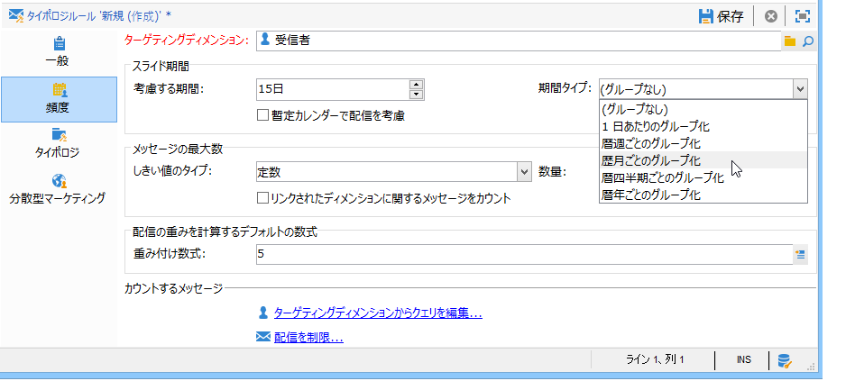

   作成するルールは、コンタクト日がこの期間内に含まれる配信に適用されます。

   >[!NOTE]
   >
   >Scheduled deliveries are only taken into account if the **[!UICONTROL Take the deliveries into account in the provisional calendar]** option is selected. For more on this, refer to [Setting the period](#setting-the-period).

1. メッセージの最大数を計算する方法を定義します。

   しきい値は、指定期間内に受信者に送信できるメッセージの最大数を表します。

   デフォルトでは、定数のしきい値が使用されます。この場合は、ルールで許可されるメッセージの最大数の値を指定してください。

   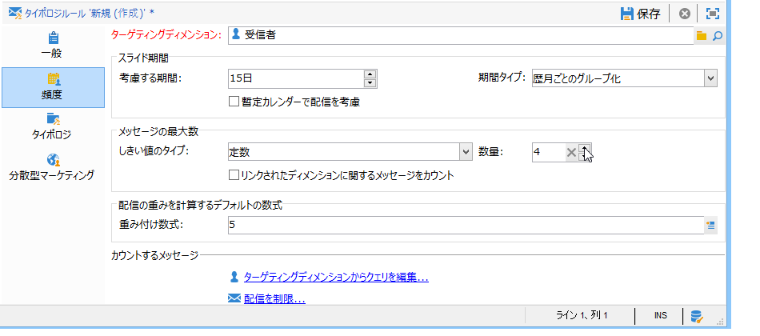

   To define a variable threshold, select the **[!UICONTROL Depends on the recipient]** value in the **[!UICONTROL Type of threshold]** field and use the icon on the right to open the expression editor.

   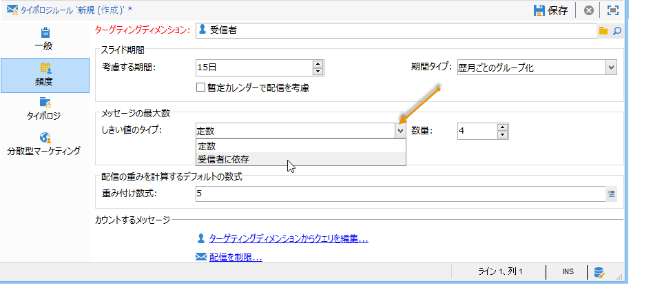

   詳しくは、「メッセージの最 [大数」を参照してください](#maximum-number-of-messages)。

1. 配信の重み付けを計算する方法を指定します。

   すべての配信には重みが付けられます。重みとは優先順位を表す値であり、この重みに基づいてキャンペーンの判別が実施されます。重みは、タイポロジルールまたはプロパティで定義される数式を使用して計算されます。For more on this, refer to [Message weight](#message-weight).

1. デフォルトでは、しきい値の計算にはすべてのメッセージが考慮されます。The **[!UICONTROL Restriction]** tab lets you filter the messages concerned by the typology rule:

   * 「ターゲティングディメンションからクエリを編集」では、対象となる受信者を制限できます。
   * このタブの下部セクションでは、カウントするメッセージをフィルタリングできます。

      以下の例では、**NewContacts** フォルダーに保存されている受信者のみが対象となり、「**Newsletter**」で始まる配信のみが考慮されます。
   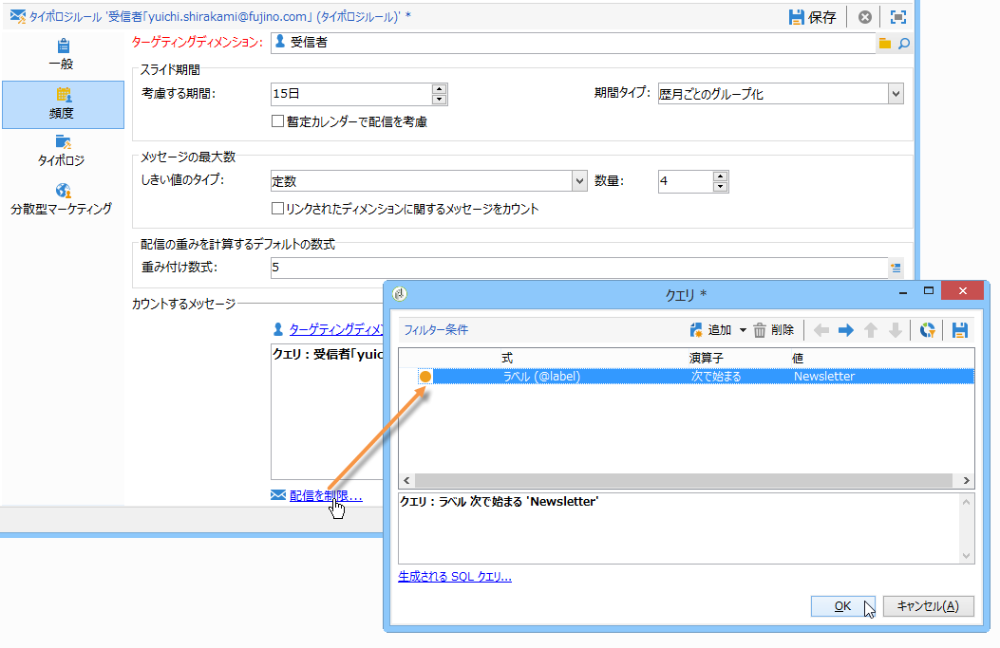

1. The **[!UICONTROL Typologies]** tab lets you view the campaign typologies which apply this rule or link the rule to one or more existing typologies. 詳しくは、[タイポロジの適用](../../campaign/using/about-campaign-typologies.md#applying-typologies)を参照してください。

## しきい値と重みの定義 {#defining-thresholds-and-weights}

### メッセージの最大数 {#maximum-number-of-messages}

すべての頻度ルールには、しきい値が定義されます。しきい値は、指定された期間内に 1 人の受信者に送信できるメッセージの最大数を表します。しきい値に達すると、その後は指定された期間が完了するまで、配信は実施できなくなります。このプロセスにより、メッセージの数がしきい値を超過する場合は、受信者が配信から自動的に除外されるので、過度の勧誘がおこなわれないようにすることができます。

しきい値には定数を指定できます。または、変数を含む数式を定義して、しきい値を算出することもできます。その場合、同じ期間であっても受信者によってしきい値が異なったり、場合によっては、受信者が同一であってもしきい値が異なったりすることがあります。

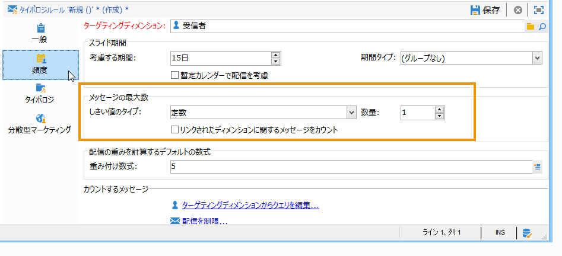

>[!CAUTION]
>
>しきい値として「**0**」を入力すると、指定された期間内はターゲット母集団に配信が一切送信されなくなります。

**例：**

受信者が所属するセグメントによって、許可するメッセージの数を変えることができます。例えば、Web セグメントに所属する受信者に、他の受信者より多くのメッセージを送信できるようにするには、An **[!UICONTROL Iif (@origin='Web', 5, 3)]** type formula authorizes the delivery of 5 messages to recipients and 3 for other segments. 設定の手順は以下のとおりです。

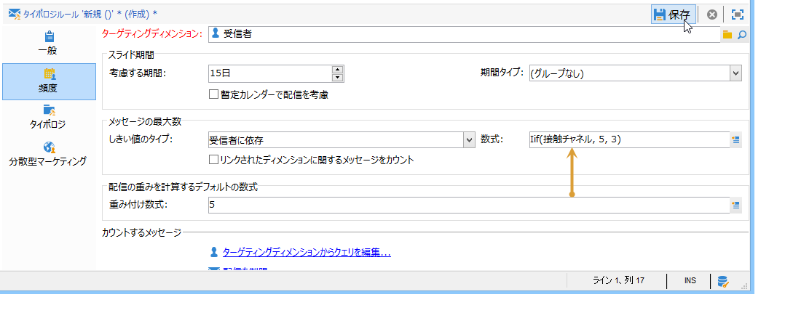

しきい値を定義する際には、ターゲティングディメンションにリンクされているディメンションを使用できます。例えば、訪問者テーブルに格納されている受信者プロファイルへのメッセージを含めることができます（訪問者テーブルについて詳しくは、[この節](../../web/using/use-case--creating-a-refer-a-friend-form.md)を参照）。または、同一世帯へのメッセージの配信（複数の E メールアドレスが関係する）を週に一度までに制限することもできます。この場合、同一世帯かどうかは、受信者のディメンションにリンクされているディメンションによって判断されます。

その場合は、このオプションを選択 **[!UICONTROL Count messages on a linked dimension]** し、訪問者または連絡先テーブルを選択します。

### メッセージの重み付け {#message-weight}

各配信には、優先順位を表す重みが付けられます。デフォルトでは、配信の重みは 5 に設定されています。頻度ルールでは、配信に適用する重みを定義できます。

重みの値は、定数を指定するか、受信者ごとに数式で算出します。例えば、受信者の興味に基づいて配信の重みを定義することができます。

>[!CAUTION]
>
>The weight defined in a typology rule can be overloaded individually for each delivery, in the **[!UICONTROL Properties]** tab. Click the **[!UICONTROL Typology]** tab to select the campaign typology and, if necessary, specify the weight to be applied.\
>ただし、タイポロジルール A で宣言されている重みがタイポロジルール B の計算で使用されることはありません。この重みはルール A を使用する配信でのみ使用されます。

**例：**

次の例では、音楽関係のニュースレターの重みを受信者の傾向のスコアにリンクします。手順は次のとおりです。

1. 受信者の傾向スコアを格納する新しいフィールドを作成します。このフィールド（**@Music** とする）には、アンケートやオンライン調査に対する回答、収集されたトラッキングデータなどが格納されます。
1. このフィールドに基づいてメッセージの重みを計算する、タイポロジルールを作成します。

   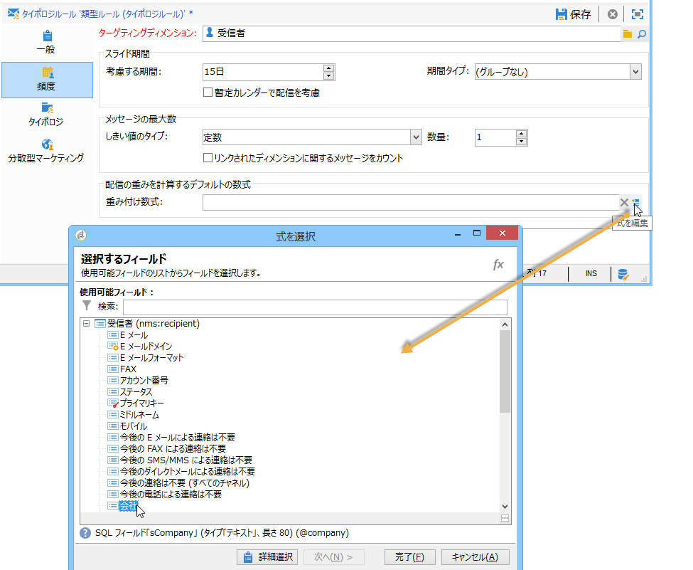

1. 作成したルールを、ニュースレターやスペシャルオファーなど、特定のトピックのメッセージに適用します。これらの配信の重み、つまり優先順位は、各受信者の傾向スコアに基づいて決定されます。

## 期間の設定 {#setting-the-period}

頻度ルールは、**n** 日周期で定義されます。

The period is configured in the **[!UICONTROL Pressure]** tab of the rule. 日数を指定し、必要に応じて、適用するグループ化のタイプ（日、週、月、四半期など）を選択します。

The grouping type lets you extend the **[!UICONTROL Period considered]** field to the whole day, calendar week, calendar month or calendar year for dates for the period.

例えば、頻度ルールで 1 週間に 2 つのメッセージというしきい値が定義されている場合、「暦月ごとのグループ化」を選択すると、その 1 週間だけでなく、同じ暦月内にメッセージが 3 つ以上配信されないようにすることができます。警告：考慮する期間が 2 ヶ月にまたがっている場合は、その 2 つの暦月内の配信がしきい値の計算の対象となるので、2 ヶ月目の新しい配信はすべて実行できなくなる可能性があります。

>[!NOTE]
>
>デフォルトのしきい値の計算では、送信済みの配信のみが考慮されます。該当期間に **[!UICONTROL Take the deliveries into account in the provisional calendar]** スケジュールされた配信も考慮する場合は、このオプションを選択します。 オンにすると、対象の期間が 2 倍になり、過去の配信に加えて、今後予定されている配信も考慮されます。\
>考慮する配信を 2 週間以内に制限するには、次のいずれかを実行します。
>
>* Enter **15d** in the **[!UICONTROL Concerned period]** field: deliveries sent up to two weeks before the date of the delivery which the rule is applied to will be taken into account in the calculation,
>
>  
または
>
>* フィ **ールドに** 7dと入力 **[!UICONTROL Period considered]** し、 **[!UICONTROL Take the deliveries into account in the provisional calendar]**\
   >オプション：配信日の7日前までに送信され、ルールが適用される配信日から7日後までにスケジュールされた配信は、計算に考慮されます。
>
>
期間の開始日は、データベースの設定によって異なります。

例えば、グループなしで 15 日間の頻度ルールを 12 月 11 日の配信に適用すると、11 月 27 日から 12 月 12 日までの配信が計算に含められます。暫定カレンダーで配信を考慮する場合は、11 月 27 日から 12 月 27 日までに予約されているすべての配信が計算に含められます。また、暦月ごとのグループ化を設定すると、11 月と 12 月の配信がすべて、しきい値の計算に含められます（11 月 1 日から 12 月 31 日まで）。

>[!CAUTION]
>
>**よくある事例**
>To make sure that deliveries for the current calendar week are not taken into account, as well as not to risk also taking into account those from the previous week for the calculation threshold, specify the **[!UICONTROL Period considered]** at &#39;0&#39; and select &#39;Grouping per calendar week&#39; as the **[!UICONTROL Period type]**.
> 
>「考慮する期間」に 0 より大きい値（1 など）を指定すると、しきい値の計算では前日の配信も考慮されることがあります。この前日がカレンダー上で前の週に区分される場合、期間タイプとして「暦週ごとのグループ化」を選択していると、前の週の配信はすべてしきい値の計算に含められます。

**例：**

2 週間の周期ごとに勧誘メッセージを 3 つまでに制限する頻度ルールを作成し、暦月ごとのグループ化を選択するとします。

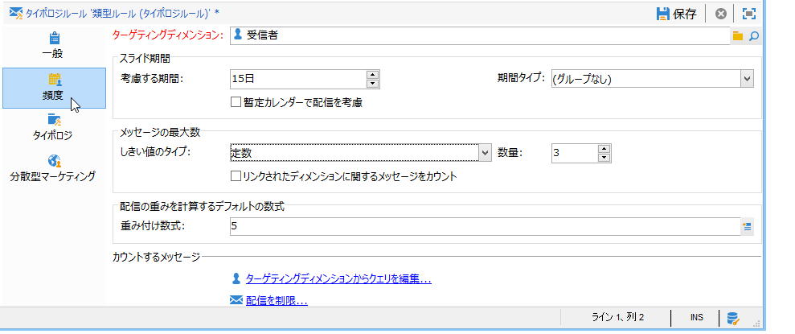

同じ重みが付けられた 6 つのニュースレターがそれぞれ 5 月 30 日、6 月 3 日、6 月 8 日、6 月 12 日、6 月 22 日および 6 月 30 日に予定されています。

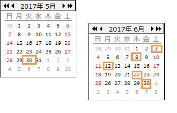

この場合、6 月の 12 日と 30 日に予約されている配信は送信されません。6 月 12 日の配信は 2 週間に 3 つのメッセージというしきい値を超過し、30 日の配信はその暦月内に許可されているしきい値を超過するので、送信されません。

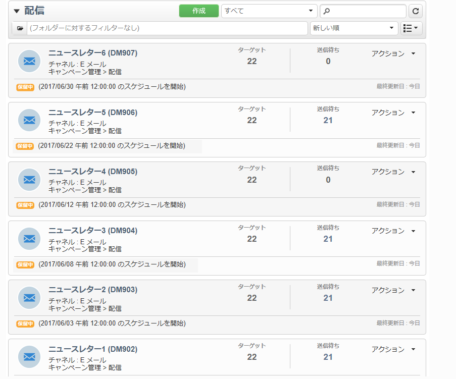

これらの配信の受信者はすべて、分析フェーズで実施される判別によって除外されます。

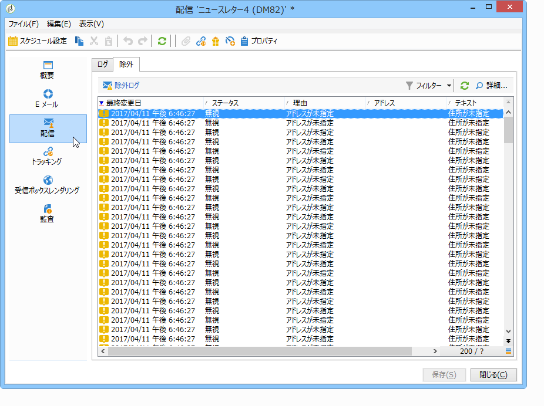

同一のルールで、グループ化を暦四半期ごとに変更すると、さらに **5 番目のニュースレター**&#x200B;も送信されなくなり、その受信者が除外されます。

グループ化を選択しない場合、送信されないのは **4 番目のニュースレター**&#x200B;のみになります。これは、このニュースレターが最初の 3 つのニュースレターと同じ 2 週間以内に予約されているからです。

>[!NOTE]
>
>タイポロジルールの定義を変更するときには、**シミュレーション**&#x200B;を作成することで、変更が配信に与える影響をコントロールし、他の配信にどのように影響するかを監視できます。For more on this, refer to [Campaign simulations](../../campaign/using/campaign-simulations.md).

## 判別後の除外 {#exclusion-after-arbitration}

Arbitration is re-applied every night via the **[!UICONTROL Forecasting]** technical workflow and the **[!UICONTROL Campaign jobs]** workflow.

The **[!UICONTROL Forecasting]** workflow pre-calculates the data for the period in progress (from its start date to the current date), which lets typology rules be applied during the analysis. また、判別の除外カウンターも毎晩再計算されます。

このように Adobe Campaign では、考慮する期間内の送信済みのメッセージの数を確認して、送信するメッセージ数がしきい値を超えないよう受信者ごとに制御します。この情報は&#x200B;**指標**&#x200B;であり、すべての計算は配信時に更新されます。

この数値がしきい値を超えると、キャンペーンタイポロジで定義された判別ルールが適用され、重みの小さなキャンペーンから受信者が除外されます。

>[!NOTE]
>
>複数の配信が同じスコアを持つ場合は、最も早い日付に予約されているキャンペーンが優先されます。

## 頻度ルールの使用例 {#use-cases-on-pressure-rules}

### 基準に基づくしきい値の適応 {#adapting-the-threshold-based-on-criterion}

顧客へのメッセージ配信を週に 4 回まで、見込み客への配信を週に 2 回までに制限するタイポロジルールを作成します。

To identify customers and prospects, use the **[!UICONTROL Status]** field, which contains 0 for prospects and 1 for customers.

ルールを作成するには、次の手順に従います。

1. **頻度**&#x200B;タイプのタイポロジルールを新規作成します。
1. Edit the **[!UICONTROL Pressure]** tab: in the **[!UICONTROL Maximum number of messages]** section, we want to create a formula to calculate the threshold depending on each recipient. フィールド **[!UICONTROL Depends on the recipient]** 内の値を選択 **[!UICONTROL Threshold type]** し、フィールドの **[!UICONTROL Edit expression]** 右側にあるをクリックし **[!UICONTROL Formula]** ます。

   Click the **[!UICONTROL Advanced parameters]** button to define the calculation formula.

   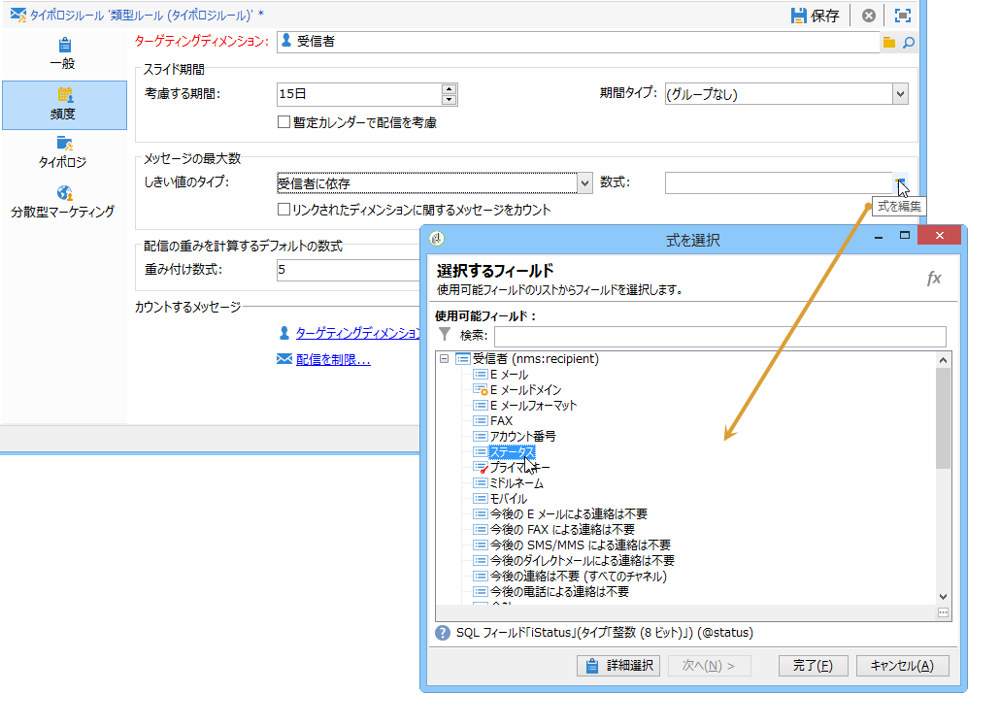

1. オプションを選 **[!UICONTROL Edit the formula using an expression]** 択し、をクリックしま **[!UICONTROL Next]**&#x200B;す。

   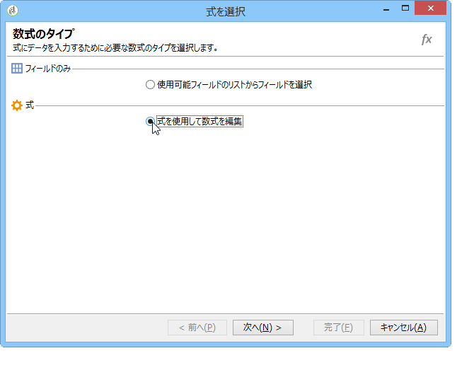

1. In the list of functions, double-click the **Iif** function in the **[!UICONTROL Others]** node.

   Then select the recipients&#39; **Status** in the **[!UICONTROL Available fields]** section.

   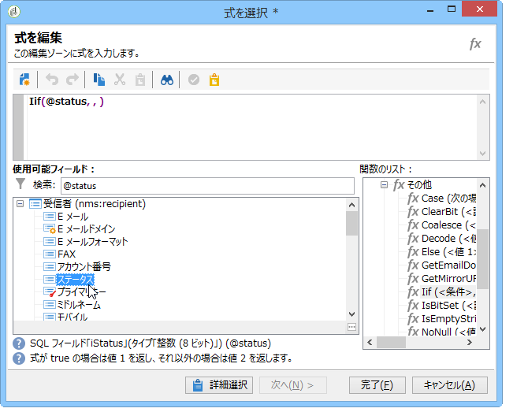

   次の式を入力します。 **Iif(@status=0,2,4)**

   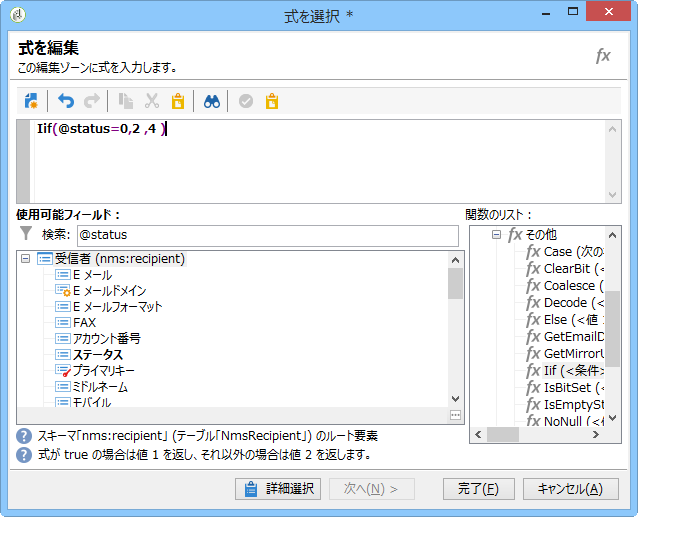

   この数式により、受信者のステータスが 0 の場合は 2、その他のステータスの場合は 4 が割り当てられます。

   Click **[!UICONTROL Finish]** to approve the formula.

1. ルールを適用する期間を指定します。この場合、7日間（1週間あたりのメッセージ数をカウント）。

   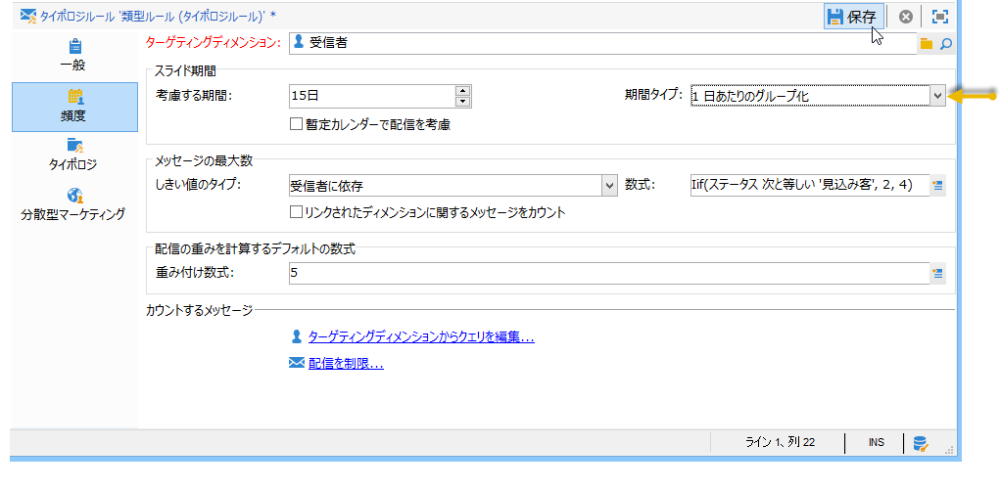

1. ルールを保存して、作成を実行します。

次に、作成したルールをタイポロジとリンクして、配信に適用します。手順は次のとおりです。

1. キャンペーンタイポロジを作成します。
1. Go to the **[!UICONTROL Rules]** tab, click the **[!UICONTROL Add]** button and select the rule you have just created.

   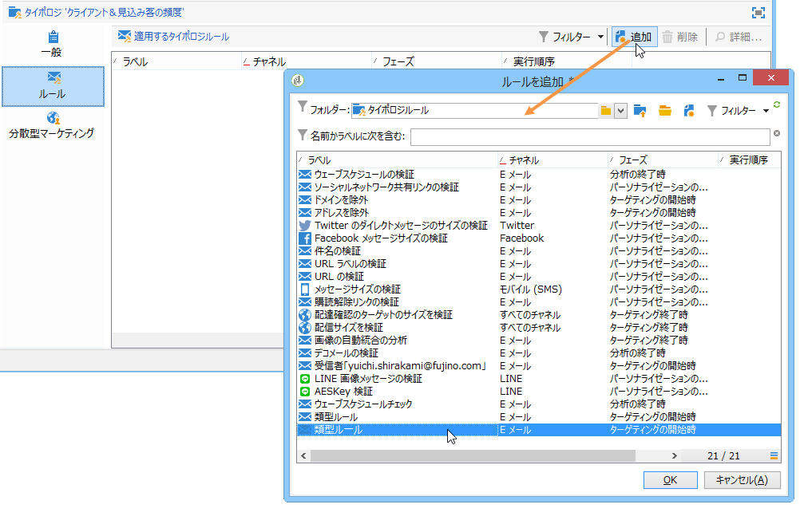

1. タイポロジを保存して、既存のタイポロジのリストに追加します。

To use this typology in your deliveries, select it in the delivery properties, in the **[!UICONTROL Typology]** tab as shown below:

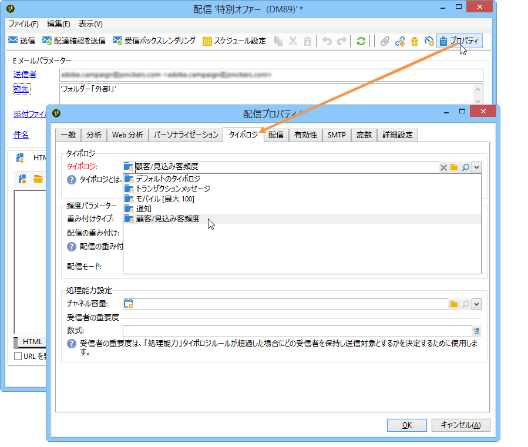

>[!NOTE]
>
>配信テンプレートでタイポロジを定義すると、このテンプレートを使用して作成されるすべての配信に自動的にこのタイポロジを適用できます。

配信の分析時には、既に受信者に送信されたメッセージの数に基づいて、しきい値を超過する受信者が配信から除外されます。この情報を参照するには、次のいずれかを実行します。

* 分析の結果を表示します。

   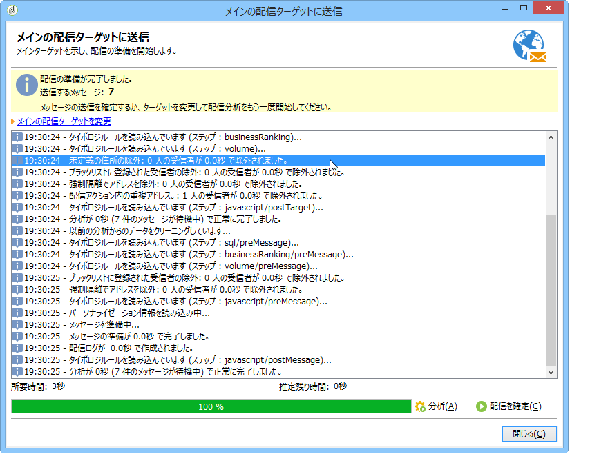

* Edit the delivery and click the **[!UICONTROL Delivery]** tab and the **[!UICONTROL Exclusions]** sub-tab:

   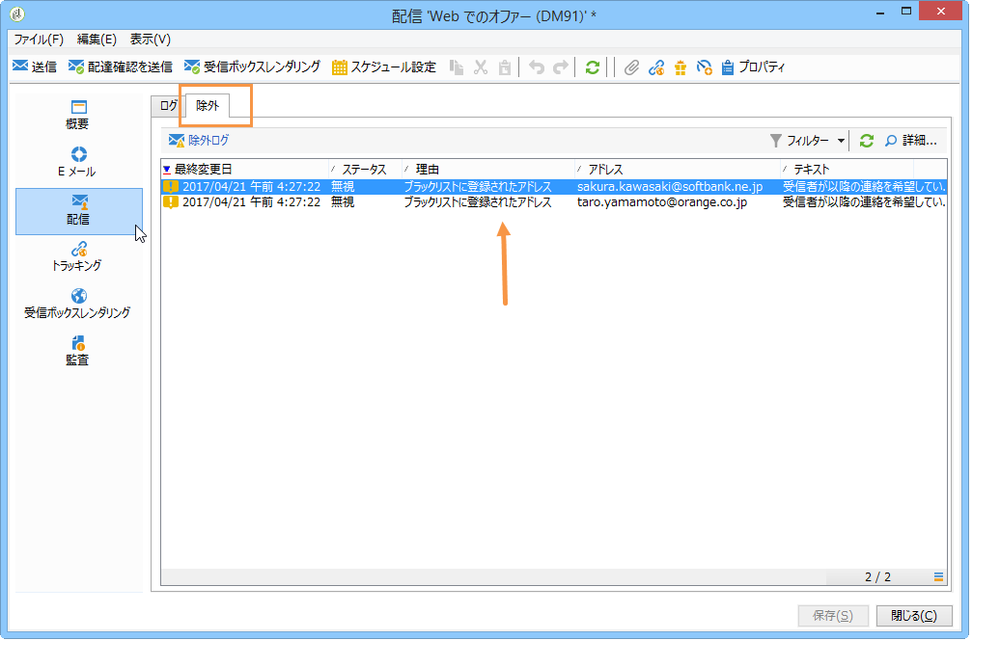

* Click the **[!UICONTROL Audit]** tab, then the **[!UICONTROL Causes of exclusions]** sub-tab to display the number of exclusions and the applied typology rules:

   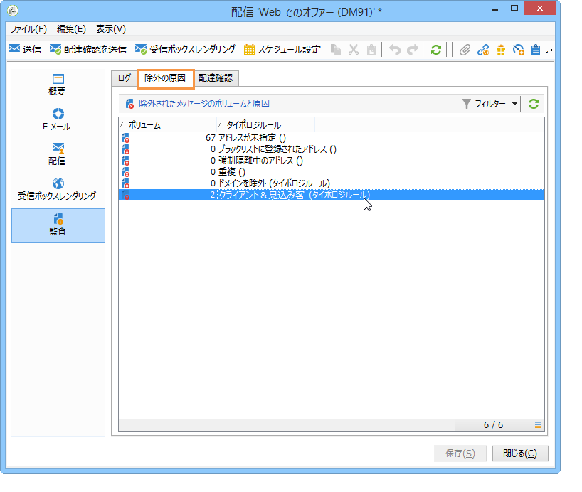

### 行動に基づく配信の重み付けの計算 {#calculating-the-delivery-weight-based-on-behavior}

頻度ルールは、受信者の行動に基づいて定義できます。したがって、受信者ごとに異なる条件に基づいて、配信に重みを付けることが可能です。例えば、インターネットサイトを訪問した、最新のニュースレターで特定のセクションをクリックした、情報サービスの購読を始めた、などの受信者の行動、または調査への回答やオンラインゲームなどに基づいて、メッセージを送信するかどうかを決定できます。

次の例では、配信に 5 の重みを付けます。この重みの値は、受信者の行動に基づく傾向スコアによって決まります。サイトからオーダーしたことのある顧客にはスコア 5、オンラインでオーダーしたことのない顧客にはスコア 4 を割り当てます。

このような設定をおこなうには、数式を使用してメッセージの重みを定義する必要があります。アフィニティスコアと調査の回答に関する情報には、データモデルでアクセスする必要があります。この例では、「**傾向**」フィールドが追加されています。

次の設定手順を実行します。

1. **頻度**&#x200B;タイプのタイポロジルールを新規作成します。
1. タブを編集 **[!UICONTROL Pressure]** します。 We want to create a threshold formula which will be based on each individual recipient: click the **[!UICONTROL Edit expression]** icon to the right of the **[!UICONTROL Weight formula]** field.

   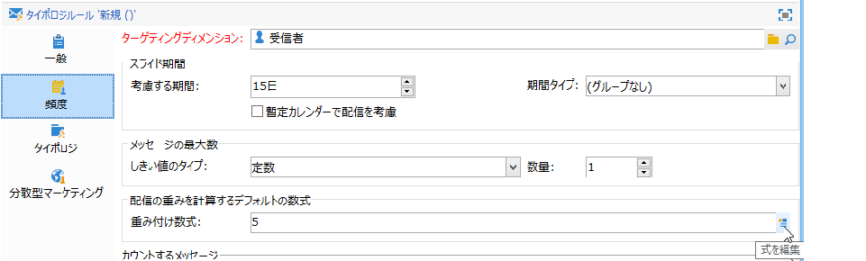

1. デフォルトでは、式エディターの上部のセクションには、「**5**」という値が表示されています。この重みの値に各受信者のアフィニティスコアを加算します。カーソルを「5」の右に置き、正符号（**+**）を入力して、「**傾向**」フィールドを選択します。

   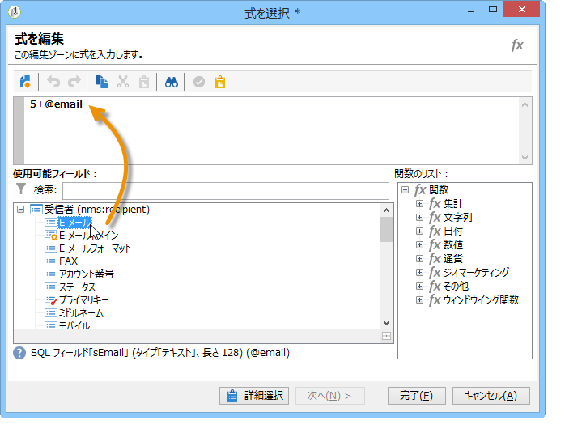

1. 購入経験のある受信者には、他の受信者より大きなスコアを割り当てます。今回は、購入経験のある受信者には、配信の重みにスコア 5 を加算し、その他の受信者には 4 を加算します。

   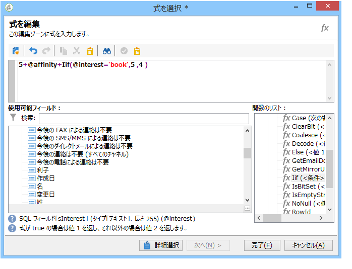

1. Click **[!UICONTROL Finish]** to save this rule.
1. ルールをキャンペーンタイポロジにリンクし、配信でこのタイポロジを参照して承認します。

### 最も大きな重みを付けられたメッセージのみの送信 {#sending-only-the-highest-weighted-messages}

各受信者に 2 件以下のメッセージを同一週内で送信する必要があり、1 日あたりのメッセージ数は 2 件を上限とし、より高い重みが付けられたメッセージのみが配信されるようにするとします。

それには、同じ受信者に対して異なる重みを持つ複数の配信をスケジュールし、重みの小さな配信を除外する頻度ルールを適用する必要があります。

最初に、頻度ルールを設定します。

1. 頻度ルールを作成します。For more on this, refer to [Creating a pressure rule](#creating-a-pressure-rule).
1. タブで、オ **[!UICONTROL General]** プションを選択 **[!UICONTROL Re-apply the rule at the start of personalization]** します。

   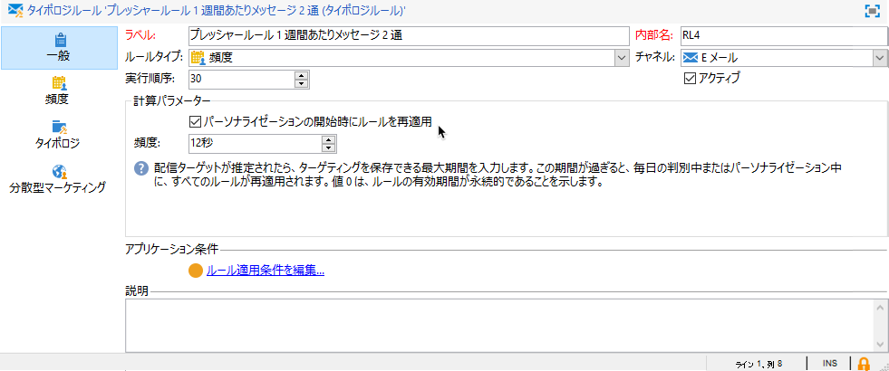

   This option overrules the value defined in the **[!UICONTROL Frequency]** field and automatically applies the rule during the personalization phase. 詳しくは、計算頻度の調整を参 [照してください](../../campaign/using/applying-rules.md#adjusting-calculation-frequency)。

1. タブで、 **[!UICONTROL Pressure]** をととし **[!UICONTROL 7d]** て選択 **[!UICONTROL Period considered]** します **[!UICONTROL Grouping per day]****[!UICONTROL Period type]**。
1. 配信スケジュール **[!UICONTROL Take the deliveries into account in the provisional calendar]** を含めるオプションを選択します。

   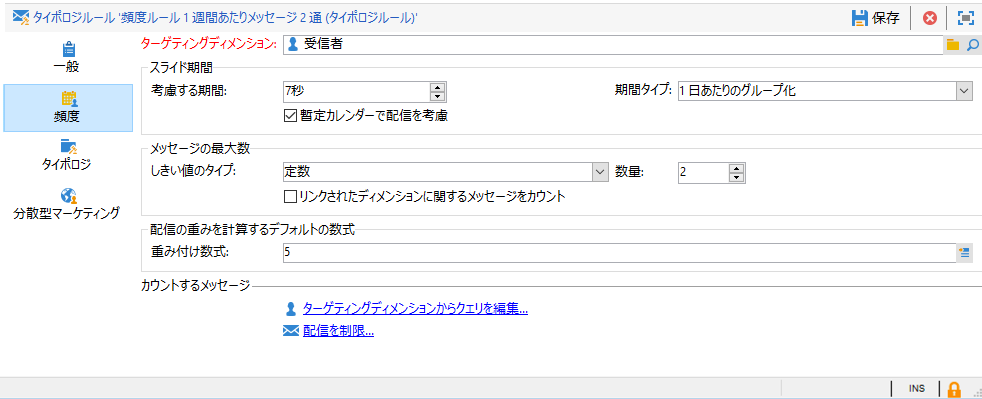

   配信日から過去 7 日の間に送信された配信および配信日から 7 日後までスケジュールされている配信が計算に含められます。For more on this, refer to [Setting the period](#setting-the-period).

1. In the **[!UICONTROL Typologies]** tab, link the rule to a campaign typology.
1. 変更を保存します。

次に、頻度ルールを適用するそれぞれの配信のワークフローを作成して設定します。

1. キャンペーンを作成します。詳しくは、[この節](../../campaign/using/setting-up-marketing-campaigns.md#creating-a-campaign)を参照してください。
1. In the **[!UICONTROL Targeting and workflows]** tab of your campaign, add a **Query** activity to your workflow. このアクティビティの使用について詳しくは、[この節](../../workflow/using/query.md)を参照してください。
1. Add an **[!UICONTROL Email delivery]** activity to the workflow and open it. このアクティビティの使用について詳しくは、[この節](../../workflow/using/delivery.md)を参照してください。
1. Go to the **[!UICONTROL Approvals]** tab of the **[!UICONTROL Delivery properties]** and disable all approvals.

   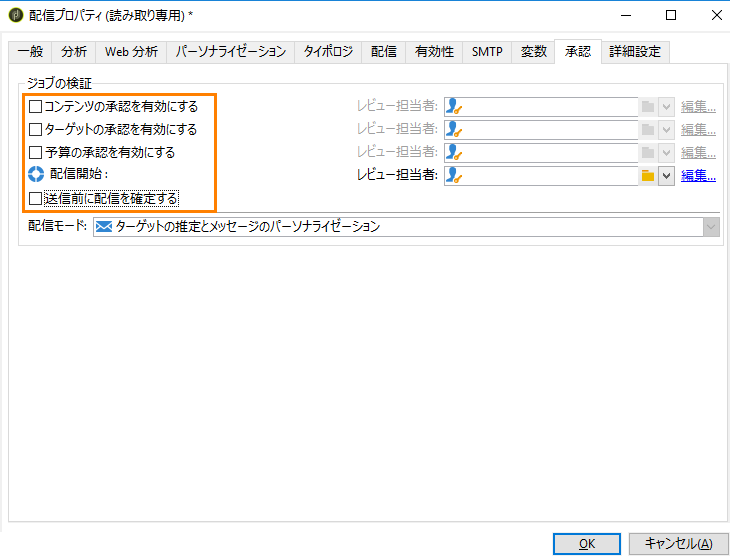

1. In the **[!UICONTROL Typology]** tab of the **[!UICONTROL Delivery properties]**, reference the campaign typology to apply the rule on. 配信の重み付けを定義します。

   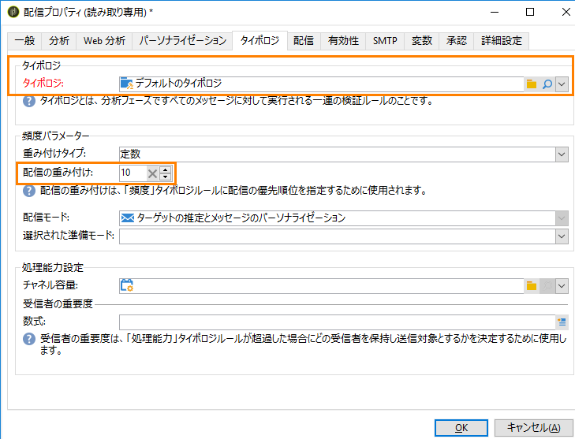

1. 配信で、をクリックして **[!UICONTROL Scheduling]** 選択しま **[!UICONTROL Schedule delivery (automatic execution when the scheduled date is reached)]**&#x200B;す。 この例では、オプションを選択 **[!UICONTROL Use a calculation formula]** します。
1. 抽出日を 10 分（現在の日付 + 10 分）に設定します。
1. コンタクト日を翌日（現在の日付 + 1 日）に設定します。

   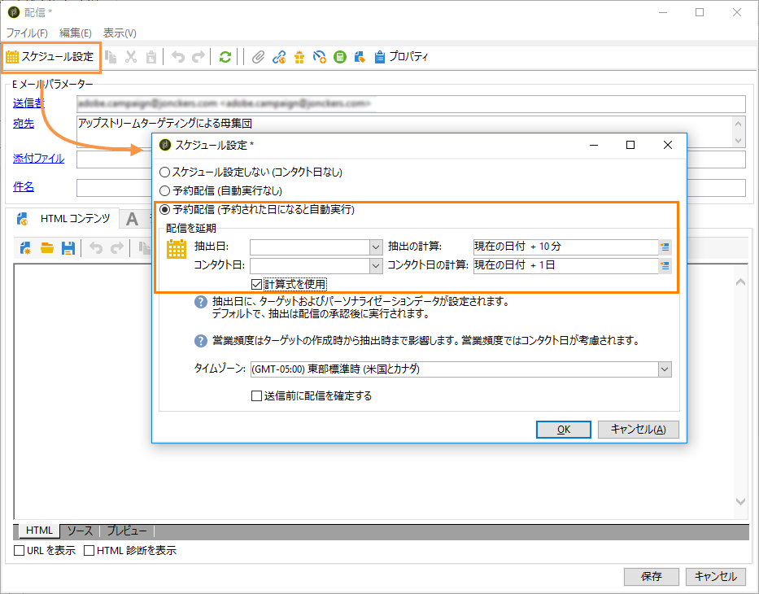

   頻度ルールの除外を適切に実装するには、コンタクト日時より前で、かつ夜間の判別が再適用される前の日時に抽出日時を設定します。詳しくは、「調停後の除外」を [参照してください](#exclusion-after-arbitration)。

1. このオプションを **[!UICONTROL Confirm the delivery before sending]** 選択解除し、変更を保存します。
1. 送信するそれぞれの配信について、同様の手順を実行します。それぞれの配信に必要な重み付けを設定してください。
1. 関連するワークフローを実行して、配信を準備して送信します。

夜間の判別が適用されると、同じ受信者に対する重みが小さい配信が除外されます。最も大きな重みを付けられた配信のみが、送信の対象とみなされます。For more on this, refer to [Message weight](#message-weight).

次の表に、週の前半に対象となる受信者に E メールが既に送信されたと仮定した場合にもう 2 つの配信に適用できる設定の例を示します。

<table> 
 <thead> 
  <tr> 
   <th> 配信  </th> 
   <th> 承認  </th> 
   <th> 重み付け  </th> 
   <th> 抽出日時  </th> 
   <th> コンタクト日  </th> 
   <th> 配信の開始日時  </th> 
   <th> 判別ワークフローの実行日時  </th> 
   <th> 配信ステータス  </th> 
   <th> 送信された配信（日時）  </th> 
  </tr> 
 </thead> 
 <tbody> 
  <tr> 
   <td> 配信 1  </td> 
   <td> 無効  </td> 
   <td> 5  </td> 
   <td> 午後 3 時  </td> 
   <td> 午前 8 時（翌日）  </td> 
   <td> 午後 2 時  </td> 
   <td> 夜間  </td> 
   <td> 除外済み  </td> 
   <td> 除外済み  </td> 
  </tr> 
  <tr> 
   <td> Delivery 2  </td> 
   <td> 無効  </td> 
   <td> 10  </td> 
   <td> 午後 4 時  </td> 
   <td> 午前 9 時（翌日）  </td> 
   <td> 午後 2 時  </td> 
   <td> 夜間  </td> 
   <td> 送信済み  </td> 
   <td> 午前 9 時（翌日）  </td> 
  </tr> 
 </tbody> 
</table>

2 件の配信の抽出日を過ぎた後、両方の配信のコンタクト日の前に夜間の判別が再度適用されます。これにより、既に送信された配信（配信が処理され、配信ログを通じて記録された受信者）または送信がスケジュールされた配信（配信を受信する資格があり、予測ログを通じて記録された受信者）をすべて見つけることができます。

頻度ルールに定義された期間のすべての送信済みの配信と送信される可能性のある配信が見つかると、これらの配信は、重み付け順（最も大きな重みが付けられた配信が先頭）で並べ替えられます。頻度ルールに設定されたしきい値に達すると（ここでは同じ週内に 2 件を超える E メールは送信されません）、受信者は配信から除外されます。
