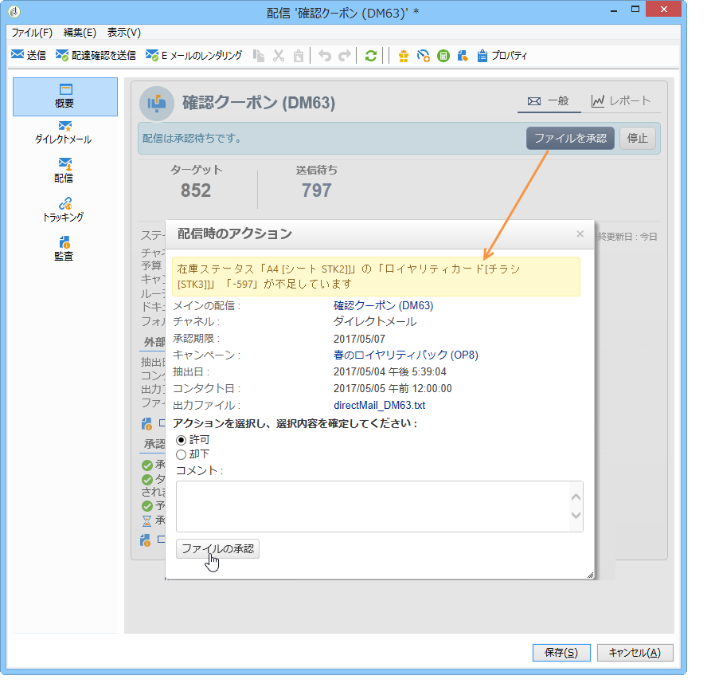

# プロバイダー、在庫、予算{#providers-stocks-and-budgets}

Adobe Campaign では、キャンペーン内で実行されるジョブに関与するサービスプロバイダーを定義できます。サービスプロバイダーに関する情報と、関連付けられたコスト構造は、Adobe Campaign 管理者がメインビューから定義します。サービスプロバイダーを配信から参照し、そのコスト構造を使用して、この配信に関連付けられたコストを計算したり、関連する在庫を管理したりできます。

## サービスプロバイダーとそのコスト構造の作成 {#creating-service-providers-and-their-cost-structures}

各サービスプロバイダーは、連絡先詳細、サービステンプレート、関連ジョブと共にファイルに保存されます。

Service providers are configured in the **[!UICONTROL Administration > Campaign management]** node of the tree.

配信時に実行されるジョブ（特にダイレクトメールとモバイルチャネルに関するジョブ）は、サービスプロバイダーが実行します。例えば、このサービスプロバイダーは、メッセージの印刷または配分を実行できます。このようなジョブには、サービスプロバイダーごとに固有の設定とコストが含まれます。サービスプロバイダーの設定には、以下の 4 つのステージがあります。

1. Adobe Campaign でのサービスプロバイダーの作成

   See [Adding a service provider](#adding-a-service-provider).

1. 関連付けられたサービスプロバイダーのコストカテゴリと構造の定義

   「原価カ [テゴリの定義](#defining-cost-categories) 」および「 [原価構造の定義」を参照してください](#defining-the-cost-structure)。

1. プロセスの設定

   See [Configuring processes associated with a service](#configuring-processes-associated-with-a-service).

1. キャンペーンレベルでのサービスプロバイダーの参照

   See [Associating a service with a campaign](#associating-a-service-with-a-campaign).

### サービスプロバイダーとそのコストカテゴリの作成 {#creating-a-service-provider-and-its-cost-categories}

#### サービスプロバイダーの追加 {#adding-a-service-provider}

配信に必要な数のサービスプロバイダーを作成できます。サービスプロバイダーの追加手順は次のとおりです。

1. Right-click the list of service providers and select **[!UICONTROL New]**, or click the **[!UICONTROL New]** button above the list of service providers.
1. ウィンドウの下部で、サービスプロバイダーの名前と連絡先詳細を指定します。

   

1. Click the **[!UICONTROL Save]** button to add the service provider to the list.

#### コストカテゴリの定義 {#defining-cost-categories}

サービステンプレートは各サービスプロバイダーに関連付ける必要があります。サービステンプレートで、まずコストカテゴリを定義し、必要に応じて、関連する在庫を定義する必要があります。その後、コスト構造から、カテゴリごとにコスト計算ルールを作成する必要があります。

>[!NOTE]
>
>詳細は、「コスト構造の定 [義」を参照してください](#defining-the-cost-structure)。

コストカテゴリは、ある種類の配信（E メール、ダイレクトメールなど）またはタスクに関連する一連のコストを含むエンティティです。コストカテゴリは、サービスプロバイダーに関連付けられているサービスのテンプレートにまとめられます。各サービスプロバイダーは、1 つ以上のサービステンプレートを参照できます。

サービステンプレートを作成してそのコンテンツを定義するには、以下の手順を実行します。

1. In the **[!UICONTROL Services]** tab of the service provider, click the **[!UICONTROL Add]** button and name the service template.

   

1. プロセスのタイプごとに（ダイレクトメール／E メールなどによる配信またはタスク）コストカテゴリを作成します。To do this, click the **[!UICONTROL Cost categories]** tab and then the **[!UICONTROL Add]** button, and enter the parameters of each cost category.

   

   * Enter a label for this cost category and select the type of process concerned: Delivery by **[!UICONTROL Direct mail]**, **[!UICONTROL E-mail]**, **[!UICONTROL Mobile]**, **[!UICONTROL Telephone]**, **[!UICONTROL Fax]** or **[!UICONTROL Task]**.
   * Click the **[!UICONTROL Add]** button to define the types of cost associated with this category.
   * 必要に応じて、在庫品目を各コストタイプと関連付け、使用する数量が既存の在庫に自動的に関連付けられるようにします。

      >[!NOTE]
      >
      >The stock lines are defined in the **[!UICONTROL Stock management]** node.\
      >詳しくは、「在庫管理と注文管 [理」を参照してください](#stock-and-order-management)。

1. このコストカテゴリの値を事前選択して、サービスプロバイダーのコストカテゴリにデフォルトで（空白の代わりに）表示できます。To do this, select the option in the **[!UICONTROL Selected]** column for the type of category concerned:

   

   配信レベルで、この値がデフォルトで選択されるようになります。

   

### コスト構造の定義 {#defining-the-cost-structure}

コストタイプごとに、適用する計算ルールをコスト構造で指定します。

Click the **[!UICONTROL Cost structure]** tab to configure the cost calculation for each cost category and type. Click **[!UICONTROL Add]** and input the cost structure.

* コスト構造を作成するには、メッセージのタイプと関連するコストカテゴリ、計算ルールを適用するコストのタイプをドロップダウンリストから選択します。The content of these drop-down lists comes from the information entered via the **[!UICONTROL Cost categories]** tab.

   コスト構造にラベルを割り当てる必要があります。デフォルトでは、次の配信概要が表示されます。コス **トカテゴリ — コストのタイプ**。

   You can, however, rename it: enter the desired value directly in the **[!UICONTROL Label]** field.

* コスト計算の数式をウィンドウの下部で定義します。

   この数式は、（メッセージ数に関わらず）固定することも、メッセージ数に応じて計算することもできます。

   メッセージの数に依存する場合、コスト計算構造は、、、またはのいず **[!UICONTROL Linear]**&#x200B;れかに **[!UICONTROL Linear by threshold]**&#x200B;なりま **[!UICONTROL Constant by threshold]**&#x200B;す。

#### 線形構造 {#linear-structure}

If the amount is always the same for a message (or a batch of messages) irrespective of the total number of messages, select **[!UICONTROL Linear]** and enter the cost of each message.

If this amount applies to a batch of messages, specify the number of messages concerned in the **[!UICONTROL for]** field.

#### しきい値別の線形構造 {#linear-structure-by-threshold}

If the amount applies by threshold for each message, you must define a **[!UICONTROL Linear by threshold]** calculation structure. このタイプのコスト構造では、例えばメッセージの合計数が 1～100 の場合は各メッセージのコストが 0.13 になり、100～1000 メッセージが送信される場合は 0.12 になり、1000 メッセージを超えると 0.11 になります。

設定は以下のようになります。

To add a threshold, click the **[!UICONTROL Add]** button to the right of the list.

#### しきい値別の定数構造 {#constant-structure-by-threshold}

最後に、メッセージの合計数に応じてコスト計算を設定できます。これを行うには、計算構造を選 **[!UICONTROL Constant by threshold]** 択します。 例えば、1～100 メッセージに対してはコストが 12.00 の固定金額に設定され、101～1000 メッセージの配信には 100.00 に設定され、1000 メッセージを超えるあらゆる配信に対しては、合計数に関わらず、500.00 に設定されます。

### サービスに関連付けられたジョブの設定 {#configuring-processes-associated-with-a-service}

You can associate information on the processes associated with the service via the **[!UICONTROL Processes]** tab.

To do this, click the **[!UICONTROL Processes]** tab to configure the sending of information to the router.

* The **[!UICONTROL File extraction]** section indicates the export template used for delivery when this service is selected. You can indicate the name of the output file in the **[!UICONTROL Extraction file]** field. フィールドの右側のボタンを使用して、変数を挿入できます。

   

* The **[!UICONTROL Notification e-mail]** section lets you specify the template to notify service providers after files have been sent. アラートメッセージと受信者のグループの作成に使用するテンプレートを選択してください。

   By default, delivery templates for notification messages are saved in the **[!UICONTROL Administration > Campaign management > Technical delivery templates]** node, which is accessible from the general view.

* The **[!UICONTROL Post-processing]** section lets you select the workflow to launch after the delivery has been approved. ワークフローテンプレートを入力した場合、ワークフローインスタンスが自動的に作成され、承認が有効になるとすぐに実行されます。例えば、このワークフローで、処理のために抽出ファイルを外部サービスプロバイダーに送信できます。

### サービスとキャンペーンの関連付け {#associating-a-service-with-a-campaign}

サービスは、配信またはタスクを介してキャンペーンに関連付けられます。サービスプロバイダーは配信テンプレートにリンクされて、このテンプレートから作成される配信でサービスを提供します。

サービスを選択すると、配信の種類（ダイレクトメール、E メールなど）に対応するコストカテゴリが、定義済みの処理オプションと共に、中央のテーブルに自動的に表示されます。

>[!NOTE]
>
>サービスを選択してもコストカテゴリが表示されない場合は、このタイプの処理に対してコストカテゴリが定義されていなかったことを意味します。For example, for an email delivery, if no **[!UICONTROL E-mail]** type cost category has been defined, no category will be displayed, and selecting the service will have no effect.

* ダイレクトメール配信では、設定ウィンドウからサービスを選択できます。

   

* モバイルチャネルでの配信、FAX または電話では、同じ選択モードが適用されます。
* For an email delivery, the service is selected from the **[!UICONTROL Advanced]** tab in the delivery properties, as in the following example:

   

The **[!UICONTROL Amount to surcharge]** column lets you add a cost for this category in the context of the delivery or task concerned.

配信のコストカテゴリの定義時に、コストタイプの選択を必須にすることができます。これを行うには、を選択しま **[!UICONTROL A cost type must be selected]**&#x200B;す。

## 在庫およびオーダー管理 {#stock-and-order-management}

アラートを処理し、補給品をトラッキングし、オーダーを開始するために、コストタイプを在庫品目に関連付けることができます。

在庫およびオーダー管理を Adobe Campaign で設定し、実行する配信の補給品が不十分な場合にオペレーターに警告する手順は次のとおりです。

1. 在庫の作成と関連サービスプロバイダーを参照します。

   詳しくは、 [素材の作成を参照してください](#creating-a-stock)。

1. 在庫品目の追加

   詳しくは、 [ストックラインの追加を参照してくださ](#adding-stock-lines)い。

1. アラート発生時にオペレーターに通知します。

   「アラート [演算子」を参照](#alerting-operators)。

1. オーダーして補給します。

   注文を参照 。

### 在庫管理 {#stock-management}

Adobe Campaign では、在庫が不足した場合または最小しきい値に達した場合にオペレーターのグループに警告できます。Stock levels are accessible via the **[!UICONTROL Stocks]** link of the **[!UICONTROL Campaigns]** universe via the **[!UICONTROL Other choices]** link of the navigation area.

#### 在庫の作成 {#creating-a-stock}

新しい在庫を作成するには、次の手順に従います。

1. Click the **[!UICONTROL Create]** button above the list of stocks.
1. 在庫のラベルを入力し、関連付けるサービスプロバイダーをドロップダウンリストから選択します。

   

   >[!NOTE]
   >
   >詳しくは、「サービスプロバイダーとそ [のコスト構造の作成」を参照してください](#creating-service-providers-and-their-cost-structures)。

#### 在庫品目の追加 {#adding-stock-lines}

在庫は、様々な在庫品目で構成されます。在庫品目には、配信によって消費されるリソースの初期数量が含まれます。在庫品目ごとに、消費された数量、在庫数量、オーダーされた数量が表示されます。

When you create a stock, click the **[!UICONTROL Stock lines]** tab to add new lines.

在庫を作成したら、クリックして編集し、ダッシュボードを使用して在庫品目を作成および表示します。

Click the **[!UICONTROL Create]** button to define the stock parameters.

* Indicate the quantity initially in stock in the **[!UICONTROL Initial stock]** field. The **[!UICONTROL Consumed]** and **[!UICONTROL In stock]** fields are calculated automatically and updated as campaigns progress.

   

* Indicate the threshold from which operators should be alerted to order stock in the **[!UICONTROL Alert level]** field. アラートレベルに達した場合、この在庫を使用する配信の承認ウィンドウに警告メッセージが表示されます。

#### 在庫とコストカテゴリの関連付け {#associating-a-stock-with-cost-categories}

次のように、指定したサービスプロバイダーの在庫品目を、いずれかのコストカテゴリに紐付けることができます。

### 在庫トラッキング {#stock-tracking}

#### オペレーターへの警告 {#alerting-operators}

配信で参照されている在庫が不十分になると、アラートが表示されます。例えば、抽出ファイルが承認されると、次のアラートが表示されます。

#### オーダー {#orders}

The **[!UICONTROL Orders]** sub-tab lets you view current orders and save new orders.

To save an order, edit the targeted stock line, click the **[!UICONTROL Add]** button and specify the delivery date and the quantity ordered.

>[!NOTE]
>
>Once the delivery date is reached, the ordered stock line disappears automatically and the quantity entered in the **[!UICONTROL Volume on order]** field is added to the **[!UICONTROL Tracking]** tab. この数量が在庫数量に自動的に追加されます。

The **[!UICONTROL Consumptions]** tab contains the volume consumed per campaign. このタブの情報は、実行された配信に応じて自動的に入力されます。Click the **[!UICONTROL Edit]** button to open the campaign concerned.

## 予算の計算 {#calculating-budgets}

### 原則 {#principle}

配信およびキャンペーンに関するコストを管理します。進行状況に応じて、このコストが予算に割り当てられます。

キャンペーンの配信コストはキャンペーンレベルで統合され、プログラムを構成するすべてのキャンペーンのコストが、関連付けられているプログラムに渡されます。専用レポートで、プラットフォーム全体またはプランごとおよびプログラムごとの予算をトラッキングできます。

### 実装 {#implementation}

キャンペーンで、予算を選択する際は、初期金額を入力する必要があります。計算されたコストは、入力された金額（発生した費用、想定される費用、予約済みの費用、割り当てられた費用）のコミットメントレベルに応じて、自動的に更新されます。金額の計 [算を参照してください](../../campaign/using/controlling-costs.md#calculating-amounts)。

>[!NOTE]
>
>予算の作成手順は、「予算の作成」で [説明します](../../campaign/using/controlling-costs.md#creating-a-budget)。

