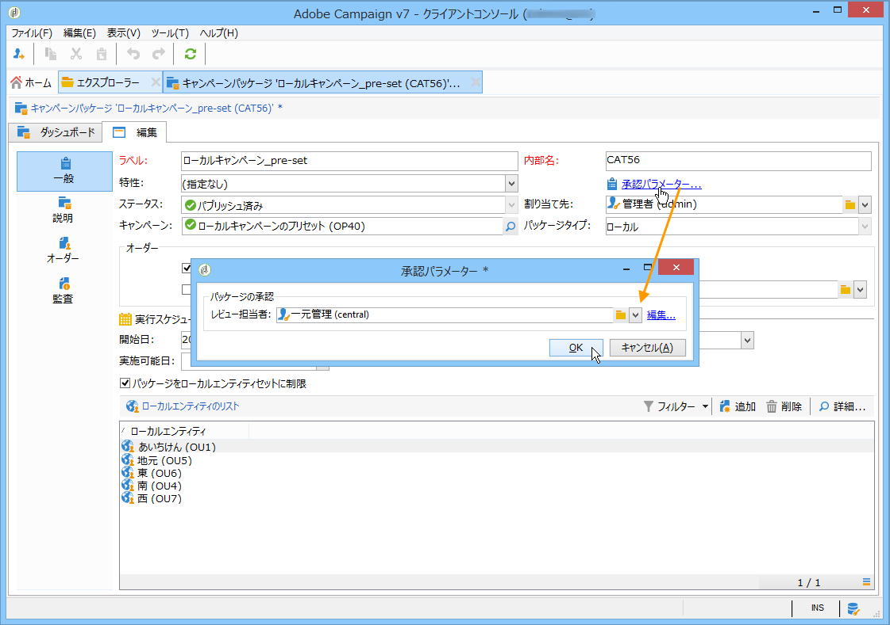
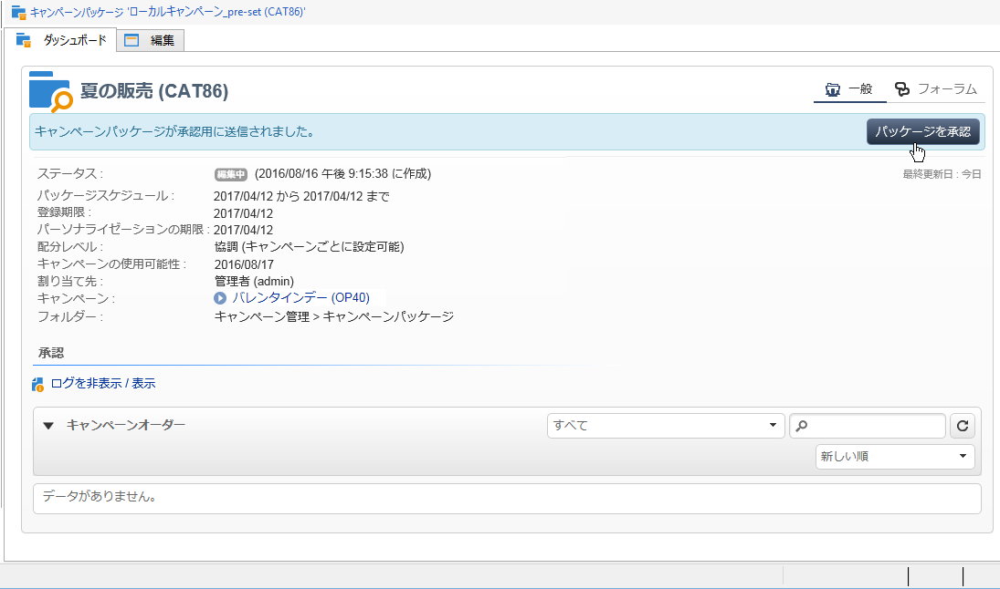
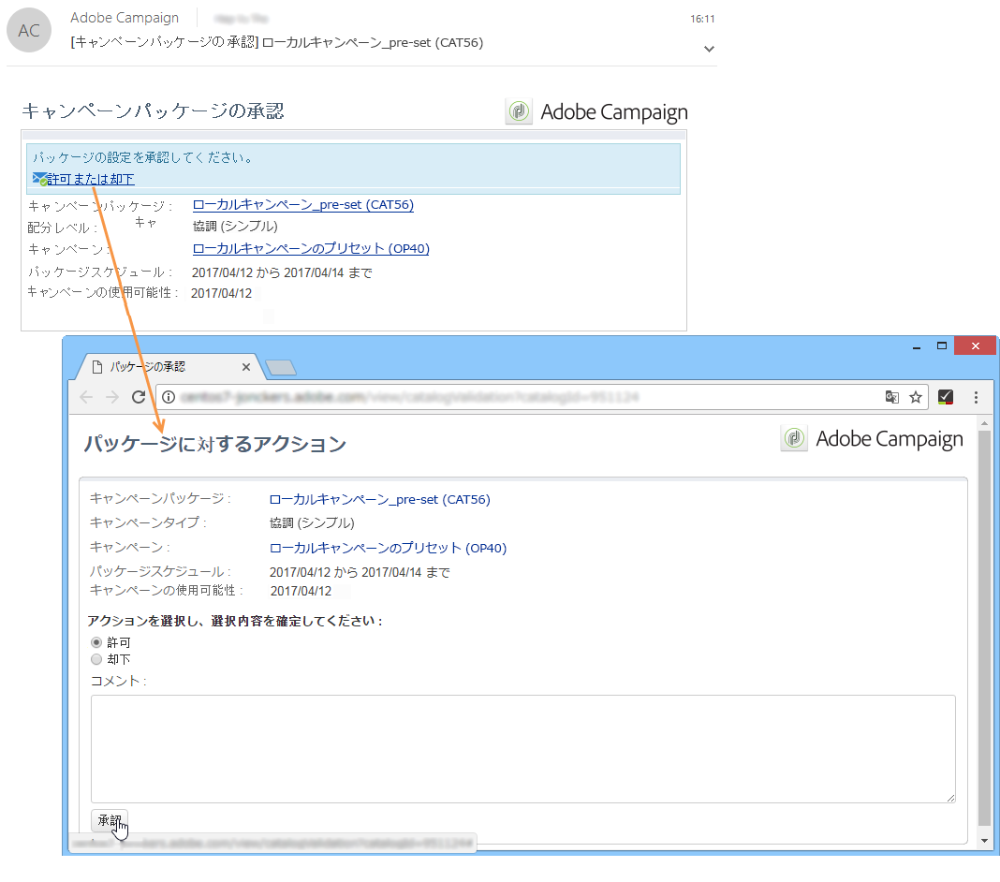
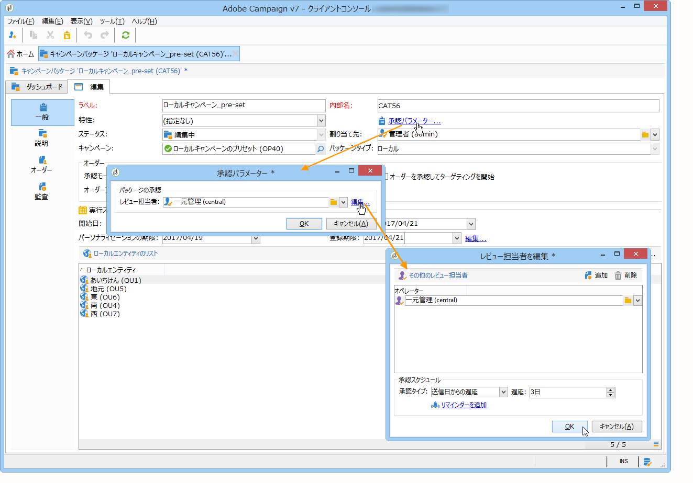
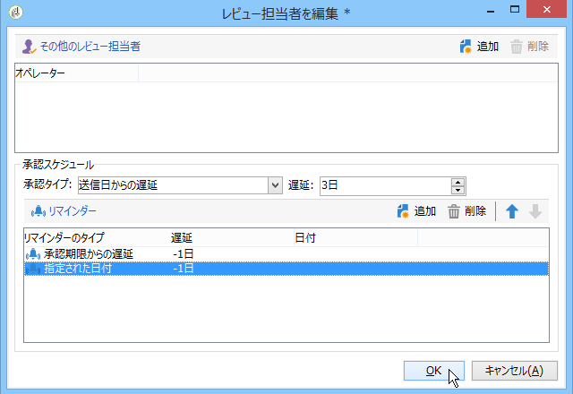
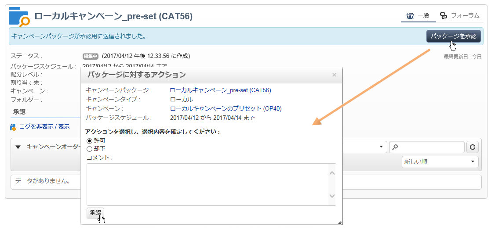

# パッケージのパブリッシュ{#publishing-the-campaign-package}

Central entity operators publish campaigns they wish to offer to local entities in the **[!UICONTROL list of campaign packages]**.

キャンペーンパッケージのリストにパブリッシュできるのは、セントラルエンティティによって承認されたキャンペーンパッケージのみです。To do this, you can specify a reviewer or group of reviewers via the **[!UICONTROL Approval parameters]** link in the campaign package.

## レビュー担当者の割り当て {#assigning-a-reviewer}

To select the reviewer, click the **[!UICONTROL Approval parameters]** link from the campaign package and choose the relevant reviewer from the drop-down list.

You may then begin the approval process by clicking **[!UICONTROL Submit for approval]**.

メッセージがレビュー担当者に送信され、キャンペーンパッケージが使用可能になったことが通知されます。このメッセージには、Web アクセスによって承認を許可または却下するリンクが含まれています。

>[!NOTE]
>
>組織エンティティのレベルで、オーダーを承認するレビュー担当者を指定することもできます。For more on this, refer to [Organizational entities](../../campaign/using/about-distributed-marketing.md#organizational-entities).

## 他のレビュー担当者の追加 {#adding-other-reviewers}

You can add other reviewers from the **[!UICONTROL Edit...]** link, found in the campaign package&#39;s **[!UICONTROL Approval parameters...]** tab.

## 承認の期間 {#approval-periods}

デフォルトでは、レビュー担当者には登録日から 3 日間、承認を処理するための期間が与えられます。

レビュー担当者を編集ウィンドウでリマインダーを設定すると、キャンペーンパッケージの承認が実行されていない場合に 1 つ以上のメッセージを送信することができます。これを行うには、リンクをクリッ **[!UICONTROL Add reminder]** クしてからボタンをクリック **[!UICONTROL Add]** します。

リマインダーは、指定する日に送信するか、登録日の **x** 日後に送信することができます。リマインダーのタイプは、リマインダーのテーブルの最初の列で設定できます。In the example below, the reviewers will receive a reminder message on the on the 29/01/2014, i.e. two days before the date selected in the **[!UICONTROL Date]** column, and a second reminder one day before the end of the approval period, i.e. two days after the submission for approval date.

Once it is defined and the package has been submitted for approval, the execution schedule is displayed in the **[!UICONTROL Audit]** tab. スケジュールには、現在の設定に基づいて算出された処理期限と設定されたすべてのリマインダーの日付が含まれます。

## Adobe Campaign コンソールを使用する承認 {#approving-via-the-adobe-campaign-console}

If no reviewer has been specified or if none of the notified operators have approved the package, the **[!UICONTROL Approve the package]** button lets you proceed directly to the approval from the campaign package **[!UICONTROL Dashboard]** or from the packages overview.

承認が完了すると、キャンペーンはパブリッシュされ、リストに追加されます。使用可能な日付になると、ローカルエンティティはキャンペーンを使用できます。キャンペーンの作成時にローカルエンティティが指定されている場合は、通知グループのオペレーターにメッセージが送信され、キャンペーンが使用可能であることが通知されます。事前に指定されているエンティティが存在しない場合は、デフォルトで、すべてのローカルエンティティにキャンペーンが提供されます。For more on this, refer to [Organizational entities](../../campaign/using/about-distributed-marketing.md#organizational-entities).
