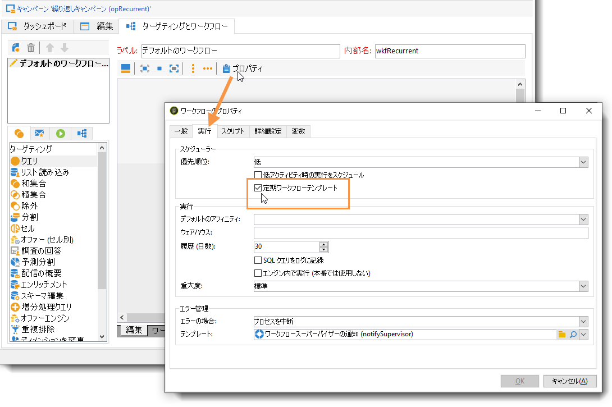

# キャンペーンの設定{#setting-up-marketing-campaigns}

キャンペーンには、アクション（配信）とプロセス（ファイルのインポートまたは抽出）だけでなく、マーケティングドキュメントや配信の概要といったリソースも含まれます。これらはマーケティングキャンペーンで使用されます。キャンペーンはプログラムの一部で、プログラムはキャンペーンプランに含まれます。

マーケティングキャンペーンを作成するには：

1. キャンペーンの作成：キャンペーンとその特徴を発見します。ラベル、タイプ、開始日と終了日、予算、関連するリソース、マネージャーおよび参加者

   詳しくは、 [キャンペーンの作成を参照してください](#creating-a-campaign)。

1. ターゲット母集団の定義：ターゲットクエリを使用してワークフローを作成します。

   See [Selecting the target population](../../campaign/using/marketing-campaign-deliveries.md#selecting-the-target-population).

1. 配信の作成：チャネルを選択し、送信するコンテンツを定義します。

   「配信の [作成」を参照](../../campaign/using/marketing-campaign-deliveries.md#creating-deliveries)。

1. 配信を承認します。

   「承認プロセス [」を参照](../../campaign/using/marketing-campaign-approval.md#approval-process)。

1. 配信を監視します。

   「監視」を参照し [てください](../../campaign/using/marketing-campaign-monitoring.md)。

1. キャンペーンと関連コストを計画します。

   See [Creating service providers and their cost structures](../../campaign/using/providers--stocks-and-budgets.md#creating-service-providers-and-their-cost-structures).

When these steps have been completed, you can start the deliveries (see [Starting a delivery](../../campaign/using/marketing-campaign-deliveries.md#starting-a-delivery)), check the data, processes and information relating to the deliveries and, if necessary, manage the associated documents (see [Managing associated documents](../../campaign/using/marketing-campaign-deliveries.md#managing-associated-documents)). You can also track the execution of the processing phases of campaigns and deliveries (see [Tracking](../../campaign/using/marketing-campaign-monitoring.md).

## プランとプログラム階層構造の作成 {#creating-plan-and-program-hierarchy}

マーケティング・プランおよびプログラム用にフォルダ階層を構成する手順は、次のとおりです。

1. ホームページ上の「**エクスプローラー**」アイコンをクリックします。
1. プランの作成場所とするフォルダーを右クリックします。
1. **新規フォルダーを追加／キャンペーン管理／プラン**&#x200B;を選択します。

   

1. プランの名前を変更します。
1. 作成したプランを右クリックし、「**プロパティ**」を選択します。

   

1. 「**一般**」タブで、パッケージエクスポート時の重複を避けるために「**内部名**」を変更します。
1. 「**保存**」をクリックします。
1. 作成したプランを右クリックし、「**新しい「プログラム」フォルダーを作成**」を選択します。
1. 以上の手順を繰り返して、新しいプログラムフォルダーの名前および内部名を変更します。

## キャンペーンの作成 {#creating-a-campaign}

### キャンペーンの追加 {#adding-a-campaign}

キャンペーンのリストからキャンペーンを作成できます。To display this view, select the **[!UICONTROL Campaigns]** menu in the **[!UICONTROL Campaigns]** dashboard.

The **[!UICONTROL Program]** field lets you select the program to which the campaign will be attached. この情報は必須です。

キャンペーンは、プログラムからも作成できます。To do this, click the **[!UICONTROL Add]** button in the **[!UICONTROL Schedule]** tab of the concerned program.

When you create a campaign via the **[!UICONTROL Schedule]** tab of a program, the campaign is automatically linked to the concerned program. The **[!UICONTROL Program]** field is hidden in this case.

キャンペーン作成ウィンドウで、キャンペーンテンプレートを選択し、キャンペーンの名前と説明を追加します。 キャンペーンの開始日と終了日も指定できます。

「**[!UICONTROL OK]**」をクリックして、キャンペーンを作成します。作成されたキャンペーンが、プログラムスケジュールに追加されます。

>[!NOTE]
>
>To filter the campaigns to display, click the **[!UICONTROL Filter]** link and select the status of campaigns to display.

### キャンペーンの編集と設定 {#editing-and-configuring-a-campaign}

作成したキャンペーンを編集し、パラメーターを定義できます。

To open and configure a campaign, select it from the schedule and click **[!UICONTROL Open]**.

すると、キャンペーンダッシュボードが表示されます。

## 繰り返しキャンペーンと定期的キャンペーン {#recurring-and-periodic-campaigns}

繰り返しキャンペーンは、特定のテンプレートをベースとするキャンペーンで、関連付けられたスケジュールに従って実行するようにワークフローが設定されています。そのため、1 つのキャンペーン内でワークフローが繰り返されます。ターゲティングは実行ごとに複製され、各種プロセスとターゲット母集団がトラッキングされます。ターゲットの推定を使用したシミュレーションを開始するために、自動ワークフロー作成時の対象期間によって、将来のターゲティングをあらかじめ実行することもできます。

定期的なキャンペーンは、キャンペーンテンプレートの実行スケジュールに従って自動的に作成されるキャンペーンです。

### 繰り返しキャンペーンの作成 {#creating-a-recurring-campaign}

繰り返しキャンペーンは、実行するワークフローテンプレートと実行スケジュールを定義する特定のテンプレートから作成します。

#### 定期キャンペーン用のテンプレートの作成 {#creating-the-campaign-template}

1. Create a **[!UICONTROL Recurring]** campaign template.

   >[!NOTE]
   >
   >空のテンプレートを作成する代わりに、デフォルトのテンプレートを複製することを推奨します。

   

1. テンプレートの名前とキャンペーン期間を入力します。

   

1. For this type of campaign, a **[!UICONTROL Schedule]** tab is added in order to create the template execution schedule.

このタブで、このテンプレートをベースとするキャンペーンの実行予定日を指定します。

スケジュール作成ウィザードを使用して、すべての実行日を自動入力できます。これを行うには、テーブルの上にあ **[!UICONTROL Complete the execution schedule...]** るリンクをクリックします。

The configuration mode of the execution schedule coincides with the **[!UICONTROL Scheduler]** object of the Workflow. 詳しくは、[この節](../../workflow/using/executing-a-workflow.md#architecture)を参照してください。

>[!IMPORTANT]
>
>データベースをオーバーロードしないよう、実行スケジュールの設定は慎重におこなう必要があります。繰り返しキャンペーンは、指定されたスケジュールに従って、キャンペーンテンプレートのワークフローを複製します。ワークフローの作成を頻繁に実施しすぎると、データベースの動作が妨げられることがあります。

1. Specify a value in the **[!UICONTROL Create in advance for]** field in order to create the corresponding workflows for the period indicated.
1. ターゲティングパラメーターと 1 つ以上の汎用的な配信を使用して、このテンプレートをベースとするキャンペーンで使用するワークフローテンプレートを作成します。

   >[!NOTE]
   >
   >このワークフローは、繰り返しワークフローテンプレートとして保存する必要があります。To do this, edit the workflow properties and select the **[!UICONTROL Recurring workflow template]** option in the **[!UICONTROL Execution]** tab.

   

#### 繰り返しキャンペーンを作成する {#create-the-recurring-campaign}

繰り返しキャンペーンを作成し、テンプレートで定義されたスケジュールに従ってワークフローを実行するには、以下の手順を実行します。

1. 繰り返しキャンペーンテンプレートをベースとして新しいキャンペーンを作成します。
1. ワークフロー実行スケジュールを入力します。

   

1. キャンペーンスケジュールを使用して、行ごとに自動ワークフロー作成または実行開始日を入力できます。

   行ごとに、以下のオプションを追加できます。

   * **[!UICONTROL To be approved]** :ワークフロー内の配信承認リクエストを強制できます。
   * **[!UICONTROL To be started]** :開始日に達したら、ワークフローを開始できます。
   このフ **[!UICONTROL Create in advance for]** ィールドでは、入力した期間を対象とするすべてのワークフローを作成できます。

   Upon execution of the **[!UICONTROL Jobs on campaigns]** workflow, the dedicated workflows are created based on the occurrences defined in the campaign schedule. このようにして、実行日ごとにワークフローが作成されます。

1. 繰り返しワークフローは、キャンペーンに含まれるワークフローテンプレートから自動的に作成されます。キャンペーンのタブ **[!UICONTROL Targeting and workflows]** に表示されます。

   

   繰り返しワークフローインスタンスのラベルは、テンプレートラベルとワークフロー番号、その間の # 文字で構成されます。

   Workflows created from the schedule are automatically associated with it in the **[!UICONTROL Workflow]** column of the **[!UICONTROL Schedule]** tab.

   

   各ワークフローはこのタブから編集できます。

   

   >[!NOTE]
   >
   >ワークフローと関連付けられたスケジュール行の開始日は、次の構文で、ワークフローの変数から取得できます。\
   >`$date(instance/vars/@startPlanningDate)`

### 定期的なキャンペーンの作成 {#creating-a-periodic-campaign}

定期的なキャンペーンは、実行スケジュールに基づいてキャンペーンインスタンスを作成できる、特定のテンプレートをベースとするキャンペーンです。キャンペーンインスタンスは、テンプレートスケジュールで定義された頻度に従って、定期的キャンペーンテンプレートをベースとして自動的に作成されます。

#### キャンペーンテンプレートの作成 {#creating-the-campaign-template-1}

1. Create a **[!UICONTROL Periodic]** campaign template, preferably by duplicating an existing campaign template.

   

1. テンプレートのプロパティを入力します。

   >[!NOTE]
   >
   >テンプレートを割り当てるオペレーターは、選択されたプログラム内にキャンペーンを作成するのに適した権限を持っている必要があります。

1. このテンプレートに関連付けるワークフローを作成します。このワークフローは、テンプレートが作成する各定期的キャンペーンで複製されます。

   

   >[!NOTE]
   >
   >このワークフローはワークフローテンプレートです。キャンペーンテンプレートからは実行できません。

1. Complete its execution schedule as for a recurring campaign template: click the **[!UICONTROL Add]** button and define the start and end dates, or fill in the execution schedule via the link.

   

   >[!IMPORTANT]
   >
   >定期的なキャンペーンテンプレートは、上記で定義したスケジュールに従って、新しいキャンペーンを作成します。そのため、Adobe Campaign データベースがオーバーロードしないよう、慎重に入力する必要があります。

1. 実行開始日になると、対応するキャンペーンが自動的に作成されます。このキャンペーンには、キャンペーンテンプレートのすべての特性が適用されます。

   各キャンペーンは、テンプレートスケジュールから編集できます。

   

それぞれの定期的なキャンペーンに、同じ要素が含まれます。作成された定期的なキャンペーンは、標準のキャンペーンとして管理されます。
