# キャンペーントラッキング{#tracking-a-campaign}

セントラルエンティティのオペレーターは、キャンペーンパッケージのリストに含まれているキャンペーンのオーダーをトラッキングできます。

トラッキングにより、以下の操作が可能です。

* [パッケージのフィルタリング](#filter-packages),
* [パッケージの編集](#edit-packages),
* [パッケージのキャンセル](#cancel-a-package),
* [パッケージの再初期化](#reinitializing-a-package).

## パッケージのフィルタリング {#filter-packages}

From the **[!UICONTROL Campaigns universe]**, you can display the list of **[!UICONTROL Campaign packages]** which regroups all existing Distributed Marketing campaigns. このリストをフィルタリングして、投稿済み、遅延、承認待ちなどのキャンペーンのみを表示できます。 これを行うには、このビューの上部にあるリンクをクリックするか、リンクを使用して、表示するキャンペ **[!UICONTROL Filter list]** ーンパッケージのステータスを選択します。

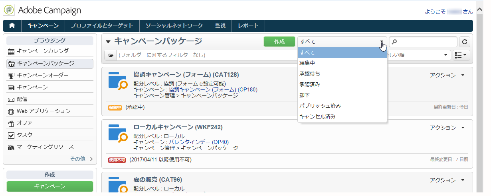

## パッケージの編集 {#edit-packages}

The **[!UICONTROL Campaign packages]** page lets you view the summary of each package.

概要には、ラベル、キャンペーンのタイプのほか、パッケージの作成元であるキャンペーン名、フォルダーの情報が含まれます。

編集するには、パッケージの名前をクリックします。ローカルエンティティ別またはステータス別に、オーダーを表示することもできます。

This information is also offered in the **[!UICONTROL Campaign orders]** view which lists all orders.

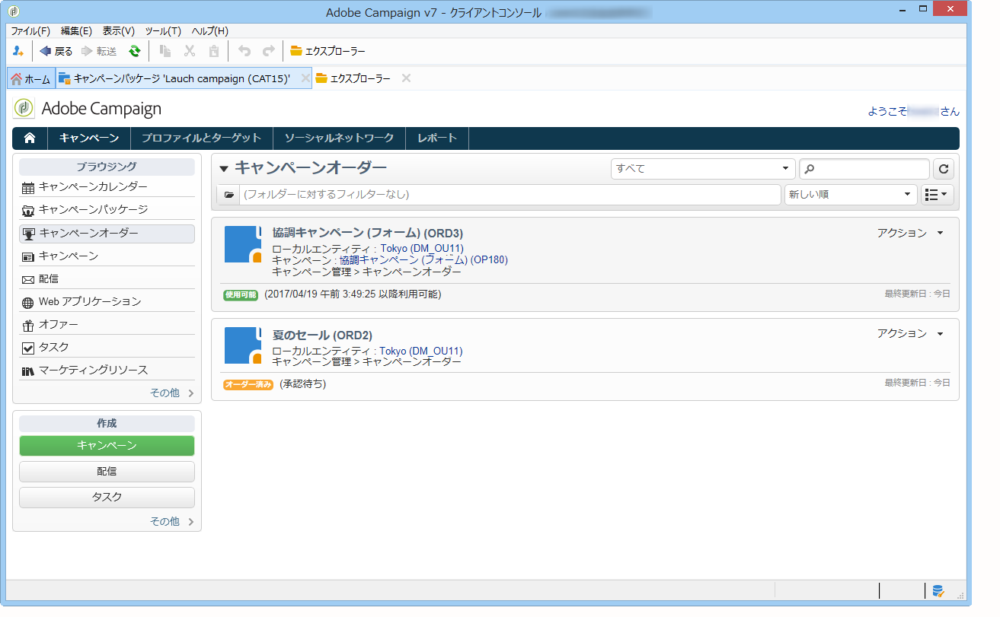

セントラルオペレーターは、それには、次の 2 つの方法があります。

1. 演算子は、注文名をクリックして編集できます。注文の詳細が表示されます。

   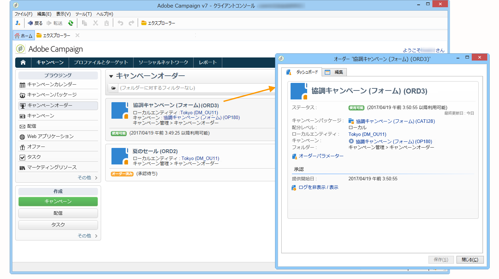

   The **[!UICONTROL Edit > General]** tab lets you view information entered by the local entity when it ordered the campaign.

   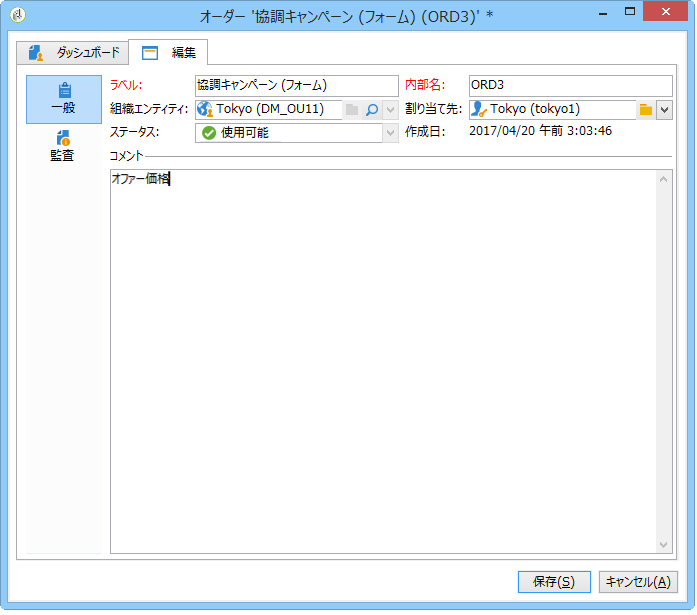

1. キャンペーンパッケージのラベルをクリックして編集を実行します。一部の設定の変更が可能です。

   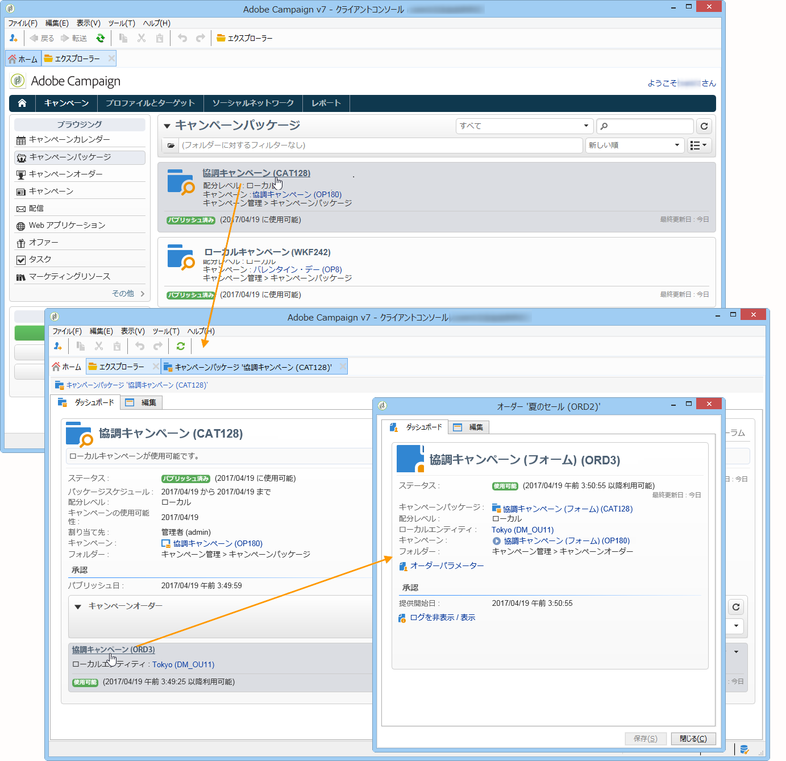

## パッケージのキャンセル {#cancel-a-package}

セントラルエンティティは、いつでもキャンペーンパッケージをキャンセルできます。

キャンペーン **[!UICONTROL Cancel]** パッケージ内をクリックしま **[!UICONTROL Dashboard]**&#x200B;す。

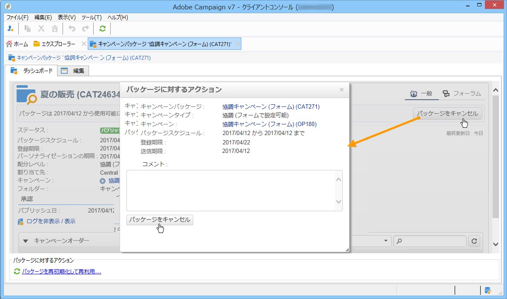

The **[!UICONTROL Comment]** field lets you justify the cancellation.

**ローカルキャンペーン**&#x200B;の場合は、使用可能なマーケティングキャンペーンのリストから、キャンセルされたパッケージが削除されます。

**協調キャンペーン**&#x200B;の場合は、パッケージをキャンセルすると、次の一連のアクションが実行されます。

1. このパッケージに関連付けられているオーダーが、すべてキャンセルされます。

   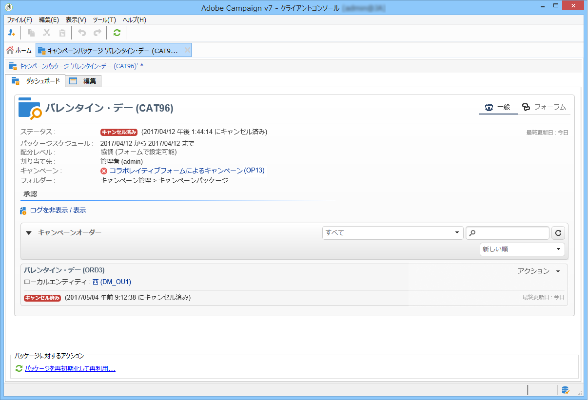

1. 参照キャンペーンがキャンセルされ、アクティブなプロセス（ワークフローや配信）がすべて停止されます。

   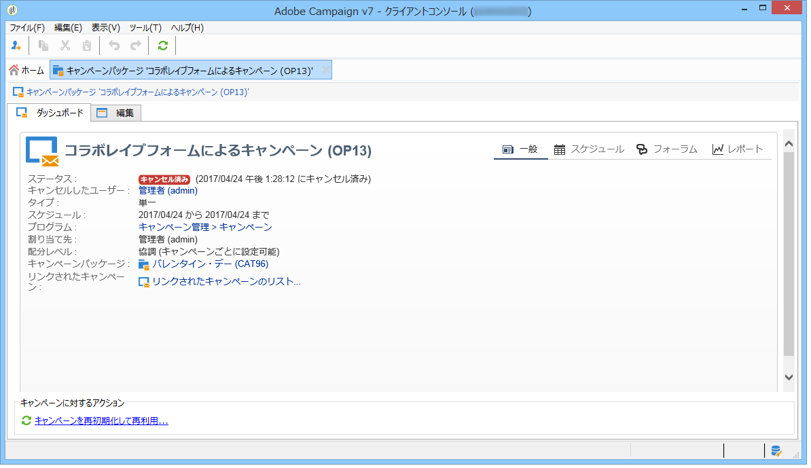

1. 関係するすべてのローカルエンティティに通知が送信されます。

   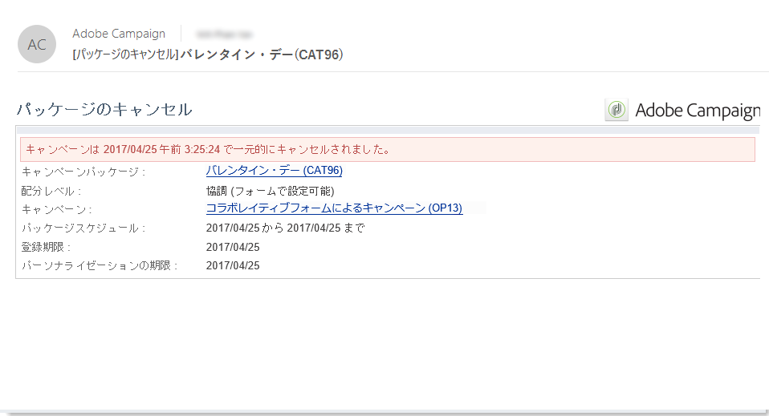

セントラルエンティティは、必要であればキャンセルされたパッケージにアクセスし、再初期化することができます（次の節を参照）。再初期化されたパッケージは、承認され、使用が開始されれば、再びローカルエンティティに提供できます。パッケージの再初期化の手順については、次の節で説明します。

## パッケージの再初期化 {#reinitializing-a-package}

パブリッシュ済みのキャンペーンパッケージは、再初期化し、修正を加えて、再びローカルエンティティに提供することができます。

1. 再初期化するパッケージを選択します。
1. リンクをクリック **[!UICONTROL Reinitialize the package to reuse it]** し、をクリックしま **[!UICONTROL OK]**&#x200B;す。

   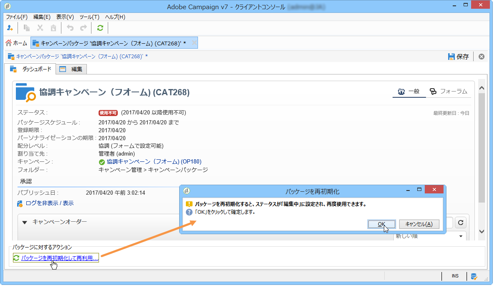

1. Click the **[!UICONTROL Save]** button to approve package re-initialization.

   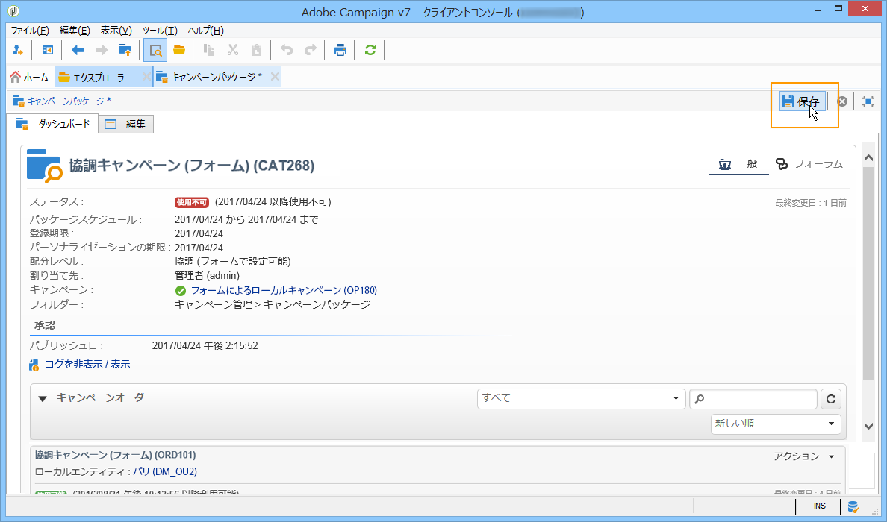

1. パッケージの状態がに変わりま **[!UICONTROL Being edited]**&#x200B;す。 パッケージに修正を加え、承認し、パブリッシュすると、そのパッケージは再びキャンペーンパッケージのリストに表示されます。

>[!NOTE]
>
>キャンセルしたキャンペーンパッケージを再初期化することもできます。

