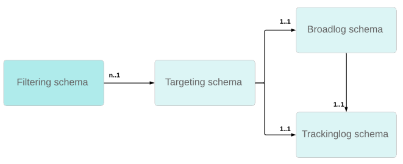

# カスタム受信者テーブルの使用{#about-custom-recipient-table}

この節では、カスタム（または外部）受信者テーブルを使用するための原則について詳しく説明します。

デフォルトでは、Adobe Campaignには組み込みの受信者テーブルが用意されており、標準の機能とプロセスがリンクされています。 組み込みの受信者テーブルには、拡張機能テーブルを使用して簡単に拡張できる多数の定義済みフィールドとテーブルがあります。

この拡張メソッドがテーブルを拡張するのに優れた柔軟性を提供する場合、テーブル内のフィールドまたはリンクの数を減らすことはできません。 非標準のテーブル、つまり「外部受信者テーブル」を使用すると、より柔軟になりますが、実装する際には特定の予防策が必要です。

この機能を使用すると、Adobe Campaign は外部データベースからのデータを処理することができ、このデータを配信用の一連のプロファイルとして利用できます。 このプロセスを実施するには、顧客のニーズに応じて、適切な判断が必要になる場合があります。 例：

* Adobe Campaign データベースとの間で更新ストリームがありません。このテーブルのデータは、それをホストするデータベースエンジンを介して直接更新できます。
* 既存のデータベースで動作するプロセスに変更はありません。
* 構造が非標準のプロファイルデータベースを使用します。様々な構造の様々なテーブルに保存されたプロファイルへの配信を、単一のインスタンスを使用しておこなう可能性があります。
* Adobe Campaign データベースを更新する際に、変更やメンテナンスは必要ありません。
* 組み込みの受信者テーブルは、ほとんどのテーブルフィールドが必要ない場合や、データベーステンプレートが受信者の中心にない場合は使用できません。
* 効率的に作業するには、多数のプロファイルがある場合は、フィールドの数が少ないテーブルが必要です。 組み込みの受信者テーブルには、この特定のケースに対するフィールドが多すぎます。

この節では、Adobe Campaignの既存のテーブルをマッピングするためのキーポイントと、任意のテーブルに基づいて配信を実行するために適用する設定について説明します。 最後に、組み込みの受信者テーブルで使用可能なクエリインターフェイスをユーザーに提供する方法について説明します。 このセクションで提示される資料を理解するには、画面とスキーマデザインの原則に関する十分な知識が必要です。

## 推奨事項と制限事項 {#recommendations-and-limitations}

カスタム受信者テーブルの使用には、次の制限があります。

* Adobe Campaignでは、同じブロードログやトラッキングログスキーマにリンクされた、ターゲティングスキーマと呼ばれる複数の受信者スキーマはサポートされていません。 そうしなければ、その後のデータ調整に異常が生じる可能性があります。

  以下の図は、カスタム受信者スキーマごとに必要なリレーショナル構造の詳細を示しています。
  

  私たちがお勧めします：

   * **[!UICONTROL nms:BroadLogRcp]**&#x200B;および&#x200B;**[!UICONTROL nms:TrackingLogRcp]** スキーマを標準の&#x200B;**[!UICONTROL nms:Recipientschema]**&#x200B;に割り当てます。 これらの2つのログテーブルは、追加のカスタム受信者テーブルにリンクしないでください。
   * 新しいカスタム受信者スキーマごとに、専用のカスタムブロードログとトラッキングログスキーマを定義します。 これは、ターゲットマッピングの設定時に自動的に実行できます。[ ターゲットマッピング ](../../configuration/using/target-mapping.md)を参照してください。

* 製品で提供されている標準の&#x200B;**[!UICONTROL サービスとサブスクリプション]**&#x200B;は使用できません。

  つまり、[このセクション ](../../delivery/using/managing-subscriptions.md)で詳細に説明されている全体的な操作は適用できません。

* **[!UICONTROL visitor]** テーブルのリンクが機能しません。

  したがって、**[!UICONTROL ソーシャルマーケティング]** モジュールを使用するには、正しいテーブルを参照するようにストレージステップを設定する必要があります。

  同様に、参照関数を使用する場合は、標準の初期メッセージ転送テンプレートを適応させる必要があります。

* リストにプロファイルを手動で追加することはできません。

  したがって、[このセクション ](../../platform/using/creating-and-managing-lists.md)で説明した手順は、追加の設定なしでは適用できません。

  >[!NOTE]
  >
  >ワークフローを使用して受信者リストを作成することもできます。 詳しくは、[ ワークフローを使用したプロファイルリストの作成](../../configuration/using/creating-a-profile-list-with-a-workflow.md)を参照してください。

また、様々なすぐに使用できる設定で使用されるデフォルト値を確認することをお勧めします。使用する機能に応じて、いくつかの適応を実行する必要があります。

例：

* 特定の標準レポート、特に&#x200B;**インタラクション**&#x200B;および&#x200B;**モバイルアプリケーション**&#x200B;によって提供されるレポートは、再開発する必要があります。 「[ レポートの管理](../../configuration/using/managing-reports.md)」セクションを参照してください。
* 特定のワークフローアクティビティのデフォルト設定は、標準受信者テーブル （**[!UICONTROL nms:recipient]**）を参照します。これらの設定は、外部受信者テーブルに使用する場合に変更する必要があります。 「[ ワークフローの管理](../../configuration/using/managing-workflows.md)」セクションを参照してください。
* 標準の&#x200B;**[!UICONTROL 購読解除リンク]** パーソナライゼーションブロックを適応させる必要があります。
* 標準配信テンプレートのターゲットマッピングを変更する必要があります。
* V4 フォームは、外部受信者テーブルと互換性がありません。web アプリケーションを使用する必要があります。
