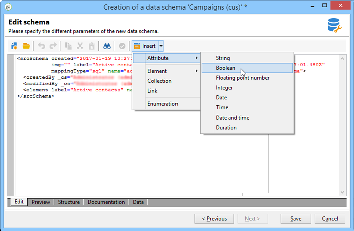

# スキーマエディションについて{#about-schema-edition}


Adobe Campaign では、次の目的でデータスキーマを使用しています。

* アプリケーション内のデータオブジェクトが基盤となるデータベーステーブルにどのように関連付けられるかの定義
* Campaign アプリケーション内での異なるデータオブジェクト間リンクの定義
* 各オブジェクトに含まれている個々のフィールドの定義と記述

Adobe Campaign キャンペーンの組み込みテーブルとそのやり取りについて詳しくは、[この節](https://helpx.adobe.com/jp/campaign/kb/acc-datamodel.html)を参照してください。

## スキーマの拡張または作成 {#extending-or-creating-schemas}

受信者テーブル (nms:recipient) など、Campaign のコアデータスキーマの 1 つにフィールド、インデックス、またはその他の要素を追加するには、そのスキーマを拡張する必要があります。 詳しくは、 [スキーマの拡張](../../configuration/using/extending-a-schema.md) 」セクションに入力します。

Adobe Campaign にあらかじめ用意されていないまったく新しい型のデータ（例：契約表）を追加するには、カスタムスキーマを直接作成します。 詳しくは、 [データスキーマ](../../configuration/using/data-schemas.md) 」セクションに入力します。


作業するスキーマを拡張または作成したら、ベストプラクティスは、次に示すのと同じ順序で XML コンテンツ要素を定義することです。

## 列挙 {#enumerations}

定義済みリストは、スキーマのメイン要素より先に定義します。 これにより、特定のフィールドに使用できる値のリストを表示して、ユーザーによる選択肢を制限することができます。

例：

```
<enumeration basetype="byte" name="exTransactionTypeEnum" default="store">
<value label="Website" name="web" value="0"/>
<value label="Call Center" name="phone" value="1"/>
<value label="In Store" name="store" value="2"/>
</enumeration>
```

フィールドを定義する際は、次のような定義済みリストを使用できます。

```
<attribute desc="Type of Transaction" label="Transaction Type" name="transactionType" 
type="string" enum="exTransactionTypeEnum"/>
```

>[!NOTE]
>
>ユーザーが管理する定義済みリスト（通常は&#x200B;**[!UICONTROL 管理]**／**[!UICONTROL プラットフォーム]**&#x200B;の下にあり）を使用して、特定のフィールドの値を指定することもできます。これらは事実上グローバルな定義済みリストであり、作業している特定のスキーマ以外で使用する場合にも役立ちます。

列挙について詳しくは、 [列挙](../../configuration/using/schema-structure.md#enumerations) および [`<enumeration>` 要素](../../configuration/using/schema/enumeration.md) セクション。

## インデックス {#index}

インデックスは、スキーマのメイン要素で宣言された最初の要素です。

一意である場合もそうでない場合も、1 つ以上のフィールドを参照します。

例：

```
<dbindex name="email" unique="true">
  <keyfield xpath="@email"/>
</dbindex>
```

```
<dbindex name="lastNameAndZip">
  <keyfield xpath="@lastName"/>
  <keyfield xpath="location/@zipCode"/>
</dbindex>
```

この **xpath** 属性は、インデックスを作成するスキーマ内のフィールドを指します。

>[!IMPORTANT]
>
>インデックスが提供する SQL クエリ読み取りパフォーマンスの向上には、レコードの書き込み時のパフォーマンスヒットも伴うことを覚えておくことが重要です。 したがって、インデックスは用心して使用する必要があります。

インデックスについて詳しくは、 [インデックス付きのフィールド](../../configuration/using/database-mapping.md#indexed-fields) 」セクションに入力します。

## キー {#keys}

各テーブルには少なくとも 1 つのキーが必要で、多くの場合、を使用してスキーマのメイン要素で自動的に確立されます。 **@autopk=true** 属性が「true」に設定されている場合にのみ有効です。

プライマリキーは、**internal** 属性を使用して定義することもできます。

例：

```
<key name="householdId" internal="true">
  <keyfield xpath="@householdId"/>
</key>
```

この例では、 **@autopk** 属性独自の「householdId」プライマリキーを指定する「id」という名前のデフォルトのプライマリキーを作成します。

>[!IMPORTANT]
>
>スキーマを新しく作成するときや、スキーマを拡張するときは、スキーマ全体で同じプライマリキーのシーケンス値（@pkSequence）を保持する必要があります。

キーについて詳しくは、 [キーの管理](../../configuration/using/database-mapping.md#management-of-keys) 」セクションに入力します。

## 属性（フィールド） {#attributes--fields-}

属性を使用すると、データオブジェクトを構成するフィールドを定義できます。 スキーマエディションのツールバーの「**[!UICONTROL 挿入]**」ボタンを使用すると、カーソルのある XML に空の属性テンプレートをドロップできます。詳しくは、 [データスキーマ](../../configuration/using/data-schemas.md) 」セクションに入力します。



属性の完全なリストは、 [`<attribute>` 要素](../../configuration/using/schema/attribute.md) 」セクションに入力します。 よく使用される属性の一部を次に示します。

* **@advanced**
* **@dataPolicy**
* **@デフォルト**
* **@desc**
* **@enum**
* **@expr**
* **@label**
* **@length**
* **@name**
* **@notNull**
* **@required**
* **@ref**
* **@xml**
* **@タイプ**

   様々なデータベース管理システムに対して、Adobe Campaignで生成されるデータタイプのマッピングの一覧表を表示するには、 [Adobe Campaign/DBMS データのタイプのマッピング](../../configuration/using/schema-structure.md#mapping-the-types-of-adobe-campaign-dbms-data) 」セクションに入力します。

各属性について詳しくは、 [属性の説明](../../configuration/using/schema/attribute.md) 」セクションに入力します。

### 例 {#examples}

デフォルト値の定義例：

```
<attribute name="transactionDate" label="Transaction Date" type="datetime" default="GetDate()"/>
```

必須のマークも付けるフィールドのテンプレートとして共通属性を使用する例：

```
<attribute name="mobile" label="Mobile" template="nms:common:phone" required="true" />
```

“”**@advanced** 属性を使用して非表示にする計算フィールドの例。

```
<attribute name="domain" label="Email domain" desc="Domain of recipient email address" expr="GetEmailDomain([@email])" advanced="true" />
```

**@dataPolicy** 属性を持ち、SQL フィールドにも格納される XML フィールドの例。

```
<attribute name="secondaryEmail" label="Secondary email address" length="100" xml="true" sql="true" dataPolicy="email" />
```

>[!IMPORTANT]
>
>ほとんどの属性はデータベースの物理フィールドに 1-1 カーディナリティに従ってリンクされますが、これは XML フィールドや計算フィールドには該当しません。\
>XML フィールドは、テーブルのメモ型フィールド（mData）に格納されます。\
>ただし、計算フィールドはクエリを起動するたびに動的に作成されるので、作用するレイヤーにのみ存在します。

## リンク {#links}

スキーマのメイン要素の中で最後の要素のいくつかはリンクです。 リンクは、インスタンス内の様々なスキーマを相互にどのように関連付けるかを定義します。

リンクは、リンク先のテーブルの&#x200B;**外部キー**&#x200B;を含んだスキーマで宣言します。

カーディナリティには、1-1、1-N、N-N の 3 つのタイプがあります。デフォルトで使用するのは 1-N タイプです。

### 例 {#examples-1}

受信者テーブル（標準提供のスキーマ）とカスタムトランザクションテーブルの間の 1 - N リンクの例：

```
<element label="Recipient" name="lnkRecipient" revLink="lnkTransactions" target="nms:recipient" type="link"/>
```

カスタムスキーマ「Car」（「cus」名前空間内）と受信者テーブルの間の 1 - 1 リンクの例：

```
<element label="Car" name="lnkCar" revCardinality="single" revLink="recipient" target="cus:car" type="link"/>
```

受信者テーブルと、プライマリキーでないメールアドレスで構成されるアドレステーブルとの外部結合の例：

```
<element name="emailInfo" label="Email Info" revLink="recipient" target="nms:address" type="link" externalJoin="true">
  <join xpath-dst="@address" xpath-src="@email"/>
</element>
```

「xpath-dst」はターゲットスキーマのプライマリキーに対応し、「xpath-src」はソーススキーマの外部キーに対応します。

## 監査記録 {#audit-trail}

スキーマの最後に含めると便利な要素の 1 つは、トラッキング要素（監査記録）です。

次の例を使用すると、テーブル内のすべてのデータの作成日、作成者、最終更新日、最終更新者に関するフィールドを含めることができます。

```
<element aggregate="xtk:common:auditTrail" name="auditTrail"/>
```

## データベース構造の更新 {#updating-the-database-structure}

変更を完了して保存したらデータベースに適用する必要がありますが、この変更は SQL 構造に影響を与える可能性があります。これをおこなうには、データベース更新ウィザードを使用します。


詳しくは、[データベース構造の更新](../../configuration/using/updating-the-database-structure.md)の節を参照してください。

>[!NOTE]
>
>変更がデータベース構造に影響を与えない場合は、スキーマを再生成するだけです。 それには、更新するスキーマを選択し、右クリックして&#x200B;**[!UICONTROL アクション／選択したスキーマを再生成...]**&#x200B;を選択します。詳しくは、 [スキーマの再生成](../../configuration/using/regenerating-schemas.md) 」セクションに入力します。
