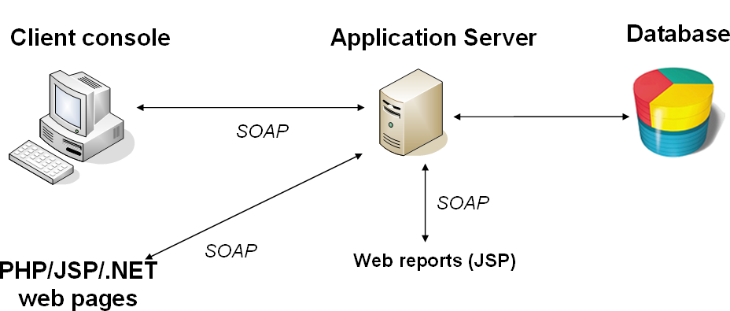
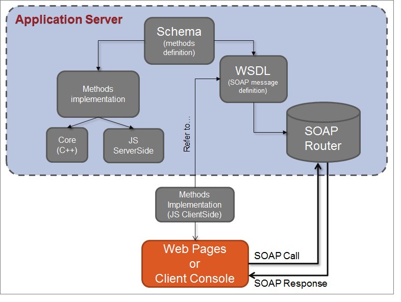

# Web サービスについて{#about-web-services}

## Adobe Campaign APIの定義 {#definition-of-adobe-campaign-apis}

Adobe Campaignアプリケーションサーバーは、多様化し、複雑化する企業情報システムとのオープン性と容易な統合を目的として設計されています。

Adobe Campaign APIは、アプリケーション内のJavaScriptおよびアプリケーション外のSOAPで使用されます。 強化できる汎用関数のライブラリを構成します。 詳しくは、[SOAP メソッドの実装](../../configuration/using/implementing-soap-methods.md)を参照してください。

>[!IMPORTANT]
>
>1日あたりの許可されたエンジンコール数は、ライセンス契約によって異なります。 詳しくは、[このページ](https://helpx.adobe.com/jp/legal/product-descriptions/adobe-campaign-classic---product-description.html)を参照してください。\
>完全な説明を含むすべてのAPIのリストは、[この専用ドキュメント ] （https://experienceleague.adobe.com/developer/campaign-api/api/index.html）で入手できます。

## 前提条件 {#prerequisites}

Adobe Campaign APIを使用する前に、次のトピックに精通している必要があります。

* JavaScript
* SOAP プロトコル
* Adobe Campaign データモデル

## Adobe Campaign APIの使用 {#using-adobe-campaign-apis}

Adobe Campaignでは、次の2種類のAPIを使用します。

* データモデルデータをクエリするための汎用データアクセス API。 [データ指向 API](../../configuration/using/data-oriented-apis.md) を参照してください。
* 配信、ワークフロー、サブスクリプションなど、各オブジェクトに対してアクションを実行できるビジネス固有のAPI。[ ビジネス向けAPI](../../configuration/using/business-oriented-apis.md)を参照してください。

APIを開発し、Adobe Campaignとやり取りするには、データモデルに精通している必要があります。 Adobe Campaignでは、ベースの詳細な説明を生成できます。 モデルの[説明](../../configuration/using/data-oriented-apis.md#description-of-the-model)を参照してください。

## SOAP 呼び出し {#soap-calls}

SOAP プロトコルでは、リッチクライアント、webservicesを使用したサードパーティアプリケーション、またはこれらのメソッドをネイティブに使用するJSPを介して、API メソッドを呼び出すことができます。



SOAP メッセージの構造は次のとおりです。

* メッセージの構造を定義する封筒，
* オプションのヘッダー，
* コールと応答に関する情報を含む本文。
* エラー条件を定義するエラー管理。

## 資源と交流 {#resources-and-exchanges}

次のスキーマは、Adobe Campaign APIの使用に関する様々なリソースを示しています。



## 「ExecuteQuery」メソッドでのSOAP メッセージの例 {#example-of-a-soap-message-on-the--executequery--method--}

この例では、SOAP クエリが「ExecuteQuery」メソッドを呼び出します。このメソッドは、文字列を認証のパラメーター（セッショントークン）として取り出し、実行するクエリの説明のXML コンテンツを取り出します。

詳しくは、[ExecuteQuery （xtk:queryDef） ](../../configuration/using/data-oriented-apis.md#executequery--xtk-querydef-)を参照してください。

>[!NOTE]
>
>このサービスのWSDLの説明は、次の例で完了します。[Web サービスの説明：WSDL](../../configuration/using/web-service-calls.md#web-service-description--wsdl)。

### SOAP クエリ {#soap-query}

```
<?xml version='1.0' encoding='ISO-8859-1'?>
  <SOAP-ENV:Envelope xmlns:xsd='http://www.w3.org/2001/XMLSchema' xmlns:xsi='http://www.w3.org/2001/XMLSchema-instance' xmlns:ns='http://xml.apache.org/xml-soap' xmlns:SOAP-ENV='http://schemas.xmlsoap.org/soap/envelope/'>
    <SOAP-ENV:Body>
      <ExecuteQuery xmlns='urn:xtk:queryDef' SOAP-ENV:encodingStyle='http://schemas.xmlsoap.org/soap/encoding/'>
        <__sessiontoken xsi:type='xsd:string'/>
        <entity xsi:type='ns:Element' SOAP-ENV:encodingStyle='http://xml.apache.org/xml-soap/literalxml'>
          <queryDef firstRows="true" lineCount="200" operation="select" schema="nms:rcpGrpRel" startLine="0" startPath="/" xtkschema="xtk:queryDef">
          ...
          </queryDef>
        </entity>
      </ExecuteQuery>
  </SOAP-ENV:Body>
</SOAP-ENV:Envelope>
```

`<soap-env:envelope>`要素は、SOAP エンベロープを表すメッセージの最初の要素です。

`<soap-env:body>`要素は、エンベロープの最初の子要素です。 メッセージの説明、つまりクエリまたは応答の内容が含まれます。

呼び出されるメソッドは、SOAP メッセージの本文から`<executequery>`要素に入力されます。

SOAPでは、パラメーターは外観の順序で認識されます。 最初のパラメーター`<__sessiontoken>`は認証チェーンを取り、2番目のパラメーターは`<querydef>`要素からのクエリのXML説明です。

### SOAPの対応 {#soap-response}

```
<?xml version='1.0' encoding='ISO-8859-1'?>
  <SOAP-ENV:Envelope xmlns:xsd='http://www.w3.org/2001/XMLSchema' xmlns:xsi='http://www.w3.org/2001/XMLSchema-instance' xmlns:ns='http://xml.apache.org/xml-soap' xmlns:SOAP-ENV='http://schemas.xmlsoap.org/soap/envelope/'>
    <SOAP-ENV:Body>
      <ExecuteQueryResponse xmlns='urn:xtk:queryDef' SOAP-ENV:encodingStyle='http://schemas.xmlsoap.org/soap/encoding/'>
        <pdomOutput xsi:type='ns:Element' SOAP-ENV:encodingStyle='http://xml.apache.org/xml-soap/literalxml'>
          <rcpGrpRel-collection><rcpGrpRel group-id="1872" recipient-id="1362"></rcpGrpRel></rcpGrpRel-collection>
        </pdomOutput>
      </ExecuteQueryResponse>
    </SOAP-ENV:Body>
</SOAP-ENV:Envelope>
```

クエリの結果は`<pdomoutput>`要素から入力されます。

## エラー管理 {#error-management}

SOAPのエラー応答の例：

```
<?xml version='1.0' encoding='ISO-8859-1'?>
<SOAP-ENV:Envelope xmlns:SOAP-ENV='http://schemas.xmlsoap.org/soap/envelope/'>
  <SOAP-ENV:Body>
    <SOAP-ENV:Fault>
      <faultcode>SOAP-ENV:Server</faultcode>
      <faultstring>Error while executing 'Write' of the 'xtk:persist'.</faultstring> service
      <detail>ODBC error: [Microsoft][ODBC SQL Server Driver][SQL Server]Cannot insert duplicate key row in object 'XtkOption' with unique index 'XtkOption_name'. SQLSTate: 23000
ODBC error: [Microsoft][ODBC SQL Server Driver][SQL Server]The statement has been terminated. SQLSTate: 01000 Cannot save the 'Options (xtk:option)' document </detail>
    </SOAP-ENV:Fault>
  </SOAP-ENV:Body>
</SOAP-ENV:Envelope>
```

SOAP メッセージの本文の`<soap-env:fault>`要素は、Web サービスの処理中に発生するエラー信号を伝えるために使用されます。 これは、次のサブエレメントで構成されます。

* `<faultcode>`：エラーのタイプを示します。 エラータイプは次のとおりです。

   * 使用しているSOAPのバージョンと互換性がない場合は、「VersionMismatch」を選択します。
   * メッセージヘッダーで問題が発生した場合は、「MustUnderstand」を選択します。
   * &quot;Client&quot; クライアントに情報が欠落している場合は、
   * サーバーが処理の実行に問題がある場合、「サーバー」。

* `<faultstring>`：エラーを説明するメッセージ
* `<detail>`：長いエラーメッセージ

サービス呼び出しの成功または失敗は、`<faultcode>`要素の検証時に特定されます。

>[!IMPORTANT]
>
>すべてのAdobe Campaign Web サービスでエラーが処理されます。 したがって、返されるエラーを処理するために、各呼び出しをテストすることを強くお勧めします。

C#でのエラー処理の例：

```
try 
{
  // Invocation of method
  ...
}
catch (SoapException e)
{
  System.Console.WriteLine("Soap exception: " + e.Message);        
  if (e.Detail != null)
    System.Console.WriteLine(e.Detail.InnerText);
}
```

## Web サービスサーバー（またはEndPoint）のURL {#url-of-web-service-server--or-endpoint-}

Web サービスを送信するには、対応するサービスメソッドを実装するAdobe Campaign サーバーに連絡する必要があります。

サーバーのURLは次のとおりです。

https://serverName/nl/jsp/soaprouter.jsp

**`<server>`**&#x200B;を使用して、Adobe Campaign アプリケーションサーバー（**nlserver web**）。
