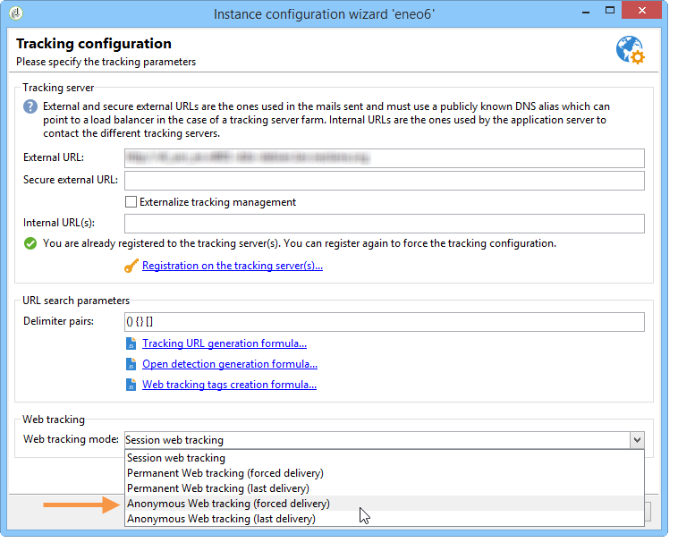
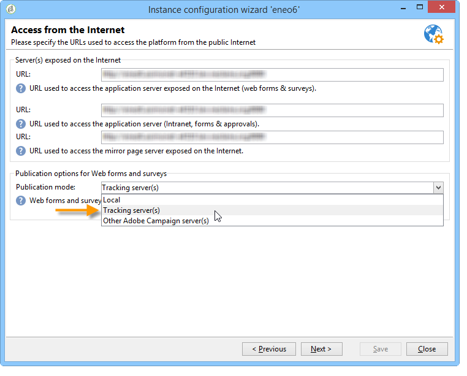

# 匿名トラッキング{#anonymous-tracking}

Adobe Campaignを利用すれば、収集したweb トラッキング情報を、ターゲットオーディエンスが匿名でサイトを閲覧したときに活用できます。 利用者がweb サイトのタグ付きページを閲覧すると、この閲覧情報が収集されます。これにより、Adobe Campaignから送信されたメールをクリックすると、その人が特定され、その人の情報が自動的にリンクされます。

>[!IMPORTANT]
>
>web サイトで匿名トラッキングを設定すると、大量のトラッキングログの収集がトリガーになり、データベースの運用に影響を与える可能性があります。 慎重に設定してください。\
>トラッキングログは、トラッキングデータが消去されるまでデータベースに保存されます。 デプロイメントウィザードを使用して、パージ頻度を設定します。 詳しくは、[この節](../../installation/using/deploying-an-instance.md#purging-data)を参照してください。

インスタンスで匿名Web トラッキングを有効にするには、次の要素を設定する必要があります。

* トラッキングサーバーの&#x200B;**serverConf.xml** ファイルの&#x200B;**redirection**&#x200B;要素の&#x200B;**trackWebVisitors** パラメーターを&#39;**true**&#39;に設定して、サイトを訪問した未知のインターネットユーザーのブラウザーに永続的なCookie （**uuid230**）を配置する必要があります。
* デプロイメントウィザードのトラッキング設定画面で、**匿名Web トラッキング** モードを選択する必要があります。

  

* Web フォームは、トラッキングサーバーで公開して実行する必要があります。 一致するオプションは、デプロイメントウィザードで選択する必要があります。

  
