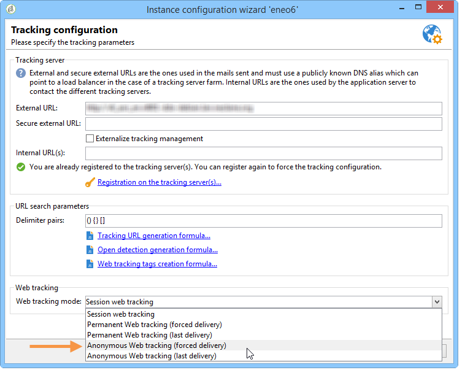

# 匿名トラッキング{#anonymous-tracking}

Adobe Campaignを使用すると、収集したWebトラッキング情報を受信者が匿名でサイトを閲覧する際に、受信者にリンクさせることができます。 ユーザーがWebサイトのタグ付きページを閲覧すると、この閲覧情報が収集され、Adobe Campaignから送信される電子メールをクリックすると、その情報が識別され、情報が自動的にリンクされます。

>[!CAUTION]
>
>Webサイトで匿名トラッキングを設定すると、大量のトラッキングログの収集がトリガーされ、データベースの操作に影響を与える可能性があります。 注意して設定します。\
>追跡ログは、追跡データが削除されるまでデータベースに保存されます。 展開ウィザードを使用して、削除の頻度を設定します。 詳しくは、[この節](../../installation/using/deploying-an-instance.md#purging-data)を参照してください。

インスタンスで匿名ウェブトラッキングを有効にするには、次の要素を設定する必要があります。

* トラッキングサーバーの **serverConf.xml****ファイルのリダイレクト要素のtrackWebVisitorsパラメーターは、インターネット訪問者不明のブラウザーに永続的なcookieを置くために、「************** trueTrue」に設定する必要があります。
* デプロイメ **ントウィザードのトラッキング設定画面で** 、匿名Webトラッキングモードを選択する必要があります。

   

* Webフォームと調査は、トラッキングサーバー上で発行し、実行する必要があります。 配置ウィザードで一致するオプションを選択する必要があります。

   

