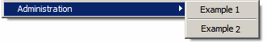

# Campaign エクスプローラーのナビゲーションツリーの設定{#configuration}

エキスパートユーザーは、エクスプローラーツリーにフォルダーを追加してカスタマイズできます。

Campaign のユーザーインターフェイスついて詳しくは、 [Adobe Campaign v8（コンソール）ドキュメント](https://experienceleague.adobe.com/ja/docs/campaign/campaign-v8/new/campaign-ui){target=_blank}を参照してください。

ナビゲーションリストで使用されるフォルダーのタイプは、**xtk:navtree** スキーマの文法に従うXML ドキュメントで説明されます。

XML ドキュメントは次のように構造化されています。

```
<navtree name="name" namespace="name_space">
  <!-- Global commands -->
  <commands>
      ...
  </commands>
  
  <!-- Structured space for adding a folder -->
  <model name="<name>" label="<Label>">
    <!-- Folder type -->
    <nodeModel>
      ...
    </nodeModel>
<model name="<name>" label="<Sub model>">
      ...
    </model>
  </model> 
</navtree>
```

XML ドキュメントには、**name**&#x200B;および&#x200B;**名前空間**&#x200B;属性を持つ&#x200B;**`<navtree>`** ルート要素が含まれており、ドキュメント名と名前空間を指定できます。 名前と名前空間は、ドキュメント識別キーを構成します。

アプリケーションのグローバルコマンドは、**`<commands>`**&#x200B;要素からドキュメント内で宣言されます。

ファイルタイプの宣言は、文書内で次の要素を持つ構造化されています：**`<model>`**&#x200B;と&#x200B;**`<nodemodel>`**。

## グローバルコマンド {#global-commands}

グローバルコマンドを使用すると、アクションを起動できます。 このアクションは、入力フォームまたはSOAP呼び出しにすることができます。

グローバルコマンドには、メインの&#x200B;**[!UICONTROL ツール]** メニューからアクセスできます。

コマンドの設定構造は次のとおりです。

```
<commands>
  <!-- Description of a command -->
  <command name="<name>" label="<label>" desc="<Description>" form="<form>" rights="<rights>">
    <soapCall name="<name>" service="<schema>">
      <param type="<type>" exprIn="<xpath>"/>  
        ...
    </soapCall>
    <enter>
      ...
    </enter>
  </command>
  <!-- Separator -->
  <command label="-" name="<name>"/>
  <!-- Command structure -->
  <command name="<name>" label="<Label>">
    <command...
  </command>
</commands>
```

グローバルコマンドの説明は、次のプロパティを持つ&#x200B;**`<command>`**&#x200B;要素に入力されます。

* **name**: コマンドの内部名：名前を入力して一意にする必要があります
* **label**: コマンドのラベル。
* **desc**: メイン画面のステータスバーに説明が表示されます。
* **form**：起動するフォーム：入力する値は、入力フォームの識別キー（例：「cus:recipient」）です
* **rights**：このコマンドへのアクセスを許可する名前付き権限のリスト（コンマで区切られます）。 使用可能な権限のリストには、**[!UICONTROL 管理/ アクセス管理/ ネームド権限]** フォルダーからアクセスできます。
* **promptLabel**: コマンドの実行前に確認ボックスを表示します。

**`<command>`**&#x200B;要素には、**`<command>`**&#x200B;個のサブ要素を含めることができます。 この場合、親エレメントを使用すると、これらの子エレメントで構成されるサブメニューを表示できます。

コマンドは、XML ドキュメントで宣言されているのと同じ順序で表示されます。

コマンド区切り記号を使用すると、コマンド間の区切り記号を表示できます。 これは、コマンドラベルに含まれる&#x200B;**&#39;-&#39;**&#x200B;値によって識別されます。

入力パラメーターを含む&#x200B;**`<soapcall>`** タグのオプションの存在は、実行するSOAP メソッドの呼び出しを定義します。 SOAP APIについて詳しくは、[Campaign JSAPI ドキュメント ](https://experienceleague.adobe.com/developer/campaign-api/api/index.html?lang=ja)を参照してください。

フォームのコンテキストは、初期化時に&#x200B;**`<enter>`** タグから更新できます。 このタグについて詳しくは、入力フォームに関するドキュメントを参照してください。

**例**：

* 「xtk:import」フォームを起動するためのグローバルコマンドの宣言：

  ```
  <command desc="Start the data import assistant" form="xtk:import" label="&amp;Data import..." name="import" rights="import,recipientImport"/>
  ```

  キーボードショートカットは、コマンドラベルに&#x200B;**&amp;**&#x200B;が含まれていることで、「I」文字で宣言されます。

* 区切り記号を含むサブメニューの例：

  

  ```
  <command label="Administration" name="admin">
    <command name="cmd1" label="Example 1" form="cus:example1"/>
    <command name="sep" label="-"/>
    <command name="cmd1" label="Example 2" form="cus:example2">
      <enter>
        <set xpath="@type" expr="1"/>
      </enter>
    </command>
  </command>
  ```

* SOAP メソッドの実行：

  ```
  <command name="cmd3" label="Example 3" promptLabel="Do you really want to execute the command?">
    <soapCall name="Execute" service="xtk:sql"/>
  </command>
  ```

## フォルダータイプ {#folder-type}

フォルダータイプを使用すると、スキーマのデータにアクセスできます。 フォルダーに関連付けられたビューは、リストと入力フォームで構成されます。

フォルダータイプの設定構造は次のとおりです。

```
<!-- Structured location to add the folder -->
<model name="name" label="Labelled">
  <!-- Type of folder -->
  <nodeModel name="<name>" label="<Labelled>" img="<image>">
    <view name="<name>" schema="<schema>" type="<listdet|list|form|editForm>">
      <columns>
        <node xpath="<field1>"/>
        ...
    </columns>
    </view> 
  </nodeModel>
  <model name="<name>" label="<Sous modèle>">
    ...
  </model>
</model>
```

フォルダータイプの宣言は、**`<model>`**&#x200B;要素の下に入力する必要があります。 この要素を使用すると、**[!UICONTROL 新しいフォルダーを追加]** メニューから表示される階層組織を定義できます。 **`<model>`**&#x200B;要素には、**`<nodemodel>`**&#x200B;要素とその他&#x200B;**`<model>`**&#x200B;要素を含める必要があります。

**name**&#x200B;属性と&#x200B;**label**&#x200B;属性により、要素の内部名と&#x200B;**[!UICONTROL 新しいフォルダーを追加]** メニューに表示されるラベルが入力されます。

**`<nodemodel>`**&#x200B;要素には、次のプロパティを持つフォルダータイプの説明が含まれています。

* **name**：内部名
* **label**: ラベルは、**[!UICONTROL 新しいフォルダーを追加]** メニューで使用され、フォルダーの挿入時にデフォルトラベルとして使用されます。
* **img**: フォルダー挿入時の既定の画像。
* **hiddenCommands**：マスクするコマンドのリスト（コンマで区切られます）。 使用可能な値は、「adbnew」、「adbsave」、「adbcancel」および「adbdup」です。
* **newFolderShortCuts**: フォルダー作成時のモデル （**`<nodemodel>`**&#x200B;をコンマで区切った）のショートカットのリスト。
* **insertRight**、**editRight**、**deleteRight**: フォルダーの挿入、編集、削除を行うための権限。

**`<nodemodel>`**&#x200B;要素の&#x200B;**`<view>`**&#x200B;要素には、ビューに関連付けられたリストの設定が含まれています。 リストのスキーマは、**`<view>`**&#x200B;要素の&#x200B;**スキーマ**&#x200B;属性に入力されます。

リストのレコードを編集するには、リストスキーマと同じ名前の入力フォームが暗黙的に使用されます。 **`<view>`**&#x200B;要素の&#x200B;**type**&#x200B;属性は、フォームの表示に影響します。 次のような値を選択できます。

* **listdet**: リストの下部にフォームを表示します。
* **list**: リストのみを表示します。 フォームは、リストを選択する際に、ダブルクリックするか、メニューの「開く」を介して起動されます。
* **form**：読み取り専用フォームを表示します。
* **editForm**：編集モードでフォームを表示します。

>[!NOTE]
>
>入力フォームの名前は、**`<view>`**&#x200B;要素に&#x200B;**form**&#x200B;属性を入力することでオーバーロードできます。

リスト列のデフォルト設定は、**`<columns>`**&#x200B;要素を介して入力されます。 スキーマで参照するフィールドを値として持つ&#x200B;**xpath**&#x200B;属性を含む&#x200B;**`<node>`**&#x200B;要素で列が宣言されます。

**例**: 「nms:recipient」スキーマでのフォルダータイプの宣言。

```
<model label="Profiles and targets" name="nmsProfiles">
  <nodeModel deleteRight="folderDelete" editRight="folderEdit" folderLink="folder"
             img="nms:folder.png" insertRight="folderInsert" label="Recipients"
             name="nmsFolder">
    <view name="listdet" schema="nms:recipient" type="listdet">
      <columns>
        <node xpath="@firstName"/>
        <node xpath="@lastName"/>
        <node xpath="@email"/>
        <node xpath="@account"/>
      </columns>
    </view>
  </nodeModel>
  <nodeModel name="nmsGroup" label="Groups"...
</model>
```

対応するフォルダー挿入メニュー：


フィルタリングと並べ替えは、リストの読み込み時に適用できます。

```
<view name="listdet" schema="nms:recipient" type="listdet">
  <columns>
    ...
  </columns>

  <orderBy>
    <node expr="@lastName" desc="true"/>
</orderBy>
  <sysFilter>
    <condition expr="@type = 1"/>
  </sysFilter>
</view>  
```

### ショートカットコマンド {#shortcut-commands}

ショートカットコマンドを使用すると、リストの選択時にアクションを起動できます。 アクションには、入力フォームまたはSOAP呼び出しが使用できます。

コマンドには、リストの&#x200B;**[!UICONTROL アクション]** メニューまたは関連するメニューボタンからアクセスできます。

コマンドの設定構造は次のとおりです。

```
<nodeModel...
  ...
  <command name="<name>" label="<label>" desc="<Description>" form="<form>" rights="<rights>">
    <soapCall name="<name>" service="<schema>">
      <param type="<type>" exprIn="<xpath>"/>  
        ...
    </soapCall>
    <enter>
      ...
    </enter>
  </command>
</nodeModel>
```

コマンドの説明は、次のプロパティを持つ&#x200B;**`<command>`**&#x200B;要素に入力されます。

* **name**: コマンドの内部名：名前を入力して一意にする必要があります。
* **label**: コマンドのラベル。
* **desc**: メイン画面のステータスバーに説明が表示されます。
* **form**：起動するフォーム：入力する値は、入力フォームの識別キー（例：「cus:recipient」）です。
* **rights**：このコマンドへのアクセスを許可する名前付き権限のリスト（コンマで区切られます）。 使用可能な権限のリストには、**[!UICONTROL 管理/ アクセス管理/ ネームド権限]** フォルダーからアクセスできます。
* **promptLabel**: コマンドの実行前に確認ボックスを表示します
* **monoSelection**: monoSelectionを強制的に選択します（デフォルトでは複数選択）。
* **refreshView**: コマンドの実行後にリストを強制的に再読み込みします。
* **enabledIf**：入力された式に応じてコマンドをアクティブ化します。
* **img**: リストツールバーからコマンドにアクセスできる画像を入力します。

**`<command>`**&#x200B;要素には、**`<command>`**&#x200B;個のサブ要素を含めることができます。 この場合、親エレメントを使用すると、これらの子エレメントで構成されるサブメニューを表示できます。

コマンドは、XML ドキュメントで宣言されているのと同じ順序で表示されます。

コマンド区切り記号を使用すると、コマンド間の区切り記号を表示できます。 これは、コマンドラベルに含まれる&#x200B;**&#39;-&#39;**&#x200B;値によって識別されます。

入力パラメーターを含む&#x200B;**`<soapcall>`** タグのオプションの存在は、実行するSOAP メソッドの呼び出しを定義します。 SOAP APIについて詳しくは、[Campaign JSAPI ドキュメント ](https://experienceleague.adobe.com/developer/campaign-api/api/index.html?lang=ja)を参照してください。

フォームのコンテキストは、初期化時に&#x200B;**`<enter>`** タグを使用して更新できます。 このタグについて詳しくは、入力フォームのドキュメントを参照してください。

**例**：

```
<command desc="Cancel execution of the job" enabledIf="EV(@status, 'running')"
         img="nms:difstop.bmp" label="Cancel..." name="cancelJob" 
         promptLabel="Do you really want to cancel this job?" refreshView="true">
  <soapCall name="Cancel" service="xtk:jobInterface"/>
</command>
<command label="-" name="sep1"/>
<command desc="Execute selected template" form="cus:form" lmonoSelection="true" name="executeModel"
         rights="import,export,aggregate">
  <enter>
    <set expr="0" xpath="@status"/>
  </enter>
</command>
```

### リンクされたフォルダー {#linked-folder}

フォルダー管理操作には、次の2種類があります。

1. フォルダーはビューです。リストには、スキーマに関連付けられたすべてのレコードが表示され、フォルダープロパティにシステムフィルタリングが入力される可能性があります。
1. フォルダーはリンクされています。リスト内のレコードは、フォルダーリンクで暗黙的にフィルタリングされます。

リンクされたフォルダーの場合、**`<nodemodel>`**&#x200B;要素の&#x200B;**folderLink**&#x200B;属性を入力する必要があります。 この属性には、データスキーマで設定されたフォルダー上のリンクの名前が含まれます。

データスキーマ内のリンクされたフォルダーの宣言の例：

```
<element default="DefaultFolder('nmsFolder', [@_folder-id])" label="Folder" name="folder" revDesc="Recipients in the folder" revIntegrity="define" revLabel="Recipients" target="xtk:folder" type="link"/>
```

「フォルダー」という名前のフォルダーのリンク上の&#x200B;**`<nodemodel>`**&#x200B;の設定は次のとおりです。

```
<nodeModel deleteRight="folderDelete" editRight="folderEdit" folderLink="folder"
  img="nms:folder.png" insertRight="folderInsert" label="Recipients" name="nmsFolder">
...
</nodeModel>
```
