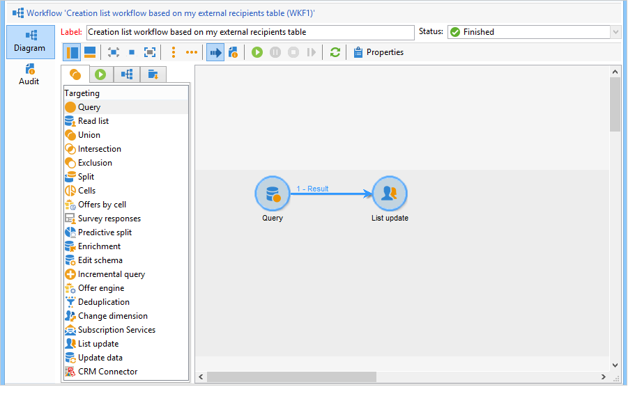

# ワークフローを使用したプロファイルリストの作成{#creating-a-profile-list-with-a-workflow}

新しい受信者テーブルに基づいて&#x200B;**[!UICONTROL リスト]**&#x200B;型リストを作成するには、リストを生成するターゲティングワークフローを作成する必要があります。

Campaignのリストについて詳しくは、[この節](../../platform/using/creating-and-managing-lists.md#about-lists-in-adobe-campaign)を参照してください。

 [ビデオでこの機能を確認する](../../platform/using/creating-and-managing-lists.md#create-list-in-a-wf-video)

ターゲティングワークフローを作成し、カスタム受信者テーブルで受信者を更新するには、次の手順に従います。

1. エクスプローラーの&#x200B;**[!UICONTROL プロファイルとターゲット/ジョブ/ターゲティングワークフロー]** ノードに移動します。
1. 新しいターゲティングワークフローを作成します。
1. **クエリ** アクティビティを配置し、その後&#x200B;**リスト更新** アクティビティを配置します。

   

1. **クエリ** アクティビティをダブルクリックし、**[!UICONTROL クエリを編集]**&#x200B;をクリックして、新しい受信者テーブルのスキーマに基づいてターゲティングディメンションを選択します（この例では&#x200B;**個人**）。 「**[!UICONTROL 完了]**」をクリックして確定します。

   

1. 「**リストの更新**」アクティビティをダブルクリックし、「必要に応じてリストを作成（計算名） **」ラジオボタンを選択します。**

   

1. 新しいリストの作成フォルダーを選択します。
1. ワークフローを実行してリストを作成します。
1. **[!UICONTROL リスト更新]** アクティビティ中に選択したツリーのノードの結果を表示します。

   ダッシュボードでは、次に示すように、リストの基となるスキーマを指定します。

   
