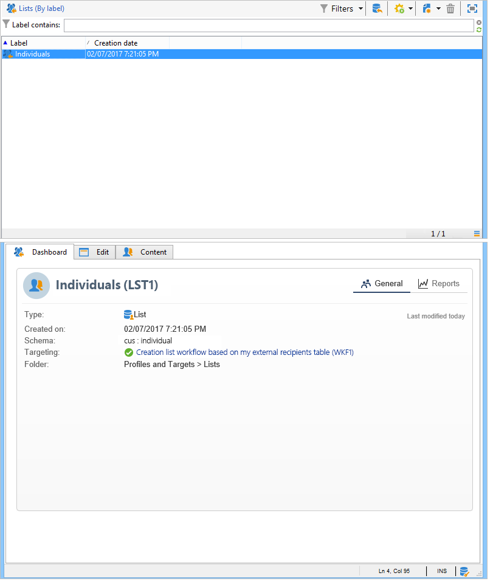

# ワークフローを使用したプロファイルリストの作成{#creating-a-profile-list-with-a-workflow}

新しい受信者テーブルに基づいて&#x200B;**[!UICONTROL リスト]**&#x200B;タイプのリストを作成するには、リストを生成するターゲットワークフローを作成する必要があります。

キャンペーンのリストの詳細については、[この](../../platform/using/creating-and-managing-lists.md#about-lists-in-adobe-campaign)を参照してください。

 [この機能をビデオで確認](../../platform/using/creating-and-managing-lists.md#create-list-in-a-wf-video)

ターゲットワークフローを作成し、カスタム受信者テーブルの受信者を更新するには、次の手順に従います。

1. エクスプローラーの&#x200B;**[!UICONTROL プロファイルとターゲット/ジョブ/ターゲットワークフロー]**&#x200B;ノードに移動します。
1. 新しいターゲティングワークフローを作成します。
1. **クエリ**&#x200B;アクティビティの後に&#x200B;**リストの更新**&#x200B;アクティビティを置きます。

   

1. **クエリ**&#x200B;アクティビティを重複クリックし、「**[!UICONTROL クエリ]**&#x200B;を編集」をクリックして、新しい受信者テーブルのスキーマに基づいてターゲティングディメンションを選択します（この例では次のようになります）。**個人**)。 「**[!UICONTROL 完了]**」をクリックして確定します。

   

1. **リストの更新**&#x200B;アクティビティを重複クリックし、「**[!UICONTROL 必要に応じてリストを作成（計算済みの名前）]**」ラジオボタンを選択します。

   

1. 新しいリストの作成フォルダーを選択します。
1. ワークフローを実行してリストを作成します。
1. **[!UICONTROL リストの更新]**&#x200B;アクティビティ中に選択したツリーのノードに結果を表示します。

   ダッシュボードは、次に示すように、リストの基になるスキーマを指定します。

   

