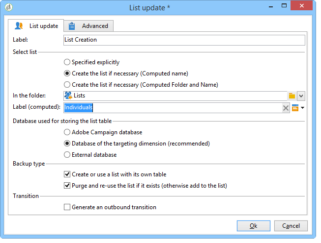

# ワークフローを使用したプロファイルリストの作成{#creating-a-profile-list-with-a-workflow}

新しいリストテーブルに基づいて **** リストタイプの受信者を作成するには、リストを生成するターゲットワークフローを作成する必要があります。

キャンペーンのリストの詳細については、 [この節を参照してください](../../platform/using/creating-and-managing-lists.md#about-lists-in-adobe-campaign)。

 [動画でこの機能を確認する](../../platform/using/creating-and-managing-lists.md#create-list-in-a-wf-video)

ターゲットワークフローを作成し、カスタム受信者テーブルの受信者を更新するには、次の手順に従います。

1. エクスプローラーの **[!UICONTROL プロファイルとターゲット/ジョブ/ワークフローのターゲット設定]** (Targeting Jobs)ノードに移動します。
1. 新しいターゲティングワークフローを作成します。
1. **クエリ** アクティビティを配置し、その後に **リスト更新** アクティビティを追加します。

   

1. クエリ **アクティビティを重複クリックし、「** クエリの **** 編集」をクリックして、新しい受信者テーブルのスキーマに基づいてターゲティングディメンションを選択します(例： **個人**)。 「**[!UICONTROL 完了]**」をクリックして確定します。

   

1. 重複で **リスト更新** アクティビティをクリックし、「必要に応じてリストを **[!UICONTROL 作成」（計算済み名）ラジオボタンを選択します]** 。

   

1. 新しいリストの作成フォルダーを選択します。
1. ワークフローを実行してリストを作成します。
1. 表示の更新 **[!UICONTROL アクティビティで選択したツリーのノードに結果を]** リストします。

   ダッシュボードは、次に示すように、リストの基になるスキーマを指定します。

   

