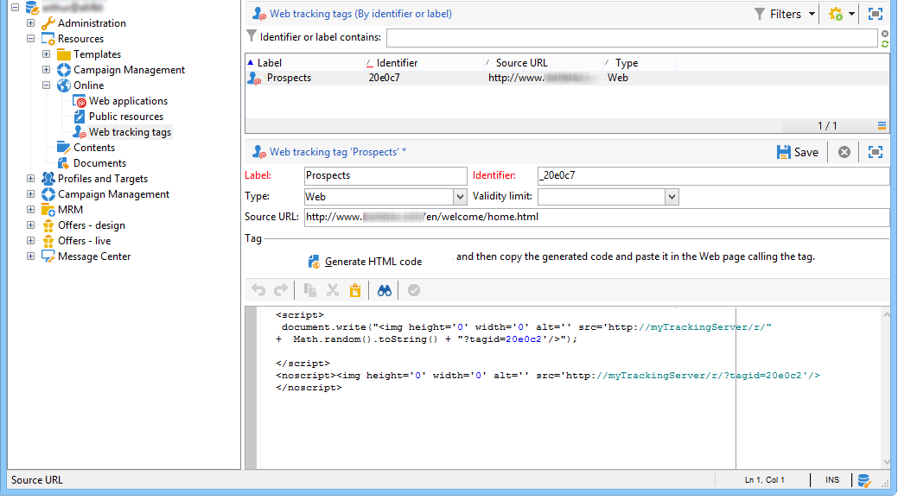

# Webトラッキングタグの作成{#creating-web-tracking-tags}

追跡するサイトの各ページは、Adobe Campaignプラットフォームで参照する必要があります。 この参照は、次の2つの方法で実行できます。

1. 追跡するURLの手動定義、
1. 追跡するURLのオンザフライ作成。

## アプリケーションで追跡するURLの定義 {#defining-the-urls-to-be-tracked-in-the-application}

この方法を使用すると、追跡するページを手動で定義し、関連するWebトラッキングタグの例を生成できます。 この操作は、クライアントコンソール **[!UICONTROL Campaign execution>Resources>Web tracking tags]** のノードで定義されます。



ページに挿入するHTMLコードを生成するには：

* タグのラベルを入力：これはトラッキングログに表示されます。
* ソースURLを指定します。このフィールドは情報を提供する目的であり、追跡するページを指定できます（オプション）。
* 必要に応じて、有効期間を入力します。
* 「 **[!UICONTROL Generate]** HTML code」をクリックします。

次に、生成したコードをコピーし、追跡するページに貼り付けます。

## 追跡するURLのオンザフライ作成 {#on-the-fly-creation-of-urls-to-be-tracked}

WebトラッキングURLは、 **tagidパラメーターの値に情報を追加することで、その場で作成で** きます。

* 追跡するページのタイプ：WEBの場合は&#39;w&#39;、トランザクションの場合は&#39;t&#39;、
* URLを作成する必要があるフォルダーの内部名です。

次の2つの情報は、文字&#39;|&#39;を追加して、追跡するページの識別子と連結する必要があります。

```
tagid=<identifier>|<type>|<foldername>
```

>[!IMPORTANT]
>
>tagidパラメーターをURLパラメーターとし **て使用する場合は** 、必ずその値をエンコードしてください。

**例**:トランザクションタイプのWebトラッキングURLの作成。

**http://myserver.adobe.com/r/a?tagid=home%7Ct%7CMyFolder**
