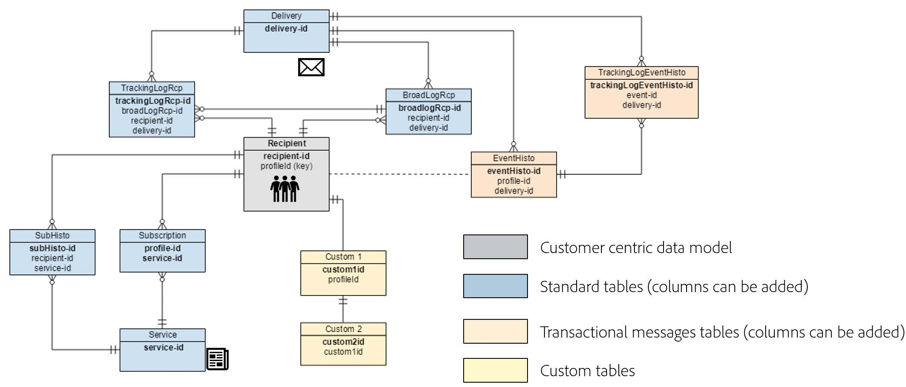
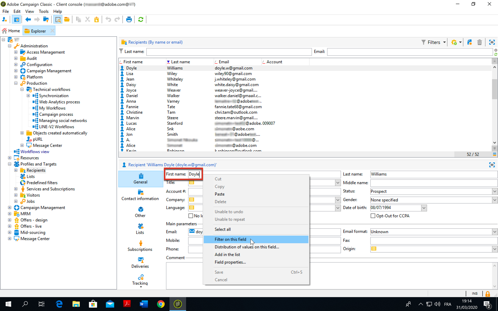
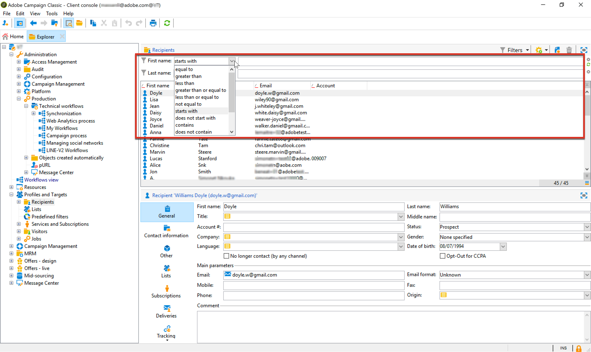
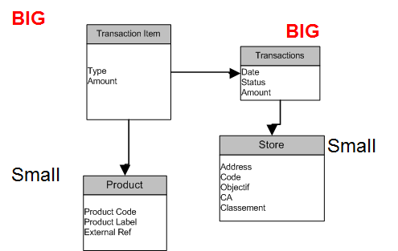

# データモデルのベストプラクティス{#data-model-best-practices}

このドキュメントでは、Adobe Campaign データモデルを設計する際の主なレコメンデーションの概要を説明します。

Campaignの組み込みテーブルとそのインタラクションについて詳しくは、[このセクション &#x200B;](../../configuration/using/about-data-model.md)の節を参照してください。

Campaign スキーマを使い始めるには、[このドキュメント &#x200B;](../../configuration/using/about-schema-reference.md)をお読みください。 Adobe Campaign データベースの概念データモデルを拡張するために拡張スキーマを設定する方法については、[このドキュメント &#x200B;](../../configuration/using/about-schema-edition.md)を参照してください。

## 概要 {#overview}

Adobe Campaignは非常に柔軟で、初期の実装を超えて拡張できます。 可能性は無限です。とはいえ、賢明な判断を下し、データモデルの設計を開始する前に強力な基盤を構築しておくことが不可欠です。

このドキュメントでは、Adobe Campaign ツールを適切に設計する方法を学ぶための一般的なユースケースとベストプラクティスについて説明します。

## データモデルアーキテクチャ {#data-model-architecture}

Adobe Campaign は強力なクロスチャネルキャンペーン管理システムであり、オンラインとオフラインのマーケティング戦略を融合して、パーソナライズされた顧客体験を作成できます。

### 顧客中心のアプローチ {#customer-centric-approach}

ほとんどのメールサービスプロバイダーは、リスト中心アプローチを使用して顧客と通信していますが、Adobe Campaign は、リレーショナルデータベースに基づいて、顧客と顧客の属性を幅広く視野に入れて活用しています。

顧客中心のアプローチを下の図に示します。 グレーの&#x200B;**受信者** テーブルは、すべての要素が構築されている主な顧客テーブルを表します。

各テーブルの記述にアクセスするには、**[!UICONTROL 管理／設定／データスキーマ]**&#x200B;に移動し、リストからリソースを選択して「**[!UICONTROL ドキュメント]**」タブをクリックします。

Adobe Campaignのデフォルトのデータモデルは、[このドキュメント &#x200B;](../../configuration/using/data-model-description.md)に記載されています。

>[!NOTE]
>
>Adobe Campaign Classicを使用すると、カスタム顧客テーブルを作成できます。 ただし、多くの場合、既に追加のテーブルと機能が事前に構築されている標準の[受信者テーブル &#x200B;](../../configuration/using/about-data-model.md#default-recipient-table)を活用することをお勧めします。

### Adobe Campaign 用データ {#data-for-campaign}

Adobe Campaign に送信すべきデータ マーケティングアクティビティに必要なデータを決定することがきわめて重要です。

>[!NOTE]
>
>Adobe Campaign はデータウェアハウスでもレポートツールでもありません。 可能性のある顧客とその関連情報をすべて Adobe Campaign にインポートしたり、レポートの作成にしか使用しないデータをインポートしたりしないように心がけます。

Adobe Campaign で必要な属性であるかどうかを判断するには、次のカテゴリのいずれかに該当するかどうかを確認します。

* **セグメント化**&#x200B;に使用する属性
* **データ管理プロセス**&#x200B;に使用する属性（集計計算など）
* **パーソナライゼーション**&#x200B;に使用する属性

これらのいずれにも該当しない場合、その属性は Adobe Campaign でまず必要にならないと思われます。

### データタイプの選択 {#data-types}

システムのアーキテクチャとパフォーマンスを適切な状態に保つには、次のベストプラクティスに従って Adobe Campaign のデータを設定します。

* 大きなテーブルには、主として数値フィールドや参照テーブルへのリンクを含みます（値のリストを扱う場合）。
* **expr** 属性を使用すると、テーブル内の物理的な設定値ではなく、計算フィールドとしてスキーマ属性を定義できます。 これにより、両方の値を保存することなく、別の形式（年齢や生年月日など）の情報にアクセスできます。 これにより、フィールドの重複を避けることができます。 例えば、ドメインはメールフィールドに既に存在するので、受信者テーブルでドメインの式を使用できます。
* ただし、式の計算が複雑な場合は、**expr** 属性を使用しないでください。検索時に計算すると、クエリのパフォーマンスに影響を与える可能性があるからです。
* **XML** 型を使用すると、作成するフィールドの数を減らすことができます。 ただし、データベース内で CLOB 列を使用するので、ディスク領域も消費します。 また、結果的に複雑な SQL クエリになり、パフォーマンスに影響を与える可能性もあります。
* **文字列**&#x200B;フィールドの長さは、常に列で定義する必要があります。 Adobe Campaign ではデフォルトの最大長は 255 ですが、データの最大長があらかじめわかっている場合は、フィールドの長さを短くすることをお勧めします。
* 参照元のシステム内のフィールドサイズが過大に見積もられていて、データはそれほど長くないことが確実な場合は、Adobe Campaign のフィールドを参照元のシステムのフィールドより短くしても構いません。 これにより、Adobe Campaign では短い文字列や小さい整数として扱うことができます。

### フィールドの選択 {#choice-of-fields}

ターゲティングやパーソナライゼーションに利用するフィールドは、テーブルに格納する必要があります。 つまり、フィールドがパーソナライズされた電子メールの送信に使用されたり、クエリの基準として使用されたりしない場合、ディスク領域を消費しますが、役に立ちません。

ハイブリッドインスタンスとオンプレミスのインスタンスの場合、FDA （外部データへのアクセスを可能にするオプション機能）は、キャンペーンプロセス中に「オンザフライ」フィールドを追加する必要性をカバーしています。 FDAを持っている場合は、すべてをインポートする必要はありません。 詳しくは、[Federated Data Accessについて](../../installation/using/about-fda.md)を参照してください。

### キーの選択 {#choice-of-keys}

ほとんどのテーブルでデフォルトで定義されている&#x200B;**autopk**&#x200B;に加えて、論理キーまたはビジネスキー（アカウント番号、クライアント番号など）を追加することを検討してください。 後でデータのインポートや紐付け、データパッケージに使用できます。 詳細については、[識別子](#identifiers)を参照してください。

パフォーマンスを高めるには、効率的なキーが不可欠です。 テーブルのキーとして常に推奨されるのは、数値データ型です。

SQLServer データベースの場合、パフォーマンスが必要な場合は「クラスター化インデックス」の使用を検討できます。 Adobeでは処理できないので、SQLで作成する必要があります。

### 専用テーブルスペース {#dedicated-tablespaces}

スキーマのtablespace属性を使用すると、テーブルに専用のテーブルスペースを指定できます。

インストールアシスタントを使用すると、オブジェクトをタイプ（データ、一時、およびインデックス）ごとに保存できます。

専用テーブルスペースは、パーティション化、セキュリティルールに適しており、柔軟で柔軟な管理、最適化、パフォーマンスが向上します。

## 識別子 {#identifiers}

Adobe Campaign リソースには 3 つの識別情報があり、別の識別情報を追加することもできます。

これらの識別子とその目的を次の表に示します。

| 識別子 | 説明 | ベストプラクティス |
|--- |--- |--- |
| ID | <ul><li>ID は、Adobe Campaign テーブルの物理的なプライマリキーです。 すぐに使用できるテーブルの場合は、シーケンスから生成された32 ビットの数値です</li><li>このIDは通常、特定のAdobe Campaign インスタンスに固有です。 </li><li>自動生成されたIDは、スキーマ定義で表示できます。 *autopk=&quot;true&quot;*&#x200B;属性を検索します。</li></ul> | <ul><li>自動生成された識別子は、ワークフローやパッケージ定義で参照として使用しないでください。</li><li>IDが常に増加するという仮定は行われません。</li><li>標準テーブルのIDは32 ビットの数値です。この型は変更しないでください。 この数値は、同じ名前のセクションでカバーされている「シーケンス」から取得されます。</li></ul> |
| 名前（または内部名） | <ul><li>この情報は、テーブル内のレコードの一意の識別子です。 この値は、通常は生成された名前で手動で更新できます。</li><li>この識別子は、Adobe Campaign の別のインスタンスにデプロイされたときにその値を保持し、空にはしないでください。</li></ul> | <ul><li>オブジェクトを環境から別の環境にデプロイする場合は、Adobe Campaignによって生成されるレコード名を変更します。</li><li>オブジェクトに名前空間属性（*スキーマ*&#x200B;など）がある場合、この共通の名前空間は、作成されたすべてのカスタムオブジェクトで活用されます。 一部の予約済み名前空間は使用しないでください：*nms*、*xtk*、*nl*、*ncl*、*crm*、*xxl*。</li><li>オブジェクトに名前空間（*workflow* や *delivery* など）がない場合、この名前空間は内部名オブジェクトの接頭辞として追加されます（*namespaceMyObjectName*）。</li><li>スペース「」、セミコロン「:」、ハイフン「 – 」などの特殊文字は使用しないでください。 これらの文字はすべて、アンダースコア「_」（許可されている文字）に置き換えられます。 例えば、「abc-def」と「abc:def」は「abc_def」として保存され、互いに上書きされます。</li></ul> |
| ラベル | <ul><li>ラベルは、Adobe Campaign 内のオブジェクトまたはレコードのビジネス識別子です。</li><li>このオブジェクトでは、スペースと特殊文字も使用できます。</li><li>レコードの一意性は保証されません。</li></ul> | <ul><li>オブジェクトラベルの構造を決定することをお勧めします。</li><li>これは、Adobe Campaign ユーザーにとって、レコードまたはオブジェクトを識別するための最も使いやすい解決策です。</li></ul> |

## カスタム内部キー {#custom-internal-keys}

プライマリキーは、Adobe Campaign で作成されるすべてのテーブルに必要です。

ほとんどの組織は、外部システムからレコードを読み込んでいます。 受信者テーブルの物理キーは「id」属性ですが、さらにカスタムキーを特定することもできます。

このカスタムキーは、Adobe Campaign にフィードする外部システムの実際のレコードのプライマリキーです。

標準テーブルにオートポックと内部キーの両方がある場合、内部キーは物理データベーステーブル内の一意のインデックスとして設定されます。

カスタムテーブルを作成する場合は、次の 2 つのオプションがあります。
* 自動生成されたキー（id）と内部キー（カスタム）の組み合わせ。 このオプションは、システムキーが複合キーであるか、整数ではない場合に役立ちます。 整数は、大きいテーブルで高いパフォーマンスを提供し、他のテーブルと結合できます。
* プライマリキーを外部システムのプライマリキーとして使用します。 この解決策は、異なるシステム間で一貫したキーを使用してデータのインポートとエクスポートのアプローチを簡素化するので、通常は推奨されます。 キーに「id」という名前が付けられ、外部値で入力されることが期待されている場合（自動生成されない場合）は、Autopkを無効にする必要があります。

>[!IMPORTANT]
>
>オートポックは、ワークフローの参照として使用しないでください。

## シーケンス {#sequences}

Adobe Campaignのプライマリキーは、すべての標準テーブルに対して自動生成されるidであり、カスタムテーブルに対しても同じである可能性があります。 詳しくは、[この節](#identifiers)を参照してください。

この値は、**シーケンス**&#x200B;と呼ばれる、数列の生成に使用されるデータベースオブジェクトから取得されます。

シーケンスには2つのタイプがあります。
* **共有**：複数のテーブルが同じシーケンスからIDを選択します。 つまり、ID 「X」が1つのテーブルで使用されている場合、同じシーケンスを共有する他のテーブルには、そのID 「X」を持つレコードはありません。 **XtkNewId**&#x200B;は、Adobe Campaignで使用できるデフォルトの共有シーケンスです。
* **専用**: シーケンスからIDを選択しているテーブルは1つだけです。 シーケンス名には通常、テーブル名が含まれます。

>[!IMPORTANT]
>
>シーケンスは32 ビットの整数値で、使用可能な値の最大数は21.4億です。 最大値に達した後、IDをリサイクルするために、シーケンスは0に戻ります。
>
>古いデータがパージされていない場合、その結果は一意のキー違反となり、プラットフォームの健全性と使用のブロッカーになります。 Adobe Campaignは（配信ログテーブルに影響を与える場合）通信を送信できず、パフォーマンスに大きな影響が及びます。

そのため、年間60億通の電子メールを送信し、ログの保持期間が180日の顧客では、4 カ月間でIDが不足してしまいます。 このような問題を回避するには、ボリュームに応じてパージ設定を行ってください。 詳しくは、[この節](#data-retention)を参照してください。

プライマリキーをautoPKとしてAdobe Campaignでカスタムテーブルを作成する場合、カスタム専用シーケンスはそのテーブルに体系的に関連付ける必要があります。

デフォルトでは、カスタムシーケンスの値は+1,000～+2.1BBの範囲になります。 技術的には、負のIDを有効にすることで、4BBの全範囲を取得することが可能です。 これは注意して使用する必要があり、負から正の数値に切り替えると1つのIDが失われます。レコード 0は通常、生成されたSQL クエリでAdobe Campaignによって無視されます。

シーケンスの消耗について詳しくは、[このビデオ &#x200B;](https://helpx.adobe.com/customer-care-office-hours/campaign/sequences-exhaustion-campaign-classic.html)をご覧ください。

## 索引 {#indexes}

パフォーマンスにはインデックスが不可欠です。 スキーマでキーを宣言すると、Adobeはキーのフィールドに対して自動的にインデックスを作成します。 また、キーを使用しないクエリのインデックスをさらに宣言することもできます。

Adobeでは、パフォーマンスが向上する可能性があるため、追加のインデックスを定義することをお勧めします。

ただし、次の点に注意してください。

* インデックスの使用は、アクセス パターンにバインドされます。 インデックス作成の最適化は、多くの場合、データベース設計の重要な部分であり、エキスパートが処理する必要があります。 インデックスの追加は、多くの場合、データベースのメンテナンスに添付された反復的なワークフローです。 これは、パフォーマンスの問題に対処するために、時間をかけてステップバイステップで行われます。
* インデックスは、（インデックス自体を格納するために）テーブル全体のサイズを大きくします。
* 列にインデックスを追加すると、データ読み取りアクセス（SELECT）のパフォーマンスが向上しますが、データ書き込みアクセス（UPDATE）のパフォーマンスが低下する可能性があります。
* これはデータの挿入時にパフォーマンスに影響を与えるため、インデックスのサイズと数を制限する必要があります。
* 必要のない場合はインデックスを追加しないでください。 必須であることを確認し、クエリの全体的なパフォーマンスを高めます（テストと学習）。
* 一般的に、クエリで10%を超えるレコードが返されないことが分かっている場合、インデックスは効率的です。
* 定義する必要があるインデックスを慎重に選択します。
* すぐに使用できるテーブルからネイティブインデックスを削除しないでください。

<!--When you are performing an initial import with very high volumes of data insert in Adobe Campaign database, it is recommended to run that import without custom indexes at first. It will allow to accelerate the insertion process. Once you've completed this important import, it is possible to enable the index(es).-->

### 例

インデックスの管理は非常に複雑になる可能性があるため、その仕組みを理解することが重要です。 この複雑さを説明するために、名前と姓を絞り込んで受信者を検索するなど、基本的な例を見てみましょう。 手順は次のとおりです。

1. データベース内のすべての受信者を一覧表示するフォルダーを参照します。
1. 「**[!UICONTROL 名]**」フィールドを右クリックします。
1. このフィールドの&#x200B;**[!UICONTROL フィルター]**&#x200B;を選択します。

   

1. **[!UICONTROL 姓]** フィールドに対してこの操作を繰り返します。

対応する2つのフィルターが画面の上に追加されます。

様々なフィルター条件に従って、**[!UICONTROL 名]**&#x200B;および&#x200B;**[!UICONTROL 姓]** フィールドで検索フィルターを実行できるようになりました。

これらのフィルターの検索を高速化するには、インデックスを追加します。 しかし、どのインデックスを使用する必要がありますか？

>[!NOTE]
>
>この例は、PostgreSQL データベースを使用してホストされている顧客に適用されます。

次の表は、最初の列に表示されるアクセスパターンに従って、以下の3つのインデックスが使用される場合と使用されない場合を示しています。

| 検索条件 | 索引1 （名+姓） | 索引2 （名のみ） | 索引3 （姓のみ） | コメント |
|--- |--- |--- |--- |--- |
| 名にジョニーを付ける | 使用済み | 使用済み | 未使用 | 名がインデックス 1の最初の位置にあるので、それでも使用されます。姓に基準を追加する必要はありません。 |
| 名が「Johnny」、姓が「Smith」に等しい | 使用済み | 未使用 | 未使用 | 両方の属性が同じクエリで検索されるため、両方の属性を組み合わせたインデックスのみが使用されます。 |
| 姓が「Smith」に等しい | 未使用 | 未使用 | 使用済み | インデックス内の属性の順序が考慮されます。 この順序に一致しない場合、インデックスは使用されない可能性があります。 |
| 名は「Joh」で始まります | 使用済み | 使用済み | 未使用 | 「左検索」を使用すると、インデックスが有効になります。 |
| 名の末尾に「nny」を付ける | 未使用 | 未使用 | 未使用 | 「右検索」はインデックスを無効にし、フルスキャンが実行されます。 一部の特定のインデックスタイプは、このユースケースを処理できますが、Adobe Campaignではデフォルトでは使用できません。 |
| 名に「John」が含まれています | 未使用 | 未使用 | 未使用 | これは、「左」検索と「右」検索の組み合わせです。 後者のために、インデックスを無効にし、フルスキャンが実行されます。 |
| 名に「john」を付ける | 未使用 | 未使用 | 未使用 | インデックスでは大文字と小文字が区別されます。 大文字と小文字を区別しないようにするには、「upper （firstname）」のようなSQL関数を含む特定のインデックスを作成する必要があります。 「unaccent （firstname）」などの他のデータ変換でも同じようにしてください。 |

## リンクとカーディナリティ {#links-and-cardinality}

### リンク {#links}

大きなテーブルでは、「own」整合性に注意してください。 「独自」の整合性でワイドテーブルを持つレコードを削除すると、インスタンスを停止できます。 テーブルはロックされ、削除は 1 つずつ行われます。 したがって、大型の子テーブルには「neutral」整合性を使用することをお勧めします。

リンクを外部結合として宣言すると、パフォーマンスが悪くなります。 ゼロ ID レコードは外部結合機能をエミュレートします。 リンクでオートポックが使用されている場合、外部結合を宣言する必要はありません。

ワークフロー内の任意のテーブルを結合できますが、リソース間の共通リンクをデータ構造の定義に直接定義することをお勧めします。

リンクは、テーブル内の実際のデータと整合するように定義する必要があります。 誤った定義は、レコードの予期しない複製など、リンクを介して取得したデータに影響を与える可能性があります。

リンクには、テーブル名と一致する名前を付けます。リンク名は遠隔テーブルの内容を理解するのに役立ちます。

「id」をサフィックスとして含む名前をリンクに付けないでください。 例えば、「transactionId」ではなく「transaction」という名前を付けます。

デフォルトでは、Adobe Campaign は外部テーブルのプライマリキーを使用してリンクを作成します。 わかりやすくするために、リンク定義で結合を明示的に定義することをお勧めします。

リンクで使用される属性にインデックスが追加されます。

作成者リンクと最終変更者リンクは、多くのテーブルに存在します。 この情報がビジネスで使用されていない場合は、リンク上の属性noDbIndexを使用してインデックスを無効にすることができます。

### カーディナリティ {#cardinality}

リンクを設計する場合は、1-1 関係が宣言されているときに、ターゲットレコードが一意になることを確認します。 そうでない場合は、結合の結果、1 つであるはずのレコードが複数返される可能性があります。 これにより、「クエリが想定以上の行を返す」場合、配信の準備中にエラーが発生します。 リンク名をターゲットスキーマと同じ名前に設定します。

(1) 側のスキーマにカーディナリティ(1-N) のリンクを定義します。 例えば、受信者 (1) - (N) トランザクションという関係は、トランザクションスキーマ内で定義してください。

デフォルトでは、リンクの逆カーディナリティは (N) なので注意してください。 リンク定義に revCardinality=&#39;single&#39; という属性を追加することで、リンク (1-1) を定義できます。

逆リンクをユーザーに表示しない場合は、リンク定義 revLink=&#39;_NONE_&#39; を使用して非表示にできます。 例えば、受信者から最後に完了したトランザクションへのリンクを定義する場合が、これに該当するユースケースです。 受信者から最後のトランザクションへのリンクのみ表示されればよく、トランザクションテーブルからの逆リンクを表示する必要はありません。

外部結合 (1-0..1) を実行するリンクは、システムのパフォーマンスに影響を与えるので、慎重に使用してください。

## データ保持 – クリーンアップとパージ {#data-retention}

Adobe Campaign はデータウェアハウスでもレポートツールでもありません。 したがって、Adobe Campaign ソリューションの高いパフォーマンスを確保するには、データベースの増大を抑制する必要があります。 これを達成するには、以下のベストプラクティスが役に立ちます。

デフォルトでは、Adobe Campaignの配信ログとトラッキングログの保持期間は180日です。 クリーンアッププロセスが実行され、それより古いログが削除されます。

* ログを長く保持する場合は、データベースのサイズと送信されるメッセージの量に応じて、この決定を慎重に行う必要があります。 注意として、Adobe Campaign シーケンスは32 ビットの整数です。
* これらの表では、利用可能なすべてのIDを使用するリスクを制限するために、一度に10億以上のレコード（21億4000万IDの約50%）を持つことをお勧めします。 これは、一部のお客様が180日を下回るリテンション期間を短縮する必要があります。

データ保持の詳細については、[&#x200B; キャンペーンプライバシーとセキュリティガイドライン &#x200B;](../../platform/using/privacy-and-recommendations.md)を参照してください。

Campaign データベースのクリーンアップ ワークフロー[について詳しくは、この節](../../production/using/database-cleanup-workflow.md)を参照してください。

>[!IMPORTANT]
>
>カスタムテーブルは標準のクリーンアップ処理で削除されません。 この処理は初日には必要ないとしても、パフォーマンス上の問題を引き起こす可能性があるので、カスタムテーブルのパージ処理を作成することを忘れないでください。

Adobe Campaign 内のレコードの必要性を最小限に抑えるには、いくつかの解決策があります。
* Adobe Campaign 外部の Data Warehouse にデータをエクスポートする。
* 使用するデータ容量が小さいながらもマーケティング活動には十分な集計値を生成する。 例えば、最後の購入を追跡することが目的であれば、Adobe Campaign の顧客トランザクション履歴をすべて残す必要はありません。

「deleteStatus」属性はスキーマで宣言できます。 レコードを削除済みとマークしてから、後でクリーンアップタスクで削除する方が効率的です。

## パフォーマンス {#performance}

常にパフォーマンスの向上を図るには、次のベストプラクティスに従います。

### 一般的なレコメンデーション {#general-recommendations}

* クエリでは「CONTAINS」などの演算子は使用しないでください。 フィルタリングしたい対象がはっきりしている場合は、「EQUAL TO」または他の特定のフィルター演算子を使用して同じ条件を適用します。
* ワークフローでデータを構築する際に、インデックスなしフィールドを使用した結合は避けてください。
* インポートやエクスポートなどのプロセスは営業時間外に行われるようにします。
* 日常のすべてのアクティビティがわかるスケジュールがあることを確認して、そのスケジュールに従います。
* 日常的なプロセスの 1 つまたはいくつかが失敗し、その同じ日に実行する必要がある場合があります。手動でプロセスを開始する際は、システムのパフォーマンスに影響を与える可能性があるので、競合するプロセスが実行されていないことを確認します。
* インポートプロセスを実行中、または手動プロセスを実行したときに、日常的なキャンペーンが実行されていないことを確認します。
* すべての行にフィールドを複製するのではなく、参照テーブルを使用します。 キーと値のペアを使用する場合は、数値キーを選択することをお勧めします。
* 短い文字列は引き続き使用できます。 参照テーブルが外部システムに配置されている場合、それを再利用すると、Adobe Campaign とのデータ統合が容易になります。

### 1 対多の関係 {#one-to-many-relationships}

* データ設計は使い勝手と機能性に影響を与えます。 1 対多の関係を多く持つデータモデルを設計すると、ユーザーがアプリケーション内で意味のあるロジックを作成するのが難しくなります。 マーケターが技術者でない場合は、1 対多のフィルターロジックを正しく理解して構築するのは困難なことがあります。
* 必須フィールドをすべて 1 つのテーブルにまとめておくと、クエリの作成が容易になります。 結合を回避できれば、テーブル間でいくつかのフィールドを複製することもパフォーマンス的には良い場合があります。
* オファーの重み付けの式や配信などのように、1 対多の関係を参照できないビルトイン機能もあります。

## 大きいテーブル {#large-tables}

Adobe Campaign は、サードパーティのデータベースエンジンを活用しています。 プロバイダーによっては、大きいテーブルに対するパフォーマンスを最適化するために、特定のデザインが必要になる場合があります。

大きいテーブルと複雑な結合を使用したデータモデルを設計する場合は、以下のような一般的なベストプラクティスに従う必要があります。

* 追加のカスタム受信者テーブルを使用する場合は、配信マッピングごとに専用のログテーブルを使用します。
* 列の数を減らします。特に、未使用の列を特定して削減します。
* 複雑な結合を回避して、データモデルのリレーションを最適化します。たとえば、複数の条件や複数の列に対する結合を回避します。
* 結合キーには、文字列ではなく常に数値データを使用します。
* ログを保持する深さをできる限り減らします。 深い履歴が必要な場合は、集計の計算やカスタムログテーブルの処理を行うと、大きな履歴を保存できます。

### テーブルのサイズ {#size-of-tables}

テーブルサイズは、レコード数とレコードあたりの列数の組み合わせです。 いずれも、クエリのパフォーマンスに影響を与える可能性があります。

* **小さいサイズ**&#x200B;のテーブルは、配信テーブルに似ています。
* **中程度のサイズ**&#x200B;のテーブルは、受信者テーブルと同じくらいのサイズです。 顧客 1 人につき 1 件のレコードがあります。
* **大きいサイズ**&#x200B;のテーブルは、広範ログテーブルに似ています。 1 人の顧客につき多くのレコードがあります。
例えば、データベースに 1,000 万人の受信者が含まれている場合、広範ログテーブルには 1 億件から 2 億件くらいのメッセージが格納され、配信テーブルには数千件のレコードが格納されます。

PostgreSQLでは、[TOAST](https://wiki.postgresql.org/wiki/TOAST) メカニズムを回避するために、行は8 KBを超えてはなりません。 したがって、システム（メモリとCPU）の最適なパフォーマンスを維持するために、列の数と各行のサイズをできるだけ減らしてみてください。

行数もパフォーマンスに影響します。 Adobe Campaign データベースは運用データベースであり、ターゲティングやパーソナライゼーションにあまり使用しない履歴データを格納するようには設計されていません。

行数の増加に伴うパフォーマンス上の問題を防ぐには、必要なレコードのみをデータベースに保存します。 その他のレコードは、サードパーティのデータウェアハウスにエクスポートし、Adobe Campaign 運用データベースから削除する必要があります。

テーブルサイズに関するベストプラクティスのいくつかを次に示します。

* フィールド数が少なく数値データが多い大きなテーブルを設計します。
* ブール値のような小さな数値を格納するために、大きなタイプの列（例：Int64）を使用しないでください。
* 未使用の列をテーブル定義から削除します。
* 履歴データや非アクティブなデータはエクスポートして消去し、Adobe Campaign データベースには保持しません。

次に例を示します。

この例では、
* *トランザクション*&#x200B;および&#x200B;*トランザクション アイテム*&#x200B;のテーブルが大きく、1,000万個を超えています。
* *製品*&#x200B;および&#x200B;*ストア*&#x200B;のテーブルが小さい：10,000未満です。
* 製品ラベルと参照が&#x200B;*製品* テーブルに配置されました。
* *取引項目* テーブルには、*製品* テーブルへのリンクのみが含まれています。このテーブルは数値です。
